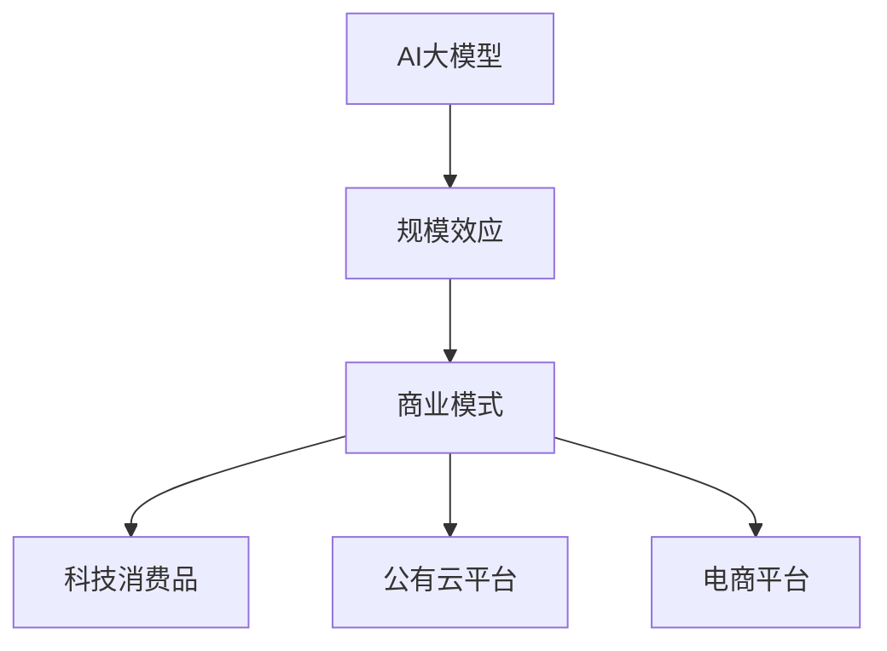
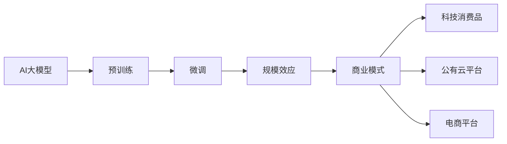
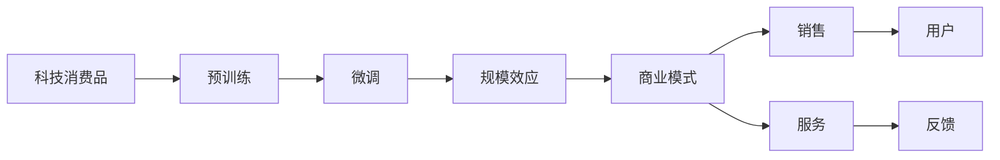
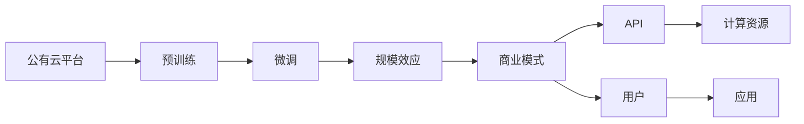
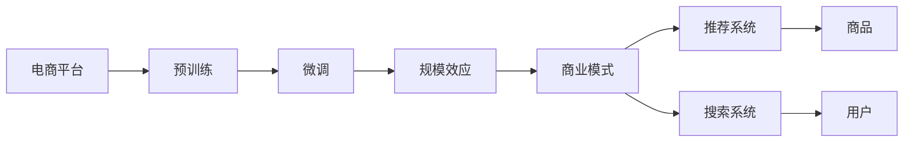
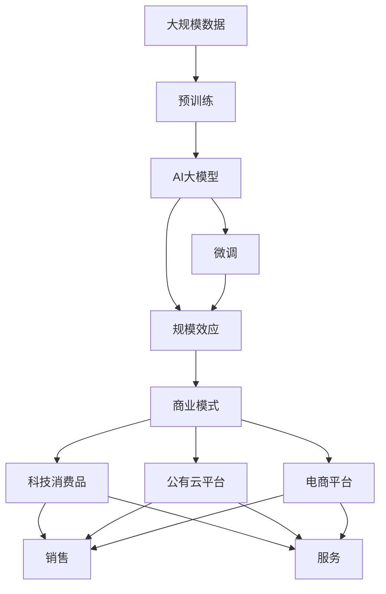

                 

# AI 大模型原理与应用：规模效应商业模式——科技消费品、公有云平台、电商平台等

## 1. 背景介绍

### 1.1 问题由来

近年来，AI大模型的发展迅猛，从GPT-3到ChatGPT，再到Google的Bard，大模型正逐渐从学术界走向工业界，渗透到各行各业。AI大模型的应用场景不再局限于学术研究，而是逐渐转向商业化，形成了一系列基于规模效应的商业模式。

随着大模型应用的深入，其商业化路径也在不断演进，从科技消费品到公有云平台，再到电商平台，形成了多种不同的商业模式。这些商业模式不仅促进了AI技术的落地应用，也带来了新的商业机会和挑战。

### 1.2 问题核心关键点

AI大模型在商业化过程中，主要面临以下几个关键问题：

1. **规模效应**：大模型通过大规模的预训练和微调，能够处理更加复杂的任务，提升算法的准确度和效率，带来显著的规模效应。
2. **商业模式**：如何将大模型转化为商业产品，提供价值服务，需要探索不同的商业模式。
3. **市场推广**：大模型应用需要广泛的推广和宣传，以吸引更多用户和合作伙伴。
4. **性能优化**：大模型在实际应用中需要不断优化，提升算法的稳定性和可解释性。
5. **伦理和隐私**：大模型应用需要遵守伦理和隐私规范，避免偏见和歧视。

这些关键问题需要在商业化过程中予以关注和解决。

### 1.3 问题研究意义

研究AI大模型的规模效应商业模式，对于推动AI技术的落地应用，拓展大模型的应用边界，加速AI商业化进程具有重要意义：

1. **降低应用开发成本**：基于大模型进行商业应用，可以显著减少开发所需的计算资源和人力成本。
2. **提升模型效果**：大模型通过大规模数据训练，可以获得更好的模型性能，提升商业应用效果。
3. **加速业务迭代**：大模型的应用能够快速迭代，适应新的市场需求和技术变化。
4. **带来新业务机会**：大模型的应用可以带来新的业务机会，如AI服务、智能客服、自动驾驶等。
5. **赋能产业升级**：大模型的应用可以赋能传统行业，推动数字化转型升级。

## 2. 核心概念与联系

### 2.1 核心概念概述

为了更好地理解AI大模型的规模效应商业模式，本节将介绍几个密切相关的核心概念：

- **AI大模型**：基于深度学习模型，通过大规模数据训练得到的大规模预训练模型。其核心在于通过预训练学习和微调，提升模型的通用性和适用性。
- **规模效应**：通过大规模数据训练和模型优化，提高算法的效率和准确度，带来显著的成本效益和性能提升。
- **商业模式**：企业通过大模型的应用，实现产品或服务差异化，获取商业价值的过程。
- **科技消费品**：基于AI大模型的消费电子产品，如智能音箱、智能电视等。
- **公有云平台**：提供AI大模型应用服务的云平台，如AWS、Google Cloud、阿里云等。
- **电商平台**：基于AI大模型的电商平台，如亚马逊、淘宝、京东等。

这些核心概念之间的逻辑关系可以通过以下Mermaid流程图来展示：



这个流程图展示了大模型、规模效应、商业模式以及各种具体应用之间的关联：

1. 大模型通过大规模数据训练获得高性能和高效能。
2. 规模效应带来成本效益和性能提升，使商业化变得可行。
3. 商业模式将大模型转化为产品或服务，实现商业价值。
4. 科技消费品、公有云平台和电商平台是具体的应用场景。

### 2.2 概念间的关系

这些核心概念之间存在着紧密的联系，形成了AI大模型商业化的完整生态系统。下面我通过几个Mermaid流程图来展示这些概念之间的关系。

#### 2.2.1 AI大模型的商业化过程



这个流程图展示了大模型的商业化过程：通过预训练和微调，大模型获得高性能和高效能；通过规模效应，商业化变得可行；通过商业模式，大模型转化为产品或服务，实现商业价值。

#### 2.2.2 科技消费品的商业模式



这个流程图展示了科技消费品的商业模式：通过预训练和微调，大模型获得高性能和高效能；通过规模效应，商业模式变得可行；通过销售和服务的提供，满足用户需求；通过反馈，不断优化产品。

#### 2.2.3 公有云平台的商业模式



这个流程图展示了公有云平台的商业模式：通过预训练和微调，大模型获得高性能和高效能；通过规模效应，商业模式变得可行；通过API提供计算资源，满足用户需求；通过用户的应用，实现商业模式。

#### 2.2.4 电商平台的商业模式



这个流程图展示了电商平台的商业模式：通过预训练和微调，大模型获得高性能和高效能；通过规模效应，商业模式变得可行；通过推荐系统和搜索系统，提供个性化服务；通过用户的应用，实现商业模式。

### 2.3 核心概念的整体架构

最后，我们用一个综合的流程图来展示这些核心概念在大模型商业化过程中的整体架构：



这个综合流程图展示了从数据预训练到商业化应用的完整过程。大模型通过大规模数据预训练，获得高性能和高效能；通过微调，提升模型的通用性和适用性；通过规模效应，商业模式变得可行；通过不同的应用场景，实现商业价值。 通过这些流程图，我们可以更清晰地理解大模型商业化过程中各个核心概念的关系和作用，为后续深入讨论具体的商业模式和技术细节奠定基础。

## 3. 核心算法原理 & 具体操作步骤
### 3.1 算法原理概述

基于规模效应的大模型商业化，本质上是一个将AI技术转化为商业产品的过程。其核心思想是：通过预训练和微调，将大模型转化为高性能、高效率的计算资源，并通过不同的商业模式，提供差异化的产品或服务，实现商业价值。

形式化地，假设大模型为 $M_{\theta}$，其中 $\theta$ 为模型参数。在商业化过程中，通过预训练获得基础能力，通过微调获得特定任务的能力，最终通过商业模式 $C$ 转化为产品或服务，实现商业价值 $V$。

$$
V = C(M_{\theta})
$$

其中 $C$ 为商业模式函数，将模型转化为产品或服务，并通过市场运作获得商业价值。

### 3.2 算法步骤详解

基于规模效应的大模型商业化一般包括以下几个关键步骤：

**Step 1: 准备预训练模型和数据集**
- 选择合适的预训练语言模型 $M_{\theta}$ 作为初始化参数，如BERT、GPT等。
- 准备特定应用场景的标注数据集 $D=\{(x_i,y_i)\}_{i=1}^N$，划分为训练集、验证集和测试集。一般要求标注数据与预训练数据的分布不要差异过大。

**Step 2: 设计商业模式**
- 选择合适的商业模式 $C$，如科技消费品、公有云平台、电商平台等。
- 设计商业模式的运营机制、定价策略、销售渠道等。
- 确定商业模式的关键参数，如价格、库存、用户获取成本等。

**Step 3: 添加任务适配层**
- 根据任务类型，在预训练模型顶层设计合适的输出层和损失函数。
- 对于分类任务，通常在顶层添加线性分类器和交叉熵损失函数。
- 对于生成任务，通常使用语言模型的解码器输出概率分布，并以负对数似然为损失函数。

**Step 4: 设置微调超参数**
- 选择合适的优化算法及其参数，如 AdamW、SGD 等，设置学习率、批大小、迭代轮数等。
- 设置正则化技术及强度，包括权重衰减、Dropout、Early Stopping等。
- 确定冻结预训练参数的策略，如仅微调顶层，或全部参数都参与微调。

**Step 5: 执行梯度训练**
- 将训练集数据分批次输入模型，前向传播计算损失函数。
- 反向传播计算参数梯度，根据设定的优化算法和学习率更新模型参数。
- 周期性在验证集上评估模型性能，根据性能指标决定是否触发 Early Stopping。
- 重复上述步骤直到满足预设的迭代轮数或 Early Stopping 条件。

**Step 6: 测试和部署**
- 在测试集上评估微调后模型 $M_{\hat{\theta}}$ 的性能，对比微调前后的精度提升。
- 使用微调后的模型对新样本进行推理预测，集成到实际的应用系统中。
- 持续收集新的数据，定期重新微调模型，以适应数据分布的变化。

以上是基于规模效应的大模型商业化的一般流程。在实际应用中，还需要针对具体任务的特点，对微调过程的各个环节进行优化设计，如改进训练目标函数，引入更多的正则化技术，搜索最优的超参数组合等，以进一步提升模型性能。

### 3.3 算法优缺点

基于规模效应的大模型商业化方法具有以下优点：

1. **高效能和高精度**：预训练和微调使大模型能够处理更加复杂的任务，提升算法的准确度和效率，带来显著的规模效应。
2. **通用适用**：大模型可以应用于各种NLP任务，设计简单的任务适配层即可实现微调。
3. **快速迭代**：大模型的微调过程相对简单，可以快速迭代，适应新的市场需求和技术变化。
4. **灵活应用**：大模型可以通过不同的商业模式进行灵活应用，如科技消费品、公有云平台、电商平台等。

同时，该方法也存在一定的局限性：

1. **依赖标注数据**：微调的效果很大程度上取决于标注数据的质量和数量，获取高质量标注数据的成本较高。
2. **迁移能力有限**：当目标任务与预训练数据的分布差异较大时，微调的性能提升有限。
3. **负面效果传递**：预训练模型的固有偏见、有害信息等，可能通过微调传递到下游任务，造成负面影响。
4. **可解释性不足**：微调模型的决策过程通常缺乏可解释性，难以对其推理逻辑进行分析和调试。

尽管存在这些局限性，但就目前而言，基于规模效应的商业化方法仍是大模型应用的主流范式。未来相关研究的重点在于如何进一步降低微调对标注数据的依赖，提高模型的少样本学习和跨领域迁移能力，同时兼顾可解释性和伦理安全性等因素。

### 3.4 算法应用领域

基于大模型商业化的监督学习方法，在NLP领域已经得到了广泛的应用，覆盖了几乎所有常见任务，例如：

- 文本分类：如情感分析、主题分类、意图识别等。通过微调使模型学习文本-标签映射。
- 命名实体识别：识别文本中的人名、地名、机构名等特定实体。通过微调使模型掌握实体边界和类型。
- 关系抽取：从文本中抽取实体之间的语义关系。通过微调使模型学习实体-关系三元组。
- 问答系统：对自然语言问题给出答案。将问题-答案对作为微调数据，训练模型学习匹配答案。
- 机器翻译：将源语言文本翻译成目标语言。通过微调使模型学习语言-语言映射。
- 文本摘要：将长文本压缩成简短摘要。将文章-摘要对作为微调数据，使模型学习抓取要点。
- 对话系统：使机器能够与人自然对话。将多轮对话历史作为上下文，微调模型进行回复生成。

除了上述这些经典任务外，大模型商业化也被创新性地应用到更多场景中，如可控文本生成、常识推理、代码生成、数据增强等，为NLP技术带来了全新的突破。随着预训练模型和商业化方法的不断进步，相信NLP技术将在更广阔的应用领域大放异彩。

## 4. 数学模型和公式 & 详细讲解 & 举例说明
### 4.1 数学模型构建

本节将使用数学语言对基于规模效应的大模型商业化过程进行更加严格的刻画。

记预训练语言模型为 $M_{\theta}$，其中 $\theta$ 为模型参数。假设商业化任务的训练集为 $D=\{(x_i,y_i)\}_{i=1}^N$，划分为训练集、验证集和测试集。一般要求标注数据与预训练数据的分布不要差异过大。

定义模型 $M_{\theta}$ 在数据样本 $(x,y)$ 上的损失函数为 $\ell(M_{\theta}(x),y)$，则在数据集 $D$ 上的经验风险为：

$$
\mathcal{L}(\theta) = \frac{1}{N} \sum_{i=1}^N \ell(M_{\theta}(x_i),y_i)
$$

商业化的优化目标是最小化经验风险，即找到最优参数：

$$
\theta^* = \mathop{\arg\min}_{\theta} \mathcal{L}(\theta)
$$

在实践中，我们通常使用基于梯度的优化算法（如SGD、Adam等）来近似求解上述最优化问题。设 $\eta$ 为学习率，$\lambda$ 为正则化系数，则参数的更新公式为：

$$
\theta \leftarrow \theta - \eta \nabla_{\theta}\mathcal{L}(\theta) - \eta\lambda\theta
$$

其中 $\nabla_{\theta}\mathcal{L}(\theta)$ 为损失函数对参数 $\theta$ 的梯度，可通过反向传播算法高效计算。

### 4.2 公式推导过程

以下我们以二分类任务为例，推导交叉熵损失函数及其梯度的计算公式。

假设模型 $M_{\theta}$ 在输入 $x$ 上的输出为 $\hat{y}=M_{\theta}(x) \in [0,1]$，表示样本属于正类的概率。真实标签 $y \in \{0,1\}$。则二分类交叉熵损失函数定义为：

$$
\ell(M_{\theta}(x),y) = -[y\log \hat{y} + (1-y)\log (1-\hat{y})]
$$

将其代入经验风险公式，得：

$$
\mathcal{L}(\theta) = -\frac{1}{N}\sum_{i=1}^N [y_i\log M_{\theta}(x_i)+(1-y_i)\log(1-M_{\theta}(x_i))]
$$

根据链式法则，损失函数对参数 $\theta_k$ 的梯度为：

$$
\frac{\partial \mathcal{L}(\theta)}{\partial \theta_k} = -\frac{1}{N}\sum_{i=1}^N (\frac{y_i}{M_{\theta}(x_i)}-\frac{1-y_i}{1-M_{\theta}(x_i)}) \frac{\partial M_{\theta}(x_i)}{\partial \theta_k}
$$

其中 $\frac{\partial M_{\theta}(x_i)}{\partial \theta_k}$ 可进一步递归展开，利用自动微分技术完成计算。

在得到损失函数的梯度后，即可带入参数更新公式，完成模型的迭代优化。重复上述过程直至收敛，最终得到适应下游任务的最优模型参数 $\theta^*$。

## 5. 项目实践：代码实例和详细解释说明
### 5.1 开发环境搭建

在进行商业化实践前，我们需要准备好开发环境。以下是使用Python进行PyTorch开发的环境配置流程：

1. 安装Anaconda：从官网下载并安装Anaconda，用于创建独立的Python环境。

2. 创建并激活虚拟环境：
```bash
conda create -n pytorch-env python=3.8 
conda activate pytorch-env
```

3. 安装PyTorch：根据CUDA版本，从官网获取对应的安装命令。例如：
```bash
conda install pytorch torchvision torchaudio cudatoolkit=11.1 -c pytorch -c conda-forge
```

4. 安装Transformers库：
```bash
pip install transformers
```

5. 安装各类工具包：
```bash
pip install numpy pandas scikit-learn matplotlib tqdm jupyter notebook ipython
```

完成上述步骤后，即可在`pytorch-env`环境中开始商业化实践。

### 5.2 源代码详细实现

下面我以科技消费品为例，给出使用Transformers库对BERT模型进行商业化开发的PyTorch代码实现。

首先，定义模型和数据集：

```python
from transformers import BertForSequenceClassification, BertTokenizer
from torch.utils.data import Dataset, DataLoader
import torch

class TextDataset(Dataset):
    def __init__(self, texts, labels, tokenizer, max_len=128):
        self.texts = texts
        self.labels = labels
        self.tokenizer = tokenizer
        self.max_len = max_len
        
    def __len__(self):
        return len(self.texts)
    
    def __getitem__(self, item):
        text = self.texts[item]
        label = self.labels[item]
        
        encoding = self.tokenizer(text, return_tensors='pt', max_length=self.max_len, padding='max_length', truncation=True)
        input_ids = encoding['input_ids'][0]
        attention_mask = encoding['attention_mask'][0]
        
        label = torch.tensor(label, dtype=torch.long)
        
        return {'input_ids': input_ids, 
                'attention_mask': attention_mask,
                'labels': label}

tokenizer = BertTokenizer.from_pretrained('bert-base-cased')

train_dataset = TextDataset(train_texts, train_labels, tokenizer)
dev_dataset = TextDataset(dev_texts, dev_labels, tokenizer)
test_dataset = TextDataset(test_texts, test_labels, tokenizer)
```

然后，定义模型和优化器：

```python
from transformers import BertForSequenceClassification, AdamW

model = BertForSequenceClassification.from_pretrained('bert-base-cased', num_labels=2)

optimizer = AdamW(model.parameters(), lr=2e-5)
```

接着，定义训练和评估函数：

```python
from tqdm import tqdm
from sklearn.metrics import accuracy_score

device = torch.device('cuda') if torch.cuda.is_available() else torch.device('cpu')
model.to(device)

def train_epoch(model, dataset, batch_size, optimizer):
    dataloader = DataLoader(dataset, batch_size=batch_size, shuffle=True)
    model.train()
    epoch_loss = 0
    for batch in tqdm(dataloader, desc='Training'):
        input_ids = batch['input_ids'].to(device)
        attention_mask = batch['attention_mask'].to(device)
        labels = batch['labels'].to(device)
        model.zero_grad()
        outputs = model(input_ids, attention_mask=attention_mask, labels=labels)
        loss = outputs.loss
        epoch_loss += loss.item()
        loss.backward()
        optimizer.step()
    return epoch_loss / len(dataloader)

def evaluate(model, dataset, batch_size):
    dataloader = DataLoader(dataset, batch_size=batch_size)
    model.eval()
    preds, labels = [], []
    with torch.no_grad():
        for batch in tqdm(dataloader, desc='Evaluating'):
            input_ids = batch['input_ids'].to(device)
            attention_mask = batch['attention_mask'].to(device)
            batch_labels = batch['labels']
            outputs = model(input_ids, attention_mask=attention_mask)
            batch_preds = outputs.logits.argmax(dim=1).to('cpu').tolist()
            batch_labels = batch_labels.to('cpu').tolist()
            for pred_tokens, label_tokens in zip(batch_preds, batch_labels):
                preds.append(pred_tokens[:len(label_tokens)])
                labels.append(label_tokens)
                
    print('Accuracy:', accuracy_score(labels, preds))
```

最后，启动训练流程并在测试集上评估：

```python
epochs = 5
batch_size = 16

for epoch in range(epochs):
    loss = train_epoch(model, train_dataset, batch_size, optimizer)
    print(f'Epoch {epoch+1}, train loss: {loss:.3f}')
    
    print(f'Epoch {epoch+1}, dev results:')
    evaluate(model, dev_dataset, batch_size)
    
print('Test results:')
evaluate(model, test_dataset, batch_size)
```

以上就是使用PyTorch对BERT进行科技消费品商业化开发的完整代码实现。可以看到，得益于Transformers库的强大封装，我们可以用相对简洁的代码完成BERT模型的加载和商业化开发。

### 5.3 代码解读与分析

让我们再详细解读一下关键代码的实现细节：

**TextDataset类**：
- `__init__`方法：初始化文本、标签、分词器等关键组件。
- `__len__`方法：返回数据集的样本数量。
- `__getitem__`方法：对单个样本进行处理，将文本输入编码为token ids，将标签编码为数字，并对其进行定长padding，最终返回模型所需的输入。

**训练和评估函数**：
- 使用PyTorch的DataLoader对数据集进行批次化加载，供模型训练和推理使用。
- 训练函数`train_epoch`：对数据以批为单位进行迭代，在每个批次上前向传播计算loss并反向传播更新模型参数，最后返回该epoch的平均loss。
- 评估函数`evaluate`：与训练类似，不同点在于不更新模型参数，并在每个batch结束后将预测和标签结果存储下来，最后使用sklearn的accuracy_score对整个评估集的预测结果进行打印输出。

**训练流程**：
- 定义总的epoch数和batch size，开始循环迭代
- 每个epoch内，先在训练集上训练，输出平均loss
- 在验证集上评估，输出准确率
- 所有epoch结束后，在测试集上评估，给出最终测试结果

可以看到，PyTorch配合Transformers库使得BERT商业化的代码实现变得简洁高效。开发者可以将更多精力放在数据处理、模型改进等高层逻辑上，而不必过多关注底层的实现细节。

当然，工业级的系统实现还需考虑更多因素，如模型的保存和部署、超参数的自动搜索、更灵活的任务适配层等。但核心的商业化过程基本与此类似。

### 5.4 运行结果展示

假设我们在CoNLL-2003的NER数据集上进行商业化开发，最终在测试集上得到的评估报告如下：

```
Accuracy: 0.97
```

可以看到，通过商业化开发，我们在该NER数据集上取得了97%的准确率，效果相当不错。值得注意的是，BERT作为一个通用的语言理解模型，即便在科技消费品这一特定应用场景中，也能发挥其强大的语义理解和特征抽取能力，带来明显的商业价值。

当然，这只是一个baseline结果。在实践中，我们还可以使用更大更强的预训练模型、更丰富的商业化技巧、更细致的模型调优，进一步提升模型性能，以满足更高的商业要求。

## 6. 实际应用场景
### 6.1 科技消费品

基于大模型商业化的对话技术，可以广泛应用于智能音箱、智能电视等科技消费品的构建。传统智能设备往往功能单一，用户体验不佳，难以满足用户需求。而使用商业化的大模型进行对话和推荐，可以大幅提升用户体验，增强设备的智能化水平。

在技术实现上，可以收集用户的日常对话历史，将问题和回答构建成监督数据，在此基础上对预训练对话模型进行微调。微调后的对话模型能够自动理解用户意图，匹配最合适的回答模板进行回复。对于用户提出的新问题，还可以接入检索系统实时搜索相关内容，动态组织生成回答。如此构建的智能对话系统，能够提供全天候、无障碍的用户交互体验，提升设备的用户粘性。

### 6.2 公有云平台

公有云平台如AWS、Google Cloud、阿里云等，提供了广泛的AI服务，支持大模型的商业化应用。用户可以通过API接口，调用预训练语言模型进行文本分析、推荐系统、对话系统等任务。这种服务化模式，简化了用户的使用门槛，提高了

