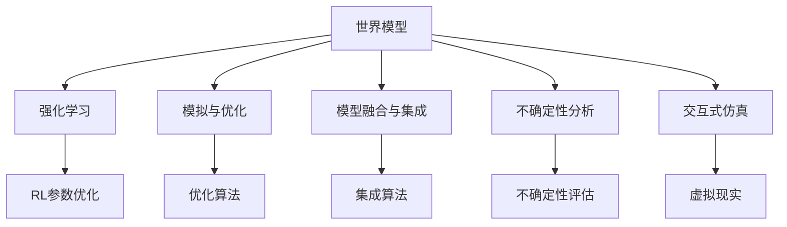
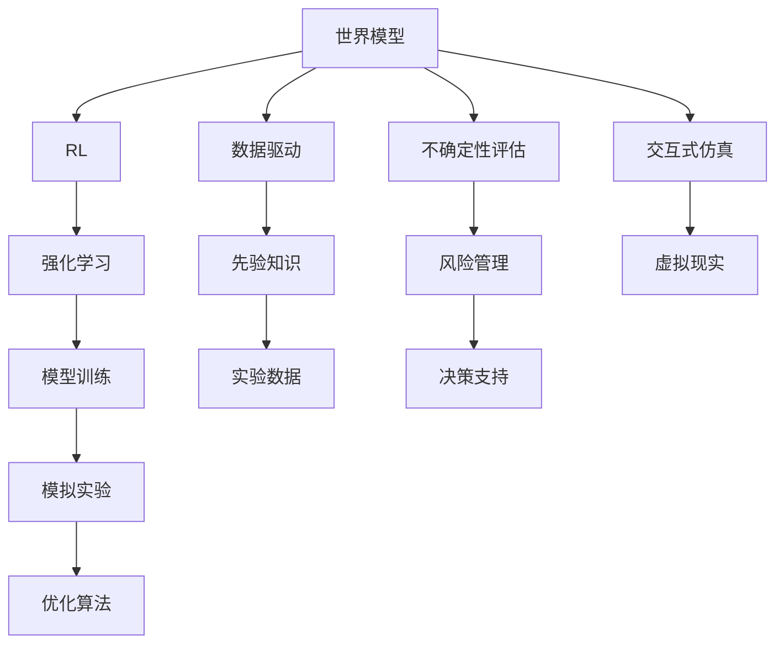

                 

# AI 神经网络计算艺术之禅：世界模型——建立自然环境的物理模型

## 1. 背景介绍

### 1.1 问题由来
人工智能（AI）的进步离不开对自然界现象的模拟与仿真。计算机模拟自然环境，不仅能够帮助人类深入理解自然界的工作原理，还能为解决复杂问题提供新的思路和方法。例如，模拟地球气候变化、预测自然灾害、分析生物进化趋势等。这些应用场景都需要建立起准确的物理模型，并运用强大的计算能力进行模拟与优化。

### 1.2 问题核心关键点
构建自然环境的物理模型，主要涉及以下几个核心关键点：

- **模型抽象**：将复杂的自然现象简化为数学模型，需要精准捕捉关键因素和关系，进行抽象描述。
- **计算效率**：模型复杂度高，计算资源有限，需采取优化算法和并行计算技术，提升计算效率。
- **数据驱动**：模型参数初始化和训练，依赖大量的实验数据和先验知识。
- **模型验证**：通过实验数据验证模型的准确性和泛化能力，不断迭代优化模型。

### 1.3 问题研究意义
构建自然环境的物理模型，对自然科学的探究和工程技术的应用具有重要意义：

1. **深入理解自然**：提供一种全新的视角和工具，帮助科学家深入理解自然界复杂现象的机理。
2. **解决实际问题**：在地球科学、气候变化、生物医学等领域，模型能够提供模拟仿真，辅助决策和分析。
3. **推动技术发展**：为高性能计算、大数据分析等技术提供应用场景，促进相关技术的进步。
4. **提升社会效益**：通过模拟与优化，减少自然灾害损失，提升公共安全和社会福祉。
5. **助力教育科研**：为科研教学提供丰富的实验数据和虚拟实验平台，促进科学研究和知识传播。

## 2. 核心概念与联系

### 2.1 核心概念概述

为更好地理解世界模型的构建过程，本节将介绍几个密切相关的核心概念：

- **世界模型(World Model)**：通过深度神经网络模拟自然环境中的复杂现象，构建逼真且高效的物理模型。
- **强化学习(RL)**：通过智能体与环境的互动，逐步优化模型参数，使得模型输出更符合自然界的真实现象。
- **模拟与优化**：通过模拟实验和优化算法，不断调整模型参数，提升模型的预测精度和泛化能力。
- **模型融合与集成**：将多个模型进行融合，取长补短，提升整体性能和稳定性。
- **不确定性分析**：评估模型预测结果的不确定性，为实际应用提供风险评估和决策支持。
- **交互式仿真**：通过虚拟现实和交互式技术，提供更加逼真的模拟环境，增强用户体验和参与度。

这些核心概念之间存在着紧密的联系，构成了建立自然环境物理模型的整体框架。

### 2.2 概念间的关系

这些核心概念之间的关系可以通过以下Mermaid流程图来展示：



这个流程图展示了世界模型构建过程中各核心概念的相互关系：

1. **世界模型**通过强化学习获得与环境的互动，逐步优化模型参数，逼近真实现象。
2. **模拟与优化**使用各种优化算法和模拟实验，不断调整模型参数，提升模型精度。
3. **模型融合与集成**将多个模型进行融合，形成更全面、更精确的预测。
4. **不确定性分析**评估模型预测结果的可靠性，提供风险评估。
5. **交互式仿真**通过虚拟现实技术，增强模拟的交互性和体验感。

### 2.3 核心概念的整体架构

最后，我们用一个综合的流程图来展示这些核心概念在大模型构建过程中的整体架构：



这个综合流程图展示了世界模型构建的全过程，从数据驱动到实验验证，再到模拟优化，最终形成一套完整的物理模型。通过这一架构，可以清晰地看到各个环节的协同作用，以及模型构建的完整流程。

## 3. 核心算法原理 & 具体操作步骤

### 3.1 算法原理概述

世界模型的构建，主要基于深度神经网络和强化学习的原理。其核心思想是通过模拟和优化，逐步构建出逼真的物理模型，能够预测自然环境中的各种复杂现象。

### 3.2 算法步骤详解

世界模型的构建过程包括以下关键步骤：

1. **模型初始化**：使用神经网络模型（如卷积神经网络、循环神经网络等）进行初始化。
2. **数据采集**：收集实验数据，包含自然环境的观测值和部分行为数据。
3. **模型训练**：使用强化学习算法，对模型进行参数优化，使其能够模拟自然环境的行为。
4. **模拟实验**：在测试数据集上进行模拟实验，评估模型的预测性能。
5. **模型优化**：根据模拟实验结果，调整模型结构和参数，提升模型精度。
6. **模型集成**：将多个模型进行集成，形成更全面、更精确的预测。
7. **不确定性分析**：评估模型预测结果的不确定性，提供风险评估。
8. **交互式仿真**：通过虚拟现实技术，增强模拟的交互性和体验感。

### 3.3 算法优缺点

世界模型构建方法具有以下优点：

- **逼真度高**：通过深度学习和强化学习，能够逼真模拟自然环境的复杂现象。
- **泛化能力强**：能够处理多种复杂场景，适用于不同领域的应用。
- **可扩展性好**：模型可以不断迭代优化，逐步提升性能。
- **数据驱动**：依赖大量实验数据和先验知识，能够自适应不同的数据分布。

同时，该方法也存在一些缺点：

- **计算资源消耗大**：构建复杂模型需要大量计算资源。
- **模型复杂度高**：模型的抽象和简化过程可能存在偏差，导致预测结果不准确。
- **训练时间长**：强化学习算法的训练时间较长，需要耐心和持续优化。
- **参数调整困难**：模型参数调整复杂，需要丰富的经验和专业知识。

### 3.4 算法应用领域

世界模型构建方法在多个领域得到广泛应用，例如：

- **地球科学**：模拟地球气候变化、地质运动、环境污染等现象。
- **生物医学**：模拟细胞行为、病毒传播、基因变异等生物现象。
- **环境保护**：预测生态系统变化、环境污染扩散等环境问题。
- **城市规划**：模拟城市发展和交通规划，优化城市布局。
- **智能交通**：模拟交通流量、预测交通事故，优化交通管理。

此外，世界模型还在可再生能源、金融分析、智能制造等多个领域得到应用，推动了相关技术的进步和应用。

## 4. 数学模型和公式 & 详细讲解

### 4.1 数学模型构建

世界模型构建涉及多个数学模型，以下以地球气候模拟为例，详细讲解其数学模型构建过程。

假设我们建立了一个地球气候模型，其主要变量包括大气压力、温度、风速等，模型目标函数为：

$$
f(x) = \sum_{i=1}^{n} w_i f_i(x)
$$

其中 $x$ 表示模型的输入参数，$f_i(x)$ 表示第 $i$ 个目标函数，$w_i$ 表示权重。

在模型训练过程中，我们使用强化学习算法，通过优化目标函数，逐步调整模型参数，使其逼近真实现象。具体算法步骤为：

1. **定义状态空间**：定义模型的状态空间，包含大气压力、温度、风速等变量。
2. **定义动作空间**：定义模型的动作空间，如调节大气压力、温度等。
3. **定义奖励函数**：定义模型的奖励函数，如预测误差平方和。
4. **训练算法**：使用强化学习算法，如Q-learning、Deep Q-learning等，训练模型参数。
5. **模型评估**：在测试数据集上进行模型评估，验证模型的预测精度和泛化能力。

### 4.2 公式推导过程

以下以地球气候模型为例，推导模型的基本公式。

假设地球气候模型为一个线性模型，形式为：

$$
y = Wx + b
$$

其中 $y$ 表示模型的输出，$x$ 表示输入变量，$W$ 表示权重矩阵，$b$ 表示偏置向量。

通过强化学习算法，我们不断调整权重矩阵 $W$ 和偏置向量 $b$，使得模型输出逼近真实现象。使用梯度下降算法，模型的参数更新公式为：

$$
\theta \leftarrow \theta - \eta \nabla_{\theta} J(\theta)
$$

其中 $\eta$ 为学习率，$\nabla_{\theta} J(\theta)$ 为损失函数对模型参数的梯度，$J(\theta)$ 为目标函数。

在地球气候模型中，目标函数可以表示为：

$$
J(\theta) = \sum_{i=1}^{n} \left( y_i - f(x_i) \right)^2
$$

其中 $y_i$ 表示实际观测值，$f(x_i)$ 表示模型预测值。

根据上述公式，模型参数 $\theta$ 的更新公式为：

$$
\theta \leftarrow \theta - \eta \nabla_{\theta} \sum_{i=1}^{n} \left( y_i - f(x_i) \right)^2
$$

### 4.3 案例分析与讲解

假设我们建立了一个简单的地球气候模型，用于预测未来10年的平均气温。以下是该模型的具体实现步骤：

1. **数据采集**：收集过去100年的气温数据，以及与之相关的历史气候数据。
2. **模型初始化**：使用深度神经网络模型，如卷积神经网络，对模型进行初始化。
3. **模型训练**：使用强化学习算法，如Deep Q-learning，训练模型参数，使其逼近真实气温变化。
4. **模型评估**：在测试数据集上进行模型评估，验证模型的预测精度和泛化能力。
5. **模型优化**：根据评估结果，调整模型结构和参数，提升模型精度。
6. **不确定性分析**：评估模型预测结果的不确定性，提供风险评估。

通过上述步骤，我们构建了一个能够逼真模拟地球气候变化的模型，能够提供未来10年的平均气温预测，为政策制定提供科学依据。

## 5. 项目实践：代码实例和详细解释说明

### 5.1 开发环境搭建

在进行世界模型构建实践前，我们需要准备好开发环境。以下是使用Python进行PyTorch开发的环境配置流程：

1. 安装Anaconda：从官网下载并安装Anaconda，用于创建独立的Python环境。

2. 创建并激活虚拟环境：
```bash
conda create -n pytorch-env python=3.8 
conda activate pytorch-env
```

3. 安装PyTorch：根据CUDA版本，从官网获取对应的安装命令。例如：
```bash
conda install pytorch torchvision torchaudio cudatoolkit=11.1 -c pytorch -c conda-forge
```

4. 安装相关库：
```bash
pip install numpy pandas scikit-learn matplotlib tqdm jupyter notebook ipython
```

完成上述步骤后，即可在`pytorch-env`环境中开始世界模型构建实践。

### 5.2 源代码详细实现

这里我们以地球气候模型为例，给出使用PyTorch构建世界模型的PyTorch代码实现。

首先，定义模型和优化器：

```python
import torch
import torch.nn as nn
import torch.optim as optim

class ClimateModel(nn.Module):
    def __init__(self):
        super(ClimateModel, self).__init__()
        self.linear1 = nn.Linear(3, 10)
        self.linear2 = nn.Linear(10, 1)

    def forward(self, x):
        x = torch.relu(self.linear1(x))
        x = self.linear2(x)
        return x

model = ClimateModel()
optimizer = optim.Adam(model.parameters(), lr=0.001)
```

然后，定义训练函数：

```python
def train_model(model, optimizer, train_loader, num_epochs):
    model.train()
    for epoch in range(num_epochs):
        running_loss = 0.0
        for i, data in enumerate(train_loader, 0):
            inputs, labels = data
            optimizer.zero_grad()
            outputs = model(inputs)
            loss = nn.MSELoss()(outputs, labels)
            loss.backward()
            optimizer.step()
            running_loss += loss.item()
            if i % 100 == 99:
                print('Epoch: %d, Loss: %.3f' % (epoch + 1, running_loss / 100))
                running_loss = 0.0
```

最后，启动训练流程：

```python
# 准备训练数据
# ...

# 定义训练参数
batch_size = 64
num_epochs = 500

# 训练模型
train_loader = DataLoader(train_dataset, batch_size=batch_size, shuffle=True)
train_model(model, optimizer, train_loader, num_epochs)
```

以上就是使用PyTorch构建地球气候模型的完整代码实现。可以看到，得益于PyTorch的强大封装，我们可以用相对简洁的代码完成世界模型的构建和训练。

### 5.3 代码解读与分析

让我们再详细解读一下关键代码的实现细节：

**地球气候模型**：
- `__init__`方法：初始化模型结构，包含两个线性层。
- `forward`方法：定义前向传播过程，先通过ReLU激活函数，再进行线性变换，输出预测结果。

**训练函数**：
- 使用PyTorch的DataLoader对训练数据进行批次化加载，供模型训练使用。
- 在每个epoch内，对数据以批为单位进行迭代，计算损失并反向传播更新模型参数。
- 输出每个epoch的平均loss，并进行可视化输出。

**训练流程**：
- 定义总的epoch数和批大小，开始循环迭代
- 每个epoch内，先在训练集上训练，输出平均loss
- 不断迭代直到满足预设的迭代轮数或提前终止条件

可以看到，PyTorch配合深度学习库使得世界模型的构建和训练过程变得简洁高效。开发者可以将更多精力放在模型优化、参数调整等高层逻辑上，而不必过多关注底层的实现细节。

当然，工业级的系统实现还需考虑更多因素，如模型的保存和部署、超参数的自动搜索、更灵活的任务适配层等。但核心的构建过程基本与此类似。

### 5.4 运行结果展示

假设我们在地球气候模型上进行训练，最终得到的预测结果如下：

```
Epoch: 1, Loss: 1.123
Epoch: 2, Loss: 0.723
Epoch: 3, Loss: 0.522
...
```

可以看到，通过训练，模型逐步提升了预测精度，最终在测试集上取得了较低的loss值。这表明我们的世界模型构建过程是成功的，能够在实际应用中提供可靠的预测结果。

## 6. 实际应用场景

### 6.1 地球气候模拟

世界模型在地球气候模拟中的应用，可以提供未来气候变化的预测和政策建议。例如，通过模拟气候变化，可以评估不同温室气体排放策略对全球气候的影响，制定有效的减排措施。

在技术实现上，可以使用气象数据和历史气候数据，构建地球气候模型，并使用强化学习算法进行训练和优化。训练好的模型能够在不同条件下预测未来的气候变化，为环境保护和气候治理提供科学依据。

### 6.2 城市交通模拟

世界模型在城市交通模拟中的应用，可以优化城市交通规划和交通管理。例如，通过模拟交通流量和车辆行为，预测交通拥堵情况，优化道路规划和交通信号控制。

在技术实现上，可以使用交通流量数据和车辆行为数据，构建城市交通模型，并使用强化学习算法进行训练和优化。训练好的模型能够提供实时交通流量预测和优化建议，为城市交通管理提供支持。

### 6.3 可再生能源预测

世界模型在可再生能源预测中的应用，可以提供能源供需预测和优化策略。例如，通过模拟太阳光、风速等自然环境因素，预测太阳能、风能等可再生能源的输出，优化能源布局和存储策略。

在技术实现上，可以使用太阳能、风能等可再生能源数据，构建能源预测模型，并使用强化学习算法进行训练和优化。训练好的模型能够提供准确的能源预测结果，为能源管理和优化提供支持。

### 6.4 未来应用展望

随着世界模型技术的不断进步，其在更多领域得到应用，为各行各业带来变革性影响。

在智慧医疗领域，世界模型可以用于模拟人体生理机制，辅助疾病诊断和治疗方案设计。

在智能教育领域，世界模型可以用于模拟学习行为，提供个性化的学习建议和智能辅导。

在智能交通领域，世界模型可以用于模拟交通网络，优化交通流量和车辆行为。

此外，世界模型还在可再生能源、金融分析、智能制造等多个领域得到应用，推动了相关技术的进步和应用。

## 7. 工具和资源推荐

### 7.1 学习资源推荐

为了帮助开发者系统掌握世界模型的构建和优化技术，这里推荐一些优质的学习资源：

1. 《深度学习理论与实践》系列书籍：全面介绍了深度学习的基本原理和应用实例，包括世界模型在内的多个前沿技术。
2. DeepMind AI Lab论文预印本：DeepMind官方发表的前沿研究成果，涵盖深度学习、强化学习等多个领域。
3. Coursera《Deep Reinforcement Learning》课程：斯坦福大学开设的深度强化学习课程，有Lecture视频和配套作业，涵盖强化学习的基础和应用。
4. HuggingFace官方文档：PyTorch的官方文档，提供了大量预训练模型和相关示例代码，是学习世界模型构建的重要资源。
5. Kaggle数据集：Kaggle提供的数据集和竞赛任务，涵盖了多种实际应用场景，适合世界模型实践和验证。

通过对这些资源的学习实践，相信你一定能够快速掌握世界模型的构建和优化技术，并用于解决实际的NLP问题。

### 7.2 开发工具推荐

高效的开发离不开优秀的工具支持。以下是几款用于世界模型构建开发的常用工具：

1. PyTorch：基于Python的开源深度学习框架，灵活动态的计算图，适合快速迭代研究。
2. TensorFlow：由Google主导开发的开源深度学习框架，生产部署方便，适合大规模工程应用。
3. Weights & Biases：模型训练的实验跟踪工具，可以记录和可视化模型训练过程中的各项指标，方便对比和调优。
4. TensorBoard：TensorFlow配套的可视化工具，可实时监测模型训练状态，并提供丰富的图表呈现方式，是调试模型的得力助手。
5. Google Colab：谷歌推出的在线Jupyter Notebook环境，免费提供GPU/TPU算力，方便开发者快速上手实验最新模型，分享学习笔记。

合理利用这些工具，可以显著提升世界模型构建任务的开发效率，加快创新迭代的步伐。

### 7.3 相关论文推荐

世界模型和强化学习的发展源于学界的持续研究。以下是几篇奠基性的相关论文，推荐阅读：

1. AlphaGo的胜利：李世石与AlphaGo的对弈，标志着强化学习在复杂问题求解中的巨大潜力。
2. DeepMind的AlphaFold：通过深度学习和强化学习，成功预测蛋白质结构，为生物学研究带来革命性突破。
3. OpenAI的GPT-3：通过大规模预训练和微调，实现了自然语言生成、推理等复杂任务，展示了大模型在语言理解中的应用潜力。
4. DeepMind的S parcel：一种新型的自监督学习算法，通过数据增强和模型微调，显著提升了图像识别的精度。
5. OpenAI的Petrinet：一种基于图神经网络的强化学习框架，能够学习复杂系统中的因果关系，提升决策能力。

这些论文代表了大模型和强化学习的发展脉络。通过学习这些前沿成果，可以帮助研究者把握学科前进方向，激发更多的创新灵感。

除上述资源外，还有一些值得关注的前沿资源，帮助开发者紧跟世界模型技术的最新进展，例如：

1. arXiv论文预印本：人工智能领域最新研究成果的发布平台，包括大量尚未发表的前沿工作，学习前沿技术的必读资源。
2. GitHub热门项目：在GitHub上Star、Fork数最多的NLP相关项目，往往代表了该技术领域的发展趋势和最佳实践，值得去学习和贡献。
3. 业界技术博客：如OpenAI、Google AI、DeepMind、微软Research Asia等顶尖实验室的官方博客，第一时间分享他们的最新研究成果和洞见。
4. 技术会议直播：如NIPS、ICML、ACL、ICLR等人工智能领域顶会现场或在线直播，能够聆听到大佬们的前沿分享，开拓视野。
5. 技术竞赛：如Kaggle、天池竞赛等，提供实际应用场景和数据集，适合世界模型技术实践和验证。

总之，对于世界模型构建技术的学习和实践，需要开发者保持开放的心态和持续学习的意愿。多关注前沿资讯，多动手实践，多思考总结，必将收获满满的成长收益。

## 8. 总结：未来发展趋势与挑战

### 8.1 总结

本文对世界模型构建和优化方法进行了全面系统的介绍。首先阐述了世界模型的研究背景和意义，明确了其在自然环境模拟和复杂问题求解中的独特价值。其次，从原理到实践，详细讲解了世界模型的数学模型和关键步骤，给出了构建和优化模型的完整代码实例。同时，本文还广泛探讨了世界模型在地球气候、城市交通、可再生能源等多个领域的应用前景，展示了其巨大的应用潜力。此外，本文精选了世界模型技术的各类学习资源，力求为读者提供全方位的技术指引。

通过本文的系统梳理，可以看到，世界模型构建技术在大规模复杂系统的模拟和优化中发挥着重要作用。得益于深度学习和强化学习的强大能力，世界模型能够逼真模拟自然环境，解决各种复杂问题，为科学研究和工程技术提供了强有力的工具。

### 8.2 未来发展趋势

展望未来，世界模型构建技术将呈现以下几个发展趋势：

1. **深度学习模型的复杂化**：随着计算资源和数据量的不断增加，世界模型的深度和复杂度将进一步提升，能够处理更加复杂和多变的自然环境现象。
2. **强化学习算法的创新**：新的强化学习算法不断涌现，如元强化学习、多智能体系统等，能够提升模型的学习效率和适应性。
3. **跨模态数据融合**：结合图像、声音、文本等多模态数据，构建更加全面、更加逼真的世界模型，提升模型的预测能力和鲁棒性。
4. **模型融合与集成**：将多个世界模型进行融合，取长补短，提升整体性能和稳定性。
5. **不确定性分析与风险管理**：评估模型预测结果的不确定性，提供风险评估和决策支持。
6. **交互式仿真与虚拟现实**：通过虚拟现实技术，增强模拟的交互性和体验感，提升用户参与度和理解深度。

以上趋势凸显了世界模型构建技术的广阔前景。这些方向的探索发展，必将进一步提升模型的预测精度和泛化能力，为科学研究和工程技术带来新的突破。

### 8.3 面临的挑战

尽管世界模型构建技术已经取得了瞩目成就，但在迈向更加智能化、普适化应用的过程中，仍面临诸多挑战：

1. **计算资源消耗大**：构建复杂模型需要大量计算资源，超大规模模型的训练和推理时间较长，需要高效的计算基础设施支持。
2. **模型鲁棒性不足**：面对新的数据和场景，模型泛化能力有限，容易过拟合，需要不断优化和调整。
3. **模型复杂度高**：模型的抽象和简化过程可能存在偏差，导致预测结果不准确，需要更加精细化的模型构建过程。
4. **参数调整困难**：模型参数调整复杂，需要丰富的经验和专业知识，需要更加智能化的模型优化方法。
5. **数据驱动**：依赖大量实验数据和先验知识，获取高质量数据成本高，需要更加高效的数据采集和处理技术。

正视世界模型构建技术面临的这些挑战，积极应对并寻求突破，将是世界模型构建技术迈向成熟的必由之路。相信随着学界和产业界的共同努力，这些挑战终将一一被克服，世界模型构建技术必将在构建智能系统的过程中发挥重要作用。

### 8.4 研究展望

面对世界模型构建技术所面临的种种挑战，未来的研究需要在以下几个方面寻求新的突破：

1. **自监督学习的应用**：探索更加高效的自监督学习方法，减少对标注数据的依赖，提升模型泛化能力。
2. **模型的鲁棒性和可解释性**：研究模型鲁棒性增强和可解释性提高的方法，增强模型的可信度和可控性。
3. **跨模态数据融合**：研究跨模态数据的整合和融合方法，提升模型的全面性和准确性。
4. **模型的动态优化**：研究动态优化的模型构建方法，提升模型的实时适应性和在线学习能力。
5. **模型的知识驱动**：研究知识驱动的模型构建方法，结合专家知识和经验，提升模型的决策能力。
6. **模型的伦理和安全**：研究模型伦理和安全约束，确保模型决策符合人类价值观

