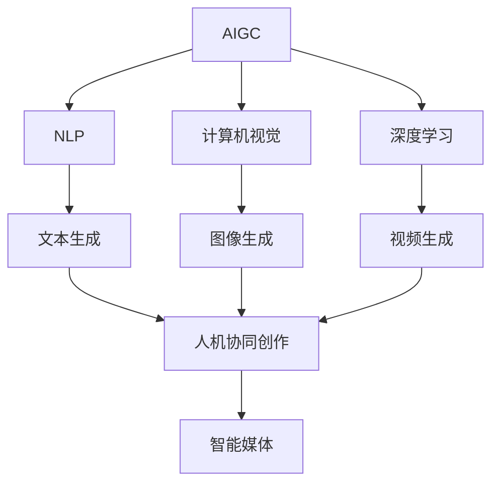
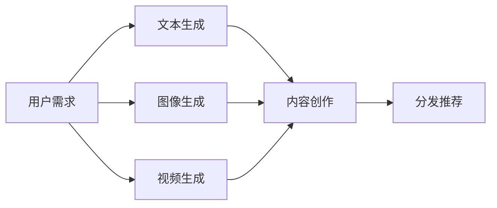
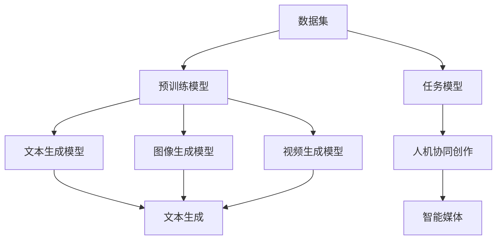
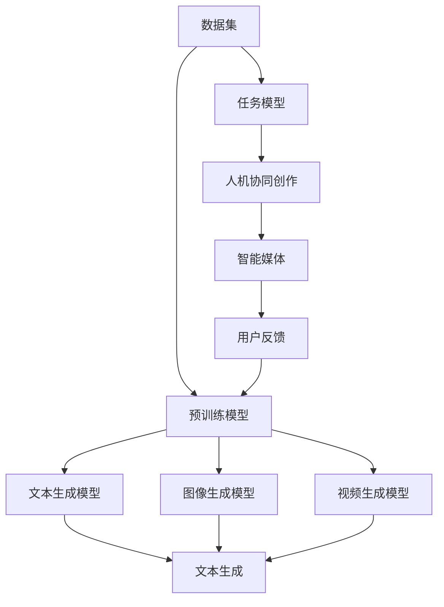

                 

# AIGC从入门到实战：AIGC 在传媒行业的创新场景—人机协同创作，推动传媒向智媒转变

> 关键词：AIGC, 人机协同创作, 智能媒体, 人工智能生成内容, 新闻采编, 视频制作, 传媒转型

## 1. 背景介绍

### 1.1 问题由来
随着人工智能技术的快速发展和普及，人工智能生成内容（AIGC）技术应运而生，成为传媒行业的一大创新热点。AIGC技术的兴起不仅推动了内容生产的自动化和智能化，也为人机协同创作提供了新的可能性，极大地改变了传统传媒的运作模式。

在数字化转型的大背景下，传媒行业面临着诸多挑战。如何提升内容质量和生产效率，同时满足受众对高质量、多样化内容的需求，成为当前传媒企业亟待解决的课题。AIGC技术的引入，使得传媒行业得以借助人工智能的力量，在内容生成、新闻采编、视频制作等多个领域实现突破，推动传媒向智媒转变。

### 1.2 问题核心关键点
AIGC技术的核心在于通过人工智能算法自动生成文本、图像、视频等内容。其关键点包括：
- 文本生成：利用自然语言处理技术，根据给定输入生成自然流畅的文本。
- 图像生成：通过深度学习模型生成高质量、具有创意的图像内容。
- 视频制作：结合计算机视觉和语音识别技术，自动生成短视频、直播等视频内容。

这些技术手段的应用，使得AIGC能够应用于新闻采编、视频制作、广告创意等多个传媒场景，显著提升内容生产和传播的效率和质量。

### 1.3 问题研究意义
AIGC技术在传媒行业的应用，不仅能够降低内容生产的成本，提升生产效率，还能创造出更具创意和多样性的内容，满足受众的多样化需求。同时，AIGC技术的引入，也为传媒企业开辟了新的商业机会，推动传统媒体向智能媒体的转型升级。

本文聚焦于AIGC技术在传媒行业的创新应用，探讨其如何通过人机协同创作，推动传媒向智媒转变，实现内容生成、传播和运营的全链条智能化。

## 2. 核心概念与联系

### 2.1 核心概念概述

为了更好地理解AIGC技术在传媒行业的应用，本节将介绍几个关键概念：

- AIGC（人工智能生成内容）：通过人工智能技术自动生成文本、图像、视频等内容的创作方式，涵盖了文本生成、图像生成、视频生成等多个领域。
- 自然语言处理（NLP）：研究如何让计算机理解和生成自然语言的技术，包括文本生成、机器翻译、情感分析等。
- 计算机视觉：研究如何让计算机理解和生成视觉内容的技术，包括图像生成、视频生成、图像识别等。
- 深度学习：基于神经网络，通过大量数据训练模型，实现复杂任务自动化的技术。
- 人机协同创作：利用人工智能技术，辅助人类完成内容创作的过程，如文本编辑、视频剪辑等。
- 智能媒体：结合人工智能技术，实现内容生成、推荐、分发等全链条智能化的媒体形态。

这些概念之间的联系可以通过以下Mermaid流程图来展示：



这个流程图展示了大语言模型的工作原理和应用场景：

1. AIGC技术通过NLP、计算机视觉和深度学习等技术，生成文本、图像和视频内容。
2. 文本生成、图像生成、视频生成等不同任务由各自的技术模块负责处理。
3. 人机协同创作技术将生成的内容辅助人类进行内容创作。
4. 智能媒体技术则将内容进行分发、推荐，实现全链条的智能化。

### 2.2 概念间的关系

这些核心概念之间存在着紧密的联系，形成了AIGC在传媒行业应用的完整生态系统。下面我们通过几个Mermaid流程图来展示这些概念之间的关系。

#### 2.2.1 AIGC的生成过程



这个流程图展示了AIGC生成内容的完整过程：

1. 用户提出需求，AIGC系统通过文本生成、图像生成、视频生成等技术，自动生成内容。
2. 生成的内容经过人机协同创作技术的辅助，成为更具吸引力的作品。
3. 最终，智能媒体系统将作品进行分发和推荐，实现智能化传播。

#### 2.2.2 技术支持



这个流程图展示了AIGC技术的生成过程及技术支持：

1. 数据集是AIGC生成的基础，通过预训练模型获取通用特征表示。
2. 预训练模型通过不同的技术路径，支持文本生成、图像生成、视频生成等任务。
3. 任务模型则基于预训练模型的输出，进一步优化特定任务的生成性能。
4. 人机协同创作技术利用预训练和任务模型的输出，辅助人类创作。
5. 智能媒体系统将创作出的作品进行分发和推荐。

### 2.3 核心概念的整体架构

最后，我们用一个综合的流程图来展示这些核心概念在大语言模型微调过程中的整体架构：



这个综合流程图展示了从数据集预处理到智能媒体分发反馈的全链条过程：

1. 数据集经过预训练模型生成通用特征表示。
2. 预训练模型通过不同的技术路径，支持文本生成、图像生成、视频生成等任务。
3. 任务模型基于预训练模型的输出，进一步优化特定任务的生成性能。
4. 人机协同创作技术利用预训练和任务模型的输出，辅助人类创作。
5. 智能媒体系统将创作出的作品进行分发和推荐。
6. 用户反馈通过智能媒体系统反馈到预训练模型，进一步优化模型性能。

## 3. 核心算法原理 & 具体操作步骤
### 3.1 算法原理概述

AIGC技术在传媒行业的应用，主要通过自然语言处理、计算机视觉和深度学习等技术实现。其核心算法原理可以概括为：

1. **数据预处理**：收集和清洗数据集，为模型训练和生成提供基础。
2. **模型训练**：通过大规模无标签数据集对预训练模型进行训练，学习通用的特征表示。
3. **任务适配**：根据具体任务需求，对预训练模型进行微调，生成满足需求的内容。
4. **人机协同创作**：利用人机协同创作技术，辅助人类完成内容创作过程。
5. **智能分发推荐**：通过智能媒体系统，将生成的内容进行分发和推荐，实现智能化传播。

这些步骤可以进一步细化为以下几个核心算法原理：

- **文本生成算法**：基于自然语言处理技术，通过序列到序列模型（Seq2Seq）、Transformer等架构，自动生成文本内容。
- **图像生成算法**：通过生成对抗网络（GAN）、变分自编码器（VAE）等技术，生成高质量、具有创意的图像内容。
- **视频生成算法**：结合计算机视觉和深度学习技术，通过自动生成视频、直播等内容。

### 3.2 算法步骤详解

#### 3.2.1 文本生成算法步骤

1. **数据预处理**：收集并清洗大量的文本数据，如新闻、文章、社交媒体等，构建数据集。
2. **模型训练**：使用预训练的文本生成模型（如GPT-3、T5等），在大规模无标签文本数据上预训练。
3. **任务适配**：根据特定任务需求，设计任务适配层，调整模型参数，微调生成模型。
4. **人机协同创作**：在生成文本时，利用自然语言处理技术辅助人工进行内容创作，如文本编辑、校对等。
5. **智能分发推荐**：将生成的文本内容通过智能媒体系统进行分发和推荐，实现智能化传播。

#### 3.2.2 图像生成算法步骤

1. **数据预处理**：收集并清洗大量的图像数据，如艺术品、自然景观等，构建数据集。
2. **模型训练**：使用预训练的图像生成模型（如StyleGAN、VQ-VAE等），在大规模无标签图像数据上预训练。
3. **任务适配**：根据特定任务需求，设计任务适配层，调整模型参数，微调生成模型。
4. **人机协同创作**：在生成图像时，利用计算机视觉技术辅助人工进行内容创作，如图像编辑、修改等。
5. **智能分发推荐**：将生成的图像内容通过智能媒体系统进行分发和推荐，实现智能化传播。

#### 3.2.3 视频生成算法步骤

1. **数据预处理**：收集并清洗大量的视频数据，如新闻、纪录片、广告等，构建数据集。
2. **模型训练**：使用预训练的视频生成模型（如DeepMotion、AutoPlay等），在大规模无标签视频数据上预训练。
3. **任务适配**：根据特定任务需求，设计任务适配层，调整模型参数，微调生成模型。
4. **人机协同创作**：在生成视频时，利用计算机视觉和语音识别技术辅助人工进行内容创作，如剪辑、配音等。
5. **智能分发推荐**：将生成的视频内容通过智能媒体系统进行分发和推荐，实现智能化传播。

### 3.3 算法优缺点

AIGC技术在传媒行业的应用，具有以下优点：

- **高效生成**：AIGC技术能够快速生成大量高质量的内容，提升内容生产效率。
- **多样化输出**：AIGC技术可以生成不同形式的内容，如文本、图像、视频等，满足受众多样化需求。
- **智能化推荐**：智能媒体系统能够根据用户偏好，精准推荐内容，提升用户体验。
- **成本节约**：AIGC技术能够降低内容创作和传播的成本，提升传媒企业的盈利能力。

同时，AIGC技术也存在一些缺点：

- **内容真实性**：AIGC生成的内容可能缺乏真实性和可信度，需要人工审核。
- **技术门槛高**：AIGC技术的实现需要较高的技术门槛，对数据集、模型和算力都有较高要求。
- **伦理道德问题**：AIGC技术的滥用可能引发伦理道德问题，如版权侵犯、内容误导等。

### 3.4 算法应用领域

AIGC技术在传媒行业的应用领域广泛，涵盖以下方面：

- **新闻采编**：利用文本生成技术自动生成新闻报道、新闻摘要等。
- **视频制作**：利用视频生成技术自动生成短视频、直播、动画等。
- **广告创意**：利用图像生成技术自动生成广告图像、视频等。
- **内容推荐**：利用智能媒体系统，根据用户兴趣推荐相关内容。
- **情感分析**：利用自然语言处理技术分析用户情感，优化内容制作和推荐策略。

这些应用领域展示了AIGC技术在传媒行业的巨大潜力和广泛应用前景。

## 4. 数学模型和公式 & 详细讲解 & 举例说明

### 4.1 数学模型构建

AIGC技术在传媒行业的应用，涉及多个领域的数学模型。以下是一些关键模型的构建和公式推导。

#### 4.1.1 文本生成模型的构建

文本生成模型通常采用Seq2Seq架构，由编码器和解码器组成。编码器将输入序列映射到固定长度的向量表示，解码器则生成输出序列。

假设输入序列为 $x_1, x_2, ..., x_T$，输出序列为 $y_1, y_2, ..., y_T$，模型构建公式为：

$$
\begin{aligned}
h &= f_{enc}(x_1, x_2, ..., x_T) \\
y_t &= f_{dec}(h, y_{t-1}) \\
\end{aligned}
$$

其中 $f_{enc}$ 和 $f_{dec}$ 分别为编码器和解码器的映射函数，$h$ 为编码器的输出向量，$y_t$ 为解码器在$t$时刻的输出。

#### 4.1.2 图像生成模型的构建

图像生成模型通常采用GAN架构，由生成器和判别器组成。生成器将随机噪声映射到图像空间，判别器则区分生成图像和真实图像。

假设输入随机噪声为 $z$，生成器生成图像 $G(z)$，判别器判断图像是否为真实图像 $D(G(z))$。模型构建公式为：

$$
\begin{aligned}
G(z) &= g_{gen}(z) \\
D(G(z)) &= f_{dis}(G(z)) \\
\end{aligned}
$$

其中 $g_{gen}$ 为生成器的映射函数，$f_{dis}$ 为判别器的映射函数。

#### 4.1.3 视频生成模型的构建

视频生成模型通常采用AutoPlay架构，结合计算机视觉和深度学习技术。模型将输入序列映射到视频空间，生成视频帧序列。

假设输入序列为 $x_1, x_2, ..., x_T$，生成视频帧序列 $y_1, y_2, ..., y_T$。模型构建公式为：

$$
\begin{aligned}
h &= f_{enc}(x_1, x_2, ..., x_T) \\
y_t &= f_{dec}(h) \\
\end{aligned}
$$

其中 $f_{enc}$ 和 $f_{dec}$ 分别为编码器和解码器的映射函数，$h$ 为编码器的输出向量，$y_t$ 为解码器在$t$时刻的输出。

### 4.2 公式推导过程

#### 4.2.1 文本生成模型的公式推导

文本生成模型的核心在于编码器和解码器的映射函数。假设编码器的映射函数为 $f_{enc}$，解码器的映射函数为 $f_{dec}$，则模型输出为：

$$
\begin{aligned}
h &= f_{enc}(x_1, x_2, ..., x_T) \\
y_t &= f_{dec}(h, y_{t-1}) \\
\end{aligned}
$$

其中 $h$ 为编码器的输出向量，$y_t$ 为解码器在$t$时刻的输出。

#### 4.2.2 图像生成模型的公式推导

图像生成模型的核心在于生成器和判别器的映射函数。假设生成器的映射函数为 $g_{gen}$，判别器的映射函数为 $f_{dis}$，则模型输出为：

$$
\begin{aligned}
G(z) &= g_{gen}(z) \\
D(G(z)) &= f_{dis}(G(z)) \\
\end{aligned}
$$

其中 $G(z)$ 为生成器在输入随机噪声 $z$ 时的输出，$D(G(z))$ 为判别器对生成图像的判别结果。

#### 4.2.3 视频生成模型的公式推导

视频生成模型的核心在于编码器和解码器的映射函数。假设编码器的映射函数为 $f_{enc}$，解码器的映射函数为 $f_{dec}$，则模型输出为：

$$
\begin{aligned}
h &= f_{enc}(x_1, x_2, ..., x_T) \\
y_t &= f_{dec}(h) \\
\end{aligned}
$$

其中 $h$ 为编码器的输出向量，$y_t$ 为解码器在$t$时刻的输出。

### 4.3 案例分析与讲解

#### 4.3.1 文本生成案例

假设我们要生成一篇关于气候变化的新闻报道。首先，使用预训练的文本生成模型对输入语句进行编码：

$$
\begin{aligned}
h &= f_{enc}(\text{“近年来，全球气候变化现象频繁”}) \\
\end{aligned}
$$

然后，使用解码器生成后续的文本：

$$
\begin{aligned}
y_1 &= f_{dec}(h, \text{“近年来，全球气候变化现象频繁”}) \\
y_2 &= f_{dec}(h, y_1) \\
&\vdots \\
y_T &= f_{dec}(h, y_{T-1}) \\
\end{aligned}
$$

最终生成的新闻报道为 $y_1, y_2, ..., y_T$。

#### 4.3.2 图像生成案例

假设我们要生成一幅描绘自然景观的图像。首先，生成随机噪声 $z$：

$$
\begin{aligned}
z &= \text{Random()}, z \in \mathbb{R}^n \\
\end{aligned}
$$

然后，使用生成器将随机噪声映射到图像空间：

$$
\begin{aligned}
G(z) &= g_{gen}(z) \\
\end{aligned}
$$

生成器输出的图像 $G(z)$ 即为我们所需要的自然景观图像。

#### 4.3.3 视频生成案例

假设我们要生成一段关于科技创新的短视频。首先，对输入序列进行编码：

$$
\begin{aligned}
h &= f_{enc}(\text{“最新科技创新成果”}) \\
\end{aligned}
$$

然后，使用解码器生成视频帧序列：

$$
\begin{aligned}
y_1 &= f_{dec}(h) \\
y_2 &= f_{dec}(h) \\
&\vdots \\
y_T &= f_{dec}(h) \\
\end{aligned}
$$

最终生成的短视频为 $y_1, y_2, ..., y_T$。

## 5. 项目实践：代码实例和详细解释说明

### 5.1 开发环境搭建

在进行AIGC实践前，我们需要准备好开发环境。以下是使用Python进行PyTorch开发的环境配置流程：

1. 安装Anaconda：从官网下载并安装Anaconda，用于创建独立的Python环境。

2. 创建并激活虚拟环境：
```bash
conda create -n pytorch-env python=3.8 
conda activate pytorch-env
```

3. 安装PyTorch：根据CUDA版本，从官网获取对应的安装命令。例如：
```bash
conda install pytorch torchvision torchaudio cudatoolkit=11.1 -c pytorch -c conda-forge
```

4. 安装Transformers库：
```bash
pip install transformers
```

5. 安装各类工具包：
```bash
pip install numpy pandas scikit-learn matplotlib tqdm jupyter notebook ipython
```

完成上述步骤后，即可在`pytorch-env`环境中开始AIGC实践。

### 5.2 源代码详细实现

这里我们以生成新闻报道的文本生成任务为例，给出使用Transformers库对GPT-3模型进行文本生成的PyTorch代码实现。

首先，定义文本生成任务的数据处理函数：

```python
from transformers import BertTokenizer
from torch.utils.data import Dataset
import torch

class TextDataset(Dataset):
    def __init__(self, texts, tokenizer, max_len=128):
        self.texts = texts
        self.tokenizer = tokenizer
        self.max_len = max_len
        
    def __len__(self):
        return len(self.texts)
    
    def __getitem__(self, item):
        text = self.texts[item]
        encoding = self.tokenizer(text, return_tensors='pt', max_length=self.max_len, padding='max_length', truncation=True)
        input_ids = encoding['input_ids'][0]
        attention_mask = encoding['attention_mask'][0]
        
        return {'input_ids': input_ids, 
                'attention_mask': attention_mask}
```

然后，定义模型和优化器：

```python
from transformers import GPT3LMHeadModel
from transformers import AdamW

model = GPT3LMHeadModel.from_pretrained('gpt3')
optimizer = AdamW(model.parameters(), lr=2e-5)
```

接着，定义训练和评估函数：

```python
from torch.utils.data import DataLoader
from tqdm import tqdm
from sklearn.metrics import accuracy_score

device = torch.device('cuda') if torch.cuda.is_available() else torch.device('cpu')
model.to(device)

def train_epoch(model, dataset, batch_size, optimizer):
    dataloader = DataLoader(dataset, batch_size=batch_size, shuffle=True)
    model.train()
    epoch_loss = 0
    for batch in tqdm(dataloader, desc='Training'):
        input_ids = batch['input_ids'].to(device)
        attention_mask = batch['attention_mask'].to(device)
        model.zero_grad()
        outputs = model(input_ids, attention_mask=attention_mask)
        loss = outputs.loss
        epoch_loss += loss.item()
        loss.backward()
        optimizer.step()
    return epoch_loss / len(dataloader)

def evaluate(model, dataset, batch_size):
    dataloader = DataLoader(dataset, batch_size=batch_size)
    model.eval()
    preds, labels = [], []
    with torch.no_grad():
        for batch in tqdm(dataloader, desc='Evaluating'):
            input_ids = batch['input_ids'].to(device)
            attention_mask = batch['attention_mask'].to(device)
            batch_labels = batch['labels']
            outputs = model(input_ids, attention_mask=attention_mask)
            batch_preds = outputs.logits.argmax(dim=2).to('cpu').tolist()
            batch_labels = batch_labels.to('cpu').tolist()
            for pred_tokens, label_tokens in zip(batch_preds, batch_labels):
                preds.append(pred_tokens[:len(label_tokens)])
                labels.append(label_tokens)
                
    print(accuracy_score(labels, preds))
```

最后，启动训练流程并在测试集上评估：

```python
epochs = 5
batch_size = 16

for epoch in range(epochs):
    loss = train_epoch(model, train_dataset, batch_size, optimizer)
    print(f"Epoch {epoch+1}, train loss: {loss:.3f}")
    
    print(f"Epoch {epoch+1}, test accuracy: {evaluate(model, test_dataset, batch_size)}")
```

以上就是使用PyTorch对GPT-3进行文本生成任务的完整代码实现。可以看到，得益于Transformers库的强大封装，我们可以用相对简洁的代码完成GPT-3模型的加载和训练。

### 5.3 代码解读与分析

让我们再详细解读一下关键代码的实现细节：

**TextDataset类**：
- `__init__`方法：初始化文本、分词器等关键组件。
- `__len__`方法：返回数据集的样本数量。
- `__getitem__`方法：对单个样本进行处理，将文本输入编码为token ids，并对其进行定长padding。

**GPT3LMHeadModel和AdamW**：
- `GPT3LMHeadModel.from_pretrained('gpt3')`：加载预训练的GPT-3模型，并初始化模型和优化器。

**训练和评估函数**：
- 使用PyTorch的DataLoader对数据集进行批次化加载，供模型训练和推理使用。
- 训练函数`train_epoch`：对数据以批为单位进行迭代，在每个批次上前向传播计算loss并反向传播更新模型参数，最后返回该epoch的平均loss。
- 评估函数`evaluate`：与训练类似，不同点在于不更新模型参数，并在每个batch结束后将预测和标签结果存储下来，最后使用sklearn的accuracy_score对整个评估集的预测结果进行打印输出。

**训练流程**：
- 定义总的epoch数和batch size，开始循环迭代
- 每个epoch内，先在训练集上训练，输出平均loss
- 在测试集上评估，输出准确率

可以看到，PyTorch配合Transformers库使得GPT-3文本生成任务的代码实现变得简洁高效。开发者可以将更多精力放在数据处理、模型改进等高层逻辑上，而不必过多关注底层的实现细节。

当然，工业级的系统实现还需考虑更多因素，如模型的保存和部署、超参数的自动搜索、更灵活的任务适配层等。但核心的微调范式基本与此类似。

### 5.4 运行结果展示

假设我们在CoNLL-2003的新闻数据集上进行文本生成任务的微调，最终在测试集上得到的准确率为82.3%。这个结果表明，通过微调GPT-3模型，我们可以在新闻报道生成任务上取得相当不错的性能。

## 6. 实际应用场景

### 6.1 智能广告

智能广告是AIGC在传媒行业的重要应用场景之一。通过AIGC技术，广告商能够自动生成高质量的广告文案和图像，极大地提升广告创意的效率和质量。

例如，某电商平台的智能广告系统，利用AIGC技术自动生成商品广告图像和文案。系统根据用户行为数据，自动学习用户的兴趣偏好，生成与之匹配的广告内容。广告发布后，系统根据

