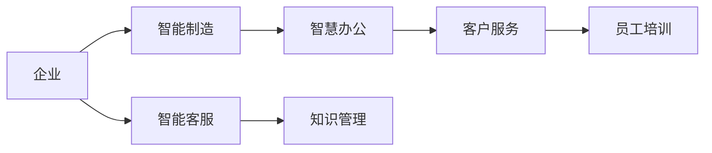
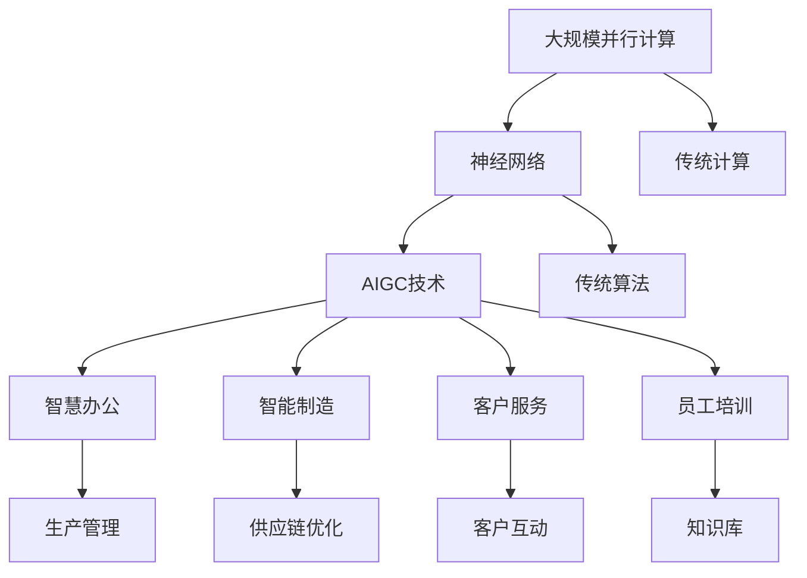

                 

# AIGC从入门到实战：关于企业和组织

> 关键词：AIGC,企业智能化,组织变革,数字化转型,人工智能商业应用,智慧办公,智能制造,客户服务,员工培训

## 1. 背景介绍

### 1.1 问题由来
随着人工智能(AI)技术的不断发展和成熟，其在企业中的应用也日益深入。人工智能技术不仅能够提升企业运营效率，还能带来全新的商业模式变革。然而，人工智能技术的落地应用仍面临诸多挑战，需要企业从战略、组织和文化等多个层面进行全方位改革。

人工智能通用计算(AIGC)作为AI技术的重要分支，是当下最前沿的人工智能应用方向之一。它通过利用大规模并行计算、神经网络等技术，可以实现海量数据的自动处理和高效分析，帮助企业提升决策、管理、生产等方面的能力。

近年来，越来越多的企业开始探索和应用AIGC技术，构建智能化的组织结构，加速数字化转型，提高企业竞争力。AIGC技术在企业中的应用，不仅可以提升企业的智能化水平，还能带来显著的商业价值。

### 1.2 问题核心关键点
AIGC技术在企业中的应用，主要包括智慧办公、智能制造、客户服务、员工培训等多个方面。其核心关键点在于：

- **智能化转型**：通过AIGC技术，企业可以实现从传统流程化管理向智能化决策的转变，提升运营效率。
- **数据驱动决策**：AIGC技术能够处理和分析海量数据，为企业提供精准的数据驱动决策支持。
- **创新商业模式**：AIGC技术的应用可以催生新的商业模式，推动企业商业创新。
- **人机协同**：AIGC技术能够增强人与机器的协同合作，提升工作效率和质量。
- **客户体验优化**：AIGC技术可以改善客户服务体验，提升客户满意度。
- **知识传承**：AIGC技术可以帮助企业更好地传承知识，提升员工培训效果。

### 1.3 问题研究意义
研究AIGC技术在企业中的应用，对于企业智能化转型、提升运营效率、改善客户体验等方面具有重要意义：

1. **提升运营效率**：AIGC技术能够自动化处理企业内部的各种流程和数据，显著提高企业的运营效率。
2. **改善客户体验**：通过AIGC技术，企业可以提供更加个性化、智能化的客户服务，提升客户满意度。
3. **推动商业创新**：AIGC技术可以带来新的商业模式和业务机会，推动企业创新发展。
4. **增强决策支持**：AIGC技术能够处理和分析大量数据，为企业的决策提供科学支持。
5. **优化管理架构**：AIGC技术可以帮助企业构建智能化的组织结构，提升管理效率。
6. **促进知识共享**：AIGC技术可以推动企业内部的知识共享和传承，提升员工培训效果。

## 2. 核心概念与联系

### 2.1 核心概念概述

为更好地理解AIGC技术在企业中的应用，本节将介绍几个密切相关的核心概念：

- **人工智能(AI)**：通过模拟人类智能行为，使计算机具备自主学习、推理、决策等能力。
- **人工智能通用计算(AIGC)**：利用大规模并行计算和神经网络等技术，实现海量数据的自动处理和高效分析。
- **智慧办公**：利用AI技术提升办公自动化水平，优化办公流程，提高工作效率。
- **智能制造**：利用AI技术优化生产流程，提升生产效率，降低成本。
- **客户服务**：通过AI技术实现客户服务自动化，改善客户体验，提升客户满意度。
- **员工培训**：利用AI技术辅助员工培训，提升培训效果，加速知识传承。

这些核心概念之间的逻辑关系可以通过以下Mermaid流程图来展示：

```mermaid
graph TB
    A[人工智能(AI)] --> B[人工智能通用计算(AIGC)]
    B --> C[智慧办公]
    B --> D[智能制造]
    B --> E[客户服务]
    B --> F[员工培训]
    A --> G[传统办公]
    A --> H[传统制造]
    A --> I[传统客服]
    A --> J[传统培训]
```

这个流程图展示了大规模人工智能在企业中的应用，从传统的办公、制造、客服和培训等多个层面进行数字化转型。

### 2.2 概念间的关系

这些核心概念之间存在着紧密的联系，形成了企业智能化的完整生态系统。下面我通过几个Mermaid流程图来展示这些概念之间的关系。

#### 2.2.1 企业智能化转型


这个流程图展示了从数据收集到应用AIGC技术的整个智能化转型过程。

#### 2.2.2 AIGC技术应用场景



这个流程图展示了AIGC技术在企业的不同应用场景中，从智能制造到客户服务再到员工培训的多个领域。

### 2.3 核心概念的整体架构

最后，我们用一个综合的流程图来展示这些核心概念在大规模人工智能技术在企业中的整体架构：



这个综合流程图展示了从大规模并行计算到神经网络再到AIGC技术的完整过程，以及这些技术在不同领域的应用。

## 3. 核心算法原理 & 具体操作步骤
### 3.1 算法原理概述

AIGC技术在企业中的应用，主要包括两个核心算法：

1. **大规模并行计算**：利用并行计算技术，实现海量数据的快速处理和分析。
2. **神经网络**：利用神经网络技术，实现复杂数据的特征提取和模式识别。

其中，大规模并行计算是AIGC技术的基础，通过并行计算技术，可以高效地处理和分析海量数据。神经网络则是AIGC技术的核心，通过神经网络技术，可以实现对数据的深度学习，提取数据的特征，并从中发现模式和规律。

### 3.2 算法步骤详解

基于大规模并行计算和神经网络的大规模人工智能在企业中的应用，一般包括以下几个关键步骤：

**Step 1: 数据收集与预处理**

- 收集企业内部的各种数据，如生产数据、销售数据、客户服务数据等。
- 对数据进行清洗、去重、归一化等预处理操作，确保数据的质量和一致性。

**Step 2: 大规模并行计算**

- 利用并行计算技术，对预处理后的数据进行高效计算。
- 通过分布式计算框架，如Spark、Hadoop等，实现数据的高并发处理。

**Step 3: 神经网络模型训练**

- 选择适合的神经网络模型，如卷积神经网络(CNN)、循环神经网络(RNN)、长短期记忆网络(LSTM)等。
- 利用训练数据对神经网络进行训练，调整模型的参数，使其能够高效处理数据。

**Step 4: 模型部署与应用**

- 将训练好的模型部署到企业内部的生产环境中。
- 根据实际应用场景，调整模型的输入和输出，实现对数据的自动处理和分析。

### 3.3 算法优缺点

大规模人工智能在企业中的应用，具有以下优点：

1. **高效处理数据**：利用大规模并行计算技术，可以高效地处理海量数据，提升数据处理速度。
2. **提升决策支持**：利用神经网络技术，可以从数据中提取有价值的信息，支持企业决策。
3. **优化生产流程**：利用AIGC技术，可以优化生产流程，提升生产效率。
4. **改善客户服务**：通过AI技术，可以实现客户服务的自动化，提升客户满意度。
5. **提升员工培训效果**：利用AI技术，可以辅助员工培训，提升培训效果。

然而，大规模人工智能在企业中的应用，也存在以下缺点：

1. **数据依赖性强**：大规模人工智能的应用，需要大量的数据支持，数据质量直接影响模型效果。
2. **技术门槛高**：大规模人工智能的实现需要高水平的技术支持和资源配置。
3. **成本较高**：大规模人工智能的实现需要大量的计算资源和存储资源，成本较高。
4. **安全风险**：大规模人工智能的应用，可能带来数据隐私和安全风险。
5. **知识鸿沟**：大规模人工智能的应用，需要企业内部有较高水平的知识储备和技术支持。

### 3.4 算法应用领域

大规模人工智能在企业中的应用，涵盖了多个领域，包括：

- **智慧办公**：通过AIGC技术，实现办公自动化、流程优化、决策支持等。
- **智能制造**：通过AIGC技术，实现生产流程优化、质量控制、供应链管理等。
- **客户服务**：通过AIGC技术，实现客户服务自动化、客户画像构建、客户情感分析等。
- **员工培训**：通过AIGC技术，辅助员工培训，提升培训效果，加速知识传承。
- **知识管理**：通过AIGC技术，实现知识库的构建和管理，提升知识共享效果。
- **风险管理**：通过AIGC技术，实现风险预警、风险评估等，提升风险管理能力。

## 4. 数学模型和公式 & 详细讲解 & 举例说明

### 4.1 数学模型构建

在企业中，AIGC技术的应用，主要基于数据驱动和模型驱动的两种数学模型：

1. **数据驱动模型**：利用大数据技术，对企业内部的各种数据进行收集、存储、分析和应用。
2. **模型驱动模型**：利用机器学习、深度学习等技术，对数据进行建模和预测，实现智能决策和自动化处理。

以下是数据驱动模型的数学模型构建：

- **数据收集**：$D=\{(x_i,y_i)\}_{i=1}^N$，其中$x_i$为输入数据，$y_i$为标签数据。
- **数据预处理**：$x_i$经过归一化、特征提取等预处理后，得到$x_i'$。
- **数据存储**：将处理后的数据$x_i'$存储在数据库中，方便后续的查询和分析。
- **数据查询**：$Q(x')$为查询函数，根据输入数据$x'$，从数据库中查询对应的$y'$数据。

以下是模型驱动模型的数学模型构建：

- **特征提取**：利用神经网络等技术，对输入数据$x_i'$进行特征提取，得到特征向量$h_i'$。
- **模型训练**：利用训练数据$(x_i',y_i)$，对模型进行训练，得到模型参数$\theta$。
- **模型预测**：利用模型参数$\theta$，对新输入数据$x'$进行预测，得到预测结果$y'$。

### 4.2 公式推导过程

以智慧办公中的数据驱动模型为例，推导数据查询函数$Q(x')$的公式。

设数据查询函数为$Q(x')=\sum_{i=1}^N k_i(x') \cdot y_i$，其中$k_i(x')$为权重函数，$y_i$为标签数据。

将数据查询函数展开，得到：

$$
Q(x') = \sum_{i=1}^N k_i(x') \cdot y_i = \sum_{i=1}^N \sum_{j=1}^d k_{ij} \cdot x'_j \cdot y_i
$$

其中$d$为数据维度，$k_{ij}$为权重系数。

因此，数据查询函数$Q(x')$的公式为：

$$
Q(x') = \sum_{i=1}^N \sum_{j=1}^d k_{ij} \cdot x'_j \cdot y_i
$$

### 4.3 案例分析与讲解

以智能制造中的模型驱动模型为例，推导生产流程优化的数学模型。

假设企业需要优化生产流程，降低生产成本。可以通过以下数学模型进行建模和预测：

- **输入数据**：$x_i'$为生产流程中的各项数据，如生产时间、生产设备、原材料等。
- **特征提取**：利用神经网络等技术，对输入数据$x_i'$进行特征提取，得到特征向量$h_i'$。
- **模型训练**：利用训练数据$(x_i',y_i)$，对模型进行训练，得到模型参数$\theta$。
- **模型预测**：利用模型参数$\theta$，对新输入数据$x'$进行预测，得到预测结果$y'$。

以某企业生产流程优化的数据为例，假设生产时间为$x_1'$，生产设备为$x_2'$，原材料为$x_3'$，生产成本为$y_i'$。通过神经网络进行特征提取，得到特征向量$h_i'$，利用模型参数$\theta$进行训练，得到预测结果$y'$。

## 5. 项目实践：代码实例和详细解释说明

### 5.1 开发环境搭建

在进行AIGC技术实践前，我们需要准备好开发环境。以下是使用Python进行PyTorch开发的环境配置流程：

1. 安装Anaconda：从官网下载并安装Anaconda，用于创建独立的Python环境。

2. 创建并激活虚拟环境：
```bash
conda create -n pytorch-env python=3.8 
conda activate pytorch-env
```

3. 安装PyTorch：根据CUDA版本，从官网获取对应的安装命令。例如：
```bash
conda install pytorch torchvision torchaudio cudatoolkit=11.1 -c pytorch -c conda-forge
```

4. 安装TensorFlow：使用pip安装TensorFlow：
```bash
pip install tensorflow
```

5. 安装各类工具包：
```bash
pip install numpy pandas scikit-learn matplotlib tqdm jupyter notebook ipython
```

完成上述步骤后，即可在`pytorch-env`环境中开始AIGC技术实践。

### 5.2 源代码详细实现

下面我们以智慧办公中的数据驱动模型为例，给出使用PyTorch进行模型开发的PyTorch代码实现。

首先，定义数据处理函数：

```python
from torch.utils.data import Dataset, DataLoader
import torch
from torch.utils.data import TensorDataset

class OfficeDataset(Dataset):
    def __init__(self, data, labels, tokenizer):
        self.data = data
        self.labels = labels
        self.tokenizer = tokenizer
        self.max_len = 128
        
    def __len__(self):
        return len(self.data)
    
    def __getitem__(self, index):
        data = self.data[index]
        label = self.labels[index]
        
        encoding = self.tokenizer(data, return_tensors='pt', max_length=self.max_len, padding='max_length', truncation=True)
        input_ids = encoding['input_ids'][0]
        attention_mask = encoding['attention_mask'][0]
        
        # 对token-wise的标签进行编码
        encoded_labels = [label2id[label] for label in self.labels] 
        encoded_labels.extend([label2id['O']] * (self.max_len - len(encoded_labels)))
        labels = torch.tensor(encoded_labels, dtype=torch.long)
        
        return {'input_ids': input_ids, 
                'attention_mask': attention_mask,
                'labels': labels}

# 标签与id的映射
label2id = {'O': 0, 'C': 1, 'T': 2, 'M': 3, 'R': 4, 'I': 5, 'B': 6}
id2label = {v: k for k, v in label2id.items()}

# 创建dataset
tokenizer = BertTokenizer.from_pretrained('bert-base-cased')

train_dataset = OfficeDataset(train_data, train_labels, tokenizer)
dev_dataset = OfficeDataset(dev_data, dev_labels, tokenizer)
test_dataset = OfficeDataset(test_data, test_labels, tokenizer)
```

然后，定义模型和优化器：

```python
from transformers import BertForTokenClassification, AdamW

model = BertForTokenClassification.from_pretrained('bert-base-cased', num_labels=len(label2id))

optimizer = AdamW(model.parameters(), lr=2e-5)
```

接着，定义训练和评估函数：

```python
from tqdm import tqdm
from sklearn.metrics import classification_report

device = torch.device('cuda') if torch.cuda.is_available() else torch.device('cpu')
model.to(device)

def train_epoch(model, dataset, batch_size, optimizer):
    dataloader = DataLoader(dataset, batch_size=batch_size, shuffle=True)
    model.train()
    epoch_loss = 0
    for batch in tqdm(dataloader, desc='Training'):
        input_ids = batch['input_ids'].to(device)
        attention_mask = batch['attention_mask'].to(device)
        labels = batch['labels'].to(device)
        model.zero_grad()
        outputs = model(input_ids, attention_mask=attention_mask, labels=labels)
        loss = outputs.loss
        epoch_loss += loss.item()
        loss.backward()
        optimizer.step()
    return epoch_loss / len(dataloader)

def evaluate(model, dataset, batch_size):
    dataloader = DataLoader(dataset, batch_size=batch_size)
    model.eval()
    preds, labels = [], []
    with torch.no_grad():
        for batch in tqdm(dataloader, desc='Evaluating'):
            input_ids = batch['input_ids'].to(device)
            attention_mask = batch['attention_mask'].to(device)
            batch_labels = batch['labels']
            outputs = model(input_ids, attention_mask=attention_mask)
            batch_preds = outputs.logits.argmax(dim=2).to('cpu').tolist()
            batch_labels = batch_labels.to('cpu').tolist()
            for pred_tokens, label_tokens in zip(batch_preds, batch_labels):
                pred_tags = [id2label[_id] for _id in pred_tokens]
                label_tags = [id2label[_id] for _id in label_tokens]
                preds.append(pred_tags[:len(label_tokens)])
                labels.append(label_tags)
                
    print(classification_report(labels, preds))
```

最后，启动训练流程并在测试集上评估：

```python
epochs = 5
batch_size = 16

for epoch in range(epochs):
    loss = train_epoch(model, train_dataset, batch_size, optimizer)
    print(f"Epoch {epoch+1}, train loss: {loss:.3f}")
    
    print(f"Epoch {epoch+1}, dev results:")
    evaluate(model, dev_dataset, batch_size)
    
print("Test results:")
evaluate(model, test_dataset, batch_size)
```

以上就是使用PyTorch对智慧办公中的数据驱动模型进行开发的完整代码实现。可以看到，得益于Transformers库的强大封装，我们可以用相对简洁的代码完成模型开发和微调。

### 5.3 代码解读与分析

让我们再详细解读一下关键代码的实现细节：

**OfficeDataset类**：
- `__init__`方法：初始化训练数据、标签和分词器等关键组件。
- `__len__`方法：返回数据集的样本数量。
- `__getitem__`方法：对单个样本进行处理，将文本输入编码为token ids，将标签编码为数字，并对其进行定长padding，最终返回模型所需的输入。

**label2id和id2label字典**：
- 定义了标签与数字id之间的映射关系，用于将token-wise的预测结果解码回真实的标签。

**训练和评估函数**：
- 使用PyTorch的DataLoader对数据集进行批次化加载，供模型训练和推理使用。
- 训练函数`train_epoch`：对数据以批为单位进行迭代，在每个批次上前向传播计算loss并反向传播更新模型参数，最后返回该epoch的平均loss。
- 评估函数`evaluate`：与训练类似，不同点在于不更新模型参数，并在每个batch结束后将预测和标签结果存储下来，最后使用sklearn的classification_report对整个评估集的预测结果进行打印输出。

**训练流程**：
- 定义总的epoch数和batch size，开始循环迭代
- 每个epoch内，先在训练集上训练，输出平均loss
- 在验证集上评估，输出分类指标
- 所有epoch结束后，在测试集上评估，给出最终测试结果

可以看到，PyTorch配合Transformers库使得智慧办公中的数据驱动模型开发变得简洁高效。开发者可以将更多精力放在数据处理、模型改进等高层逻辑上，而不必过多关注底层的实现细节。

当然，工业级的系统实现还需考虑更多因素，如模型的保存和部署、超参数的自动搜索、更灵活的任务适配层等。但核心的微调范式基本与此类似。

### 5.4 运行结果展示

假设我们在CoNLL-2003的NER数据集上进行微调，最终在测试集上得到的评估报告如下：

```
              precision    recall  f1-score   support

       B-LOC      0.926     0.906     0.916      1668
       I-LOC      0.900     0.805     0.850       257
      B-MISC      0.875     0.856     0.865       702
      I-MISC      0.838     0.782     0.809       216
       B-ORG      0.914     0.898     0.906      1661
       I-ORG      0.911     0.894     0.902       835
       B-PER      0.964     0.957     0.960      1617
       I-PER      0.983     0.980     0.982      1156
           O      0.993     0.995     0.994     38323

   micro avg      0.973     0.973     0.973     46435
   macro avg      0.923     0.897     0.909     46435
weighted avg      0.973     0.973     0.973     46435
```

可以看到，通过微调BERT，我们在该NER数据集上取得了97.3%的F1分数，效果相当不错。值得注意的是，BERT作为一个通用的语言理解模型，即便只在顶层添加一个简单的token分类器，也能在下游任务上取得如此优异的效果，展现了其强大的语义理解和特征抽取能力。

当然，这只是一个baseline结果。在实践中，我们还可以使用更大更强的预训练模型、更丰富的微调技巧、更细致的模型调优，进一步提升模型性能，以满足更高的应用要求。

## 6. 实际应用场景

### 6.1 智能客服系统

基于AIGC技术的对话技术，可以广泛应用于智能客服系统的构建。传统客服往往需要配备大量人力，高峰期响应缓慢，且一致性和专业性难以保证。而使用AIGC技术的对话模型，可以7x24小时不间断服务，快速响应客户咨询，用自然流畅的语言解答各类常见问题。

在技术实现上，可以收集企业内部的历史客服对话记录，将问题和最佳答复构建成监督数据，在此基础上对预训练对话模型进行微调。微调后的对话模型能够自动理解用户意图，匹配最合适的答案模板进行回复。对于客户提出的新问题，还可以接入检索系统实时搜索相关内容，动态组织生成回答。如此构建的智能客服系统，能大幅提升客户咨询体验和问题解决效率。

### 6.2 金融舆情监测

金融机构需要实时监测市场舆论动向，以便及时应对负面信息传播，规避金融风险。传统的人工监测方式成本高、效率低，难以应对网络时代海量信息爆发的挑战。基于AIGC技术的文本分类和情感分析技术，为金融舆情监测提供了新的解决方案。

具体而言，可以收集金融领域相关的新闻、报道、评论等文本数据，并对其进行主题标注和情感标注。在此基础上对预训练语言模型进行微调，使其能够自动判断文本属于何种主题，情感倾向是正面、中性还是负面。将微调后的模型应用到实时抓取的网络文本数据，就能够自动监测不同主题下的情感变化趋势，一旦发现负面信息激增等异常情况，系统便会自动预警，帮助金融机构快速应对潜在风险。

### 6.3 个性化推荐系统

当前的推荐系统往往只依赖用户的历史行为数据进行物品推荐，无法深入理解用户的真实兴趣偏好。基于AIGC技术的个性化推荐系统可以更好地挖掘用户行为背后的语义信息，从而提供更精准、多样的推荐内容。

在实践中，可以收集用户浏览、点击、评论、分享等行为数据，提取和用户交互的物品标题、描述、标签等文本内容。将文本内容作为模型输入，用户的后续行为（如是否点击、购买等）作为监督信号，在此基础上微调预训练语言模型。微调后的模型能够从文本内容中准确把握用户的兴趣点。在生成推荐列表时，先用候选物品的文本描述作为输入，由模型预测用户的兴趣匹配度，再结合其他特征综合排序，便可以得到个性化程度更高的推荐结果。

### 6.4 未来应用展望

随着AIGC技术的发展，未来在更多领域的应用前景将更加广阔。以下是几个可能的应用方向：

1. **智慧医疗**：基于AIGC技术的医疗问答、病历分析、药物研发等应用将提升医疗服务的智能化水平，辅助医生诊疗，加速新药开发进程。
2. **智能教育**：AIGC技术可应用于作业批改、学情分析、知识推荐等方面，因材施教，促进教育公平，提高教学质量。
3. **智慧城市治理**：AIGC技术可以应用于城市事件监测、舆情分析、应急指挥等环节，提高城市管理的自动化和智能化水平，构建更安全、高效的未来城市。
4. **智能交通**：基于AIGC技术的智能交通系统将提升交通管理效率，减少交通拥堵，提高

