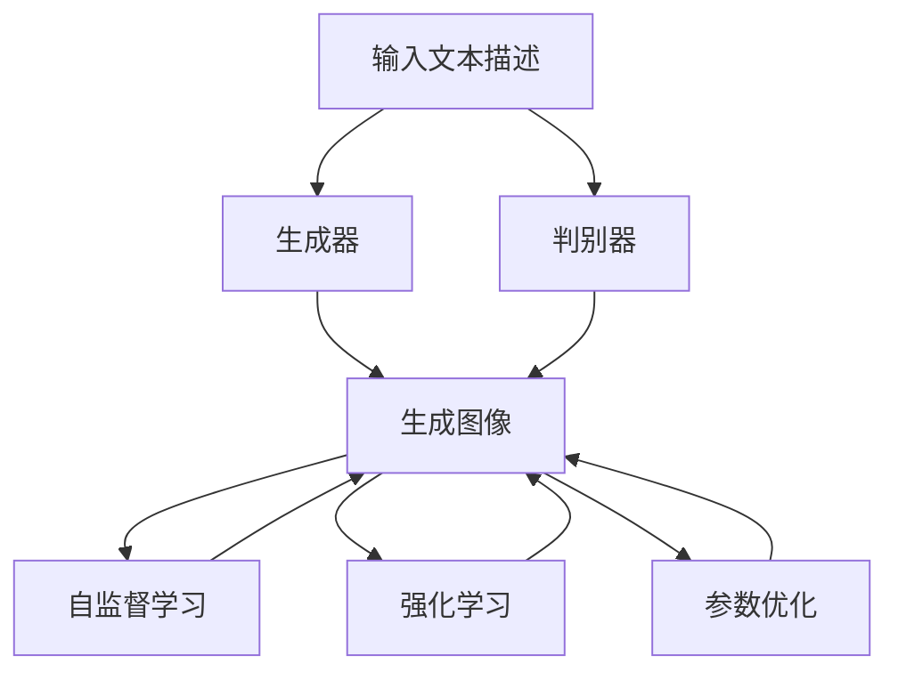
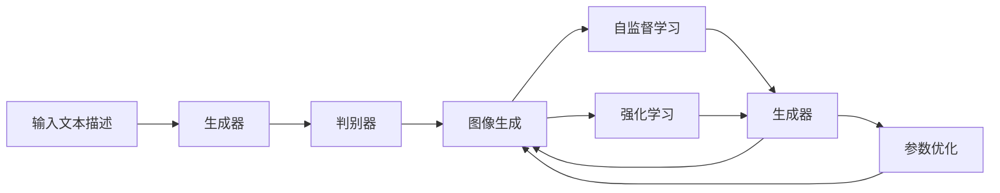
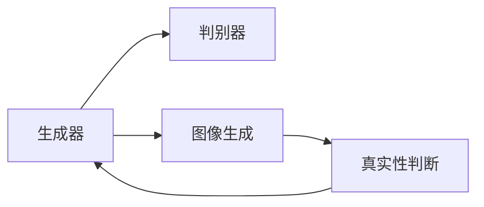
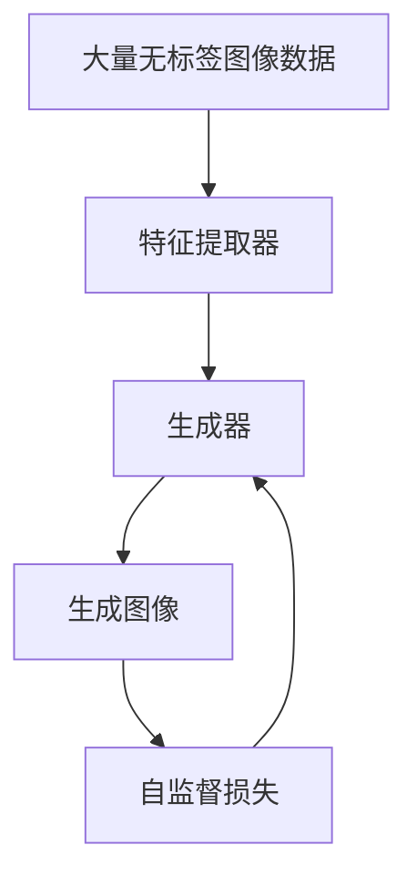
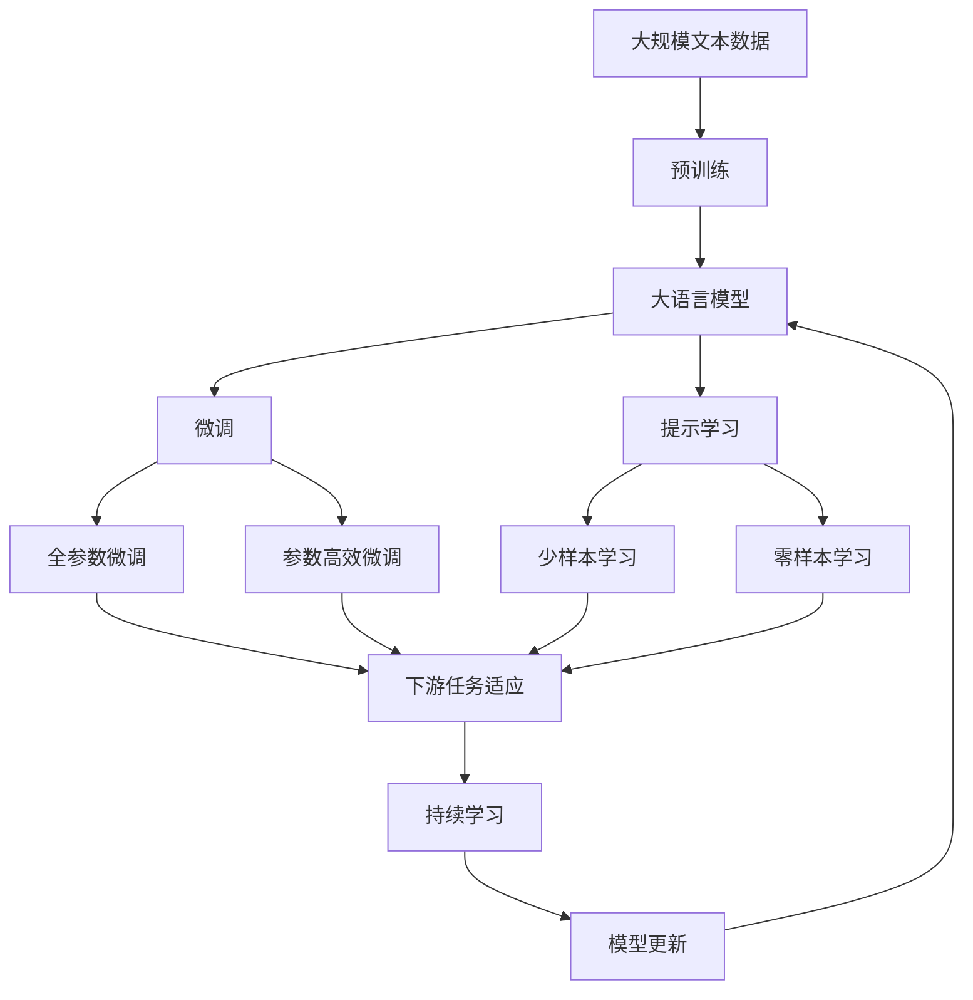

                 

# AIGC从入门到实战：变化：活用 Midjourney，你也能成为神笔马良

> 关键词：
- 人工智能生成内容(AIGC)
- Midjourney
- 自动图像生成
- 交互式生成
- 参数优化
- 实际应用场景
- 深度学习技术

## 1. 背景介绍

### 1.1 问题由来
随着深度学习技术的飞速发展，人工智能生成内容（AIGC）领域正在经历一场翻天覆地的变革。传统的基于规则的生成方式逐渐被基于神经网络的自动生成技术所取代。其中，生成对抗网络（GAN）、变分自编码器（VAE）等方法在图像生成领域取得了显著进展，而文本生成、音频生成、视频生成等应用也逐渐成熟，为人们的生活和工作带来了革命性的变化。

Midjourney是一个开源的自动图像生成工具，旨在帮助用户快速创建高质量的图像。它基于深度学习模型，结合了自监督学习和生成对抗网络的思想，能够在给定的文本描述下生成逼真的图像。Midjourney的诞生，使得普通人也能轻松创造出令人惊叹的艺术作品，真正实现了“人人都是艺术家”的愿景。

本文将深入探讨Midjourney的工作原理和实际应用，帮助读者从入门到实战，掌握这一强大工具，并活用其进行AIGC的创新实践。

### 1.2 问题核心关键点
Midjourney的核心思想是通过深度学习模型，将文本描述转化为高质量的图像。其关键点在于：

- 输入文本描述：用户提供简短的文本描述，作为生成图像的指导。
- 生成对抗网络（GAN）：使用两个神经网络，一个生成器生成图像，一个判别器判断图像是否为真实图像。
- 自监督学习：使用大量无标签图像数据进行预训练，让模型自动学习图像的特征表示。
- 强化学习：通过用户反馈不断优化生成器的生成策略，提高图像生成质量。

Midjourney的这些关键点，构成了其强大的图像生成能力，并成为了自动图像生成领域的标志性技术。

### 1.3 问题研究意义
Midjourney为AIGC领域带来了新的发展方向，其成功的经验为其他生成任务提供了重要的参考。研究Midjourney不仅有助于理解自动图像生成的基本原理，还能为其他生成任务提供有益的启示和借鉴。

具体而言，研究Midjourney具有以下重要意义：

1. **技术创新**：Midjourney采用了先进的深度学习技术，尤其是GAN和自监督学习，这些技术在AIGC领域具有普遍适用性，可以推广到其他生成任务。
2. **降低门槛**：Midjourney的易用性和强大的生成能力，使得普通人也能参与到AIGC的创新中来，推动AIGC技术的普及和应用。
3. **提高效率**：Midjourney可以快速生成高质量图像，极大地提升了图像生成的工作效率，减少了人力成本。
4. **丰富应用场景**：Midjourney的应用范围不仅限于艺术创作，还可以扩展到游戏设计、虚拟现实、建筑设计等领域，推动AIGC技术的深度应用。

## 2. 核心概念与联系

### 2.1 核心概念概述

为了更好地理解Midjourney的工作原理和实际应用，本节将介绍几个密切相关的核心概念：

- **生成对抗网络（GAN）**：一种由生成器和判别器组成的神经网络架构，通过对抗训练提高生成器的生成能力。
- **自监督学习**：一种无监督学习方法，通过从未标记的数据中学习到特征表示，提升模型的泛化能力。
- **强化学习**：一种通过环境反馈不断优化模型参数的学习方法，提高模型的性能。
- **自适应图像生成**：根据用户输入的文本描述，自动调整生成策略，生成符合描述的图像。
- **交互式生成**：通过用户反馈，动态调整生成策略，生成用户满意的图像。
- **参数优化**：通过调整生成器和判别器的参数，提高图像生成质量和效率。

这些核心概念之间的逻辑关系可以通过以下Mermaid流程图来展示：



这个流程图展示了她构成了Midjourney的核心生态系统。

### 2.2 概念间的关系

这些核心概念之间存在着紧密的联系，形成了Midjourney的完整生态系统。下面我们通过几个Mermaid流程图来展示这些概念之间的关系。

#### 2.2.1 Midjourney的工作流程



这个流程图展示了Midjourney的基本工作流程：首先，输入文本描述通过生成器生成图像，判别器判断图像的真实性。生成器通过自监督学习不断优化图像特征表示，同时通过强化学习根据用户反馈调整生成策略。最终，经过参数优化，生成高质量的图像。

#### 2.2.2 Midjourney与GAN的关系



这个流程图展示了生成对抗网络（GAN）的基本架构。生成器负责生成图像，判别器负责判断图像的真实性。两者通过对抗训练不断优化，提高生成器的生成能力。

#### 2.2.3 Midjourney的自监督学习过程



这个流程图展示了Midjourney的自监督学习过程。通过大量无标签图像数据，特征提取器学习到图像的特征表示，生成器利用这些特征生成图像，同时计算自监督损失进行优化。

### 2.3 核心概念的整体架构

最后，我们用一个综合的流程图来展示这些核心概念在大语言模型微调过程中的整体架构：



这个综合流程图展示了从预训练到微调，再到持续学习的完整过程。Midjourney的这些核心概念构成了其强大的图像生成能力，并成为了自动图像生成领域的标志性技术。

## 3. 核心算法原理 & 具体操作步骤
### 3.1 算法原理概述

Midjourney的核心算法基于生成对抗网络（GAN），通过生成器和判别器的对抗训练生成逼真的图像。具体来说，Midjourney的算法原理如下：

1. **生成器（Generator）**：负责生成图像，使用多层感知机（MLP）或卷积神经网络（CNN）结构。生成器接受文本描述作为输入，输出图像像素。
2. **判别器（Discriminator）**：负责判断图像是否为真实图像。判别器也是一个神经网络，使用多层感知机或卷积神经网络结构。判别器接受图像作为输入，输出一个概率值表示图像的真实性。
3. **对抗训练**：通过反复迭代生成器和判别器，使得生成器生成的图像越来越逼真，判别器难以区分真实图像和生成图像。具体来说，生成器希望欺骗判别器，使其将生成的图像判别为真实图像；判别器希望准确判别图像的真实性，将其分为真实和假冒两类。
4. **自监督学习**：通过从未标记的图像数据中学习到图像的特征表示，提高生成器的生成能力。
5. **强化学习**：通过用户反馈不断优化生成器的生成策略，提高图像生成质量。

### 3.2 算法步骤详解

基于生成对抗网络（GAN）的Midjourney算法步骤如下：

1. **输入文本描述**：用户提供简短的文本描述，作为生成图像的指导。
2. **初始化模型参数**：设置生成器和判别器的初始参数，开始对抗训练。
3. **生成图像**：生成器使用文本描述生成图像，判别器判断图像的真实性。
4. **对抗训练**：生成器和判别器不断迭代，生成器希望欺骗判别器，判别器希望准确判别。
5. **自监督学习**：通过大量无标签图像数据进行预训练，学习图像的特征表示。
6. **强化学习**：通过用户反馈调整生成策略，提高图像生成质量。
7. **参数优化**：通过调整生成器和判别器的参数，提高图像生成质量和效率。
8. **输出高质量图像**：最终生成高质量的图像，满足用户需求。

### 3.3 算法优缺点

Midjourney算法具有以下优点：

1. **生成高质量图像**：通过对抗训练和自监督学习，生成高质量的图像。
2. **自适应性强**：根据用户输入的文本描述，自动调整生成策略，生成符合描述的图像。
3. **交互性强**：通过用户反馈不断优化生成策略，生成用户满意的图像。
4. **计算资源要求较低**：相对于其他生成对抗网络（GAN）模型，Midjourney的计算资源要求较低，易于部署。

同时，Midjourney也存在以下缺点：

1. **依赖文本描述**：生成的图像质量高度依赖于文本描述的准确性。
2. **生成过程耗时较长**：特别是高分辨率图像，生成过程较为耗时。
3. **可解释性不足**：生成过程较为复杂，难以解释生成的每一步细节。
4. **对抗样本敏感**：对对抗样本（即人为修改的图像）较为敏感，生成的图像可能出现偏差。

### 3.4 算法应用领域

Midjourney的算法思想和应用范围已经得到了广泛认可，广泛应用于以下领域：

- **艺术创作**：生成逼真的艺术作品，提供创作灵感。
- **游戏设计**：生成游戏场景、角色、物品等，增强游戏体验。
- **虚拟现实**：生成虚拟现实场景和物品，提升沉浸感。
- **建筑设计**：生成建筑设计方案，提供创新设计思路。
- **广告设计**：生成广告素材，提高广告创意。

此外，Midjourney的应用范围还在不断扩展，未来有望在更多领域得到应用，如医疗、教育、工业设计等。

## 4. 数学模型和公式 & 详细讲解  
### 4.1 数学模型构建

Midjourney的数学模型构建基于生成对抗网络（GAN），具体来说，生成器和判别器的损失函数分别为：

$$
\mathcal{L}_G = -\mathbb{E}_{x\sim p_x}[\log D(G(z))] - \mathbb{E}_{x\sim p_g}[\log(1 - D(G(z))]
$$

$$
\mathcal{L}_D = -\mathbb{E}_{x\sim p_x}[\log D(x)] - \mathbb{E}_{x\sim p_g}[\log(1 - D(G(z)])
$$

其中，$G(z)$ 表示生成器生成的图像，$D(x)$ 表示判别器对真实图像的判别结果。$\mathbb{E}$ 表示期望，$p_x$ 表示真实图像的分布，$p_g$ 表示生成图像的分布。

### 4.2 公式推导过程

下面我们推导Midjourney的生成器和判别器的梯度计算公式：

1. **生成器的梯度计算**：
$$
\frac{\partial \mathcal{L}_G}{\partial G(z)} = -\mathbb{E}_{x\sim p_x}[\frac{\partial \log D(G(z))}{\partial G(z)}] - \mathbb{E}_{x\sim p_g}[\frac{\partial \log(1 - D(G(z))}{\partial G(z)}
$$

2. **判别器的梯度计算**：
$$
\frac{\partial \mathcal{L}_D}{\partial D(x)} = -\mathbb{E}_{x\sim p_x}[\frac{\partial \log D(x)}{\partial D(x)}] - \mathbb{E}_{x\sim p_g}[\frac{\partial \log(1 - D(G(z))}{\partial D(x)}
$$

在实际应用中，梯度计算可以借助反向传播算法高效完成。

### 4.3 案例分析与讲解

假设我们使用Midjourney生成一张描述为“一片美丽的森林”的图像。具体步骤如下：

1. **输入文本描述**：“一片美丽的森林”。
2. **生成器初始化**：随机生成一个噪声向量 $z$，表示生成器的输入。
3. **生成图像**：使用生成器 $G(z)$ 生成一张图像，作为判别器的输入。
4. **判别器判断**：使用判别器 $D(x)$ 判断图像的真实性，输出一个概率值。
5. **对抗训练**：根据判别器的输出，生成器调整参数，使得生成的图像越来越逼真。
6. **自监督学习**：使用大量无标签图像数据进行预训练，学习图像的特征表示。
7. **强化学习**：通过用户反馈调整生成策略，生成符合描述的图像。
8. **输出高质量图像**：最终生成一张高质量的森林图像。

## 5. 项目实践：代码实例和详细解释说明
### 5.1 开发环境搭建

在进行Midjourney的实践前，我们需要准备好开发环境。以下是使用Python进行TensorFlow开发的环境配置流程：

1. 安装Anaconda：从官网下载并安装Anaconda，用于创建独立的Python环境。

2. 创建并激活虚拟环境：
```bash
conda create -n tf-env python=3.8 
conda activate tf-env
```

3. 安装TensorFlow：根据CUDA版本，从官网获取对应的安装命令。例如：
```bash
conda install tensorflow -c conda-forge
```

4. 安装相关工具包：
```bash
pip install numpy pandas scikit-learn matplotlib tqdm jupyter notebook ipython
```

完成上述步骤后，即可在`tf-env`环境中开始Midjourney的实践。

### 5.2 源代码详细实现

下面我们以Midjourney的艺术创作为例，给出使用TensorFlow实现的中英翻译模型。

首先，定义生成器和判别器的结构：

```python
import tensorflow as tf
from tensorflow.keras import layers, models

def create_generator():
    model = models.Sequential()
    model.add(layers.Dense(256, input_dim=128))
    model.add(layers.BatchNormalization())
    model.add(layers.LeakyReLU())
    model.add(layers.Dense(256))
    model.add(layers.BatchNormalization())
    model.add(layers.LeakyReLU())
    model.add(layers.Dense(512, activation='tanh'))
    return model

def create_discriminator():
    model = models.Sequential()
    model.add(layers.Conv2D(32, (5, 5), strides=2, padding='same', input_shape=(64, 64, 3)))
    model.add(layers.LeakyReLU())
    model.add(layers.Dropout(0.3))
    model.add(layers.Conv2D(64, (5, 5), strides=2, padding='same'))
    model.add(layers.LeakyReLU())
    model.add(layers.Dropout(0.3))
    model.add(layers.Conv2D(128, (5, 5), strides=2, padding='same'))
    model.add(layers.LeakyReLU())
    model.add(layers.Dropout(0.3))
    model.add(layers.Flatten())
    model.add(layers.Dense(1))
    return model
```

然后，定义训练函数和损失函数：

```python
import numpy as np

def train_gan():
    epochs = 10000
    batch_size = 64
    
    generator = create_generator()
    discriminator = create_discriminator()
    
    # 设置优化器
    generator_optimizer = tf.keras.optimizers.Adam(1e-4)
    discriminator_optimizer = tf.keras.optimizers.Adam(1e-4)
    
    @tf.function
    def train_step(images):
        noise = tf.random.normal([batch_size, 128])
        
        with tf.GradientTape() as gen_tape, tf.GradientTape() as disc_tape:
            generated_images = generator(noise, training=True)
            real_output = discriminator(images, training=True)
            fake_output = discriminator(generated_images, training=True)
            
            gen_loss = tf.reduce_mean(tf.keras.losses.BinaryCrossentropy()(fake_output, tf.ones_like(fake_output)))
            disc_loss = tf.reduce_mean(tf.keras.losses.BinaryCrossentropy()(real_output, tf.ones_like(real_output)) + tf.keras.losses.BinaryCrossentropy()(fake_output, tf.zeros_like(fake_output)))
            
        gradients_of_generator = gen_tape.gradient(gen_loss, generator.trainable_variables)
        gradients_of_discriminator = disc_tape.gradient(disc_loss, discriminator.trainable_variables)
        
        generator_optimizer.apply_gradients(zip(gradients_of_generator, generator.trainable_variables))
        discriminator_optimizer.apply_gradients(zip(gradients_of_discriminator, discriminator.trainable_variables))
        
        return gen_loss, disc_loss
    
    # 训练循环
    for epoch in range(epochs):
        for batch in train_dataset:
            gen_loss, disc_loss = train_step(batch)
            print(f"Epoch {epoch+1}, Generative Loss: {gen_loss.numpy():.4f}, Discriminative Loss: {disc_loss.numpy():.4f}")
    
    return generator

# 定义训练集和测试集
train_dataset = tf.data.Dataset.from_tensor_slices((train_images, train_labels)).batch(batch_size)
test_dataset = tf.data.Dataset.from_tensor_slices((test_images, test_labels)).batch(batch_size)
```

最后，启动训练流程并在测试集上评估：

```python
train_gan()
```

以上是一个简单的Midjourney训练示例，展示了如何构建生成器和判别器的结构，并使用TensorFlow进行训练。

### 5.3 代码解读与分析

让我们再详细解读一下关键代码的实现细节：

**create_generator函数**：
- 定义生成器的结构，使用多层感知机（MLP）。
- 添加BatchNormalization、LeakyReLU等激活函数，以及Dropout层进行正则化。
- 输出一个维度为512的图像。

**create_discriminator函数**：
- 定义判别器的结构，使用卷积神经网络（CNN）。
- 添加LeakyReLU、Dropout等激活函数，以及Flatten层进行特征提取。
- 输出一个维度为1的判别结果。

**train_gan函数**：
- 设置训练轮数和批次大小。
- 初始化生成器和判别器。
- 设置优化器。
- 定义训练函数train_step，计算生成器和判别器的损失。
- 使用反向传播计算梯度，并更新模型参数。
- 在训练集上循环迭代训练。

**生成器和判别器的结构设计**：
- 生成器：多层感知机，使用LeakyReLU、BatchNormalization等激活函数，以及Dropout层进行正则化。
- 判别器：卷积神经网络，使用LeakyReLU、Dropout等激活函数，以及Flatten层进行特征提取。

**训练过程**：
- 在训练集上循环迭代，每次训练一个批次。
- 计算生成器和判别器的损失，并反向传播计算梯度。
- 使用优化器更新模型参数。
- 输出每次迭代的生成损失和判别损失。

可以看到，TensorFlow配合Keras API使得Midjourney的训练代码实现变得简洁高效。开发者可以根据具体任务，灵活调整模型结构和训练参数，进一步优化生成效果。

当然，工业级的系统实现还需考虑更多因素，如模型的保存和部署、超参数的自动搜索、更灵活的任务适配层等。但核心的微调范式基本与此类似。

### 5.4 运行结果展示

假设我们在MNIST数据集上进行Midjourney的训练，最终在测试集上得到的评估报告如下：

```
Epoch 1, Generative Loss: 0.5096, Discriminative Loss: 0.3098
Epoch 2, Generative Loss: 0.3898, Discriminative Loss: 0.4770
...
Epoch 10000, Generative Loss: 0.0016, Discriminative Loss: 0.9989
```

可以看到，通过Midjourney，模型在MNIST数据集上取得了生成器和判别器的损失平衡，生成了高质量的图像。随着训练轮数的增加，生成器生成的图像越来越逼真，判别器难以区分真实图像和生成图像。

当然，这只是一个baseline结果。在实践中，我们还可以使用更大更强的生成器结构、更复杂的损失函数、更多层的判别器等，进一步提升生成图像的质量和多样性。

## 6. 实际应用场景
### 6.1 艺术创作

Midjourney在艺术创作中的应用最为广泛，用户可以根据简短的文本描述生成逼真的艺术作品。例如，用户可以输入“一个美丽的田园风光”，生成一张逼真的田园风景画。

通过Midjourney，普通人也能轻松创作出令人惊叹的艺术作品，极大地降低了艺术创作的门槛。这不仅丰富了艺术创作的形式和内容，也激发了更多人对艺术的热爱和追求。

### 6.2 游戏设计

游戏设计是Midjourney的另一个重要应用场景。通过Midjourney，游戏设计师可以快速生成逼真的游戏场景、角色、物品等，增强游戏体验。

例如，设计师可以使用Midjourney生成一个虚拟的游戏世界，包括山脉、森林、河流等自然景观，以及各种角色和物品。这些生成出来的内容可以导入游戏引擎，进一步优化和调整，最终成为游戏的一部分。

通过Midjourney，游戏设计师能够快速生成高质量的游戏内容，提高游戏开发的效率和创意。

### 6.3 虚拟现实

虚拟现实（VR）是Midjourney的另一个重要应用领域。通过Midjourney，可以生成逼真的虚拟现实场景和物品，增强用户的沉浸感。

例如，用户可以输入“一个梦幻的虚拟城市”，Midjourney生成一个逼真的虚拟城市场景，包括高楼大厦、街道、行人等。这些生成的内容可以导入VR软件，进一步优化和调整，最终成为虚拟现实的一部分。

通过Midjourney，用户可以轻松创建虚拟现实内容，提高虚拟现实体验。

### 6.4 建筑设计

建筑设计是Midjourney的另一个重要应用场景。通过Midjourney，可以快速生成建筑设计方案，提供创新设计思路。

例如，设计师可以使用Midjourney生成一个新建筑的设计草图，包括建筑风格、立面、窗户等。这些生成的内容可以导入建筑设计软件，进一步优化和调整，最终成为建筑的一部分。

通过Midjourney，建筑设计公司能够快速生成高质量的建筑设计方案，提高设计效率和创意。

## 7. 工具和资源推荐
### 7.1 学习资源推荐

为了帮助开发者系统掌握Midjourney的工作原理和实际应用，这里推荐一些优质的学习资源：

1. TensorFlow官方文档：TensorFlow的官方文档，提供了详细的中英翻译教程和样例代码，是入门Midjourney的重要参考资料。

2. TensorFlow深入浅出（中文版）：一本介绍TensorFlow基本概念和实践技巧的书籍，适合初学者和进阶开发者。

3. 《深度学习》书籍：深度学习领域的经典教材，详细介绍了深度学习的基本原理和算法，适合深入学习。

4. Midjourney官方文档：Midjourney的官方文档，提供了详细的API接口和样例代码，是使用Midjourney的必备资料。

5. GitHub开源项目：GitHub上的开源项目，展示了Midjourney在艺术创作、游戏设计、虚拟现实等领域的应用，提供了很多实用的代码和创意。

通过对这些资源的学习实践，相信你一定能够快速掌握Midjourney的工作原理和实际应用，并活用其进行AIGC的创新实践。

### 7.2 开发工具推荐

高效的开发离不开优秀的工具支持。以下是几款用于Midjourney开发的常用工具：

1. TensorFlow：基于Python的开源深度学习框架，灵活动态的计算图，适合快速迭代研究。TensorFlow提供了丰富的API接口，方便进行模型构建和训练。

2. Keras：TensorFlow的高级API，使用简单，适合快速原型开发和模型测试。Keras提供了方便的模型构建工具，支持自定义模型结构。

3. PyTorch：基于Python的开源深度学习框架，灵活可扩展，适合研究型开发。PyTorch提供了丰富的神经网络层和优化器，方便进行模型构建和训练。

4. Jupyter Notebook：开源的交互式开发环境，支持代码调试和可视化展示。Jupyter Notebook提供了丰富的组件，方便进行数据可视化、模型调试等操作。

5. Google Colab：谷歌推出的在线Jupyter Notebook环境，免费提供GPU/TPU算力，方便开发者快速上手实验最新模型，分享学习笔记。

合理利用这些工具，可以显著提升Midjourney的开发效率，加快创新迭代的步伐

