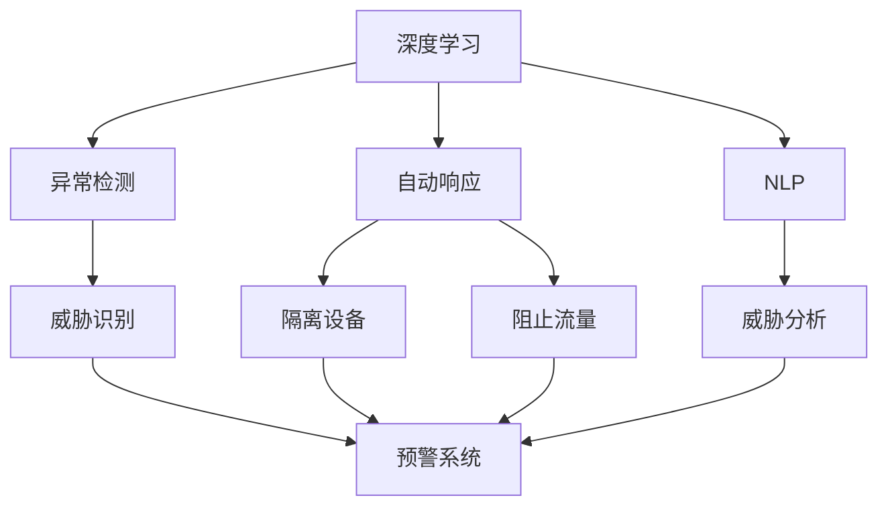
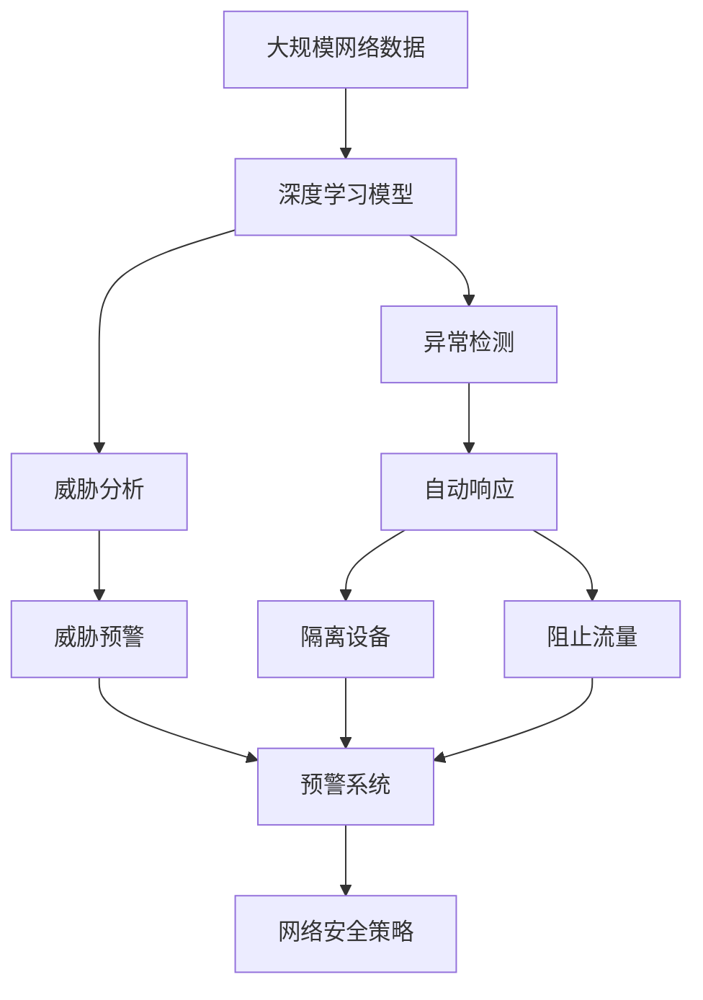

                 

## 1. 背景介绍

随着人工智能（AI）技术的不断进步，AI在网络安全领域的应用也日益广泛。网络安全是一个复杂且不断演化的领域，需要持续监控和响应各种威胁。AI在网络安全中的应用可以帮助识别威胁、预测攻击、自动响应和优化安全策略，从而提高网络的安全性。

### 1.1 问题由来

在传统的网络安全解决方案中，依赖人工监控和反应的方式往往难以应对越来越复杂和频繁的网络攻击。人工智能Agent的应用能够实现自动化、实时监控和响应，从而提升网络安全性能。

### 1.2 问题核心关键点

AI Agent在网络安全中的应用，主要体现在以下几个方面：

1. **异常检测与识别**：AI Agent能够实时监控网络流量和行为，利用机器学习算法（如深度学习、神经网络）来识别异常行为和潜在威胁。
2. **威胁预测与预警**：通过分析历史数据和当前网络行为，AI Agent可以预测未来的威胁，并提前发出预警。
3. **自动化响应**：AI Agent可以根据威胁级别自动执行响应措施，如隔离受感染的设备、阻止攻击流量等。
4. **安全策略优化**：AI Agent能够分析安全策略的有效性，自动调整和优化安全策略。

这些关键点共同构成了AI Agent在网络安全中的应用框架，使得网络安全防御更加智能化和自动化。

### 1.3 问题研究意义

研究AI Agent在网络安全中的应用，对于提升网络防御水平、降低安全运营成本、应对高级持续性威胁（APT）具有重要意义。它可以帮助企业构建更为安全可靠的网络环境，同时减少对人工操作的依赖，提升整体防御效率。

## 2. 核心概念与联系

### 2.1 核心概念概述

为更好地理解AI Agent在网络安全中的应用，本节将介绍几个关键概念：

- **人工智能Agent（AI Agent）**：指在特定环境中，可以感知环境、执行任务和学习的软件实体。在网络安全中，AI Agent可以用于威胁检测、响应和策略优化。
- **深度学习（Deep Learning）**：一种基于人工神经网络的机器学习技术，能够处理大规模数据集，并从中学习复杂模式。
- **自然语言处理（Natural Language Processing, NLP）**：使计算机能够理解、解释和生成人类语言的技术。
- **机器学习（Machine Learning）**：一种使计算机通过数据学习和改进的技术。
- **自动响应（Automated Response）**：AI Agent能够根据威胁类型自动执行预设的响应措施。
- **异常检测（Anomaly Detection）**：通过分析和比较网络行为与正常模式，检测异常行为。

这些核心概念之间的联系和互动关系，可以通过以下Mermaid流程图来展示：



这个流程图展示了大语言模型微调过程中各个核心概念之间的关系：

1. 深度学习技术被用于异常检测和威胁分析。
2. NLP技术帮助分析威胁和生成警报信息。
3. 异常检测和威胁分析结果触发自动响应措施。
4. 自动响应包括隔离设备、阻止流量等。
5. 威胁分析结果和预警系统结合，提前发出威胁预警。

### 2.2 概念间的关系

这些核心概念之间存在着紧密的联系，形成了AI Agent在网络安全中的应用框架。下面是这些概念之间的关系概述：

1. **深度学习与异常检测**：深度学习模型能够从网络流量中学习异常模式，从而实现高效的异常检测。
2. **NLP与威胁分析**：NLP技术可以分析攻击报告、日志等文本信息，提供更准确的威胁评估。
3. **自动响应与威胁识别**：AI Agent能够根据威胁类型自动执行响应措施，如隔离受感染的设备。
4. **异常检测与威胁识别**：异常检测是威胁识别的基础，异常行为往往是威胁的先兆。
5. **威胁分析与预警**：通过分析威胁类型和严重程度，预警系统可以提前发出警报。

这些概念共同构成了AI Agent在网络安全中的应用基础，为其提供了解决方案的完整框架。

### 2.3 核心概念的整体架构

最后，我们用一个综合的流程图来展示这些核心概念在大语言模型微调过程中的整体架构：



这个综合流程图展示了从网络数据输入到最终的网络安全策略调整的完整过程。通过深度学习模型进行异常检测和威胁分析，AI Agent根据分析结果执行自动响应措施，并结合预警系统提前发出警报。最终，AI Agent通过不断学习优化网络安全策略，从而构建更加高效的网络安全防御系统。

## 3. 核心算法原理 & 具体操作步骤

### 3.1 算法原理概述

AI Agent在网络安全中的应用，主要依赖于机器学习算法，特别是深度学习和自然语言处理技术。其核心原理如下：

1. **数据准备**：收集和处理网络流量数据，标记异常行为和威胁。
2. **模型训练**：使用深度学习模型训练异常检测和威胁分析模型。
3. **实时监控**：部署AI Agent，实时监控网络流量和行为。
4. **威胁识别与响应**：根据实时监控结果，识别威胁并执行自动响应措施。
5. **策略优化**：通过持续学习和调整，优化安全策略。

### 3.2 算法步骤详解

AI Agent在网络安全中的应用可以分为以下几个步骤：

**Step 1: 数据准备与预处理**

1. 收集网络流量数据，包括设备日志、网络流量、访问请求等。
2. 对数据进行预处理，如去噪、归一化、特征提取等。
3. 标记异常行为和威胁，构建标注数据集。

**Step 2: 模型训练与优化**

1. 选择合适的深度学习模型，如卷积神经网络（CNN）、循环神经网络（RNN）或变换器（Transformer）。
2. 使用标注数据集训练模型，优化模型参数。
3. 使用交叉验证等方法验证模型性能，调整模型结构。

**Step 3: 部署与实时监控**

1. 将训练好的模型部署到网络安全设备上。
2. 实时监控网络流量和行为，收集数据。
3. 使用训练好的模型进行异常检测和威胁分析。

**Step 4: 威胁识别与响应**

1. 根据检测结果识别威胁类型和严重程度。
2. 根据威胁类型执行预设的自动响应措施，如隔离设备、阻止流量等。
3. 记录响应结果，评估模型性能。

**Step 5: 策略优化与迭代**

1. 收集响应结果和后续数据，分析模型性能。
2. 根据分析结果，调整和优化模型参数。
3. 持续学习和迭代，提高模型性能。

### 3.3 算法优缺点

AI Agent在网络安全中的应用，具有以下优点：

1. **实时性和自动化**：AI Agent能够实时监控网络流量和行为，自动执行响应措施，减少人工操作。
2. **高精度和泛化能力**：深度学习模型能够处理复杂模式，提供高精度的异常检测和威胁分析。
3. **动态调整与优化**：AI Agent能够根据威胁类型和历史数据，动态调整和优化安全策略。

同时，也存在一些缺点：

1. **数据依赖**：AI Agent的性能依赖于高质量的标注数据，数据收集和标注成本较高。
2. **模型复杂度**：深度学习模型的训练和优化需要较大的计算资源，可能存在过拟合问题。
3. **解释性不足**：AI Agent的决策过程不够透明，难以解释其行为。

### 3.4 算法应用领域

AI Agent在网络安全中的应用，广泛应用于以下几个领域：

1. **入侵检测系统（IDS）**：实时监控网络流量，识别和阻止入侵行为。
2. **安全信息与事件管理（SIEM）**：收集和分析安全事件，提供实时警报。
3. **高级持续性威胁（APT）检测**：识别高级持续性攻击，提供精准的威胁预警。
4. **端点保护**：保护设备和系统免受恶意软件和网络攻击。
5. **威胁情报分析**：分析威胁情报，提高网络安全防护能力。

## 4. 数学模型和公式 & 详细讲解  
### 4.1 数学模型构建

本节将使用数学语言对AI Agent在网络安全中的应用过程进行更加严格的刻画。

记网络流量数据为 $X=\{x_1, x_2, \dots, x_n\}$，其中 $x_i$ 为网络流量数据的一个样本。标注数据集为 $Y=\{y_1, y_2, \dots, y_n\}$，其中 $y_i$ 为 $x_i$ 对应的异常标记（0或1）。

定义深度学习模型为 $f(X; \theta)$，其中 $\theta$ 为模型参数。异常检测的目标是找到最优参数 $\theta^*$，使得模型在测试集上的准确率最高。

### 4.2 公式推导过程

以深度学习模型为例，假设使用卷积神经网络（CNN）进行异常检测。异常检测的损失函数为：

$$
L(f) = -\frac{1}{N}\sum_{i=1}^N [y_i \log f(x_i) + (1-y_i) \log(1-f(x_i))]
$$

其中 $f(x_i)$ 为模型对 $x_i$ 的预测结果，$\log$ 为自然对数。

根据梯度下降算法，模型的参数更新公式为：

$$
\theta \leftarrow \theta - \eta \nabla_{\theta}L(f)
$$

其中 $\eta$ 为学习率，$\nabla_{\theta}L(f)$ 为损失函数对参数 $\theta$ 的梯度。

在训练过程中，通过反向传播算法计算梯度，并使用随机梯度下降（SGD）或Adam等优化算法进行参数更新。最终，在测试集上评估模型的准确率，不断调整模型参数，直到达到最佳性能。

### 4.3 案例分析与讲解

假设使用CNN进行异常检测，其网络结构如下：

```
       conv1  conv2  ...
      ↓      ↓       ...
      pool1  pool2  ...
      ↓      ↓       ...
       fc1    fc2    ...
       ↓      ↓       ...
        softmax
```

其中 conv、pool、fc 分别表示卷积、池化和全连接层。假设使用ReLU激活函数和交叉熵损失函数。

在训练过程中，每个样本 $x_i$ 经过卷积层、池化层和全连接层后，输出预测结果 $f(x_i)$。根据标注数据集 $Y$，计算损失函数 $L(f)$，并使用梯度下降算法更新模型参数 $\theta$。

假设使用交叉熵损失函数，其公式为：

$$
L(f) = -\frac{1}{N}\sum_{i=1}^N [y_i \log f(x_i) + (1-y_i) \log(1-f(x_i))]
$$

在训练过程中，每次迭代时，对每个样本 $x_i$ 计算梯度 $\nabla_{\theta}L(f)$，并使用 SGD 或 Adam 等优化算法更新模型参数 $\theta$。最终在测试集上评估模型的准确率，不断调整模型参数，直到达到最佳性能。

## 5. 项目实践：代码实例和详细解释说明

### 5.1 开发环境搭建

在进行AI Agent在网络安全中的应用实践前，我们需要准备好开发环境。以下是使用Python进行TensorFlow开发的 environment配置流程：

1. 安装Anaconda：从官网下载并安装Anaconda，用于创建独立的Python环境。

2. 创建并激活虚拟环境：
```bash
conda create -n tf-env python=3.8 
conda activate tf-env
```

3. 安装TensorFlow：根据CUDA版本，从官网获取对应的安装命令。例如：
```bash
conda install tensorflow==2.3 
```

4. 安装各类工具包：
```bash
pip install numpy pandas scikit-learn matplotlib tqdm jupyter notebook ipython
```

完成上述步骤后，即可在`tf-env`环境中开始AI Agent在网络安全中的应用实践。

### 5.2 源代码详细实现

这里我们以一个简单的网络异常检测模型为例，使用TensorFlow进行编码和训练。

首先，定义模型的超参数和数据处理函数：

```python
import tensorflow as tf
from tensorflow.keras import layers
import numpy as np

# 定义超参数
batch_size = 32
learning_rate = 0.001
epochs = 10

# 定义数据处理函数
def preprocess_data(data):
    # 数据归一化
    data = (data - np.mean(data)) / np.std(data)
    return data
```

接着，定义网络模型：

```python
class Network(tf.keras.Model):
    def __init__(self, num_classes):
        super(Network, self).__init__()
        self.conv1 = layers.Conv2D(32, (3, 3), activation='relu')
        self.pool1 = layers.MaxPooling2D((2, 2))
        self.conv2 = layers.Conv2D(64, (3, 3), activation='relu')
        self.pool2 = layers.MaxPooling2D((2, 2))
        self.fc1 = layers.Dense(64, activation='relu')
        self.fc2 = layers.Dense(num_classes)

    def call(self, x):
        x = self.conv1(x)
        x = self.pool1(x)
        x = self.conv2(x)
        x = self.pool2(x)
        x = layers.Flatten()(x)
        x = self.fc1(x)
        x = self.fc2(x)
        return x
```

然后，加载和处理数据集：

```python
# 加载数据集
train_data = np.load('train_data.npy')
train_labels = np.load('train_labels.npy')
test_data = np.load('test_data.npy')
test_labels = np.load('test_labels.npy')

# 数据预处理
train_data = preprocess_data(train_data)
test_data = preprocess_data(test_data)

# 构建数据集
train_dataset = tf.data.Dataset.from_tensor_slices((train_data, train_labels))
train_dataset = train_dataset.shuffle(10000).batch(batch_size)

test_dataset = tf.data.Dataset.from_tensor_slices((test_data, test_labels))
test_dataset = test_dataset.batch(batch_size)
```

最后，训练和评估模型：

```python
# 定义模型
model = Network(num_classes=2)

# 定义损失函数和优化器
loss_fn = tf.keras.losses.BinaryCrossentropy()
optimizer = tf.keras.optimizers.Adam(learning_rate)

# 训练模型
model.compile(optimizer=optimizer, loss=loss_fn, metrics=['accuracy'])
model.fit(train_dataset, epochs=epochs, validation_data=test_dataset)

# 评估模型
test_loss, test_acc = model.evaluate(test_dataset)
print(f'Test accuracy: {test_acc:.2f}')
```

以上就是使用TensorFlow进行网络异常检测模型的完整代码实现。可以看到，TensorFlow的Keras API使得模型搭建和训练过程变得简洁高效。

### 5.3 代码解读与分析

让我们再详细解读一下关键代码的实现细节：

**Network类**：
- `__init__`方法：初始化模型结构，包含多个卷积层、池化层和全连接层。
- `call`方法：定义模型的前向传播过程，包括卷积、池化、全连接等操作。

**数据预处理**：
- `preprocess_data`函数：对输入数据进行归一化处理，确保数据在相同尺度下进行比较。

**训练和评估函数**：
- `train_dataset`和`test_dataset`：定义训练集和测试集的TensorFlow数据集。
- `model.compile`：配置模型的优化器和损失函数。
- `model.fit`：训练模型，在每个epoch结束时评估模型性能。
- `model.evaluate`：在测试集上评估模型的最终性能。

通过上述代码，我们构建了一个简单的网络异常检测模型，并使用TensorFlow进行训练和评估。在实际应用中，还需要考虑更多因素，如模型裁剪、量化加速、服务化封装等。但核心的模型搭建和训练过程基本与此类似。

## 6. 实际应用场景

### 6.1 智能入侵检测系统

智能入侵检测系统（IDS）是AI Agent在网络安全中的一个重要应用。传统的IDS依赖于规则匹配和人工监控，难以应对日益复杂的网络威胁。通过AI Agent，IDS能够实时监控网络流量，自动检测和响应异常行为，从而提高入侵检测的准确率和效率。

在技术实现上，可以收集网络流量数据，使用深度学习模型训练异常检测模型，部署在IDS设备上。AI Agent能够实时监控网络流量，识别异常行为并触发警报。一旦检测到入侵行为，IDS自动执行隔离设备、阻止流量等响应措施。

### 6.2 安全信息与事件管理（SIEM）

安全信息与事件管理（SIEM）系统用于收集、分析和报告安全事件。传统的SIEM系统依赖于人工处理和分析，难以应对海量事件。通过AI Agent，SIEM系统能够自动分析安全事件，提供实时警报和威胁情报。

在技术实现上，可以收集日志和警报数据，使用自然语言处理技术分析事件描述，提取威胁情报。AI Agent能够自动分析事件，识别威胁类型和严重程度，并生成警报信息。此外，AI Agent还可以分析威胁情报，提供预警和防护建议。

### 6.3 高级持续性威胁（APT）检测

高级持续性威胁（APT）攻击具有高度隐蔽性和持续性，传统的检测手段难以识别。通过AI Agent，APT检测系统能够识别复杂的攻击模式和行为，提供精准的威胁预警。

在技术实现上，可以收集高级持续性攻击的特征和行为，使用深度学习模型训练威胁检测模型。AI Agent能够实时监控网络流量和行为，识别复杂的APT攻击，并生成警报信息。一旦检测到APT攻击，APT检测系统自动执行隔离设备、阻止流量等响应措施。

### 6.4 端点保护

端点保护系统用于保护设备和系统免受恶意软件和网络攻击。传统的端点保护依赖于签名检测和规则匹配，难以应对未知威胁。通过AI Agent，端点保护系统能够实时监控设备和系统，自动检测和响应威胁。

在技术实现上，可以收集设备和系统日志数据，使用深度学习模型训练异常检测模型。AI Agent能够实时监控设备和系统，识别异常行为和威胁，并执行隔离设备、阻止流量等响应措施。此外，AI Agent还可以自动分析威胁情报，提供防护建议。

## 7. 工具和资源推荐

### 7.1 学习资源推荐

为了帮助开发者系统掌握AI Agent在网络安全中的应用理论基础和实践技巧，这里推荐一些优质的学习资源：

1. **《TensorFlow官方文档》**：TensorFlow的官方文档，提供了完整的API参考和示例代码，是快速入门和深入学习的首选资源。

2. **《深度学习网络安全》书籍**：介绍深度学习在网络安全中的应用，涵盖异常检测、威胁分析等内容，适合深入学习。

3. **《AI安全课程》视频**：斯坦福大学提供的在线课程，讲解AI Agent在网络安全中的应用，适合初学者入门。

4. **《自然语言处理与网络安全》论文**：多篇经典论文，探讨NLP在网络安全中的应用，如威胁情报分析、自动响应等。

5. **《网络安全顶级会议》论文**：如IEEE TNSRE、ACM CCS等顶级会议论文，涵盖最新的网络安全研究成果和应用实践。

通过对这些资源的学习实践，相信你一定能够快速掌握AI Agent在网络安全中的应用精髓，并用于解决实际的网络安全问题。

### 7.2 开发工具推荐

高效的开发离不开优秀的工具支持。以下是几款用于AI Agent在网络安全中应用的开发工具：

1. **TensorFlow**：由Google主导开发的深度学习框架，提供了强大的模型训练和部署能力。

2. **PyTorch**：Facebook开发的深度学习框架，提供了灵活的动态计算图和丰富的优化器。

3. **Keras**：高层API框架，基于TensorFlow和Theano等后端，提供了简洁的模型搭建接口。

4. **Anaconda**：跨平台的环境管理工具，支持Python、R等语言，提供了虚拟环境和包管理功能。

5. **Jupyter Notebook**：交互式编程环境，支持多种编程语言和数据格式，适合快速迭代开发。

6. **Docker**：容器化技术，支持快速部署和扩展AI Agent应用，提供了高性能和高可用性。

合理利用这些工具，可以显著提升AI Agent在网络安全中的应用开发效率，加快创新迭代的步伐。

### 7.3 相关论文推荐

AI Agent在网络安全中的应用研究已经取得了丰硕的成果，以下是几篇奠基性的相关论文，推荐阅读：

1. **《基于深度学习的异常检测》**：介绍使用深度学习进行网络异常检测的方法，提供了多种模型和算法。

2. **《网络安全中的自然语言处理》**：探讨NLP在网络安全中的应用，如威胁情报分析、自动化响应等。

3. **《自动化网络安全防御系统》**：介绍自动化网络安全防御系统的设计原理和实现方法，适用于各种网络安全场景。

4. **《深度学习在端点保护中的应用》**：介绍深度学习在端点保护中的应用，如异常检测、威胁分析等。

5. **《基于AI的入侵检测系统》**：介绍使用AI Agent构建入侵检测系统的原理和实践，提供了多种模型和算法。

这些论文代表了大语言模型微调技术的发展脉络。通过学习这些前沿成果，可以帮助研究者把握学科前进方向，激发更多的创新灵感。

## 8. 总结：未来发展趋势与挑战

### 8.1 总结

本文对AI Agent在网络安全中的应用进行了全面系统的介绍。首先阐述了AI Agent在网络安全中的应用背景和意义，明确了其在异常检测、威胁分析、自动响应等方面的应用价值。其次，从原理到实践，详细讲解了AI Agent的数学模型和核心算法，给出了具体的代码实例和详细解释。同时，本文还广泛探讨了AI Agent在智能入侵检测系统、SIEM系统、APT检测和端点保护等多个场景中的应用前景，展示了AI Agent在网络安全中的巨大潜力。

通过本文的系统梳理，可以看到，AI Agent在网络安全中的应用已经在多个领域取得了显著成果，未来有着广阔的发展空间。相信随着AI技术的发展和应用实践的不断深化，AI Agent必将在网络安全领域发挥更加重要的作用。

### 8.2 未来发展趋势

展望未来，AI Agent在网络安全中的应用将呈现以下几个发展趋势：

1. **模型规模持续增大**：随着算力成本的下降和数据规模的扩张，AI Agent的模型规模还将持续增长，能够处理更加复杂和多样化的网络威胁。

2. **自动化和智能化水平提升**：AI Agent能够自动学习威胁模式，并不断优化和提升自身的防御能力，实现更智能化的网络安全防护。

3. **多模态融合**：AI Agent能够融合多种数据源和信息源，如文本、图像、视频等，实现更全面和精准的网络威胁检测和分析。

4. **跨领域协作**：AI Agent能够与威胁情报、安全规则库等系统协同工作，提升整体网络安全防护能力。

5. **数据驱动的决策**：AI Agent能够实时分析威胁情报，动态调整和优化安全策略，提升决策的及时性和有效性。

### 8.3 面临的挑战

尽管AI Agent在网络安全中的应用已经取得了显著成果，但在向更广泛应用场景拓展的过程中，仍面临诸多挑战：

1. **数据依赖和标注成本**：高质量的标注数据和持续的数据收集是AI Agent性能提升的前提，但数据收集和标注成本较高。

2. **模型复杂度和计算资源**：深度学习模型的训练和优化需要大量的计算资源，可能存在过拟合和计算瓶颈。

3. **模型解释性和透明性**：AI Agent的决策过程不够透明，难以解释其行为，对高风险应用带来挑战。

4. **安全性和隐私保护**：AI Agent在处理敏感数据时，需要确保数据的安全性和隐私保护，避免数据泄露和滥用。

5. **模型持续学习与优化**：AI Agent需要不断学习和优化，以应对不断变化的网络威胁，同时避免灾难性遗忘。

### 8.4 研究展望

面对AI Agent在网络安全应用中面临的挑战，未来的研究需要在以下几个方面寻求新的突破：

1. **无监督和半监督学习**：开发无监督和半监督学习算法，降低对标注数据的依赖，提高模型泛化能力。

2. **模型压缩与优化**：开发模型压缩与优化技术，提高模型推理效率，减少计算资源消耗。

3. **解释性与可解释性**：开发可解释性强的AI Agent，增强模型决策的透明性和可解释性，满足高风险应用的需求。

4. **跨领域知识融合**：将多种知识源和规则库与AI Agent进行融合，提升模型的综合分析和决策能力。

5. **隐私保护与数据安全**：开发隐私保护和数据安全技术，确保AI Agent在处理敏感数据时的安全和隐私保护。

这些研究方向和技术的不断突破，将为AI Agent在网络安全中的应用带来新的生机，进一步提升网络安全防护水平。

## 9. 附录：常见问题与解答

**Q1：AI Agent在网络安全中的应用是否适用于所有场景？**

A: AI Agent

