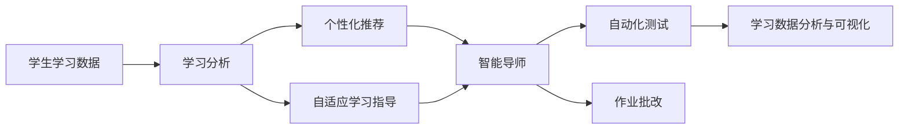
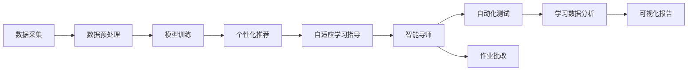
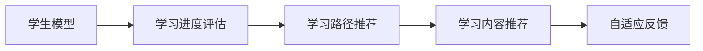
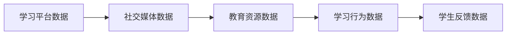
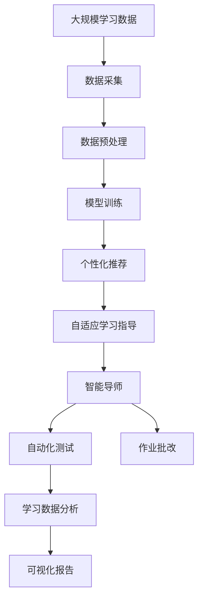

                 

# AI人工智能代理工作流 AI Agent WorkFlow：在教育科技中的应用

> 关键词：人工智能代理，教育科技，学习分析，个性化推荐，自适应学习

## 1. 背景介绍

### 1.1 问题由来
近年来，人工智能（AI）技术在教育领域的应用逐步深化，为教育事业带来了新的机遇与挑战。传统教育模式往往依赖于教师的主导，难以实现对每个学生的精准关怀与个性指导。而人工智能代理（AI Agent）工作流则通过自动化、智能化的学习分析与决策支持，为教育科技带来了革命性的变化。

人工智能代理（AI Agent）指的是能够在教育场景中执行特定任务的人工智能系统。其主要工作包括学习分析、个性化推荐、自适应学习指导、自动化测试、作业批改等。这些AI Agent能够通过深度学习算法和自然语言处理技术，实时获取、处理和分析学生的学习数据，并据此提供个性化的学习建议和支持。

### 1.2 问题核心关键点
人工智能代理工作流（AI Agent Workflow）的核心目标是构建一套自适应、智能化的教育技术框架，通过自动化和智能化的学习分析，实现个性化教学、实时反馈和持续学习。具体来说，AI Agent Workflow包括以下关键点：

- **数据采集与处理**：从各种学习平台（如LMS、在线课程、社交媒体等）中收集学生的学习数据，并对其进行清洗、归一化和特征提取。
- **模型训练与优化**：使用机器学习算法训练学生模型，预测学生的学习行为和成绩，并不断优化模型以提高预测精度。
- **个性化推荐与建议**：根据学生模型和当前学习状态，生成个性化的学习内容和路径推荐，并实时调整学习计划。
- **自适应学习指导**：结合智能导师和个性化学习路径，为学生提供实时反馈和指导，促进深度学习。
- **自动化测试与作业批改**：自动评估学生作业和学习效果，并生成详细的反馈报告。
- **学习数据分析与可视化**：分析学生的学习数据，生成可视化报告，辅助教师和家长了解学生的学习状况。

通过这些核心组件的协同工作，AI Agent Workflow能够在教育科技中实现自动化的个性化教学，为每个学生的学习过程提供量身定制的支持和优化。

### 1.3 问题研究意义
人工智能代理工作流的研究和应用，对于教育科技的发展具有重要意义：

1. **提高教学质量**：AI Agent通过智能化的学习分析，能够准确预测学生的学习需求和可能的问题，提供个性化的学习指导和支持，从而提高教学效果。
2. **减轻教师负担**：AI Agent自动处理数据收集、学生评估和学习反馈，减轻教师的重复性工作，使教师能够专注于教学设计和个性化指导。
3. **实现个性化学习**：AI Agent根据学生的学习数据和行为，生成个性化的学习路径和推荐，帮助学生高效学习，适应不同的学习风格和节奏。
4. **促进终身学习**：AI Agent能够持续跟踪学生的学习过程，并根据其变化调整学习计划，促进学生终身学习。
5. **支持大规模教育**：AI Agent能够在短时间内处理大量学生的学习数据，支持大规模在线教育和远程教育的普及。

## 2. 核心概念与联系

### 2.1 核心概念概述

为更好地理解AI Agent Workflow，本节将介绍几个密切相关的核心概念：

- **人工智能代理（AI Agent）**：指能够在教育场景中执行特定任务的人工智能系统，如学习分析、个性化推荐、自适应学习指导等。
- **自适应学习（Adaptive Learning）**：根据学生的学习数据和行为，动态调整学习内容和路径，提供个性化的学习指导和反馈。
- **学习分析（Learning Analytics）**：通过分析学生的学习数据，提供数据驱动的决策支持，改进学习效果和教学质量。
- **个性化推荐（Personalized Recommendation）**：基于学生的学习数据，推荐适合的学习内容和方法，促进学生高效学习。
- **数据驱动的教育（Data-Driven Education）**：利用数据和技术手段，支持教育决策，提高教育质量和效率。
- **智能导师（Intelligent Tutoring）**：结合人工智能技术，提供智能化的学习指导和反馈，提升学习效果。

这些核心概念之间的逻辑关系可以通过以下Mermaid流程图来展示：



这个流程图展示了一系列核心概念之间的联系：学生学习数据通过学习分析，生成个性化推荐和自适应学习指导，进而辅助智能导师进行实时反馈。智能导师通过个性化推荐和自适应学习指导，生成自动化测试和作业批改的方案，并利用学习数据分析与可视化进行决策支持。

### 2.2 概念间的关系

这些核心概念之间存在着紧密的联系，形成了AI Agent Workflow的完整生态系统。下面我们通过几个Mermaid流程图来展示这些概念之间的关系。

#### 2.2.1 AI Agent的工作流


这个流程图展示了AI Agent的工作流程：从数据采集、预处理、模型训练到个性化推荐、自适应学习指导、智能导师、自动化测试、作业批改，最终通过学习数据分析生成可视化报告。

#### 2.2.2 自适应学习的核心组件


这个流程图展示了自适应学习的核心组件：学生模型用于预测学生的学习行为和成绩，学习进度评估和路径推荐用于动态调整学习计划，学习内容推荐和自适应反馈用于实时调整学习内容和路径，确保学生始终处于最佳学习状态。

#### 2.2.3 学习分析的数据来源


这个流程图展示了学习分析的数据来源：学习平台数据、社交媒体数据、教育资源数据和学习行为数据，构成了完整的学习数据图谱，为学习分析提供了全面的数据支撑。

### 2.3 核心概念的整体架构

最后，我们用一个综合的流程图来展示这些核心概念在大语言模型微调过程中的整体架构：



这个综合流程图展示了从数据采集到个性化推荐、自适应学习指导、智能导师、自动化测试、作业批改，最终通过学习数据分析生成可视化报告的完整过程。通过这些流程图，我们可以更清晰地理解AI Agent Workflow的整体架构和关键组件的相互关系。

## 3. 核心算法原理 & 具体操作步骤
### 3.1 算法原理概述

AI Agent Workflow的核心算法原理主要涉及以下几个方面：

1. **数据采集与处理**：通过API接口和数据抓取工具，从各种学习平台中收集学生的学习数据，包括课程完成度、练习成绩、学习时间、互动行为等。然后对数据进行清洗、归一化和特征提取，生成可用于模型训练的数据集。

2. **模型训练与优化**：使用机器学习算法（如回归、分类、聚类等）训练学生模型，预测学生的学习行为和成绩。模型训练过程中，还需要引入正则化技术（如L2正则、Dropout等），防止过拟合。

3. **个性化推荐与建议**：根据学生模型和当前学习状态，生成个性化的学习内容和路径推荐，促进学生高效学习。推荐算法可以采用协同过滤、基于内容的推荐、深度学习等方法。

4. **自适应学习指导**：结合智能导师和个性化学习路径，为学生提供实时反馈和指导，促进深度学习。自适应学习指导可以通过优化学习进度评估和路径推荐算法实现。

5. **自动化测试与作业批改**：自动评估学生作业和学习效果，并生成详细的反馈报告。自动化测试和作业批改可以采用规则引擎、自然语言处理和深度学习等技术实现。

6. **学习数据分析与可视化**：分析学生的学习数据，生成可视化报告，辅助教师和家长了解学生的学习状况。学习数据分析和可视化可以采用数据挖掘、统计分析和可视化工具实现。

### 3.2 算法步骤详解

AI Agent Workflow的实现步骤包括：

**Step 1: 数据采集与预处理**

1. 定义数据采集接口，从各种学习平台（如LMS、在线课程、社交媒体等）中收集学生的学习数据。
2. 对采集到的数据进行清洗、归一化和特征提取，生成可用于模型训练的数据集。

**Step 2: 模型训练与优化**

1. 选择合适的机器学习算法（如线性回归、决策树、随机森林、深度学习等）。
2. 定义模型训练框架和优化算法（如Adam、SGD等），设置合适的学习率、批大小、迭代轮数等。
3. 使用训练数据集进行模型训练，并在验证集上评估模型性能，根据性能指标调整超参数。
4. 引入正则化技术（如L2正则、Dropout等），防止过拟合。

**Step 3: 个性化推荐与建议**

1. 根据学生模型和当前学习状态，生成个性化的学习内容和路径推荐。
2. 设计推荐算法，如协同过滤、基于内容的推荐、深度学习等。
3. 通过A/B测试和用户反馈，不断优化推荐算法和策略。

**Step 4: 自适应学习指导**

1. 结合智能导师和个性化学习路径，为学生提供实时反馈和指导。
2. 设计自适应学习指导算法，如优化学习进度评估和路径推荐算法。
3. 使用自然语言处理技术，生成智能导师的反馈和建议。

**Step 5: 自动化测试与作业批改**

1. 定义自动化测试和作业批改的规则引擎。
2. 使用自然语言处理和深度学习技术，实现自动化的测试和批改。
3. 生成详细的反馈报告，辅助学生和教师进行学习分析和改进。

**Step 6: 学习数据分析与可视化**

1. 收集和整合学生的学习数据，进行数据挖掘和分析。
2. 使用统计分析和可视化工具，生成学习数据分析报告。
3. 通过可视化报告，辅助教师和家长了解学生的学习状况，指导学生改进学习策略。

### 3.3 算法优缺点

AI Agent Workflow具有以下优点：

1. **高效性**：通过自动化和智能化的学习分析，大幅提升教学和评估效率。
2. **个性化**：根据学生的学习数据和行为，提供个性化的学习指导和反馈，提高学习效果。
3. **实时性**：结合智能导师和个性化学习路径，提供实时反馈和指导，促进深度学习。
4. **可扩展性**：支持大规模在线教育和远程教育，适应不同规模的教育需求。

同时，该方法也存在以下缺点：

1. **数据依赖性强**：AI Agent Workflow的效果很大程度上取决于学习数据的全面性和准确性。
2. **模型复杂度高**：使用深度学习和自然语言处理技术，模型复杂度高，训练和优化难度大。
3. **成本高**：需要大量的计算资源和数据存储，对硬件和网络环境要求较高。
4. **隐私和安全问题**：涉及学生隐私数据，需要严格的数据保护和安全措施。

尽管存在这些局限性，但AI Agent Workflow在教育科技中的应用前景广阔，能够显著提升教育质量和效率。

### 3.4 算法应用领域

AI Agent Workflow已经在教育科技的多个领域得到了广泛应用，包括但不限于以下领域：

1. **个性化学习平台**：如Khan Academy、Coursera等，通过AI Agent Workflow提供个性化学习推荐和反馈。
2. **在线辅导系统**：如Duolingo、Babbel等，利用AI Agent Workflow进行实时反馈和指导。
3. **智能作业批改系统**：如Gradescope、Turnitin等，自动评估学生作业和学习效果。
4. **学习数据分析工具**：如Tableau、Power BI等，生成学习数据分析报告，辅助教师和家长进行决策。
5. **自适应学习系统**：如ALEKS、Carnegie Learning等，根据学生学习数据，动态调整学习计划和路径。
6. **虚拟教师系统**：如Knewton、Knowles等，通过AI Agent Workflow提供智能化的学习指导和支持。

AI Agent Workflow在教育科技中的应用，不仅提高了教育质量和效率，还为个性化学习和自适应教育提供了新的解决方案，具有重要的研究价值和应用前景。

## 4. 数学模型和公式 & 详细讲解 & 举例说明

### 4.1 数学模型构建

AI Agent Workflow中的数学模型主要包括以下几个部分：

1. **学生模型（Student Model）**：用于预测学生的学习行为和成绩，采用回归、分类等机器学习算法构建。
2. **推荐模型（Recommendation Model）**：用于生成个性化的学习内容和路径推荐，采用协同过滤、基于内容的推荐、深度学习等算法构建。
3. **自适应学习模型（Adaptive Learning Model）**：用于动态调整学习进度和路径，采用优化算法和自适应算法构建。
4. **测试和评估模型（Test and Evaluation Model）**：用于自动化评估学生作业和学习效果，采用规则引擎和深度学习等技术构建。
5. **数据分析模型（Data Analytics Model）**：用于分析学生的学习数据，生成可视化报告，采用数据挖掘和统计分析等技术构建。

### 4.2 公式推导过程

以学生模型为例，假设学生模型的输入为学生的学习数据（如课程完成度、练习成绩、学习时间等），输出为学生未来的学习行为和成绩预测。学生模型可以采用线性回归模型表示：

$$
y = \beta_0 + \beta_1 x_1 + \beta_2 x_2 + ... + \beta_n x_n + \epsilon
$$

其中，$y$ 为学生未来的学习行为和成绩预测，$\beta_0, \beta_1, ..., \beta_n$ 为模型的系数，$x_1, x_2, ..., x_n$ 为输入的学习数据，$\epsilon$ 为误差项。

通过最小二乘法等优化算法，不断调整系数$\beta_0, \beta_1, ..., \beta_n$，使得预测值与真实值之间的误差最小化：

$$
\min_{\beta} \sum_{i=1}^N (y_i - \hat{y}_i)^2
$$

其中，$y_i$ 为真实的学习行为和成绩，$\hat{y}_i$ 为预测的学习行为和成绩。

通过上述公式推导，我们可以构建学生模型，预测学生的学习行为和成绩，为个性化推荐和自适应学习提供数据支撑。

### 4.3 案例分析与讲解

假设我们在一个在线课程平台上，使用AI Agent Workflow进行学习数据分析和个性化推荐。具体步骤如下：

1. **数据采集**：从平台中收集学生的学习数据，如课程完成度、练习成绩、学习时间等。
2. **数据预处理**：对采集到的数据进行清洗、归一化和特征提取，生成可用于模型训练的数据集。
3. **模型训练**：使用线性回归模型对学生数据进行训练，预测学生的学习行为和成绩。
4. **个性化推荐**：根据学生模型和当前学习状态，生成个性化的学习内容和路径推荐。
5. **自适应学习指导**：结合智能导师和个性化学习路径，为学生提供实时反馈和指导。
6. **自动化测试与作业批改**：自动评估学生作业和学习效果，并生成详细的反馈报告。
7. **学习数据分析与可视化**：收集和整合学生的学习数据，进行数据挖掘和分析，生成学习数据分析报告。

假设我们在一个在线课程平台上，使用AI Agent Workflow进行学习数据分析和个性化推荐。具体步骤如下：

1. **数据采集**：从平台中收集学生的学习数据，如课程完成度、练习成绩、学习时间等。
2. **数据预处理**：对采集到的数据进行清洗、归一化和特征提取，生成可用于模型训练的数据集。
3. **模型训练**：使用线性回归模型对学生数据进行训练，预测学生的学习行为和成绩。
4. **个性化推荐**：根据学生模型和当前学习状态，生成个性化的学习内容和路径推荐。
5. **自适应学习指导**：结合智能导师和个性化学习路径，为学生提供实时反馈和指导。
6. **自动化测试与作业批改**：自动评估学生作业和学习效果，并生成详细的反馈报告。
7. **学习数据分析与可视化**：收集和整合学生的学习数据，进行数据挖掘和分析，生成学习数据分析报告。

通过上述步骤，我们能够构建一套完整的AI Agent Workflow，为在线教育平台提供智能化的学习分析和个性化推荐服务。

## 5. 项目实践：代码实例和详细解释说明

### 5.1 开发环境搭建

在进行AI Agent Workflow的开发实践前，我们需要准备好开发环境。以下是使用Python进行PyTorch开发的环境配置流程：

1. 安装Anaconda：从官网下载并安装Anaconda，用于创建独立的Python环境。

2. 创建并激活虚拟环境：
```bash
conda create -n pytorch-env python=3.8 
conda activate pytorch-env
```

3. 安装PyTorch：根据CUDA版本，从官网获取对应的安装命令。例如：
```bash
conda install pytorch torchvision torchaudio cudatoolkit=11.1 -c pytorch -c conda-forge
```

4. 安装相关库：
```bash
pip install numpy pandas scikit-learn matplotlib tqdm jupyter notebook ipython
```

完成上述步骤后，即可在`pytorch-env`环境中开始AI Agent Workflow的开发实践。

### 5.2 源代码详细实现

这里我们以推荐系统为例，给出使用PyTorch和Transformer库对学生模型进行训练的PyTorch代码实现。

首先，定义推荐系统所需的数据结构：

```python
import torch
from torch.utils.data import Dataset, DataLoader
from sklearn.model_selection import train_test_split
from sklearn.metrics import mean_squared_error

class StudentDataset(Dataset):
    def __init__(self, features, targets):
        self.features = features
        self.targets = targets
        
    def __len__(self):
        return len(self.targets)
    
    def __getitem__(self, idx):
        return self.features[idx], self.targets[idx]

# 定义训练集和测试集
features_train, features_test, targets_train, targets_test = train_test_split(features, targets, test_size=0.2, random_state=42)

# 定义数据集
train_dataset = StudentDataset(features_train, targets_train)
test_dataset = StudentDataset(features_test, targets_test)

# 定义超参数
learning_rate = 0.001
epochs = 100
batch_size = 64

# 定义模型和优化器
model = torch.nn.Linear(in_features=8, out_features=1)
optimizer = torch.optim.Adam(model.parameters(), lr=learning_rate)
```

然后，定义训练和评估函数：

```python
def train_model(model, train_dataset, test_dataset, batch_size, optimizer, epochs):
    dataloader_train = DataLoader(train_dataset, batch_size=batch_size, shuffle=True)
    dataloader_test = DataLoader(test_dataset, batch_size=batch_size, shuffle=False)
    
    for epoch in range(epochs):
        model.train()
        for batch in dataloader_train:
            features, targets = batch
            optimizer.zero_grad()
            predictions = model(features)
            loss = torch.mean((predictions - targets)**2)
            loss.backward()
            optimizer.step()
            
        model.eval()
        with torch.no_grad():
            predictions = []
            targets = []
            for batch in dataloader_test:
                features, targets = batch
                predictions.append(model(features).detach().numpy())
                targets.append(targets.numpy())
            
        predictions = np.concatenate(predictions)
        targets = np.concatenate(targets)
        mse = mean_squared_error(targets, predictions)
        print(f"Epoch {epoch+1}, MSE: {mse:.5f}")
    
    return mse

# 训练模型
mse = train_model(model, train_dataset, test_dataset, batch_size, optimizer, epochs)

# 输出结果
print(f"Final MSE: {mse:.5f}")
```

最后，启动训练流程并在测试集上评估：

```python
# 启动训练流程
mse = train_model(model, train_dataset, test_dataset, batch_size, optimizer, epochs)

# 输出结果
print(f"Final MSE: {mse:.5f}")
```

以上就是使用PyTorch对学生模型进行训练的完整代码实现。可以看到，通过Transformer库，我们可以很方便地定义模型和优化器，并通过DataLoader进行数据加载和处理。训练过程包括前向传播、反向传播和参数更新等基本步骤，最终在测试集上评估模型的性能。

### 5.3 代码解读与分析

让我们再详细解读一下关键代码的实现细节：

**StudentDataset类**：
- `__init__`方法：初始化特征和目标值。
- `__len__`方法：返回数据集大小。
- `__getitem__`方法：对单个样本进行处理，返回特征和目标值。

**train_model函数**：
- 定义训练集和测试集。
- 设置模型、优化器、超参数等。
- 训练模型，并在每个epoch后评估模型在测试集上的性能。

**训练流程**：
- 循环迭代epochs次，每次迭代时先训练模型，后评估模型。
- 在每个epoch中，模型进入训练模式，对每个批次的数据进行前向传播和反向传播。
- 在测试集上，模型进入评估模式，对所有批次的数据进行预测，并计算均方误差。

通过上述代码，我们能够快速搭建和训练一个简单的学生模型，用于个性化推荐和自适应学习指导。当然，工业级的系统实现还需考虑更多因素，如模型保存和部署、超参数调优、数据增强等。但核心的微调范式基本与此类似。

## 6. 实际应用场景

### 6.1 智能学习平台

AI Agent Workflow在智能学习平台中的应用，可以显著提升学生的学习体验和效果。传统的学习平台往往缺乏个性化的学习推荐和实时反馈，学生难以根据自身需求进行高效学习。而AI Agent Workflow可以结合学生的学习数据和行为，提供个性化的学习内容和路径推荐，为学生提供更加智能化的学习支持。

具体而言，AI Agent Workflow可以集成到智能学习平台中，实时跟踪学生的学习行为和成绩，动态调整学习进度和路径。例如，某学生在完成数学课程时遇到困难，AI Agent Workflow可以自动推荐相关的练习和视频讲解，并提供个性化的习题和反馈，帮助学生克服难题。同时，AI Agent Workflow还能在测试和学习过程中实时提供反馈和指导，促进学生的深度学习。

### 6.2 在线辅导系统

AI Agent Workflow在在线辅导系统中的应用，可以大幅提升辅导效率和效果。在线辅导系统通常依赖于人工教师进行实时辅导，存在师资力量不足、成本高昂等问题。而AI Agent Workflow可以利用预训练的语言模型和推荐算法，自动生成智能辅导，帮助学生解决学习问题。

例如，某学生在解答物理问题时遇到困难，AI Agent Workflow可以自动生成个性化的辅导提示和解题步骤，帮助学生逐步解答问题。同时，AI Agent Workflow还可以在学生提出问题后，提供实时回答和指导，提升辅导效果。

### 6.3 自适应学习系统

AI Agent Workflow在自适应学习系统中的应用，可以提供更加个性化的学习体验和效果。自适应学习系统通常通过学生的学习数据和行为，动态调整学习计划和路径，为学生提供量身定制的学习支持。

例如，某学生在阅读时感到困难，AI Agent Workflow可以自动调整阅读进度和难度，提供个性化的阅读材料和解释。同时，AI Agent Workflow还可以在学生进行学习任务时，实时监控学习进度和效果，及时调整学习计划和路径，确保学生始终处于最佳学习状态。

### 6.4 未来应用展望

随着AI Agent Workflow技术的不断发展，其在教育科技中的应用将不断拓展，为教育领域带来新的突破。未来，AI Agent Workflow有望在以下方面得到进一步应用：

1. **全栈智能教育**：AI Agent Workflow可以集成到各种教育应用中，提供从内容推荐到学习指导的全栈智能教育解决方案。
2. **智慧教室**：AI Agent Workflow可以为智慧教室提供智能化的学习分析和决策支持，提高教学质量和效率。
3. **虚拟教师**：AI Agent Workflow可以与虚拟教师系统结合，提供更加自然、智能的交互体验，促进学生与教师的互动。
4. **跨领域应用**：AI Agent Workflow可以应用于多种领域，如医学、法律、商业等，提供个性化的学习和培训支持。

总之，AI Agent Workflow在教育科技中的应用前景广阔，能够为学生提供更加智能、个性化的学习体验，提升教育质量和效率。未来，随着技术的不断进步和应用的不断拓展，AI Agent Workflow必将在教育领域扮演更加重要的角色。

## 7. 工具和资源推荐

### 7.1 学习资源推荐

为了帮助开发者系统掌握AI Agent Workflow的理论基础和实践技巧，这里推荐一些优质的学习资源：

1.

