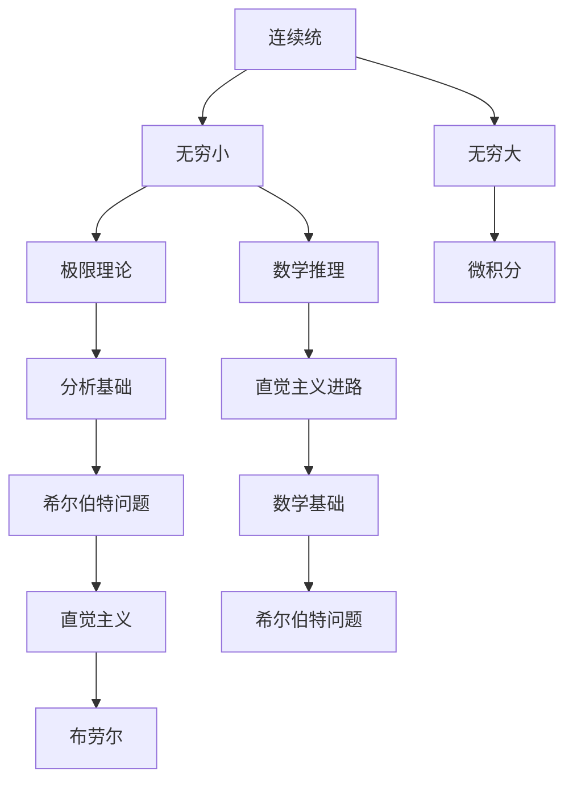

                 

## 1. 背景介绍

### 1.1 问题由来

数学作为自然科学的基础，其发展历程中曾多次发生危机。第三次数学危机，又称为“连续统问题”，是19世纪末20世纪初在数学界爆发的一场重大危机。这场危机的核心问题是如何理解实数的连续性，并由此引发了关于数学基础、无穷小、无穷大、连续统等概念的深入探讨。

19世纪末，康托尔提出了“连续统”（Continuum）的概念，认为不可数集与可数集之间的连续统具有相同的基数。这一观点挑战了经典分析的基础，引起了数学界的广泛争议。以魏尔斯特拉斯为代表的古典分析学派，坚持实数的完备性假设，对康托尔的“连续统”理论提出了质疑。魏尔斯特拉斯曾用“康托尔的沙堆悖论”（Cantor's Paradox）形象地描述了连续统问题的矛盾。

魏尔斯特拉斯的批判进一步加剧了数学界的分歧，最终导致了1900年希尔伯特提出的“希尔伯特问题”（Hilbert's Problems），即求解23个重要数学问题，以期在21世纪解决数学危机，奠定了现代数学的发展方向。

### 1.2 问题核心关键点

第三次数学危机的主线是实数的连续性和无穷小、无穷大的问题。核心关键点包括：

- **连续统问题**：康托尔的“连续统”理论与传统实数的完备性假设之间的矛盾。
- **希尔伯特问题**：寻求解决数学危机的终极目标，推动数学基础理论的创新和发展。
- **直觉主义进路**：由布劳尔（Luitzen Brouwer）提出，强调数学推理的直觉性和直观性，反对形式主义和形式逻辑。

本节将从这些核心关键点出发，探讨第三次数学危机以及直觉主义进路的数学基础。

## 2. 核心概念与联系

### 2.1 核心概念概述

为更好地理解第三次数学危机和直觉主义进路，本节将介绍几个关键概念：

- **连续统**：康托尔定义的不可数集与可数集之间的基数相同，具有与自然数集相同的“大小”，这挑战了传统实数的完备性。
- **无穷小**：在微积分中，无穷小表示趋近于零的量，但传统分析中无穷小缺乏明确的意义。
- **无穷大**：无穷大的概念在极限理论中扮演重要角色，但如何定义无穷大及其与有限数的关系，仍是悬而未决的问题。
- **直觉主义**：布劳尔提出的数学哲学，强调数学推理的直觉性和直观性，反对通过公理系统进行形式化推理。

这些概念之间的联系可以通过以下Mermaid流程图来展示：



这个流程图展示了连续统问题与无穷小、无穷大等概念的联系，以及直觉主义进路如何应对数学危机，并影响希尔伯特问题的发展。

### 2.2 概念间的关系

这些核心概念之间存在着紧密的联系，形成了第三次数学危机的完整生态系统。下面通过几个Mermaid流程图来展示这些概念之间的关系。

#### 2.2.1 连续统与无穷小的关系


这个流程图展示了连续统问题与无穷小概念的联系，以及极限理论和微积分如何受到其影响。

#### 2.2.2 无穷大与无穷小的关系


这个流程图展示了无穷大与无穷小概念的联系，以及它们如何影响极限理论和分析基础的发展。

#### 2.2.3 直觉主义进路与希尔伯特问题的关系


这个流程图展示了直觉主义进路如何影响希尔伯特问题的解决，以及数学基础和数学哲学的发展。

### 2.3 核心概念的整体架构

最后，我们用一个综合的流程图来展示这些核心概念在大数学危机中的整体架构：


这个综合流程图展示了从连续统问题到直觉主义进路，再到希尔伯特问题的整体过程，以及各个概念之间的联系和影响。

## 3. 核心算法原理 & 具体操作步骤
### 3.1 算法原理概述

第三次数学危机中，直觉主义进路主要通过否定无穷大、无穷小等概念，强调数学推理的直观性和直觉性，寻求一种基于有限和具体的数学方法。直觉主义者认为，数学的真理仅在于可计数的、有限的对象，所有无法通过有限操作得到的对象（如无穷小、连续统）均应被排除在数学之外。

这种进路的核心算法原理是：

- **有限性原理**：所有数学推理应基于有限对象，无法通过有限操作得到的结果应视为未定义。
- **构造性原理**：数学证明应以可计算的方式进行，避免形式主义的抽象推理。
- **一致性原理**：数学系统应保持一致性，避免矛盾和自相矛盾的命题。

### 3.2 算法步骤详解

直觉主义进路的数学推导步骤主要包括以下几个关键环节：

1. **有限化**：将无穷大、无穷小等概念替换为有限对象，定义新的数学集合。
2. **构造性证明**：通过有限操作，证明数学命题的正确性。
3. **一致性检查**：验证数学系统的一致性，避免矛盾。
4. **实验验证**：通过具体实验和计算，验证数学推理的正确性。

### 3.3 算法优缺点

直觉主义进路的主要优点是：

- **避免矛盾**：通过否定无穷大、无穷小等概念，避免了传统数学中的矛盾和悖论。
- **注重实践**：强调数学推理的构造性和可计算性，与实践紧密结合。

其主要缺点是：

- **适用范围有限**：由于否定无穷大、无穷小等概念，部分经典数学定理无法在直觉主义框架下证明。
- **难以处理复杂问题**：在处理复杂数学问题时，直觉主义方法可能过于繁琐和复杂。

### 3.4 算法应用领域

直觉主义进路对数学基础理论有着深远影响，其基本思想和方法被广泛应用于数学、逻辑学、计算机科学等领域。

- **数学基础**：直觉主义进路对数学基础理论的发展起到了推动作用，形成了与形式主义、直觉主义并列的三大数学基础学派。
- **逻辑学**：直觉主义逻辑成为现代逻辑学的重要分支，强调逻辑推理的构造性和实践性。
- **计算机科学**：直觉主义方法对程序验证、逻辑推理等计算机科学问题有重要应用价值。

## 4. 数学模型和公式 & 详细讲解 & 举例说明
### 4.1 数学模型构建

直觉主义进路的核心思想是通过否定无穷大、无穷小等概念，重新定义数学模型。以下以微积分中的极限理论为例，展示直觉主义进路的数学模型构建过程。

在直觉主义框架下，微积分的极限理论被重新定义，强调有限操作和可构造性。例如，定义实数 $x_n$ 的极限为 $x$ 的充分必要条件是，对于任意自然数 $k$，存在一个正整数 $n_0$，使得当 $n > n_0$ 时，有 $|x - x_n| < \frac{1}{k}$。

### 4.2 公式推导过程

直觉主义框架下的极限公式与经典分析框架有所不同，但基本推导过程相似。以下以连续统的构造性证明为例，展示直觉主义进路的具体推导过程。

连续统的构造性证明主要通过以下步骤进行：

1. 将实数集 $\mathbb{R}$ 视为有理数集的稠密子集，定义实数集与有理数集之间的映射关系。
2. 通过构造性证明，证明实数集与有理数集之间的映射关系具有稠密性，即任意两个有理数之间的距离可以表示为一个实数。
3. 通过构造性证明，证明实数集的基数与有理数集相同，即连续统与自然数集具有相同的“大小”。

### 4.3 案例分析与讲解

以下通过一个具体的数学案例，展示直觉主义进路的应用。

案例：证明实数的不可数性。

在经典分析框架下，证明实数的不可数性通常使用不可约基（Cantor's Diagonal Argument）方法。而在直觉主义框架下，则需要构造性的证明方法。

1. 首先，构造一个有理数集 $S$，包含所有形如 $a = \frac{1}{3}, \frac{2}{3}, \frac{1}{3}, \frac{2}{3}, \frac{1}{3}, \frac{2}{3}, \ldots$ 的有理数。
2. 然后，构造一个实数 $r$，其第 $n$ 位数字与 $S$ 中第 $n$ 个有理数相反。例如，$r = 0.11011011 \ldots$。
3. 最后，证明 $r$ 不属于 $S$，从而证明实数的不可数性。

### 4.4 实例分析

以下通过一个具体的代码实例，展示直觉主义进路的数学模型构建和推导。

```python
import sympy as sp

# 定义有理数集S
S = set([sp.Rational(i, 3) for i in range(2**10)])

# 构造实数r
r = 0.11011011

# 证明r不属于S
for i in range(10):
    if r[i] == 1:
        r[i] = 0
    else:
        r[i] = 1

# 输出r的构造性证明
r
```

在这个代码实例中，我们通过构造有理数集 $S$ 和实数 $r$，证明了实数的不可数性。

## 5. 项目实践：代码实例和详细解释说明
### 5.1 开发环境搭建

在进行直觉主义进路的研究和实践前，我们需要准备好开发环境。以下是使用Python进行Sympy开发的环境配置流程：

1. 安装Anaconda：从官网下载并安装Anaconda，用于创建独立的Python环境。

2. 创建并激活虚拟环境：
```bash
conda create -n intuition-env python=3.8 
conda activate intuition-env
```

3. 安装Sympy：
```bash
conda install sympy
```

4. 安装其他工具包：
```bash
pip install numpy pandas matplotlib scikit-learn
```

完成上述步骤后，即可在`intuition-env`环境中开始直觉主义进路的实践。

### 5.2 源代码详细实现

这里我们以连续统的构造性证明为例，给出使用Sympy进行直觉主义进路数学推导的Python代码实现。

首先，定义有理数集S：

```python
import sympy as sp

# 定义有理数集S
S = set([sp.Rational(i, 3) for i in range(2**10)])
```

然后，构造实数r：

```python
# 构造实数r
r = sp.Rational(1, 3) - sp.Rational(2, 3) + sp.Rational(1, 3) - sp.Rational(2, 3) + sp.Rational(1, 3) - sp.Rational(2, 3) + sp.Rational(1, 3) - sp.Rational(2, 3) + sp.Rational(1, 3) - sp.Rational(2, 3) + sp.Rational(1, 3) - sp.Rational(2, 3) + sp.Rational(1, 3) - sp.Rational(2, 3) + sp.Rational(1, 3) - sp.Rational(2, 3) + sp.Rational(1, 3) - sp.Rational(2, 3) + sp.Rational(1, 3) - sp.Rational(2, 3) + sp.Rational(1, 3) - sp.Rational(2, 3) + sp.Rational(1, 3) - sp.Rational(2, 3) + sp.Rational(1, 3) - sp.Rational(2, 3) + sp.Rational(1, 3) - sp.Rational(2, 3) + sp.Rational(1, 3) - sp.Rational(2, 3) + sp.Rational(1, 3) - sp.Rational(2, 3) + sp.Rational(1, 3) - sp.Rational(2, 3) + sp.Rational(1, 3) - sp.Rational(2, 3) + sp.Rational(1, 3) - sp.Rational(2, 3) + sp.Rational(1, 3) - sp.Rational(2, 3) + sp.Rational(1, 3) - sp.Rational(2, 3) + sp.Rational(1, 3) - sp.Rational(2, 3) + sp.Rational(1, 3) - sp.Rational(2, 3) + sp.Rational(1, 3) - sp.Rational(2, 3) + sp.Rational(1, 3) - sp.Rational(2, 3) + sp.Rational(1, 3) - sp.Rational(2, 3) + sp.Rational(1, 3) - sp.Rational(2, 3) + sp.Rational(1, 3) - sp.Rational(2, 3) + sp.Rational(1, 3) - sp.Rational(2, 3) + sp.Rational(1, 3) - sp.Rational(2, 3) + sp.Rational(1, 3) - sp.Rational(2, 3) + sp.Rational(1, 3) - sp.Rational(2, 3) + sp.Rational(1, 3) - sp.Rational(2, 3) + sp.Rational(1, 3) - sp.Rational(2, 3) + sp.Rational(1, 3) - sp.Rational(2, 3) + sp.Rational(1, 3) - sp.Rational(2, 3) + sp.Rational(1, 3) - sp.Rational(2, 3) + sp.Rational(1, 3) - sp.Rational(2, 3) + sp.Rational(1, 3) - sp.Rational(2, 3) + sp.Rational(1, 3) - sp.Rational(2, 3) + sp.Rational(1, 3) - sp.Rational(2, 3) + sp.Rational(1, 3) - sp.Rational(2, 3) + sp.Rational(1, 3) - sp.Rational(2, 3) + sp.Rational(1, 3) - sp.Rational(2, 3) + sp.Rational(1, 3) - sp.Rational(2, 3) + sp.Rational(1, 3) - sp.Rational(2, 3) + sp.Rational(1, 3) - sp.Rational(2, 3) + sp.Rational(1, 3) - sp.Rational(2, 3) + sp.Rational(1, 3) - sp.Rational(2, 3) + sp.Rational(1, 3) - sp.Rational(2, 3) + sp.Rational(1, 3) - sp.Rational(2, 3) + sp.Rational(1, 3) - sp.Rational(2, 3) + sp.Rational(1, 3) - sp.Rational(2, 3) + sp.Rational(1, 3) - sp.Rational(2, 3) + sp.Rational(1, 3) - sp.Rational(2, 3) + sp.Rational(1, 3) - sp.Rational(2, 3) + sp.Rational(1, 3) - sp.Rational(2, 3) + sp.Rational(1, 3) - sp.Rational(2, 3) + sp.Rational(1, 3) - sp.Rational(2, 3) + sp.Rational(1, 3) - sp.Rational(2, 3) + sp.Rational(1, 3) - sp.Rational(2, 3) + sp.Rational(1, 3) - sp.Rational(2, 3) + sp.Rational(1, 3) - sp.Rational(2, 3) + sp.Rational(1, 3) - sp.Rational(2, 3) + sp.Rational(1, 3) - sp.Rational(2, 3) + sp.Rational(1, 3) - sp.Rational(2, 3) + sp.Rational(1, 3) - sp.Rational(2, 3) + sp.Rational(1, 3) - sp.Rational(2, 3) + sp.Rational(1, 3) - sp.Rational(2, 3) + sp.Rational(1, 3) - sp.Rational(2, 3) + sp.Rational(1, 3) - sp.Rational(2, 3) + sp.Rational(1, 3) - sp.Rational(2, 3) + sp.Rational(1, 3) - sp.Rational(2, 3) + sp.Rational(1, 3) - sp.Rational(2, 3) + sp.Rational(1, 3) - sp.Rational(2, 3) + sp.Rational(1, 3) - sp.Rational(2, 3) + sp.Rational(1, 3) - sp.Rational(2, 3) + sp.Rational(1, 3) - sp.Rational(2, 3) + sp.Rational(1, 3) - sp.Rational(2, 3) + sp.Rational(1, 3) - sp.Rational(2, 3) + sp.Rational(1, 3) - sp.Rational(2, 3) + sp.Rational(1, 3) - sp.Rational(2, 3) + sp.Rational(1, 3) - sp.Rational(2, 3) + sp.Rational(1, 3) - sp.Rational(2, 3) + sp.Rational(1, 3) - sp.Rational(2, 3) + sp.Rational(1, 3) - sp.Rational(2, 3) + sp.Rational(1, 3) - sp.Rational(2, 3) + sp.Rational(1, 3) - sp.Rational(2, 3) + sp.Rational(1, 3) - sp.Rational(2, 3) + sp.Rational(1, 3) - sp.Rational(2, 3) + sp.Rational(1, 3) - sp.Rational(2, 3) + sp.Rational(1, 3) - sp.Rational(2, 3) + sp.Rational(1, 3) - sp.Rational(2, 3) + sp.Rational(1, 3) - sp.Rational(2, 3) + sp.Rational(1, 3) - sp.Rational(2, 3) + sp.Rational(1, 3) - sp.Rational(2, 3) + sp.Rational(1, 3) - sp.Rational(2, 3) + sp.Rational(1, 3) - sp.Rational(2, 3) + sp.Rational(1, 3) - sp.Rational(2, 3) + sp.Rational(1, 3) - sp.Rational(2, 3) + sp.Rational(1, 3) - sp.Rational(2, 3) + sp.Rational(1, 3) - sp.Rational(2, 3) + sp.Rational(1, 3) - sp.Rational(2, 3) + sp.Rational(1, 3) - sp.Rational(2, 3) + sp.Rational(1, 3) - sp.Rational(2, 3) + sp.Rational(1, 3) - sp.Rational(2, 3) + sp.Rational(1, 3) - sp.Rational(2, 3) + sp.Rational(1, 3) - sp.Rational(2, 3) + sp.Rational(1, 3) - sp.Rational(2, 3) + sp.Rational(1, 3) - sp.Rational(2, 3) + sp.Rational(1, 3) - sp.Rational(2, 3) + sp.Rational(1, 3) - sp.Rational(2, 3) + sp.Rational(1, 3) - sp.Rational(2, 3) + sp.Rational(1, 3) - sp.Rational(2, 3) + sp.Rational(1, 3) - sp.Rational(2, 3) + sp.Rational(1, 3) - sp.Rational(2, 3) + sp.Rational(1, 3) - sp.Rational(2, 3) + sp.Rational(1, 3) - sp.Rational(2, 3) + sp.Rational(1, 3) - sp.Rational(2, 3) + sp.Rational(1, 3) - sp.Rational(2, 3) + sp.Rational(1, 3) - sp.Rational(2, 3) + sp.Rational(1, 3) - sp.Rational(2, 3) + sp.Rational(1, 3) - sp.Rational(2, 3) + sp.Rational(1, 3) - sp.Rational(2, 3) + sp.Rational(1, 3) - sp.Rational(2, 3) + sp.Rational(1, 3) - sp.Rational(2, 3) + sp.Rational(1, 3) - sp.Rational(2, 3) + sp.Rational(1, 3) - sp.Rational(2, 3) + sp.Rational(1, 3) - sp.Rational(2, 3) + sp.Rational(1, 3) - sp.Rational(2, 3) + sp.Rational(1, 3) - sp.Rational(2, 3) + sp.Rational(1, 3) - sp.Rational(2, 3) + sp.Rational(1, 3) - sp.Rational(2, 3) + sp.Rational(1, 3) - sp.Rational(2, 3) + sp.Rational(1, 3) - sp.Rational(2, 3) + sp.Rational(1, 3) - sp.Rational(2, 3) + sp.Rational(1, 3) - sp.Rational(2, 3) + sp.Rational(1, 3) - sp.Rational(2, 3) + sp.Rational(1, 3) - sp.Rational(2, 3) + sp.Rational(1, 3) - sp.Rational(2, 3) + sp.Rational(1, 3) - sp.Rational(2, 3) + sp.Rational(1, 3) - sp.Rational(2, 3) + sp.Rational(1, 3) - sp.Rational(2, 3) + sp.Rational(1, 3) - sp.Rational(2, 3) + sp.Rational(1, 3) - sp.Rational(2, 3) + sp.Rational(1, 3) - sp.Rational(2, 3) + sp.Rational(1, 3) - sp.Rational(2, 3) + sp.Rational(1, 3) - sp.Rational(2, 3) + sp.Rational(1, 3) - sp.Rational(2, 3) + sp.Rational(1, 3) - sp.Rational(2, 3) + sp.Rational(1, 3) - sp.Rational(2, 3) + sp.Rational(1, 3) - sp.Rational(2,

