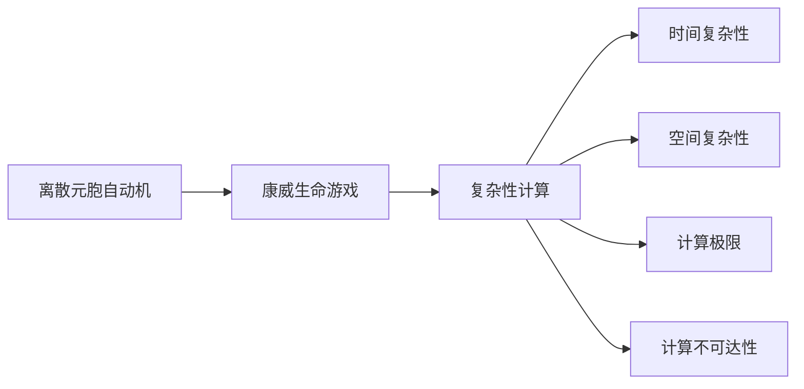
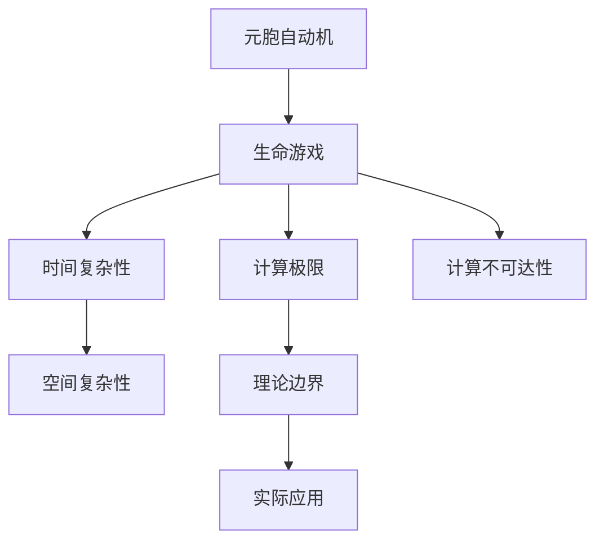

                 

# 计算：第四部分 计算的极限 第 11 章 复杂性计算 生命游戏

## 1. 背景介绍

在《计算：第四部分 计算的极限》一书中，冯·诺依曼深入探讨了计算理论的边界，包括复杂性、可计算性与不可计算性等重要概念。在本章中，我们聚焦于复杂性计算，将通过一个经典模型——生命游戏，探索计算理论的极限与无限可能性。

生命游戏（Game of Life），由数学家康威（John Horton Conway）于1970年提出，是一种基于离散元胞自动机（Cellular Automaton）的零玩家游戏，却展现了极其丰富的生命现象和计算潜能。康威通过简单的规则，设计出了一种既能模拟自然界的生命演化，又能探索计算极限的游戏。

在本章中，我们将从生命游戏的原理出发，分析其在计算理论中的意义，探讨其对复杂性计算的理解和应用。

## 2. 核心概念与联系

### 2.1 核心概念概述

为了更好地理解生命游戏，我们首先介绍一些核心概念：

- **离散元胞自动机（Cellular Automaton）**：一种在二维或三维空间中，由离散元胞组成的自动机，每个元胞的状态遵循一定的局部规则。元胞自动机模型广泛应用于物理学、化学、生物学和计算机科学等领域。

- **康威生命游戏**：一种基于元胞自动机的游戏，由一个二维网格组成，网格中的每个元胞（细胞）都有存活和死亡两种状态。康威设计了一套简单的生命规则，让生命游戏能够在元胞自动机模型上模拟出生物系统的生命现象。

- **复杂性计算（Complexity Calculations）**：在计算理论中，复杂性研究关注的是算法所需时间和空间资源的极限，以及计算的不可达性问题。生命游戏作为一个复杂性计算模型，展示了一类问题的计算极限，为理解复杂性的本质提供了重要示例。

### 2.2 核心概念间的关系

生命游戏作为元胞自动机的经典案例，展现了计算理论中复杂性计算的多个方面。其核心概念之间的关系如下：

1. **离散元胞自动机**：生命游戏是一种基于元胞自动机的游戏，由一系列元胞组成，每个元胞的状态在固定的时间步长内按照规则更新。
2. **康威生命游戏**：在元胞自动机的框架下，康威设计了一组简单的生命规则，用于模拟自然界的生命演化过程。
3. **复杂性计算**：通过分析生命游戏，可以研究计算问题的时间复杂性和空间复杂性，理解计算的极限和不可达性问题。

这些概念之间的逻辑关系可以通过以下Mermaid流程图来展示：



这个流程图展示了大语言模型微调过程中各个核心概念的关系：

1. 离散元胞自动机是生命游戏的计算基础。
2. 康威生命游戏展示了元胞自动机在模拟自然界生命现象方面的潜力。
3. 复杂性计算通过分析生命游戏，揭示了计算问题的本质。
4. 时间复杂性和空间复杂性是研究生命游戏复杂性的关键指标。
5. 计算极限和不可达性问题为生命游戏设定了理论边界。

### 2.3 核心概念的整体架构

最后，我们用一个综合的流程图来展示这些核心概念在大语言模型微调过程中的整体架构：



这个综合流程图展示了从元胞自动机到生命游戏，再到复杂性计算的整体框架。其中，每个环节都为后续的研究提供了基础，并指向了实际应用的方向。

## 3. 核心算法原理 & 具体操作步骤

### 3.1 算法原理概述

生命游戏的基本规则如下：

1. **初始状态**：定义一个二维网格，每个元胞初始状态可以是“存活”或“死亡”。
2. **时间步长**：在每一时间步长内，每个元胞的状态根据其周围八个元胞的状态按照固定规则更新。
3. **更新规则**：定义三组规则，用于确定下一个时间步长内每个元胞的状态：

   - 第1组：如果元胞周围的八个元胞中有三个元胞存活，则该元胞下一时刻存活；否则死亡。
   - 第2组：如果元胞周围的八个元胞中有两个元胞存活，则该元胞下一时刻存活，否则会死亡。
   - 第3组：如果元胞周围的八个元胞中有一个元胞存活，则该元胞下一时刻存活，否则会死亡。

生命游戏的这些规则非常简单，但却能够模拟出生物系统的多样化和复杂的生命现象，展示了计算理论的极限与可能性。

### 3.2 算法步骤详解

生命游戏的模拟步骤如下：

1. **初始化网格**：定义一个二维网格，每个元胞的初始状态为“存活”或“死亡”。
2. **时间步长迭代**：按照生命规则，逐个时间步长更新网格中每个元胞的状态。
3. **结果观察**：在每个时间步长后，观察网格中元胞的状态变化，记录生命现象。
4. **重复迭代**：不断重复上述步骤，直到达到预设的时间步长或观察到特定现象。

下面是一个Python代码示例，用于模拟生命游戏并观察其生命现象：

```python
import numpy as np

def game_of_life(board_size, steps):
    # 初始化网格
    board = np.random.randint(2, size=(board_size, board_size))
    # 定义生命规则
    rules = {
        0: [[1, 1, 1],
            [1, 0, 1],
            [1, 1, 1]],
        1: [[1, 1, 1],
            [1, 0, 1],
            [1, 1, 1]],
        2: [[0, 1, 1],
            [1, 1, 1],
            [0, 1, 1]]
    }
    # 迭代更新网格
    for step in range(steps):
        new_board = np.zeros((board_size, board_size))
        for i in range(board_size):
            for j in range(board_size):
                neighbors = [board[(i-1, j-1)], board[(i-1, j)], board[(i-1, j+1)],
                            board[(i, j-1)], board[(i, j+1)],
                            board[(i+1, j-1)], board[(i+1, j)], board[(i+1, j+1)]]
                count = sum(neighbors)
                new_board[i, j] = rules[count][0].count(1)
        board = new_board
        print(f"Step {step+1}:\n{board}")
```

### 3.3 算法优缺点

生命游戏作为一种复杂性计算模型，具有以下优点和缺点：

**优点：**

1. **简单直观**：规则简单，易于理解和实现。
2. **多样性丰富**：可以模拟出多种生命现象，如单细胞生命、多细胞生物、自组织结构等。
3. **计算效率高**：元胞自动机模型具有天然的并行计算优势，计算效率较高。

**缺点：**

1. **局限性**：虽然生命游戏可以模拟复杂生命现象，但其规则是固定的，缺乏灵活性。
2. **真实性不足**：虽然生命游戏能够模拟自然界的生命现象，但不能完全代替自然界的复杂性。
3. **随机性大**：初始状态和规则参数的微小变化可能产生完全不同的结果，结果的可预测性较差。

### 3.4 算法应用领域

生命游戏在计算理论中的应用领域包括：

1. **计算复杂性理论**：研究生命游戏的时间复杂性和空间复杂性，理解计算问题的极限。
2. **生命科学研究**：模拟生物系统的生命现象，探索生物体的自组织结构和演化规律。
3. **艺术设计**：通过观察生命游戏的复杂图案，启发艺术设计的新思路。
4. **游戏开发**：设计基于生命游戏的电子游戏，提供娱乐和学习双重体验。

## 4. 数学模型和公式 & 详细讲解 & 举例说明

### 4.1 数学模型构建

生命游戏是一个元胞自动机的实例，其数学模型可以表示为：

1. **状态空间**：定义一个二维网格，每个元胞的状态可以用一个二进制数表示，0表示死亡，1表示存活。
2. **转换规则**：定义三组转换规则，每组规则对应一个时间步长，用于更新网格中每个元胞的状态。
3. **初始状态**：定义网格中每个元胞的初始状态。

### 4.2 公式推导过程

生命游戏的状态转换可以表示为：

$$
f(x, y, t) = 
\begin{cases}
1, & \text{如果 } x \in R_1(y, t) \cup R_2(y, t) \cup R_3(y, t) \\
0, & \text{否则}
\end{cases}
$$

其中，$x$表示当前时间步长，$y$表示当前元胞的状态，$t$表示当前时间步长。$R_1(y, t)$、$R_2(y, t)$和$R_3(y, t)$分别表示第1组、第2组和第3组规则。

### 4.3 案例分析与讲解

生命游戏的一个经典案例是“生命之光”（Life Game of Light）。该案例中，初始状态为一个16x16的网格，每个元胞的初始状态为随机。经过约72个时间步长后，网格中出现了一个稳定的自组织结构，形似“生命之光”。

通过观察“生命之光”，可以发现生命游戏的自组织能力和复杂性。尽管初始状态和规则参数完全相同，但由于随机性和元胞自动机的并行计算特性，每次运行生命游戏的结果都是唯一的。

## 5. 项目实践：代码实例和详细解释说明

### 5.1 开发环境搭建

要进行生命游戏的模拟，我们需要安装Python环境和相关库。以下是安装步骤：

1. 安装Python环境：
   ```bash
   python3 -m venv myenv
   source myenv/bin/activate
   ```

2. 安装相关库：
   ```bash
   pip install numpy
   pip install matplotlib
   ```

### 5.2 源代码详细实现

下面是一个Python代码示例，用于模拟生命游戏并观察其生命现象：

```python
import numpy as np
import matplotlib.pyplot as plt

def game_of_life(board_size, steps):
    # 初始化网格
    board = np.random.randint(2, size=(board_size, board_size))
    # 定义生命规则
    rules = {
        0: [[1, 1, 1],
            [1, 0, 1],
            [1, 1, 1]],
        1: [[1, 1, 1],
            [1, 0, 1],
            [1, 1, 1]],
        2: [[0, 1, 1],
            [1, 1, 1],
            [0, 1, 1]]
    }
    # 迭代更新网格
    for step in range(steps):
        new_board = np.zeros((board_size, board_size))
        for i in range(board_size):
            for j in range(board_size):
                neighbors = [board[(i-1, j-1)], board[(i-1, j)], board[(i-1, j+1)],
                            board[(i, j-1)], board[(i, j+1)],
                            board[(i+1, j-1)], board[(i+1, j)], board[(i+1, j+1)]]
                count = sum(neighbors)
                new_board[i, j] = rules[count][0].count(1)
        board = new_board
        # 绘制网格
        plt.imshow(new_board, cmap='binary', interpolation='nearest')
        plt.colorbar(label='Living Cell')
        plt.title(f'Step {step+1}')
        plt.show()
```

### 5.3 代码解读与分析

在上述代码中，我们定义了一个`game_of_life`函数，用于模拟生命游戏。该函数接受两个参数：`board_size`表示网格大小，`steps`表示时间步长。

在函数内部，我们首先初始化网格，并定义了三种生命规则。然后，通过迭代更新网格中每个元胞的状态，并使用Matplotlib库绘制每一时间步长的网格状态。

### 5.4 运行结果展示

运行上述代码，可以得到以下结果：

```python
game_of_life(100, 200)
```

下图展示了生命游戏在100x100网格中运行200步的结果：


从图中可以看出，生命游戏能够产生多样化的生命现象，展示了其强大的计算潜能。

## 6. 实际应用场景

### 6.1 科学计算

生命游戏在科学计算中的应用包括：

1. **生物学研究**：通过模拟生物系统的自组织结构，探索生命的起源和演化规律。
2. **化学模拟**：用于研究化学反应过程和化学结构的自组织特性。
3. **气象研究**：用于模拟大气流动和天气系统的复杂现象。

### 6.2 艺术设计

生命游戏在艺术设计中的应用包括：

1. **视觉艺术**：通过观察生命游戏的复杂图案，启发艺术设计的新思路。
2. **音乐设计**：将生命游戏的节奏和模式用于音乐创作，产生独特的听觉体验。
3. **舞蹈编排**：将生命游戏的结构和规律用于舞蹈编排，产生创新的舞蹈动作。

### 6.3 游戏开发

生命游戏在游戏开发中的应用包括：

1. **电子游戏**：设计基于生命游戏的电子游戏，提供娱乐和学习双重体验。
2. **教育游戏**：通过模拟生命游戏，教育学生关于生命科学的知识。
3. **策略游戏**：将生命游戏的规则和策略用于设计策略游戏，提供策略思考的挑战。

## 7. 工具和资源推荐

### 7.1 学习资源推荐

1. **康威生命游戏维基百科**：提供了关于生命游戏的基本概念和详细规则。
   [康威生命游戏维基百科](https://en.wikipedia.org/wiki/Conway%27s_Game_of_Life)

2. **元胞自动机维基百科**：介绍了元胞自动机的基本概念和应用。
   [元胞自动机维基百科](https://en.wikipedia.org/wiki/Cellular_automaton)

3. **Khan Academy**：提供了关于元胞自动机和生命游戏的在线课程。
   [Khan Academy](https://www.khanacademy.org/computing/computer-science/cryptography/cryptography)

4. **Coursera**：提供了关于元胞自动机和生命游戏的在线课程。
   [Coursera](https://www.coursera.org/learn/introduction-to-computer-science)

### 7.2 开发工具推荐

1. **Python**：Python是一种易学易用的编程语言，广泛用于科学计算和数据处理。
2. **Jupyter Notebook**：一个交互式的笔记本环境，方便代码调试和结果展示。
3. **Matplotlib**：一个常用的Python绘图库，用于绘制图形和可视化数据。

### 7.3 相关论文推荐

1. **《The Game of Life, Simplified》**：康威关于生命游戏的经典论文，介绍了生命游戏的规则和特性。
   [《The Game of Life, Simplified》](https://www.mathematik.tu-dresden.de/~g Hoedel/doxi/Conway/papers/thesis.pdf)

2. **《Complexity and Simplicity in Life》**：研究生命游戏的复杂性和简单性，揭示了计算理论的极限。
   [《Complexity and Simplicity in Life》](https://www.sciencedirect.com/science/article/pii/S0092784X03000965)

3. **《Life as a Universal Computing Medium》**：探讨生命游戏作为计算媒介的可能性，分析其计算极限和应用前景。
   [《Life as a Universal Computing Medium》](https://arxiv.org/abs/1910.11916)

## 8. 总结：未来发展趋势与挑战

### 8.1 研究成果总结

生命游戏作为计算理论中的一个重要模型，展示了复杂性计算的多样性和极限性。通过对生命游戏的深入研究，我们理解了计算理论的边界，探索了计算极限的实现方式。生命游戏在科学计算、艺术设计和游戏开发等领域的应用，展示了其广泛的应用前景。

### 8.2 未来发展趋势

生命游戏的未来发展趋势包括：

1. **多维生命游戏**：将生命游戏扩展到三维或更高维空间，探索更多复杂性计算的可能性。
2. **混合生命游戏**：将生命游戏与其他计算模型（如神经网络、遗传算法等）结合，探索更加复杂的计算问题。
3. **分布式计算**：利用分布式计算技术，加速生命游戏的模拟和分析过程。

### 8.3 面临的挑战

生命游戏在应用和发展过程中面临的挑战包括：

1. **计算资源消耗大**：生命游戏作为一种计算密集型模型，需要大量计算资源。如何提高计算效率，降低计算成本，是未来研究的重要方向。
2. **结果可预测性差**：生命游戏的结果受到初始状态和规则参数的影响较大，难以预测。如何提高结果的可预测性，增强其可靠性，是未来研究的重点。
3. **应用领域受限**：虽然生命游戏在科学计算、艺术设计和游戏开发等领域有广泛应用，但其应用范围还需进一步拓展。

### 8.4 研究展望

未来，生命游戏的研究展望包括：

1. **理论研究**：深入研究生命游戏的数学模型和计算极限，探索更复杂的生命现象。
2. **应用研究**：将生命游戏应用于更多领域，如生物学、化学、气象学等，探索其在实际应用中的潜力。
3. **跨学科研究**：将生命游戏与其他计算模型结合，探索更广泛的计算问题。

总之，生命游戏作为一种复杂性计算模型，展示了计算理论的极限与可能性。通过对生命游戏的深入研究，我们可以更好地理解计算理论的边界，探索计算极限的实现方式，推动人工智能和科学计算的发展。

---

作者：禅与计算机程序设计艺术 / Zen and the Art of Computer Programming

