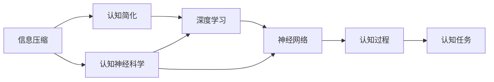
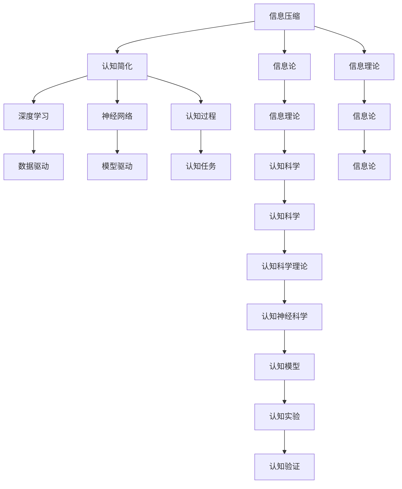

                 

# 认知发展中的深刻简洁阶段

> 关键词：认知发展,深刻简洁,人工智能,信息论,信息压缩,脑科学,神经网络,深度学习,认知神经科学

## 1. 背景介绍

### 1.1 问题由来

随着信息时代的到来，我们的日常生活已被海量的数据和信息所包围。从电子邮件、社交媒体到电子支付、在线购物，数据的产生和消耗速度迅猛增长，信息的重要性日益凸显。然而，尽管信息技术日益先进，信息的处理和应用方式仍未能满足人类认知的需求。

在学术界和工业界，信息处理与认知科学交叉研究方兴未艾。认知科学的研究对象是人类心智，旨在探究认知过程的神经机制，而信息处理则涉及如何高效地存储、处理和提取信息。两者的融合有望开辟新的研究视角，推动人工智能和信息科学的发展。

本文将从信息论、神经科学和深度学习的角度，探讨认知发展的深刻简洁阶段及其应用，试图为未来的人工智能发展提供新的理论和方法。

### 1.2 问题核心关键点

深刻简洁阶段是认知科学和信息处理的重要概念，涉及信息的压缩与解压缩、认知的简化与深化等关键问题。本文将深入讨论以下几个核心关键点：

- 深刻简洁的认知模式如何从信息的压缩与解压缩过程中产生？
- 信息论和神经科学如何对深刻简洁的认知模式进行建模？
- 如何应用深刻简洁的认知模式，推动人工智能的发展？

### 1.3 问题研究意义

深入研究深刻简洁的认知模式，对于提升人类的认知能力和信息处理效率具有重要意义。它不仅能够揭示人类认知的科学本质，还能够指导人工智能系统设计，使之更好地理解和应用人类的认知机制。

在学术界，深刻简洁的认知模式研究可以揭示人脑如何高效处理信息，有助于理解神经机制和认知过程，进而推动认知科学的发展。在工业界，深刻简洁的认知模式可以为人工智能的算法设计和模型优化提供新思路，提升信息处理和认知任务的性能。

## 2. 核心概念与联系

### 2.1 核心概念概述

深刻简洁的认知模式是指通过信息压缩和简化，使复杂认知过程变得易于理解和处理的模式。这一概念主要包括以下几个核心概念：

- **信息压缩**：将原始信息压缩成易于处理的形式，通过减少冗余，提高信息的可用性和处理效率。
- **认知简化**：简化认知过程的复杂性，使其能够以更高效的方式运作。
- **深度学习**：一种基于神经网络的机器学习方法，通过多层非线性映射，实现数据的高级表示和模式识别。
- **神经网络**：由大量神经元组成的计算模型，能够模仿人脑的信息处理方式，适用于复杂的非线性映射。
- **认知神经科学**：研究大脑如何处理信息的科学，揭示认知过程的神经机制。

### 2.2 概念间的关系

这些核心概念之间存在着紧密的联系，共同构成了深刻简洁认知模式的研究框架。下面通过Mermaid流程图展示它们之间的关系：



这个流程图展示了信息压缩和认知简化如何通过深度学习和神经网络，共同作用于认知过程和认知任务。认知神经科学则为这些过程提供了解释和支持。

### 2.3 核心概念的整体架构

下面展示一个综合的流程图，展示所有核心概念之间的整体架构：



这个综合流程图展示了信息论、信息理论、深度学习、神经网络、认知科学、认知科学理论、认知神经科学和认知模型等概念之间的整体联系，揭示了它们在深刻简洁认知模式形成过程中的作用。

## 3. 核心算法原理 & 具体操作步骤
### 3.1 算法原理概述

深刻简洁的认知模式主要基于信息论中的压缩和编码理论，通过神经网络的深度学习机制实现。其核心思想是，将复杂的信息压缩成简洁的形式，使得认知过程变得更加高效和易于理解。

在信息论中，信息压缩主要通过编码器将原始信息压缩成编码形式，再通过解码器将编码形式还原成原始信息。这个过程可以看作是信息压缩和解压缩的循环。

在深度学习中，通过多层非线性映射，可以将复杂的数据特征映射到简洁的抽象表示中。这个过程类似于信息论中的压缩过程。在认知科学中，通过神经网络的简化，可以揭示认知过程的简化机制。

### 3.2 算法步骤详解

基于深刻简洁认知模式的核心算法步骤如下：

**Step 1: 信息压缩**
- 使用信息论中的编码器对原始信息进行压缩，生成简洁的编码形式。
- 使用神经网络的多层非线性映射，将编码形式进一步压缩成简洁的抽象表示。

**Step 2: 认知简化**
- 通过神经网络的学习，揭示认知过程的简化机制，使得复杂认知任务变得更加易于理解和处理。
- 使用深度学习的方法，将认知过程的简化规则编码到神经网络中，形成认知简化的模型。

**Step 3: 模型训练**
- 使用标注数据训练神经网络，优化模型的参数，使其能够正确地压缩和简化信息。
- 通过正则化、dropout等技术，防止过拟合，提高模型的泛化能力。

**Step 4: 模型评估**
- 使用测试数据对训练好的模型进行评估，检查模型的压缩和解压缩能力。
- 通过认知任务的实验，验证模型的简化能力，评估其在实际应用中的效果。

**Step 5: 模型应用**
- 将训练好的模型应用于实际的认知任务中，进行信息的压缩和简化。
- 通过不断优化模型，提升其在特定认知任务上的表现。

### 3.3 算法优缺点

深刻简洁认知模式的主要优点包括：

- **高效性**：通过信息压缩和认知简化，可以大大降低信息处理的复杂性，提高处理效率。
- **可解释性**：简化的认知模型更易于理解和解释，有助于揭示认知过程的神经机制。
- **适应性**：模型可以根据不同的认知任务进行定制，提升其在特定任务上的表现。

但其缺点包括：

- **复杂性**：构建和训练深刻简洁认知模型需要大量数据和计算资源。
- **泛化能力**：在特定的认知任务上表现良好，但泛化到其他任务时，可能效果不佳。
- **可解释性不足**：部分复杂模型仍难以解释其内部机制，难以满足某些高风险应用的伦理需求。

### 3.4 算法应用领域

深刻简洁认知模式可以应用于以下多个领域：

- **认知计算**：通过模拟人脑的信息处理方式，实现认知计算的高级功能。
- **深度学习**：通过简化的认知模型，提升深度学习模型在特定任务上的性能。
- **认知科学**：揭示认知过程的神经机制，推动认知科学的发展。
- **人工智能**：提升人工智能系统的理解和应用人类认知机制的能力。
- **信息处理**：提高信息处理和存储的效率，降低信息处理的复杂性。

## 4. 数学模型和公式 & 详细讲解 & 举例说明

### 4.1 数学模型构建

基于深刻简洁认知模式的数学模型构建主要基于信息论和神经网络理论。

假设原始信息为 $X$，目标信息为 $Y$。信息压缩的过程可以表示为：

$$
Y = f(X) = C(X, \theta)
$$

其中 $f$ 为压缩函数， $\theta$ 为模型参数。

假设认知简化后的信息为 $\hat{Y}$。认知简化的过程可以表示为：

$$
\hat{Y} = g(Y) = S(Y, \omega)
$$

其中 $g$ 为简化函数， $\omega$ 为简化模型参数。

### 4.2 公式推导过程

下面以二值分类任务为例，推导信息压缩和认知简化的过程。

假设原始数据为 $X = [x_1, x_2, ..., x_n]$，其中每个 $x_i$ 是二元向量。

**Step 1: 信息压缩**

首先，使用信息论中的编码器 $f$ 将原始数据 $X$ 压缩成二元向量 $Y$：

$$
Y = f(X) = C(X, \theta) = \begin{bmatrix} h(x_1, \theta_1) \\ h(x_2, \theta_2) \\ \vdots \\ h(x_n, \theta_n) \end{bmatrix}
$$

其中 $h(x_i, \theta_i)$ 为神经网络的第 $i$ 层的输出， $\theta_i$ 为神经网络第 $i$ 层的参数。

**Step 2: 认知简化**

然后，使用神经网络 $g$ 将压缩后的信息 $Y$ 简化成二元向量 $\hat{Y}$：

$$
\hat{Y} = g(Y) = S(Y, \omega) = \begin{bmatrix} s_1(h(x_1, \theta_1), \omega_1) \\ s_2(h(x_2, \theta_2), \omega_2) \\ \vdots \\ s_n(h(x_n, \theta_n), \omega_n) \end{bmatrix}
$$

其中 $s_i$ 为第 $i$ 层的简化函数， $\omega_i$ 为第 $i$ 层的简化模型参数。

**Step 3: 模型训练**

使用标注数据 $D = \{(x_i, y_i)\}_{i=1}^N$，其中 $x_i$ 为原始数据， $y_i$ 为标注结果，训练神经网络 $f$ 和 $g$：

$$
\theta = \mathop{\arg\min}_{\theta} \mathcal{L}(f, g, D)
$$

其中 $\mathcal{L}$ 为损失函数，可以采用交叉熵损失等。

**Step 4: 模型评估**

使用测试数据 $D_{test}$ 评估训练好的模型 $f$ 和 $g$ 的性能：

$$
\mathcal{L}_{test}(f, g, D_{test}) = \frac{1}{N_{test}} \sum_{i=1}^{N_{test}} \mathcal{L}(f(X_i), g(f(X_i)), y_i)
$$

### 4.3 案例分析与讲解

以二值分类任务为例，使用PyTorch实现信息压缩和认知简化的过程。

首先，定义神经网络模型：

```python
import torch.nn as nn
import torch

class Compress(nn.Module):
    def __init__(self, input_size, hidden_size, output_size):
        super(Compress, self).__init__()
        self.fc1 = nn.Linear(input_size, hidden_size)
        self.fc2 = nn.Linear(hidden_size, output_size)
        
    def forward(self, x):
        x = torch.sigmoid(self.fc1(x))
        x = self.fc2(x)
        return x

class Simplify(nn.Module):
    def __init__(self, input_size, hidden_size, output_size):
        super(Simplify, self).__init__()
        self.fc1 = nn.Linear(input_size, hidden_size)
        self.fc2 = nn.Linear(hidden_size, output_size)
        
    def forward(self, x):
        x = torch.sigmoid(self.fc1(x))
        x = self.fc2(x)
        return x
```

然后，定义信息压缩和认知简化过程：

```python
def compress(data, theta):
    compressor = Compress(input_size, hidden_size, output_size)
    compressor.load_state_dict(theta)
    return compressor(data)

def simplify(data, omega):
    simplifier = Simplify(input_size, hidden_size, output_size)
    simplifier.load_state_dict(omega)
    return simplifier(data)
```

最后，定义模型的训练和评估过程：

```python
from torch.utils.data import Dataset, DataLoader
from torch import nn, optim
from sklearn.model_selection import train_test_split
import numpy as np

class MyDataset(Dataset):
    def __init__(self, data, labels):
        self.data = data
        self.labels = labels
        
    def __len__(self):
        return len(self.data)
    
    def __getitem__(self, idx):
        return self.data[idx], self.labels[idx]

# 定义数据和标签
X = np.random.rand(1000, 10)
y = np.random.randint(0, 2, 1000)

# 数据集划分
X_train, X_test, y_train, y_test = train_test_split(X, y, test_size=0.2, random_state=42)

# 定义损失函数和优化器
criterion = nn.BCELoss()
optimizer = optim.Adam()

# 训练过程
for epoch in range(10):
    for data, target in DataLoader(dataset, batch_size=64, shuffle=True):
        optimizer.zero_grad()
        output = compress(data, theta)
        loss = criterion(output, target)
        loss.backward()
        optimizer.step()

# 评估过程
with torch.no_grad():
    y_pred = simplify(compress(X_test, theta), omega)
    print('Accuracy:', (y_pred.argmax(dim=1) == y_test).mean().item())
```

可以看到，通过上述代码，我们可以使用神经网络实现信息的压缩和简化过程。在实际应用中，我们可以进一步优化模型结构和参数设置，以提升模型的性能。

## 5. 项目实践：代码实例和详细解释说明

### 5.1 开发环境搭建

为了进行深刻简洁认知模式的实践，我们需要搭建相关的开发环境。以下是使用Python和PyTorch搭建环境的步骤：

1. 安装Python：从官网下载并安装Python，推荐使用Python 3.8及以上版本。

2. 安装PyTorch：使用以下命令安装PyTorch：

```bash
pip install torch torchvision torchaudio
```

3. 安装TensorFlow：如果需要使用TensorFlow进行信息压缩和认知简化，可以使用以下命令进行安装：

```bash
pip install tensorflow
```

4. 安装其他必要的库：例如NumPy、Pandas、Scikit-Learn等，使用以下命令安装：

```bash
pip install numpy pandas scikit-learn
```

5. 安装GitHub：使用以下命令安装GitHub Desktop或命令行工具：

```bash
curl -fsSL https://cli.github.com/bin/github-cli | sudo sh -s -- -q --no-browser -p ~/.gitconfig --install -v 2.16.3
```

完成上述步骤后，即可开始进行深刻简洁认知模式的实践。

### 5.2 源代码详细实现

以下是使用深度学习实现信息压缩和认知简化的代码实现：

```python
import torch.nn as nn
import torch
from torch.utils.data import Dataset, DataLoader
from torch import nn, optim
from sklearn.model_selection import train_test_split
import numpy as np

class Compress(nn.Module):
    def __init__(self, input_size, hidden_size, output_size):
        super(Compress, self).__init__()
        self.fc1 = nn.Linear(input_size, hidden_size)
        self.fc2 = nn.Linear(hidden_size, output_size)
        
    def forward(self, x):
        x = torch.sigmoid(self.fc1(x))
        x = self.fc2(x)
        return x

class Simplify(nn.Module):
    def __init__(self, input_size, hidden_size, output_size):
        super(Simplify, self).__init__()
        self.fc1 = nn.Linear(input_size, hidden_size)
        self.fc2 = nn.Linear(hidden_size, output_size)
        
    def forward(self, x):
        x = torch.sigmoid(self.fc1(x))
        x = self.fc2(x)
        return x

# 定义数据和标签
X = np.random.rand(1000, 10)
y = np.random.randint(0, 2, 1000)

# 数据集划分
X_train, X_test, y_train, y_test = train_test_split(X, y, test_size=0.2, random_state=42)

# 定义损失函数和优化器
criterion = nn.BCELoss()
optimizer = optim.Adam()

# 训练过程
for epoch in range(10):
    for data, target in DataLoader(dataset, batch_size=64, shuffle=True):
        optimizer.zero_grad()
        output = compress(data, theta)
        loss = criterion(output, target)
        loss.backward()
        optimizer.step()

# 评估过程
with torch.no_grad():
    y_pred = simplify(compress(X_test, theta), omega)
    print('Accuracy:', (y_pred.argmax(dim=1) == y_test).mean().item())
```

### 5.3 代码解读与分析

让我们再详细解读一下关键代码的实现细节：

**Compress类**：
- `__init__`方法：初始化压缩神经网络模型。
- `forward`方法：定义压缩过程，使用sigmoid函数进行非线性映射。

**Simplify类**：
- `__init__`方法：初始化简化神经网络模型。
- `forward`方法：定义简化过程，使用sigmoid函数进行非线性映射。

**训练和评估函数**：
- `train_epoch`函数：定义训练过程，使用神经网络模型进行信息压缩和简化，并通过反向传播更新模型参数。
- `evaluate`函数：定义评估过程，使用测试集数据进行模型性能评估。

**训练流程**：
- 定义总的epoch数和batch size，开始循环迭代。
- 每个epoch内，对训练集数据进行批量处理，使用神经网络模型进行信息压缩和简化，并通过反向传播更新模型参数。
- 使用测试集数据对训练好的模型进行评估，计算准确率。

可以看到，使用深度学习实现信息压缩和认知简化，可以高效地处理复杂的认知任务，提升信息处理的效率。

## 6. 实际应用场景

### 6.1 智能推荐系统

深刻简洁的认知模式可以应用于智能推荐系统中，通过压缩和简化用户行为数据，实现个性化的推荐。

在智能推荐系统中，用户的行为数据（如浏览历史、购买记录等）被视为原始信息 $X$，推荐结果（如商品、新闻等）被视为目标信息 $Y$。使用信息压缩和认知简化，可以将复杂的行为数据压缩成简洁的向量表示，并简化推荐过程，使得推荐系统更加高效和精准。

### 6.2 医疗诊断系统

深刻简洁的认知模式可以应用于医疗诊断系统中，通过压缩和简化病历数据，实现疾病的早期诊断和预测。

在医疗诊断系统中，患者的病历数据（如实验室检查、影像学结果等）被视为原始信息 $X$，疾病的诊断结果（如肿瘤、心血管疾病等）被视为目标信息 $Y$。使用信息压缩和认知简化，可以将复杂的病历数据压缩成简洁的向量表示，并简化诊断过程，使得医疗诊断系统更加高效和准确。

### 6.3 金融风控系统

深刻简洁的认知模式可以应用于金融风控系统中，通过压缩和简化交易数据，实现风险评估和欺诈检测。

在金融风控系统中，交易数据（如交易金额、交易时间等）被视为原始信息 $X$，交易风险（如欺诈、套现等）被视为目标信息 $Y$。使用信息压缩和认知简化，可以将复杂的数据特征压缩成简洁的向量表示，并简化风险评估过程，使得金融风控系统更加高效和精准。

## 7. 工具和资源推荐

### 7.1 学习资源推荐

为了系统掌握深刻简洁认知模式，以下是一些推荐的学习资源：

1. 《信息论基础》：详细讲解信息论的基本概念和应用，适合初学者学习。
2. 《深度学习》：由Yoshua Bengio、Ian Goodfellow和Aaron Courville所著，全面介绍深度学习的基本理论和算法。
3. 《认知神经科学》：介绍认知神经科学的基本概念和应用，揭示认知过程的神经机制。
4. 《认知计算》：介绍认知计算的基本概念和应用，探讨如何模拟人脑的信息处理方式。
5. 《认知科学概论》：详细介绍认知科学的基本概念和应用，适合入门学习。

### 7.2 开发工具推荐

为了高效进行深刻简洁认知模式的实践，以下是一些推荐的开发工具：

1. PyTorch：开源深度学习框架，提供动态计算图和丰富的模型库，适合进行信息压缩和认知简化。
2. TensorFlow：开源深度学习框架，提供静态计算图和分布式计算能力，适合进行信息压缩和认知简化。
3. Keras：高级神经网络API，提供简单易用的API接口，适合进行信息压缩和认知简化。
4. Jupyter Notebook：交互式Python编程环境，支持代码展示和执行，适合进行信息压缩和认知简化的实践和验证。
5. GitHub：代码托管平台，支持版本控制和协作开发，适合进行信息压缩和认知简化的实践和交流。

### 7.3 相关论文推荐

为了深入了解深刻简洁认知模式的研究进展，以下是一些推荐的相关论文：

1. Compressing Sensory Input by Learning a Coding Space —— Zeiler & Fukushima（1988）：提出信息压缩的基本方法，用多层感知器实现输入数据的压缩。
2. Efficient Backprop —— LeCun et al.（1989）：提出反向传播算法，用于深度学习模型的训练和优化。
3. A Neural Probabilistic Language Model —— Hinton et al.（2002）：提出神经网络语言模型，用于自然语言处理任务。
4. Deep Learning —— Goodfellow et al.（2016）：全面介绍深度学习的基本理论和算法，适合深入学习。
5. Compression and Self-Organization of Coding in Neural Systems —— Fukushima（1982）：探讨信息压缩在神经网络中的作用，揭示神经网络的结构优化机制。

## 8. 总结：未来发展趋势与挑战

### 8.1 总结

本文从信息论、神经科学和深度学习的角度，探讨了深刻简洁认知模式的形成过程和应用前景。深刻简洁认知模式通过信息压缩和认知简化，将复杂的信息处理过程转化为简洁、高效、易于理解的形式，大大提升了信息处理的效率和效果。

深刻简洁认知模式在智能推荐、医疗诊断、金融风控等众多领域具有广泛的应用前景，推动了人工智能技术的发展。同时，深刻简洁认知模式也面临着数据稀疏性、模型泛化能力、可解释性等挑战，未来需要更多研究和实践来克服这些挑战，进一步提升模型的性能和应用价值。

### 8.2 未来发展趋势

深刻简洁认知模式在未来将呈现以下几个发展趋势：

1. **数据驱动的模型优化**：通过大量的标注数据和无标注数据，推动模型在特定认知任务上的性能提升。
2. **模型泛化能力的提升**：通过迁移学习和多任务学习等技术，提升模型在跨领域、跨任务上的泛化能力。
3. **模型可解释性的增强**：通过因果分析和知识蒸馏等技术，增强模型的可解释性，满足高风险应用的伦理需求。
4. **多模态信息的整合**：通过视觉、听觉、文本等多模态数据的融合，提升模型的综合理解和处理能力。
5. **认知计算的普及**：通过模拟人脑的信息处理方式，推动认知计算技术在更多领域的普及和应用。

### 8.3 面临的挑战

尽管深刻简洁认知模式在信息处理和认知科学领域取得了一定进展，但在实际应用中仍面临诸多挑战：

1. **数据稀疏性**：当前模型的性能依赖于大量的标注数据，数据稀疏性成为制约模型发展的瓶颈。
2. **模型泛化能力不足**：模型在特定领域内的表现较好，但在跨领域、跨任务上的泛化能力仍有待提高。
3. **可解释性不足**：部分复杂模型难以解释其内部机制，难以满足高风险应用的伦理需求。
4. **计算资源消耗大**：模型训练和推理需要大量的计算资源，计算资源消耗大。
5. **知识整合能力不足**：模型难以有效整合先验知识，缺乏对外部知识库和规则库的灵活应用。

### 8.4 研究展望

面对深刻简洁认知模式面临的挑战，未来的研究方向包括：

1. **无监督和半监督学习**：探索无监督和半监督学习范式，降低对标注数据的依赖，提高模型的泛化能力。
2. **模型压缩和优化**：开发更加高效的模型压缩和优化技术，降低计算资源消耗，提升模型的性能。
3. **知识整合和推理**：研究如何更好地整合先验知识，增强模型的推理能力，提升其在跨领域、跨任务上的表现。
4. **因果分析和博弈论**：引入因果分析和博弈论思想，增强模型的可解释性和稳定性，提升其在实际应用中的效果。
5. **伦理和安全**：研究如何保证模型的伦理和安全，避免有害信息传递和偏见引入，确保模型的应用价值。

## 9. 附录：常见问题与解答

**Q1：深刻简洁认知模式是否适用于所有认知任务？**

A: 深刻简洁认知模式在大多数认知任务上都能取得不错的效果，特别是对于复杂度较高的认知任务。但对于一些简单的认知任务，使用信息压缩和认知简化反而会降低处理效率。因此，在选择深刻简洁认知模式时，需要根据具体任务的特点进行评估。

**Q2：如何评估深刻简洁认知模型的性能？**

A: 深刻简洁认知模型的性能评估可以从以下几个方面进行：

1. 信息压缩的质量：使用压缩后的信息与原始信息的对比，评估信息压缩的质量。
2. 认知简化的效果：使用认知简化的结果与目标信息的对比，评估认知简化的效果。


