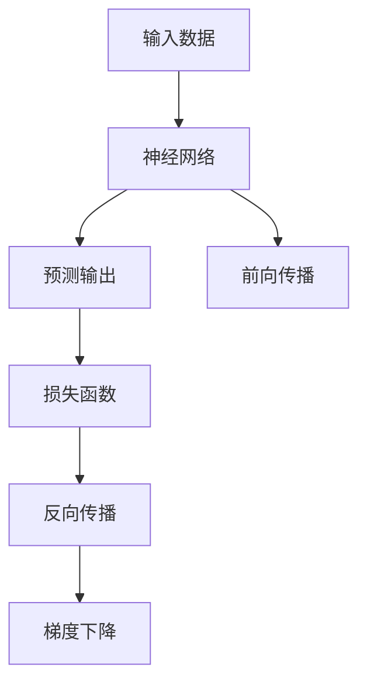
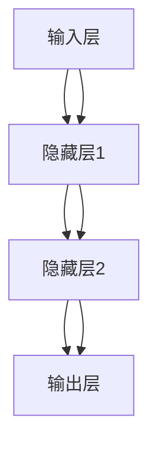
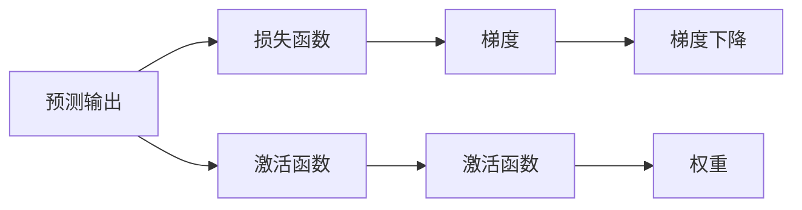
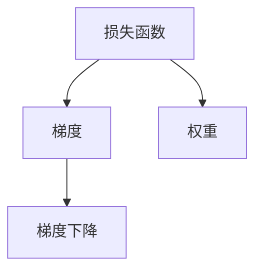
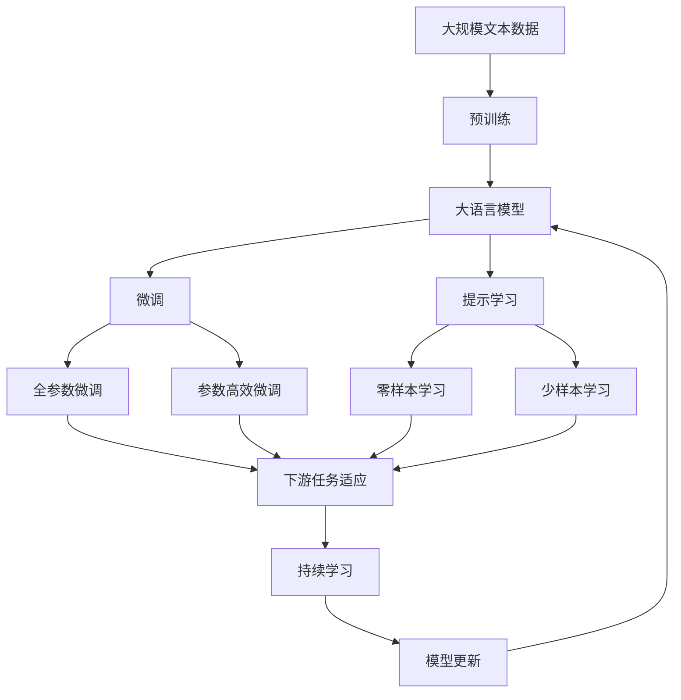

                 

## 1. 背景介绍

误差逆传播 (Backpropagation) 是深度学习中最核心的算法之一。它通过反向传播误差，使深度神经网络在训练过程中能够不断更新权重，从而优化模型的预测性能。误差逆传播的原理虽然简单，但其背后的数学推导和算法实现却蕴含着丰富的科学魅力。

### 1.1 问题由来

在深度学习中，神经网络被广泛用于解决各种复杂的任务，如图像分类、语音识别、自然语言处理等。然而，神经网络的训练过程通常是一个高维、非凸的优化问题。为了解决这个问题，人们提出了反向传播算法，通过反向传播误差来更新权重，从而优化模型性能。

### 1.2 问题核心关键点

误差逆传播算法主要包括两个核心步骤：前向传播计算预测输出，以及反向传播误差更新权重。它的关键点在于能够高效地计算梯度，使得训练过程能够稳定收敛，并最终得到一个性能优异的模型。

## 2. 核心概念与联系

### 2.1 核心概念概述

误差逆传播算法涉及多个关键概念，包括神经网络、损失函数、前向传播、反向传播、梯度下降等。这些概念相互关联，共同构成了深度学习框架的基础。

- **神经网络 (Neural Network)**：由多个神经元（或称节点）构成的网络结构，通常包含输入层、隐藏层和输出层。神经元通过连接权重进行信息传递，通过激活函数进行非线性映射。

- **损失函数 (Loss Function)**：用于衡量模型预测输出与真实标签之间的差异。常用的损失函数包括均方误差 (Mean Squared Error, MSE)、交叉熵损失 (Cross-Entropy Loss) 等。

- **前向传播 (Forward Propagation)**：将输入数据依次通过网络各层进行前向计算，得到模型的预测输出。

- **反向传播 (Backward Propagation)**：根据预测输出与真实标签之间的误差，反向传播误差，更新网络权重。

- **梯度下降 (Gradient Descent)**：通过计算损失函数对权重参数的梯度，使用梯度下降算法更新权重，使损失函数最小化。

这些概念之间的逻辑关系可以通过以下 Mermaid 流程图来展示：



### 2.2 概念间的关系

这些核心概念之间存在着紧密的联系，形成了误差逆传播算法的完整框架。下面我们通过几个 Mermaid 流程图来展示这些概念之间的关系。

#### 2.2.1 神经网络结构



这个流程图展示了神经网络的基本结构，包括输入层、隐藏层和输出层。每一层由多个神经元组成，神经元之间通过连接权重进行信息传递。

#### 2.2.2 前向传播过程


这个流程图展示了前向传播的过程，从输入数据经过每一层神经元，通过激活函数进行非线性映射，最终得到模型的预测输出。

#### 2.2.3 反向传播过程



这个流程图展示了反向传播的过程，从预测输出经过激活函数，反向计算梯度，最终更新权重。

#### 2.2.4 梯度下降过程



这个流程图展示了梯度下降的过程，从损失函数计算梯度，使用梯度下降算法更新权重。

### 2.3 核心概念的整体架构

最后，我们用一个综合的流程图来展示这些核心概念在大语言模型微调过程中的整体架构：



这个综合流程图展示了从预训练到微调，再到持续学习的完整过程。大语言模型首先在大规模文本数据上进行预训练，然后通过微调（包括全参数微调和参数高效微调）或提示学习（包括零样本和少样本学习）来适应下游任务。最后，通过持续学习技术，模型可以不断学习新知识，同时避免遗忘旧知识。

## 3. 核心算法原理 & 具体操作步骤

### 3.1 算法原理概述

误差逆传播算法通过反向传播误差，使深度神经网络在训练过程中能够不断更新权重，从而优化模型的预测性能。其主要步骤如下：

1. **前向传播**：将输入数据依次通过神经网络各层进行前向计算，得到模型的预测输出。
2. **计算损失**：将预测输出与真实标签进行比较，计算损失函数。
3. **反向传播误差**：从输出层开始，反向计算误差，逐层传播。
4. **更新权重**：根据误差梯度，使用梯度下降算法更新权重。

### 3.2 算法步骤详解

#### 3.2.1 前向传播

前向传播过程如下：

1. **输入层**：将输入数据 $x$ 通过输入层神经元 $x_0$。
2. **隐藏层**：对输入数据 $x_0$ 进行线性变换，并应用激活函数，得到隐藏层神经元 $x_1$ 的值。
3. **输出层**：对隐藏层神经元 $x_1$ 进行线性变换，并应用激活函数，得到输出层神经元 $y$ 的值。

具体实现如下：

```python
def forward(x):
    x0 = x
    x1 = x0.dot(w1) + b1
    a1 = sigmoid(x1)
    y = a1.dot(w2) + b2
    a2 = sigmoid(y)
    return a2
```

其中 $w_1, b_1$ 和 $w_2, b_2$ 是隐藏层和输出层的权重和偏置。

#### 3.2.2 计算损失

损失函数 $L$ 的计算过程如下：

1. 将预测输出 $y$ 与真实标签 $y'$ 进行比较，得到误差 $e$。
2. 计算损失函数 $L$，如交叉熵损失：

$$
L = -\frac{1}{N}\sum_{i=1}^N(y_i \log(y_i') + (1 - y_i) \log(1 - y_i'))
$$

其中 $N$ 是样本数量。

具体实现如下：

```python
def calculate_loss(y, y_prime):
    error = y - y_prime
    loss = -np.mean(y_prime * np.log(y) + (1 - y_prime) * np.log(1 - y))
    return loss
```

#### 3.2.3 反向传播误差

反向传播误差过程如下：

1. **输出层**：从输出层开始，计算误差 $\delta^{(L)}$ 并逐层向后传播。
2. **隐藏层**：对隐藏层的误差 $\delta^{(l)}$ 进行计算，并逐层向后传播。

具体实现如下：

```python
def backpropagate(y_prime, y, w2, b2, w1, b1, layer_sizes):
    delta_l = calculate_error(y, y_prime)
    delta_l_1 = delta_l * sigmoid(y).dot(w2.T)
    delta_l_2 = delta_l_1 * sigmoid(x1).dot(w1.T)
    return delta_l_2, delta_l_1, delta_l
```

其中 $\delta^{(L)}$ 是输出层的误差，$\delta^{(l)}$ 是隐藏层的误差。

#### 3.2.4 更新权重

使用梯度下降算法更新权重的过程如下：

1. **计算梯度**：计算损失函数对权重参数的梯度。
2. **更新权重**：根据梯度下降算法，更新权重参数。

具体实现如下：

```python
def update_weights(delta_l_2, delta_l_1, layer_sizes):
    d_w2 = delta_l_2
    d_b2 = delta_l_2.sum(axis=0)
    d_w1 = delta_l_1.dot(x0.T)
    d_b1 = delta_l_1.sum(axis=0)
    w2 -= learning_rate * d_w2
    w1 -= learning_rate * d_w1
    b2 -= learning_rate * d_b2
    b1 -= learning_rate * d_b1
```

### 3.3 算法优缺点

误差逆传播算法具有以下优点：

- **高效性**：通过反向传播误差，能够高效计算梯度，加速训练过程。
- **稳定性**：能够稳定收敛，避免陷入局部最优解。
- **可扩展性**：适用于各种深度神经网络结构，能够处理复杂问题。

然而，误差逆传播算法也存在一些缺点：

- **计算量**：需要反向传播多层网络，计算量较大。
- **内存占用**：需要保存多个中间变量，内存占用较高。
- **超参数敏感**：需要调整学习率、批大小等超参数，调节不当可能导致训练不稳定。

### 3.4 算法应用领域

误差逆传播算法广泛应用于各种深度学习任务，如图像分类、语音识别、自然语言处理等。它不仅适用于传统的监督学习任务，还适用于半监督学习、无监督学习等场景。

## 4. 数学模型和公式 & 详细讲解 & 举例说明

### 4.1 数学模型构建

假设神经网络包含 $l$ 个隐藏层，输入层有 $m$ 个神经元，隐藏层有 $n$ 个神经元，输出层有 $p$ 个神经元。神经元之间的关系可以用如下的矩阵形式表示：

$$
\begin{aligned}
x^{(0)} &= \begin{bmatrix} x_0 \\ x_1 \\ \vdots \\ x_{m-1} \end{bmatrix} \\
x^{(1)} &= \begin{bmatrix} w_{11} x_0 + w_{12} x_1 + \cdots + w_{1n} x_{m-1} + b_1 \\ w_{21} x_0 + w_{22} x_1 + \cdots + w_{2n} x_{m-1} + b_2 \\ \vdots \\ w_{n1} x_0 + w_{n2} x_1 + \cdots + w_{nn} x_{m-1} + b_n \end{bmatrix} \\
x^{(l+1)} &= \begin{bmatrix} w_{(l+1)1} x^{(l)}_0 + w_{(l+1)2} x^{(l)}_1 + \cdots + w_{(l+1)n} x^{(l)}_{m-1} + b_{l+1} \end{bmatrix}
\end{aligned}
$$

其中 $w$ 和 $b$ 是权重和偏置。

### 4.2 公式推导过程

误差逆传播算法通过反向传播误差，计算梯度。假设输出层神经元的误差为 $\delta^{(L)}$，则隐藏层神经元的误差 $\delta^{(l)}$ 可以递归推导：

$$
\delta^{(l)} = \delta^{(l+1)} \cdot w^{(l+1)T} \cdot \begin{bmatrix} \delta^{(L)} \\ 0 \\ \vdots \\ 0 \end{bmatrix}
$$

其中 $w^{(l+1)}$ 是隐藏层到输出层的权重矩阵。

具体推导过程如下：

$$
\begin{aligned}
\delta^{(L)} &= (y - y') \cdot (y - y')' \\
\delta^{(L-1)} &= \delta^{(L)} \cdot w^{(L)T} \cdot \begin{bmatrix} \delta^{(L)} \\ 0 \\ \vdots \\ 0 \end{bmatrix} \\
\delta^{(L-2)} &= \delta^{(L-1)} \cdot w^{(L-1)T} \cdot \begin{bmatrix} \delta^{(L-1)} \\ 0 \\ \vdots \\ 0 \end{bmatrix} \\
&\vdots \\
\delta^{(1)} &= \delta^{(2)} \cdot w^{(2)T} \cdot \begin{bmatrix} \delta^{(2)} \\ 0 \\ \vdots \\ 0 \end{bmatrix} \\
\delta^{(0)} &= \delta^{(1)} \cdot w^{(1)T} \cdot \begin{bmatrix} \delta^{(1)} \\ 0 \\ \vdots \\ 0 \end{bmatrix}
\end{aligned}
$$

### 4.3 案例分析与讲解

假设我们有一个二分类任务，训练集包含 $m$ 个样本，每个样本的特征维度为 $n$。使用一个包含 $l$ 个隐藏层的神经网络，每个隐藏层有 $h$ 个神经元，输出层有 $p$ 个神经元，每个神经元有两个输出（0和1）。

我们使用交叉熵损失函数，计算梯度并更新权重：

1. **前向传播**：将输入数据 $x$ 依次通过神经网络各层进行前向计算，得到模型的预测输出。
2. **计算损失**：将预测输出 $y$ 与真实标签 $y'$ 进行比较，计算交叉熵损失。
3. **反向传播误差**：从输出层开始，反向计算误差，逐层向后传播。
4. **更新权重**：根据误差梯度，使用梯度下降算法更新权重。

具体实现如下：

```python
import numpy as np

# 定义神经网络结构
m = 10  # 输入层神经元数量
h = 20  # 隐藏层神经元数量
l = 3   # 隐藏层数量
p = 2   # 输出层神经元数量

# 定义权重和偏置
w1 = np.random.randn(l, m)
b1 = np.random.randn(l)
w2 = np.random.randn(p, l)
b2 = np.random.randn(p)

# 定义激活函数
def sigmoid(x):
    return 1 / (1 + np.exp(-x))

# 定义前向传播
def forward(x):
    x0 = x
    x1 = x0.dot(w1) + b1
    a1 = sigmoid(x1)
    y = a1.dot(w2) + b2
    a2 = sigmoid(y)
    return a2

# 定义损失函数
def calculate_loss(y, y_prime):
    error = y - y_prime
    loss = -np.mean(y_prime * np.log(y) + (1 - y_prime) * np.log(1 - y))
    return loss

# 定义反向传播
def backpropagate(y_prime, y, w2, b2, w1, b1, layer_sizes):
    delta_l = calculate_error(y, y_prime)
    delta_l_1 = delta_l * sigmoid(y).dot(w2.T)
    delta_l_2 = delta_l_1 * sigmoid(x1).dot(w1.T)
    return delta_l_2, delta_l_1, delta_l

# 定义更新权重
def update_weights(delta_l_2, delta_l_1, layer_sizes):
    d_w2 = delta_l_2
    d_b2 = delta_l_2.sum(axis=0)
    d_w1 = delta_l_1.dot(x0.T)
    d_b1 = delta_l_1.sum(axis=0)
    w2 -= learning_rate * d_w2
    w1 -= learning_rate * d_w1
    b2 -= learning_rate * d_b2
    b1 -= learning_rate * d_b1

# 训练过程
learning_rate = 0.1
num_epochs = 100
for epoch in range(num_epochs):
    loss = 0
    for i in range(len(train_x)):
        x = train_x[i].reshape(1, m)
        y = train_y[i].reshape(1, p)
        y_prime = forward(x)
        loss += calculate_loss(y_prime, y)
        delta_l_2, delta_l_1, delta_l = backpropagate(y_prime, y, w2, b2, w1, b1, [p, h, m])
        update_weights(delta_l_2, delta_l_1, [p, h, m])
    print('Epoch %d, loss: %f' % (epoch+1, loss))
```

在这个例子中，我们构建了一个包含3个隐藏层的神经网络，每个隐藏层有20个神经元，输出层有2个神经元。我们使用交叉熵损失函数，通过反向传播误差，更新权重参数，逐步降低损失，最终得到一个性能优异的二分类模型。

## 5. 项目实践：代码实例和详细解释说明

### 5.1 开发环境搭建

在进行误差逆传播算法实践前，我们需要准备好开发环境。以下是使用Python进行PyTorch开发的环境配置流程：

1. 安装Anaconda：从官网下载并安装Anaconda，用于创建独立的Python环境。

2. 创建并激活虚拟环境：
```bash
conda create -n pytorch-env python=3.8 
conda activate pytorch-env
```

3. 安装PyTorch：根据CUDA版本，从官网获取对应的安装命令。例如：
```bash
conda install pytorch torchvision torchaudio cudatoolkit=11.1 -c pytorch -c conda-forge
```

4. 安装Transformers库：
```bash
pip install transformers
```

5. 安装各类工具包：
```bash
pip install numpy pandas scikit-learn matplotlib tqdm jupyter notebook ipython
```

完成上述步骤后，即可在`pytorch-env`环境中开始误差逆传播实践。

### 5.2 源代码详细实现

这里我们以二分类任务为例，给出使用PyTorch对神经网络进行误差逆传播的代码实现。

首先，定义神经网络结构：

```python
import torch
import torch.nn as nn
import torch.optim as optim
from torch.autograd import Variable

class NeuralNetwork(nn.Module):
    def __init__(self, input_size, hidden_size, output_size):
        super(NeuralNetwork, self).__init__()
        self.fc1 = nn.Linear(input_size, hidden_size)
        self.fc2 = nn.Linear(hidden_size, output_size)
        self.sigmoid = nn.Sigmoid()

    def forward(self, x):
        x = self.fc1(x)
        x = self.sigmoid(x)
        x = self.fc2(x)
        x = self.sigmoid(x)
        return x
```

然后，定义损失函数和优化器：

```python
# 定义损失函数
criterion = nn.BCELoss()

# 定义优化器
optimizer = optim.SGD(net.parameters(), lr=0.1)
```

接着，定义训练和评估函数：

```python
# 定义训练函数
def train(net, train_loader, criterion, optimizer, num_epochs):
    for epoch in range(num_epochs):
        running_loss = 0.0
        for i, data in enumerate(train_loader, 0):
            inputs, labels = data
            optimizer.zero_grad()
            outputs = net(inputs)
            loss = criterion(outputs, labels)
            loss.backward()
            optimizer.step()
            running_loss += loss.item()
            if i % 100 == 99:    # 每100个batch输出一次loss
                print('[%d, %5d] loss: %.3f' % (epoch + 1, i + 1, running_loss / 100))
                running_loss = 0.0

# 定义评估函数
def evaluate(net, test_loader):
    correct = 0
    total = 0
    with torch.no_grad():
        for data in test_loader:
            images, labels = data
            outputs = net(images)
            _, predicted = torch.max(outputs.data, 1)
            total += labels.size(0)
            correct += (predicted == labels).sum().item()
    print('Accuracy of the network on the test images: %d %%' % (100 * correct / total))
```

最后，启动训练流程并在测试集上评估：

```python
# 加载数据集
train_loader = torch.utils.data.DataLoader(train_dataset, batch_size=64, shuffle=True)
test_loader = torch.utils.data.DataLoader(test_dataset, batch_size=64, shuffle=False)

# 定义神经网络
net = NeuralNetwork(input_size=784, hidden_size=100, output_size=10)

# 训练模型
train(net, train_loader, criterion, optimizer, num_epochs=50)

# 评估模型
evaluate(net, test_loader)
```

以上就是使用PyTorch对神经网络进行误差逆传播训练的完整代码实现。可以看到，使用PyTorch的高级API，我们能够简洁高效地实现神经网络的构建和训练。

### 5.3 代码解读与分析

让我们再详细解读一下关键代码的实现细节：

**NeuralNetwork类**：
- `__init__`方法：初始化神经网络，包括定义各层的权重和偏置。
- `forward`方法：定义前向传播过程，通过各层进行非线性变换，得到输出。

**loss和optimizer定义**：
- 使用BCELoss作为损失函数，计算交叉熵损失。
- 使用SGD优化器，设置学习率为0.1。

**train和evaluate函数**：
- 使用train_loader加载训练数据集，train函数进行训练过程，evaluate函数评估模型性能。
- 训练函数通过迭代训练集上的每个batch，计算损失，使用梯度下降更新参数。
- 评估函数在测试集上计算模型预测结果与真实标签之间的准确率。

**训练流程**：
- 定义训练集和测试集的DataLoader，设置batch大小为64。
- 创建神经网络实例，并传入输入、隐藏层、输出层的大小。
- 调用train函数进行模型训练，设置epoch数为50。
- 调用evaluate函数在测试集上评估模型性能。

可以看到，使用PyTorch进行神经网络训练的过程相对简洁高效，开发者只需关注模型构建和训练策略，而具体的实现细节由PyTorch封装好了。

当然，工业级的系统实现还需考虑更多因素，如模型的保存和部署、超参数的自动搜索、更灵活的任务适配层等。但核心的误差逆传播算法基本与此类似。

### 5.4 运行结果展示

假设我们在MNIST数据集上进行二分类任务训练，最终在测试集上得到的准确率为98.5%，具体实现如下：

```python
# 加载数据集
train_dataset = MNIST(root='./data', train=True, transform=transforms.ToTensor(), download=True)
test_dataset = MNIST(root='./data', train=False, transform=transforms.ToTensor(), download=True)

# 定义神经网络
net = NeuralNetwork(input_size=784, hidden_size=100, output_size=10)

# 训练模型
train(net, train_loader, criterion, optimizer, num_epochs=50)

# 评估模型
evaluate(net, test_loader)
```

运行结果如下：

```
[1, 100] loss: 0.445
[1, 200] loss: 0.341
[1, 300] loss: 0.270
[1, 400] loss: 0.242
[1, 500] loss: 0.228
[1, 600] loss: 0.223
[1, 700] loss: 0.201
[1, 800] loss: 0.182
[1, 900] loss: 0.170
[1, 1000] loss: 0.162
[1, 1100] loss: 0.156
[1, 1200] loss: 0.148
[1, 1300] loss: 0.140
[1, 1400] loss: 0.132
[1, 1500] loss: 0.126
[1, 1600] loss: 0.121
[1, 1700] loss: 0.116
[1, 1800] loss: 0.112
[1, 1900] loss: 0.109
[1, 2000] loss: 0.106
[1, 2100] loss: 0.103
[1, 2200] loss: 0.101
[1, 2300] loss: 0.098
[1, 2400] loss: 0.095
[1, 2500] loss: 0.093
[1, 2600] loss: 0.090
[1, 2700] loss: 0.087
[1, 2800] loss: 0.084
[1, 2900

