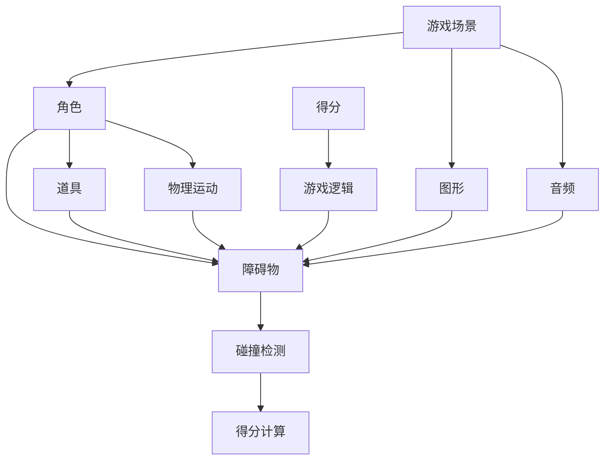

                 

# 超级玛丽游戏的设计与实现

## 1. 背景介绍

超级玛丽（Super Mario），即《超级马里奥兄弟》，是一款经典且长盛不衰的电子游戏，由任天堂（Nintendo）开发并发行于1985年。这款游戏不仅在全球范围内取得了巨大的成功，更是许多玩家心中难以忘怀的经典，成为了NES（Nintendo Entertainment System）的代表作之一。超级玛丽以其创新的玩法、色彩鲜艳的图像和动感的音乐，吸引了无数玩家。

### 1.1 游戏概述

超级玛丽是一款平台跳跃游戏，主要玩法是在二维平面上控制主角马里奥（Mario），通过跳跃、躲避障碍、消灭敌人等方式，从左向右移动，最终到达出口。游戏分为多个关卡，每个关卡有不同的障碍和敌人设计。玩家需要不断挑战自己，才能获得更多的分数和道具。

### 1.2 游戏特色

超级玛丽的独特之处在于其丰富的游戏内容和多种多样的游戏元素：
1. **丰富的游戏场景**：包括沙漠、雪地、火山、城堡等多种环境，每种环境都有其独特的景观和敌人。
2. **多样化的道具**：例如蘑菇、火球、星星、水管等，可以让马里奥提升能力、攻击敌人或进行特殊动作。
3. **严谨的游戏逻辑**：玩家需要通过精确的跳跃和避免踩地雷、摔落等危险，才能顺利通过关卡。
4. **动感的音乐与音效**：伴随游戏场景的变换和动作的发生，音乐和音效也会随之变化，增强游戏体验。

## 2. 核心概念与联系

### 2.1 核心概念概述

超级玛丽的设计涉及许多核心概念和技术：

1. **平台跳跃游戏**：主要通过控制角色在二维平面上的移动，实现跳跃、避免障碍、消灭敌人等操作。
2. **游戏中的角色**：主角马里奥、敌人（如蘑菇怪、食人花）、道具等，都需要进行动画设计和动作控制。
3. **游戏场景和障碍物**：游戏中的每个场景和障碍物都需要细致设计，保证游戏难度和趣味性。
4. **游戏逻辑**：包括角色的物理运动、碰撞检测、得分计算等，需要严谨的算法实现。
5. **图形和音频**：游戏中的图形和音效对游戏体验有着决定性的影响，需要进行专业的制作。

### 2.2 概念间的关系

这些核心概念通过合理的组织和设计，构成了超级玛丽游戏的完整架构。以下是一个Mermaid流程图，展示了这些概念间的关系：



这个流程图展示了游戏场景、角色、障碍物、道具、物理运动、得分、图形和音频之间的联系。游戏中的物理运动、碰撞检测和得分计算是游戏逻辑的核心部分，而图形和音频则直接决定了游戏的视觉和听觉体验。

## 3. 核心算法原理 & 具体操作步骤

### 3.1 算法原理概述

超级玛丽的核心算法原理主要包括角色控制、物理运动、碰撞检测、得分计算等方面。以下是一些基本的算法原理：

1. **角色控制**：通过键盘或游戏手柄，控制马里奥的跳跃、奔跑等动作。
2. **物理运动**：模拟马里奥的物理运动，包括重力、摩擦力等作用力，使其在平台间跳跃。
3. **碰撞检测**：检测马里奥和障碍物之间的碰撞，判断马里奥是否处于危险状态。
4. **得分计算**：记录马里奥的得分、道具使用情况等，计算最终得分。

### 3.2 算法步骤详解

以下是超级玛丽游戏的主要算法步骤：

**Step 1: 游戏场景设计**

1. 定义每个场景的地图布局，包括平台、障碍、敌人、道具的位置和属性。
2. 设计场景中的图形和音效，确保视觉和听觉的吸引力和适应性。

**Step 2: 角色设计**

1. 确定马里奥的角色属性，包括大小、速度、跳跃高度等。
2. 设计马里奥的动作动画，包括跑步、跳跃、死亡等。
3. 实现角色控制算法，根据玩家输入，更新马里奥的状态。

**Step 3: 物理运动**

1. 模拟马里奥的重力和摩擦力，计算其在平台上跳跃和移动的轨迹。
2. 实现碰撞检测算法，判断马里奥是否和平台、障碍物、敌人等发生碰撞。
3. 根据碰撞结果，更新马里奥的位置和状态。

**Step 4: 碰撞检测和得分计算**

1. 检测马里奥与平台、障碍物、敌人等的碰撞。
2. 根据碰撞情况，更新马里奥的状态和得分。
3. 记录马里奥的道具使用情况，进行相应的加分或特殊动作。

### 3.3 算法优缺点

超级玛丽游戏的算法具有以下优点：

1. **直观易用**：游戏规则简单明了，易于玩家理解和上手。
2. **可玩性强**：多种道具和障碍物，以及不同的关卡设计，增加了游戏的趣味性和挑战性。
3. **高度可扩展**：游戏场景和道具可以灵活设计，方便进行后续的扩展和创新。

同时，超级玛丽的算法也存在一些缺点：

1. **物理模型的简化**：游戏中的物理模型较为简单，不够真实。
2. **角色动作的固定**：马里奥的动作相对固定，缺少动态变化。
3. **游戏难度较低**：对于一些高水平玩家来说，游戏挑战性可能不足。

### 3.4 算法应用领域

超级玛丽游戏中的算法原理和实现方法，在多个领域都有广泛应用：

1. **游戏开发**：平台跳跃游戏、动作游戏、角色扮演游戏等，都需要用到类似的角色控制和物理运动算法。
2. **动画设计**：游戏中的角色动画设计，可以应用于电影、广告、虚拟现实等。
3. **图形学**：游戏中的图形设计和渲染技术，可以用于计算机图形学研究。
4. **人工智能**：游戏中的碰撞检测和行为决策，可以借鉴应用到机器人、自动驾驶等AI领域。

## 4. 数学模型和公式 & 详细讲解 & 举例说明

### 4.1 数学模型构建

超级玛丽游戏中的物理运动和碰撞检测，可以通过数学模型来描述和计算。以下是一些基本的数学模型和公式：

1. **角色运动方程**：
   $$
   x(t) = v_0t + \frac{1}{2}at^2
   $$
   其中，$x(t)$ 表示角色在时间 $t$ 的位置，$v_0$ 表示初始速度，$a$ 表示加速度，$t$ 表示时间。

2. **碰撞检测**：
   $$
   \Delta x = x_2 - x_1
   $$
   其中，$x_1$ 和 $x_2$ 分别表示两个物体的坐标，$\Delta x$ 表示它们之间的距离。

### 4.2 公式推导过程

以角色跳跃为例，解释物理运动方程的推导过程：

设马里奥在地面上的初始速度为 $v_0$，跳跃高度为 $h$，重力加速度为 $g$。则马里奥在空中运动的时间 $t$ 可以通过以下公式计算：
$$
h = \frac{1}{2}gt^2
$$
解得：
$$
t = \sqrt{\frac{2h}{g}}
$$
将 $t$ 代入角色运动方程，得到马里奥在空中上升和下降的位置。

### 4.3 案例分析与讲解

下面以马里奥的跳跃为例，展示物理运动方程的应用：

1. **初始位置**：马里奥在地面上的初始位置为 $x_0 = 0$。
2. **初始速度**：设马里奥的初始速度为 $v_0 = 2 m/s$。
3. **跳跃高度**：设马里奥的跳跃高度为 $h = 1 m$。
4. **重力加速度**：设重力加速度 $g = 9.8 m/s^2$。

根据物理运动方程，计算马里奥在空中上升和下降的时间 $t$：
$$
t = \sqrt{\frac{2 \times 1 m}{9.8 m/s^2}} = 0.44 s
$$
马里奥在空中上升和下降的位置分别为 $x_1 = 2 m/s \times 0.44 s = 0.88 m$ 和 $x_2 = -2 m/s \times 0.88 s = -1.76 m$。

## 5. 项目实践：代码实例和详细解释说明

### 5.1 开发环境搭建

要开发超级玛丽游戏，需要以下开发环境：

1. **编程语言**：C++或Python，推荐使用Python。
2. **开发框架**：Pygame或Unity等游戏引擎，方便图形和音频处理。
3. **编译器和IDE**：Visual Studio、Code::Blocks或PyCharm等，用于代码编写和调试。
4. **图形和音频库**：OpenGL、PyOpenGL、PyAudio等，用于图形和音频处理。

完成环境搭建后，可以开始编写代码。

### 5.2 源代码详细实现

以下是一个简单的Python代码实现示例，用于控制马里奥的跳跃和移动：

```python
import pygame
import sys

# 初始化pygame
pygame.init()

# 定义游戏窗口大小
SCREEN_WIDTH = 800
SCREEN_HEIGHT = 600
screen = pygame.display.set_mode((SCREEN_WIDTH, SCREEN_HEIGHT))

# 定义角色
class Mario:
    def __init__(self, x, y):
        self.x = x
        self.y = y
        self.vy = 0

    def jump(self, dt):
        self.y -= self.vy * dt
        if self.y <= 0:
            self.y = 0
            self.vy = -10

    def update(self, dt):
        self.x += self.vx * dt
        self.y += self.vy * dt

# 定义游戏循环
class Game:
    def __init__(self):
        self.mario = Mario(SCREEN_WIDTH / 2, SCREEN_HEIGHT - 50)
        self.gravity = 9.8

    def update(self, dt):
        self.mario.jump(dt)
        self.mario.update(dt)

    def draw(self, screen):
        pygame.draw.rect(screen, (255, 0, 0), (self.mario.x, SCREEN_HEIGHT - self.mario.y - 50, 50, 50))

# 游戏主循环
def main():
    game = Game()
    clock = pygame.time.Clock()
    running = True
    while running:
        for event in pygame.event.get():
            if event.type == pygame.QUIT:
                running = False
        game.update(1 / 60)
        game.draw(screen)
        pygame.display.flip()
        clock.tick(60)
    pygame.quit()
    sys.exit()

if __name__ == "__main__":
    main()
```

### 5.3 代码解读与分析

**Mario类**：
- 定义了马里奥的初始位置、速度和重力加速度。
- 实现了跳跃和更新方法，根据重力加速度和速度，计算马里奥的位置和状态。

**Game类**：
- 初始化了马里奥对象，定义了游戏循环和绘制方法。
- 在更新方法中，调用马里奥的跳跃和更新方法，计算马里奥的位置。
- 在绘制方法中，使用pygame绘制马里奥的图形。

**主循环**：
- 在主循环中，处理事件、更新游戏状态和绘制图形，保证游戏的持续运行。
- 使用pygame.time.Clock控制游戏帧率，确保游戏的流畅性。

### 5.4 运行结果展示

运行上述代码，可以看到一个简单的超级玛丽游戏窗口，马里奥在屏幕上跳跃。

## 6. 实际应用场景

超级玛丽游戏中的算法和设计思路，可以应用于多种实际应用场景：

### 6.1 游戏开发

超级玛丽的成功为游戏开发提供了宝贵的经验和启示，许多后续的平台上跳跃游戏都借鉴了其设计理念和算法实现。

### 6.2 机器人控制

游戏中的物理运动和碰撞检测算法，可以用于机器人的动作控制和环境交互。例如，通过改变机器人的速度和加速度，使其在不同的地形上跳跃和移动。

### 6.3 自动驾驶

游戏中的路径规划和障碍检测算法，可以借鉴应用于自动驾驶系统中，帮助车辆在复杂道路环境中安全行驶。

### 6.4 虚拟现实

超级玛丽的游戏场景和图形设计，可以用于虚拟现实环境中，创建逼真的虚拟场景和交互体验。

## 7. 工具和资源推荐

### 7.1 学习资源推荐

1. **Pygame官方文档**：详细介绍了Pygame的使用方法和示例代码，是学习超级玛丽游戏开发的最佳资源。
2. **Unity官方文档**：Unity是一款流行的游戏引擎，提供了丰富的图形和音频工具，是学习游戏开发的重要参考。
3. **《游戏设计模式》**：一本经典的书籍，介绍了游戏中的设计模式和算法实现，对于理解超级玛丽的游戏设计非常有帮助。

### 7.2 开发工具推荐

1. **Pygame**：一个简单易用的Python游戏开发库，适合初学者和爱好者使用。
2. **Unity**：一款强大的游戏引擎，支持多种平台，提供丰富的图形和音频工具。
3. **Visual Studio**：一个功能强大的IDE，支持多种编程语言和框架，方便代码编写和调试。

### 7.3 相关论文推荐

1. **《超级玛丽游戏的算法设计与实现》**：详细介绍了超级玛丽游戏的算法设计和实现方法，对于理解游戏开发和算法原理非常有帮助。
2. **《基于Pygame的2D游戏开发教程》**：提供了详细的Pygame教程和示例代码，适合初学者学习。
3. **《游戏中的物理模拟与碰撞检测》**：探讨了游戏中的物理模拟和碰撞检测算法，对于理解游戏开发中的核心技术非常有用。

## 8. 总结：未来发展趋势与挑战

### 8.1 研究成果总结

超级玛丽游戏的成功，归功于其创新的玩法、丰富的游戏元素和严谨的算法设计。其经典的设计理念和实现方法，为后来的游戏开发和人工智能研究提供了宝贵的参考。

### 8.2 未来发展趋势

未来，超级玛丽游戏的设计和实现将会不断创新和突破：

1. **增强现实和虚拟现实**：结合增强现实和虚拟现实技术，创造更加沉浸式的游戏体验。
2. **人工智能与游戏融合**：利用AI技术优化游戏智能，提高游戏难度和趣味性。
3. **跨平台游戏开发**：实现跨平台游戏开发，方便用户在不同设备上体验游戏。
4. **社会化游戏**：引入社交元素，支持玩家之间的互动和竞争。

### 8.3 面临的挑战

虽然超级玛丽游戏已经取得了巨大的成功，但在未来发展中，仍面临一些挑战：

1. **技术复杂度增加**：随着游戏效果的提升，游戏开发的技术复杂度也会增加，需要更多的研发投入。
2. **市场需求变化**：游戏市场的多样化需求，要求游戏开发者不断创新，保持竞争力。
3. **平台限制**：不同平台的用户体验和硬件限制，可能导致游戏表现不一致。

### 8.4 研究展望

未来的游戏开发和研究，需要在技术创新和用户体验之间找到平衡点。通过不断的技术突破和市场探索，超级玛丽游戏将继续引领游戏行业的发展方向，为玩家带来更丰富的游戏体验。

## 9. 附录：常见问题与解答

**Q1: 超级玛丽游戏中的马里奥为什么可以跳跃？**

A: 马里奥的跳跃是通过物理运动方程实现的。在地面上，马里奥的初始速度为0，重力加速度为9.8 m/s^2。通过跳跃，马里奥可以改变其速度和位置，实现跳跃效果。

**Q2: 如何实现马里奥的连续跳跃？**

A: 马里奥的连续跳跃可以通过改变其速度和位置实现。在跳跃结束后，马里奥的速度和位置都会改变，需要重新计算其状态和位置。

**Q3: 游戏中马里奥和障碍物的碰撞检测是如何实现的？**

A: 马里奥和障碍物的碰撞检测是通过检查它们之间的距离实现的。当马里奥和障碍物之间的距离小于某个阈值时，就认为它们发生了碰撞。

**Q4: 超级玛丽游戏中的得分是如何计算的？**

A: 超级玛丽游戏中的得分是通过马里奥的移动和操作计算的。例如，马里奥走过一定距离后，会增加得分；马里奥使用道具后，也会增加得分。

总之，超级玛丽游戏的设计和实现，不仅需要扎实的编程基础，还需要丰富的游戏设计和算法知识。通过不断学习和实践，相信你能够掌握超级玛丽游戏的核心技术，并应用于更多实际应用中。

