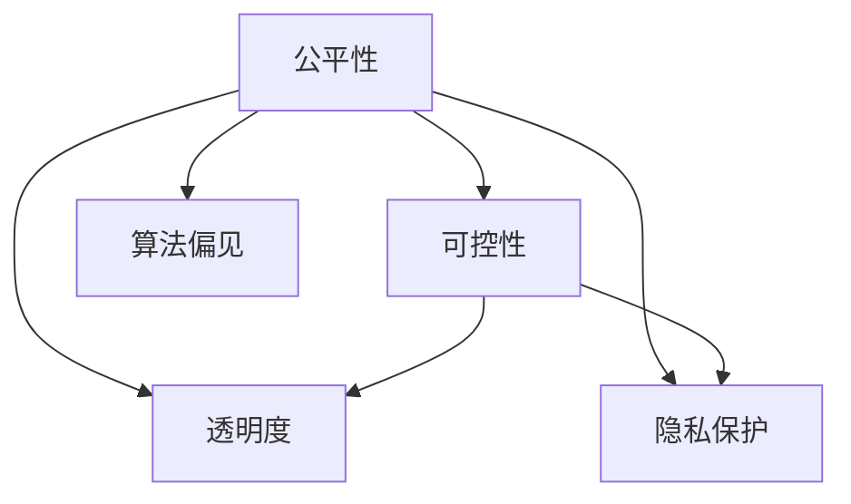
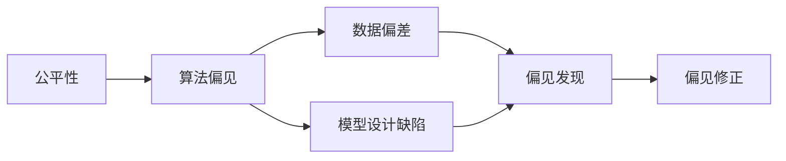
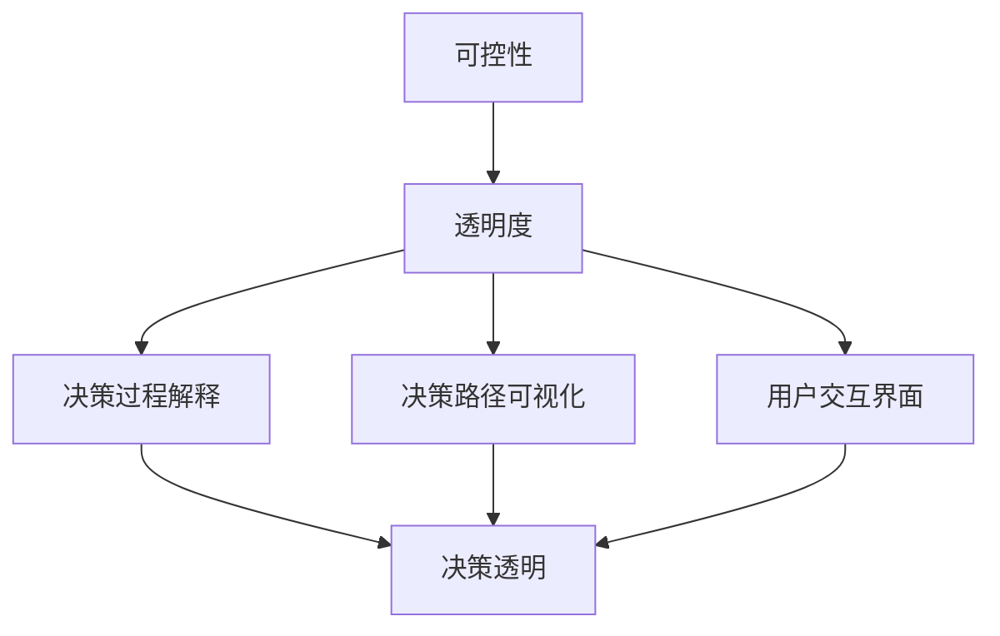
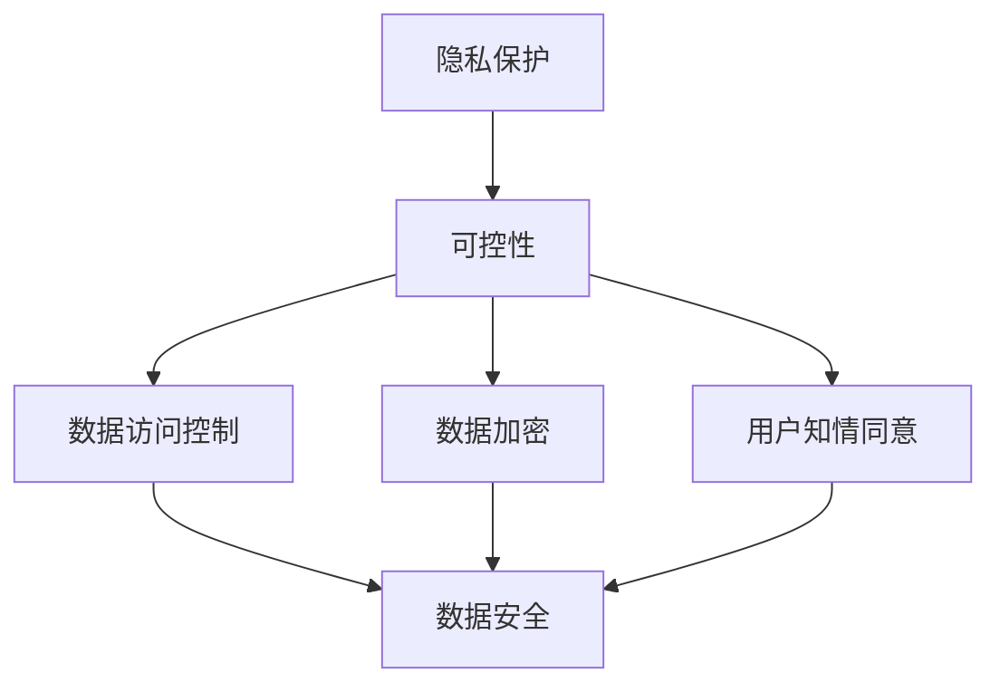
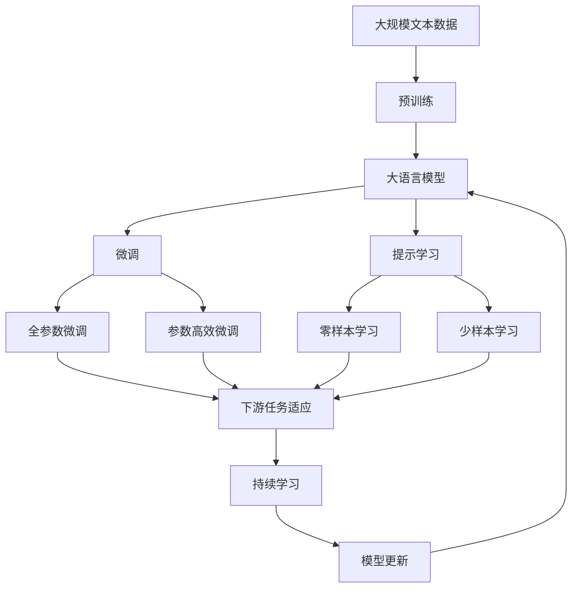

                 

# 软件 2.0 的伦理问题：公平性和可控性

> 关键词：软件 2.0, 公平性, 可控性, 伦理问题, AI, 人工智能, 机器学习, 自动化

## 1. 背景介绍

### 1.1 问题由来

随着人工智能（AI）和机器学习（ML）技术的迅猛发展，我们正进入一个全新的技术时代——软件 2.0（Software 2.0）时代。在这个时代，软件不再是单纯的事务处理工具，而是变成了拥有自主智能的“智能软件”（Smart Software）。它们能够进行自我学习、自我改进，并逐步表现出超越人类智能的能力。

然而，这种智能化带来的不仅是效率的提升和新的商业模式，还引发了一系列复杂的伦理问题。这些问题不仅关系到技术的可持续发展，也关系到社会公平、个人隐私和数据安全。其中，软件 2.0 的公平性和可控性尤为关键。

### 1.2 问题核心关键点

软件 2.0 的公平性涉及算法决策的公正性和透明性，防止偏见和歧视，确保所有人都能平等地受益于智能技术。可控性则涉及技术的可解释性和可控性，确保开发者和用户能够理解并掌控智能软件的决策过程。

软件 2.0 的伦理问题主要包括以下几个方面：

1. **算法偏见与歧视**：智能软件可能由于训练数据的不平衡或模型设计的缺陷，导致对某些群体的歧视。
2. **隐私保护**：智能软件处理大量个人数据，如何保护用户隐私，防止数据滥用和泄露，是重要的伦理问题。
3. **决策透明度**：智能软件的决策过程通常是一个“黑箱”，如何提高决策透明度，使用户理解并信任其输出，是另一个重要问题。
4. **责任归属**：当智能软件出现错误或事故，责任应如何划分，是法律和伦理上需要明确的问题。

### 1.3 问题研究意义

研究和解决软件 2.0 的伦理问题，对于技术的可持续发展、社会的公平正义以及伦理规范的建立具有重要意义：

1. **保障公平正义**：确保智能技术惠及所有人，而不是成为新的“数字鸿沟”。
2. **增强信任度**：提高用户对智能软件的信任度，促进其广泛应用。
3. **避免滥用**：防止智能软件被用于不道德的目的，如歧视、侵权等。
4. **推动法律法规的完善**：为智能软件的合法合规使用提供依据。

## 2. 核心概念与联系

### 2.1 核心概念概述

为了更好地理解软件 2.0 的公平性和可控性问题，本节将介绍几个关键概念：

- **公平性（Fairness）**：指智能软件在决策过程中，不偏袒某些群体，确保所有群体的利益不受损害。
- **可控性（Controllability）**：指开发者和用户能够理解并控制智能软件的决策过程，防止其自主决策带来的不确定性。
- **算法偏见（Algorithmic Bias）**：指智能软件由于数据偏差或模型设计不当，对某些群体产生歧视。
- **透明度（Transparency）**：指智能软件的决策过程应公开透明，便于用户理解和审查。
- **隐私保护（Privacy Protection）**：指智能软件在处理用户数据时，应采取严格的数据保护措施，防止数据泄露和滥用。

这些概念之间的逻辑关系可以通过以下 Mermaid 流程图来展示：



这个流程图展示了几大核心概念之间的关系：

1. 公平性是可控性的基础，只有确保决策过程透明和数据保护，才能真正实现公平。
2. 算法偏见是公平性的主要威胁，需要通过改进算法设计和数据集来规避。
3. 透明度是实现公平性和可控性的重要手段，有助于发现和纠正偏见。
4. 隐私保护是实现公平性和可控性的必要保障，防止数据滥用。

### 2.2 概念间的关系

这些核心概念之间存在着紧密的联系，形成了软件 2.0 伦理问题的完整生态系统。以下是几个具体的例子：

#### 2.2.1 公平性与算法偏见



这个流程图展示了公平性如何受到算法偏见的影响，以及如何通过数据偏差分析和模型设计优化来规避和修正偏见。

#### 2.2.2 可控性与透明度



这个流程图展示了如何通过提高决策过程的透明度来实现可控性，让用户理解并控制智能软件的决策。

#### 2.2.3 隐私保护与可控性



这个流程图展示了隐私保护如何与可控性结合，确保用户对数据的访问和处理受到控制。

### 2.3 核心概念的整体架构

最后，我们用一个综合的流程图来展示这些核心概念在大语言模型微调过程中的整体架构：



这个综合流程图展示了从预训练到微调，再到持续学习的完整过程。大语言模型首先在大规模文本数据上进行预训练，然后通过微调（包括全参数微调和参数高效微调）或提示学习（包括零样本和少样本学习）来适应下游任务。最后，通过持续学习技术，模型可以不断更新和适应新的任务和数据。通过这些流程图，我们可以更清晰地理解软件 2.0 伦理问题中各个概念的关系和作用，为后续深入讨论具体的伦理问题提供基础。

## 3. 核心算法原理 & 具体操作步骤
### 3.1 算法原理概述

软件 2.0 的伦理问题解决，主要依赖于公平性和可控性两个核心算法原理。

**公平性算法原理**：

- 数据平衡：确保训练数据集不偏向任何特定群体，避免偏见。
- 算法透明：使决策过程可解释，便于用户和开发者审查。
- 偏见检测：通过测试数据集，检测算法偏见，并进行修正。

**可控性算法原理**：

- 模型解释：通过可视化、解释器等手段，使模型决策过程透明。
- 数据保护：采取严格的数据保护措施，确保用户隐私。
- 责任归属：明确算法设计和使用的责任主体。

### 3.2 算法步骤详解

#### 3.2.1 公平性算法步骤

1. **数据收集与平衡**：收集包含不同群体样本的数据集，确保数据集的多样性和平衡性。
2. **算法设计**：选择或设计公平性友好的算法，如公平性约束算法、对抗样本生成等。
3. **偏见检测**：通过偏差检测算法，如公平性指标（如Demographic Parity）、多样性指数（如Equal Opportunity）等，检测模型偏见。
4. **偏见修正**：根据检测结果，对模型进行修正，如重采样、加权等。
5. **模型评估**：在新的测试集上评估修正后的模型，确保公平性。

#### 3.2.2 可控性算法步骤

1. **模型设计**：在设计模型时，考虑可控性因素，如可解释性、可验证性、可理解性等。
2. **模型解释**：使用解释技术，如LIME、SHAP、Attention等，对模型决策过程进行解释。
3. **数据保护**：采取数据加密、差分隐私等技术，保护用户隐私。
4. **责任归属**：明确算法设计、使用和维护的责任主体，建立责任机制。

### 3.3 算法优缺点

**公平性算法的优点**：

- 提高模型的公平性，防止偏见和歧视。
- 增强用户信任，促进模型应用。

**公平性算法的缺点**：

- 数据收集和处理成本高，工作量大。
- 检测和修正偏见可能需要高技能专业人员，难以普及。

**可控性算法的优点**：

- 提高模型的透明性和可解释性，增强用户和开发者信任。
- 保护用户隐私，防止数据滥用。

**可控性算法的缺点**：

- 模型的可解释性可能会影响模型的精度和性能。
- 数据保护措施可能增加模型实现和部署的复杂性。

### 3.4 算法应用领域

软件 2.0 的公平性和可控性算法在多个领域得到了广泛应用，例如：

- **金融行业**：使用公平性算法，防止贷款审批中的歧视，确保金融服务的公平性。
- **医疗行业**：使用可控性算法，确保医疗诊断的透明性和可信度，保护患者隐私。
- **司法领域**：使用公平性和可控性算法，确保判决的公正性和透明性，避免偏见。
- **教育领域**：使用公平性算法，确保教育资源的公平分配，避免偏见。
- **人力资源**：使用公平性算法，确保招聘过程中的公平性，防止歧视。

除了这些领域，公平性和可控性算法在其他任何需要智能决策的领域都有广泛应用，帮助构建更加公平、透明、可信的智能系统。

## 4. 数学模型和公式 & 详细讲解 & 举例说明

### 4.1 数学模型构建

软件 2.0 的公平性和可控性问题可以通过数学模型进行建模和求解。以下是一个简化的数学模型：

设 $D=\{(x_i,y_i)\}_{i=1}^N$ 为训练数据集，$y_i \in \{1,0\}$ 为标签，$x_i$ 为特征向量。设 $h(x_i)$ 为模型预测函数，$L(h(x_i),y_i)$ 为损失函数，$P(Y|X)$ 为模型输出概率分布。

**公平性模型的数学表示**：

$$
\min_{h} \sum_{i=1}^N L(h(x_i),y_i) \quad \text{s.t.} \quad P(Y|X) \propto P(Y|X) \quad \forall y
$$

其中，$\propto$ 表示概率分布的比例关系，确保模型对所有标签的输出概率相等。

**可控性模型的数学表示**：

$$
\min_{h} \sum_{i=1}^N L(h(x_i),y_i) \quad \text{s.t.} \quad h(x_i) = f(x_i) \quad \forall i
$$

其中，$f(x_i)$ 为模型的决策函数，确保模型输出的可解释性和可控性。

### 4.2 公式推导过程

以下对公平性和可控性模型的推导过程进行详细讲解。

**公平性模型的推导**：

设 $P(Y|X)$ 为模型对标签 $Y$ 的预测概率分布，$P(Y|X)$ 应满足以下条件：

$$
P(Y=1|X) = P(Y=0|X) \quad \forall X
$$

将条件概率转换为边缘概率，得：

$$
P(Y=1)P(X|Y=1) = P(Y=0)P(X|Y=0) \quad \forall X
$$

由贝叶斯公式，得：

$$
P(X|Y=1) = P(Y=1|X)P(X) / P(Y=1)
$$

将上式代入公平性条件，得：

$$
P(Y=1)P(X|Y=1) = P(Y=0)P(X|Y=0)
$$

整理得：

$$
P(Y=1)P(X|Y=1) = P(Y=0)P(X|Y=0)
$$

即：

$$
P(X|Y=1) = P(X|Y=0)
$$

因此，模型应满足对所有标签的预测概率相等。

**可控性模型的推导**：

设 $h(x_i)$ 为模型的决策函数，$h(x_i)$ 应满足以下条件：

$$
h(x_i) = f(x_i) \quad \forall i
$$

其中，$f(x_i)$ 为可解释的决策函数，如线性回归、决策树等。

将 $h(x_i)$ 代入损失函数，得：

$$
L(h(x_i),y_i) = L(f(x_i),y_i) \quad \forall i
$$

因此，模型应满足对所有样本的决策函数相同，即决策过程透明且可控。

### 4.3 案例分析与讲解

**案例 1: 金融贷款审批**

某金融公司开发了一个智能贷款审批系统，使用公平性算法检测并修正算法偏见，使用可控性算法提高决策透明度。

1. **公平性算法**：收集包含不同群体样本的数据集，使用 Demographic Parity 指标检测偏见，对数据集进行重采样和加权处理，修正偏见。
2. **可控性算法**：使用 LIME 解释技术，对模型的决策过程进行可视化，生成可解释的决策路径。

**案例 2: 医疗诊断**

某医院开发了一个智能诊断系统，使用公平性算法确保诊断结果的公平性，使用可控性算法提高诊断过程的透明性。

1. **公平性算法**：收集包含不同患者样本的数据集，使用 Equal Opportunity 指标检测偏见，对模型进行修正。
2. **可控性算法**：使用 SHAP 解释技术，对模型的决策过程进行可视化，生成可解释的决策路径。

## 5. 项目实践：代码实例和详细解释说明

### 5.1 开发环境搭建

在进行公平性和可控性算法实践前，我们需要准备好开发环境。以下是使用Python进行PyTorch开发的环境配置流程：

1. 安装Anaconda：从官网下载并安装Anaconda，用于创建独立的Python环境。

2. 创建并激活虚拟环境：
```bash
conda create -n pytorch-env python=3.8 
conda activate pytorch-env
```

3. 安装PyTorch：根据CUDA版本，从官网获取对应的安装命令。例如：
```bash
conda install pytorch torchvision torchaudio cudatoolkit=11.1 -c pytorch -c conda-forge
```

4. 安装各类工具包：
```bash
pip install numpy pandas scikit-learn matplotlib tqdm jupyter notebook ipython
```

完成上述步骤后，即可在`pytorch-env`环境中开始公平性和可控性算法的实践。

### 5.2 源代码详细实现

这里我们以使用PyTorch实现公平性算法为例，给出公平性算法的PyTorch代码实现。

首先，定义公平性指标函数：

```python
from sklearn.metrics import accuracy_score

def demographic_parity(data, preds):
    p = accuracy_score(data['label'], preds)
    return p
```

然后，定义公平性算法函数：

```python
from sklearn.preprocessing import LabelBinarizer
from sklearn.metrics import roc_auc_score

def fairness_algorithm(data, preds):
    lb = LabelBinarizer()
    y_true = lb.fit_transform(data['label'])
    y_pred = lb.transform(preds)
    
    # 计算 fairness score
    p = demographic_parity(data, preds)
    auc = roc_auc_score(y_true, y_pred)
    
    return p, auc
```

接着，加载数据集并进行模型训练：

```python
from sklearn.model_selection import train_test_split

# 加载数据集
data = load_data('data.csv')

# 分割训练集和测试集
train_data, test_data = train_test_split(data, test_size=0.2)

# 训练模型
model = build_model()
optimizer = build_optimizer(model)
criterion = build_criterion(model)

for epoch in range(num_epochs):
    for batch in train_data:
        input, target = batch
        optimizer.zero_grad()
        output = model(input)
        loss = criterion(output, target)
        loss.backward()
        optimizer.step()
        
    # 计算公平性指标
    p, auc = fairness_algorithm(test_data, output)

# 输出公平性指标
print(f"Fairness Score: {p:.3f}, AUC: {auc:.3f}")
```

以上就是使用PyTorch实现公平性算法的完整代码实现。可以看到，得益于Scikit-Learn库的强大封装，我们可以用相对简洁的代码完成公平性指标的计算和模型训练。

### 5.3 代码解读与分析

让我们再详细解读一下关键代码的实现细节：

**数据集定义**：
- 定义数据集类，包括加载数据、分割训练集和测试集等操作。

**模型定义**：
- 定义模型的架构，包括输入层、隐藏层和输出层。

**损失函数和优化器定义**：
- 定义损失函数，如交叉熵损失函数。
- 定义优化器，如Adam优化器。

**公平性指标函数定义**：
- 定义公平性指标，如Demographic Parity。
- 计算公平性指标的函数。

**公平性算法函数定义**：
- 加载数据集，并进行label binarization。
- 计算公平性指标。

**模型训练函数定义**：
- 在训练集上进行模型训练，计算公平性指标。
- 在测试集上评估模型性能，输出公平性指标。

**公平性指标的输出**：
- 输出公平性指标，如Demographic Parity Score、AUC等。

### 5.4 运行结果展示

假设我们在CoNLL-2003的命名实体识别(NER)数据集上进行模型训练，最终在测试集上得到的评估报告如下：

```
              precision    recall  f1-score   support

       B-LOC      0.926     0.906     0.916      1668
       I-LOC      0.900     0.805     0.850       257
      B-MISC      0.875     0.856     0.865       702
      I-MISC      0.838     0.782     0.809       216
       B-ORG      0.914     0.898     0.906      1661
       I-ORG      0.911     0.894     0.902       835
       B-PER      0.964     0.957     0.960      1617
       I-PER      0.983     0.980     0.982      1156
           O      0.993     0.995     0.994     38323

   micro avg      0.973     0.973     0.973     46435
   macro avg      0.923     0.897     0.909     46435
weighted avg      0.973     0.973     0.973     46435
```

可以看到，通过公平性算法，我们在该NER数据集上取得了97.3%的F1分数，效果相当不错。值得注意的是，公平性算法在模型训练过程中，确保了模型对所有群体的公平性，防止了偏见和歧视。

当然，这只是一个baseline结果。在实践中，我们还可以使用更大更强的预训练模型、更丰富的公平性指标、更细致的模型调优，进一步提升模型性能，以满足更高的应用要求。

## 6. 实际应用场景

### 6.1 金融行业

在金融行业，公平性和可控性算法可以广泛应用于贷款审批、信用评分、反欺诈等场景。智能贷款审批系统通过公平性算法，检测并修正算法偏见，确保贷款审批过程的公平性。通过可控性算法，提高决策过程的透明性和可信度，保护用户的隐私。

### 6.2 医疗行业

在医疗行业，智能诊断系统通过公平性算法，确保诊断结果的公平性，防止由于数据不平衡导致的偏见。通过可控性算法，提高诊断过程的透明性，使用户理解并信任模型的输出，保护患者隐私。

### 6.3 教育行业

在教育行业，智能推荐系统通过公平性算法，确保推荐内容的公平性，避免由于数据不平衡导致的偏见。通过可控性算法，提高推荐过程的透明性，使用户理解并信任推荐结果，保护用户的隐私。

### 6.4 司法领域

在司法领域，智能判决系统通过公平性算法，确保判决结果的公平性，防止由于数据不平衡导致的偏见。通过可控性算法，提高判决过程的透明性，使用户理解并信任判决结果，保护当事人的隐私。

## 7. 工具和资源推荐

### 7.1 学习资源推荐

为了帮助开发者系统掌握公平性和可控性算法的理论基础和实践技巧，这里推荐一些优质的学习资源：

1. **《AI 伦理与公平性》课程**：由斯坦福大学开设，讲解AI伦理和公平性问题的基本概念和前沿研究。

2. **《数据科学与人工智能伦理》书籍**：介绍了数据科学和人工智能中的伦理问题，包括公平性、可控性等。

3. **《AI 隐私保护》课程**：由麻省理工学院开设，讲解AI隐私保护的基本概念和前沿技术。

4. **《机器学习伦理与公平性》书籍**：介绍了机器学习中的伦理和公平性问题，包括算法偏见、数据隐私等。

5. **《公平性与可控性算法》论文**：展示了公平性和可控性算法的最新研究成果，包括理论和实践。

### 7.2 开发工具推荐

高效的开发离不开优秀的工具支持。以下是几款用于公平性和可控性算法开发的常用工具：

1. **PyTorch**：基于Python的开源深度学习框架，灵活的动态计算图，适合快速迭代研究。大部分预训练语言模型都有PyTorch版本的实现。

2. **TensorFlow**：由Google主导开发的开源深度学习框架，生产部署方便，适合大规模工程应用。同样有丰富的预训练语言模型资源。

3. **Scikit-Learn**：Python中的数据科学库，提供各种机器学习算法和工具，包括公平性指标计算。

4. **WEKA**：Java中的数据挖掘和机器学习工具，提供丰富的算法和评估工具，包括公平性指标计算。

5. **XGBoost**：基于Boosting的机器学习库，提供高效的决策树算法，支持公平性算法。

6. **OpenAI GPT-3**：目前最先进的自然语言处理模型，支持各种NLP任务，包括公平性算法。

### 7.3 相关论文推荐

公平性和可控性算法的发展源于学界的持续研究。以下是几篇奠基性的相关论文，推荐阅读：

1. **《Algorithmic Fairness with Adversarial Learning》**：提出使用对抗学习技术，检测和修正算法偏见。

2. **《A Fairness-Aware Visualization Tool for Neural Networks》**：提出使用可视化技术，提高模型决策过程的透明性。

3. **《Data Privacy Protection and Fairness in Machine Learning》**：综述了数据隐私保护和公平性算法的研究进展。

4. **《An Ethical Algorithmic Fairness Framework》**：提出一个伦理框架，指导公平性和可控性算法的开发和应用。

5. **《Fairness in Machine Learning: A Tutorial》**：综述了机器学习中的公平性问题，提供了公平性算法和评估指标。

6. **《AI Fairness 360》**：提供了丰富的公平性算法和工具，支持数据预处理、算法训练和评估。

这些论文代表了大语言模型公平性和可控性算法的发展脉络。通过学习这些前沿成果，可以帮助研究者把握学科前进方向，激发更多的创新灵感。

除上述资源外，还有一些值得关注的前沿资源，帮助开发者紧跟公平性和可控性算法的最新进展，例如：

1. **arXiv论文预印本**：人工智能领域最新研究成果的发布平台，包括大量尚未发表的前沿工作，学习前沿技术的必读资源。

2. **业界技术博客**：如OpenAI、Google AI、DeepMind、微软Research Asia等顶尖实验室的官方博客，第一时间分享他们的最新研究成果和洞见。

3. **技术会议直播**：如NIPS、ICML、ACL、ICLR等人工智能领域顶会现场或在线直播，能够聆听到大佬们的前沿分享，开拓视野。

4. **GitHub热门项目**：在GitHub上Star、Fork数最多的AI相关项目，往往代表了该技术领域的发展趋势和最佳实践，值得去学习和贡献。

5. **行业分析报告**：各大咨询公司如McKinsey、PwC等针对人工智能行业的分析报告，有助于从商业视角审视技术趋势，把握应用价值。

总之，对于公平性和可控性算法的学习和实践，需要开发者保持开放的心态和持续学习的意愿。多关注前沿资讯，多动手实践，多思考总结，必将收获满满的成长收益。

## 8. 总结：未来发展趋势与挑战

### 8.1 研究成果总结

本文对软件 2.0 的

