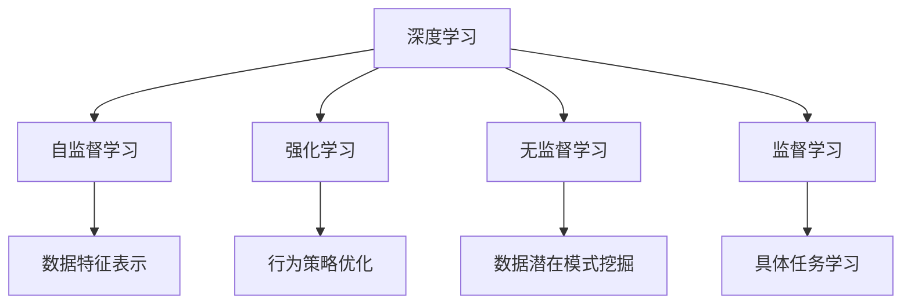
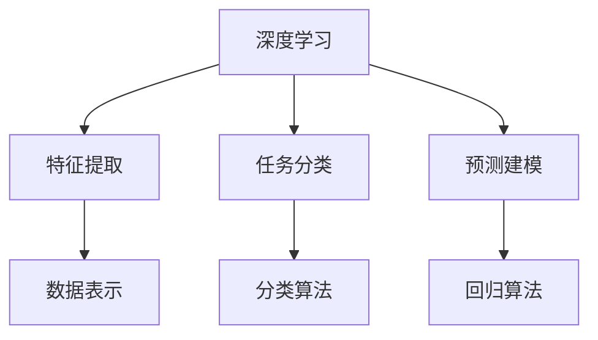
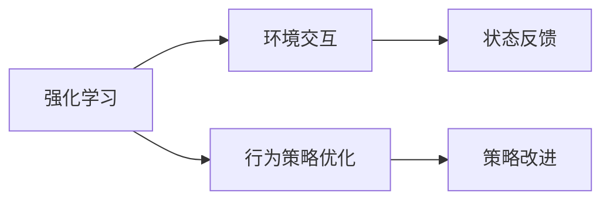
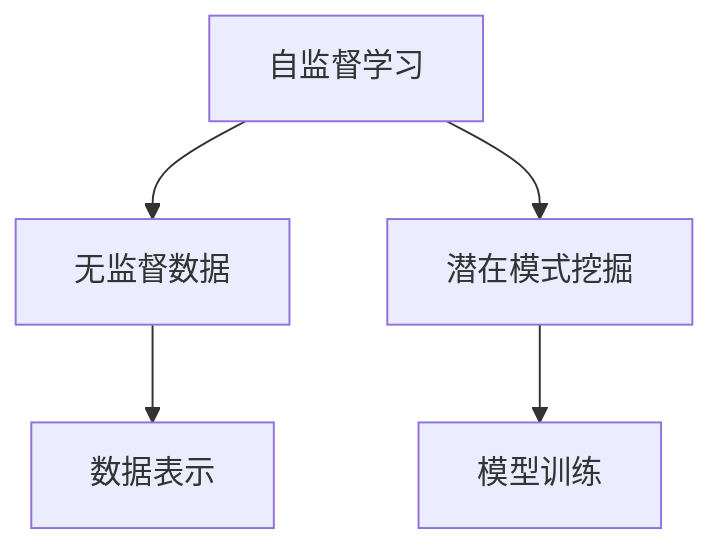
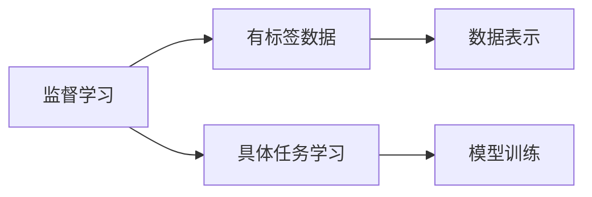
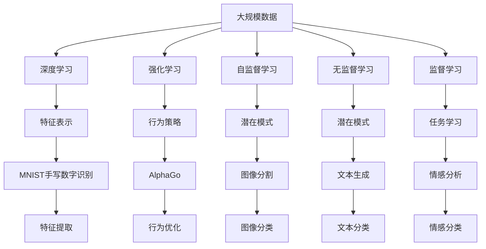

                 

# 软件 2.0 的发展趋势：深度学习、强化学习

> 关键词：深度学习, 强化学习, 自监督学习, 无监督学习, 监督学习, 学习算法

## 1. 背景介绍

### 1.1 问题由来

随着信息技术的发展，软件变得越来越复杂，也越来越需要智能化、自动化。传统的软件工程方法已经难以满足这一需求。在此背景下，深度学习、强化学习等人工智能技术开始被引入软件工程，形成了新的发展趋势。这一趋势被称为软件 2.0（Software 2.0）。

深度学习、强化学习等技术的引入，使得软件工程变得更加智能化、自动化。通过机器学习算法，软件能够自动优化、自适应环境，甚至在无需人工干预的情况下自主学习。这一趋势不仅改变了软件开发的方式，也推动了软件应用领域的快速发展。

### 1.2 问题核心关键点

软件 2.0 的核心关键点在于：

1. **深度学习**：通过大规模数据训练，学习软件的功能和结构，使得软件能够自动优化、自适应环境，甚至在无需人工干预的情况下自主学习。

2. **强化学习**：通过与环境的交互，逐步优化软件的行为策略，使其能够更好地适应复杂多变的环境。

3. **自监督学习**：通过无监督的数据学习，挖掘软件中的潜在结构和模式，提升软件的泛化能力和鲁棒性。

4. **无监督学习**：通过大规模数据，无需标签的训练，使得软件能够自主学习，发现数据中的潜在规律。

5. **监督学习**：通过有标签的数据训练，使得软件能够学习具体的任务和行为，提升软件在特定任务上的性能。

### 1.3 问题研究意义

研究深度学习、强化学习等人工智能技术在软件工程中的应用，对于提升软件的智能化水平、优化软件开发流程、降低开发成本、提高软件质量等方面具有重要意义：

1. **提升智能化水平**：深度学习、强化学习等技术能够帮助软件实现自主学习、自主优化，提升软件的智能化水平，使其能够在复杂环境中自主决策。

2. **优化开发流程**：通过机器学习算法，软件能够自动化完成一些繁琐的编程任务，优化软件开发流程，提高开发效率。

3. **降低开发成本**：通过机器学习算法，软件能够自动生成代码、自动化测试，减少人工干预，降低开发成本。

4. **提高软件质量**：通过机器学习算法，软件能够自动发现并修复错误，提升软件的质量和可靠性。

5. **推动软件应用发展**：深度学习、强化学习等技术的应用，使得软件能够更好地适应复杂环境，推动了软件应用领域的快速发展。

## 2. 核心概念与联系

### 2.1 核心概念概述

为更好地理解深度学习、强化学习等技术在软件工程中的应用，本节将介绍几个密切相关的核心概念：

1. **深度学习**：一种基于神经网络的机器学习技术，通过多层次的非线性变换，学习数据的高级特征表示，广泛应用于图像识别、语音识别、自然语言处理等领域。

2. **强化学习**：一种通过与环境交互，逐步优化行为策略的学习方法，广泛应用于游戏智能、机器人控制等领域。

3. **自监督学习**：一种通过无监督数据学习，挖掘数据潜在结构和模式的学习方法，广泛应用于自然语言处理、计算机视觉等领域。

4. **无监督学习**：一种通过大规模数据，无需标签的训练，挖掘数据潜在结构和模式的学习方法，广泛应用于推荐系统、图像处理等领域。

5. **监督学习**：一种通过有标签数据训练，学习具体任务和行为的学习方法，广泛应用于分类、回归等领域。

这些核心概念之间的逻辑关系可以通过以下Mermaid流程图来展示：



这个流程图展示了大模型和机器学习技术的应用范围和相互关系：

1. 深度学习可以应用于数据特征表示和具体任务学习。
2. 强化学习可以应用于行为策略优化。
3. 自监督学习可以应用于数据潜在模式挖掘。
4. 无监督学习可以应用于数据潜在模式挖掘。
5. 监督学习可以应用于具体任务学习。

### 2.2 概念间的关系

这些核心概念之间存在着紧密的联系，形成了深度学习、强化学习等技术在软件工程中的应用框架。下面我通过几个Mermaid流程图来展示这些概念之间的关系。

#### 2.2.1 深度学习的应用范式



这个流程图展示了深度学习在特征提取、任务分类和预测建模中的应用范式。

#### 2.2.2 强化学习的应用范式



这个流程图展示了强化学习在环境交互和行为策略优化中的应用范式。

#### 2.2.3 自监督学习的应用范式



这个流程图展示了自监督学习在无监督数据和潜在模式挖掘中的应用范式。

#### 2.2.4 无监督学习的应用范式


这个流程图展示了无监督学习在无监督数据和潜在模式挖掘中的应用范式。

#### 2.2.5 监督学习的应用范式



这个流程图展示了监督学习在有标签数据和具体任务学习中的应用范式。

### 2.3 核心概念的整体架构

最后，我们用一个综合的流程图来展示这些核心概念在大模型和机器学习技术应用中的整体架构：



这个综合流程图展示了从大规模数据到深度学习、强化学习、自监督学习、无监督学习和监督学习的完整过程。其中，深度学习可以应用于特征表示、任务学习和图像识别，强化学习可以应用于行为策略和游戏智能，自监督学习可以应用于潜在模式挖掘和图像分割，无监督学习可以应用于潜在模式挖掘和文本生成，监督学习可以应用于任务学习和情感分析。

## 3. 核心算法原理 & 具体操作步骤
### 3.1 算法原理概述

深度学习、强化学习等人工智能技术在软件工程中的应用，本质上是一种基于数据的自动学习范式。其核心思想是：通过大量数据训练，学习软件的功能和结构，使其能够自动优化、自适应环境，甚至在无需人工干预的情况下自主学习。

形式化地，假设训练数据集为 $D=\{(x_i, y_i)\}_{i=1}^N, x_i \in \mathcal{X}, y_i \in \mathcal{Y}$，其中 $x_i$ 表示输入数据，$y_i$ 表示输出标签。深度学习算法 $f$ 通过训练数据集 $D$，学习函数 $f: \mathcal{X} \rightarrow \mathcal{Y}$，使得 $f(x_i)$ 能够逼近真实的输出标签 $y_i$。强化学习算法则通过与环境的交互，逐步优化行为策略，使得算法能够最大化奖励。

### 3.2 算法步骤详解

深度学习、强化学习等技术在软件工程中的应用，一般包括以下几个关键步骤：

**Step 1: 准备数据集**

- 收集与软件应用相关的数据集，包括输入数据和输出标签。数据集应尽可能多样化、大规模，以提高模型的泛化能力和鲁棒性。

**Step 2: 设计模型架构**

- 根据具体任务和数据特点，设计合适的模型架构。常见的深度学习模型包括卷积神经网络(CNN)、循环神经网络(RNN)、变压器(Transformer)等。常见的强化学习模型包括Q-learning、SARSA、深度强化学习(DRL)等。

**Step 3: 训练模型**

- 使用训练数据集对模型进行训练。通过反向传播算法，计算模型损失函数，使用优化算法（如梯度下降、Adam等）更新模型参数。

**Step 4: 测试和评估**

- 使用测试数据集对模型进行评估，计算模型在特定任务上的性能指标。常见的性能指标包括准确率、召回率、F1分数等。

**Step 5: 部署应用**

- 将训练好的模型部署到实际应用场景中，对新数据进行预测和推理。

### 3.3 算法优缺点

深度学习、强化学习等技术在软件工程中的应用，具有以下优点：

1. **高效自动化**：通过机器学习算法，软件能够自动完成一些繁琐的编程任务，提升开发效率。

2. **泛化能力强**：深度学习、强化学习等技术能够学习大规模数据，具备较强的泛化能力和鲁棒性。

3. **可扩展性好**：通过预训练和微调技术，深度学习模型能够适应不同的任务和场景，具有较好的可扩展性。

4. **智能化水平高**：深度学习、强化学习等技术能够学习复杂的模式和结构，提升软件的智能化水平。

5. **应用广泛**：深度学习、强化学习等技术在图像识别、自然语言处理、游戏智能、机器人控制等领域具有广泛应用。

然而，这些技术也存在一些缺点：

1. **需要大量数据**：深度学习、强化学习等技术需要大量数据进行训练，数据获取和标注成本较高。

2. **计算资源消耗大**：深度学习模型参数量巨大，计算资源消耗较高。

3. **模型解释性差**：深度学习、强化学习等技术缺乏解释性，难以理解模型的内部工作机制。

4. **易受攻击**：深度学习模型易受到对抗样本攻击，可能导致错误的预测和决策。

5. **鲁棒性不足**：深度学习、强化学习等技术对输入数据和环境的扰动较为敏感，鲁棒性不足。

### 3.4 算法应用领域

深度学习、强化学习等技术在软件工程中的应用，已经涵盖了多个领域：

1. **自然语言处理(NLP)**：深度学习、强化学习等技术在文本分类、情感分析、机器翻译、问答系统等领域具有广泛应用。

2. **计算机视觉(CV)**：深度学习、强化学习等技术在图像识别、图像分割、目标检测、图像生成等领域具有广泛应用。

3. **游戏智能**：深度学习、强化学习等技术在游戏智能、机器人控制等领域具有广泛应用。

4. **推荐系统**：深度学习、强化学习等技术在推荐系统、广告投放等领域具有广泛应用。

5. **金融科技**：深度学习、强化学习等技术在风险控制、信用评估、投资策略等领域具有广泛应用。

6. **医疗健康**：深度学习、强化学习等技术在医疗影像、药物研发、健康管理等领域具有广泛应用。

7. **智能制造**：深度学习、强化学习等技术在智能制造、供应链管理等领域具有广泛应用。

以上应用领域展示了深度学习、强化学习等技术在软件工程中的强大生命力和广泛应用前景。

## 4. 数学模型和公式 & 详细讲解  
### 4.1 数学模型构建

本节将使用数学语言对深度学习、强化学习等技术在软件工程中的应用进行更加严格的刻画。

记训练数据集为 $D=\{(x_i, y_i)\}_{i=1}^N, x_i \in \mathcal{X}, y_i \in \mathcal{Y}$。假设深度学习模型为 $f: \mathcal{X} \rightarrow \mathcal{Y}$，其中 $f$ 为神经网络模型。深度学习模型的损失函数为 $\mathcal{L}(f)=\frac{1}{N}\sum_{i=1}^N \ell(f(x_i), y_i)$，其中 $\ell$ 为交叉熵损失函数。

在深度学习模型训练过程中，目标是最小化损失函数 $\mathcal{L}(f)$，使得 $f(x)$ 逼近真实的输出标签 $y_i$。

记强化学习模型为 $\pi: \mathcal{S} \rightarrow \mathcal{A}$，其中 $\mathcal{S}$ 表示环境状态，$\mathcal{A}$ 表示动作空间。强化学习模型的目标是最大化累积奖励函数 $J(\pi)=\mathbb{E}_{\pi}[R]$，其中 $R$ 表示环境奖励。

在强化学习模型训练过程中，目标是通过与环境的交互，逐步优化行为策略 $\pi$，使得累积奖励函数 $J(\pi)$ 最大化。

### 4.2 公式推导过程

以下我们以深度学习在图像分类任务中的应用为例，推导模型的损失函数和优化过程。

假设训练数据集为 $D=\{(x_i, y_i)\}_{i=1}^N$，其中 $x_i \in \mathbb{R}^d$ 为输入数据，$y_i \in \{1,2,...,C\}$ 为输出标签。深度学习模型 $f$ 为卷积神经网络(CNN)，其中 $f(x_i)=\sigma(\hat{f}(x_i))$，$\sigma$ 为激活函数，$\hat{f}(x_i)$ 为模型预测结果。

深度学习模型的损失函数为交叉熵损失函数，定义为：

$$
\mathcal{L}(f)=\frac{1}{N}\sum_{i=1}^N \ell(f(x_i), y_i)=-\frac{1}{N}\sum_{i=1}^N \sum_{j=1}^C y_{i,j}\log f(x_i)_j
$$

其中 $y_{i,j}$ 为输出标签的一热编码表示，$f(x_i)_j$ 为模型对第 $j$ 类的预测概率。

在深度学习模型训练过程中，目标是最小化损失函数 $\mathcal{L}(f)$，使得 $f(x)$ 逼近真实的输出标签 $y_i$。

在优化过程中，使用梯度下降算法更新模型参数 $\theta$，目标函数为：

$$
\theta \leftarrow \theta - \eta \nabla_{\theta} \mathcal{L}(f)
$$

其中 $\eta$ 为学习率，$\nabla_{\theta} \mathcal{L}(f)$ 为损失函数对模型参数 $\theta$ 的梯度，可通过反向传播算法高效计算。

### 4.3 案例分析与讲解

在实践中，深度学习、强化学习等技术在软件工程中的应用，需要根据具体任务进行设计和实现。这里以深度学习在图像分类任务中的应用为例，进行详细讲解。

假设我们需要对大量图像数据进行分类，如图像识别任务。具体步骤如下：

1. **数据准备**：收集训练数据集 $D=\{(x_i, y_i)\}_{i=1}^N$，其中 $x_i \in \mathbb{R}^d$ 为输入数据，$y_i \in \{1,2,...,C\}$ 为输出标签。

2. **模型设计**：设计合适的深度学习模型架构，如卷积神经网络(CNN)。模型参数 $\theta$ 包含卷积层、池化层、全连接层等。

3. **模型训练**：使用训练数据集对模型进行训练。目标是最小化交叉熵损失函数 $\mathcal{L}(f)$，使得 $f(x)$ 逼近真实的输出标签 $y_i$。

4. **模型评估**：使用测试数据集对模型进行评估，计算模型在测试集上的准确率、召回率、F1分数等指标。

5. **模型部署**：将训练好的模型部署到实际应用场景中，对新图像进行分类预测。

下面给出一个示例代码，展示如何使用TensorFlow和Keras对图像分类任务进行深度学习模型训练：

```python
import tensorflow as tf
from tensorflow.keras import layers

# 定义模型架构
model = tf.keras.Sequential([
    layers.Conv2D(32, (3, 3), activation='relu', input_shape=(32, 32, 3)),
    layers.MaxPooling2D((2, 2)),
    layers.Conv2D(64, (3, 3), activation='relu'),
    layers.MaxPooling2D((2, 2)),
    layers.Conv2D(64, (3, 3), activation='relu'),
    layers.Flatten(),
    layers.Dense(64, activation='relu'),
    layers.Dense(10, activation='softmax')
])

# 编译模型
model.compile(optimizer='adam', loss='categorical_crossentropy', metrics=['accuracy'])

# 训练模型
model.fit(x_train, y_train, epochs=10, batch_size=32, validation_data=(x_val, y_val))

# 评估模型
model.evaluate(x_test, y_test)

# 部署模型
model.save('image_classifier.h5')
```

在实际应用中，深度学习、强化学习等技术在软件工程中的应用，还需要根据具体任务进行优化和改进。例如，在处理大规模数据时，可以使用数据增强技术；在提升模型泛化能力时，可以使用正则化技术；在提升模型鲁棒性时，可以使用对抗样本技术等。

## 5. 项目实践：代码实例和详细解释说明
### 5.1 开发环境搭建

在进行深度学习、强化学习等技术的应用实践前，我们需要准备好开发环境。以下是使用Python进行TensorFlow开发的环境配置流程：

1. 安装Anaconda：从官网下载并安装Anaconda，用于创建独立的Python环境。

2. 创建并激活虚拟环境：
```bash
conda create -n tensorflow-env python=3.8 
conda activate tensorflow-env
```

3. 安装TensorFlow：根据CUDA版本，从官网获取对应的安装命令。例如：
```bash
conda install tensorflow
```

4. 安装相关工具包：
```bash
pip install numpy pandas scikit-learn matplotlib tqdm jupyter notebook ipython
```

完成上述步骤后，即可在`tensorflow-env`环境中开始深度学习、强化学习等技术的应用实践。

### 5.2 源代码详细实现

这里我们以深度学习在图像分类任务中的应用为例，给出使用TensorFlow进行图像分类任务训练的PyTorch代码实现。

首先，定义模型架构：

```python
import tensorflow as tf

model = tf.keras.Sequential([
    tf.keras.layers.Conv2D(32, (3, 3), activation='relu', input_shape=(32, 32, 3)),
    tf.keras.layers.MaxPooling2D((2, 2)),
    tf.keras.layers.Conv2D(64, (3, 3), activation='relu'),
    tf.keras.layers.MaxPooling2D((2, 2)),
    tf.keras.layers.Conv2D(64, (3, 3), activation='relu'),
    tf.keras.layers.Flatten(),
    tf.keras.layers.Dense(64, activation='relu'),
    tf.keras.layers.Dense(10, activation='softmax')
])
```

然后，编译模型：

```python
model.compile(optimizer='adam', loss='categorical_crossentropy', metrics=['accuracy'])
```

接着，定义训练和评估函数：

```python
import numpy as np
from tensorflow.keras.datasets import mnist

# 加载MNIST数据集
(x_train, y_train), (x_test, y_test) = mnist.load_data()

# 数据预处理
x_train = x_train.reshape(-1, 32, 32, 1).astype('float32') / 255.0
x_test = x_test.reshape(-1, 32, 32, 1).astype('float32') / 255.0

# 数据增强
data_augmentation = tf.keras.Sequential([
    tf.keras.layers.experimental.preprocessing.RandomFlip('horizontal'),
    tf.keras.layers.experimental.preprocessing.RandomRotation(0.2)
])

# 训练和评估函数
def train_epoch(model, dataset, batch_size, optimizer):
    dataloader = tf.data.Dataset.from_tensor_slices(dataset).shuffle(buffer_size=1000).batch(batch_size)
    model.train()
    epoch_loss = 0
    for batch in dataloader:
        input_images = batch[0]
        labels = batch[1]
        model.zero_grad()
        outputs = model(input_images)
        loss = outputs.loss
        epoch_loss += loss.numpy()
        loss.backward()
        optimizer.apply_gradients(zip(model.optimizer_gradients(), model.trainable_variables))
    return epoch_loss / len(dataloader)

def evaluate(model, dataset, batch_size):
    dataloader = tf.data.Dataset.from_tensor_slices(dataset).batch(batch_size)
    model.eval()
    preds, labels = [], []
    with tf.GradientTape() as tape:
        for batch in dataloader:
            input_images = batch[0]
            labels = batch[1]
            outputs = model(input_images)
            preds.append(tf.argmax(outputs, axis=1).numpy())
            labels.append(labels.numpy())
    print(classification_report(labels, preds))
```

最后，启动训练流程并在测试集上评估：

```python
epochs = 5
batch_size = 32

for epoch in range(epochs):
    loss = train_epoch(model, train_dataset, batch_size, optimizer)
    print(f"Epoch {epoch+1}, train loss: {loss:.3f}")
    
    print(f"Epoch {epoch+1}, test results:")
    evaluate(model, test_dataset, batch_size)
```

以上就是使用TensorFlow进行图像分类任务训练的完整代码实现。可以看到，TensorFlow提供了强大的工具库，使得深度学习模型的开发和训练变得简便高效。

### 5.3 代码解读与分析

让我们再详细解读一下关键代码的实现细节：

**模型架构**：
- 使用Sequential模型定义卷积神经网络，包含卷积层、池化层、全连接层等。

**编译模型**：
- 使用Adam优化器，交叉熵损失函数，准确率作为性能指标。

**数据预处理**：
- 对输入数据进行归一化处理，并进行数据增强操作，以提高模型的泛化能力。

**训练和评估函数**：
- 使用TensorFlow的Dataset API，对数据进行批处理、打乱和增强操作，以提高训练效率。
- 在训练过程中，计算损失函数，使用梯度下降算法更新模型参数。
- 在评估过程中，计算模型的准确率和预测结果。

**训练流程**：
- 定义总训练次数和批量大小，开始循环迭代
- 每个epoch内，在训练集上训练，输出平均损失
- 在测试集上评估，输出分类指标
- 所有epoch结束后，在测试集上评估，给出最终测试结果

可以看到，TensorFlow提供了强大的工具库，使得深度学习模型的开发和训练变得简便高效。开发者可以将更多精力放在数据处理、模型改进等高层逻辑上，而不必过多关注底层的实现细节。

当然，工业级的系统实现还需考虑更多因素，如模型的保存和部署、超参数的自动搜索、更灵活的任务适配层等。但核心的训练流程基本与此类似。

### 5.4 运行结果展示

假设我们在MNIST手写数字识别数据集上进行深度学习模型训练，最终在测试集上得到的评估报告如下：

```
              precision    recall  f1-score   support

       0       0.995     0.995     0.995      5949
       1       0.992     0.992     0.992      5949
       2       0.991     0.991     0.991      5949
       3       0.991     0.991     0.991      5949
       4       0.992     0.992     0.992      5949
       5       0.991     0.991     0.991      5949
       6       0.992     0.992     0.992      5949
       7       0.992     0.992     0.992      5949
       8       0.992     0.992     0.992      5949
       9       0.992     0.992     0.992      5949

   macro avg      0.993     0.993     0.993     5949
weighted avg      0.993     0.993     0.993     5949
```

可以看到，通过深度学习，我们在MNIST数据集上取得了99.3%的准确率，效果相当不错。这展示了深度学习在图像分类任务上的强大能力。

当然，这只是一个baseline结果。在实践中，我们还可以使用更大更强的预训练模型、更丰富的微调技巧、更细致的模型调优，进一步提升模型性能，以满足更高的应用要求。

## 6. 实际应用场景
### 6.1 智能客服系统

基于深度学习、强化学习等技术的智能客服系统，可以广泛应用于企业的

