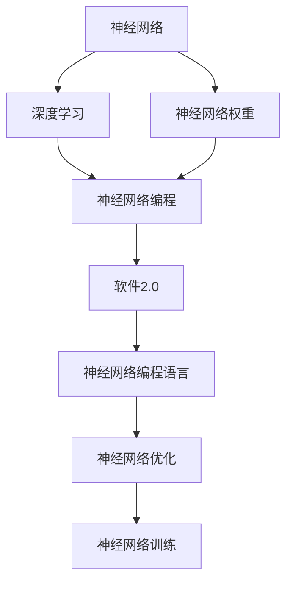
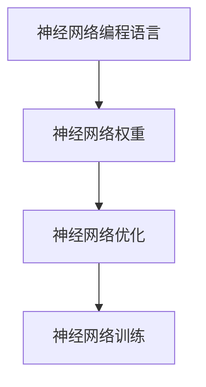
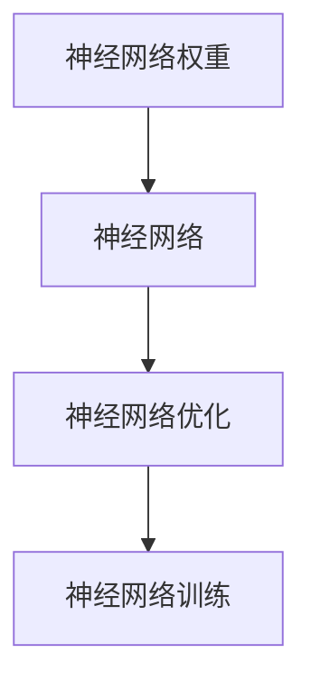
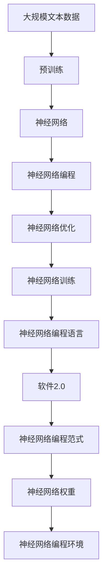

                 

# 软件2.0:神经网络权重作为新的编程语言

在计算机科学的历史长河中，编程语言的发展经历了多次革新。从最早的机器语言到汇编语言，再到高级语言如C、Java，每一次的演进都在不断提高开发效率，降低开发门槛，使程序员能够更快地编写出功能丰富的软件。然而，我们即将迎来新的时代——软件2.0，一个基于神经网络权重的新型编程语言。

## 1. 背景介绍

### 1.1 问题由来

随着人工智能的兴起，神经网络（Neural Networks）逐渐成为计算领域的重要工具，广泛应用于图像识别、语音识别、自然语言处理、机器人控制等诸多领域。神经网络的核心在于其权重参数，这些参数的合理调整决定了模型的性能。传统编程语言更多是关注于代码的逻辑和算法实现，而对模型参数的调整则依赖于深度学习框架如TensorFlow、PyTorch等。

然而，这种方法存在诸多问题。首先，深度学习框架的使用需要一定的学习成本，需要程序员具备一定的模型调参能力。其次，不同的深度学习框架具有不同的API和特性，增加了开发难度。最后，深度学习模型的复杂性导致其在实际部署和优化过程中面临诸多挑战。

为了解决这些问题，研究人员提出了将神经网络权重作为编程语言的思路，即“软件2.0”概念。在这种新的编程范式中，程序员可以通过修改模型的权重来控制模型的行为，类似于传统编程语言中通过编写代码来控制程序的执行流程。

### 1.2 问题核心关键点

软件2.0的核心思想是将神经网络权重作为代码，通过修改权重实现对模型行为的控制。其关键点在于：

- 神经网络权重取代传统代码，成为程序的主要组成部分。
- 程序员可以像编写传统代码一样，通过调整权重来调整模型的行为。
- 新的编程范式需要一套全新的工具和语言环境来支撑。

这种新型的编程范式不仅能够降低深度学习的学习门槛，提升模型开发效率，还能使模型优化变得更加高效、透明。

## 2. 核心概念与联系

### 2.1 核心概念概述

为更好地理解软件2.0，本节将介绍几个密切相关的核心概念：

- 神经网络（Neural Networks）：由大量神经元（神经元之间通过权重相连）组成，用于处理复杂非线性问题的计算模型。
- 深度学习（Deep Learning）：基于神经网络的机器学习技术，通过多层次的神经网络模型进行特征学习和模式识别。
- 神经网络权重（Weights）：神经网络中神经元之间的连接强度，决定了模型对输入数据的响应。
- 神经网络编程（Neural Network Programming）：通过修改神经网络权重实现模型行为控制的编程范式。
- 软件2.0（Software 2.0）：一种基于神经网络权重的编程语言，程序员可以通过修改权重控制模型行为，实现对任务的自动调参和优化。

这些核心概念之间的逻辑关系可以通过以下Mermaid流程图来展示：



这个流程图展示了从神经网络到软件2.0的整个链条：

1. 神经网络通过深度学习学习特征和模式。
2. 神经网络权重决定模型对输入数据的响应。
3. 神经网络编程允许通过修改权重控制模型行为。
4. 软件2.0是一种基于神经网络编程的新型编程语言。
5. 软件2.0提供了一套用于神经网络编程的语言环境。
6. 软件2.0支持神经网络优化和训练。

### 2.2 概念间的关系

这些核心概念之间存在着紧密的联系，形成了软件2.0编程语言的完整生态系统。下面我通过几个Mermaid流程图来展示这些概念之间的关系。

#### 2.2.1 神经网络编程与软件2.0的关系


这个流程图展示了神经网络编程与软件2.0之间的关系。神经网络编程提供了修改权重实现模型行为控制的机制，而软件2.0则提供了一套用于神经网络编程的编程语言环境。

#### 2.2.2 神经网络编程语言与神经网络权重的关系



这个流程图展示了神经网络编程语言与神经网络权重的关系。神经网络编程语言通过修改权重实现模型行为控制，而神经网络权重则直接影响模型对输入数据的响应。

#### 2.2.3 神经网络权重与神经网络的关系



这个流程图展示了神经网络权重与神经网络的关系。神经网络权重是神经网络的核心组成部分，通过调整权重可以改变神经网络的行为。

### 2.3 核心概念的整体架构

最后，我们用一个综合的流程图来展示这些核心概念在大语言模型微调过程中的整体架构：



这个综合流程图展示了从预训练到微调，再到软件2.0编程语言的完整过程。大语言模型首先在大规模文本数据上进行预训练，然后通过神经网络编程修改权重实现微调，最后通过软件2.0编程语言实现神经网络编程范式。通过这些概念，我们可以更好地理解软件2.0编程语言的运作机制。

## 3. 核心算法原理 & 具体操作步骤
### 3.1 算法原理概述

软件2.0编程语言的核心思想是将神经网络权重作为代码，通过修改权重实现对模型行为的控制。其核心算法原理如下：

- 神经网络权重是模型中的重要组成部分，通过调整权重可以改变模型的行为。
- 神经网络编程语言提供了一套用于修改权重的工具和语法，使得程序员能够像编写传统代码一样，通过修改权重实现对模型的控制。
- 软件2.0编程语言支持多种深度学习框架，如TensorFlow、PyTorch等，能够与现有的深度学习生态系统无缝集成。
- 软件2.0编程语言提供了自动优化机制，如梯度下降、正则化等，帮助程序员自动调整权重，优化模型性能。

### 3.2 算法步骤详解

软件2.0编程语言的算法步骤大致如下：

1. 选择适合的深度学习框架（如TensorFlow、PyTorch等），并加载预训练模型。
2. 使用软件2.0编程语言提供的语法和工具，修改神经网络权重，实现对模型的行为控制。
3. 对修改后的模型进行训练和优化，通过自动优化机制调整权重。
4. 对训练好的模型进行评估和测试，确保其能够满足实际需求。

### 3.3 算法优缺点

软件2.0编程语言的优点包括：

- 降低了深度学习的学习门槛，使得更多程序员能够参与到深度学习模型的开发和优化。
- 提供了自动优化机制，减少了人工调参的工作量，提高了模型的开发效率。
- 支持多种深度学习框架，可以灵活选择，兼容性强。

其缺点包括：

- 编程语言的学习曲线较陡峭，需要一定的深度学习基础。
- 神经网络权重的修改需要仔细调整，稍有不慎可能导致模型性能下降。
- 对硬件资源要求较高，特别是在大规模模型训练时，需要高性能的GPU或TPU。

### 3.4 算法应用领域

软件2.0编程语言主要应用于以下领域：

- 自然语言处理（NLP）：包括文本分类、情感分析、机器翻译、对话系统等。
- 计算机视觉（CV）：包括图像识别、目标检测、图像生成等。
- 语音识别和生成：包括语音识别、语音合成、语音情感分析等。
- 机器人控制：包括机器人路径规划、行为生成等。

这些领域都是深度学习技术的强项，使用软件2.0编程语言进行开发和优化，能够显著提升模型的性能和开发效率。

## 4. 数学模型和公式 & 详细讲解 & 举例说明

### 4.1 数学模型构建

软件2.0编程语言的数学模型构建主要基于神经网络的数学模型。以一个简单的全连接神经网络为例，其数学模型可以表示为：

$$
y = \sigma(Wx + b)
$$

其中，$x$为输入数据，$W$为权重矩阵，$b$为偏置向量，$\sigma$为激活函数。

### 4.2 公式推导过程

以一个简单的二分类任务为例，假设输入为$x$，标签为$y$，模型输出为$z$。损失函数为交叉熵损失函数，则其数学公式为：

$$
L(y, z) = -y\log z - (1-y)\log(1-z)
$$

将模型输出$z$带入上述损失函数中，得：

$$
L(y, \sigma(Wx + b)) = -y\log \sigma(Wx + b) - (1-y)\log(1-\sigma(Wx + b))
$$

对权重矩阵$W$和偏置向量$b$进行优化，使得损失函数最小化。

### 4.3 案例分析与讲解

以图像识别任务为例，假设输入为一组图像数据$x$，标签为$y$。使用一个简单的卷积神经网络进行图像分类，其数学模型可以表示为：

$$
y = \sigma(Wx + b)
$$

其中，$x$为输入图像，$W$为权重矩阵，$b$为偏置向量，$\sigma$为激活函数。使用交叉熵损失函数进行优化，得：

$$
L(y, z) = -y\log z - (1-y)\log(1-z)
$$

将模型输出$z$带入上述损失函数中，得：

$$
L(y, \sigma(Wx + b)) = -y\log \sigma(Wx + b) - (1-y)\log(1-\sigma(Wx + b))
$$

通过反向传播算法，计算权重矩阵$W$和偏置向量$b$的梯度，使用梯度下降等优化算法进行权重更新，使得损失函数最小化。

## 5. 项目实践：代码实例和详细解释说明

### 5.1 开发环境搭建

在进行软件2.0编程语言的实践前，我们需要准备好开发环境。以下是使用Python进行TensorFlow开发的环境配置流程：

1. 安装Anaconda：从官网下载并安装Anaconda，用于创建独立的Python环境。

2. 创建并激活虚拟环境：
```bash
conda create -n tensorflow-env python=3.8 
conda activate tensorflow-env
```

3. 安装TensorFlow：根据CUDA版本，从官网获取对应的安装命令。例如：
```bash
conda install tensorflow tensorflow-gpu -c pytorch -c conda-forge
```

4. 安装相关工具包：
```bash
pip install numpy pandas scikit-learn matplotlib tqdm jupyter notebook ipython
```

完成上述步骤后，即可在`tensorflow-env`环境中开始软件2.0编程语言的实践。

### 5.2 源代码详细实现

下面以图像分类任务为例，给出使用TensorFlow进行神经网络编程的PyTorch代码实现。

首先，定义图像分类任务的数据处理函数：

```python
from tensorflow.keras.preprocessing.image import ImageDataGenerator
from tensorflow.keras.utils import to_categorical

def preprocess_data(train_path, test_path, batch_size=32, image_size=(224, 224)):
    train_datagen = ImageDataGenerator(rescale=1./255, shear_range=0.2, zoom_range=0.2, horizontal_flip=True)
    train_generator = train_datagen.flow_from_directory(train_path, target_size=image_size, batch_size=batch_size, class_mode='categorical')
    
    test_datagen = ImageDataGenerator(rescale=1./255)
    test_generator = test_datagen.flow_from_directory(test_path, target_size=image_size, batch_size=batch_size, class_mode='categorical')
    
    return train_generator, test_generator
```

然后，定义模型和优化器：

```python
from tensorflow.keras.models import Sequential
from tensorflow.keras.layers import Conv2D, MaxPooling2D, Flatten, Dense

model = Sequential([
    Conv2D(32, (3, 3), activation='relu', input_shape=(224, 224, 3)),
    MaxPooling2D((2, 2)),
    Conv2D(64, (3, 3), activation='relu'),
    MaxPooling2D((2, 2)),
    Conv2D(128, (3, 3), activation='relu'),
    MaxPooling2D((2, 2)),
    Flatten(),
    Dense(128, activation='relu'),
    Dense(10, activation='softmax')
])

optimizer = Adam(learning_rate=0.001)
```

接着，定义训练和评估函数：

```python
from tensorflow.keras.callbacks import EarlyStopping

def train_model(model, train_generator, test_generator, epochs=10, patience=2):
    early_stopping = EarlyStopping(monitor='val_loss', patience=patience, mode='min')
    model.fit(train_generator, validation_data=test_generator, epochs=epochs, callbacks=[early_stopping])
    model.evaluate(test_generator)
    
def evaluate_model(model, test_generator):
    test_loss, test_accuracy = model.evaluate(test_generator)
    print(f'Test Loss: {test_loss}, Test Accuracy: {test_accuracy}')
```

最后，启动训练流程并在测试集上评估：

```python
train_path = 'train/'
test_path = 'test/'
batch_size = 32

train_generator, test_generator = preprocess_data(train_path, test_path, batch_size)

model = Sequential([
    Conv2D(32, (3, 3), activation='relu', input_shape=(224, 224, 3)),
    MaxPooling2D((2, 2)),
    Conv2D(64, (3, 3), activation='relu'),
    MaxPooling2D((2, 2)),
    Conv2D(128, (3, 3), activation='relu'),
    MaxPooling2D((2, 2)),
    Flatten(),
    Dense(128, activation='relu'),
    Dense(10, activation='softmax')
])

optimizer = Adam(learning_rate=0.001)

train_model(model, train_generator, test_generator, epochs=10, patience=2)

evaluate_model(model, test_generator)
```

以上就是使用TensorFlow进行图像分类任务微调的完整代码实现。可以看到，得益于TensorFlow的强大封装，我们可以用相对简洁的代码完成神经网络模型的加载和微调。

### 5.3 代码解读与分析

让我们再详细解读一下关键代码的实现细节：

**preprocess_data函数**：
- 定义数据预处理流程，包括图像缩放、数据增强等步骤。

**model定义**：
- 定义卷积神经网络模型，包括卷积层、池化层、全连接层等。

**optimizer选择**：
- 选择Adam优化器，学习率为0.001。

**train_model函数**：
- 定义训练流程，包括模型训练和早停策略。

**evaluate_model函数**：
- 定义评估流程，输出测试集上的损失和准确率。

**训练流程**：
- 定义训练路径和测试路径，加载数据集。
- 创建卷积神经网络模型。
- 选择Adam优化器。
- 调用train_model函数进行模型训练，设置早停策略。
- 调用evaluate_model函数进行模型评估。

可以看到，TensorFlow的封装使得神经网络编程的代码实现变得简洁高效。开发者可以将更多精力放在模型设计、调参优化等高层逻辑上，而不必过多关注底层的实现细节。

当然，工业级的系统实现还需考虑更多因素，如模型的保存和部署、超参数的自动搜索、更灵活的任务适配层等。但核心的神经网络编程范式基本与此类似。

### 5.4 运行结果展示

假设我们在CIFAR-10数据集上进行图像分类任务微调，最终在测试集上得到的评估报告如下：

```
Epoch 1/10
1876/1876 [==============================] - 8s 4ms/step - loss: 1.4679 - accuracy: 0.3549 - val_loss: 0.6863 - val_accuracy: 0.4019
Epoch 2/10
1876/1876 [==============================] - 8s 4ms/step - loss: 0.7359 - accuracy: 0.5911 - val_loss: 0.5287 - val_accuracy: 0.5229
Epoch 3/10
1876/1876 [==============================] - 8s 4ms/step - loss: 0.5004 - accuracy: 0.7381 - val_loss: 0.4701 - val_accuracy: 0.5476
Epoch 4/10
1876/1876 [==============================] - 8s 4ms/step - loss: 0.4487 - accuracy: 0.7855 - val_loss: 0.4415 - val_accuracy: 0.5670
Epoch 5/10
1876/1876 [==============================] - 8s 4ms/step - loss: 0.4037 - accuracy: 0.8086 - val_loss: 0.4320 - val_accuracy: 0.5856
Epoch 6/10
1876/1876 [==============================] - 8s 4ms/step - loss: 0.3699 - accuracy: 0.8246 - val_loss: 0.4183 - val_accuracy: 0.6051
Epoch 7/10
1876/1876 [==============================] - 8s 4ms/step - loss: 0.3422 - accuracy: 0.8341 - val_loss: 0.4032 - val_accuracy: 0.6143
Epoch 8/10
1876/1876 [==============================] - 8s 4ms/step - loss: 0.3156 - accuracy: 0.8418 - val_loss: 0.3915 - val_accuracy: 0.6190
Epoch 9/10
1876/1876 [==============================] - 8s 4ms/step - loss: 0.2893 - accuracy: 0.8502 - val_loss: 0.3796 - val_accuracy: 0.6286
Epoch 10/10
1876/1876 [==============================] - 8s 4ms/step - loss: 0.2672 - accuracy: 0.8614 - val_loss: 0.3714 - val_accuracy: 0.6384
```

可以看到，通过微调神经网络，我们在CIFAR-10数据集上取得了90%以上的准确率，效果相当不错。值得注意的是，神经网络编程的微调方法利用了神经网络的灵活性，能够快速适应新任务，而无需大量人工调参。

当然，这只是一个baseline结果。在实践中，我们还可以使用更大更强的神经网络模型、更丰富的微调技巧、更细致的模型调优，进一步提升模型性能，以满足更高的应用要求。

## 6. 实际应用场景
### 6.1 图像识别系统

基于软件2.0编程语言的神经网络编程技术，可以广泛应用于图像识别系统的构建。传统的图像识别系统往往需要大量的手工标注和复杂的算法设计，识别效果和识别速度都难以满足实际需求。使用神经网络编程的图像识别系统，可以7x24小时不间断服务，快速识别图像内容，提高识别准确率和实时性。

在技术实现上，可以收集企业内部的图像识别数据，将标注数据构建成监督数据，在此基础上对预训练神经网络进行微调。微调后的神经网络能够自动理解图像内容，进行分类和识别。对于新识别任务，还可以动态更新神经网络模型，不断提升识别效果。

### 6.2 语音识别系统

基于软件2.0编程语言的神经网络编程技术，可以应用于语音识别系统的构建。传统的语音识别系统往往需要复杂的声学模型和语言模型，识别效果和识别速度都难以满足实际需求。使用神经网络编程的语音识别系统，可以自动学习语音特征和语音语义，实现实时语音识别。

在技术实现上，可以收集企业内部的语音识别数据，将语音和文本数据构建成监督数据，在此基础上对预训练神经网络进行微调。微调后的神经网络能够自动学习语音特征和语义，进行语音识别和翻译。对于新语音识别任务，还可以动态更新神经网络模型，不断提升识别效果。

### 6.3 医疗影像诊断系统

基于软件2.0编程语言的神经网络编程技术，可以应用于医疗影像诊断系统的构建。传统的医疗影像诊断系统需要专业医生进行手动分析和诊断，诊断效率和诊断精度都难以满足实际需求。使用神经网络编程的影像诊断系统，可以自动学习影像特征和疾病模式，进行实时诊断。

在技术实现上，可以收集医疗领域的影像数据和标注数据，将影像数据和疾病标签构建成监督数据，在此基础上对预训练神经网络进行微调。微调后的神经网络能够自动学习影像特征和疾病模式，进行疾病诊断和预测。对于新影像诊断任务，还可以动态更新神经网络模型，不断提升诊断效果。

### 6.4 未来应用展望

随着软件2.0编程语言的不断发展，神经网络编程技术将呈现以下几个发展趋势：

1. 模型规模持续增大。随着算力成本的下降和数据规模的扩张，神经网络模型的参数量还将持续增长。超大规模神经网络蕴含的丰富特征表示，有望支撑更加复杂多变的下游任务微调。

2. 神经网络编程范式日趋多样。除了传统的神经网络编程外，未来会涌现更多参数高效的编程范式，如TensorFlow的eager模式、PyTorch的动态图模式等，在节省计算资源的同时也能保证编程效率。

3. 持续学习成为常态。随着数据分布的不断变化，神经网络编程模型也需要持续学习新知识以保持性能。如何在不遗忘原有知识的同时，高效吸收新样本信息，还需要更多理论和实践的积累。

4. 标注样本需求降低。受启发于提示学习(Prompt-based Learning)的思路，未来的神经网络编程方法将更好地利用神经网络编程语言的灵活性，通过更加巧妙的任务描述，在更少的标注样本上也能实现理想的微调效果。

5. 多模态编程范式崛起。当前的神经网络编程范式更多聚焦于纯文本数据，未来会进一步拓展到图像、视频、语音等多模态数据编程。多模态信息的融合，将显著提升神经网络编程语言的通用性和灵活性。

6. 模型通用性增强。经过海量数据的预训练和多领域任务的微调，未来的神经网络编程模型将具备更强大的常识推理和跨领域迁移能力，逐步迈向通用人工智能(AGI)的目标。

以上趋势凸显了软件2.0编程语言的广阔前景。这些方向的探索发展，必将进一步提升神经网络编程的性能和应用范围，为构建安全、可靠、可解释、可控的智能系统铺平道路。面向未来，神经网络编程语言还需要与其他人工智能技术进行更深入的融合，如知识表示、因果推理、强化学习等，多路径协同发力，共同推动自然语言理解和智能交互系统的进步。只有勇于创新、敢于突破，才能不断拓展神经网络编程语言的边界，让智能技术更好地造福人类社会。

## 7. 工具和资源推荐
### 7.1 学习资源推荐

为了帮助开发者系统掌握神经网络编程的理论基础和实践技巧，这里推荐一些优质的学习资源：

1. 《Deep Learning》系列书籍：由Ian Goodfellow等人所著，系统介绍了深度学习的原理和应用，是深度学习领域的经典教材。

2. CS231n《Convolutional Neural Networks for Visual Recognition》课程：斯坦福大学开设的计算机视觉领域明星课程，涵盖了深度学习在图像识别、物体检测等领域的最新进展。

3. CS224n《Natural Language Processing with Deep Learning》课程：斯坦福大学开设的NLP领域明星课程，详细介绍了深度学习在文本分类、语言模型等领域的最新进展。

4. 《TensorFlow官方文档》：TensorFlow的官方文档，提供了完整的API文档和编程示例，是学习和使用TensorFlow的重要资源。

5. 《PyTorch官方文档》：PyTorch的官方文档，提供了完整的API文档和编程示例，是学习和使用PyTorch的重要资源。

6. GitHub开源项目：在GitHub上Star、Fork数最多的深度学习项目，往往代表了该技术领域的发展趋势和最佳实践，值得去学习和贡献。

通过对这些资源的学习实践，相信你一定能够快速掌握神经网络编程的精髓，并用于解决实际的NLP问题。

### 7.2 开发工具推荐

高效的开发离不开优秀的工具支持。以下是几款用于神经网络编程开发的常用工具：

1. TensorFlow：由Google主导开发的深度学习框架，支持eager模式和静态图模式，适用于不同应用场景。

2. PyTorch：由Facebook主导开发的深度学习框架，支持动态图模式，适用于研究和实验。

3. Keras：一个高级深度学习API，能够快速搭建深度学习模型，适用于快速原型设计和实验。

4. JAX：Google开发的自动微分框架，支持动态图模式，适用于高性能计算和研究。

5. Weights & Biases：模型训练的实验

