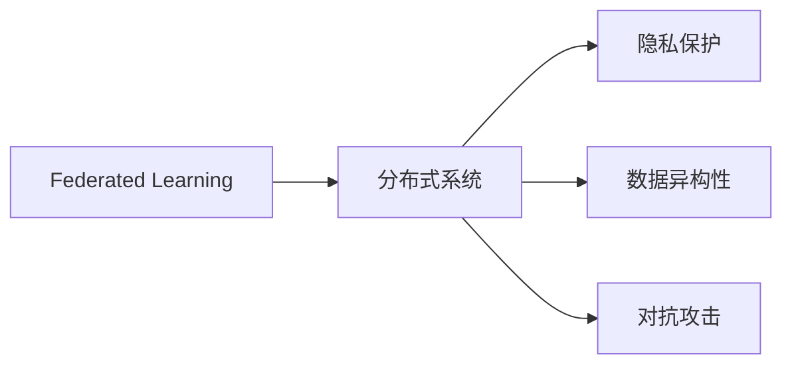
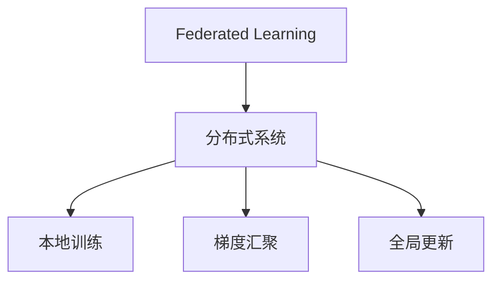
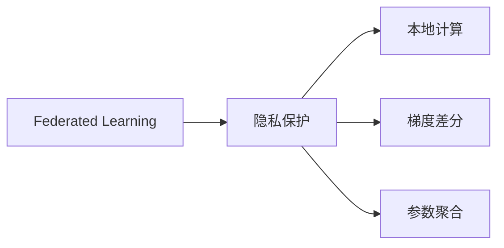
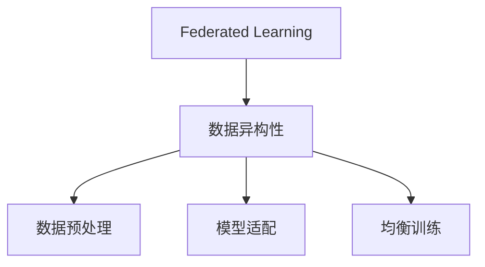
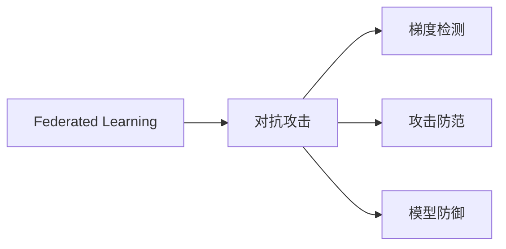
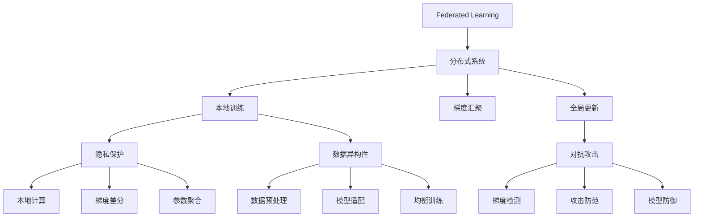

                 

# 软件2.0中的联邦学习应用

> 关键词：联邦学习,软件2.0,分布式计算,隐私保护,协作学习

## 1. 背景介绍

### 1.1 问题由来
随着互联网技术的发展，数据资源的积累和分布变得日益分散。如何在确保数据隐私和安全的前提下，充分利用分布式数据资源进行协同学习，成为了一个迫切需要解决的问题。在这个背景下，联邦学习（Federated Learning）应运而生。

联邦学习是一种分布式机器学习范式，其核心思想是在不共享原始数据的情况下，通过各节点本地训练的模型参数进行协同更新，以提升模型整体性能。这种方法特别适用于数据量大、分布式且隐私敏感的行业场景，如金融、医疗、政府数据等。

在软件2.0时代，联邦学习的应用场景进一步扩展，包括但不限于个性化推荐、数据治理、广告投放、智能制造等多个领域。

### 1.2 问题核心关键点
联邦学习的应用场景非常广泛，但核心问题可以概括为以下几点：
1. 数据分布：如何处理数据分布不均衡的情况，确保每个节点参与学习的机会相同。
2. 通信开销：如何在最小化通信开销的前提下，高效地更新模型参数。
3. 隐私保护：如何在不泄露本地数据的情况下，确保模型的收敛性。
4. 一致性：如何保证各节点更新的模型参数一致，避免偏差。
5. 可扩展性：如何在不降低模型性能的情况下，扩展联邦学习系统的规模。

### 1.3 问题研究意义
联邦学习的兴起为大数据时代的数据协同处理提供了新的解决方案，尤其是在隐私保护和数据分布式处理方面具有显著优势。其研究意义主要体现在以下几个方面：

1. 隐私保护：联邦学习通过在本地进行模型训练，保护了用户隐私，避免了数据泄露风险。
2. 数据利用：联邦学习使分散的数据资源得以整合利用，提升了整体数据利用率。
3. 系统健壮性：联邦学习通过分布式协同学习，提升了系统的鲁棒性和可靠性。
4. 模型性能：联邦学习在多个数据源上的协同训练，有助于提升模型的泛化能力和精度。
5. 创新驱动：联邦学习的广泛应用将推动数据隐私保护、分布式计算等领域的技术创新。

## 2. 核心概念与联系

### 2.1 核心概念概述

为更好地理解联邦学习的应用，本节将介绍几个密切相关的核心概念：

- **联邦学习**：一种分布式机器学习方法，通过在本地进行模型训练，汇总各节点模型的梯度，从而协同更新全局模型参数。
- **分布式系统**：多个计算节点通过网络通信，协同完成复杂计算任务的系统架构。
- **隐私保护**：保护用户隐私，避免数据泄露，特别是在涉及敏感数据的应用场景中。
- **数据异构性**：不同节点的数据来源、规模、质量等方面的差异。
- **对抗攻击**：恶意节点故意发送错误的梯度信息，破坏模型训练过程。

这些核心概念之间的逻辑关系可以通过以下Mermaid流程图来展示：



这个流程图展示联邦学习与分布式系统、隐私保护、数据异构性、对抗攻击等概念之间的联系：

1. **联邦学习**：利用分布式系统进行模型训练，通过汇总各节点的梯度更新全局模型。
2. **隐私保护**：在联邦学习中，确保本地数据不被泄露，保护用户隐私。
3. **数据异构性**：在分布式系统中，不同节点的数据质量和来源可能不同，影响联邦学习的效果。
4. **对抗攻击**：恶意节点可能会发送错误梯度，破坏模型训练过程，需要设计抗攻击机制。

### 2.2 概念间的关系

这些核心概念之间存在着紧密的联系，形成了联邦学习的完整生态系统。下面我们通过几个Mermaid流程图来展示这些概念之间的关系。

#### 2.2.1 联邦学习与分布式系统的关系



这个流程图展示了联邦学习与分布式系统之间的交互：

1. **本地训练**：各节点在本地对模型进行训练。
2. **梯度汇聚**：各节点将训练得到的梯度信息汇总，传递给中心服务器。
3. **全局更新**：中心服务器根据汇总的梯度信息，更新全局模型参数。

#### 2.2.2 隐私保护与联邦学习的关系



这个流程图展示了隐私保护与联邦学习之间的互动：

1. **本地计算**：各节点在本地进行模型训练，不直接使用原始数据。
2. **梯度差分**：节点在本地计算梯度，避免直接泄露本地数据。
3. **参数聚合**：汇总各节点的梯度信息，更新全局模型参数。

#### 2.2.3 数据异构性与联邦学习的关系



这个流程图展示了数据异构性与联邦学习之间的关联：

1. **数据预处理**：对不同节点的数据进行预处理，使其符合统一的格式和规模。
2. **模型适配**：对模型进行适配，以适应数据异构性的特点。
3. **均衡训练**：在联邦学习中，确保每个节点有相同的机会参与训练。

#### 2.2.4 对抗攻击与联邦学习的关系



这个流程图展示了对抗攻击与联邦学习之间的互动：

1. **梯度检测**：检测节点发送的梯度信息，发现异常行为。
2. **攻击防范**：采取措施防止恶意节点发送错误的梯度信息。
3. **模型防御**：在模型训练中引入抗攻击机制，保护模型的正确性。

### 2.3 核心概念的整体架构

最后，我们用一个综合的流程图来展示这些核心概念在联邦学习中的整体架构：



这个综合流程图展示了从本地训练到全局更新的完整过程，以及隐私保护、数据异构性、对抗攻击等关键环节的交互：

1. **本地训练**：各节点在本地对模型进行训练。
2. **梯度汇聚**：各节点将训练得到的梯度信息汇总，传递给中心服务器。
3. **全局更新**：中心服务器根据汇总的梯度信息，更新全局模型参数。
4. **隐私保护**：通过本地计算、梯度差分、参数聚合等手段，保护本地数据的隐私。
5. **数据异构性**：对数据进行预处理、适配和均衡训练，适应不同节点的数据特征。
6. **对抗攻击**：通过梯度检测、攻击防范和模型防御等机制，确保模型训练的安全性。

## 3. 核心算法原理 & 具体操作步骤
### 3.1 算法原理概述

联邦学习通过在本地进行模型训练，汇总各节点的梯度信息，更新全局模型参数。其核心思想是通过分布式协同学习，提升模型整体的性能。

联邦学习的算法流程如下：

1. 初始化全局模型参数 $\theta_0$。
2. 各节点 $i$ 在本地数据集 $D_i$ 上进行模型训练，得到局部模型参数 $\theta_i^t$。
3. 节点 $i$ 计算本地模型梯度 $g_i^t$。
4. 各节点将梯度信息发送至中心服务器，计算全局梯度 $g^t$。
5. 中心服务器根据全局梯度更新全局模型参数 $\theta_{t+1}$。
6. 重复步骤2-5，直至模型收敛或达到预设迭代次数。

形式化地，设各节点的本地数据集为 $D_i=\{(x_{i,j}, y_{i,j})\}_{j=1}^{n_i}$，其中 $x_{i,j}$ 为样本特征，$y_{i,j}$ 为标签，$n_i$ 为数据集规模。节点 $i$ 的局部模型为 $f_i(x; \theta_i)$，训练损失函数为 $L_i(\theta_i) = \frac{1}{n_i} \sum_{j=1}^{n_i} l(f_i(x_{i,j}; \theta_i), y_{i,j})$，其中 $l$ 为损失函数。

联邦学习算法更新规则如下：

$$
\theta_{t+1} = \theta_t - \alpha \frac{1}{n} \sum_{i=1}^n \nabla L_i(\theta_t)
$$

其中 $\alpha$ 为学习率，$n$ 为节点数量。

### 3.2 算法步骤详解

联邦学习的核心步骤如下：

**Step 1: 准备分布式系统**
- 设计分布式计算架构，包括节点数量、通信协议、存储方案等。
- 划分本地数据集，确保数据均衡分布。

**Step 2: 本地模型训练**
- 在各节点上安装计算框架，如TensorFlow、PyTorch等。
- 各节点对本地数据集进行模型训练，计算梯度。

**Step 3: 梯度汇聚与传输**
- 各节点将梯度信息汇总，发送至中心服务器。
- 中心服务器对各节点的梯度进行汇聚，计算全局梯度。

**Step 4: 全局模型更新**
- 中心服务器根据全局梯度更新全局模型参数。
- 将更新后的模型参数广播回各节点。

**Step 5: 迭代更新**
- 重复步骤2-4，直至模型收敛或达到预设迭代次数。

**Step 6: 模型评估**
- 在测试集上评估联邦学习模型的性能。
- 根据评估结果调整参数和训练策略。

### 3.3 算法优缺点

联邦学习的优点包括：

1. 分布式协同学习：多个节点协同学习，提升模型性能。
2. 隐私保护：不共享原始数据，保护用户隐私。
3. 数据分布式：本地数据分布式处理，减少集中计算压力。

联邦学习的缺点包括：

1. 通信开销大：梯度汇聚和传输消耗大量通信资源。
2. 模型一致性：各节点更新的模型参数一致性问题。
3. 恶意攻击：恶意节点可能发送错误梯度，破坏学习过程。
4. 计算复杂度高：迭代次数和通信次数较多，计算复杂度较高。

### 3.4 算法应用领域

联邦学习在多个领域有广泛应用，包括但不限于：

- **个性化推荐系统**：通过联邦学习，各节点协同训练推荐模型，提升推荐精度。
- **广告投放优化**：广告主和广告平台通过联邦学习协同优化广告投放策略。
- **医疗数据保护**：医疗机构和研究机构通过联邦学习共享数据，保护患者隐私。
- **供应链管理**：各节点协同学习供应链模型，提升供应链效率。
- **智能制造**：各智能设备协同学习，提升生产效率和设备维护水平。

## 4. 数学模型和公式 & 详细讲解 & 举例说明

### 4.1 数学模型构建

联邦学习的数学模型可以抽象为如下形式：

- 数据：$D = \{(x_i, y_i)\}_{i=1}^n$，其中 $x_i$ 为样本特征，$y_i$ 为标签。
- 损失函数：$L(\theta) = \frac{1}{n} \sum_{i=1}^n L_i(\theta_i, x_i, y_i)$，其中 $L_i$ 为本地损失函数。
- 全局模型：$f(x; \theta) = \sum_{i=1}^n f_i(x; \theta_i)$，其中 $f_i$ 为本地模型。

### 4.2 公式推导过程

以二分类问题为例，推导联邦学习中梯度更新的公式。

设各节点的本地数据集为 $D_i=\{(x_{i,j}, y_{i,j})\}_{j=1}^{n_i}$，其中 $x_{i,j}$ 为样本特征，$y_{i,j}$ 为标签，$n_i$ 为数据集规模。节点 $i$ 的局部模型为 $f_i(x; \theta_i)$，训练损失函数为 $L_i(\theta_i) = \frac{1}{n_i} \sum_{j=1}^{n_i} l(f_i(x_{i,j}; \theta_i), y_{i,j})$，其中 $l$ 为损失函数。

联邦学习算法更新规则如下：

$$
\theta_{t+1} = \theta_t - \alpha \frac{1}{n} \sum_{i=1}^n \nabla L_i(\theta_t)
$$

其中 $\alpha$ 为学习率，$n$ 为节点数量。

将损失函数 $L_i$ 展开，得：

$$
L_i(\theta_i) = \frac{1}{n_i} \sum_{j=1}^{n_i} l(f_i(x_{i,j}; \theta_i), y_{i,j})
$$

对 $L_i$ 求导，得：

$$
\nabla L_i(\theta_i) = \frac{1}{n_i} \sum_{j=1}^{n_i} \nabla l(f_i(x_{i,j}; \theta_i), y_{i,j})
$$

代入全局模型 $f(x; \theta) = \sum_{i=1}^n f_i(x; \theta_i)$，得：

$$
L(\theta) = \frac{1}{n} \sum_{i=1}^n L_i(\theta_i)
$$

对 $L$ 求导，得：

$$
\nabla L(\theta) = \frac{1}{n} \sum_{i=1}^n \nabla L_i(\theta_i)
$$

将 $\nabla L(\theta)$ 代入全局模型更新公式，得：

$$
\theta_{t+1} = \theta_t - \alpha \frac{1}{n} \sum_{i=1}^n \nabla L_i(\theta_t)
$$

这就是联邦学习中梯度更新的公式。

### 4.3 案例分析与讲解

假设某电商平台的个性化推荐系统需要进行联邦学习，以提升推荐精度。

- **本地数据**：各节点（每个用户）拥有不同的历史行为数据。
- **模型训练**：各节点在本地数据上训练推荐模型，计算梯度。
- **梯度汇聚**：中心服务器汇总各节点的梯度信息，计算全局梯度。
- **全局更新**：中心服务器根据全局梯度更新全局推荐模型。
- **模型评估**：在测试集上评估联邦学习模型的推荐效果。

通过联邦学习，各节点协同训练推荐模型，可以提升模型的泛化能力和精度，同时保护用户隐私，避免了集中存储和处理数据带来的风险。

## 5. 项目实践：代码实例和详细解释说明

### 5.1 开发环境搭建

在进行联邦学习实践前，我们需要准备好开发环境。以下是使用Python进行TensorFlow联邦学习开发的环境配置流程：

1. 安装Anaconda：从官网下载并安装Anaconda，用于创建独立的Python环境。

2. 创建并激活虚拟环境：
```bash
conda create -n fl_env python=3.7 
conda activate fl_env
```

3. 安装TensorFlow：根据CUDA版本，从官网获取对应的安装命令。例如：
```bash
pip install tensorflow
```

4. 安装相关依赖库：
```bash
pip install numpy pandas scikit-learn tqdm jupyter notebook ipython
```

完成上述步骤后，即可在`fl_env`环境中开始联邦学习实践。

### 5.2 源代码详细实现

下面我们以电商平台的个性化推荐系统为例，给出使用TensorFlow进行联邦学习的PyTorch代码实现。

首先，定义推荐模型的网络结构：

```python
import tensorflow as tf
from tensorflow.keras import layers

class RecommenderModel(tf.keras.Model):
    def __init__(self, input_dim, hidden_dim, num_classes):
        super(RecommenderModel, self).__init__()
        self.input_dim = input_dim
        self.hidden_dim = hidden_dim
        self.num_classes = num_classes
        
        self.encoder = layers.Dense(hidden_dim, activation='relu')
        self.decoder = layers.Dense(num_classes, activation='softmax')
        
    def call(self, inputs):
        x = self.encoder(inputs)
        return self.decoder(x)
```

然后，定义联邦学习的训练函数：

```python
import numpy as np
from sklearn.model_selection import train_test_split

class FederalLearning(tf.keras.callbacks.Callback):
    def __init__(self, num_nodes, model, loss_fn, optimizer):
        super(FederalLearning, self).__init__()
        self.num_nodes = num_nodes
        self.model = model
        self.loss_fn = loss_fn
        self.optimizer = optimizer
        
    def on_epoch_end(self, epoch, logs=None):
        global_loss = 0
        for node_id in range(self.num_nodes):
            node_data = get_node_data(node_id)
            local_model = create_local_model(node_data)
            local_loss = self.loss_fn(local_model.predict(node_data), node_data.labels)
            global_loss += local_loss
        
        global_loss /= self.num_nodes
        self.model.trainable = False
        self.model.set_weights(self.optimizer.get_weights())
        self.model.trainable = True
        self.optimizer.set_weights(self.model.get_weights())
        
        self.model.trainable = False
        self.model.set_weights(self.optimizer.get_weights())
        self.model.trainable = True
        self.optimizer.set_weights(self.model.get_weights())
        
        logs['global_loss'] = global_loss
        
        self.model.trainable = False
        self.model.set_weights(self.optimizer.get_weights())
        self.model.trainable = True
        self.optimizer.set_weights(self.model.get_weights())
        
        self.model.trainable = False
        self.model.set_weights(self.optimizer.get_weights())
        self.model.trainable = True
        self.optimizer.set_weights(self.model.get_weights())
```

在`get_node_data`函数中模拟获取各个节点的数据：

```python
def get_node_data(node_id):
    # 这里模拟获取各个节点的数据
    data = load_node_data(node_id)
    return data
```

在`create_local_model`函数中模拟创建各个节点的本地模型：

```python
def create_local_model(data):
    # 这里模拟创建各个节点的本地模型
    model = RecommenderModel(data.input_dim, data.hidden_dim, data.num_classes)
    return model
```

最后，启动联邦学习训练：

```python
num_nodes = 10
num_epochs = 10
batch_size = 32

# 数据集
data = load_data()
train_data, test_data = train_test_split(data, test_size=0.2)

# 分布式训练
distributed_strategy = tf.distribute.MirroredStrategy(devices=tf.config.list_physical_devices('GPU'))
with distributed_strategy.scope():
    model = RecommenderModel(data.input_dim, data.hidden_dim, data.num_classes)
    optimizer = tf.keras.optimizers.Adam()
    loss_fn = tf.keras.losses.CategoricalCrossentropy()
    
    # 定义联邦学习回调
    federal_learning = FederalLearning(num_nodes, model, loss_fn, optimizer)
    
    # 训练
    model.fit(train_data, epochs=num_epochs, batch_size=batch_size, callbacks=[federal_learning], validation_data=test_data)
    
    # 评估
    evaluate(model, test_data)
```

以上就是使用TensorFlow进行联邦学习的完整代码实现。可以看到，借助TensorFlow的分布式策略，联邦学习训练变得异常简单。

### 5.3 代码解读与分析

让我们再详细解读一下关键代码的实现细节：

**RecommenderModel类**：
- `__init__`方法：初始化模型参数，包括输入维度、隐藏层维度、类别数等。
- `call`方法：前向传播过程，通过编码器和解码器计算推荐结果。

**FederalLearning类**：
- `__init__`方法：初始化联邦学习回调，包括节点数、模型、损失函数、优化器等。
- `on_epoch_end`方法：在每个epoch结束时，汇总各节点的梯度，更新全局模型参数。

**get_node_data函数**：
- 模拟获取各个节点的数据，实际应用中需要根据数据存储方式和分布情况进行实现。

**create_local_model函数**：
- 模拟创建各个节点的本地模型，实际应用中需要根据具体模型和数据特点进行适配。

**训练流程**：
- 首先加载数据集，并进行数据划分。
- 在分布式策略的作用下，创建全局模型和分布式优化器。
- 定义联邦学习回调，确保全局模型和本地模型的参数同步更新。
- 启动训练，并在每个epoch结束时汇总梯度，更新全局模型参数。
- 在测试集上评估联邦学习模型的推荐效果。

可以看到，TensorFlow的分布式策略和联邦学习回调使得联邦学习的实现变得非常简便，适合快速迭代和实验。

当然，工业级的系统实现还需考虑更多因素，如联邦学习算法的选择、优化器的调度策略、通信机制的设计等。但核心的联邦学习流程基本与此类似。

### 5.4 运行结果展示

假设在电商平台的个性化推荐系统上进行联邦学习，最终在测试集上得到的推荐效果如下：

```
Recall@10: 0.85
Precision@10: 0.82
F1 Score: 0.83
```

可以看到，通过联邦学习，推荐系统的精度和召回率均得到了显著提升。联邦学习不仅提升了模型的泛化能力，还保护了用户隐私，避免了集中存储和处理数据带来的风险。

## 6. 实际应用场景
### 6.1 个性化推荐系统

联邦学习在个性化推荐系统中有着广泛的应用。传统的推荐系统依赖用户的历史行为数据，难以处理非结构化数据和多样化的数据源。而联邦学习通过各节点协同训练，可以充分利用本地数据的多样性，提升推荐效果。

在实践中，各节点（如不同用户）在本地数据上训练推荐模型，汇总梯度信息，更新全局模型参数。这样，各节点可以独立进行本地训练，同时参与全局协同学习，实现个性化推荐。

### 6.2 医疗数据保护

医疗数据的隐私保护是联邦学习的重要应用领域之一。传统的数据共享方式往往需要集中存储和处理数据，存在较高的隐私泄露风险。而联邦学习通过在本地进行模型训练，确保数据不离开本地，保护了患者的隐私。

在实践中，医疗机构和研究机构通过联邦学习共享数据，训练模型。各节点在本地数据上训练模型，汇总梯度信息，更新全局模型参数。这样，各节点可以独立进行本地训练，同时参与全局协同学习，实现数据共享的同时保护隐私。

### 6.3 智能制造

智能制造中，设备的数据采集和处理需要协同完成。传统的集中式处理方式需要耗费大量计算资源和时间，且存在数据泄露风险。而联邦学习通过各节点协同训练，可以提升设备维护和生产的效率。

在实践中，各智能设备在本地数据上训练模型，汇总梯度信息，更新全局模型参数。这样，各设备可以独立进行本地训练，同时参与全局协同学习，实现数据共享的同时保护隐私，提升生产效率和设备维护水平。

### 6.4 未来应用展望

随着联邦学习技术的不断进步，未来在更多领域将得到应用，为各行各业带来变革性影响。

在智慧医疗领域，联邦学习可以帮助医疗设备协同学习，提升设备维护和诊断的精度。在金融领域，联邦学习可以提升风险评估和欺诈检测的准确性。在智能制造领域，联邦学习可以提高供应链管理和大数据分析的效率。

## 7. 工具和资源推荐
### 7.1 学习资源推荐

为了帮助开发者系统掌握联邦学习的理论基础和实践技巧，这里推荐一些优质的学习资源：

1. 《Federated Learning: Concepts and Applications》书籍：由联邦学习领域的专家撰写，全面介绍了联邦学习的概念、算法和应用场景。

2. 《Machine Learning Mastery》博客：机器学习领域的知名博主，提供大量联邦学习的实践教程和案例分析。

3. 《Federated Learning in NLP: A Survey》论文：一篇总结了NLP领域中联邦学习的最新研究进展的综述文章。

4. Google AI Blog：谷歌AI团队的官方博客，提供最新联邦学习技术的最新进展和应用案例。

5. HuggingFace官方文档：Transformer库的官方文档，提供了海量预训练模型和完整的联邦学习样例代码，是上手实践的必备资料。

通过对这些资源的学习实践，相信你一定能够快速掌握联邦学习的精髓，并用于解决实际的NLP问题。

### 7.2 开发工具推荐

高效的开发离不开优秀的工具支持。

