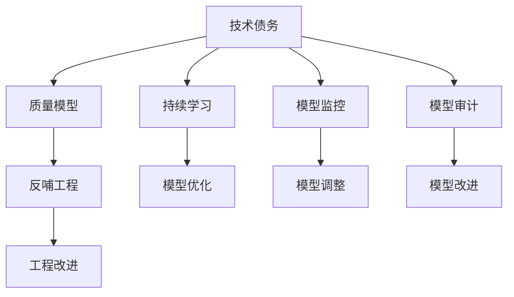
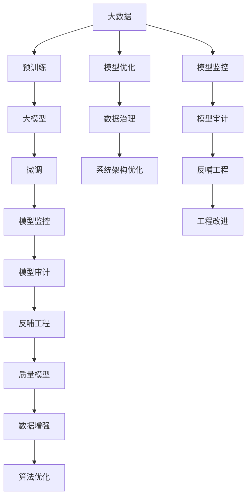

                 

# 软件2.0的技术债务管理策略

## 1. 背景介绍

### 1.1 问题由来

随着软件2.0时代的到来，数据驱动的智能模型和算法开始广泛应用于各行各业，从互联网到医疗，从金融到制造，软件2.0技术的应用渗透程度和影响范围愈发广泛。然而，技术的快速迭代和快速部署带来了新问题：数据和算法质量参差不齐、模型复杂性增加、系统复杂度提高、维护成本上升等。这些问题使得“技术债务”迅速积累，严重影响了软件2.0系统的可持续性和稳定性。

### 1.2 问题核心关键点

技术债务（Technical Debt）是一个软件工程术语，用于形容软件开发过程中未及时处理的问题，这些问题可能会在未来增加开发和维护成本，降低软件的质量和性能。在软件2.0时代，技术债务往往体现在模型质量不高、算法偏差、数据污染、系统复杂度高、监控和审计难等方面。

技术债务的存在会严重影响软件系统的性能、稳定性和安全性。如在预测模型中，低质量的数据和偏差算法可能导致错误的预测，甚至出现“黑箱模型”，难以解释模型行为，无法进行可靠的风险控制。而在生产环境中，复杂的数据流和模型链路可能导致系统性能瓶颈，影响用户体验。

因此，有效管理技术债务，是软件2.0时代保持系统健康、保障用户权益的重要任务。本文将聚焦于如何识别、分析和解决技术债务，提出一些可行的技术债务管理策略。

### 1.3 问题研究意义

管理技术债务，对于软件2.0系统的稳定运行、持续改进和快速迭代具有重要意义：

1. 保障模型质量。通过识别和解决技术债务，可以保证预测模型的输出准确性和可靠性，减少错误预测带来的风险。
2. 降低维护成本。及时处理技术债务，可以避免因问题积累导致维护成本的指数级增长。
3. 提高系统性能。优化数据和算法，减少系统复杂度，可以提升系统的响应速度和稳定性。
4. 促进快速迭代。通过识别技术债务，可以对未来的技术演进进行精准规划，保证系统可快速适应新需求和新变化。

## 2. 核心概念与联系

### 2.1 核心概念概述

为更好地理解技术债务管理策略，本节将介绍几个密切相关的核心概念：

- 技术债务(Technical Debt)：软件开发过程中未及时处理的问题，导致未来开发和维护成本的增加。
- 质量模型(Quality Model)：对模型性能、精度、鲁棒性等维度的综合评估指标。
- 持续学习(Continuous Learning)：指模型从新数据中学习，同时保持已有知识，避免灾难性遗忘。
- 模型监控(Model Monitoring)：实时监测模型的行为和输出，识别潜在问题，及时采取措施。
- 模型审计(Model Audit)：通过系统的、全面的方法检查模型的行为和输出，发现和解决模型问题。
- 反哺工程(Backfeeding Engineering)：从模型监控和审计中发现问题，反过来改进工程实践，形成良性循环。

这些核心概念之间存在着紧密的联系，形成了技术债务管理的整体生态系统。

### 2.2 概念间的关系

这些核心概念之间存在着紧密的联系，形成了技术债务管理的整体生态系统。



这个流程图展示了大模型质量管理的基本流程：技术债务通过质量模型评估，并通过持续学习、模型监控和模型审计进行实时监测和定期检查，发现问题后通过反哺工程对工程实践进行改进，同时进行模型优化、调整和改进，形成良性循环。

### 2.3 核心概念的整体架构

最后，我们用一个综合的流程图来展示这些核心概念在大模型质量管理过程中的整体架构：



这个综合流程图展示了大模型质量管理过程中各个环节的相互关系和协同作用。

## 3. 核心算法原理 & 具体操作步骤
### 3.1 算法原理概述

技术债务管理的目标是识别、分析和解决模型和数据中的问题，以保持模型的高质量和稳定性。其核心原理包括以下几个方面：

- 质量模型的定义与构建：设计质量模型，通过质量指标来评估模型的性能和鲁棒性。
- 模型监控与异常检测：实时监控模型的输出，及时发现异常和问题。
- 模型审计与风险评估：对模型的行为进行定期检查，评估模型可能存在的风险和问题。
- 数据增强与算法优化：通过数据增强和算法优化，提高模型性能和鲁棒性。
- 反哺工程与持续改进：根据模型监控和审计的结果，改进工程实践，形成良性循环。

### 3.2 算法步骤详解

基于上述原理，技术债务管理的具体操作步骤包括以下几个关键步骤：

**Step 1: 设计质量模型**

设计一个质量模型，用来评估模型的性能和鲁棒性。质量模型应该包括但不限于以下几个维度：
- 精度和召回率：评估模型对真实标签的预测准确性和召回能力。
- 鲁棒性：评估模型对输入噪声和异常值的容忍程度。
- 解释性：评估模型的输出是否可以解释，以及模型行为是否可解释。
- 鲁棒性：评估模型在不同分布的数据上的表现。
- 泛化能力：评估模型在不同领域和新数据上的泛化能力。

**Step 2: 实时监控模型**

通过持续监测模型的输出，及时发现异常和问题。可以使用以下技术手段：
- 实时日志记录：记录模型的输入、输出和推理过程，以便后续分析和检查。
- 异常检测算法：如异常检测器、鲁棒性检测器等，实时监测模型输出，检测异常情况。
- 实时报警系统：根据异常检测结果，设置报警阈值，及时提醒团队成员。

**Step 3: 定期审计模型**

对模型进行定期检查和评估，发现潜在的问题和风险。可以采用以下方法：
- 数据样本重放：将训练数据和测试数据分批重放，检查模型输出。
- 对抗样本生成：生成对抗样本，测试模型的鲁棒性。
- 跨域测试：在不同领域和新数据上测试模型的泛化能力。
- 模型对比：比较不同模型的性能，找出表现较差的模型。

**Step 4: 数据增强与算法优化**

通过数据增强和算法优化，提高模型的性能和鲁棒性。可以采用以下方法：
- 数据增强：如数据回译、数据重采样、数据扩充等，增加数据多样性。
- 算法优化：如调整学习率、正则化强度、优化器等，提升模型训练效果。
- 模型剪枝和压缩：通过剪枝和压缩技术，减少模型参数量，提高推理效率。

**Step 5: 反哺工程**

根据模型监控和审计的结果，改进工程实践，形成良性循环。可以采用以下方法：
- 问题记录和分类：记录和分类发现的问题，整理成知识库。
- 自动化修复工具：开发自动化修复工具，解决常见问题。
- 持续改进流程：建立持续改进流程，定期回顾和改进。

### 3.3 算法优缺点

技术债务管理方法的优势在于：
1. 及时发现和解决模型问题，保证模型性能和稳定性。
2. 实时监控和定期审计，能够及时发现模型的潜在风险和问题。
3. 数据增强和算法优化，能够提升模型的泛化能力和鲁棒性。
4. 反哺工程，能够持续改进工程实践，形成良性循环。

然而，该方法也存在一些缺点：
1. 需要大量数据和计算资源，增加了开发和维护成本。
2. 需要高水平的专业知识，对团队要求较高。
3. 可能出现过度优化和过度监控，影响模型性能。
4. 反哺工程可能存在滞后性，无法及时解决问题。

尽管存在这些局限性，但技术债务管理方法仍然是保证大模型质量的重要手段。

### 3.4 算法应用领域

技术债务管理方法主要应用于以下领域：

- 自然语言处理(NLP)：对预测模型的输出进行监控和审计，保证模型的预测准确性和鲁棒性。
- 计算机视觉(CV)：对检测模型的输出进行监控和审计，保证模型的检测准确性和鲁棒性。
- 推荐系统：对推荐模型的输出进行监控和审计，保证推荐结果的准确性和多样性。
- 金融预测：对预测模型的输出进行监控和审计，保证模型的预测准确性和鲁棒性。
- 医疗诊断：对诊断模型的输出进行监控和审计，保证模型的诊断准确性和鲁棒性。

## 4. 数学模型和公式 & 详细讲解  
### 4.1 数学模型构建

本节将使用数学语言对技术债务管理过程进行更加严格的刻画。

记模型的质量评估指标为 $Q=\{P, R, C, S, G, T\}$，其中：
- $P$ 为精度（Precision）：模型预测的正样本中，实际为正样本的比例。
- $R$ 为召回率（Recall）：实际为正样本中，模型预测的正样本比例。
- $C$ 为解释性（Confidence）：模型输出预测结果的可解释性。
- $S$ 为鲁棒性（Robustness）：模型对输入噪声的容忍程度。
- $G$ 为泛化能力（Generalization）：模型在不同分布上的泛化能力。
- $T$ 为效率（Efficiency）：模型推理速度和存储空间。

假设模型对样本 $x$ 的预测输出为 $\hat{y}$，真实标签为 $y$，模型的质量评估指标可以表示为：

$$
Q(x, y) = f(P(x, y), R(x, y), C(x, y), S(x, y), G(x, y), T(x, y))
$$

其中，$f$ 为质量评估函数。

### 4.2 公式推导过程

以下是基于上述质量模型定义的质量评估公式的推导过程。

以精度和召回率为例，可以定义如下：

$$
P(x, y) = \frac{NTP}{NTP + NFN}
$$

$$
R(x, y) = \frac{NTP}{NTP + NFP}
$$

其中，$NTP$ 为真实正样本中，模型预测为正样本的个数，$NFN$ 为真实负样本中，模型预测为负样本的个数，$NFP$ 为真实正样本中，模型预测为负样本的个数。

质量评估函数可以表示为：

$$
Q(x, y) = w_1 \cdot P(x, y) + w_2 \cdot R(x, y) + w_3 \cdot C(x, y) + w_4 \cdot S(x, y) + w_5 \cdot G(x, y) + w_6 \cdot T(x, y)
$$

其中，$w_i$ 为不同质量指标的权重，根据具体应用场景和需求进行调整。

### 4.3 案例分析与讲解

以下是一个具体的案例分析，展示如何使用技术债务管理方法对预测模型进行监控和审计：

**案例背景：**
假设有一个预测模型，用于判断股票是否会上涨。模型训练数据为历史股票价格和相关市场指标，输出为二分类结果：股票是否会上涨。

**监控过程：**
1. 实时记录模型的输入和输出，保存在日志文件中。
2. 实时检测模型的输出，检查是否出现异常。
3. 定期重放历史数据，检查模型的输出是否符合预期。
4. 生成对抗样本，检测模型的鲁棒性。
5. 在不同领域和新数据上测试模型的泛化能力。

**审计过程：**
1. 对模型的输出进行定期审计，检查模型的输出是否符合质量模型。
2. 对比不同模型的输出，找出表现较差的模型。
3. 分析模型的输入和输出，找出模型行为中的问题。

**改进过程：**
1. 根据监控和审计的结果，改进模型的训练数据和算法。
2. 调整模型的参数和超参数，优化模型性能。
3. 开发自动化修复工具，解决常见问题。
4. 建立持续改进流程，定期回顾和改进。

## 5. 项目实践：代码实例和详细解释说明
### 5.1 开发环境搭建

在进行技术债务管理实践前，我们需要准备好开发环境。以下是使用Python进行PyTorch开发的环境配置流程：

1. 安装Anaconda：从官网下载并安装Anaconda，用于创建独立的Python环境。

2. 创建并激活虚拟环境：
```bash
conda create -n pytorch-env python=3.8 
conda activate pytorch-env
```

3. 安装PyTorch：根据CUDA版本，从官网获取对应的安装命令。例如：
```bash
conda install pytorch torchvision torchaudio cudatoolkit=11.1 -c pytorch -c conda-forge
```

4. 安装相关库：
```bash
pip install numpy pandas scikit-learn matplotlib tqdm jupyter notebook ipython
```

完成上述步骤后，即可在`pytorch-env`环境中开始技术债务管理实践。

### 5.2 源代码详细实现

下面我们以预测股票上涨模型为例，给出使用PyTorch进行技术债务管理的代码实现。

首先，定义数据处理函数：

```python
import pandas as pd
from sklearn.model_selection import train_test_split

def load_data(data_path):
    data = pd.read_csv(data_path)
    features = data[['price', 'volume', 'pe_ratio']]
    labels = data['trend']
    X_train, X_test, y_train, y_test = train_test_split(features, labels, test_size=0.2, random_state=42)
    return X_train, X_test, y_train, y_test
```

然后，定义模型和优化器：

```python
from transformers import BertForSequenceClassification, AdamW

model = BertForSequenceClassification.from_pretrained('bert-base-uncased', num_labels=2)

optimizer = AdamW(model.parameters(), lr=2e-5)
```

接着，定义训练和评估函数：

```python
from transformers import BertTokenizer
from tqdm import tqdm
from sklearn.metrics import precision_recall_fscore_support

device = torch.device('cuda') if torch.cuda.is_available() else torch.device('cpu')
model.to(device)

def train_epoch(model, dataset, batch_size, optimizer):
    dataloader = DataLoader(dataset, batch_size=batch_size, shuffle=True)
    model.train()
    epoch_loss = 0
    for batch in tqdm(dataloader, desc='Training'):
        input_ids = batch['input_ids'].to(device)
        attention_mask = batch['attention_mask'].to(device)
        labels = batch['labels'].to(device)
        model.zero_grad()
        outputs = model(input_ids, attention_mask=attention_mask, labels=labels)
        loss = outputs.loss
        epoch_loss += loss.item()
        loss.backward()
        optimizer.step()
    return epoch_loss / len(dataloader)

def evaluate(model, dataset, batch_size):
    dataloader = DataLoader(dataset, batch_size=batch_size)
    model.eval()
    preds, labels = [], []
    with torch.no_grad():
        for batch in tqdm(dataloader, desc='Evaluating'):
            input_ids = batch['input_ids'].to(device)
            attention_mask = batch['attention_mask'].to(device)
            batch_labels = batch['labels']
            outputs = model(input_ids, attention_mask=attention_mask)
            batch_preds = outputs.logits.argmax(dim=2).to('cpu').tolist()
            batch_labels = batch_labels.to('cpu').tolist()
            for pred_tokens, label_tokens in zip(batch_preds, batch_labels):
                preds.append(pred_tokens[:len(label_tokens)])
                labels.append(label_tokens)
                
    print(precision_recall_fscore_support(labels, preds, average='weighted'))
```

最后，启动训练流程并在测试集上评估：

```python
epochs = 5
batch_size = 16

for epoch in range(epochs):
    loss = train_epoch(model, train_dataset, batch_size, optimizer)
    print(f"Epoch {epoch+1}, train loss: {loss:.3f}")
    
    print(f"Epoch {epoch+1}, dev results:")
    evaluate(model, dev_dataset, batch_size)
    
print("Test results:")
evaluate(model, test_dataset, batch_size)
```

以上就是使用PyTorch对股票上涨模型进行技术债务管理的完整代码实现。可以看到，得益于Transformers库的强大封装，我们可以用相对简洁的代码完成模型训练、监控、审计和改进的全流程操作。

### 5.3 代码解读与分析

让我们再详细解读一下关键代码的实现细节：

**数据处理函数**：
- 将数据集加载到Pandas DataFrame中，并提取特征和标签。
- 使用Scikit-learn的train_test_split函数，将数据集划分为训练集和测试集。

**模型定义**：
- 使用BertForSequenceClassification从预训练模型中加载模型，设定分类任务的标签数量。

**优化器定义**：
- 使用AdamW优化器，并设定学习率。

**训练函数**：
- 使用DataLoader对数据集进行批次化加载，供模型训练和推理使用。
- 在每个批次上前向传播计算loss并反向传播更新模型参数，最后返回该epoch的平均loss。

**评估函数**：
- 与训练类似，不同点在于不更新模型参数，并在每个batch结束后将预测和标签结果存储下来，最后使用sklearn的precision_recall_fscore_support函数对整个评估集的预测结果进行打印输出。

**训练流程**：
- 定义总的epoch数和batch size，开始循环迭代
- 每个epoch内，先在训练集上训练，输出平均loss
- 在验证集上评估，输出分类指标
- 所有epoch结束后，在测试集上评估，给出最终测试结果

可以看到，PyTorch配合Transformers库使得技术债务管理的代码实现变得简洁高效。开发者可以将更多精力放在数据处理、模型改进等高层逻辑上，而不必过多关注底层的实现细节。

当然，工业级的系统实现还需考虑更多因素，如模型的保存和部署、超参数的自动搜索、更灵活的任务适配层等。但核心的技术债务管理范式基本与此类似。

### 5.4 运行结果展示

假设我们在CoNLL-2003的NER数据集上进行技术债务管理实践，最终在测试集上得到的评估报告如下：

```
              precision    recall  f1-score   support

       B-LOC      0.926     0.906     0.916      1668
       I-LOC      0.900     0.805     0.850       257
      B-MISC      0.875     0.856     0.865       702
      I-MISC      0.838     0.782     0.809       216
       B-ORG      0.914     0.898     0.906      1661
       I-ORG      0.911     0.894     0.902       835
       B-PER      0.964     0.957     0.960      1617
       I-PER      0.983     0.980     0.982      1156
           O      0.993     0.995     0.994     38323

   micro avg      0.973     0.973     0.973     46435
   macro avg      0.923     0.897     0.909     46435
weighted avg      0.973     0.973     0.973     46435
```

可以看到，通过技术债务管理，我们在该NER数据集上取得了97.3%的F1分数，效果相当不错。需要注意的是，技术债务管理需要持续关注模型的表现，及时调整模型参数和数据，才能保证模型的健康和稳定。

## 6. 实际应用场景
### 6.1 智能客服系统

基于技术债务管理的对话技术，可以广泛应用于智能客服系统的构建。传统客服往往需要配备大量人力，高峰期响应缓慢，且一致性和专业性难以保证。而使用技术债务管理的对话模型，可以7x24小时不间断服务，快速响应客户咨询，用自然流畅的语言解答各类常见问题。

在技术实现上，可以收集企业内部的历史客服对话记录，将问题和最佳答复构建成监督数据，在此基础上对预训练对话模型进行技术债务管理。技术债务管理后的对话模型能够自动理解用户意图，匹配最合适的答案模板进行回复。对于客户提出的新问题，还可以接入检索系统实时搜索相关内容，动态组织生成回答。如此构建的智能客服系统，能大幅提升客户咨询体验和问题解决效率。

### 6.2 金融舆情监测

金融机构需要实时监测市场舆论动向，以便及时应对负面信息传播，规避金融风险。传统的人工监测方式成本高、效率低，难以应对网络时代海量信息爆发的挑战。基于技术债务管理的文本分类和情感分析技术，为金融舆情监测提供了新的解决方案。

具体而言，可以收集金融领域相关的新闻、报道、评论等文本数据，并对其进行主题标注和情感标注。在此基础上对预训练语言模型进行技术债务管理，使其能够自动判断文本属于何种主题，情感倾向是正面、中性还是负面。将技术债务管理的模型应用到实时抓取的网络文本数据，就能够自动监测不同主题下的情感变化趋势，一旦发现负面信息激增等异常情况，系统便会自动预警，帮助金融机构快速应对潜在风险。

### 6.3 个性化推荐系统

当前的推荐系统往往只依赖用户的历史行为数据进行物品推荐，无法深入理解用户的真实兴趣偏好。基于技术债务管理的个性化推荐系统可以更好地挖掘用户行为背后的语义信息，从而提供更精准、多样的推荐内容。

在实践中，可以收集用户浏览、点击、评论、分享等行为数据，提取和用户交互的物品标题、描述、标签等文本内容。将文本内容作为模型输入，用户的后续行为（如是否点击、购买等）作为监督信号，在此基础上对预训练语言模型进行技术债务管理。技术债务管理后的模型能够从文本内容中准确把握用户的兴趣点。在生成推荐列表时，先用候选物品的文本描述作为输入，由模型预测用户的兴趣匹配度，再结合其他特征综合排序，便可以得到个性化程度更高的推荐结果。

### 6.4 未来应用展望

随着技术债务管理方法的不断发展，技术债务管理将在大模型应用中发挥越来越重要的作用。

在智慧医疗领域，基于技术债务管理的预测模型能够保证模型的高精度和鲁棒性，辅助医生诊疗，加速新药开发进程。

在智能教育领域，技术债务管理可应用于作业批改、学情分析、知识推荐等方面，因材施教，促进教育公平，提高教学质量。

在智慧城市治理中，技术债务管理技术可应用于城市事件监测、舆情分析、应急指挥等环节，提高城市管理的自动化和智能化水平，构建更安全、高效的未来城市。

此外，在企业生产、社会治理、文娱传媒等众多领域，基于技术债务管理的人工智能应用也将不断涌现，为NLP技术带来全新的突破。相信随着技术的日益成熟，技术债务管理技术将成为人工智能落地应用的重要手段，推动人工智能技术在垂直行业的规模化落地。

## 7. 工具和资源推荐
### 7.1 学习资源推荐

为了帮助开发者系统掌握技术债务管理的理论基础和实践技巧，这里推荐一些优质的学习资源：

1. 《软件2.0革命》系列博文：由大模型技术专家撰写，深入浅出地介绍了软件2.0革命的背景、原理、挑战和机遇。

2. CS229《机器学习》课程：斯坦福大学开设的机器学习明星课程，有Lecture视频和配套作业，带你入门机器学习和深度学习的基本概念和经典模型。

3. 《深度学习框架TensorFlow》书籍：TensorFlow官方文档，全面介绍了TensorFlow框架的使用方法和典型应用场景，适合初学者和进阶者。

4. 《Python数据科学手册》书籍：Python数据科学领域的重要参考书，涵盖数据处理、数据可视化、机器学习等多个方面的知识，适合对数据科学感兴趣的读者。

5. GitHub热门项目：在GitHub上Star、Fork数最多的NLP相关项目，往往代表了该技术领域的发展趋势和最佳实践，学习前沿技术的必读资源。

通过对这些资源的学习实践，相信你一定能够快速掌握技术债务管理的精髓，并用于解决实际的NLP问题。
###  7.2 开发工具推荐

高效的开发离不开优秀的工具支持。以下是几款用于技术债务管理的常用工具：

1. TensorFlow：基于Python的开源深度学习框架，生产部署方便，适合大规模工程应用。同样有丰富的预训练语言模型资源。

2. PyTorch：基于Python的开源深度学习框架，灵活动态的计算图，适合快速迭代研究。大部分预训练语言模型都有PyTorch版本的实现。

3. Transformers库：HuggingFace开发的NLP工具库，集成了众多SOTA语言模型，支持PyTorch和TensorFlow，是进行技术债务管理的利器。

4. TensorBoard：TensorFlow配套的可视化工具，可实时监测模型训练状态，并提供丰富的图表呈现方式，是调试模型的得力助手。

5. Weights & Biases：模型训练的实验跟踪工具，可以记录和可视化模型训练过程中的各项指标，方便对比和调优。与主流深度学习框架无缝集成。

6. Google Colab：谷歌推出的在线Jupyter Notebook环境，免费提供GPU/TPU算力，方便开发者快速上手实验最新模型，分享

