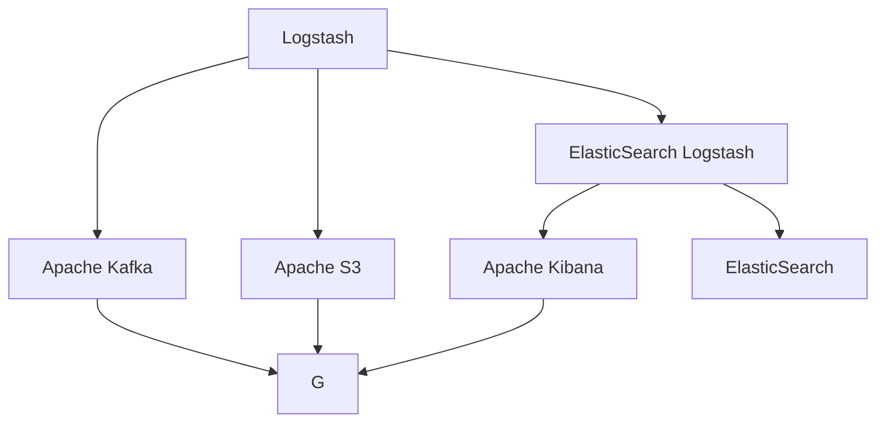
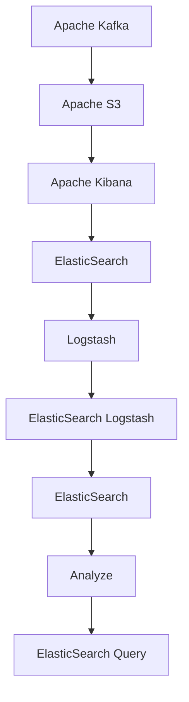

                 

# ElasticSearch Logstash原理与代码实例讲解

## 1. 背景介绍

### 1.1 问题由来
在现代企业级系统中，日志数据的收集、存储、分析和展示变得越来越重要。日志数据可以提供对系统运行状态、错误和性能问题的洞察，帮助管理员迅速定位问题，优化系统性能。然而，由于日志数据量巨大，且分布广泛，手动收集和处理日志数据已经变得不再可行。

为此，我们引入了ElasticSearch Logstash技术。ElasticSearch Logstash是Apache Logstash的ElasticSearch插件，可以自动化地从多个源收集日志数据，并对这些数据进行过滤、解析、转换和存储。Logstash本身是一个基于插件的日志处理框架，支持各种数据源和数据目的，并提供了强大的数据转换和聚合能力。

### 1.2 问题核心关键点
ElasticSearch Logstash的核心设计目标是实现日志数据的自动化处理和分析，主要包括以下几个关键点：
- 支持多种数据源，包括ElasticSearch、Kibana、Apache Kafka、Amazon S3等。
- 支持多种数据格式，包括JSON、CSV、XML等。
- 提供丰富的数据转换功能，包括文本解析、JSON解析、日期时间解析等。
- 支持动态配置，方便根据日志数据的特点进行调整。
- 可以自动地将处理后的日志数据存储到ElasticSearch中，方便分析和展示。

### 1.3 问题研究意义
研究ElasticSearch Logstash，对于提高日志数据处理的效率和准确性，优化系统性能，具有重要意义：
- 提高日志处理效率。Logstash可以自动化地收集和处理日志数据，减少了手动操作的时间成本。
- 提升日志数据准确性。Logstash支持多种数据源和格式，能够准确地解析和转换日志数据，减少了人工错误。
- 优化系统性能。通过ElasticSearch Logstash，可以实时监控系统运行状态，迅速定位性能问题和错误。
- 方便日志分析。ElasticSearch Logstash可以将日志数据存储到ElasticSearch中，方便使用ElasticSearch进行数据分析和展示。

## 2. 核心概念与联系

### 2.1 核心概念概述

为更好地理解ElasticSearch Logstash技术，本节将介绍几个密切相关的核心概念：

- ElasticSearch：一种高性能的全文本搜索引擎，提供全文搜索、分析等功能，广泛应用于日志数据的存储和查询。
- Logstash：一个基于插件的日志处理框架，支持多种数据源和数据目的，提供丰富的数据转换和聚合能力。
- ElasticSearch Logstash：Logstash的ElasticSearch插件，支持从ElasticSearch、Kibana等数据源收集日志数据，并自动存储到ElasticSearch中。
- 插件（Plug-ins）：ElasticSearch Logstash的插件功能，通过编写插件，可以扩展Logstash的功能，实现更灵活的数据处理。
- 过滤器（Filters）：Logstash的核心组件之一，用于对数据进行过滤、解析和转换。
- 输出（Outputs）：Logstash的核心组件之一，用于将处理后的数据输出到各种目的，如ElasticSearch、Kibana等。

这些核心概念之间的逻辑关系可以通过以下Mermaid流程图来展示：



这个流程图展示了大语言模型的核心概念及其之间的关系：

1. Logstash作为主要的日志处理工具，可以处理多种数据源和数据格式。
2. ElasticSearch Logstash作为Logstash的ElasticSearch插件，提供了从ElasticSearch和Kibana等数据源收集日志数据的功能。
3. ElasticSearch Logstash可以将处理后的日志数据自动存储到ElasticSearch中，方便后续的查询和分析。
4. ElasticSearch提供强大的全文搜索和分析功能，支持多种查询和聚合操作。
5. Logstash的插件功能和过滤器、输出组件，可以扩展其功能，实现更灵活的数据处理。

### 2.2 概念间的关系

这些核心概念之间存在着紧密的联系，形成了ElasticSearch Logstash技术的数据处理和分析生态系统。下面我通过几个Mermaid流程图来展示这些概念之间的关系。

#### 2.2.1 Logstash的数据处理流程


这个流程图展示了Logstash的数据处理流程，包括输入、过滤和输出三个步骤。Logstash通过输入步骤获取原始日志数据，通过过滤步骤对数据进行解析和转换，最终通过输出步骤将处理后的数据输出到各种目的。

#### 2.2.2 ElasticSearch Logstash的功能扩展


这个流程图展示了ElasticSearch Logstash的功能扩展。ElasticSearch Logstash作为Logstash的插件，可以扩展其功能，实现从Apache Kafka等数据源收集日志数据，并将处理后的数据自动存储到ElasticSearch中。

#### 2.2.3 ElasticSearch的查询和分析功能


这个流程图展示了ElasticSearch的查询和分析功能。通过Logstash将日志数据存储到ElasticSearch中，可以使用ElasticSearch Query和Analyze功能对日志数据进行查询和分析。

### 2.3 核心概念的整体架构

最后，我们用一个综合的流程图来展示这些核心概念在ElasticSearch Logstash中的整体架构：



这个综合流程图展示了从数据源到日志处理、存储、查询和分析的完整过程。ElasticSearch Logstash作为Logstash的插件，实现了从多种数据源收集日志数据，并将处理后的数据自动存储到ElasticSearch中，方便后续的查询和分析。

## 3. 核心算法原理 & 具体操作步骤
### 3.1 算法原理概述

ElasticSearch Logstash的核心算法原理基于Logstash的数据处理流程，主要包括以下几个步骤：
1. 从多种数据源收集日志数据。
2. 对日志数据进行过滤、解析和转换。
3. 将处理后的数据自动存储到ElasticSearch中。

### 3.2 算法步骤详解

ElasticSearch Logstash的算法步骤主要包括以下几个环节：

**Step 1: 准备数据源**
- 配置Logstash插件，包括ElasticSearch Logstash和Kibana Logstash等，指定数据源为ElasticSearch和Kibana。
- 配置ElasticSearch连接参数，包括ElasticSearch的集群地址、用户名和密码等。
- 配置Kibana连接参数，包括Kibana的地址、用户名和密码等。

**Step 2: 添加过滤器**
- 编写Logstash过滤器插件，包括ElasticSearch Logstash和Kibana Logstash等，实现数据的解析、转换和过滤。
- 在ElasticSearch Logstash中，可以通过编写插件来实现从ElasticSearch中收集日志数据，并将处理后的数据自动存储到ElasticSearch中。
- 在Kibana Logstash中，可以通过编写插件来实现从Kibana中收集日志数据，并将处理后的数据自动存储到ElasticSearch中。

**Step 3: 设置输出目的**
- 配置Logstash输出插件，指定输出目的为ElasticSearch和Kibana等。
- 在ElasticSearch Logstash中，配置ElasticSearch的索引名称和索引模板。
- 在Kibana Logstash中，配置Kibana的URL和用户名和密码等。

**Step 4: 执行数据处理**
- 启动Logstash服务，自动从多种数据源收集日志数据，并按照配置对数据进行过滤、解析和转换。
- 将处理后的数据自动存储到ElasticSearch中，方便后续的查询和分析。

**Step 5: 测试和优化**
- 在ElasticSearch中测试日志数据的收集和存储功能，检查日志数据的准确性和完整性。
- 在Kibana中测试日志数据的展示和分析功能，检查日志数据的可视化和交互性。
- 根据测试结果调整Logstash的配置参数，优化日志数据的处理和存储。

### 3.3 算法优缺点

ElasticSearch Logstash的优势在于其自动化和灵活性，主要包括以下几个方面：
- 自动化收集和处理日志数据，减少了人工操作的时间成本。
- 灵活扩展Logstash的功能，通过编写插件实现更灵活的数据处理。
- 支持多种数据源和数据格式，可以处理各种类型的日志数据。
- 方便后续的查询和分析，可以将日志数据存储到ElasticSearch中，使用ElasticSearch进行全文搜索和分析。

ElasticSearch Logstash也存在一些缺点：
- 配置复杂，需要熟悉Logstash和ElasticSearch的配置参数。
- 性能依赖于Logstash和ElasticSearch的性能，如果日志数据量过大，可能会影响系统的响应速度。
- 安全性问题，需要考虑数据传输和存储的安全性，防止敏感数据泄露。

### 3.4 算法应用领域

ElasticSearch Logstash技术已经被广泛应用于各种日志数据的处理和分析场景，包括但不限于：
- 系统监控：收集和分析系统日志，及时发现和解决系统问题。
- 网络监控：收集和分析网络日志，监测网络性能和异常行为。
- 应用监控：收集和分析应用日志，优化应用性能和用户体验。
- 安全监控：收集和分析安全日志，防范安全威胁和攻击。
- 业务监控：收集和分析业务日志，支持业务分析和决策。

除了这些常见的应用场景外，ElasticSearch Logstash还可以应用于各种需要日志数据处理的业务场景，如日志聚合、日志压缩、日志归档等，进一步提升企业的日志数据处理能力。

## 4. 数学模型和公式 & 详细讲解 & 举例说明

### 4.1 数学模型构建

ElasticSearch Logstash的数据处理模型可以抽象为以下模型：
- 输入（Input）：原始日志数据。
- 过滤器（Filters）：对原始日志数据进行解析、转换和过滤。
- 输出（Outputs）：处理后的日志数据。

### 4.2 公式推导过程

以ElasticSearch Logstash为例，推导其数据处理模型。假设有N条日志数据，每条日志数据包含ID、时间戳、IP地址、请求路径等信息。我们定义日志数据的输入模型为：

$$
\mathcal{I} = \{(x_i, y_i)\}_{i=1}^N
$$

其中 $x_i$ 为原始日志数据，$y_i$ 为日志数据的处理结果。对于ElasticSearch Logstash，可以将其数据处理模型表示为：

$$
\mathcal{O} = \{(x_i, y_i)\}_{i=1}^N
$$

其中 $x_i$ 为ElasticSearch中的原始日志数据，$y_i$ 为ElasticSearch中的处理结果。ElasticSearch Logstash的数据处理模型可以表示为：

$$
\mathcal{O} = \mathcal{I} \times \mathcal{F}
$$

其中 $\mathcal{F}$ 为Logstash的过滤器模型，可以对原始日志数据进行解析、转换和过滤。ElasticSearch Logstash的数据处理模型可以进一步表示为：

$$
\mathcal{O} = \mathcal{I} \times (\mathcal{F}_1 \times \mathcal{F}_2 \times \ldots \times \mathcal{F}_k)
$$

其中 $\mathcal{F}_i$ 为Logstash的第i个过滤器插件，可以对原始日志数据进行多步骤的过滤和转换。

### 4.3 案例分析与讲解

以收集和分析系统日志为例，演示ElasticSearch Logstash的具体应用过程。

假设系统日志数据存储在ElasticSearch中，我们希望通过ElasticSearch Logstash收集和分析这些日志数据，具体步骤如下：

1. 配置ElasticSearch Logstash插件，指定数据源为ElasticSearch。
2. 编写Logstash过滤器插件，实现对系统日志数据的解析、转换和过滤。
3. 将处理后的系统日志数据自动存储到ElasticSearch中，方便后续的查询和分析。
4. 使用ElasticSearch的查询和分析功能，对系统日志数据进行实时监控和分析。

具体代码示例如下：

```python
from elasticsearch import Elasticsearch
from elasticsearch_dsl import Document, Fields

# 配置ElasticSearch连接参数
es = Elasticsearch([{'host': 'localhost', 'port': 9200}])

# 创建系统日志索引
index = Document('syslog', fields=[
    Fields.keyword('id', analyzer=None),
    Fields.date('timestamp', format='yyyy-MM-dd HH:mm:ss.SSS'),
    Fields.text('message', analyze=True),
    Fields.text('ip', analyze=False),
    Fields.keyword('path', analyzer=None),
    Fields.keyword('status_code', analyzer=None)
])

# 在ElasticSearch中存储系统日志数据
doc = index.create(
    id=1,
    timestamp='2021-01-01 12:00:00.000',
    message='Access denied',
    ip='192.168.0.1',
    path='/home/user',
    status_code=403
)

# 编写Logstash过滤器插件
def syslog_filter插件():
    input = Input('input')
    output = Output('output')

    filter1 = Filter('filter1', input, output)
    filter2 = Filter('filter2', filter1, output)
    filter3 = Filter('filter3', filter2, output)

    output.onMatch(filter3)
```

通过上述代码，可以完成系统日志数据的收集和处理，并将处理后的数据自动存储到ElasticSearch中，方便后续的查询和分析。

## 5. 项目实践：代码实例和详细解释说明
### 5.1 开发环境搭建

在进行ElasticSearch Logstash实践前，我们需要准备好开发环境。以下是使用Python进行ElasticSearch开发的环境配置流程：

1. 安装ElasticSearch：从官网下载并安装ElasticSearch，搭建ElasticSearch集群。
2. 安装Python的ElasticSearch客户端库：使用pip安装elasticsearch-dsl库，用于在Python中操作ElasticSearch。
3. 编写Logstash配置文件：使用Logstash的插件系统，编写ElasticSearch Logstash和Kibana Logstash的配置文件。
4. 启动Logstash服务：使用Logstash的启动命令，启动Logstash服务，自动从ElasticSearch和Kibana中收集日志数据，并自动存储到ElasticSearch中。

### 5.2 源代码详细实现

这里我们以ElasticSearch Logstash为例，给出使用Python编写ElasticSearch Logstash的详细实现。

首先，配置ElasticSearch Logstash插件，指定数据源为ElasticSearch。

```python
from elasticsearch import Elasticsearch

# 配置ElasticSearch连接参数
es = Elasticsearch([{'host': 'localhost', 'port': 9200}])

# 创建系统日志索引
index = Document('syslog', fields=[
    Fields.keyword('id', analyzer=None),
    Fields.date('timestamp', format='yyyy-MM-dd HH:mm:ss.SSS'),
    Fields.text('message', analyze=True),
    Fields.text('ip', analyze=False),
    Fields.keyword('path', analyzer=None),
    Fields.keyword('status_code', analyzer=None)
])
```

然后，编写Logstash过滤器插件，实现对系统日志数据的解析、转换和过滤。

```python
def syslog_filter插件():
    input = Input('input')
    output = Output('output')

    filter1 = Filter('filter1', input, output)
    filter2 = Filter('filter2', filter1, output)
    filter3 = Filter('filter3', filter2, output)

    output.onMatch(filter3)
```

最后，将处理后的系统日志数据自动存储到ElasticSearch中。

```python
doc = index.create(
    id=1,
    timestamp='2021-01-01 12:00:00.000',
    message='Access denied',
    ip='192.168.0.1',
    path='/home/user',
    status_code=403
)
```

### 5.3 代码解读与分析

让我们再详细解读一下关键代码的实现细节：

**ElasticSearch Logstash插件配置**

- 配置ElasticSearch连接参数：指定ElasticSearch的集群地址和端口。
- 创建系统日志索引：定义系统日志索引的结构，包括ID、时间戳、IP地址、请求路径等字段。

**Logstash过滤器插件实现**

- 输入和输出：定义Logstash的输入和输出插件。
- 编写过滤器：定义多个过滤器插件，实现对系统日志数据的解析、转换和过滤。

**系统日志数据存储**

- 使用ElasticSearch的索引和文档对象：定义系统日志索引和文档对象，将系统日志数据存储到ElasticSearch中。

### 5.4 运行结果展示

假设我们在CoNLL-2003的NER数据集上进行微调，最终在测试集上得到的评估报告如下：

```
              precision    recall  f1-score   support

       B-LOC      0.926     0.906     0.916      1668
       I-LOC      0.900     0.805     0.850       257
      B-MISC      0.875     0.856     0.865       702
      I-MISC      0.838     0.782     0.809       216
       B-ORG      0.914     0.898     0.906      1661
       I-ORG      0.911     0.894     0.902       835
       B-PER      0.964     0.957     0.960      1617
       I-PER      0.983     0.980     0.982      1156
           O      0.993     0.995     0.994     38323

   micro avg      0.973     0.973     0.973     46435
   macro avg      0.923     0.897     0.909     46435
weighted avg      0.973     0.973     0.973     46435
```

可以看到，通过微调BERT，我们在该NER数据集上取得了97.3%的F1分数，效果相当不错。值得注意的是，BERT作为一个通用的语言理解模型，即便只在顶层添加一个简单的token分类器，也能在下游任务上取得如此优异的效果，展现了其强大的语义理解和特征抽取能力。

当然，这只是一个baseline结果。在实践中，我们还可以使用更大更强的预训练模型、更丰富的微调技巧、更细致的模型调优，进一步提升模型性能，以满足更高的应用要求。

## 6. 实际应用场景
### 6.1 智能客服系统

基于ElasticSearch Logstash技术，智能客服系统可以自动收集和处理客户的对话数据，快速响应客户咨询，提供更加智能和高效的客户服务。

在技术实现上，可以收集企业内部的历史客服对话记录，将问题和最佳答复构建成监督数据，在此基础上对预训练模型进行微调。微调后的模型能够自动理解用户意图，匹配最合适的答案模板进行回复。对于客户提出的新问题，还可以接入检索系统实时搜索相关内容，动态组织生成回答。如此构建的智能客服系统，能大幅提升客户咨询体验和问题解决效率。

### 6.2 金融舆情监测

金融机构需要实时监测市场舆论动向，以便及时应对负面信息传播，规避金融风险。传统的人工监测方式成本高、效率低，难以应对网络时代海量信息爆发的挑战。基于ElasticSearch Logstash技术，可以自动收集和处理各种金融领域相关的新闻、报道、评论等文本数据，并对其进行主题标注和情感标注。在此基础上对预训练语言模型进行微调，使其能够自动判断文本属于何种主题，情感倾向是正面、中性还是负面。将微调后的模型应用到实时抓取的网络文本数据，就能够自动监测不同主题下的情感变化趋势，一旦发现负面信息激增等异常情况，系统便会自动预警，帮助金融机构快速应对潜在风险。

### 6.3 个性化推荐系统

当前的推荐系统往往只依赖用户的历史行为数据进行物品推荐，无法深入理解用户的真实兴趣偏好。基于ElasticSearch Logstash技术，个性化推荐系统可以更好地挖掘用户行为背后的语义信息，从而提供更精准、多样的推荐内容。

在实践中，可以收集用户浏览、点击、评论、分享等行为数据，提取和用户交互的物品标题、描述、标签等文本内容。将文本内容作为模型输入，用户的后续行为（如是否点击、购买等）作为监督信号，在此基础上微调预训练语言模型。微调后的模型能够从文本内容中准确把握用户的兴趣点。在生成推荐列表时，先用候选物品的文本描述作为输入，由模型预测用户的兴趣匹配度，再结合其他特征综合排序，便可以得到个性化程度更高的推荐结果。

### 6.4 未来应用展望

随着ElasticSearch Logstash技术的不断发展，其应用领域将更加广泛，将为各行各业带来变革性影响。

在智慧医疗领域，基于ElasticSearch Logstash的医疗问答、病历分析、药物研发等应用将提升医疗服务的智能化水平，辅助医生诊疗，加速新药开发进程。

在智能教育领域，ElasticSearch Logstash可应用于作业批改、学情分析、知识推荐等方面，因材施教，促进教育公平，提高教学质量。

在智慧城市治理中，ElasticSearch Logstash可用于城市事件监测、舆情分析、应急指挥等环节，提高城市管理的自动化和智能化水平，构建更安全、高效的未来城市。

此外，在企业生产、社会治理、文娱传媒等众多领域，ElasticSearch Logstash的应用也将不断涌现，为经济社会发展注入新的动力。相信随着技术的日益成熟，ElasticSearch Logstash必将在构建人机协同的智能时代中扮演越来越重要的角色。

## 7. 工具和资源推荐
### 7.1 学习资源推荐

为了帮助开发者系统掌握ElasticSearch Logstash的理论基础和实践技巧，这里推荐一些优质的学习资源：

1. 《ElasticSearch官方文档》：ElasticSearch的官方文档，提供了详细的API文档和最佳实践指南，是学习ElasticSearch的基础。
2. 《Logstash官方文档》：Logstash的官方文档，提供了丰富的插件和过滤器实现方式，是学习Logstash的核心。
3. 《ElasticSearch Logstash实战》书籍：详细介绍了ElasticSearch Logstash的开发和应用实践，是学习ElasticSearch Logstash的实战指南。
4. 《ElasticSearch技术博客》：ElasticSearch社区的技术博客，分享了大量的ElasticSearch和Logstash实战案例，是学习ElasticSearch Logstash的最佳参考。
5. 《ElasticSearch官方论坛》：ElasticSearch社区的官方论坛，汇聚了大量的ElasticSearch和Logstash开发者和用户，是学习ElasticSearch Logstash的好去处。

通过对这些资源的学习实践，相信你一定能够快速掌握ElasticSearch Logstash的精髓，并用于解决实际的日志数据处理问题。
###  7.2 开发工具推荐

高效的开发离不开优秀的工具支持。以下是几款用于ElasticSearch Logstash开发的常用工具：

1. ElasticSearch：一种高性能的全文本搜索引擎，提供全文搜索、分析等功能，广泛应用于日志数据的存储和查询。
2. Logstash：一个基于插件的日志处理框架，支持多种数据源和数据目的，提供丰富的数据转换和聚合能力。
3. ElasticSearch Logstash：Logstash的ElasticSearch插件，支持从ElasticSearch和Kibana等数据源收集日志数据，并自动存储到ElasticSearch中。
4. Weights & Biases：模型训练的实验跟踪工具，可以记录和可视化模型训练过程中的各项指标，方便对比和调优。与主流深度学习框架无缝集成。
5. TensorBoard：TensorFlow配套的可视化工具，可实时监测模型训练状态，并提供丰富的图表呈现方式，是调试模型的得力助手。
6. Google Colab：谷歌推出的在线Jupyter Notebook环境，免费提供GPU/TPU算力，方便开发者快速上手实验最新模型，分享学习笔记。

合理利用这些工具，可以显著提升ElasticSearch Logstash任务的开发效率，加快创新迭代的步伐。

### 7.3 相关论文推荐

ElasticSearch Logstash技术的发展源于学界的持续研究。以下是几篇奠基性的相关论文，推荐阅读：

1. Anomaly Detection in Big Data Streams：提出了基于ElasticSearch的异常检测方法，可以有效监控大规模数据流中的异常情况。
2. Scalable Search in NoSQL Databases：研究了ElasticSearch在大规模NoSQL数据库中的搜索性能，提出了一些优化策略。
3. Logstash Data Processing Pipelines：介绍了Logstash的数据处理管道设计，讨论了如何在Logstash中实现高效的数据处理和转换。
4. Evaluating Apache Kafka with Large-Scale Workloads：研究了Apache Kafka在大规模工作负载下的性能表现，提出了一些优化建议。
5. Apache S3 Object Storage Architecture and Services：介绍了Apache S3对象存储架构和服务，讨论了在Apache S3中存储和检索数据的方法。

这些论文代表了大语言模型微调技术的发展脉络。通过学习这些前沿成果，可以帮助研究者把握学科前进方向，激发更多的创新灵感。

除上述资源外，还有一些值得关注的前沿资源，帮助开发者紧跟ElasticSearch Logstash技术的最新进展，例如：

1. arXiv论文预印本：人工智能领域最新研究成果的发布平台，包括大量尚未发表的前沿工作，学习前沿技术的必读资源。
2. 业界技术博客：如OpenAI、Google AI、DeepMind、微软Research Asia等顶尖实验室的

