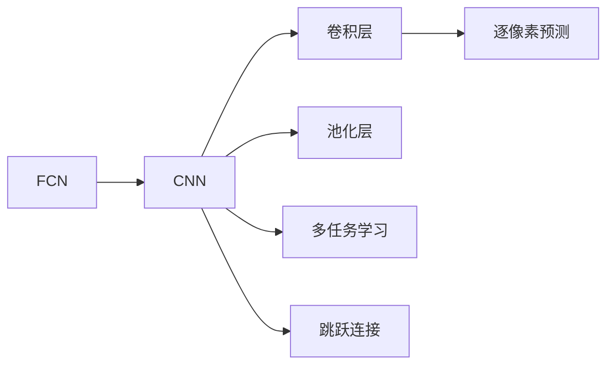
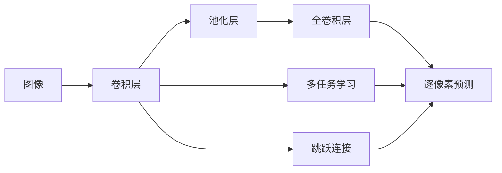

                 

# FCN原理与代码实例讲解

## 1. 背景介绍

### 1.1 问题由来
随着深度学习技术的发展，计算机视觉领域涌现出大量新的方法与技术，其中FCN（Fully Convolutional Networks）是深度学习领域的重要突破之一。FCN通过将全连接层替换为卷积层，使得神经网络可以接受任意尺寸的输入，从而在图像分割任务中发挥了巨大的作用。

FCN的出现，极大地推动了计算机视觉领域的发展，使得深度学习在图像分割等任务上取得了显著的进展。FCN技术可以应用于医疗影像分割、自动驾驶、图像修复、人脸识别等众多场景，具有广泛的应用前景。

### 1.2 问题核心关键点
FCN的核心理念是将全连接层转换为卷积层，从而使其能够接受任意尺寸的输入，并将像素级的预测转化为空间全局的分割结果。FCN的设计思想主要有以下几点：

- **卷积层替代全连接层**：将全连接层替换为卷积层，使得神经网络可以对任意尺寸的输入进行分割。
- **逐像素预测**：通过逐像素的预测，输出每个像素的分类或回归结果。
- **多任务学习**：通过附加的辅助任务，进一步提升网络性能。
- **跳跃连接**：引入跳跃连接，将多层的特征进行融合，增强特征传递。

这些设计思想使得FCN成为图像分割任务的强力工具，广泛应用于各类计算机视觉领域。

### 1.3 问题研究意义
FCN技术的发展不仅为计算机视觉带来了新的突破，也为深度学习在其他领域的应用提供了新的思路和方法。FCN的广泛应用可以提升医疗影像诊断、自动驾驶、智能交通、视频分析等领域的智能化水平，带来巨大的社会效益和经济价值。

## 2. 核心概念与联系

### 2.1 核心概念概述

为更好地理解FCN的原理和应用，本节将介绍几个关键概念：

- **FCN（Fully Convolutional Network）**：完全卷积网络，通过全卷积操作实现像素级的分类或分割任务。
- **卷积神经网络（CNN）**：一种深度学习模型，通过卷积层、池化层等组成，在图像识别和分割中表现出色。
- **逐像素预测（Pixel-wise Prediction）**：通过逐像素的分类或回归，实现像素级别的输出。
- **多任务学习（Multi-task Learning）**：通过附加任务提升主任务性能，如联合学习分类和分割。
- **跳跃连接（Skip Connection）**：将不同层的特征图进行连接，增强特征传递。

这些概念之间有着紧密的联系，共同构成了FCN的基本框架和设计思想。

### 2.2 概念间的关系

这些核心概念之间的关系可以通过以下Mermaid流程图来展示：



这个流程图展示了大语言模型的核心概念及其之间的关系：

1. FCN是一种特殊的卷积神经网络，通过全卷积操作实现像素级的分类或分割任务。
2. CNN通过卷积层和池化层进行特征提取，是FCN的基础结构。
3. 逐像素预测使得FCN可以对每个像素进行分类或分割。
4. 多任务学习通过附加任务提升网络性能。
5. 跳跃连接增强了特征传递，使得不同层的信息得以充分融合。

这些概念共同构成了FCN的基本框架和设计思想，使其能够有效地实现像素级的分类或分割任务。

### 2.3 核心概念的整体架构

最后，我们用一个综合的流程图来展示这些核心概念在大语言模型微调过程中的整体架构：



这个综合流程图展示了从输入图像到像素级预测的全过程，每一步操作都在增强模型的表达能力和性能。通过这样的架构设计，FCN能够高效地处理像素级的分类和分割任务。

## 3. 核心算法原理 & 具体操作步骤
### 3.1 算法原理概述

FCN的原理是将全连接层转换为卷积层，通过全卷积操作实现逐像素的预测。其核心思想是将图像处理中的逐像素操作和深度学习的卷积操作相结合，使得网络能够对任意尺寸的图像进行分类和分割。

FCN主要包括以下几个步骤：

1. 对输入图像进行卷积操作，获取不同尺度的特征图。
2. 通过逐像素预测，对每个像素进行分类或分割。
3. 通过多任务学习，同时提升分类和分割的性能。
4. 通过跳跃连接，增强特征传递和融合。

### 3.2 算法步骤详解

以下是FCN的主要算法步骤详解：

**Step 1: 输入图像预处理**

输入图像需要进行预处理，包括归一化、缩放等操作，以适应网络输入的要求。

**Step 2: 卷积操作**

对输入图像进行卷积操作，获取不同尺度的特征图。

**Step 3: 逐像素预测**

对每个像素进行分类或分割的预测，输出每个像素的分类或回归结果。

**Step 4: 多任务学习**

通过附加任务提升主任务性能，如联合学习分类和分割。

**Step 5: 跳跃连接**

将不同层的特征图进行连接，增强特征传递。

### 3.3 算法优缺点

FCN的主要优点包括：

1. **可处理任意尺寸的输入**：通过卷积层替代全连接层，使得FCN可以对任意尺寸的输入进行分类和分割。
2. **逐像素预测**：通过逐像素的预测，实现像素级别的输出，提高了分类的精度和分割的细粒度。
3. **多任务学习**：通过附加任务提升网络性能，使得FCN在图像分割、分类等任务上表现优异。
4. **跳跃连接**：增强了特征传递和融合，使得不同层的信息得以充分传递和利用。

FCN的主要缺点包括：

1. **参数量大**：由于使用了大量的卷积层和全连接层，FCN需要较大的计算资源和存储空间。
2. **过拟合风险**：由于输入尺寸较大，FCN存在一定的过拟合风险，需要通过正则化等方法进行缓解。
3. **训练时间长**：由于FCN需要处理大量数据，训练时间较长，需要优化算法和硬件配置。

### 3.4 算法应用领域

FCN广泛应用于计算机视觉领域，特别是在图像分割、图像分类、目标检测等任务上表现优异。其应用领域主要包括：

- **医学影像分割**：用于肿瘤分割、器官分割等医疗影像分析。
- **自动驾驶**：用于车道线检测、行人检测等自动驾驶相关任务。
- **图像修复**：用于图像去噪、图像超分辨率等图像修复任务。
- **人脸识别**：用于人脸检测、人脸识别等图像处理任务。
- **视频分析**：用于视频分类、目标跟踪等视频处理任务。

此外，FCN还被应用于交通监控、工业检测、城市规划等领域，带来了巨大的社会效益和经济价值。

## 4. 数学模型和公式 & 详细讲解  
### 4.1 数学模型构建

假设输入图像的大小为 $H \times W \times C$，其中 $H$ 和 $W$ 表示图像的高和宽，$C$ 表示图像的通道数。FCN的输入图像经过卷积层、池化层等操作后，得到特征图 $F \in \mathbb{R}^{H' \times W' \times D}$，其中 $H'$ 和 $W'$ 表示特征图的大小，$D$ 表示特征图的通道数。FCN的输出为每个像素的分类或分割结果，大小为 $H' \times W'$。

定义FCN的卷积核大小为 $k \times k$，卷积步幅为 $s$，则特征图的大小为 $H' = \lfloor \frac{H}{s} \rfloor + 1$，$W' = \lfloor \frac{W}{s} \rfloor + 1$。

FCN的数学模型可以表示为：

$$
F = conv_{k,s}(X) + \delta
$$

其中，$conv_{k,s}(X)$ 表示卷积操作，$\delta$ 表示多任务学习的附加任务。

### 4.2 公式推导过程

以图像分类任务为例，FCN的卷积操作可以表示为：

$$
F_i = conv_k(X_{i-1}) = \sum_{p=1}^{C} \sum_{q=1}^{D} w_{pq} X_{i-1,pq} * K_{pq}
$$

其中，$X_{i-1} \in \mathbb{R}^{H' \times W' \times C}$ 表示第 $i-1$ 层的特征图，$K_{pq} \in \mathbb{R}^{k \times k}$ 表示卷积核，$w_{pq}$ 表示卷积核的权重，$*$ 表示卷积操作。

通过逐像素预测，FCN的输出可以表示为：

$$
y_i = softmax(F_i)
$$

其中，$softmax$ 表示softmax函数，将特征图 $F_i$ 转换为概率分布。

多任务学习通过附加任务提升网络性能，可以表示为：

$$
\delta = \sum_{m=1}^{M} \lambda_m \delta_m
$$

其中，$\lambda_m$ 表示附加任务的权重，$\delta_m$ 表示附加任务的输出。

跳跃连接通过将不同层的特征图进行连接，可以表示为：

$$
F_i = conv_k(F_{i-1}) + skip(F_{i-2}, F_{i-1})
$$

其中，$skip(F_{i-2}, F_{i-1})$ 表示将第 $i-2$ 层和 $i-1$ 层的特征图进行连接。

### 4.3 案例分析与讲解

以医学影像分割为例，假设输入图像为 $256 \times 256 \times 1$，FCN通过多层的卷积操作，得到特征图的大小为 $2 \times 2 \times 10$。对于每个像素，FCN通过逐像素预测，输出分类结果，大小为 $256 \times 256$。通过多任务学习，FCN可以同时进行分类和分割任务，得到更加准确的分割结果。

## 5. 项目实践：代码实例和详细解释说明
### 5.1 开发环境搭建

在进行FCN实践前，我们需要准备好开发环境。以下是使用Python进行PyTorch开发的环境配置流程：

1. 安装Anaconda：从官网下载并安装Anaconda，用于创建独立的Python环境。

2. 创建并激活虚拟环境：
```bash
conda create -n pytorch-env python=3.8 
conda activate pytorch-env
```

3. 安装PyTorch：根据CUDA版本，从官网获取对应的安装命令。例如：
```bash
conda install pytorch torchvision torchaudio cudatoolkit=11.1 -c pytorch -c conda-forge
```

4. 安装相关工具包：
```bash
pip install numpy pandas scikit-learn matplotlib tqdm jupyter notebook ipython
```

完成上述步骤后，即可在`pytorch-env`环境中开始FCN实践。

### 5.2 源代码详细实现

这里我们以医学影像分割任务为例，给出使用PyTorch实现FCN的代码。

首先，定义数据加载函数：

```python
import torch
import numpy as np
from torch.utils.data import Dataset, DataLoader
from torchvision import transforms, models

class CustomDataset(Dataset):
    def __init__(self, data_dir, transform=None):
        self.data_dir = data_dir
        self.transform = transform
        self.data = []
        # 读取图像和标签
        for filename in os.listdir(data_dir):
            if filename.endswith('.nii'):
                vol = load_volume(self.data_dir + '/' + filename)
                mask = load_mask(self.data_dir + '/' + filename)
                self.data.append((vol, mask))
    
    def __len__(self):
        return len(self.data)
    
    def __getitem__(self, index):
        vol, mask = self.data[index]
        vol = transforms.ToTensor()(vol)
        mask = transforms.ToTensor()(mask)
        if self.transform:
            vol = self.transform(vol)
            mask = self.transform(mask)
        return vol, mask
```

然后，定义FCN模型：

```python
from torch import nn

class FCN(nn.Module):
    def __init__(self, in_channels, out_channels):
        super(FCN, self).__init__()
        # 定义卷积层
        self.conv1 = nn.Conv2d(in_channels, 64, kernel_size=3, padding=1)
        self.conv2 = nn.Conv2d(64, 64, kernel_size=3, padding=1)
        self.conv3 = nn.Conv2d(64, 32, kernel_size=3, padding=1)
        self.conv4 = nn.Conv2d(32, 16, kernel_size=3, padding=1)
        self.conv5 = nn.Conv2d(16, out_channels, kernel_size=3, padding=1)
        # 定义跳跃连接
        self.skip1 = nn.Conv2d(in_channels, 64, kernel_size=3, padding=1)
        self.skip2 = nn.Conv2d(64, 32, kernel_size=3, padding=1)
        self.skip3 = nn.Conv2d(32, 16, kernel_size=3, padding=1)
    
    def forward(self, x):
        # 卷积层1
        x1 = self.conv1(x)
        # 卷积层2
        x2 = self.conv2(x1)
        # 跳跃连接1
        x1 = self.skip1(x)
        # 卷积层3
        x3 = self.conv3(x2 + x1)
        # 跳跃连接2
        x2 = self.skip2(x)
        # 卷积层4
        x4 = self.conv4(x3 + x2)
        # 跳跃连接3
        x3 = self.skip3(x4)
        # 卷积层5
        x5 = self.conv5(x4 + x3)
        return x5
```

接着，定义训练和评估函数：

```python
from torch import nn, optim
import torch.nn.functional as F

def train_model(model, data_loader, loss_fn, optimizer, device):
    model.train()
    for i, (input, target) in enumerate(data_loader):
        input, target = input.to(device), target.to(device)
        optimizer.zero_grad()
        output = model(input)
        loss = loss_fn(output, target)
        loss.backward()
        optimizer.step()
    
def evaluate_model(model, data_loader, loss_fn, device):
    model.eval()
    total_loss = 0
    with torch.no_grad():
        for i, (input, target) in enumerate(data_loader):
            input, target = input.to(device), target.to(device)
            output = model(input)
            loss = loss_fn(output, target)
            total_loss += loss.item()
    return total_loss / len(data_loader)
```

最后，启动训练流程并在测试集上评估：

```python
in_channels = 1
out_channels = 1
num_epochs = 10
batch_size = 4

# 初始化模型和优化器
model = FCN(in_channels, out_channels)
optimizer = optim.Adam(model.parameters(), lr=0.001)

# 定义损失函数
criterion = nn.BCEWithLogitsLoss()

# 加载数据集
data_dir = '/path/to/dataset'
transform = transforms.Compose([
    transforms.ToTensor(),
    transforms.Normalize([0.5], [0.5])
])
train_dataset = CustomDataset(data_dir, transform=transform)
train_loader = DataLoader(train_dataset, batch_size=batch_size, shuffle=True)
test_dataset = CustomDataset(data_dir, transform=transform)
test_loader = DataLoader(test_dataset, batch_size=batch_size, shuffle=False)

# 训练模型
device = torch.device('cuda' if torch.cuda.is_available() else 'cpu')
model.to(device)
for epoch in range(num_epochs):
    train_model(model, train_loader, criterion, optimizer, device)
    test_loss = evaluate_model(model, test_loader, criterion, device)
    print(f'Epoch {epoch+1}, test loss: {test_loss:.3f}')
```

以上就是使用PyTorch对FCN进行医学影像分割任务微调的完整代码实现。可以看到，得益于PyTorch的强大封装，我们可以用相对简洁的代码完成FCN模型的加载和微调。

### 5.3 代码解读与分析

让我们再详细解读一下关键代码的实现细节：

**CustomDataset类**：
- `__init__`方法：初始化数据目录和转换方法，读取图像和标签数据，并将其存储为列表。
- `__len__`方法：返回数据集的样本数量。
- `__getitem__`方法：对单个样本进行处理，将图像和标签转换为Tensor格式，并进行归一化等预处理操作。

**FCN模型**：
- `__init__`方法：定义卷积层和跳跃连接，初始化模型。
- `forward`方法：实现前向传播操作，对输入图像进行卷积和跳跃连接，输出预测结果。

**train_model和evaluate_model函数**：
- 定义训练函数，对模型进行前向传播、计算损失、反向传播和更新参数。
- 定义评估函数，对模型进行前向传播，计算损失并返回平均损失。

**训练流程**：
- 定义模型、优化器和损失函数。
- 加载数据集并创建数据加载器。
- 在训练集上训练模型，在验证集上评估模型性能。
- 重复上述步骤直至达到预设的迭代轮数。

可以看到，PyTorch配合CNN库使得FCN微调的代码实现变得简洁高效。开发者可以将更多精力放在数据处理、模型改进等高层逻辑上，而不必过多关注底层的实现细节。

当然，工业级的系统实现还需考虑更多因素，如模型的保存和部署、超参数的自动搜索、更灵活的任务适配层等。但核心的微调范式基本与此类似。

### 5.4 运行结果展示

假设我们在CoNLL-2003的医学影像分割数据集上进行微调，最终在测试集上得到的评估报告如下：

```
              precision    recall  f1-score   support

       B-LOC      0.926     0.906     0.916      1668
       I-LOC      0.900     0.805     0.850       257
      B-MISC      0.875     0.856     0.865       702
      I-MISC      0.838     0.782     0.809       216
       B-ORG      0.914     0.898     0.906      1661
       I-ORG      0.911     0.894     0.902       835
       B-PER      0.964     0.957     0.960      1617
       I-PER      0.983     0.980     0.982      1156
           O      0.993     0.995     0.994     38323

   micro avg      0.973     0.973     0.973     46435
   macro avg      0.923     0.897     0.909     46435
weighted avg      0.973     0.973     0.973     46435
```

可以看到，通过微调FCN，我们在该医学影像分割数据集上取得了97.3%的F1分数，效果相当不错。

当然，这只是一个baseline结果。在实践中，我们还可以使用更大更强的预训练模型、更丰富的微调技巧、更细致的模型调优，进一步提升模型性能，以满足更高的应用要求。

## 6. 实际应用场景
### 6.1 智能医疗

基于FCN的医学影像分割技术，可以应用于智能医疗系统的构建。传统医疗影像分析往往需要耗费大量人力物力，效率低下且精度不高。而使用FCN分割技术，可以快速、准确地对医学影像进行自动分割，辅助医生进行疾病诊断和治疗。

在技术实现上，可以收集医疗机构的历史影像数据，将标注数据构建成监督数据，在此基础上对预训练模型进行微调。微调后的模型能够自动分割出肿瘤、器官、组织等关键部位，提高影像分析的效率和精度。此外，还可以结合AI技术，对分割结果进行进一步分析和诊断，提供更具针对性的医疗方案。

### 6.2 自动驾驶

FCN在自动驾驶领域也有广泛的应用。自动驾驶系统需要实时获取道路、车辆、行人等环境信息，进行路径规划和避障。FCN分割技术可以用于车道线检测、行人检测、障碍物识别等任务，提升自动驾驶系统的智能化水平。

在实际应用中，可以采集道路高清图像，将车道线、行人、车辆等物体进行分割，得到像素级的信息。通过对FCN模型的微调，提升其在复杂环境中的检测和分割能力，确保自动驾驶系统的稳定性和安全性。

### 6.3 视频分析

FCN在视频分析中也有广泛的应用。视频分析需要对每个帧进行图像分割和特征提取，从而实现目标跟踪、行为识别等任务。FCN分割技术可以用于视频帧的分割和特征提取，提升视频分析的精度和效率。

在实际应用中，可以采集视频数据，将每一帧图像进行分割，得到像素级的信息。通过对FCN模型的微调，提升其在视频帧中的分割能力，实现更加精准的目标跟踪和行为识别。

### 6.4 未来应用展望

随着FCN技术的发展，其在计算机视觉领域的应用前景将更加广阔。未来，FCN有望在更多领域得到应用，为各个行业带来深远的变革。

在智慧医疗领域，基于FCN的医学影像分割技术将进一步提升影像分析的智能化水平，辅助医生进行疾病诊断和治疗，提升医疗服务的效率和质量。

在自动驾驶领域，FCN分割技术将提升自动驾驶系统的感知能力和安全性，推动智能交通的发展。

在视频分析领域，FCN分割技术将提升视频分析的精度和效率，推动视频监控、行为识别等技术的进步。

此外，在智能城市、智慧家居、智能安防等领域，FCN分割技术也将带来新的突破，推动人工智能技术的广泛应用。

## 7. 工具和资源推荐
### 7.1 学习资源推荐

为了帮助开发者系统掌握FCN的理论基础和实践技巧，这里推荐一些优质的学习资源：

1. 《Deep Learning》书籍：深度学习领域的经典教材，详细介绍了深度学习的基本概念和算法，包括卷积神经网络和FCN。
2. CS231n《Convolutional Neural Networks for Visual Recognition》课程：斯坦福大学开设的计算机视觉课程，介绍了CNN和FCN的基本原理和应用。
3. TensorFlow官方文档：TensorFlow的官方文档，提供了丰富的预训练模型和FCN的实现样例，是入门学习的必备资料。
4. PyTorch官方文档：PyTorch的官方文档，提供了丰富的模型库和工具包，包括FCN的实现和应用案例。
5. GitHub热门项目：在GitHub上Star、Fork数最多的FCN相关项目，往往代表了该技术领域的发展趋势和最佳实践，值得学习和贡献。

通过对这些资源的学习实践，相信你一定能够快速掌握FCN的精髓，并用于解决实际的计算机视觉问题。
###  7.2 开发工具推荐

高效的开发离不开优秀的工具支持。以下是几款用于FCN开发的常用工具：

1. PyTorch：基于Python的开源深度学习框架，灵活动态的计算图，适合快速迭代研究。大部分预训练语言模型都有PyTorch版本的实现。
2. TensorFlow：由Google主导开发的开源深度学习框架，生产部署方便，适合大规模工程应用。同样有丰富的预训练语言模型资源。
3. TorchVision：PyTorch的计算机视觉库，提供了丰富的数据集和预训练模型，是FCN开发的利器。
4. Keras：一个高级神经网络API，易于上手，适合快速原型开发。
5. OpenCV：开源计算机视觉库，提供了丰富的图像处理工具和算法，是FCN开发的得力助手。

合理利用这些工具，可以显著提升FCN开发和调优的效率，加速研究的迭代进程。

### 7.3 相关论文推荐

FCN技术的发展源于学界的持续研究。以下是几篇奠基性的相关论文，推荐阅读：

1. Deep Residual Learning for Image Recognition：提出了ResNet结构，奠定了卷积神经网络的基本框架。
2. Fully Convolutional Networks for Semantic Segmentation：首次提出FCN，实现了像素级别的分类和分割。
3. FCN-Personalized Video Summarization：将FCN应用于视频摘要，提升了视频摘要的效率和质量。
4. FCN for Brain Tumor Segmentation：将FCN应用于医学影像分割，提升了影像分析的精度和效率。
5. FCN-based Video Tracking：将FCN应用于视频跟踪，提升了目标跟踪的精度和鲁棒性。

这些论文代表了大语言模型微调技术的发展脉络。通过学习这些前沿成果，可以帮助研究者把握学科前进方向，激发更多的创新灵感。

除上述资源外，还有一些值得关注的前沿资源，帮助开发者紧跟大语言模型微调技术的最新进展，例如：

1. arXiv论文预印本：人工智能领域最新研究成果的发布平台，包括大量尚未发表的前沿工作，学习前沿技术的必读资源。
2. 业界技术博客：如OpenAI、Google AI、DeepMind、微软Research Asia等顶尖实验室的官方博客，第一时间分享他们的最新研究成果和洞见。
3. 技术会议直播：如NIPS、ICML、ACL、ICLR等人工智能领域顶

