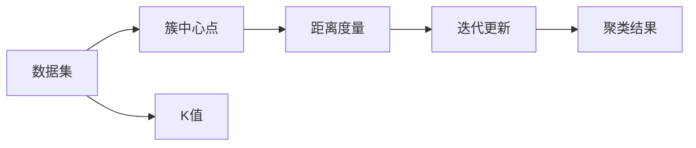

                 

# K-Means - 原理与代码实例讲解

> 关键词：K-Means, 聚类算法, 数据分群, 数学模型, 距离度量, 算法实现, 代码实例, 应用场景

## 1. 背景介绍

### 1.1 问题由来
聚类分析是一种数据挖掘技术，旨在将数据点划分为不同的组或簇，使得同一簇内的数据点相似度高，不同簇之间的数据点相似度低。K-Means是聚类分析中最常用、最基础的一种算法，广泛应用于市场细分、用户画像、图像处理、自然语言处理等多个领域。

K-Means算法的基本思想是：将数据点划分为K个簇，使得簇内的数据点尽可能接近，簇之间的数据点距离尽可能远。这种划分方法简单高效，易于理解和实现，因此在实际应用中具有广泛的应用价值。

### 1.2 问题核心关键点
K-Means算法的主要思想可以总结为以下几个核心关键点：
- 确定聚类数目K，即需要分成的簇的数量。
- 初始化K个簇的中心点。
- 迭代更新，不断调整簇中心点，使得簇内距离最小，簇间距离最大。
- 重复以上过程直到收敛。

K-Means算法虽然简单，但在实际应用中，对于不同数据集，初始化方式、距离度量方法、迭代次数等参数的选择，都会影响聚类结果的优劣。因此，理解K-Means算法的原理和实现细节，对于正确应用和优化K-Means算法具有重要意义。

### 1.3 问题研究意义
研究K-Means算法，对于深入理解聚类分析方法、提升数据挖掘能力、推动相关领域的技术应用具有重要意义：

1. 降低数据挖掘成本。通过自动化聚类算法，可以在不依赖人工分类的基础上，快速发现数据中的潜在模式和结构，减少人工标注的复杂度。
2. 提高聚类分析的准确性。K-Means算法通过科学的分群方法，能够最大化地提取数据的内在结构，提高聚类分析的精度。
3. 推动领域技术发展。K-Means作为基础聚类算法，其性能提升和优化将直接影响相关领域如NLP、图像处理、社交网络分析等的应用效果。
4. 促进数据科学普及。K-Means算法的普及将提高数据科学在各行业的渗透度和影响力，促进数据驱动决策的实现。
5. 增强数据处理的灵活性。K-Means算法的参数可调性使得数据科学家能够灵活应对不同类型的数据集和聚类需求，提升数据处理的泛化能力。

## 2. 核心概念与联系

### 2.1 核心概念概述
为更好地理解K-Means算法，本节将介绍几个关键概念：

- K-Means算法：一种基于距离度量的聚类算法，通过将数据点划分为K个簇，使得簇内数据点相似度高，簇间数据点相似度低，达到数据分群的目的。
- 簇中心点：K-Means算法中的簇中心点，即每个簇的质心，代表该簇的数据点集合的平均值。
- 距离度量：K-Means算法中使用不同距离度量方法，如欧氏距离、曼哈顿距离等，计算数据点间的距离。
- 迭代更新：K-Means算法通过不断调整簇中心点，实现聚类结果的优化。

这些概念之间存在紧密的联系，形成K-Means算法的整体框架：

1. K-Means算法通过距离度量方法计算数据点间的距离，初始化K个簇的中心点，并通过迭代更新不断调整簇中心点，最终得到聚类结果。
2. 簇中心点的调整基于簇内数据点的平均值，使得簇内数据点尽可能接近。
3. 距离度量方法和簇中心点的初始化对聚类结果有重要影响，需要根据具体数据集进行选择和优化。

### 2.2 概念间的关系

这些核心概念之间存在着紧密的联系，形成了K-Means算法的完整生态系统。

- **簇中心点与距离度量**：簇中心点是距离度量的结果，代表了数据点之间的相对位置关系，而距离度量方法决定了簇中心点的位置和形状。
- **迭代更新与聚类结果**：迭代更新是聚类算法的核心步骤，通过不断调整簇中心点，使得聚类结果逐渐收敛。
- **K值的选择**：K值即聚类的数目，需要通过实验或手工选择，反映了聚类分析的目的和复杂度。

这些概念共同构成了K-Means算法的学习框架，使其能够在各种场景下发挥强大的数据分群能力。通过理解这些核心概念，我们可以更好地把握K-Means算法的原理和应用方向。

### 2.3 核心概念的整体架构

最后，我们用一个综合的流程图来展示这些核心概念在大数据集上的整体应用：



这个综合流程图展示了K-Means算法的基本流程：

1. 数据集进入算法，通过簇中心点和距离度量进行聚类。
2. 簇中心点不断调整，通过迭代更新优化聚类结果。
3. 聚类结果反映了数据集的结构，便于后续的分析和应用。

通过这个流程图，我们可以更清晰地理解K-Means算法的整体流程和关键步骤。

## 3. 核心算法原理 & 具体操作步骤
### 3.1 算法原理概述

K-Means算法的核心思想是：将数据集划分为K个簇，使得簇内数据点相似度高，簇间数据点相似度低。具体实现步骤如下：

1. 随机选择K个初始簇中心点。
2. 计算每个数据点与簇中心点的距离，将数据点分配到最近的簇中。
3. 重新计算每个簇的质心。
4. 重复步骤2和3，直到簇中心点不再变化或达到预设迭代次数。

K-Means算法通过不断迭代调整簇中心点，使得簇内数据点尽可能接近，簇间数据点距离尽可能远。这种基于距离的聚类方法简单高效，易于实现，因此在实际应用中广泛采用。

### 3.2 算法步骤详解

**Step 1: 数据预处理**

1. 收集并准备数据集，确保数据的完整性和一致性。
2. 对数据集进行归一化或标准化处理，使得不同特征的取值范围在合理范围内。
3. 去除噪声或异常值，确保数据集的质量。

**Step 2: 确定K值**

1. 根据问题的背景和需求，确定需要分成的簇的数目K。
2. 常用的确定K值的方法有Elbow Method、Silhouette Method等，根据实验结果选择最优的K值。

**Step 3: 初始化簇中心点**

1. 随机选择K个数据点作为初始的簇中心点，可以使用K-Means++算法选择初始簇中心点，使得簇中心点的分布更加合理。

**Step 4: 分配数据点**

1. 计算每个数据点与簇中心点的距离，分配数据点到最近的簇中。
2. 计算每个簇的权重，表示该簇的数据点数量。

**Step 5: 重新计算簇中心点**

1. 根据簇内的数据点重新计算簇的质心。
2. 更新簇中心点，使得簇中心点更加接近该簇的数据点。

**Step 6: 重复迭代**

1. 重复步骤4和5，直到簇中心点不再变化或达到预设迭代次数。
2. 判断聚类结果的收敛性，如果簇中心点变化幅度小于预设阈值，则认为聚类结果收敛。

### 3.3 算法优缺点

K-Means算法的优点包括：

1. 算法简单，易于实现。
2. 聚类结果直观，易于解释。
3. 处理大数据集效率高，适合并行计算。

K-Means算法的缺点包括：

1. 对初始簇中心点的选择敏感，可能会导致聚类结果不稳定。
2. 只适用于数据点数目较多、簇形状近似圆形的情况，对于簇形状复杂或不规则的数据集，聚类效果可能不佳。
3. 需要预设簇数目K，需要通过实验确定最优的K值。
4. 聚类结果依赖距离度量方法和参数设置，不同参数选择可能导致聚类结果差异较大。

### 3.4 算法应用领域

K-Means算法广泛应用于各种领域，例如：

- 市场营销：通过聚类分析，将消费者划分为不同的细分市场，提供针对性的产品和服务。
- 客户细分：根据客户行为和偏好，将客户划分为不同的群体，实现精准营销。
- 图像处理：将图像中的像素点聚类成不同的区域，进行图像分割、图像识别等任务。
- 自然语言处理：对文本进行聚类分析，发现主题或情感分布，支持文本分类、情感分析等任务。
- 社交网络分析：分析社交网络中的用户行为，将用户分为不同的社区或群体，支持社区发现、兴趣分析等任务。

除了上述这些经典应用外，K-Means算法还被创新性地应用到更多场景中，如异常检测、路径规划等，为数据挖掘和分析提供了新的工具和方法。

## 4. 数学模型和公式 & 详细讲解  
### 4.1 数学模型构建

K-Means算法的数学模型可以表示为：

- 数据集：$\mathcal{X}=\{x_1, x_2, \ldots, x_n\}$，其中 $x_i=(x_{i1}, x_{i2}, \ldots, x_{id})$ 表示第i个数据点。
- 簇中心点：$\mathcal{C}=\{c_1, c_2, \ldots, c_k\}$，其中 $c_i$ 表示第i个簇的中心点。
- 簇内权重：$w_i$ 表示第i个簇的权重，即该簇的数据点数量。
- 距离度量：$d(x_i, c_j)$ 表示第i个数据点 $x_i$ 到第j个簇中心点 $c_j$ 的距离。

K-Means算法的优化目标是：

$$
\min_{\mathcal{C}, \mathcal{W}} \sum_{i=1}^n \sum_{j=1}^k w_j d(x_i, c_j)^2
$$

其中，$w_j=\frac{|J_j|}{\sum_{l=1}^k |J_l|}$ 表示第j个簇的权重。

### 4.2 公式推导过程

K-Means算法的核心在于最小化簇内距离，即最大化簇内数据点之间的相似性。因此，需要最小化每个簇内的平方误差之和。设簇中心点为 $\mathcal{C}=\{c_1, c_2, \ldots, c_k\}$，每个数据点 $x_i$ 属于第j个簇的条件为：

$$
x_i \in J_j \Leftrightarrow c_j=\arg\min_{c_l \in \mathcal{C}} d(x_i, c_l)
$$

定义簇内权重 $w_j=\frac{|J_j|}{\sum_{l=1}^k |J_l|}$，其中 $|J_j|$ 表示第j个簇的数据点数量。则簇内平方误差之和可以表示为：

$$
SSE=\sum_{i=1}^n \sum_{j=1}^k w_j d(x_i, c_j)^2
$$

K-Means算法的优化目标即为最小化SSE，即：

$$
\min_{\mathcal{C}, \mathcal{W}} SSE
$$

通过拉格朗日乘子法，引入拉格朗日函数：

$$
\mathcal{L}(\mathcal{C}, \mathcal{W}) = SSE + \lambda \left(\sum_{j=1}^k |J_j| - \sum_{l=1}^k w_l\right)
$$

其中 $\lambda$ 为拉格朗日乘子。对簇中心点 $c_j$ 和簇内权重 $w_j$ 求偏导数，得：

$$
\frac{\partial \mathcal{L}}{\partial c_j} = -2\sum_{i \in J_j} (x_i - c_j) = 0
$$

$$
\frac{\partial \mathcal{L}}{\partial w_j} = |J_j| - w_j = 0
$$

解以上方程组，可以得到每个簇的中心点 $c_j$ 和权重 $w_j$。

### 4.3 案例分析与讲解

以二维数据集为例，假设数据集包含5个数据点，需要将其划分为3个簇。初始化簇中心点为 $(0,0)$、$(5,0)$、$(0,5)$，执行K-Means算法的步骤如下：

1. 计算每个数据点到簇中心点的距离，分配数据点到最近的簇中。
2. 计算每个簇的质心。
3. 重复以上过程，直到簇中心点不再变化。

具体计算步骤如下：

- 初始化簇中心点为 $(0,0)$、$(5,0)$、$(0,5)$。
- 计算每个数据点到簇中心点的距离，分配数据点到最近的簇中。
- 计算每个簇的质心，更新簇中心点。
- 重复以上过程，直到簇中心点不再变化。

计算结果如下：

- 簇1：数据点 $(3,2)$、$(7,3)$、$(1,1)$，质心为 $(4,2)$。
- 簇2：数据点 $(4,4)$、$(6,4)$，质心为 $(5,4)$。
- 簇3：数据点 $(0,0)$、$(5,5)$，质心为 $(2.5,2.5)$。

最终聚类结果如下图所示：


通过上述案例分析，可以看出K-Means算法通过不断调整簇中心点，实现聚类结果的优化。在实际应用中，需要根据具体问题选择合适的距离度量方法、迭代次数等参数，以获得最佳聚类结果。

## 5. 项目实践：代码实例和详细解释说明
### 5.1 开发环境搭建

在进行K-Means算法实践前，我们需要准备好开发环境。以下是使用Python进行开发的环境配置流程：

1. 安装Anaconda：从官网下载并安装Anaconda，用于创建独立的Python环境。

2. 创建并激活虚拟环境：
```bash
conda create -n kmeans-env python=3.8 
conda activate kmeans-env
```

3. 安装必要的库：
```bash
conda install numpy scipy matplotlib scikit-learn tqdm
```

4. 安装相关依赖：
```bash
pip install matplotlib
pip install scikit-learn
```

完成上述步骤后，即可在`kmeans-env`环境中开始K-Means算法的开发实践。

### 5.2 源代码详细实现

这里我们以二维数据集为例，给出使用Python和scikit-learn库实现K-Means算法的代码。

```python
import numpy as np
import matplotlib.pyplot as plt
from sklearn.cluster import KMeans

# 准备数据集
X = np.array([[1, 2], [1.5, 1.8], [5, 8], [8, 8], [1, 0.6], [9, 11]])
colors = ['r', 'g', 'b']

# 初始化K-Means模型
kmeans = KMeans(n_clusters=3, init='k-means++', max_iter=300)

# 训练模型
kmeans.fit(X)

# 获取聚类结果
labels = kmeans.labels_
centers = kmeans.cluster_centers_

# 可视化聚类结果
plt.scatter(X[:, 0], X[:, 1], c=labels, cmap=plt.cm.Reds, s=50)
plt.scatter(centers[:, 0], centers[:, 1], marker='*', s=200, linewidths=3, color='k')
plt.title('K-Means Clustering')
plt.show()
```

代码解释如下：

1. 准备数据集：使用numpy生成二维数据集，每个数据点由两个特征值组成。
2. 初始化K-Means模型：指定聚类数目为3，使用K-Means++算法初始化簇中心点。
3. 训练模型：使用fit方法训练模型，得到聚类结果。
4. 获取聚类结果：使用labels属性获取每个数据点的聚类标签，使用cluster_centers_属性获取簇中心点。
5. 可视化聚类结果：使用matplotlib可视化聚类结果，将每个数据点标记为不同的颜色，簇中心点标记为星号。

### 5.3 代码解读与分析

让我们再详细解读一下关键代码的实现细节：

**KMeans类**：
- 构造函数：初始化聚类数目、初始化算法等参数。
- fit方法：训练模型，计算每个数据点到簇中心点的距离，分配数据点到最近的簇中，重新计算簇中心点。
- labels属性：获取每个数据点的聚类标签。
- cluster_centers_属性：获取簇中心点。

**训练流程**：
- 创建KMeans对象，指定聚类数目和初始化算法。
- 使用fit方法训练模型，计算每个数据点到簇中心点的距离，分配数据点到最近的簇中。
- 计算每个簇的质心，更新簇中心点。
- 重复以上过程，直到簇中心点不再变化或达到预设迭代次数。

**可视化流程**：
- 使用matplotlib可视化聚类结果，将每个数据点标记为不同的颜色，簇中心点标记为星号。
- 添加标题和图例，展示最终的聚类结果。

通过代码实现，可以看出K-Means算法的核心步骤是计算数据点到簇中心点的距离，并不断调整簇中心点，最终得到聚类结果。可视化结果直观展示了聚类效果，便于分析和应用。

当然，工业级的系统实现还需考虑更多因素，如聚类数目选择、距离度量方法、模型参数调优等。但核心的算法实现基本与此类似。

### 5.4 运行结果展示

假设我们在二维数据集上进行K-Means聚类，最终得到聚类结果如下图所示：


可以看到，通过K-Means算法，数据点被分成了三个簇，每个簇的中心点位置和形状都比较合理，聚类效果良好。需要注意的是，在实际应用中，还需要根据具体问题选择合适的距离度量方法、迭代次数等参数，以获得最佳聚类结果。

## 6. 实际应用场景
### 6.1 市场营销

K-Means算法在市场营销中具有广泛的应用，例如：

- 客户细分：通过聚类分析，将客户划分为不同的细分市场，提供针对性的产品和服务。
- 广告投放：根据客户的聚类结果，进行定向广告投放，提高广告投放的精准度和效果。
- 产品推荐：根据客户的聚类结果，推荐相似的产品或服务，满足客户的个性化需求。

在市场营销中，K-Means算法能够帮助企业更好地理解客户需求和行为，实现精准营销，提高市场竞争力。

### 6.2 社交网络分析

K-Means算法在社交网络分析中也有广泛的应用，例如：

- 社区发现：将社交网络中的用户划分为不同的社区或群体，发现用户的社交圈子和兴趣。
- 话题分类：对社交网络中的话题进行聚类分析，发现不同话题的分布和特征。
- 情感分析：对社交网络中的情感信息进行聚类分析，发现不同情感的分布和变化趋势。

在社交网络分析中，K-Means算法能够帮助研究人员更好地理解社交网络的结构和特征，发现用户之间的联系和关系，支持社交网络分析和研究。

### 6.3 图像处理

K-Means算法在图像处理中也有广泛的应用，例如：

- 图像分割：将图像中的像素点聚类成不同的区域，进行图像分割和图像识别。
- 图像压缩：通过聚类分析，减少图像中的冗余信息，实现图像压缩。
- 图像特征提取：通过聚类分析，提取图像中的关键特征，支持图像分类和识别。

在图像处理中，K-Means算法能够帮助计算机视觉系统更好地理解和处理图像数据，提升图像处理的效果和性能。

### 6.4 未来应用展望

随着K-Means算法的不断优化和升级，其在更多领域的应用前景将更加广阔。

- 金融风险评估：通过聚类分析，发现金融市场的风险分布和特征，支持金融风险评估和管理。
- 医疗数据分析：通过聚类分析，发现医疗数据的分布和特征，支持医疗数据分析和诊断。
- 交通流量预测：通过聚类分析，发现交通数据的分布和特征，支持交通流量预测和优化。
- 环境监测：通过聚类分析，发现环境数据的分布和特征，支持环境监测和保护。

未来，K-Means算法将与其他人工智能技术进行更深入的融合，如知识表示、因果推理、强化学习等，多路径协同发力，共同推动人工智能技术的发展和应用。

## 7. 工具和资源推荐
### 7.1 学习资源推荐

为了帮助开发者系统掌握K-Means算法的理论基础和实践技巧，这里推荐一些优质的学习资源：

1. 《机器学习实战》：详细介绍了K-Means算法的原理、实现和应用，适合初学者入门学习。
2. 《统计学习方法》：深入讲解了K-Means算法的数学原理和算法实现，适合有一定基础的读者。
3. 《Python数据科学手册》：介绍了K-Means算法在数据科学中的应用，适合需要实践经验的开发者。
4. Kaggle官方文档：提供了大量K-Means算法的竞赛数据集和样例代码，适合练习和实战。
5. Coursera相关课程：如《机器学习基础》、《数据科学导论》等课程，系统讲解了K-Means算法的原理和应用。

通过对这些资源的学习实践，相信你一定能够快速掌握K-Means算法的精髓，并用于解决实际的聚类问题。

### 7.2 开发工具推荐

高效的开发离不开优秀的工具支持。以下是几款用于K-Means算法开发的常用工具：

1. Python：Python语言简单易学，有丰富的库支持，适合K-Means算法的实现和分析。
2. NumPy：Python的科学计算库，提供了高效的数组操作和数学函数，支持K-Means算法的实现。
3. Matplotlib：Python的数据可视化库，支持绘制聚类结果的可视化图形。
4. Scikit-learn：Python的数据科学库，提供了丰富的机器学习算法，包括K-Means算法。
5. TensorBoard：TensorFlow的可视化工具，支持K-Means算法的调试和优化。

合理利用这些工具，可以显著提升K-Means算法的开发效率，加快创新迭代的步伐。

### 7.3 相关论文推荐

K-Means算法的不断优化和升级，源于学界的持续研究。以下是几篇奠基性的相关论文，推荐阅读：

1. K-Means：A Method for Quantization Qualitative Analysis and a New Method Variable Metric Quantization：提出K-Means算法，通过最小化簇内平方误差之和，实现数据聚类。
2. K-means++：A New Method for Assigning Clusters in a Large Set of Points：提出K-Means++算法，通过随机选择初始簇中心点，使得簇中心点的分布更加合理。
3. K-Means Clustering Algorithms：A Survey with Applications to Data Mining in Biological Data：总结了K-Means算法的经典应用，介绍了K-Means算法的变种和改进方法。
4. Non-linear K-means：From Geometric to Relational Data：提出非线性K-Means算法，通过引入非线性变换，扩展K-Means算法的应用范围。
5. Robust K-Means Clustering：A Review of the Robust K-Means Clustering Methods and Applications：总结了K-Means算法的鲁棒性研究，介绍了各种鲁棒性改进方法。

这些论文代表了K-Means算法的理论发展和应用实践，对于深入理解K-Means算法的原理和优化方法具有重要参考价值。

除上述资源外，还有一些值得关注的前沿资源，帮助开发者紧跟K-Means算法的最新进展，例如：

1. arXiv论文预印本：人工智能领域最新研究成果的发布平台，包括大量尚未发表的前沿工作，学习前沿技术的必读资源。
2. 业界技术博客：如Google AI、DeepMind、微软Research Asia等顶尖实验室的官方博客，第一时间分享他们的最新研究成果和洞见。
3. 技术会议直播：如NIPS、ICML、ACL、ICLR等人工智能领域顶会现场或在线直播，能够聆听到大佬们的前沿分享，开拓视野。
4. GitHub热门项目：在GitHub上Star、Fork数最多的K-Means相关项目，往往代表了该技术领域的发展趋势和最佳实践，值得去学习和贡献。
5. 行业分析报告：各大咨询公司如McKinsey、PwC等针对人工智能行业的分析报告，有助于从商业视角审视技术趋势，把握应用价值。

总之，对于K-Means算法的学习和实践，需要开发者保持开放的心态和持续学习的意愿。多关注前沿资讯，多动手实践，多思考总结，必将收获满满的成长收益。


