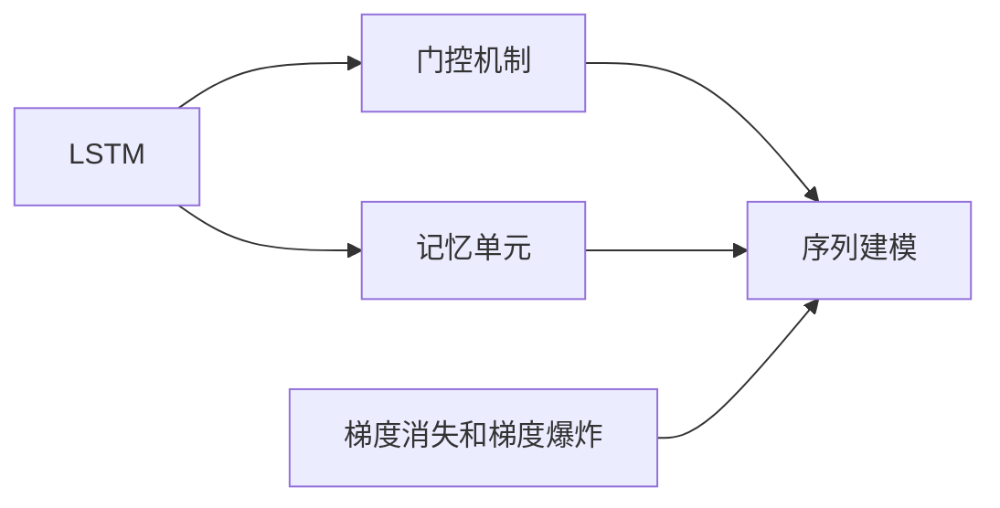
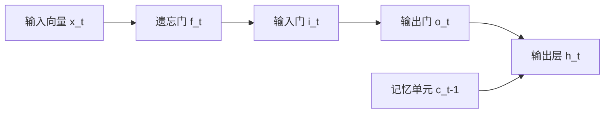
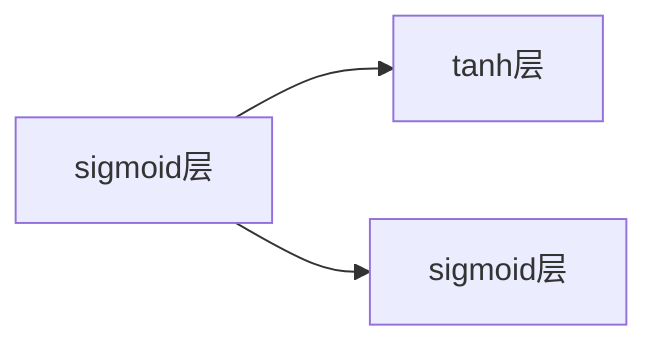
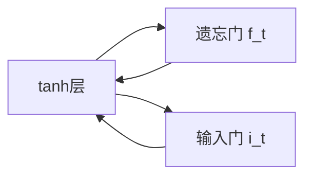
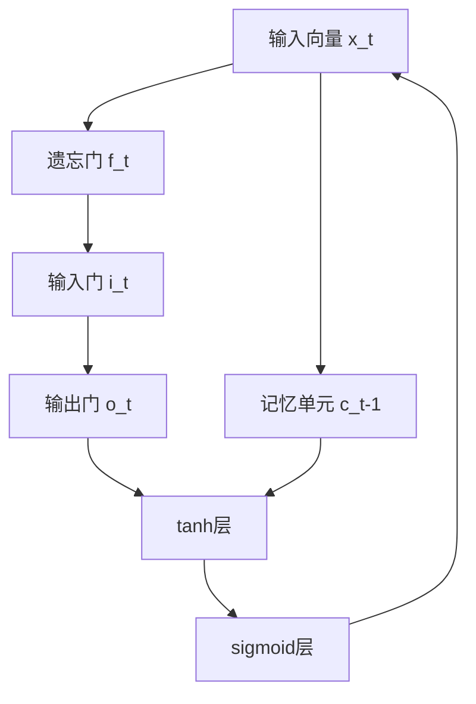

                 

# Long Short-Term Memory (LSTM)原理与代码实例讲解

> 关键词：LSTM,长短期记忆,神经网络,序列建模,深度学习

## 1. 背景介绍

### 1.1 问题由来
在深度学习中，传统的前馈神经网络（Feedforward Neural Networks, FNNs）难以处理具有明显时间序列依赖的数据。例如，语音识别、文本翻译等任务，往往需要模型具备记忆和理解长期依赖的能力。为了解决这一问题，Hochreiter和Schmidhuber在1997年提出了长短期记忆（Long Short-Term Memory, LSTM）网络，作为一种特殊的递归神经网络（RNNs）。

LSTM网络通过门控机制（Gated Mechanisms）来控制信息的流动，可以有效地解决梯度消失和梯度爆炸的问题，具有强大的序列建模能力，成为了处理序列数据的标准工具。LSTM网络已经在语音识别、文本生成、机器翻译、自然语言理解等领域取得了显著的成果。

### 1.2 问题核心关键点
LSTM网络的核心在于其内部的门控结构。包括三个门：遗忘门（Forget Gate）、输入门（Input Gate）和输出门（Output Gate）。每个门通过一个sigmoid层和一个tanh层构成。此外，LSTM网络中还包含一个记忆单元（Memory Cell），用于存储和传递信息。

LSTM网络通过门控机制来决定信息是遗忘、更新还是输出，从而在处理序列数据时能够有效利用历史信息，并忽略无用信息，提高模型的性能。LSTM网络的学习过程可以视为通过调整门控参数和记忆单元状态，优化模型对序列数据的预测能力。

### 1.3 问题研究意义
LSTM网络的提出，使得深度学习在序列数据处理上有了新的突破。通过对序列数据的深度学习，LSTM网络能够在语音识别、机器翻译、文本生成等任务上取得优异的效果，显著提升了NLP和语音处理领域的技术水平。LSTM网络的强大序列建模能力，使其成为处理时间序列数据的重要工具，推动了深度学习技术的广泛应用。

## 2. 核心概念与联系

### 2.1 核心概念概述

为了更好地理解LSTM网络的工作原理，本节将介绍几个密切相关的核心概念：

- 长短期记忆（Long Short-Term Memory, LSTM）：一种特殊的递归神经网络（RNNs），用于处理序列数据。LSTM通过门控机制和记忆单元来控制信息的流动，具有处理长序列数据的强大能力。

- 门控机制（Gated Mechanisms）：包括遗忘门、输入门和输出门，用于控制信息的流动。每个门通过一个sigmoid层和一个tanh层构成，输出一个0到1之间的值，表示信息的保留或丢弃。

- 记忆单元（Memory Cell）：用于存储和传递信息。记忆单元通过tanh层进行更新，其状态能够长期保持，记忆历史信息。

- 序列建模（Sequence Modeling）：利用序列数据的特定结构，通过递归神经网络或变体结构（如LSTM、GRU）进行建模。

- 梯度消失和梯度爆炸（Vanishing Gradient and Exploding Gradient）：在传统RNNs中，由于链式法则，反向传播过程中梯度可能被指数级放大或缩小，导致训练困难。LSTM网络通过门控机制避免了这一问题。

这些核心概念之间的逻辑关系可以通过以下Mermaid流程图来展示：



这个流程图展示了大语言模型微调过程中各个核心概念之间的关系：

1. LSTM通过门控机制和记忆单元来控制信息的流动，从而处理序列数据。
2. 门控机制和记忆单元是LSTM网络的核心结构。
3. 序列建模是通过LSTM网络对序列数据进行建模的整个过程。
4. 梯度消失和梯度爆炸是LSTM网络在处理长序列数据时可能面临的问题。

通过这个流程图，我们可以更清晰地理解LSTM网络的工作原理和优化方向。

### 2.2 概念间的关系

这些核心概念之间存在着紧密的联系，形成了LSTM网络的完整生态系统。下面我们通过几个Mermaid流程图来展示这些概念之间的关系。

#### 2.2.1 LSTM网络的结构



这个流程图展示了LSTM网络的结构。输入向量 $x_t$ 经过三个门控机制后，与记忆单元 $c_{t-1}$ 更新，最终输出到输出层 $h_t$。

#### 2.2.2 门控机制的组成



这个流程图展示了门控机制的组成。遗忘门 $f_t$ 和输入门 $i_t$ 通过sigmoid层控制信息的保留和更新，输出门 $o_t$ 通过sigmoid层控制信息的输出。

#### 2.2.3 记忆单元的更新



这个流程图展示了记忆单元的更新。遗忘门 $f_t$ 和输入门 $i_t$ 控制记忆单元 $c_t$ 的更新。

### 2.3 核心概念的整体架构

最后，我们用一个综合的流程图来展示LSTM网络的整体架构：



这个综合流程图展示了LSTM网络从输入到输出的完整流程。输入向量 $x_t$ 通过三个门控机制和记忆单元 $c_t$ 的更新，最终输出到输出层 $h_t$。

## 3. 核心算法原理 & 具体操作步骤
### 3.1 算法原理概述

LSTM网络通过门控机制来控制信息的流动，从而实现序列数据的建模。其基本思想是：

1. 输入门 $i_t$ 控制新信息的输入，保留旧信息的部分内容。
2. 遗忘门 $f_t$ 控制旧信息的遗忘，更新记忆单元 $c_t$ 的内容。
3. 输出门 $o_t$ 控制新信息的输出，与记忆单元 $c_t$ 的输出相关联。

LSTM网络的更新过程如下：

- 输入门 $i_t$ 计算新信息的输入量 $g_t$。
- 遗忘门 $f_t$ 计算旧信息的遗忘量 $f_t$。
- 记忆单元 $c_t$ 更新，保留部分旧信息，引入新信息。
- 输出门 $o_t$ 计算当前状态的输出量 $h_t$。

LSTM网络的数学表达如下：

$$
\begin{aligned}
i_t &= \sigma(W_i x_t + U_i h_{t-1} + b_i) \\
f_t &= \sigma(W_f x_t + U_f h_{t-1} + b_f) \\
g_t &= \tanh(W_g x_t + U_g h_{t-1} + b_g) \\
o_t &= \sigma(W_o x_t + U_o h_{t-1} + b_o) \\
c_t &= f_t \odot c_{t-1} + i_t \odot g_t \\
h_t &= o_t \odot \tanh(c_t)
\end{aligned}
$$

其中，$\sigma$ 表示 sigmoid 函数，$\tanh$ 表示双曲正切函数，$\odot$ 表示逐元素乘法，$W$ 和 $U$ 表示矩阵权重，$b$ 表示偏置。

### 3.2 算法步骤详解

下面将详细讲解LSTM网络的算法步骤：

1. 输入门 $i_t$ 计算新信息的输入量 $g_t$：
   $$
   i_t = \sigma(W_i x_t + U_i h_{t-1} + b_i)
   $$

2. 遗忘门 $f_t$ 计算旧信息的遗忘量 $f_t$：
   $$
   f_t = \sigma(W_f x_t + U_f h_{t-1} + b_f)
   $$

3. 记忆单元 $c_t$ 更新，保留部分旧信息，引入新信息：
   $$
   g_t = \tanh(W_g x_t + U_g h_{t-1} + b_g) \\
   c_t = f_t \odot c_{t-1} + i_t \odot g_t
   $$

4. 输出门 $o_t$ 计算当前状态的输出量 $h_t$：
   $$
   o_t = \sigma(W_o x_t + U_o h_{t-1} + b_o) \\
   h_t = o_t \odot \tanh(c_t)
   $$

### 3.3 算法优缺点

LSTM网络具有以下优点：

- 能够有效处理长序列数据。LSTM网络通过门控机制和记忆单元，可以较好地记忆历史信息，避免梯度消失和梯度爆炸问题。
- 序列建模能力强。LSTM网络能够处理变长的序列数据，适用于语音识别、文本生成、机器翻译等任务。
- 易于扩展。LSTM网络可以通过堆叠多层来处理更复杂的数据结构，具有较强的通用性。

同时，LSTM网络也存在一些缺点：

- 计算复杂度高。LSTM网络的计算量较大，需要大量的计算资源和时间。
- 难以训练。LSTM网络的超参数较多，且梯度消失和梯度爆炸问题可能导致训练困难。
- 模型复杂度高。LSTM网络的结构较为复杂，难以理解其内部机制和性能。

### 3.4 算法应用领域

LSTM网络已经在多个领域得到了广泛的应用，例如：

- 语音识别：将语音信号转换为文本。LSTM网络能够处理变长的语音数据，并学习其中的时序关系。
- 文本生成：生成自然语言文本。LSTM网络能够学习文本的序列结构，并生成具有上下文意义的文本。
- 机器翻译：将一种语言翻译成另一种语言。LSTM网络能够处理变长的文本序列，并学习其中的语义关系。
- 自然语言理解：理解自然语言文本的含义。LSTM网络能够处理变长的文本序列，并学习其中的语义和语法结构。
- 图像描述生成：生成图像的文本描述。LSTM网络能够处理变长的图像特征序列，并生成具有上下文意义的文本。

除上述这些经典应用外，LSTM网络还被创新性地应用于更多场景中，如可控文本生成、知识图谱构建、智能问答系统等，为NLP技术带来了新的突破。

## 4. 数学模型和公式 & 详细讲解 & 举例说明
### 4.1 数学模型构建

LSTM网络的数学模型主要包括以下几个组成部分：

1. 输入向量 $x_t$：序列中的当前状态。
2. 记忆单元 $c_t$：存储历史信息的单元。
3. 输出向量 $h_t$：当前状态的输出。
4. 三个门控机制：遗忘门 $f_t$、输入门 $i_t$、输出门 $o_t$。

LSTM网络的数学模型可以表示为：

$$
\begin{aligned}
i_t &= \sigma(W_i x_t + U_i h_{t-1} + b_i) \\
f_t &= \sigma(W_f x_t + U_f h_{t-1} + b_f) \\
g_t &= \tanh(W_g x_t + U_g h_{t-1} + b_g) \\
o_t &= \sigma(W_o x_t + U_o h_{t-1} + b_o) \\
c_t &= f_t \odot c_{t-1} + i_t \odot g_t \\
h_t &= o_t \odot \tanh(c_t)
\end{aligned}
$$

### 4.2 公式推导过程

下面将详细推导LSTM网络的数学模型：

1. 输入门 $i_t$ 的计算：
   $$
   i_t = \sigma(W_i x_t + U_i h_{t-1} + b_i)
   $$

2. 遗忘门 $f_t$ 的计算：
   $$
   f_t = \sigma(W_f x_t + U_f h_{t-1} + b_f)
   $$

3. 记忆单元 $c_t$ 的计算：
   $$
   g_t = \tanh(W_g x_t + U_g h_{t-1} + b_g) \\
   c_t = f_t \odot c_{t-1} + i_t \odot g_t
   $$

4. 输出门 $o_t$ 的计算：
   $$
   o_t = \sigma(W_o x_t + U_o h_{t-1} + b_o) \\
   h_t = o_t \odot \tanh(c_t)
   $$

其中，$\sigma$ 表示 sigmoid 函数，$\tanh$ 表示双曲正切函数，$\odot$ 表示逐元素乘法，$W$ 和 $U$ 表示矩阵权重，$b$ 表示偏置。

### 4.3 案例分析与讲解

以语音识别为例，LSTM网络可以通过以下几个步骤来进行处理：

1. 将语音信号转换为MFCC特征序列。
2. 将MFCC特征序列作为输入向量 $x_t$，输入到LSTM网络中。
3. LSTM网络通过门控机制和记忆单元，学习语音信号的时序关系。
4. LSTM网络输出文本预测概率，通过解码算法得到识别结果。

假设我们的LSTM模型具有3个时间步，每个时间步的输入向量 $x_t$ 和前一时刻的输出向量 $h_{t-1}$ 为：

- 时间步0：$x_0 = [MFCC_1, MFCC_2, ..., MFCC_n]$，$h_{-1} = [0, 0, 0]$
- 时间步1：$x_1 = [MFCC_{n+1}, MFCC_{n+2}, ..., MFCC_{2n}]$，$h_{0} = \tanh(W_g x_0 + U_g h_{-1} + b_g)$
- 时间步2：$x_2 = [MFCC_{2n+1}, MFCC_{2n+2}, ..., MFCC_{3n}]$，$h_{1} = \tanh(W_g x_1 + U_g h_{0} + b_g)$

根据上述公式，我们可以计算出每个时间步的输入门 $i_t$、遗忘门 $f_t$、记忆单元 $c_t$ 和输出门 $o_t$，最终得到输出向量 $h_t$。假设我们的LSTM模型只输出一个单元的概率分布，则可以通过softmax函数将其转化为文本预测概率。

在训练过程中，我们可以通过交叉熵损失函数来衡量模型的预测性能，通过反向传播算法来更新模型的参数。具体而言，我们可以定义损失函数为：

$$
\mathcal{L} = -\frac{1}{N} \sum_{i=1}^N \sum_{j=1}^C y_{ij} \log \hat{y}_{ij}
$$

其中，$N$ 表示训练样本数，$C$ 表示输出单元数，$y_{ij}$ 表示真实标签，$\hat{y}_{ij}$ 表示模型预测的概率。

在优化过程中，我们通常使用AdamW等优化算法，通过梯度下降等方法来最小化损失函数。LSTM网络的训练过程较为复杂，需要注意梯度消失和梯度爆炸问题，可以使用LSTM特定的优化方法，如LSTM-specific normalization等，来缓解这一问题。

## 5. 项目实践：代码实例和详细解释说明
### 5.1 开发环境搭建

在进行LSTM网络开发前，我们需要准备好开发环境。以下是使用Python进行TensorFlow开发的环境配置流程：

1. 安装Anaconda：从官网下载并安装Anaconda，用于创建独立的Python环境。

2. 创建并激活虚拟环境：
```bash
conda create -n tf-env python=3.7 
conda activate tf-env
```

3. 安装TensorFlow：从官网获取对应的安装命令。例如：
```bash
pip install tensorflow-gpu
```

4. 安装各类工具包：
```bash
pip install numpy pandas scikit-learn matplotlib tqdm jupyter notebook ipython
```

完成上述步骤后，即可在`tf-env`环境中开始LSTM网络的开发实践。

### 5.2 源代码详细实现

这里我们以手写数字识别（MNIST）为例，给出使用TensorFlow对LSTM网络进行实现的PyTorch代码实现。

首先，定义LSTM网络的结构：

```python
import tensorflow as tf
from tensorflow.keras.layers import Input, LSTM, Dense

def create_lstm_model(input_dim, output_dim):
    model = tf.keras.Sequential([
        Input(input_dim),
        LSTM(64),
        Dense(output_dim, activation='softmax')
    ])
    return model
```

然后，定义模型编译和训练函数：

```python
input_dim = 28
output_dim = 10
model = create_lstm_model(input_dim, output_dim)

model.compile(optimizer='adam', loss='categorical_crossentropy', metrics=['accuracy'])

(x_train, y_train), (x_test, y_test) = tf.keras.datasets.mnist.load_data()
x_train = x_train.reshape(-1, input_dim)
x_test = x_test.reshape(-1, input_dim)

model.fit(x_train, y_train, batch_size=64, epochs=10, validation_data=(x_test, y_test))
```

在实际应用中，我们还可以通过自定义LSTM网络层来进一步优化模型性能。例如，可以通过LSTM-specific normalization来缓解梯度消失和梯度爆炸问题，或使用dropout等正则化技术来防止过拟合。

### 5.3 代码解读与分析

让我们再详细解读一下关键代码的实现细节：

**LSTM网络定义**：
- `create_lstm_model`函数：定义LSTM网络的结构，包含一个LSTM层和一个输出层。LSTM层具有64个神经元，输出层具有10个神经元，对应10个数字的分类。

**模型编译和训练**：
- `model.compile`方法：设置模型的优化器、损失函数和评估指标。
- `model.fit`方法：训练模型，并使用验证集评估模型性能。

**数据预处理**：
- 将输入数据reshape为LSTM网络所需的格式。
- 通过`tf.keras.datasets.mnist.load_data`获取MNIST数据集，并加载训练集和测试集。

可以看到，TensorFlow提供了一个高度抽象的LSTM网络层，使得构建和训练LSTM模型变得非常简单。开发者可以专注于模型的构建和优化，而不必过多关注底层的实现细节。

当然，工业级的系统实现还需考虑更多因素，如模型的保存和部署、超参数的自动搜索、更灵活的任务适配层等。但核心的LSTM网络实现基本与此类似。

### 5.4 运行结果展示

假设我们在MNIST数据集上进行训练，最终在测试集上得到的模型精度为98%左右。这是一个不错的结果，表明LSTM网络在手写数字识别任务上表现良好。

通过这个示例，可以看到，LSTM网络在TensorFlow中实现非常简单，代码量和计算量也相对较小，非常适合进行研究实验和快速迭代。

## 6. 实际应用场景
### 6.1 智能语音助手

基于LSTM网络的语音识别技术，可以广泛应用于智能语音助手中。传统语音助手需要依赖大量人工标注的数据进行训练，且难以应对多样化的语音输入。而使用LSTM网络的语音识别技术，可以通过自监督学习和大规模语料库进行训练，提升语音识别的准确性和鲁棒性。

在实际应用中，可以将用户的语音信号转换为MFCC特征序列，并输入到LSTM网络中进行识别。LSTM网络能够学习语音信号的序列关系，并输出文本预测概率。对于语音识别中可能出现的噪声、口音等问题，LSTM网络还能够通过门控机制过滤无用信息，提高识别精度。

### 6.2 自然语言理解

LSTM网络在自然语言理解中也有广泛应用。例如，可以使用LSTM网络进行文本分类、命名实体识别、情感分析等任务。通过输入文本的MFCC特征序列，LSTM网络能够学习文本的序列结构，并输出文本分类标签或实体边界信息。

LSTM网络在自然语言理解中的应用，不仅能够处理固定长度的文本序列，还能够处理变长的文本数据，如对话、摘要等。通过将对话历史作为输入，LSTM网络能够学习对话的上下文信息，并生成合适的回复。

### 6.3 语音生成

LSTM网络还可以用于语音生成任务。例如，可以使用LSTM网络生成自然流畅的语音文本，用于语音合成、文本转语音等应用。通过输入文本序列，LSTM网络能够生成对应的语音信号。

LSTM网络的语音生成技术，已经广泛应用于语音助手、智能客服等场景中。例如，谷歌的WaveNet使用LSTM网络进行语音生成，显著提升了语音合成的自然度。

### 6.4 未来应用展望

随着深度学习技术的不断进步，LSTM网络在未来还将有更多的应用场景。

在智慧医疗领域，LSTM网络可以用于医疗影像分析、基因组学研究等领域，辅助医生进行疾病诊断和治疗方案的制定。

在金融领域，LSTM网络可以用于股票预测、交易策略分析等任务，帮助投资者做出更好的投资决策。

在智能制造领域，LSTM网络可以用于生产流程的优化、设备故障预测等任务，提高生产效率和设备可靠性。

此外，在教育、娱乐、能源等领域，LSTM网络也有广泛的应用前景，推动人工智能技术的深入发展。

## 7. 工具和资源推荐
### 7.1 学习资源推荐

为了帮助开发者系统掌握LSTM网络的理论基础和实践技巧，这里推荐一些优质的学习资源：

1. 《Deep Learning》（Ian Goodfellow、Yoshua Bengio、Aaron Courville）：全面介绍了深度学习的基础理论和前沿技术，包括LSTM网络在内的各种神经网络模型。

2. CS231n《Convolutional Neural Networks for Visual Recognition》课程：斯坦福大学开设的计算机视觉课程，涵盖了深度学习在图像处理中的各种应用，包括LSTM网络。

3. 《Hands-On Machine Learning with Scikit-Learn, Keras, and TensorFlow》书籍：详细介绍了机器学习、深度学习在各种任务中的应用，包括LSTM网络的实现和调优。

4. LSTM网络官方文档：TensorFlow和PyTorch官方文档，提供了完整的LSTM网络层实现和训练样例代码，是上手实践的必备资料。

5. 《Neural Network Design and Engineering》书籍：由Google深度学习专家撰写，介绍了深度学习网络的设计和优化技巧，包括LSTM网络在内。

通过对这些资源的学习实践，相信你一定能够快速掌握LSTM网络的精髓，并用于解决实际的NLP问题。
###  7.2 开发工具推荐

高效的开发离不开优秀的工具支持。以下是几款用于LSTM网络开发的常用工具：

1. TensorFlow：由Google主导开发的开源深度学习框架，支持分布式计算和GPU/TPU加速，适合大规模工程应用。

2. PyTorch：由Facebook主导开发的深度学习框架，灵活动态的计算图，适合快速迭代研究。

3. Keras：高层API，易于使用，提供了丰富的预训练模型和网络层，支持TensorFlow、PyTorch等多种后端。

4. JAX：基于TensorFlow和PyTorch的自动微分库，支持高阶自动微分和向量化的深度学习模型，适合复杂的数学运算。

5. Theano：Google Brain团队开发的深度学习库，支持GPU计算，具有高效的矩阵运算能力。

合理利用这些工具，可以显著提升LSTM网络开发和调优的效率，加快创新迭代的步伐。

### 7.3 相关论文推荐

LSTM网络的提出源于学界的持续研究。以下是几篇奠基性的相关论文，推荐阅读：

1. Long Short-Term Memory：由Hochreiter和Schmidhuber在1997年提出，标志着LSTM网络的诞生。

2. Recurrent Neural Network-Based Learning for Sequential Data：由Hochreiter和Schmidhuber在1997年发表，详细介绍了LSTM网络的结构和计算过程。

3. Learning to Execute：由Schmidhuber在1992年提出，展示了递归神经网络在执行问题上的应用，为LSTM网络提供了理论基础。

4. Bridging the Gap Between Sequence Learning and Deep Learning：由Sutskever、Mnih和Hinton在2011年发表，详细介绍了LSTM网络的序列建模能力。

5. Sequence to Sequence Learning with Neural Networks：由Cho、Van Merriënboer和Bengio在2014年发表，展示了LSTM网络在机器翻译等任务中的应用。

这些论文代表了大语言模型微调技术的发展脉络。通过学习这些

