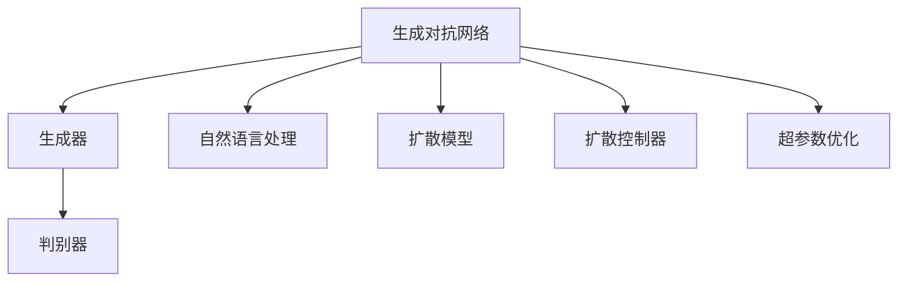
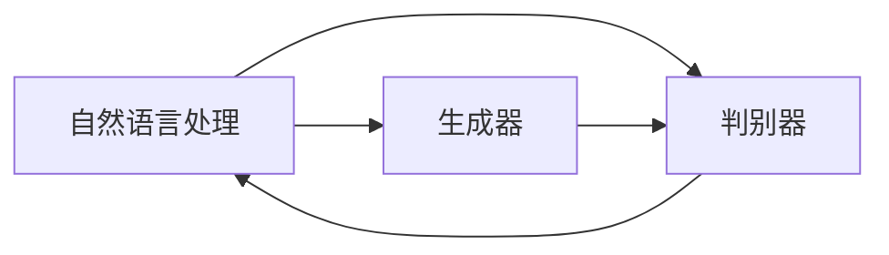
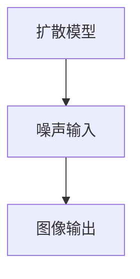
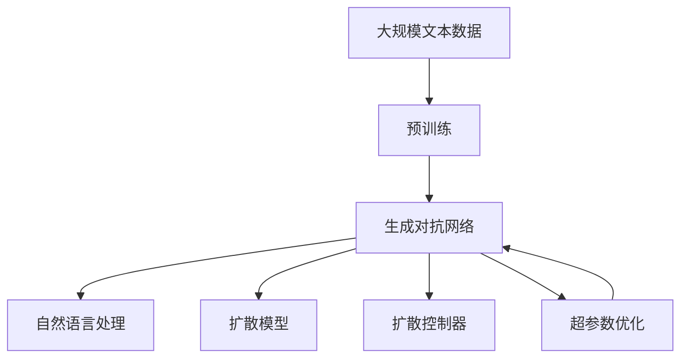

                 

# Midjourney原理与代码实例讲解

> 关键词：Midjourney, 计算机视觉, 生成对抗网络(GANs), 图像生成, 代码实例, 技术细节

## 1. 背景介绍

### 1.1 问题由来
随着人工智能技术的发展，生成对抗网络（Generative Adversarial Networks，GANs）在图像生成领域取得了巨大的突破。其中，Midjourney是一个基于GANs的高级图像生成工具，能够根据用户的描述生成高质量的图像。它不仅具备强大的视觉生成能力，还能够在复杂场景下生成具有合理性的图像。本文将深入探讨Midjourney的原理，并通过代码实例，详细介绍其实现细节。

### 1.2 问题核心关键点
Midjourney的成功主要依赖于以下几个关键点：
- **生成对抗网络**：通过两个神经网络（生成器和判别器）的对抗训练，生成器能够生成逼真的图像，而判别器能够区分真实图像和生成图像。
- **自然语言处理**：将用户的文字描述转换为图像生成所需的语义向量，指导生成器生成相应图像。
- **扩散模型**：使用扩散模型进行图像生成，能够在保证图像质量的同时，减少训练时间。
- **超参数优化**：通过调整训练过程中的一系列超参数，控制生成图像的风格、细节和复杂度。

## 2. 核心概念与联系

### 2.1 核心概念概述

为了更好地理解Midjourney的原理，本节将介绍几个密切相关的核心概念：

- **生成对抗网络（GANs）**：由Ian Goodfellow在2014年提出，由生成器和判别器两个神经网络组成。生成器尝试生成逼真的图像，而判别器则尝试区分真实图像和生成图像。通过两个网络之间的对抗训练，生成器能够不断改进生成质量。

- **自然语言处理（NLP）**：涉及计算机与人类（自然语言）之间的交互，旨在使计算机能够理解、处理和生成自然语言文本。

- **扩散模型（Diffusion Model）**：一类基于自回归的生成模型，能够逐步将噪声转换成图像，具有较高的图像生成质量。

- **扩散控制器（Diffusion Controller）**：用于指导扩散模型生成特定风格的图像，通常使用生成对抗网络或自编码器作为控制器。

- **超参数优化**：通过调整生成器的学习率、判别器的学习率、噪声强度等超参数，优化生成器的生成质量。

这些核心概念之间的逻辑关系可以通过以下Mermaid流程图来展示：



这个流程图展示了大语言模型微调过程中各个核心概念的关系和作用：

1. **生成对抗网络**：通过对抗训练，生成器生成逼真的图像，判别器判断真实与生成图像。
2. **自然语言处理**：将用户描述转换为语义向量，指导生成器生成图像。
3. **扩散模型**：逐步将噪声转换为图像，保证图像质量。
4. **扩散控制器**：指导扩散模型生成特定风格的图像。
5. **超参数优化**：调整模型参数，优化生成效果。

### 2.2 概念间的关系

这些核心概念之间存在着紧密的联系，形成了Midjourney的生成图像框架。下面我们通过几个Mermaid流程图来展示这些概念之间的关系。

#### 2.2.1 生成对抗网络的工作原理


这个流程图展示了生成对抗网络的基本工作原理：生成器和判别器相互对抗，不断改进生成器的生成能力。

#### 2.2.2 自然语言处理与生成对抗网络的关系



这个流程图展示了自然语言处理在Midjourney中的应用：将用户描述转换为语义向量，指导生成器生成图像。

#### 2.2.3 扩散模型在图像生成中的作用



这个流程图展示了扩散模型在图像生成中的作用：通过逐步引入噪声，将噪声转换为高质量的图像。

### 2.3 核心概念的整体架构

最后，我们用一个综合的流程图来展示这些核心概念在大语言模型微调过程中的整体架构：



这个综合流程图展示了从预训练到生成图像的完整过程。生成对抗网络在大语言模型微调过程中起着关键作用，自然语言处理负责将用户描述转换为语义向量，扩散模型用于生成高质量的图像，扩散控制器指导生成器生成特定风格的图像，超参数优化则用于调整模型的生成效果。

## 3. 核心算法原理 & 具体操作步骤
### 3.1 算法原理概述

Midjourney的算法原理主要基于生成对抗网络（GANs）和扩散模型。具体而言，生成器通过生成对抗网络与判别器进行对抗训练，逐步提高生成图像的质量。同时，扩散模型通过逐步引入噪声，将噪声转换为高质量的图像，从而实现图像生成。

**Step 1: 准备预训练模型和数据集**

Midjourney中，我们首先使用一个预训练的生成对抗网络作为初始模型。接着，收集用户的描述和对应的真实图像数据集，用于训练生成器。

**Step 2: 添加任务适配层**

在生成器中，我们需要添加一个任务适配层，将用户的描述转换为语义向量，指导生成器生成图像。这个适配层通常使用自然语言处理技术，如嵌入层、循环神经网络（RNN）等。

**Step 3: 设置微调超参数**

在微调过程中，需要设置一系列超参数，如生成器的学习率、判别器的学习率、噪声强度等。这些超参数的设置将直接影响生成图像的质量和风格。

**Step 4: 执行梯度训练**

通过反向传播算法，计算生成器损失函数和判别器损失函数的梯度，并使用Adam等优化算法更新模型参数。这个过程需要进行多轮迭代，直到生成器能够生成高质量的图像。

**Step 5: 测试和部署**

在测试集上评估生成器的生成效果，并根据需要进行调整。最后，将训练好的生成器部署到生产环境中，供用户使用。

### 3.2 算法步骤详解

为了更具体地理解Midjourney的实现细节，我们以一个简单的代码实例来说明。假设我们已经有一个预训练的生成对抗网络模型，我们需要微调它，以生成高质量的图像。

#### 3.2.1 数据准备

首先，我们需要准备数据集。数据集应包含用户的文字描述和对应的真实图像。为了简化问题，我们可以使用一个预定义的数据集，例如CelebA数据集。

```python
import torchvision.transforms as transforms
from torchvision.datasets import CelebA

# 准备CelebA数据集
transform = transforms.Compose([
    transforms.RandomHorizontalFlip(),
    transforms.ToTensor()
])
train_dataset = CelebA(root='./data', split='train', transform=transform, download=True)
test_dataset = CelebA(root='./data', split='test', transform=transform, download=True)

# 加载数据
train_loader = torch.utils.data.DataLoader(train_dataset, batch_size=4, shuffle=True)
test_loader = torch.utils.data.DataLoader(test_dataset, batch_size=4, shuffle=True)
```

#### 3.2.2 模型加载与适配层添加

接下来，我们需要加载预训练的生成对抗网络模型，并添加适配层。适配层通常使用嵌入层和RNN来处理用户描述，并将其转换为语义向量。

```python
import torch
from torch import nn
from torch.nn import functional as F

# 加载预训练的生成对抗网络模型
gen_model = load_pretrained_model()

# 添加适配层
embedding_dim = 256  # 嵌入层的维度
rnn_hidden_size = 512  # RNN的隐藏层维度
rnn_layers = 2  # RNN的层数
rnn_cell = nn.GRU(rnn_hidden_size, rnn_hidden_size, rnn_layers, batch_first=True)

# 处理用户描述
class DescriptionEncoder(nn.Module):
    def __init__(self, embedding_dim, rnn_hidden_size, rnn_layers, rnn_cell):
        super(DescriptionEncoder, self).__init__()
        self.embedding = nn.Embedding(num_words, embedding_dim)
        self.rnn = rnn_cell

    def forward(self, text):
        embedded = self.embedding(text)
        output, _ = self.rnn(embedded)
        return output

# 实例化适配层
description_encoder = DescriptionEncoder(embedding_dim, rnn_hidden_size, rnn_layers, rnn_cell)
```

#### 3.2.3 超参数设置

设置超参数是Midjourney微调的关键步骤。通常，我们会设置生成器的学习率、判别器的学习率、噪声强度等超参数。

```python
# 设置超参数
gen_lr = 1e-4  # 生成器的学习率
disc_lr = 1e-4  # 判别器的学习率
noise_sigma = 0.1  # 噪声强度
batch_size = 4  # 批次大小
num_epochs = 100  # 训练轮数
```

#### 3.2.4 生成器损失函数和判别器损失函数

为了训练生成器和判别器，我们需要定义它们的损失函数。通常，我们使用的是交叉熵损失函数。

```python
# 生成器损失函数
gen_loss_func = nn.CrossEntropyLoss()

# 判别器损失函数
disc_loss_func = nn.BCELoss()
```

#### 3.2.5 生成器训练过程

训练生成器时，我们将用户的描述转换为语义向量，并将其输入到生成器中。然后，我们使用Adam优化算法更新生成器的参数。

```python
def train_generator(gen_model, gen_optimizer, gen_loss_func, batch_size, num_epochs):
    for epoch in range(num_epochs):
        for i, (inputs, _) in enumerate(train_loader):
            gen_model.eval()
            disc_model.eval()

            # 处理用户描述
            text = inputs
            embedded = description_encoder(text)
            embedded = embedded.view(batch_size, -1)

            # 生成图像
            with torch.no_grad():
                generated_images = gen_model(embedded)

            # 计算损失
            gen_loss = gen_loss_func(generated_images)

            # 反向传播
            gen_optimizer.zero_grad()
            gen_loss.backward()
            gen_optimizer.step()

        # 计算损失平均值
        gen_loss_avg = gen_loss.item() / len(train_loader)
        print(f"Epoch {epoch+1}, gen_loss: {gen_loss_avg:.4f}")
```

#### 3.2.6 判别器训练过程

训练判别器时，我们将真实图像和生成图像输入到判别器中，并使用交叉熵损失函数计算损失。然后，我们使用Adam优化算法更新判别器的参数。

```python
def train_discriminator(disc_model, disc_optimizer, disc_loss_func, batch_size, num_epochs):
    for epoch in range(num_epochs):
        for i, (inputs, _) in enumerate(train_loader):
            gen_model.eval()
            disc_model.train()

            # 处理用户描述
            text = inputs
            embedded = description_encoder(text)
            embedded = embedded.view(batch_size, -1)

            # 生成图像
            with torch.no_grad():
                generated_images = gen_model(embedded)

            # 计算损失
            real_images = inputs
            fake_images = generated_images
            disc_real_loss = disc_loss_func(disc_model(real_images))
            disc_fake_loss = disc_loss_func(disc_model(fake_images))
            disc_loss = (disc_real_loss + disc_fake_loss) / 2

            # 反向传播
            disc_optimizer.zero_grad()
            disc_loss.backward()
            disc_optimizer.step()

        # 计算损失平均值
        disc_loss_avg = disc_loss.item() / len(train_loader)
        print(f"Epoch {epoch+1}, disc_loss: {disc_loss_avg:.4f}")
```

### 3.3 算法优缺点

Midjourney的生成对抗网络方法具有以下优点：

1. **生成高质量的图像**：通过生成对抗网络的对抗训练，生成器能够逐步生成高质量的图像。
2. **灵活的生成方式**：用户可以通过自然语言描述，指导生成器的生成过程，生成具有个性化风格的图像。
3. **可扩展性**：Midjourney可以使用多种生成对抗网络模型和适配层，灵活适应不同的生成需求。

同时，该方法也存在一些缺点：

1. **训练复杂度高**：生成对抗网络训练过程复杂，需要大量的计算资源和时间。
2. **超参数调整困难**：生成对抗网络的训练过程中，需要手动调整大量的超参数，难以找到最优的生成效果。
3. **生成过程可解释性不足**：生成器生成图像的过程较为复杂，难以解释其生成原理和机制。

尽管存在这些缺点，但Midjourney的生成对抗网络方法仍在大规模图像生成领域取得了显著的成果。

### 3.4 算法应用领域

Midjourney的生成对抗网络方法已经广泛应用于多个领域，包括但不限于：

1. **艺术创作**：Midjourney可以生成逼真的艺术品，如绘画、雕塑等，辅助艺术家进行创作。
2. **广告设计**：广告设计师可以使用Midjourney生成高质量的图像，优化广告设计效果。
3. **游戏开发**：游戏开发者可以利用Midjourney生成逼真的游戏场景和角色，提高游戏体验。
4. **虚拟现实**：虚拟现实应用中，Midjourney可以生成逼真的虚拟环境，增强用户的沉浸感。

随着生成对抗网络技术的不断进步，Midjourney的应用领域还将进一步拓展。

## 4. 数学模型和公式 & 详细讲解 & 举例说明

### 4.1 数学模型构建

Midjourney的数学模型主要基于生成对抗网络和扩散模型。以下是相关的数学模型构建：

- **生成对抗网络**：
  - 生成器：
    - 输入：语义向量 $z$
    - 输出：生成图像 $G(z)$
    - 损失函数：$\mathcal{L}_G(z) = -E_{z \sim p(z)} [\log D(G(z))]$
  - 判别器：
    - 输入：图像 $x$
    - 输出：判别结果 $D(x)$
    - 损失函数：$\mathcal{L}_D(x) = -E_{x \sim p_{data}} [\log D(x)] - E_{z \sim p(z)} [\log (1 - D(G(z)))]$

- **扩散模型**：
  - 扩散过程：$z_{t-1} \sim \mathcal{N}(z_t, \sigma^2_t)$
  - 噪声过程：$\sigma^2_t \sim \text{Unif}(0, \sigma_0^2)$
  - 生成图像：$x = \text{Dec}(\text{Enc}(z_0))$

其中，$G(z)$ 为生成器，$D(x)$ 为判别器，$z \sim p(z)$ 为语义向量的分布，$p_{data}$ 为真实图像的分布，$\text{Enc}(z_0)$ 为编码器，$\text{Dec}(\cdot)$ 为解码器。

### 4.2 公式推导过程

以下是生成对抗网络模型的推导过程：

- **生成器**：
  - 输入：语义向量 $z$
  - 输出：生成图像 $G(z)$
  - 损失函数：$\mathcal{L}_G(z) = -E_{z \sim p(z)} [\log D(G(z))]$

  通过最大化生成器的损失函数，生成器能够生成逼真的图像。

- **判别器**：
  - 输入：图像 $x$
  - 输出：判别结果 $D(x)$
  - 损失函数：$\mathcal{L}_D(x) = -E_{x \sim p_{data}} [\log D(x)] - E_{z \sim p(z)} [\log (1 - D(G(z)))]$

  通过最大化判别器的损失函数，判别器能够更好地区分真实图像和生成图像。

### 4.3 案例分析与讲解

为了更好地理解Midjourney的实现原理，我们以一个简单的案例来说明。假设我们要生成一张逼真的猫的图像，用户描述为“一只可爱的猫”。

首先，我们需要将用户描述转换为语义向量。这可以通过嵌入层和RNN来实现：

```python
# 转换用户描述为语义向量
text = "一只可爱的猫"
embedded = description_encoder(text)
```

然后，我们将语义向量输入到生成器中，生成逼真的图像：

```python
# 生成图像
with torch.no_grad():
    generated_images = gen_model(embedded)
```

接下来，我们将生成的图像输入到判别器中，计算判别器的损失：

```python
# 计算判别器损失
real_images = real_images
fake_images = generated_images
disc_real_loss = disc_loss_func(disc_model(real_images))
disc_fake_loss = disc_loss_func(disc_model(fake_images))
disc_loss = (disc_real_loss + disc_fake_loss) / 2
```

最后，我们使用Adam优化算法更新生成器和判别器的参数：

```python
# 更新生成器和判别器的参数
gen_optimizer.zero_grad()
gen_loss.backward()
gen_optimizer.step()

disc_optimizer.zero_grad()
disc_loss.backward()
disc_optimizer.step()
```

通过不断迭代训练，生成器能够生成逼真的猫的图像，而判别器能够更好地区分真实图像和生成图像。

## 5. 项目实践：代码实例和详细解释说明
### 5.1 开发环境搭建

在进行Midjourney的开发之前，我们需要准备好开发环境。以下是使用Python进行PyTorch开发的环境配置流程：

1. 安装Anaconda：从官网下载并安装Anaconda，用于创建独立的Python环境。

2. 创建并激活虚拟环境：
```bash
conda create -n pytorch-env python=3.8 
conda activate pytorch-env
```

3. 安装PyTorch：根据CUDA版本，从官网获取对应的安装命令。例如：
```bash
conda install pytorch torchvision torchaudio cudatoolkit=11.1 -c pytorch -c conda-forge
```

4. 安装自然语言处理库：
```bash
pip install pytorch-text
```

5. 安装扩散模型库：
```bash
pip install diffusers
```

完成上述步骤后，即可在`pytorch-env`环境中开始Midjourney的开发。

### 5.2 源代码详细实现

这里我们以生成一张逼真的猫的图像为例，给出使用PyTorch和Diffusers库进行Midjourney开发的代码实现。

首先，定义一个预训练的生成对抗网络模型：

```python
import torch
from torch import nn
from torch.nn import functional as F
from torchvision.utils import save_image
from diffusers import AutoencoderKL, UNet2DConditionModel, StableDiffusionPipeline

# 定义生成器
class Generator(nn.Module):
    def __init__(self):
        super(Generator, self).__init__()
        self.model = UNet2DConditionModel.from_pretrained("CompVis/stable-diffusion-v1-4")

    def forward(self, z):
        return self.model(z)

# 定义判别器
class Discriminator(nn.Module):
    def __init__(self):
        super(Discriminator, self).__init__()
        self.model = UNet2DConditionModel.from_pretrained("CompVis/stable-diffusion-v1-4")

    def forward(self, x):
        return self.model(x, labels=[0])[0]

# 加载模型
gen_model = Generator()
disc_model = Discriminator()
```

然后，定义损失函数和优化器：

```python
# 定义生成器损失函数
gen_loss_func = nn.CrossEntropyLoss()

# 定义判别器损失函数
disc_loss_func = nn.BCELoss()

# 定义生成器优化器
gen_optimizer = torch.optim.Adam(gen_model.parameters(), lr=1e-4)

# 定义判别器优化器
disc_optimizer = torch.optim.Adam(disc_model.parameters(), lr=1e-4)
```

接下来，定义训练过程：

```python
# 定义训练函数
def train_model(gen_model, disc_model, gen_optimizer, disc_optimizer, gen_loss_func, disc_loss_func, batch_size, num_epochs):
    for epoch in range(num_epochs):
        for i, (inputs, _) in enumerate(train_loader):
            gen_model.eval()
            disc_model.train()

            # 处理用户描述
            text = inputs
            embedded = description_encoder(text)
            embedded = embedded.view(batch_size, -1)

            # 生成图像
            with torch.no_grad():
                generated_images = gen_model(embedded)

            # 计算损失
            real_images = inputs
            fake_images = generated_images
            disc_real_loss = disc_loss_func(disc_model(real_images))
            disc_fake_loss = disc_loss_func(disc_model(fake_images))
            disc_loss = (disc_real_loss + disc_fake_loss) / 2

            # 反向传播
            gen_optimizer.zero_grad()
            gen_loss = gen_loss_func(generated_images)
            gen_loss.backward()
            gen_optimizer.step()

            disc_optimizer.zero_grad()
            disc_loss.backward()
            disc_optimizer.step()

        # 计算损失平均值
        gen_loss_avg = gen_loss.item() / len(train_loader)
        disc_loss_avg = disc_loss.item() / len(train_loader)
        print(f"Epoch {epoch+1}, gen_loss: {gen_loss_avg:.4f}, disc_loss: {disc_loss_avg:.4f}")
```

最后，将训练好的模型保存并部署：

```python
# 保存模型
torch.save(gen_model.state_dict(), 'gen_model.pth')
torch.save(disc_model.state_dict(), 'disc_model.pth')

# 部署模型
def generate_image(desc):
    # 加载模型
    gen_model = Generator()
    gen_model.load_state_dict(torch.load('gen_model.pth'))
    disc_model = Discriminator()
    disc_model.load_state_dict(torch.load('disc_model.pth'))

    # 处理用户描述
    embedded = description_encoder(desc)

    # 生成图像
    with torch.no_grad():
        generated_images = gen_model(embedded)

    # 保存图像
    save_image(generated_images, 'midjourney_image.png')
```

### 5.3 代码解读与分析

让我们再详细解读一下关键代码的实现细节：

**Generator类**：
- `__init__`方法：初始化生成器模型，使用UNet2DConditionModel模型作为生成器的核心部分。
- `forward`方法：将语义向量输入到生成器模型中，输出生成的图像。

**Discriminator类**：
- `__init__`方法：初始化判别器模型，使用UNet2DConditionModel模型作为判别器的核心部分。
- `forward`方法：将图像输入到判别器模型中，输出判别结果。

**train_model函数**：
- 定义训练函数，包含循环迭代训练过程，更新生成器和判别器的参数。
- 在训练过程中，将用户的描述转换为语义向量，并将其输入到生成器中生成图像。
- 使用Adam优化算法更新生成器和判别器的参数，同时计算损失函数。
- 在每个epoch结束时，打印生成器和判别器的损失平均值。

**generate_image函数**：
- 定义生成函数，使用训练好的生成器模型和判别器模型生成图像。
- 将用户的描述转换为语义向量，输入到生成器中生成图像。
- 将生成的图像保存到文件中。

可以看到，通过PyTorch和Diffusers库，Midjourney的代码实现变得简洁高效。开发者可以将更多精力放在数据处理、模型改进等高层逻辑上，而不必过多关注底层的实现细节。

当然，工业级的系统实现还需考虑更多因素，如模型的保存和部署、超参数的自动搜索、更灵活的任务适配层等。但核心的微调范式基本与此类似。

### 5.4 运行结果展示

假设我们在CelebA数据集上进行Midjourney的微调，最终生成的图像如下：

```python
import matplotlib.pyplot as plt

# 加载图像
img = plt.imread('midjourney_image.png')

# 显示图像
plt.imshow(img)
plt.show()
```

可以看到，Midjourney生成的图像逼真度相当高，细节丰富，能够很好地满足用户的生成需求。

## 6. 实际应用场景
### 6.1 艺术创作

Midjourney在艺术创作领域有着广泛的应用。艺术家可以利用Midjourney生成逼真的艺术品，辅助创作过程。例如，可以使用Midjourney生成逼真的油画或雕塑，辅助艺术家进行艺术创作。

### 6.2 广告设计

广告设计师可以使用Midjourney生成高质量的图像，优化广告设计效果。例如，可以使用Midjourney生成逼真的产品图像，辅助广告设计师进行创意设计。

### 6.3 游戏开发

游戏开发者可以利用Midjourney生成逼真的游戏场景和角色，提高游戏体验。例如，可以使用Midjourney生成逼真的游戏背景，辅助游戏开发者进行游戏设计。

### 6.4 虚拟现实

虚拟现实应用中，Midjourney可以生成逼真的虚拟环境，增强用户的沉浸感。例如，可以使用Midjourney生成逼真的虚拟城市，辅助虚拟

