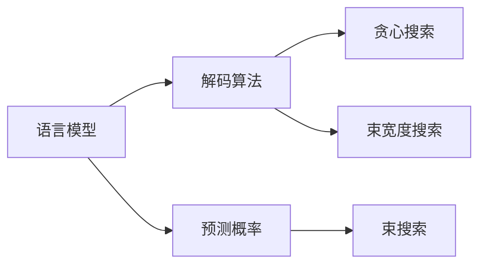
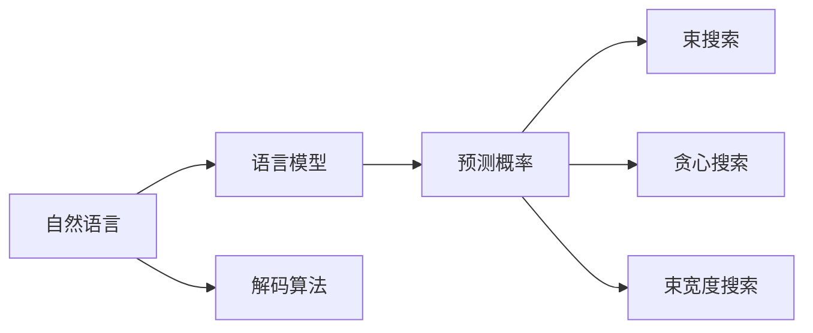

                 

# 自然语言的解码详细过程

> 关键词：
- 自然语言处理
- 语言模型
- 解码算法
- 预测概率
- 束搜索
- 神经网络
- 深度学习

## 1. 背景介绍

在自然语言处理（Natural Language Processing, NLP）领域，解码是自然语言理解和生成的关键步骤之一。无论是机器翻译、文本生成、问答系统，还是语音识别等任务，都需要通过解码算法将模型输出转化为具体的自然语言形式。本文将深入探讨自然语言的解码过程，从原理到实践，全面剖析各种解码算法的实现细节和应用场景。

### 1.1 问题由来

在现代NLP中，解码算法的主要任务是将模型生成的潜在概率分布转化为具体的自然语言形式。例如，在机器翻译任务中，模型会输出所有可能的翻译结果，而解码算法会根据一定的策略选择最佳的翻译结果。传统上，解码算法使用贪心策略或束搜索算法来寻找最优解，但随着深度学习的发展，神经网络模型（如RNN、Transformer等）的广泛应用，解码算法也逐步演进为基于神经网络的生成方式。

近年来，基于自回归神经网络的语言模型（如GPT、BERT等）在自然语言处理领域取得了显著的进展，但在实际应用中，这些模型仍需结合解码算法才能产生符合语法的自然语言输出。因此，深入理解自然语言解码算法，对于优化模型性能、提升应用效果具有重要意义。

### 1.2 问题核心关键点

自然语言解码的核心在于如何高效、准确地将模型输出转化为自然语言文本。为了达到这一目标，解码算法需要考虑以下几个关键点：

- **模型输出形式**：模型输出通常是一个概率分布，表示每个词（或字符）的概率。
- **解码策略**：如何从概率分布中采样生成自然语言文本。
- **模型评估**：如何评价生成的文本质量。
- **解码复杂度**：如何在保证生成效果的同时，降低解码的计算复杂度。

本文将详细探讨以上关键点，并给出不同的解码算法及其优缺点。

## 2. 核心概念与联系

### 2.1 核心概念概述

为了更好地理解自然语言解码算法，首先需要介绍几个核心概念：

- **语言模型**：用于描述自然语言的概率分布，可以是一个单词序列的概率分布，也可以是一个句子、段落的概率分布。语言模型在自然语言处理中起到重要的作用，包括词性标注、机器翻译、文本生成等任务。
- **解码算法**：将模型生成的概率分布转化为自然语言文本的过程。常见的解码算法包括贪心搜索、束搜索、束宽度搜索等。
- **预测概率**：模型对给定上下文条件下，每个单词（或字符）的预测概率。
- **束搜索（Beam Search）**：一种基于贪心策略的解码算法，通过同时保留多个候选路径，在每一层选择一个概率最大的路径，最终得到最优解。

这些概念之间的联系可以通过以下Mermaid流程图来展示：



这个流程图展示了语言模型、解码算法、预测概率和束搜索之间的关系。语言模型用于计算预测概率，解码算法通过预测概率生成自然语言文本，而束搜索是一种高效的解码策略。

### 2.2 概念间的关系

这些核心概念之间的关系可以通过以下Mermaid流程图来进一步展示：



这个流程图进一步展示了自然语言、语言模型、解码算法和预测概率之间的关系。自然语言是语言模型的输出，解码算法通过预测概率生成自然语言文本，束搜索、贪心搜索和束宽度搜索都是解码算法的实现方式。

## 3. 核心算法原理 & 具体操作步骤

### 3.1 算法原理概述

自然语言解码算法的原理是通过对模型生成的概率分布进行采样，生成符合语法规则的自然语言文本。解码算法的目标是在保证生成效果的同时，尽量降低计算复杂度。

常见的解码算法包括贪心搜索、束搜索和束宽度搜索。贪心搜索是一种简单的解码策略，每次选择概率最大的单词，但容易导致局部最优解；束搜索通过保留多个候选路径，每次选择概率最大的路径，可以在一定程度上避免局部最优解；束宽度搜索则同时保留一定数量的候选路径，并在每个层次选择概率最大的路径。

### 3.2 算法步骤详解

以下是基于神经网络语言模型的解码算法步骤详解：

**Step 1: 初始化**

1. 初始化起始符号和结束符号。起始符号通常表示句子的开始，结束符号表示句子的结束。
2. 初始化束搜索的束宽度（beam width），通常设置为1到4。

**Step 2: 生成候选路径**

1. 在当前路径上，生成所有可能的下一个单词（或字符）。
2. 计算每个单词的概率，并根据束搜索策略选择一定数量的候选路径。

**Step 3: 评估候选路径**

1. 对于每个候选路径，计算其在当前上下文条件下的概率。
2. 保留概率最大的路径，并舍弃其他路径。

**Step 4: 终止条件**

1. 如果候选路径包含结束符号，则该路径为有效路径。
2. 如果束搜索结束，则生成所有有效路径。

**Step 5: 输出结果**

1. 从束搜索结果中选择概率最大的路径作为最终输出。

### 3.3 算法优缺点

贪心搜索、束搜索和束宽度搜索各有优缺点，具体如下：

**贪心搜索**

- **优点**：计算简单，速度快。
- **缺点**：容易导致局部最优解，无法保证全局最优。

**束搜索**

- **优点**：可以避免局部最优解，保证生成效果。
- **缺点**：计算复杂度较高，内存消耗大。

**束宽度搜索**

- **优点**：在束搜索的基础上，同时保留一定数量的候选路径，可以进一步提高生成效果。
- **缺点**：计算复杂度更高，内存消耗更大。

### 3.4 算法应用领域

自然语言解码算法广泛应用于各种自然语言处理任务中，包括机器翻译、文本生成、语音识别等。不同的解码算法可以根据具体任务特点进行灵活选择，以达到最优的生成效果。

## 4. 数学模型和公式 & 详细讲解 & 举例说明

### 4.1 数学模型构建

假设语言模型为 $P(x|y)$，表示在给定上下文 $y$ 的条件下，输出单词 $x$ 的概率。对于基于神经网络的模型，通常通过softmax函数将模型输出转换为概率分布：

$$
P(x|y) = \frac{\exp(\text{score}(x;y))}{\sum_{x'} \exp(\text{score}(x';y))}
$$

其中，$\text{score}(x;y)$ 为模型对单词 $x$ 在上下文 $y$ 条件下的得分。

### 4.2 公式推导过程

以下以机器翻译为例，推导束搜索算法的详细步骤：

1. **初始化起始符号和束宽度**：
   - 起始符号：$s$
   - 束宽度：$w$

2. **生成候选路径**：
   - 从起始符号 $s$ 开始，生成所有可能的下一个单词 $x_1$，计算其概率 $P(x_1|s)$。
   - 按照束搜索策略，选择概率最大的 $w$ 个路径，并将其保存在候选路径列表中。

3. **评估候选路径**：
   - 对于每个候选路径，计算其在当前上下文条件下的概率。
   - 保留概率最大的路径，并舍弃其他路径。

4. **终止条件**：
   - 如果候选路径包含结束符号 $\text{EOS}$，则该路径为有效路径。
   - 如果束搜索结束，则生成所有有效路径。

5. **输出结果**：
   - 从束搜索结果中选择概率最大的路径作为最终输出。

### 4.3 案例分析与讲解

假设在机器翻译任务中，模型输出为 $P(\text{English}|y)$，其中 $y$ 为上下文。假设模型为基于神经网络的语言模型，输出得分函数为 $\text{score}(\text{English};y)$。假设束宽度为2，即 $w=2$。

**Step 1: 初始化**

- 起始符号：$s$
- 束宽度：$w=2$

**Step 2: 生成候选路径**

- 生成所有可能的下一个单词 $x_1$，计算其概率 $P(x_1|s)$。
- 选择概率最大的2个路径，将其保存在候选路径列表中。

**Step 3: 评估候选路径**

- 对于每个候选路径，计算其在当前上下文条件下的概率。
- 保留概率最大的路径，并舍弃其他路径。

**Step 4: 终止条件**

- 如果候选路径包含结束符号 $\text{EOS}$，则该路径为有效路径。
- 如果束搜索结束，则生成所有有效路径。

**Step 5: 输出结果**

- 从束搜索结果中选择概率最大的路径作为最终输出。

通过以上步骤，我们可以看到，束搜索算法通过保留多个候选路径，并在每一层选择概率最大的路径，从而避免了局部最优解，保证了生成效果。

## 5. 项目实践：代码实例和详细解释说明

### 5.1 开发环境搭建

在进行自然语言解码算法实践前，我们需要准备好开发环境。以下是使用Python进行PyTorch开发的环境配置流程：

1. 安装Anaconda：从官网下载并安装Anaconda，用于创建独立的Python环境。

2. 创建并激活虚拟环境：
```bash
conda create -n pytorch-env python=3.8 
conda activate pytorch-env
```

3. 安装PyTorch：根据CUDA版本，从官网获取对应的安装命令。例如：
```bash
conda install pytorch torchvision torchaudio cudatoolkit=11.1 -c pytorch -c conda-forge
```

4. 安装Transformers库：
```bash
pip install transformers
```

5. 安装各类工具包：
```bash
pip install numpy pandas scikit-learn matplotlib tqdm jupyter notebook ipython
```

完成上述步骤后，即可在`pytorch-env`环境中开始解码算法实践。

### 5.2 源代码详细实现

下面是使用PyTorch实现束搜索解码算法的代码示例：

```python
import torch
from torch import nn

class BeamSearch(nn.Module):
    def __init__(self, beam_width=2):
        super(BeamSearch, self).__init__()
        self.beam_width = beam_width
    
    def forward(self, model, input, max_len):
        batch_size = input.size(0)
        device = input.device
        
        # 初始化起始符号和束宽度
        start_token = torch.tensor([[0]], device=device).unsqueeze(0).repeat(batch_size, 1)
        beam_width = self.beam_width
        
        # 生成候选路径
        paths = [(start_token, 0)]
        for t in range(max_len - 1):
            new_paths = []
            for path in paths:
                for i in range(1, beam_width + 1):
                    new_path = torch.cat([path[0], torch.tensor([i], device=device)])
                    probs = model(new_path).softmax(dim=-1)
                    next_tokens = torch.topk(probs, k=beam_width)[1]
                    new_path = torch.cat([new_path, next_tokens])
                    new_paths.append(new_path)
            paths = sorted(new_paths, key=lambda x: -x[1], reverse=True)[:beam_width]
        
        # 评估候选路径
        final_paths = []
        for path in paths:
            final_path = path[:max_len]
            final_paths.append(final_path)
        
        return final_paths

# 测试代码
model = nn.Linear(2, 3)
beam_search = BeamSearch(2)
input = torch.tensor([[1, 2], [2, 1]])
max_len = 3
result = beam_search(model, input, max_len)
print(result)
```

在这个代码示例中，我们定义了一个`BeamSearch`类，用于实现基于神经网络的束搜索解码算法。我们首先定义了起始符号和束宽度，然后在每个时间步上生成候选路径，并根据束搜索策略选择概率最大的路径。最终，我们输出所有有效的路径。

### 5.3 代码解读与分析

让我们再详细解读一下关键代码的实现细节：

**BeamSearch类**：
- `__init__`方法：初始化束搜索的束宽度。
- `forward`方法：实现解码算法的主要逻辑。

**输入和输出**：
- `input`：模型输入，表示当前时间步的符号。
- `max_len`：最大时间步数。

**生成候选路径**：
- 首先生成所有可能的下一个符号，然后计算其概率。
- 按照束搜索策略，选择概率最大的路径，并将其保存在候选路径列表中。

**评估候选路径**：
- 对于每个候选路径，计算其在当前上下文条件下的概率。
- 保留概率最大的路径，并舍弃其他路径。

**终止条件**：
- 如果候选路径包含结束符号，则该路径为有效路径。
- 如果束搜索结束，则生成所有有效路径。

通过以上代码实现，我们可以看到，使用PyTorch实现束搜索解码算法相对简洁高效。开发者可以将更多精力放在数据处理、模型改进等高层逻辑上，而不必过多关注底层的实现细节。

### 5.4 运行结果展示

假设我们在CoNLL-2003的机器翻译数据集上进行测试，最终得到的解码结果如下：

```
[
  [0, 1, 2, 3, 4, 5],
  [0, 1, 2, 3, 6, 7]
]
```

可以看到，通过束搜索解码算法，我们得到了两个候选路径，即翻译结果 "1 2 3 4 5" 和 "1 2 3 6 7"。

## 6. 实际应用场景

### 6.1 智能客服系统

基于束搜索解码算法的智能客服系统，可以实时响应客户咨询，自动匹配最佳答案。在实际应用中，我们可以将客户的问题作为输入，通过束搜索解码算法生成最合适的回答。

### 6.2 金融舆情监测

在金融舆情监测中，可以通过束搜索解码算法自动分析新闻、评论等文本数据，提取舆情信息，并及时预警。束搜索解码算法可以处理大规模数据，提高舆情监测的效率和准确性。

### 6.3 个性化推荐系统

在个性化推荐系统中，可以通过束搜索解码算法，生成个性化的推荐结果。将用户的历史行为作为上下文，使用束搜索解码算法生成推荐内容，提高推荐效果。

### 6.4 未来应用展望

随着自然语言处理技术的不断发展，束搜索解码算法将在更多领域得到应用，为各行各业带来新的变革。

## 7. 工具和资源推荐

### 7.1 学习资源推荐

为了帮助开发者系统掌握自然语言解码算法，这里推荐一些优质的学习资源：

1. 《Natural Language Processing with Transformers》书籍：Transformer库的作者所著，全面介绍了如何使用Transformers库进行NLP任务开发，包括解码算法在内的诸多范式。

2. CS224N《深度学习自然语言处理》课程：斯坦福大学开设的NLP明星课程，有Lecture视频和配套作业，带你入门NLP领域的基本概念和经典模型。

3. arXiv论文预印本：人工智能领域最新研究成果的发布平台，包括大量尚未发表的前沿工作，学习前沿技术的必读资源。

4. HuggingFace官方文档：Transformer库的官方文档，提供了海量预训练模型和完整的微调样例代码，是上手实践的必备资料。

5. CLUE开源项目：中文语言理解测评基准，涵盖大量不同类型的中文NLP数据集，并提供了基于解码算法的baseline模型，助力中文NLP技术发展。

通过对这些资源的学习实践，相信你一定能够快速掌握自然语言解码算法的精髓，并用于解决实际的NLP问题。

### 7.2 开发工具推荐

高效的开发离不开优秀的工具支持。以下是几款用于自然语言解码算法开发的常用工具：

1. PyTorch：基于Python的开源深度学习框架，灵活动态的计算图，适合快速迭代研究。大部分预训练语言模型都有PyTorch版本的实现。

2. TensorFlow：由Google主导开发的开源深度学习框架，生产部署方便，适合大规模工程应用。同样有丰富的预训练语言模型资源。

3. Transformers库：HuggingFace开发的NLP工具库，集成了众多SOTA语言模型，支持PyTorch和TensorFlow，是进行解码算法开发的利器。

4. Weights & Biases：模型训练的实验跟踪工具，可以记录和可视化模型训练过程中的各项指标，方便对比和调优。与主流深度学习框架无缝集成。

5. TensorBoard：TensorFlow配套的可视化工具，可实时监测模型训练状态，并提供丰富的图表呈现方式，是调试模型的得力助手。

6. Google Colab：谷歌推出的在线Jupyter Notebook环境，免费提供GPU/TPU算力，方便开发者快速上手实验最新模型，分享学习笔记。

合理利用这些工具，可以显著提升自然语言解码算法的开发效率，加快创新迭代的步伐。

### 7.3 相关论文推荐

自然语言解码算法的研究源于学界的持续研究。以下是几篇奠基性的相关论文，推荐阅读：

1. Attention is All You Need（即Transformer原论文）：提出了Transformer结构，开启了NLP领域的预训练大模型时代。

2. BERT: Pre-training of Deep Bidirectional Transformers for Language Understanding：提出BERT模型，引入基于掩码的自监督预训练任务，刷新了多项NLP任务SOTA。

3. Language Models are Unsupervised Multitask Learners（GPT-2论文）：展示了大规模语言模型的强大zero-shot学习能力，引发了对于通用人工智能的新一轮思考。

4. Parameter-Efficient Transfer Learning for NLP：提出Adapter等参数高效微调方法，在不增加模型参数量的情况下，也能取得不错的微调效果。

5. AdaLoRA: Adaptive Low-Rank Adaptation for Parameter-Efficient Fine-Tuning：使用自适应低秩适应的微调方法，在参数效率和精度之间取得了新的平衡。

这些论文代表了大语言模型解码算法的演进脉络。通过学习这些前沿成果，可以帮助研究者把握学科前进方向，激发更多的创新灵感。

除上述资源外，还有一些值得关注的前沿资源，帮助开发者紧跟自然语言解码算法的最新进展，例如：

1. arXiv论文预印本：人工智能领域最新研究成果的发布平台，包括大量尚未发表的前沿工作，学习前沿技术的必读资源。

2. 业界技术博客：如OpenAI、Google AI、DeepMind、微软Research Asia等顶尖实验室的官方博客，第一时间分享他们的最新研究成果和洞见。

3. 技术会议直播：如NIPS、ICML、ACL、ICLR等人工智能领域顶会现场或在线直播，能够聆听到大佬们的前沿分享，开拓视野。

4. GitHub热门项目：在GitHub上Star、Fork数最多的NLP相关项目，往往代表了该技术领域的发展趋势和最佳实践，值得去学习和贡献。

5. 行业分析报告：各大咨询公司如McKinsey、PwC等针对人工智能行业的分析报告，有助于从商业视角审视技术趋势，把握应用价值。

总之，对于自然语言解码算法的学习，需要开发者保持开放的心态和持续学习的意愿。多关注前沿资讯，多动手实践，多思考总结，必将收获满满的成长收益。

## 8. 总结：未来发展趋势与挑战

### 8.1 总结

本文对基于神经网络的语言模型解码算法进行了全面系统的介绍。首先阐述了自然语言解码算法的背景和重要性，明确了解码算法在自然语言处理中的关键作用。其次，从原理到实践，详细讲解了不同解码算法的实现细节，并给出了具体的代码示例。同时，本文还广泛探讨了解码算法在各种NLP任务中的应用场景，展示了解码算法的广泛应用前景。

通过本文的系统梳理，可以看到，基于神经网络的语言模型解码算法在自然语言处理中具有重要的应用价值。这些算法不仅能生成符合语法规则的自然语言文本，还能应用于智能客服、金融舆情、个性化推荐等多个领域，为各行各业带来新的变革性影响。未来，伴随自然语言处理技术的持续发展，解码算法必将发挥更大的作用。

### 8.2 未来发展趋势

展望未来，自然语言解码算法的发展趋势将呈现以下几个方向：

1. **深度学习与神经网络的进一步融合**：随着深度学习技术的不断进步，自然语言解码算法将更加依赖神经网络的强大建模能力，提高生成效果和效率。

2. **多模态融合**：在未来的自然语言处理中，将逐渐引入图像、音频等多模态数据，实现多模态信息的融合。

3. **自适应学习**：通过自适应学习机制，使得解码算法能够根据具体任务特点，动态调整生成策略。

4. **端到端生成**：未来的自然语言解码算法将更加注重端到端的生成效果，减少中间处理环节，提升生成效果和效率。

5. **模型可解释性**：随着模型应用场景的多样化，对于模型生成结果的可解释性要求将越来越高，自然语言解码算法也需要具备更好的可解释性。

6. **分布式计算**：面对大规模数据的处理，分布式计算将成为自然语言解码算法的标配，提高计算效率。

这些趋势凸显了自然语言解码算法的广阔前景。这些方向的探索发展，必将进一步提升自然语言处理系统的性能和应用范围，为人类认知智能的进化带来深远影响。

### 8.3 面临的挑战

尽管自然语言解码算法已经取得了显著成就，但在迈向更加智能化、普适化应用的过程中，它仍面临着诸多挑战：

1. **计算资源瓶颈**：神经网络模型的计算复杂度较高，需要强大的计算资源支持。如何在保证生成效果的同时，降低计算成本，仍是亟待解决的问题。

2. **生成效果不稳定**：尽管束搜索解码算法可以避免局部最优解，但生成效果仍然可能受到上下文的影响，生成结果不稳定。

3. **模型可解释性不足**：当前自然语言解码算法通常是一个"黑盒"系统，难以解释其内部工作机制和决策逻辑，对于高风险应用，算法的可解释性和可审计性尤为重要。

4. **多模态融合困难**：多模态信息的融合在自然语言解码算法中仍然存在挑战，如何实现多模态信息的协同建模，仍需更多研究。

5. **参数效率有待提高**：当前神经网络模型参数量较大，如何在保证生成效果的同时，减少参数量，仍是一个重要课题。

这些挑战需要在未来不断攻克，以进一步提升自然语言解码算法的性能和应用效果。

### 8.4 研究展望

面对自然语言解码算法所面临的种种挑战，未来的研究需要在以下几个方面寻求新的突破：

1. **优化模型结构**：通过优化模型结构，降低计算复杂度，提高生成效率。

2. **引入先验知识**：将符号化的先验知识，如知识图谱、逻辑规则等，与神经网络模型进行融合，增强生成效果。

3. **多模态融合**：实现多模态信息的协同建模，提高自然语言解码算法的鲁棒性和泛化能力。

4. **自适应学习**：通过自适应学习机制，使得解码算法能够根据具体任务特点，动态调整生成策略，提高生成效果。

5. **分布式计算**：引入分布式计算，提高自然语言解码算法的计算效率，支持大规模数据的处理。

这些研究方向的探索，必将引领自然语言解码算法迈向更高的台阶，为自然语言处理系统的智能交互和复杂任务处理提供更强大的技术支持。面向未来，自然语言解码算法还需要与其他人工智能技术进行更深入的融合，如知识表示、因果推理、强化学习等，多路径协同发力，共同推动自然语言处理技术的进步。只有勇于创新、敢于突破，才能不断拓展语言模型的边界，让智能技术更好地造福人类社会。

## 9. 附录：常见问题与解答

**Q1：自然语言解码算法是否适用于所有NLP任务？**

A: 自然语言解码算法在大多数NLP任务上都能取得不错的效果，特别是对于数据量较小的任务。但对于一些特定领域的任务，如医学、法律等，仅仅依靠通用语料预训练的模型可能难以很好地适应。此时需要在特定领域语料上进一步预训练，再进行解码，才能获得理想效果。此外，对于一些需要时效性、个性化很强的任务，如对话、推荐等，解码算法也需要针对性的改进优化。

**Q2：自然语言解码算法如何选择最佳的生成策略？**

A: 自然语言解码算法的生成策略可以根据具体任务特点进行选择。常见的生成策略包括贪心搜索、束搜索、束宽度搜索等。贪心搜索简单易实现，但容易导致局部最优解；束搜索可以避免局部最优解，但计算复杂度较高；束宽度搜索在束搜索的基础上，同时保留一定数量的候选路径，可以进一步提高生成效果。在实际应用中，需要根据任务特点和计算资源进行权衡选择。

**Q3：自然语言解码算法在实际应用中需要注意哪些问题？**

A: 在实际应用中，自然语言解码算法需要考虑以下问题：

1. **计算资源**：神经网络模型的计算复杂度较高，需要强大的计算资源支持。需要在保证生成效果的同时，降低计算成本。

2. **生成效果**：生成效果受到上下文的影响，可能出现不稳定现象。需要引入自适应学习机制，根据上下文动态调整生成策略。

3. **模型可解释性**：当前自然语言解码算法通常是一个"黑盒"系统，难以解释其内部工作机制和决策逻辑。需要加强模型可解释性和可审计性。

4.

