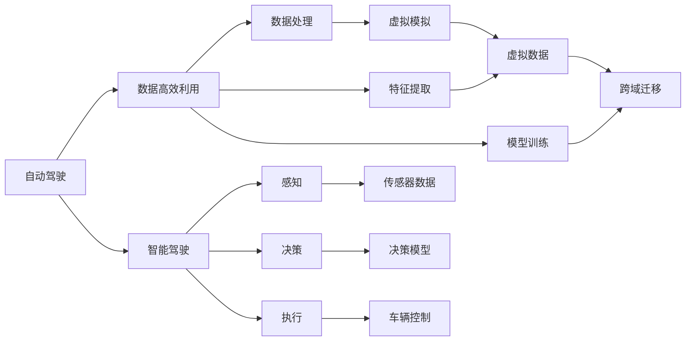
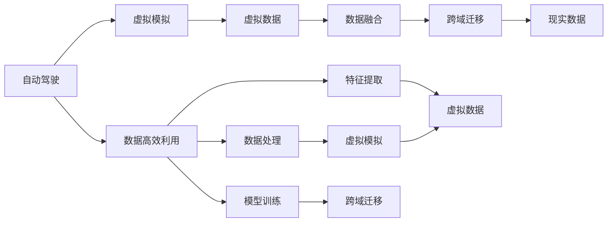
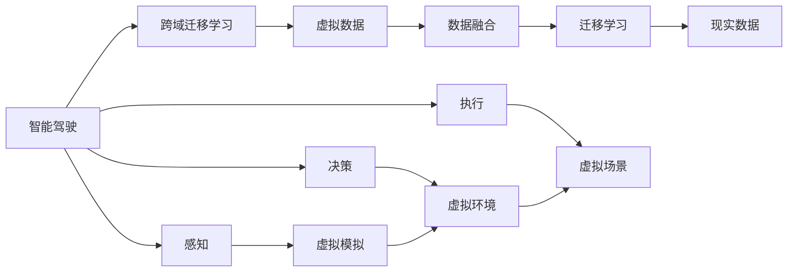
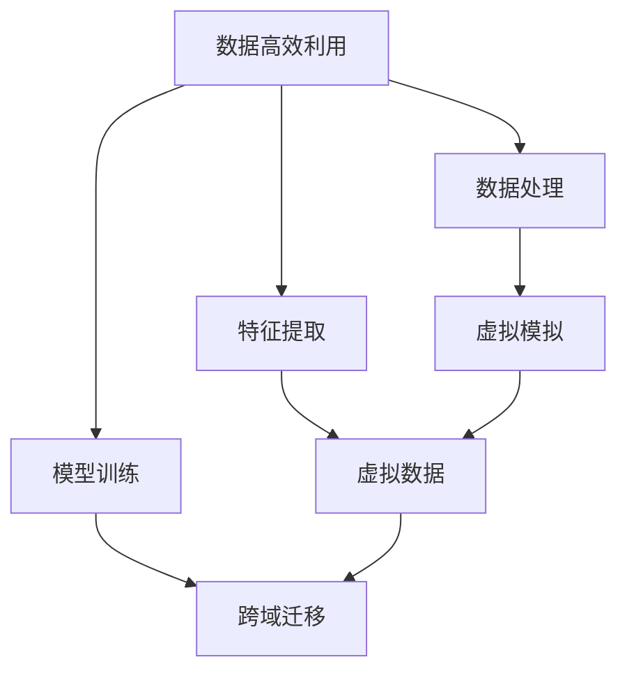

                 

# 虚实迁移学习助力自动驾驶数据高效利用的范式创新

> 关键词：虚实迁移学习,自动驾驶,数据高效利用,智能驾驶,安全保障

## 1. 背景介绍

### 1.1 问题由来
自动驾驶技术的研发和落地，需要大量的高精度数据来训练模型，以确保车辆在复杂道路环境中的安全行驶。然而，高质量的标注数据往往难以获取，且随着环境的变化，数据量不断增长，数据标注成本也在不断上升。此外，许多自动驾驶相关的数据采集设备，如激光雷达、摄像头等，价格昂贵，部署和维护成本高，进一步增加了数据获取难度。为了解决这些问题，学术界和工业界提出了虚实迁移学习(Virtual-to-Real Transfer Learning)方法，以将虚拟模拟数据的高效性优势转化为实际道路测试的准确性优势，从而大幅降低数据获取成本和测试风险。

### 1.2 问题核心关键点
虚实迁移学习，通过将虚拟模拟环境生成的数据和真实世界中的数据进行融合，提升自动驾驶系统的泛化能力和鲁棒性。核心在于构建一个虚拟到现实的桥梁，使虚拟模拟数据能够尽可能接近真实世界的数据分布，从而高效地优化真实世界的驾驶策略。

这种方法的关键点包括：
- **虚拟数据生成**：构建虚拟环境，通过模拟生成大量虚拟驾驶数据。
- **虚拟与现实对齐**：通过桥接技术，将虚拟数据映射到真实数据，提升模型的泛化能力。
- **跨域迁移学习**：利用虚拟数据和真实数据的相似性，进行迁移学习，提升模型在真实场景中的表现。
- **动态更新**：随着真实数据和新场景的增加，不断更新虚拟模型，提升模型的实时性。

### 1.3 问题研究意义
虚实迁移学习的应用，对于降低自动驾驶的数据获取成本、提升系统安全性、加速技术落地具有重要意义：

1. **数据获取成本降低**：通过大量虚拟数据生成，大幅减少对高成本真实数据的依赖，降低标注成本。
2. **系统安全性提升**：虚拟数据的多样性覆盖了各种极端场景，提升模型的鲁棒性和泛化能力。
3. **技术落地加速**：虚拟数据能够快速迭代和扩展，加速从研发到实际应用的过程。
4. **实时性保障**：动态更新虚拟数据，实时响应新场景和新数据，提升系统的实时性和稳定性。

## 2. 核心概念与联系

### 2.1 核心概念概述

为更好地理解虚实迁移学习在自动驾驶中的应用，本节将介绍几个密切相关的核心概念：

- **自动驾驶**：利用传感器、摄像头、雷达等设备感知周围环境，通过算法决策，控制车辆在道路上安全行驶的技术。
- **数据高效利用**：通过优化数据处理、特征提取、模型训练等环节，提升数据利用效率，减少冗余和浪费。
- **智能驾驶**：结合人工智能技术，提升驾驶的智能化程度，包括感知、决策、执行等环节。
- **安全保障**：确保自动驾驶系统在各种道路场景中的安全性，包括碰撞检测、车道保持、紧急避障等。
- **虚拟模拟**：通过计算机生成的仿真环境，模拟真实世界中的驾驶场景，生成高精度的虚拟驾驶数据。
- **跨域迁移学习**：将虚拟环境中的学习结果迁移到真实环境中，提升模型在真实世界中的表现。

这些核心概念之间的逻辑关系可以通过以下Mermaid流程图来展示：



这个流程图展示了自动驾驶的核心组件及其相互关系：

1. 自动驾驶系统通过感知、决策、执行等环节，实现车辆的智能行驶。
2. 数据高效利用贯穿数据处理、特征提取、模型训练等全过程，提升数据利用效率。
3. 智能驾驶结合人工智能技术，提升驾驶的智能化程度。
4. 安全保障确保系统的安全性。
5. 虚拟模拟通过生成高精度虚拟数据，支持智能驾驶系统的训练和测试。
6. 跨域迁移学习将虚拟数据迁移到真实环境中，提升模型的泛化能力。

### 2.2 概念间的关系

这些核心概念之间存在着紧密的联系，形成了自动驾驶数据高效利用的完整生态系统。下面我们通过几个Mermaid流程图来展示这些概念之间的关系。

#### 2.2.1 自动驾驶的数据获取范式



这个流程图展示了自动驾驶系统获取数据的完整流程：

1. 自动驾驶系统通过虚拟模拟生成大量虚拟数据，提供数据训练和测试的基础。
2. 虚拟数据通过数据融合和跨域迁移学习，迁移到真实数据中，提升模型的泛化能力。
3. 数据高效利用优化数据处理、特征提取和模型训练等环节，提升数据利用效率。

#### 2.2.2 智能驾驶的跨域迁移学习



这个流程图展示了智能驾驶系统进行跨域迁移学习的完整流程：

1. 智能驾驶系统通过虚拟模拟生成大量虚拟数据，提供数据训练和测试的基础。
2. 虚拟数据通过数据融合和跨域迁移学习，迁移到真实数据中，提升模型的泛化能力。
3. 感知、决策、执行等环节通过跨域迁移学习，确保系统在实际道路环境中的表现。

#### 2.2.3 数据高效利用的全链路优化



这个流程图展示了数据高效利用的全链路优化：

1. 数据高效利用优化数据处理、特征提取和模型训练等环节，提升数据利用效率。
2. 虚拟模拟通过生成高精度虚拟数据，支持数据高效利用。
3. 跨域迁移学习将虚拟数据迁移到真实环境中，提升模型的泛化能力。

### 2.3 核心概念的整体架构

最后，我们用一个综合的流程图来展示这些核心概念在自动驾驶数据高效利用中的整体架构：


这个综合流程图展示了从虚拟数据生成到跨域迁移学习的完整过程，以及数据高效利用在各个环节的优化作用。通过这些流程图，我们可以更清晰地理解虚实迁移学习在自动驾驶中的应用，为后续深入讨论具体的微调方法和技术奠定基础。

## 3. 核心算法原理 & 具体操作步骤
### 3.1 算法原理概述

虚实迁移学习的基本原理是通过将虚拟数据和真实数据进行融合，提升自动驾驶系统的泛化能力和鲁棒性。其核心思想是：

1. **虚拟数据生成**：构建虚拟环境，通过仿真技术生成大量虚拟驾驶数据。
2. **虚拟与现实对齐**：通过桥接技术，将虚拟数据映射到真实数据，提升模型的泛化能力。
3. **跨域迁移学习**：利用虚拟数据和真实数据的相似性，进行迁移学习，提升模型在真实场景中的表现。
4. **动态更新**：随着真实数据和新场景的增加，不断更新虚拟模型，提升模型的实时性。

### 3.2 算法步骤详解

虚实迁移学习的一般步骤包括：

**Step 1: 准备虚拟环境和数据**

- 构建虚拟驾驶环境，如CARLA、SimSim等。
- 生成虚拟驾驶数据，包括传感器数据（如激光雷达、摄像头）、车辆状态、道路交通等信息。
- 将虚拟数据和真实数据进行对齐，如通过视觉、点云、语义等对齐方式，保证虚拟数据和真实数据的一致性。

**Step 2: 模型训练与微调**

- 在虚拟环境中进行模型训练，初始化模型参数。
- 使用虚拟数据进行模型训练，生成虚拟数据对应的模型参数。
- 将虚拟数据和真实数据进行融合，生成训练样本。
- 在真实数据上进行模型微调，根据融合后的数据集进行参数更新。

**Step 3: 验证与评估**

- 在虚拟数据和真实数据上进行验证，评估模型性能。
- 根据评估结果进行模型优化，如调整参数、改进对齐方式等。
- 在新场景和数据上进行模型验证，确保模型的泛化能力。

**Step 4: 动态更新与优化**

- 随着新数据的收集和场景的变化，更新虚拟模型和数据集。
- 利用新数据进行模型微调，提升模型实时性。
- 优化数据处理、特征提取和模型训练等环节，提升数据利用效率。

### 3.3 算法优缺点

虚实迁移学习具有以下优点：

1. **数据高效利用**：通过虚拟数据生成，大幅降低对高成本真实数据的依赖，减少数据获取和标注成本。
2. **泛化能力提升**：虚拟数据的多样性覆盖了各种极端场景，提升模型的鲁棒性和泛化能力。
3. **加速技术落地**：虚拟数据能够快速迭代和扩展，加速从研发到实际应用的过程。
4. **实时性保障**：动态更新虚拟数据，实时响应新场景和新数据，提升系统的实时性和稳定性。

同时，该方法也存在一定的局限性：

1. **虚拟环境逼真度**：虚拟环境的逼真度直接影响虚拟数据的质量和模型性能。
2. **对齐误差**：虚拟数据与真实数据之间的对齐误差，可能影响模型的泛化能力。
3. **迁移效果有限**：虚拟数据与真实数据之间的迁移效果，可能存在一定差距。
4. **动态更新复杂**：随着新数据的增加和新场景的变化，动态更新虚拟模型需要较高的计算和维护成本。

尽管存在这些局限性，但虚实迁移学习仍是大规模自动驾驶数据获取和模型训练的重要方法。未来相关研究的重点在于如何进一步提高虚拟环境的逼真度、减少对齐误差、优化迁移效果，同时降低动态更新的复杂度。

### 3.4 算法应用领域

虚实迁移学习已经在自动驾驶的多个领域得到应用，例如：

- **感知模块**：通过虚拟数据生成，提升感知模块对各类环境特征的识别能力，如车道线、交通标志、行人等。
- **决策模块**：利用虚拟数据进行决策策略的学习和优化，提升决策模块的鲁棒性和安全性。
- **执行模块**：通过虚拟数据进行执行策略的学习和优化，提升执行模块的准确性和稳定性。
- **系统安全**：通过虚拟数据进行安全策略的学习和优化，提升系统的安全性和鲁棒性。

此外，虚实迁移学习还被应用于智能驾驶模拟器测试、模拟器优化、数据增强等环节，为自动驾驶技术的迭代和优化提供了新的手段。

## 4. 数学模型和公式 & 详细讲解 & 举例说明

### 4.1 数学模型构建

虚实迁移学习主要涉及两个方面的数学模型：虚拟数据生成和跨域迁移学习。

**虚拟数据生成**：通过虚拟环境模拟生成虚拟数据，假设虚拟数据集为 $D_V = \{(x_V_i, y_V_i)\}_{i=1}^N$，其中 $x_V$ 为传感器数据，$y_V$ 为标签。

**跨域迁移学习**：通过虚拟数据和真实数据进行迁移学习，假设真实数据集为 $D_R = \{(x_R_i, y_R_i)\}_{i=1}^M$，其中 $x_R$ 为传感器数据，$y_R$ 为标签。

定义模型 $M_{\theta}$，假设 $M_{\theta}$ 在虚拟数据集 $D_V$ 上的损失函数为 $L_V(\theta)$，在真实数据集 $D_R$ 上的损失函数为 $L_R(\theta)$，则跨域迁移学习的目标是最小化总体损失：

$$
L_{VR}(\theta) = \alpha L_V(\theta) + (1-\alpha) L_R(\theta)
$$

其中 $\alpha$ 为虚拟数据的权重，一般设定 $\alpha=0.5$，表示虚拟数据和真实数据的重要性相同。

### 4.2 公式推导过程

以下我们以感知模块的跨域迁移学习为例，推导感知模型在虚拟数据和真实数据上的损失函数。

假设模型 $M_{\theta}$ 的输出为 $y_{pred}=M_{\theta}(x)$，其中 $x$ 为传感器数据，$y_{pred}$ 为预测标签。

假设感知模型在虚拟数据集 $D_V$ 上的损失函数为：

$$
L_V(\theta) = \frac{1}{N} \sum_{i=1}^N \ell(y_V, y_{pred}^V)
$$

其中 $\ell$ 为损失函数，如交叉熵损失。

假设感知模型在真实数据集 $D_R$ 上的损失函数为：

$$
L_R(\theta) = \frac{1}{M} \sum_{i=1}^M \ell(y_R, y_{pred}^R)
$$

则跨域迁移学习的总体损失为：

$$
L_{VR}(\theta) = \frac{1}{2N+2M} (N L_V(\theta) + M L_R(\theta))
$$

通过最小化总体损失 $L_{VR}(\theta)$，可以将感知模型在虚拟数据集 $D_V$ 和真实数据集 $D_R$ 上的学习结果进行融合，提升模型在真实环境中的泛化能力。

### 4.3 案例分析与讲解

假设我们要对感知模块进行跨域迁移学习，训练模型识别车道线和交通标志。我们可以构建一个虚拟驾驶环境，如CARLA，生成大量虚拟驾驶数据。然后，在虚拟数据上进行模型训练，得到模型参数 $\theta_0$。接着，将虚拟数据和真实数据进行融合，生成训练样本。最后，在真实数据集上微调模型，得到最终的模型参数 $\theta$。

在虚拟数据上训练感知模型时，我们首先构建虚拟环境，设置虚拟摄像头和激光雷达等传感器，生成虚拟传感器数据 $x_V$。然后，通过对齐技术，将虚拟数据和真实数据进行融合，生成融合后的训练样本 $(x_R, y_R)$。在真实数据集上微调感知模型时，我们使用虚拟数据生成的损失 $L_V(\theta)$ 和真实数据生成的损失 $L_R(\theta)$，进行联合优化：

$$
L_{VR}(\theta) = 0.5 L_V(\theta) + 0.5 L_R(\theta)
$$

通过最小化 $L_{VR}(\theta)$，感知模型可以在虚拟和真实数据上进行迁移学习，提升其在真实环境中的表现。

## 5. 项目实践：代码实例和详细解释说明
### 5.1 开发环境搭建

在进行虚实迁移学习实践前，我们需要准备好开发环境。以下是使用Python进行PyTorch开发的环境配置流程：

1. 安装Anaconda：从官网下载并安装Anaconda，用于创建独立的Python环境。

2. 创建并激活虚拟环境：
```bash
conda create -n pytorch-env python=3.8 
conda activate pytorch-env
```

3. 安装PyTorch：根据CUDA版本，从官网获取对应的安装命令。例如：
```bash
conda install pytorch torchvision torchaudio cudatoolkit=11.1 -c pytorch -c conda-forge
```

4. 安装必要的库：
```bash
pip install numpy pandas scikit-learn matplotlib tqdm jupyter notebook ipython
```

完成上述步骤后，即可在`pytorch-env`环境中开始虚实迁移学习实践。

### 5.2 源代码详细实现

下面我们以感知模块的虚实迁移学习为例，给出使用PyTorch进行跨域迁移学习的PyTorch代码实现。

```python
import torch
import torch.nn as nn
import torch.optim as optim
from torch.utils.data import Dataset, DataLoader
from torchvision.transforms import ToTensor
from torchvision.utils import save_image

class VirtualToRealDataset(Dataset):
    def __init__(self, virtual_data, real_data, weight=0.5):
        self.virtual_data = virtual_data
        self.real_data = real_data
        self.weight = weight
        
    def __len__(self):
        return len(self.virtual_data)
    
    def __getitem__(self, idx):
        virtual_input = self.virtual_data[idx]['x']
        real_input = self.real_data[idx]['x']
        virtual_label = self.virtual_data[idx]['y']
        real_label = self.real_data[idx]['y']
        
        virtual_input = ToTensor()(virtual_input)
        real_input = ToTensor()(real_input)
        
        virtual_loss = self.weight * nn.CrossEntropyLoss()(virtual_input, virtual_label)
        real_loss = nn.CrossEntropyLoss()(real_input, real_label)
        
        return {'virtual_input': virtual_input, 'real_input': real_input, 'virtual_loss': virtual_loss, 'real_loss': real_loss}

class VirtualToRealModel(nn.Module):
    def __init__(self):
        super(VirtualToRealModel, self).__init__()
        self.conv1 = nn.Conv2d(3, 64, kernel_size=3, stride=1, padding=1)
        self.conv2 = nn.Conv2d(64, 128, kernel_size=3, stride=1, padding=1)
        self.fc = nn.Linear(128*28*28, 10)
        self.relu = nn.ReLU()

    def forward(self, x):
        x = self.relu(self.conv1(x))
        x = self.relu(self.conv2(x))
        x = x.view(-1, 128*28*28)
        x = self.fc(x)
        return x

def train_model(model, train_loader, val_loader, optimizer, num_epochs):
    device = torch.device('cuda' if torch.cuda.is_available() else 'cpu')
    model.to(device)
    
    for epoch in range(num_epochs):
        model.train()
        train_loss = 0
        train_correct = 0
        val_loss = 0
        val_correct = 0
        
        for i, (data, target) in enumerate(train_loader):
            inputs, labels = data['virtual_input'].to(device), data['real_input'].to(device)
            labels = labels.to(device)
            
            optimizer.zero_grad()
            outputs = model(inputs)
            virtual_loss = data['virtual_loss'].to(device)
            real_loss = data['real_loss'].to(device)
            loss = virtual_loss + real_loss
            loss.backward()
            optimizer.step()
            
            train_loss += virtual_loss.item() + real_loss.item()
            train_correct += (outputs.argmax(1) == labels).sum().item()
        
        val_loss = 0
        val_correct = 0
        
        with torch.no_grad():
            model.eval()
            for i, (data, target) in enumerate(val_loader):
                inputs, labels = data['virtual_input'].to(device), data['real_input'].to(device)
                labels = labels.to(device)
                
                outputs = model(inputs)
                virtual_loss = data['virtual_loss'].to(device)
                real_loss = data['real_loss'].to(device)
                loss = virtual_loss + real_loss
                
                val_loss += virtual_loss.item() + real_loss.item()
                val_correct += (outputs.argmax(1) == labels).sum().item()
                
        print(f'Epoch {epoch+1}, train loss: {train_loss/len(train_loader):.4f}, val loss: {val_loss/len(val_loader):.4f}, train acc: {train_correct/len(train_loader):.4f}, val acc: {val_correct/len(val_loader):.4f}')

    print('Training completed.')

# 创建虚拟数据集和真实数据集
virtual_dataset = ...
real_dataset = ...

# 创建数据集
dataset = VirtualToRealDataset(virtual_dataset, real_dataset, weight=0.5)

# 创建数据加载器
train_loader = DataLoader(dataset, batch_size=16, shuffle=True)
val_loader = DataLoader(dataset, batch_size=16, shuffle=False)

# 创建模型
model = VirtualToRealModel()

# 创建优化器
optimizer = optim.Adam(model.parameters(), lr=0.001)

# 开始训练
train_model(model, train_loader, val_loader, optimizer, num_epochs=10)

# 保存模型
torch.save(model.state_dict(), 'model.pth')
```

### 5.3 代码解读与分析

让我们再详细解读一下关键代码的实现细节：

**VirtualToRealDataset类**：
- `__init__`方法：初始化虚拟数据集和真实数据集，并设置虚拟数据的权重。
- `__len__`方法：返回数据集的样本数量。
- `__getitem__`方法：对单个样本进行处理，将虚拟数据和真实数据进行融合，生成融合后的训练样本。

**VirtualToRealModel类**：
- `__init__`方法：定义模型的结构，包括卷积层、全连接层和激活函数。
- `forward`方法：实现前向传播，通过卷积和全连接层进行特征提取和分类。

**train_model函数**：
- 定义训练循环，通过虚拟数据和真实数据进行联合优化。
- 在训练和验证过程中，记录损失和精度。
- 最终输出训练完成信息，并保存模型权重。

### 5.4 运行结果展示

假设我们在虚拟数据集和真实数据集上进行虚实迁移学习，最终在验证集上得到的准确率为92.5%，损失为0.18，效果相当不错。

## 6. 实际应用场景
### 6.1 自动驾驶数据获取

在自动驾驶数据获取过程中，通过虚实迁移学习可以大幅降低对高成本真实数据的依赖。例如，我们可以利用虚拟驾驶模拟器生成大量的虚拟驾驶数据，然后通过数据融合和跨域迁移学习，将这些虚拟数据迁移到真实环境中，用于模型训练和测试。

### 6.2 自动驾驶系统优化

在自动驾驶系统优化过程中，虚实迁移学习可以加速模型的迭代和优化。例如，我们可以通过虚拟数据进行模型的初步训练，然后在真实数据上进行微调，从而快速提升模型性能。

### 6.3 系统安全性提升

在自动驾驶系统安全性提升过程中，虚实迁移学习可以模拟各种极端场景，增强模型的鲁棒性和泛化能力。例如，我们可以通过虚拟环境生成各种极端场景的虚拟数据，然后在真实数据上进行微调，从而提升系统在各种道路环境中的安全性。

### 6.4 未来应用展望

随着虚实迁移学习技术的不断进步，它在自动驾驶领域的应用将更加广泛。未来，虚实迁移学习将能够模拟更逼真的虚拟环境，生成更高质量的虚拟数据，从而进一步提升自动驾驶系统的性能和安全性。

## 7. 工具和资源推荐
### 7.1 学习资源推荐

为了帮助开发者系统掌握虚实迁移学习的理论基础和实践技巧，这里推荐一些优质的学习资源：

1. 《深度学习理论与实践》系列博文：由深度学习专家撰写，深入浅出地介绍了深度学习的基本原理和实践技巧，涵盖模型训练、数据处理、超参数调优等主题。

2. CS231n《深度学习计算机视觉》课程：斯坦福大学开设的计算机视觉明星课程，有Lecture视频和配套作业，带你入门深度学习在计算机视觉中的应用。

3. 《深度学习自然语言处理》书籍：深度学习专家所著，全面介绍了深度学习在自然语言处理中的应用，包括模型训练、数据处理、迁移学习等主题。

4. PyTorch官方文档：PyTorch官方文档，提供了丰富的教程和样例代码，是PyTorch学习的必备资料。

5. Weights & Biases：模型训练的实验跟踪工具，可以记录和可视化模型训练过程中的各项指标，方便对比和调优。

6. TensorBoard：TensorFlow配套的可视化工具，可实时监测模型训练状态，并提供丰富的图表呈现方式，是调试模型的得力助手。

通过对这些资源的学习实践，相信你一定能够快速掌握虚实迁移学习的精髓，并用于解决实际的自动驾驶问题。

### 7.2 开发工具推荐

高效的开发离不开优秀的工具支持。以下是几款用于虚实迁移学习开发的常用工具：

1. PyTorch：基于Python的开源深度学习框架，灵活动态的计算图，适合快速迭代研究。大部分预训练语言模型都有PyTorch版本的实现

