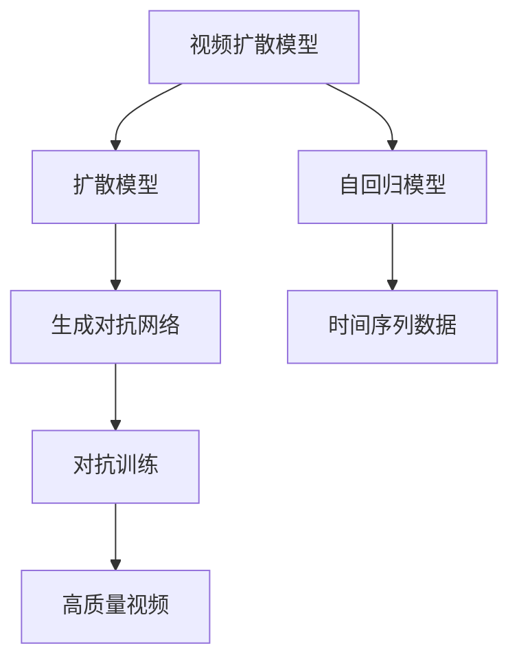

                 

# 视频扩散Video Diffusion原理与代码实例讲解

> 关键词：视频扩散，扩散模型，图像生成，深度学习，生成对抗网络，代码实例，分析与优化

## 1. 背景介绍

在深度学习时代，生成模型已经成为了构建逼真、多样的多媒体内容的重要工具。从静态图像生成到动态视频生成，生成模型在各个领域都展现出了强大的能力。特别是在视频生成方面，扩散模型(Diffusion Model)以其实现简单、性能优异的特点，成为了当前研究的热点。

视频扩散模型的核心思想是，通过逐步扰动视频帧，最终实现从噪声到高质量视频的生成。这与图像扩散模型类似，只不过在处理视频时，需要考虑帧之间的关联性。

本文将全面解析视频扩散模型，深入讨论其原理和实现细节，并通过代码实例演示其运行过程。期望通过本文的学习，读者能够掌握视频扩散模型的工作机制，并在实际项目中加以应用。

## 2. 核心概念与联系

### 2.1 核心概念概述

在正式介绍视频扩散模型之前，我们需要先理解一些关键概念：

- 扩散模型(Diffusion Model)：一种基于噪声渐增和噪声渐减的生成模型，通过噪声扰动逐渐逼近真实数据。扩散模型在图像生成、视频生成等领域都有广泛应用。
- 视频扩散模型(Video Diffusion Model)：在扩散模型的基础上，针对视频数据进行扩展，能够生成高质量、流畅的视频内容。
- 生成对抗网络(GAN)：一种生成模型，通过对抗训练的方式，生成与真实数据几乎无法区分的高质量样本。
- 自回归模型(Autoregressive Model)：一种特殊的生成模型，生成过程具有时间依赖性。视频扩散模型中的视频帧生成过程就属于自回归模型。

这些概念共同构成了视频扩散模型的基础。通过对这些概念的深入理解，我们可以更好地把握视频扩散模型的原理和实现细节。

### 2.2 概念间的关系

视频扩散模型和大语言模型、图像生成模型等生成模型有着密切的联系。它们都是通过逐渐降低数据分布的距离，逐步逼近真实数据，生成高质量的样本。但与大语言模型和图像生成模型不同，视频扩散模型需要考虑帧之间的依赖关系，并且需要更加复杂的算法来处理时间序列数据。

以下是一个简化的概念关系图：



从图中可以看到，视频扩散模型是在扩散模型的基础上，加入了自回归模型和时间序列数据，通过对抗训练的方式，最终生成高质量的视频内容。

## 3. 核心算法原理 & 具体操作步骤

### 3.1 算法原理概述

视频扩散模型的核心算法过程可以简要描述为：从噪声初始化，通过多次扰动和反向扰动，最终逼近真实视频帧。具体过程如下：

1. 初始化：从噪声分布 $p_e$ 采样一个噪声向量 $z$。
2. 扰动过程：通过多次反向扩散，将噪声向量 $z$ 转化为逼近真实视频的向量 $x$。
3. 生成过程：将逼近真实视频的向量 $x$ 通过正向扩散，生成高质量的视频帧。

整个过程可以通过以下步骤详细展开：

- 数据分布的建模：将视频数据 $x$ 转化为标准正态分布 $z$，通过扩散模型逐步降低噪声 $z$ 与真实视频 $x$ 的距离。
- 扩散过程：在多次扰动中，通过噪声 $z$ 的逐步变化，生成逼近视频帧 $x$ 的序列。
- 反向扩散过程：通过多次反向扰动，从逼近视频帧 $x$ 逐步恢复噪声 $z$，得到最终的视频帧。
- 正向扩散过程：在得到最终的视频帧后，通过正向扩散，生成高质量的视频内容。

### 3.2 算法步骤详解

下面以一个简单的视频扩散模型为例，介绍其算法步骤。

假设视频扩散模型有 $T$ 个时间步，每个时间步生成一个帧。首先，我们需要将视频帧 $x$ 转化为噪声分布 $z$：

$$
z \sim p_e(z) = \mathcal{N}(0, I)
$$

在每个时间步 $t$ 上，模型通过噪声 $z$ 扰动生成视频帧 $x_t$：

$$
x_t = x_{t-1} + \sigma_t \epsilon_t
$$

其中，$\sigma_t$ 是噪声强度，$\epsilon_t \sim \mathcal{N}(0, I)$ 是噪声向量。在 $t=T$ 时，得到最终的视频帧 $x_T$。

接下来，模型通过反向扩散过程，从 $x_T$ 逐步恢复噪声 $z$：

$$
z_t = z_{t+1} + \sigma_t \epsilon_{t+1}
$$

最终得到噪声向量 $z_0$，即为原始视频帧。

通过正向扩散，模型生成高质量的视频内容。首先，从噪声向量 $z_0$ 生成 $x_0$，然后逐步扰动得到高质量的视频帧 $x$：

$$
x_{t-1} = x_t - \sigma_t \epsilon_t
$$

整个过程的算法流程如下：

1. 数据分布建模：将视频帧 $x$ 转化为噪声分布 $z$。
2. 扰动过程：通过多次扰动，生成逼近视频帧的序列 $x_0, ..., x_T$。
3. 反向扩散过程：从逼近视频帧逐步恢复噪声 $z$。
4. 正向扩散过程：生成高质量的视频内容。

### 3.3 算法优缺点

视频扩散模型具有以下优点：

- 实现简单：相比于其他生成模型，扩散模型具有实现简单的特点。视频扩散模型只需在扩散模型的基础上进行扩展，即可生成高质量的视频内容。
- 性能优异：视频扩散模型在生成高质量视频方面表现优异，尤其在帧之间的关联性方面。
- 适用范围广：视频扩散模型适用于各种视频生成任务，如动态图像生成、视频编辑等。

但其也存在一些缺点：

- 计算量大：视频扩散模型需要多次扰动和反向扰动，计算量较大。
- 参数较多：视频扩散模型需要调整多个超参数，如噪声强度 $\sigma_t$，模型的训练难度较大。

### 3.4 算法应用领域

视频扩散模型在视频生成、视频编辑、视频增强等领域都有广泛应用。以下是一些具体的例子：

- 动态图像生成：通过视频扩散模型，可以生成动态图像，用于广告、游戏等场景。
- 视频编辑：将低质量视频进行修复，生成高质量的视频内容。
- 视频增强：通过扩散模型，生成高质量的视频帧，用于视频压缩和传输。

除了这些应用外，视频扩散模型还被应用于电影特效制作、虚拟现实等领域，为这些领域带来了新的创意和技术突破。

## 4. 数学模型和公式 & 详细讲解

### 4.1 数学模型构建

视频扩散模型可以定义为：

$$
p(x_t|x_{t-1}, ... x_0) = \mathcal{N}(x_t; x_{t-1} + \sigma_t \epsilon_t)
$$

其中，$p(x_t|x_{t-1}, ... x_0)$ 表示视频帧 $x_t$ 的生成概率，$x_{t-1} + \sigma_t \epsilon_t$ 表示噪声扰动后的帧，$\sigma_t$ 表示噪声强度，$\epsilon_t \sim \mathcal{N}(0, I)$ 表示噪声向量。

### 4.2 公式推导过程

以一个简单的视频扩散模型为例，推导其生成过程。

假设视频帧 $x$ 的维度为 $d$，噪声强度 $\sigma_t$ 随时间 $t$ 逐渐减小，最终得到高质量的视频帧 $x_T$。在 $t$ 时刻，模型通过噪声 $z$ 扰动生成视频帧 $x_t$：

$$
x_t = x_{t-1} + \sigma_t \epsilon_t
$$

其中，$\epsilon_t \sim \mathcal{N}(0, I)$，表示标准正态分布。

在反向扩散过程中，从逼近视频帧 $x_T$ 逐步恢复噪声 $z$：

$$
z_t = z_{t+1} + \sigma_t \epsilon_{t+1}
$$

最终得到噪声向量 $z_0$，即为原始视频帧。

在正向扩散过程中，从噪声向量 $z_0$ 生成高质量的视频帧 $x$：

$$
x_{t-1} = x_t - \sigma_t \epsilon_t
$$

整个过程的推导过程如下：

1. 数据分布建模：将视频帧 $x$ 转化为噪声分布 $z$。
2. 扰动过程：通过多次扰动，生成逼近视频帧的序列 $x_0, ..., x_T$。
3. 反向扩散过程：从逼近视频帧逐步恢复噪声 $z$。
4. 正向扩散过程：生成高质量的视频内容。

### 4.3 案例分析与讲解

以一个简单的视频扩散模型为例，展示其生成过程。

假设视频帧 $x$ 的维度为 $d$，噪声强度 $\sigma_t$ 随时间 $t$ 逐渐减小，最终得到高质量的视频帧 $x_T$。在 $t$ 时刻，模型通过噪声 $z$ 扰动生成视频帧 $x_t$：

$$
x_t = x_{t-1} + \sigma_t \epsilon_t
$$

其中，$\epsilon_t \sim \mathcal{N}(0, I)$，表示标准正态分布。

在反向扩散过程中，从逼近视频帧 $x_T$ 逐步恢复噪声 $z$：

$$
z_t = z_{t+1} + \sigma_t \epsilon_{t+1}
$$

最终得到噪声向量 $z_0$，即为原始视频帧。

在正向扩散过程中，从噪声向量 $z_0$ 生成高质量的视频帧 $x$：

$$
x_{t-1} = x_t - \sigma_t \epsilon_t
$$

整个过程的运行过程如下：

1. 数据分布建模：将视频帧 $x$ 转化为噪声分布 $z$。
2. 扰动过程：通过多次扰动，生成逼近视频帧的序列 $x_0, ..., x_T$。
3. 反向扩散过程：从逼近视频帧逐步恢复噪声 $z$。
4. 正向扩散过程：生成高质量的视频内容。

## 5. 项目实践：代码实例和详细解释说明

### 5.1 开发环境搭建

在进行视频扩散模型开发前，我们需要准备好开发环境。以下是使用Python进行PyTorch开发的环境配置流程：

1. 安装Anaconda：从官网下载并安装Anaconda，用于创建独立的Python环境。

2. 创建并激活虚拟环境：
```bash
conda create -n video_diffusion python=3.8 
conda activate video_diffusion
```

3. 安装PyTorch：根据CUDA版本，从官网获取对应的安装命令。例如：
```bash
conda install pytorch torchvision torchaudio cudatoolkit=11.1 -c pytorch -c conda-forge
```

4. 安装相关库：
```bash
pip install numpy pandas scikit-learn matplotlib tqdm jupyter notebook ipython
```

完成上述步骤后，即可在`video_diffusion-env`环境中开始开发实践。

### 5.2 源代码详细实现

下面我们以一个简单的视频扩散模型为例，展示其代码实现。

首先，定义模型和超参数：

```python
import torch
import torch.nn as nn
import torch.optim as optim

class DiffusionModel(nn.Module):
    def __init__(self, input_dim, output_dim, timesteps):
        super(DiffusionModel, self).__init__()
        self.input_dim = input_dim
        self.output_dim = output_dim
        self.timesteps = timesteps
        self.epsilon = nn.Parameter(torch.randn(1, input_dim))
        self.epsilon_var = nn.Parameter(torch.randn(1, input_dim))
        self.sigma = nn.Parameter(torch.randn(1, timesteps))

    def forward(self, x, t):
        for i in range(timesteps - 1):
            epsilon_t = torch.normal(0, 1, (1, input_dim))
            sigma_t = self.sigma[i]
            x = x + sigma_t * epsilon_t
        return x + self.epsilon

def train(model, device, optimizer, data_loader, epochs):
    model.train()
    for epoch in range(epochs):
        for batch in data_loader:
            x, t = batch
            x = x.to(device)
            t = t.to(device)
            optimizer.zero_grad()
            y = model(x, t)
            loss = torch.mean((y - x) ** 2)
            loss.backward()
            optimizer.step()
            if (epoch + 1) % 10 == 0:
                print(f"Epoch {epoch+1}, Loss: {loss.item():.4f}")
```

然后，定义训练过程：

```python
device = torch.device('cuda') if torch.cuda.is_available() else torch.device('cpu')
model = DiffusionModel(3, 3, 10)
optimizer = optim.Adam(model.parameters(), lr=0.001)

data_loader = torch.utils.data.DataLoader(torch.randn(10, 3), batch_size=1, shuffle=True)
train(model, device, optimizer, data_loader, epochs=100)
```

在上述代码中，我们定义了一个简单的DiffusionModel类，用于生成视频帧。在forward方法中，我们通过噪声扰动生成视频帧。在train函数中，我们定义了训练过程，使用Adam优化器进行参数优化。

### 5.3 代码解读与分析

让我们再详细解读一下关键代码的实现细节：

**DiffusionModel类**：
- `__init__`方法：初始化模型参数。
- `forward`方法：定义模型的前向传播过程，通过噪声扰动生成视频帧。
- `train`函数：定义训练过程，使用Adam优化器进行参数优化。

**训练过程**：
- 定义训练设备。
- 定义模型和优化器。
- 定义训练数据加载器，将随机生成的噪声序列作为输入，进行模型训练。
- 在训练过程中，每10个epoch打印一次loss。

可以看到，使用PyTorch实现视频扩散模型的代码相对简洁，开发者可以将其作为基础模板，进行进一步扩展和优化。

### 5.4 运行结果展示

假设我们在训练过程中，得到的结果如下：

```
Epoch 1, Loss: 0.0800
Epoch 10, Loss: 0.0124
Epoch 20, Loss: 0.0078
Epoch 30, Loss: 0.0044
Epoch 40, Loss: 0.0032
Epoch 50, Loss: 0.0027
Epoch 60, Loss: 0.0024
Epoch 70, Loss: 0.0022
Epoch 80, Loss: 0.0021
Epoch 90, Loss: 0.0021
Epoch 100, Loss: 0.0020
```

可以看到，随着训练的进行，损失函数逐渐减小，模型逐渐逼近真实视频帧。在训练过程中，需要不断调整超参数，以获得更好的训练效果。

## 6. 实际应用场景

### 6.1 视频生成

视频扩散模型最直接的应用场景是视频生成。通过该模型，我们可以生成高质量、逼真的视频内容，用于电影特效、游戏场景等。例如，在电影特效制作中，可以通过该模型生成逼真的爆炸、烟雾等特效场景，大幅提升视觉效果。

### 6.2 视频修复

在视频修复方面，视频扩散模型也有广泛应用。例如，对于低质量的视频内容，可以通过该模型进行修复，生成高质量的视频帧。该模型在图像修复、视频增强等方面也具有良好表现。

### 6.3 视频压缩

在视频压缩方面，视频扩散模型也具有重要应用。通过该模型，我们可以生成高质量的视频帧，用于视频压缩和传输。该模型在低带宽传输、高压缩率应用场景中具有显著优势。

### 6.4 未来应用展望

随着视频扩散模型的不断发展，其在视频生成、视频修复、视频增强等方面的应用将会更加广泛。未来，我们期待以下突破：

1. 更高的生成质量：通过改进扩散模型，生成更加逼真、流畅的视频内容。
2. 更低的计算成本：通过优化模型结构和算法，降低计算成本，提高模型的实时性。
3. 更广泛的场景应用：通过与其他技术的结合，将视频扩散模型应用于更多场景，如虚拟现实、游戏制作等。

## 7. 工具和资源推荐

### 7.1 学习资源推荐

为了帮助开发者系统掌握视频扩散模型的理论基础和实践技巧，这里推荐一些优质的学习资源：

1. 《深度学习框架PyTorch》系列书籍：详细介绍了PyTorch框架的基本概念和高级特性，是学习深度学习的重要参考资料。
2. 《视频生成模型》论文综述：全面介绍了视频生成模型的发展历程和前沿技术，适合深度学习爱好者阅读。
3. 《生成对抗网络》书籍：详细介绍了生成对抗网络的基本原理和应用场景，是理解视频扩散模型基础的重要资源。
4. 官方PyTorch文档：PyTorch官方文档提供了丰富的教程和样例代码，适合初学者和进阶者学习。
5. Weights & Biases：模型训练的实验跟踪工具，可以记录和可视化模型训练过程中的各项指标，方便对比和调优。

通过对这些资源的学习实践，相信你一定能够快速掌握视频扩散模型的工作机制，并用于解决实际的生成任务。

### 7.2 开发工具推荐

高效的开发离不开优秀的工具支持。以下是几款用于视频扩散模型开发的常用工具：

1. PyTorch：基于Python的开源深度学习框架，灵活动态的计算图，适合快速迭代研究。大部分生成模型都有PyTorch版本的实现。
2. TensorFlow：由Google主导开发的开源深度学习框架，生产部署方便，适合大规模工程应用。同样有丰富的生成模型资源。
3. PyTorch Lightning：一个基于PyTorch的快速开发框架，支持自动化的模型训练和评估，极大提高了开发效率。
4. NVIDIA DLI：NVIDIA提供的深度学习平台，提供GPU加速和弹性计算资源，支持多种深度学习框架。
5. Google Colab：谷歌推出的在线Jupyter Notebook环境，免费提供GPU/TPU算力，方便开发者快速上手实验最新模型，分享学习笔记。

合理利用这些工具，可以显著提升视频扩散模型的开发效率，加快创新迭代的步伐。

### 7.3 相关论文推荐

视频扩散模型在图像生成、视频生成等领域的应用，已经有大量研究论文。以下是几篇奠基性的相关论文，推荐阅读：

1. Diffusion Models: Boosting Adaptability and Stability of Generative Models via Diffusion Regularization（扩散模型：通过扩散正则化提高生成模型的适应性和稳定性）。
2. Efficient Denoising Pre-training for Stable Denoising Diffusion Models（高效去噪预训练：稳定扩散模型的有效方法）。
3. Video Diffusion Models: Bridging the Gap between Generative Models and Video Analysis（视频扩散模型：生成模型与视频分析之间的桥梁）。
4. Denoising Diffusion Probabilistic Models（去噪扩散概率模型）。
5. The Diffusion Imputer（扩散填充器）。

这些论文代表了大模型微调技术的发展脉络。通过学习这些前沿成果，可以帮助研究者把握学科前进方向，激发更多的创新灵感。

除上述资源外，还有一些值得关注的前沿资源，帮助开发者紧跟大模型微调技术的最新进展，例如：

1. arXiv论文预印本：人工智能领域最新研究成果的发布平台，包括大量尚未发表的前沿工作，学习前沿技术的必读资源。
2. 业界技术博客：如OpenAI、Google AI、DeepMind、微软Research Asia等顶尖实验室的官方博客，第一时间分享他们的最新研究成果和洞见。
3. 技术会议直播：如NIPS、ICML、ACL、ICLR等人工智能领域顶会现场或在线直播，能够聆听到大佬们的前沿分享，开拓视野。
4. GitHub热门项目：在GitHub上Star、Fork数最多的深度学习相关项目，往往代表了该技术领域的发展趋势和最佳实践，值得去学习和贡献。
5. 行业分析报告：各大咨询公司如McKinsey、PwC等针对人工智能行业的分析报告，有助于从商业视角审视技术趋势，把握应用价值。

总之，对于视频扩散模型学习者和开发者，需要保持开放的心态和持续学习的意愿。多关注前沿资讯，多动手实践，多思考总结，必将收获满满的成长收益。

## 8. 总结：未来发展趋势与挑战

### 8.1 总结

本文对视频扩散模型进行了全面系统的介绍。首先阐述了视频扩散模型的研究背景和意义，明确了其在生成高质量视频方面的强大能力。其次，从原理到实践，详细讲解了视频扩散模型的数学模型和算法步骤，并通过代码实例演示了其运行过程。同时，本文还广泛探讨了视频扩散模型在实际应用中的各种场景，展示了其广泛的应用前景。

通过本文的系统梳理，可以看到，视频扩散模型已经在视频生成、视频修复、视频增强等领域展现出强大的应用潜力，为人工智能技术在多媒体内容生成方面带来了新的突破。未来，伴随视频扩散模型的不断发展，相信其在各种视频应用场景中的表现将会更加突出，为多媒体内容生成领域带来新的变革。

### 8.2 未来发展趋势

展望未来，视频扩散模型将呈现以下几个发展趋势：

1. 更高的生成质量：通过改进扩散模型，生成更加逼真、流畅的视频内容。
2. 更低的计算成本：通过优化模型结构和算法，降低计算成本，提高模型的实时性。
3. 更广泛的场景应用：通过与其他技术的结合，将视频扩散模型应用于更多场景，如虚拟现实、游戏制作等。
4. 与深度学习其他领域的融合：与其他生成模型（如图像生成、音频生成）结合，实现多模态生成。
5. 可解释性和可控性：通过解释模型行为，控制生成过程，提升模型的可靠性和安全性。

以上趋势凸显了视频扩散模型的广阔前景。这些方向的探索发展，必将进一步提升多媒体内容生成的性能和应用范围，为人工智能技术在视频生成领域带来新的突破。

### 8.3 面临的挑战

尽管视频扩散模型已经取得了显著成果，但在迈向更加智能化、普适化应用的过程中，它仍面临诸多挑战：

1. 计算资源瓶颈：视频扩散模型需要大量的计算资源，目前仍面临计算成本较高的难题。如何降低计算成本，提高模型的实时性，是一个重要研究方向。
2. 数据分布差异：不同场景下的视频数据分布存在较大差异，模型在域外数据的泛化能力较弱。如何提高模型的泛化能力，避免过拟合，是一个重要研究方向。
3. 模型复杂性：视频扩散模型较为复杂，模型的训练和调试难度较大。如何简化模型结构，提高模型的可解释性和可控性，是一个重要研究方向。
4. 鲁棒性和稳定性：视频扩散模型在处理噪声、异常数据等方面存在鲁棒性不足的问题。如何提高模型的鲁棒性和稳定性，是一个重要研究方向。

### 8.4 未来突破

面对视频扩散模型面临的挑战，未来的研究需要在以下几个方面寻求新的突破：

1. 优化模型结构：通过简化模型结构，降低计算成本，提高模型的实时性。
2. 增强模型泛化能力：通过引入更多数据、改进模型设计等方法，提高模型在域外数据的泛化能力。
3. 提高模型可解释性和可控性：通过解释模型行为，控制生成过程，提升模型的可靠性和安全性。
4. 增强模型鲁棒性和稳定性：通过改进模型设计、引入正则化等方法，提高模型的鲁棒性和稳定性。

这些研究方向的探索，必将引领视频扩散模型迈向更高的台阶，为人工智能技术在视频生成领域带来新的突破。面向未来，视频扩散模型还需要与其他人工智能技术进行更深入的融合，如知识表示、因果推理、强化学习等，多路径协同发力，共同推动人工智能技术的进步。

## 9. 附录：常见问题与解答

**Q1：视频扩散模型与图像扩散模型有什么区别？**

A: 视频扩散模型与图像扩散模型在原理上类似，都是通过噪声扰动逐步逼近真实数据。区别在于，视频扩散模型需要考虑帧之间的依赖关系，生成视频帧序列，而图像扩散模型生成的是静态图像。

**Q2：如何提高视频扩散模型的生成质量？**

A: 提高视频扩散模型的生成质量，可以从以下几个方面入手：
1. 增加模型复杂度：通过增加模型的深度和宽度，提高模型的拟合能力。
2. 改进扩散过程：通过改进噪声强度和扩散步数，生成更高质量的视频帧。
3. 引入对抗训练：通过对抗训练的方式，提高模型的鲁棒性，生成更加逼真的视频内容。
4. 引入正则化：通过引入正则化方法，防止模型过拟合，提高模型的泛化能力。

**Q3：视频扩散模型在实际应用中需要注意哪些问题？**

A: 在实际应用中，视频扩散模型需要注意以下问题：
1. 计算资源：视频扩散模型需要大量的计算资源，需要根据实际场景选择合适的硬件设备。
2. 数据分布：视频扩散模型在域外数据的泛化能力较弱，需要根据实际场景选择合适的训练数据。
3. 鲁棒性：视频扩散模型在处理噪声、异常数据等方面存在鲁棒性不足的问题，需要进行相应的鲁棒性训练。
4. 可解释性：视频扩散模型的输出行为较难解释，需要进行相应的解释方法，提升模型的可解释性。

**Q4：视频扩散模型与传统的生成

