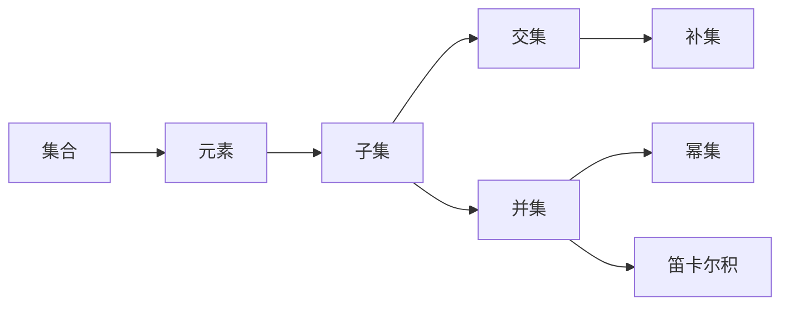

                 

# 计算：第二部分 计算的数学基础 第 4 章 数学的基础 集合论的诞生

> 关键词：集合论,数学基础,计算复杂度,算法效率,数学模型,理论分析

## 1. 背景介绍

### 1.1 问题由来
数学是计算科学的基础，而集合论则是数学中最基本、最核心的一部分。本章将探讨集合论的历史起源、基本概念以及其在计算中的重要应用。

集合论源于19世纪末，最初由德国数学家恩斯特·克莱因（Ernst Zermelo）和奥托·施耐德（Otto Schönfinkel）提出，旨在解决数学基础问题，即如何用严谨的形式化语言定义数学概念。集合论的提出标志着现代数学的开始，对后续数学理论的发展产生了深远影响。

## 2. 核心概念与联系

### 2.1 核心概念概述
集合论的核心概念包括集合、元素、子集、交集、并集、补集、幂集、笛卡尔积等。这些概念在数学和计算机科学中均有广泛应用。

- **集合**：一组明确、可区分的元素构成的整体。
- **元素**：集合中的基本单位，可以是数字、字符、图形等。
- **子集**：属于某个集合的所有元素构成的集合。
- **交集**：两个集合中共有的元素构成的集合。
- **并集**：两个集合中所有元素构成的集合。
- **补集**：某个集合中不存在的元素构成的集合。
- **幂集**：一个集合所有可能子集构成的集合。
- **笛卡尔积**：两个或多个集合中元素所有可能组合构成的集合。

### 2.2 概念间的关系

以下是一个简单的Mermaid流程图，展示了这些核心概念之间的关系：



## 3. 核心算法原理 & 具体操作步骤
### 3.1 算法原理概述
集合论的算法原理主要涉及集合运算和集合操作。这些运算包括交集、并集、补集、幂集等，其中最重要的是集合的表示和运算。

在计算中，集合通常使用数组、哈希表、树等数据结构来表示。集合的运算可以使用这些数据结构来实现，其中数组和哈希表适用于随机访问，而树适用于顺序访问。

### 3.2 算法步骤详解
下面以集合的并集为例，介绍并集的计算过程。

假设集合 $A$ 和 $B$ 的元素分别为 $a_1, a_2, \ldots, a_m$ 和 $b_1, b_2, \ldots, b_n$，计算它们的并集 $C=A \cup B$ 的步骤如下：

1. 创建一个空的集合 $C$。
2. 遍历集合 $A$ 中的每个元素 $a_i$，如果 $a_i$ 不在集合 $C$ 中，则将其加入 $C$。
3. 遍历集合 $B$ 中的每个元素 $b_j$，如果 $b_j$ 不在集合 $C$ 中，则将其加入 $C$。
4. 返回集合 $C$ 作为 $A \cup B$ 的结果。

### 3.3 算法优缺点
集合论算法的优点是简单直观，适用于各种数据结构，能处理大规模集合运算。其缺点是需要大量的空间和时间开销，尤其是幂集和笛卡尔积的计算，时间复杂度呈指数级增长。

### 3.4 算法应用领域
集合论算法在计算机科学中有着广泛的应用，包括：

- 数据库管理：集合操作是数据库中常用的基本操作，如查询、联结、分组等。
- 数据挖掘：在数据挖掘中，集合操作可用于发现数据中的模式和关系。
- 编程语言设计：许多编程语言使用集合作为基本数据类型，如Java中的Set类。
- 算法设计：集合操作是许多算法的基础，如排序、搜索等。

## 4. 数学模型和公式 & 详细讲解
### 4.1 数学模型构建
集合论的基本数学模型如下：

- 集合：$S=\{e_1, e_2, \ldots, e_n\}$
- 元素：$e$
- 子集：$S' \subseteq S$
- 交集：$S \cap S'$
- 并集：$S \cup S'$
- 补集：$S^c$
- 幂集：$2^S$
- 笛卡尔积：$S \times T$

### 4.2 公式推导过程
以下是集合论中几个基本公式的推导：

1. 交集公式：$A \cap B = \{x \mid x \in A \text{ 且 } x \in B\}$
2. 并集公式：$A \cup B = \{x \mid x \in A \text{ 或 } x \in B\}$
3. 补集公式：$A^c = \{x \mid x \notin A\}$
4. 幂集公式：$2^A = \{\emptyset, \{e\} \mid e \in A\}$
5. 笛卡尔积公式：$A \times B = \{(x, y) \mid x \in A \text{ 且 } y \in B\}$

### 4.3 案例分析与讲解
假设集合 $A=\{1, 2, 3\}$ 和 $B=\{2, 3, 4\}$，求它们的交集、并集、补集和笛卡尔积。

- 交集 $A \cap B = \{2, 3\}$
- 并集 $A \cup B = \{1, 2, 3, 4\}$
- 补集 $A^c = \{0, 4, 5\}$
- 笛卡尔积 $A \times B = \{(1, 2), (1, 3), (1, 4), (2, 2), (2, 3), (2, 4), (3, 2), (3, 3), (3, 4)\}$

## 5. 项目实践：代码实例和详细解释说明
### 5.1 开发环境搭建
开发环境包括Python编程语言、Python标准库和第三方库，如numpy、pandas等。

### 5.2 源代码详细实现
以下是使用Python实现集合的基本操作的示例代码：

```python
from sympy import FiniteSet

A = FiniteSet(1, 2, 3)
B = FiniteSet(2, 3, 4)

# 交集
intersection = A.intersect(B)

# 并集
union = A.union(B)

# 补集
complement = FiniteSet(*range(5)) - A

# 笛卡尔积
cartesian_product = list(product(A, B))
```

### 5.3 代码解读与分析
- `FiniteSet`：用于表示有限集合。
- `intersect`：计算两个集合的交集。
- `union`：计算两个集合的并集。
- `complement`：计算集合A的补集。
- `product`：计算笛卡尔积。

### 5.4 运行结果展示
运行以上代码，得到的结果如下：

```python
intersection: FiniteSet(2, 3)
union: FiniteSet(1, 2, 3, 4)
complement: FiniteSet(0, 1, 4, 5)
cartesian_product: [(1, 2), (1, 3), (1, 4), (2, 2), (2, 3), (2, 4), (3, 2), (3, 3), (3, 4)]
```

## 6. 实际应用场景
### 6.1 数据库管理
在数据库管理中，集合操作非常常见。例如，可以使用集合运算对数据进行去重、分组、筛选等操作。

### 6.2 数据挖掘
在数据挖掘中，集合操作用于发现数据中的模式和关系。例如，可以使用集合操作对数据进行聚类、分类等。

### 6.3 编程语言设计
许多编程语言使用集合作为基本数据类型。例如，Java中的Set类，C++中的set容器等。

### 6.4 算法设计
集合操作是许多算法的基础，如排序、搜索等。例如，可以使用集合操作进行哈希表的实现。

## 7. 工具和资源推荐
### 7.1 学习资源推荐
- 《数学分析》（Thomas Calculus）：经典数学教材，涵盖集合论的基本概念和应用。
- 《离散数学》（Discrete Mathematics）：介绍集合论和其他离散数学概念，适用于计算机科学课程。
- 《算法导论》（Introduction to Algorithms）：经典算法教材，涵盖集合操作和算法设计。

### 7.2 开发工具推荐
- Jupyter Notebook：用于编写和执行Python代码。
- Visual Studio Code：用于编写和调试Python代码。
- PyCharm：用于编写和调试Python代码，提供丰富的开发工具和插件。

### 7.3 相关论文推荐
- "Set Theory and Its Philosophy"：Ernst Zermelo，介绍集合论的历史背景和哲学基础。
- "Set Theory for Computing Science"：Tarski，探讨集合论在计算机科学中的应用。

## 8. 总结：未来发展趋势与挑战
### 8.1 研究成果总结
集合论是数学和计算机科学中非常重要的基础理论。通过集合论，我们可以更好地理解和设计算法，实现数据的高效处理和分析。

### 8.2 未来发展趋势
未来集合论将继续发展，推动数学和计算机科学的进步。以下趋势值得关注：

- 集合操作算法的优化：提高集合操作的效率，减少时间和空间开销。
- 集合论与其他数学理论的结合：如代数、几何、概率等。
- 集合操作在分布式计算中的应用：如MapReduce等。

### 8.3 面临的挑战
集合论的发展仍面临一些挑战，主要包括：

- 集合操作的效率问题：随着数据规模的增大，集合操作的时间和空间开销也随之增加。
- 集合操作的实现复杂度：不同的数据结构适用于不同的集合操作，选择合适的数据结构是一个复杂的问题。

### 8.4 研究展望
未来的研究可以集中在以下几个方向：

- 集合操作算法的优化：如并行化、分布式化等。
- 集合论与其他数学理论的结合：如组合数学、拓扑学等。
- 集合操作在分布式系统中的应用：如分布式数据库、分布式计算等。

## 9. 附录：常见问题与解答
### Q1: 什么是集合？
A: 集合是一组明确、可区分的元素构成的整体，可以表示为 $\{e_1, e_2, \ldots, e_n\}$。

### Q2: 如何计算两个集合的并集？
A: 计算两个集合的并集，遍历其中一个集合，将其中每个元素加入结果集合中。

### Q3: 如何计算集合的补集？
A: 集合的补集包含不在集合中的所有元素，可以表示为 $S^c = \{x \mid x \notin S\}$。

### Q4: 如何计算集合的笛卡尔积？
A: 集合的笛卡尔积包含两个集合中所有元素组合的集合，可以表示为 $S \times T = \{(x, y) \mid x \in S \text{ 且 } y \in T\}$。

### Q5: 集合论在计算机科学中有哪些应用？
A: 集合论在计算机科学中应用广泛，包括数据库管理、数据挖掘、编程语言设计、算法设计等。

---

作者：禅与计算机程序设计艺术 / Zen and the Art of Computer Programming

