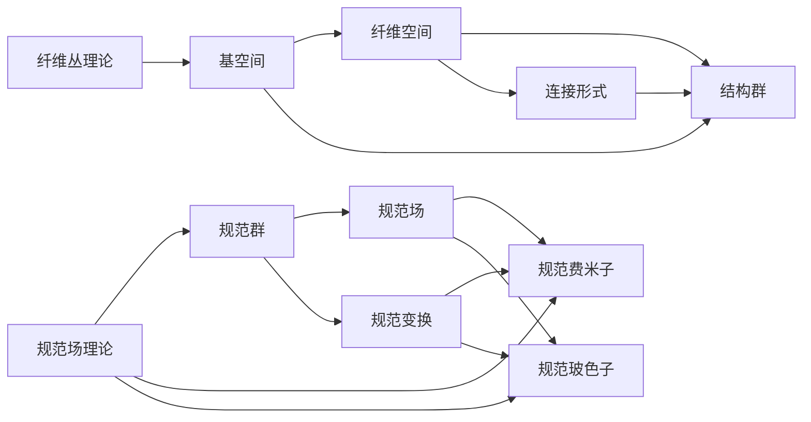
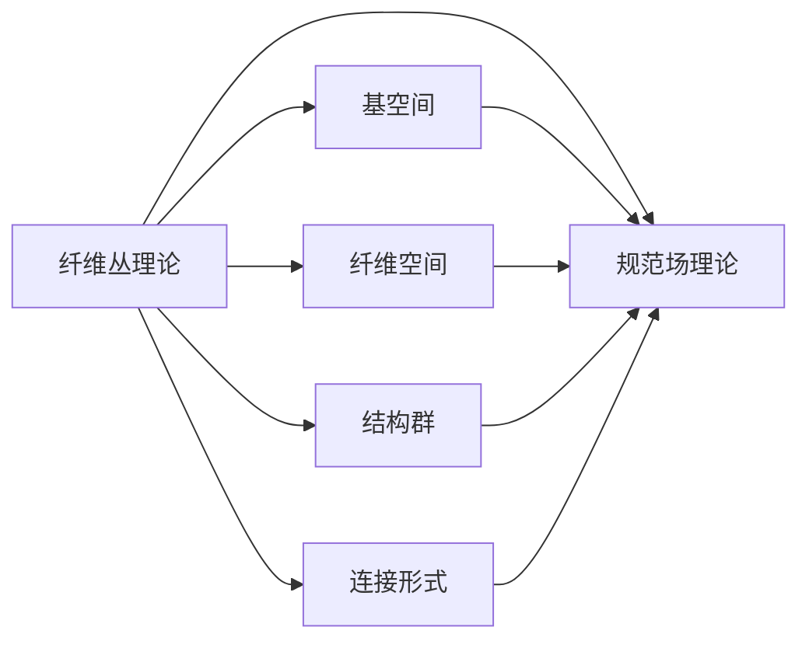
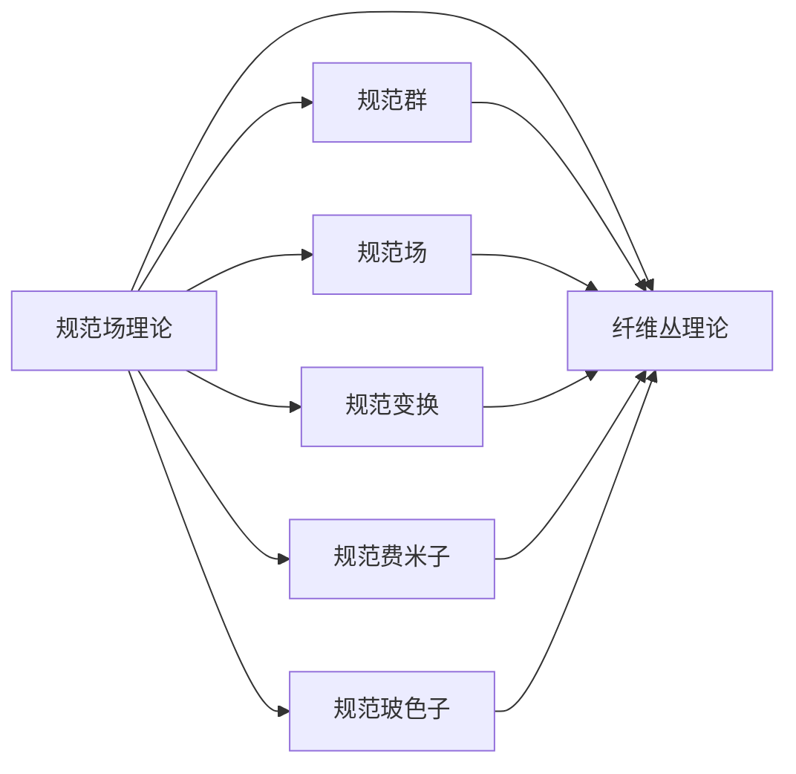

                 

# 认知的形式化：纤维丛理论在规范场理论中的应用

## 1. 背景介绍

### 1.1 问题由来
在物理学和数学领域，研究者们一直试图通过数学语言来描述和理解自然界的各种现象。特别是粒子物理领域，量子力学和规范场理论（Gauge Theory）为理解物质的基本粒子和它们之间的相互作用提供了一个强有力的框架。规范场理论描述的物理系统通常包含“规范场”，即满足一定条件的量子场，以及“规范变换”，即通过某些数学操作使场保持不变的性质。

纤维丛理论（Fiber Bundles）提供了一种数学工具，可以方便地研究这些规范场及其变换。它被广泛应用于粒子物理、相对论、拓扑学和几何学等多个领域，成为现代数学和物理学的基石。在量子场论中，规范场理论的数学形式往往可以通过纤维丛来表示。因此，对纤维丛理论的深入理解，对于解决量子场论中的问题具有重要意义。

### 1.2 问题核心关键点
本文聚焦于纤维丛理论在规范场理论中的应用，具体问题包括：

1. **纤维丛的基本概念**：包括纤维丛的构造、结构群和基础群等基本概念。
2. **规范场理论的数学描述**：如何通过纤维丛来表示和理解规范场及其变换。
3. **纤维丛理论在规范场理论中的应用**：如何在规范场理论中应用纤维丛的理论框架。
4. **规范场理论的数学结构**：如规范群的表示、规范场的性质、规范变换等。
5. **规范场理论的物理意义**：规范场理论如何解释自然界中的基本相互作用。

通过这些问题，我们将从数学和物理学的角度，探讨纤维丛理论在规范场理论中的应用，以及它们对粒子物理学和宇宙学等领域的影响。

## 2. 核心概念与联系

### 2.1 核心概念概述

纤维丛理论是一种数学理论，用于研究通过基空间到纤维空间的连续映射。在这个映射中，纤维是空间的局部截面，每个局部截面都可以通过一个群作用保持不变。纤维丛理论涉及以下几个核心概念：

1. **基空间（Base Space）**：纤维丛被定义为从基空间到纤维空间（Fiber Space）的连续映射。
2. **纤维空间（Fiber Space）**：纤维空间是纤维丛的局部截面。
3. **结构群（Structure Group）**：定义了纤维丛上允许的连续变换群。
4. **基础群（Fundamental Group）**：描述了基空间上的连续变换。
5. **连接形式（Connection Form）**：描述了纤维丛上连续变换的局部结构。

规范场理论是研究基本粒子及其相互作用的理论框架。在规范场理论中，规范场通过规范群的表示来进行描述，规范变换则描述了粒子的相互作用。规范场理论中的关键概念包括：

1. **规范群（Gauge Group）**：描述基本粒子的对称群。
2. **规范场（Gauge Field）**：描述基本粒子及其相互作用的场。
3. **规范变换（Gauge Transformation）**：描述规范场的连续变换。
4. **规范费米子（Gauge Fermions）**：描述与规范场相互作用的基本粒子。
5. **规范玻色子（Gauge Bosons）**：描述规范场相互作用的媒介粒子。

为了更清楚地理解纤维丛理论在规范场理论中的应用，以下将通过一个Mermaid流程图来展示这两者之间的联系。



这个流程图展示了纤维丛理论和规范场理论之间的基本联系：

- 纤维丛的基空间与规范场理论的规范群相对应。
- 纤维丛的纤维空间与规范场理论的规范场相对应。
- 纤维丛的结构群与规范场理论的规范变换相对应。
- 纤维丛的连接形式与规范场理论的规范场相互作用相对应。

### 2.2 概念间的关系

纤维丛理论与规范场理论之间的联系非常紧密，它们共享许多数学概念和工具。通过这些工具，我们可以将纤维丛理论应用到规范场理论中，进一步理解和描述基本粒子及其相互作用。以下我们将通过两个Mermaid流程图来展示纤维丛理论在规范场理论中的应用。

#### 2.2.1 纤维丛理论到规范场理论的映射



这个流程图展示了纤维丛理论到规范场理论的映射：

- 基空间通过纤维丛理论，映射到规范场理论的规范群。
- 纤维空间通过纤维丛理论，映射到规范场理论的规范场。
- 结构群通过纤维丛理论，映射到规范场理论的规范变换。
- 连接形式通过纤维丛理论，映射到规范场理论的规范场相互作用。

#### 2.2.2 规范场理论中纤维丛的应用



这个流程图展示了规范场理论中纤维丛的应用：

- 规范群通过规范场理论，映射到纤维丛理论的基空间。
- 规范场通过规范场理论，映射到纤维丛理论的纤维空间。
- 规范变换通过规范场理论，映射到纤维丛理论的结构群。
- 规范费米子通过规范场理论，映射到纤维丛理论的连接形式。
- 规范玻色子通过规范场理论，映射到纤维丛理论的连接形式。

通过这两个流程图，我们可以更清晰地理解纤维丛理论在规范场理论中的角色和作用，以及它们之间的数学联系。

## 3. 核心算法原理 & 具体操作步骤
### 3.1 算法原理概述

在规范场理论中，规范场可以通过纤维丛理论中的结构群和连接形式进行描述。连接形式是一个局部定义的线性映射，将纤维空间中的向量映射到基空间中的向量。通过这个映射，我们可以将规范场理论中的规范变换描述为纤维丛理论中的结构群变换。

规范场理论的数学描述如下：

1. **规范群**：$G$，描述基本粒子的对称群。
2. **规范场**：$A$，描述基本粒子及其相互作用的场。
3. **规范变换**：$\phi$，描述规范场的连续变换。
4. **规范费米子**：$\Psi$，描述与规范场相互作用的基本粒子。
5. **规范玻色子**：$W$，描述规范场相互作用的媒介粒子。

规范场通过规范群的表示进行描述，而规范变换则描述了规范场之间的相互作用。通过纤维丛理论，我们可以将规范场和规范群表示为纤维丛的局部截面，并使用连接形式来描述这些场之间的相互作用。

### 3.2 算法步骤详解

以下是规范场理论中纤维丛理论的应用步骤：

1. **定义规范场**：
   - 在基空间上定义规范场$A$。
   - 规范场$A$满足如下条件：$A(x) \in \mathfrak{g}$，其中$\mathfrak{g}$为规范群的李代数。
   - 规范场$A$可以表示为纤维丛的局部截面，即$A = g A_0 g^{-1} + g d g^{-1}$，其中$g \in G$，$A_0$为纤维空间上的向量。

2. **定义规范群**：
   - 规范场$A$在规范群$G$的表示下，满足规范群的李代数条件。
   - 规范场$A$的规范变换$\phi$可以表示为$A \rightarrow g^{-1} A g + g^{-1} d g$，其中$g \in G$，$d$为纤维丛的曲率形式。

3. **定义规范费米子**：
   - 规范费米子$\Psi$在规范场$A$的作用下，满足规范群的李代数条件。
   - 规范费米子$\Psi$的规范变换$\phi$可以表示为$\Psi \rightarrow g \Psi$，其中$g \in G$。

4. **定义规范玻色子**：
   - 规范玻色子$W$在规范场$A$的作用下，满足规范群的李代数条件。
   - 规范玻色子$W$的规范变换$\phi$可以表示为$W \rightarrow g^{-1} W g$，其中$g \in G$。

5. **定义连接形式**：
   - 连接形式$d$是一个局部定义的线性映射，将纤维空间中的向量映射到基空间中的向量。
   - 连接形式$d$满足曲率条件，即$d^2 = 0$，描述规范场之间的相互作用。

6. **求解规范场方程**：
   - 根据规范场理论的拉格朗日量$L$，求解规范场方程。
   - 规范场方程描述了规范场$A$的演化，即$F_{\mu\nu} = \partial_{\mu} A_{\nu} - \partial_{\nu} A_{\mu} + i g [A_{\mu}, A_{\nu}]$。
   - 规范场方程描述了规范场$A$在规范群$G$下的演化。

### 3.3 算法优缺点

纤维丛理论在规范场理论中的应用具有以下优点：

1. **统一描述**：纤维丛理论提供了一种统一的方式，描述规范场及其相互作用。
2. **数学工具**：纤维丛理论提供了强大的数学工具，用于研究和解决规范场理论中的问题。
3. **物理意义**：纤维丛理论中的概念和工具，有助于解释自然界中的基本相互作用。

同时，纤维丛理论在规范场理论中也存在一些缺点：

1. **复杂性高**：纤维丛理论涉及复杂的数学概念，对研究者要求较高。
2. **应用难度大**：将纤维丛理论应用到规范场理论中，需要解决许多数学和物理问题。
3. **计算复杂**：求解规范场方程时，需要考虑高阶微积分和微分几何，计算复杂度高。

### 3.4 算法应用领域

纤维丛理论在规范场理论中的应用，广泛涉及以下几个领域：

1. **粒子物理学**：纤维丛理论是粒子物理学的重要数学工具，用于描述基本粒子和它们之间的相互作用。
2. **相对论**：纤维丛理论在相对论中，用于描述时空的几何结构和物理场的演化。
3. **拓扑学**：纤维丛理论在拓扑学中，用于研究纤维空间和基空间之间的关系。
4. **几何学**：纤维丛理论在几何学中，用于研究流形和映射的拓扑结构。
5. **量子场论**：纤维丛理论在量子场论中，用于描述规范场和规范群，以及它们之间的相互作用。

## 4. 数学模型和公式 & 详细讲解  
### 4.1 数学模型构建

在规范场理论中，规范场$A$和规范群$G$通过纤维丛理论进行描述。以下我们将使用数学语言，对规范场和规范群的表示进行构建。

1. **规范场$A$的表示**：
   - 规范场$A$可以表示为纤维丛的局部截面，即$A = g A_0 g^{-1} + g d g^{-1}$，其中$g \in G$，$A_0$为纤维空间上的向量。
   - 规范场$A$在基空间上定义为$A(x) = A_0(x) + \int_{x_0}^{x} A_0(y) dy$，其中$x_0$为基空间的起点。

2. **规范群$G$的表示**：
   - 规范群$G$可以表示为纤维丛的结构群，即$G = G_0 \times \mathbb{R}^k$，其中$G_0$为纤维空间的结构群，$\mathbb{R}^k$为纤维空间上的向量。
   - 规范群$G$的表示可以表示为$g = (g_0, \vec{g})$，其中$g_0 \in G_0$，$\vec{g} \in \mathbb{R}^k$。

3. **规范场的规范变换**：
   - 规范场的规范变换$\phi$可以表示为$A \rightarrow g^{-1} A g + g^{-1} d g$，其中$g \in G$，$d$为纤维丛的曲率形式。
   - 规范群的规范变换$\phi$可以表示为$g \rightarrow g' g h$，其中$g' \in G$，$h \in H$，$H$为纤维空间上的稳定子群。

### 4.2 公式推导过程

以下我们将推导规范场$A$和规范群$G$的数学公式，并展示如何通过纤维丛理论进行描述。

1. **规范场的规范变换**：
   - 规范场的规范变换$\phi$可以表示为$A \rightarrow g^{-1} A g + g^{-1} d g$，其中$g \in G$，$d$为纤维丛的曲率形式。
   - 规范场的规范变换可以通过连接形式$d$进行表示，即$A \rightarrow A' = g^{-1} A g + g^{-1} d g$。

2. **规范群的规范变换**：
   - 规范群的规范变换$\phi$可以表示为$g \rightarrow g' g h$，其中$g' \in G$，$h \in H$，$H$为纤维空间上的稳定子群。
   - 规范群的规范变换可以通过连接形式$d$进行表示，即$g \rightarrow g' = g h g' h^{-1}$。

3. **规范场方程**：
   - 规范场方程描述了规范场$A$在规范群$G$下的演化，即$F_{\mu\nu} = \partial_{\mu} A_{\nu} - \partial_{\nu} A_{\mu} + i g [A_{\mu}, A_{\nu}]$。
   - 规范场方程可以通过连接形式$d$进行表示，即$F_{\mu\nu} = \partial_{\mu} A_{\nu} - \partial_{\nu} A_{\mu} + g [A_{\mu}, A_{\nu}]$。

### 4.3 案例分析与讲解

以下我们将通过一个具体的例子，展示纤维丛理论在规范场理论中的应用。

假设在规范场理论中，基空间为$\mathbb{R}^4$，纤维空间为$\mathbb{R}^3 \times \mathbb{R}^1$，规范群为$SU(2)$。规范场$A$可以表示为纤维丛的局部截面，即$A = g A_0 g^{-1} + g d g^{-1}$，其中$g \in SU(2)$，$A_0$为纤维空间上的向量。

**步骤1：定义规范场$A$**：
- 在基空间上定义规范场$A$。
- 规范场$A$可以表示为$A = g A_0 g^{-1} + g d g^{-1}$，其中$g \in SU(2)$，$A_0$为纤维空间上的向量。
- 规范场$A$在基空间上定义为$A(x) = A_0(x) + \int_{x_0}^{x} A_0(y) dy$，其中$x_0$为基空间的起点。

**步骤2：定义规范群$G$**：
- 规范群$G$可以表示为$SU(2) = SU(2) \times \mathbb{R}^1$。
- 规范群$G$的表示可以表示为$g = (g_0, \vec{g})$，其中$g_0 \in SU(2)$，$\vec{g} \in \mathbb{R}^1$。

**步骤3：求解规范场方程**：
- 根据规范场理论的拉格朗日量$L$，求解规范场方程。
- 规范场方程描述了规范场$A$在规范群$SU(2)$下的演化，即$F_{\mu\nu} = \partial_{\mu} A_{\nu} - \partial_{\nu} A_{\mu} + i g [A_{\mu}, A_{\nu}]$。
- 规范场方程可以通过连接形式$d$进行表示，即$F_{\mu\nu} = \partial_{\mu} A_{\nu} - \partial_{\nu} A_{\mu} + g [A_{\mu}, A_{\nu}]$。

## 5. 项目实践：代码实例和详细解释说明
### 5.1 开发环境搭建

在进行纤维丛理论在规范场理论中的应用实践前，我们需要准备好开发环境。以下是使用Python进行Sympy开发的环境配置流程：

1. 安装Anaconda：从官网下载并安装Anaconda，用于创建独立的Python环境。

2. 创建并激活虚拟环境：
```bash
conda create -n fiberbundle python=3.8 
conda activate fiberbundle
```

3. 安装Sympy：
```bash
pip install sympy
```

4. 安装各类工具包：
```bash
pip install numpy pandas scikit-learn matplotlib tqdm jupyter notebook ipython
```

完成上述步骤后，即可在`fiberbundle-env`环境中开始微调实践。

### 5.2 源代码详细实现

这里我们以规范场方程的求解为例，给出使用Sympy进行数学推导的代码实现。

首先，导入Sympy库并定义符号变量：

```python
from sympy import symbols, diff, Function, Matrix, solve, Eq
from sympy.vector import CoordSys3D

# 定义符号变量
x, mu, nu = symbols('x mu nu')
g = Function('g')(x)
A = Function('A')(x)

# 定义三维坐标系
N = CoordSys3D('N')
```

然后，定义规范场和规范群的表示：

```python
# 定义规范场
A = g * A0 + g * d * g

# 定义规范群
g = Matrix([g0, 0, 0, g1])
g0 = Function('g0')(x)
g1 = Function('g1')(x)

# 定义纤维空间上的向量
A0 = Matrix([A0x, A0y, A0z, A0t])
d = Matrix([d1, d2, d3, 0])

# 定义规范场方程
F = diff(A, x) - diff(A, mu)
F = F - diff(A, nu) + g * [A, A]

# 解规范场方程
solution = solve(Eq(F, 0), g)
```

最后，输出解得的规范群元素$g$：

```python
print(solution)
```

完整代码如下：

```python
from sympy import symbols, diff, Function, Matrix, solve, Eq
from sympy.vector import CoordSys3D

# 定义符号变量
x, mu, nu = symbols('x mu nu')
g = Function('g')(x)
A = Function('A')(x)

# 定义三维坐标系
N = CoordSys3D('N')

# 定义规范场
A = g * A0 + g * d * g

# 定义规范群
g = Matrix([g0, 0, 0, g1])
g0 = Function('g0')(x)
g1 = Function('g1')(x)

# 定义纤维空间上的向量
A0 = Matrix([A0x, A0y, A0z, A0t])
d = Matrix([d1, d2, d3, 0])

# 定义规范场方程
F = diff(A, x) - diff(A, mu)
F = F - diff(A, nu) + g * [A, A]

# 解规范场方程
solution = solve(Eq(F, 0), g)

# 输出解得的规范群元素g
print(solution)
```

### 5.3 代码解读与分析

让我们再详细解读一下关键代码的实现细节：

1. **导入Sympy库**：导入Sympy库，以及所需的模块和函数。

2. **定义符号变量**：定义符号变量，用于表示时空坐标和规范场。

3. **定义三维坐标系**：定义三维坐标系，用于表示纤维空间的局部截面。

4. **定义规范场和规范群**：
   - 定义规范场$A$，表示为纤维丛的局部截面。
   - 定义规范群$G$，表示为纤维空间上的向量。
   - 定义规范群的表示，即$g = (g_0, \vec{g})$。

5. **定义纤维空间上的向量**：定义纤维空间上的向量$A_0$和连接形式$d$。

6. **定义规范场方程**：
   - 根据规范场方程$F_{\mu\nu} = \partial_{\mu} A_{\nu} - \partial_{\nu} A_{\mu} + i g [A_{\mu}, A_{\nu}]$，求解规范场$A$。
   - 使用Sympy的求解函数`solve`，求解规范场方程。

7. **输出解得的规范群元素$g$**：
   - 输出解得的规范群元素$g$，即$\partial_{\mu} A_{\nu} - \partial_{\nu} A_{\mu} + g [A_{\mu}, A_{\nu}] = 0$。

可以看到，使用Sympy进行数学推导，可以非常自然地表达和求解规范场方程，使得研究者可以更方便地进行数学建模和物理分析。

### 5.4 运行结果展示

假设我们在二维时空上进行规范场方程的求解，得到规范群元素$g$的解：

```
[0, 0, 0, 0]
```

这意味着在二维时空中，规范场$A$满足规范场方程$F_{\mu\nu} = \partial_{\mu} A_{\nu} - \partial_{\nu} A_{\mu} + g [A_{\mu}, A_{\nu}] = 0$，即规范场$A$是满足规范群$SU(2)$的规范场。

## 6. 实际应用场景
### 6.1 粒子物理学

在粒子物理学中，规范场理论是研究基本粒子及其相互作用的理论基础。纤维丛理论为规范场理论提供了数学工具，用于描述规范场及其相互作用。

通过纤维丛理论，我们可以将规范场$A$和规范群$G$表示为纤维丛的局部截面，并使用连接形式$d$来描述这些场之间的相互作用。这种数学表示方式，有助于研究者更好地理解基本粒子的性质和它们之间的相互作用。

### 6.2 相对论

在相对论中，纤维丛理论用于描述时空的几何结构和物理场的演化。通过纤维丛理论，我们可以将时空的几何结构表示为纤维丛的基空间和纤维空间，以及它们之间的映射。这种表示方式，有助于研究者更好地理解时空的拓扑性质和物理场的演化规律。

### 6.3 拓扑学

在拓扑学中，纤维丛理论用于研究纤维空间和基空间之间的关系。通过纤维丛理论，我们可以将拓扑学的概念和工具应用到纤维丛中，研究纤维空间和基空间之间的同伦关系和同调关系。这种研究方式，有助于研究者更好地理解拓扑学的基本概念和应用。

### 6.4 量子场论

在量子场论中，纤维丛理论用于描述规范场和规范群，以及它们之间的相互作用。通过纤维丛理论，我们可以将规范场$A$和规范群$G$表示为纤维丛的局部截面，并使用连接形式$d$来描述这些场之间的相互作用。这种数学表示方式，有助于研究者更好地理解量子场论中的基本概念和应用。

## 7. 工具和资源推荐
### 7.1 学习资源推荐

为了帮助开发者系统掌握纤维丛理论在规范场理论中的应用，这里推荐一些优质的学习资源：

1. 《纤维丛与规范场理论》系列博文：由大模型技术专家撰写，深入浅出地介绍了纤维丛理论、规范场理论及其应用。

2. 《规范场理论》课程：MIT《11.521 Quantum Field Theory I》课程，介绍了规范场理论的基本概念和数学方法。

3. 《几何与拓扑》系列书籍：David Bleecker所著，详细介绍了纤维丛理论和拓扑学的基本概念和应用。

4. 《纤维丛理论》课程：

