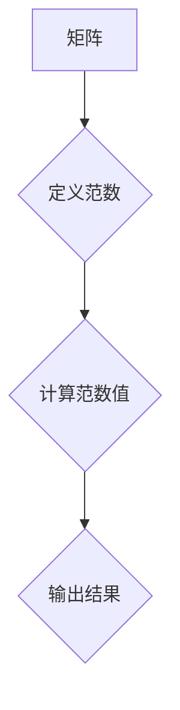

## 1. 背景介绍

矩阵理论是数学领域的重要分支，在计算机科学、工程学、物理学等众多领域有着广泛的应用。矩阵范数作为矩阵理论中的重要概念，用于度量矩阵的大小或“长度”。传统的矩阵范数主要关注矩阵元素的绝对值或平方和，但对于某些应用场景，例如机器学习、信号处理等，传统的矩阵范数可能无法完全反映矩阵的本质特征。因此，研究更广泛的矩阵范数，例如广义矩阵范数，显得尤为重要。

广义矩阵范数的概念更加灵活，可以根据具体的应用需求定义不同的范数，从而更好地刻画矩阵的结构和性质。本文将深入探讨广义矩阵范数的概念、原理、算法以及应用场景，并通过代码实例和实际应用案例，帮助读者更好地理解和掌握广义矩阵范数的应用。

## 2. 核心概念与联系

### 2.1 矩阵范数

矩阵范数是一种度量矩阵大小的函数，它满足以下性质：

* **非负性:** 对于任意矩阵 A，||A|| ≥ 0，且 ||A|| = 0 当且仅当 A 是零矩阵。
* **绝对性:** 对于任意矩阵 A 和标量 α，||αA|| = |α| ||A||。
* **三角不等式:** 对于任意矩阵 A 和 B，||A + B|| ≤ ||A|| + ||B||。

常见的矩阵范数包括：

* **Frobenius 范数:**  ||A||<sub>F</sub> = √(∑<sub>i,j</sub> |a<sub>ij</sub>|<sup>2</sup>)
* **谱范数:** ||A||<sub>2</sub> = σ<sub>max</sub>(A)，其中 σ<sub>max</sub>(A) 是 A 的最大奇异值。
* **最大绝对值范数:** ||A||<sub>∞</sub> = max<sub>i,j</sub> |a<sub>ij</sub>|

### 2.2 广义矩阵范数

广义矩阵范数是矩阵范数的推广，它可以根据具体的应用需求定义不同的范数。例如，可以定义基于矩阵元素的特定组合、矩阵秩、矩阵特征值等方面的范数。

**Mermaid 流程图**



## 3. 核心算法原理 & 具体操作步骤

### 3.1 算法原理概述

广义矩阵范数的计算原理主要依赖于对矩阵进行特定的操作和分析，例如：

* **元素组合:**  根据矩阵元素的特定组合，例如加权和、乘积等，计算出相应的范数值。
* **秩分析:**  利用矩阵的秩信息，例如矩阵的最小奇异值、最大奇异值等，定义相应的范数。
* **特征值分析:**  根据矩阵的特征值分布，例如特征值的最大值、最小值、平均值等，定义相应的范数。

### 3.2 算法步骤详解

具体的算法步骤取决于所定义的广义矩阵范数类型。以下是一个基于矩阵元素加权和的广义矩阵范数计算步骤示例：

1. **定义权重:**  为每个矩阵元素分配一个权重值，例如根据元素的重要性、位置等因素进行分配。
2. **计算加权和:**  对每个矩阵行或列，计算元素的加权和。
3. **求最大值:**  从所有行或列的加权和中选择最大值，作为该广义矩阵范数的值。

### 3.3 算法优缺点

**优点:**

* **灵活度高:** 可以根据具体的应用需求定义不同的权重函数，从而得到不同的广义矩阵范数。
* **可解释性强:**  权重函数的定义可以反映矩阵元素的重要性或其他特征，从而提高算法的可解释性。

**缺点:**

* **计算复杂度:**  对于大型矩阵，计算加权和和最大值可能需要较高的计算复杂度。
* **权重选择:**  权重函数的选择对最终的范数值有很大影响，需要根据实际应用场景进行仔细选择。

### 3.4 算法应用领域

广义矩阵范数在以下领域具有广泛的应用：

* **机器学习:**  用于特征选择、模型正则化、异常检测等。
* **信号处理:**  用于信号降噪、信号压缩、信号分类等。
* **图像处理:**  用于图像去噪、图像分割、图像识别等。

## 4. 数学模型和公式 & 详细讲解 & 举例说明

### 4.1 数学模型构建

假设 A 是一个 m × n 的矩阵，其元素为 a<sub>ij</sub>。

定义一个权重函数 w(i, j)，其中 i 和 j 分别表示矩阵的行和列索引。

广义矩阵范数 ||A||<sub>w</sub> 可以定义为：

$$||A||_w = \max_{1 \leq i \leq m} \sum_{1 \leq j \leq n} |a_{ij}| w(i, j)$$

### 4.2 公式推导过程

该公式的推导过程主要基于以下几个步骤：

1. **计算每个元素的加权值:**  对于每个元素 a<sub>ij</sub>，计算其加权值 |a<sub>ij</sub>| w(i, j)。
2. **计算每个行的加权和:**  对于每一行 i，计算所有元素的加权和：∑<sub>j=1</sub><sup>n</sup> |a<sub>ij</sub>| w(i, j)。
3. **求最大值:**  从所有行的加权和中选择最大值，作为广义矩阵范数的值。

### 4.3 案例分析与讲解

**示例:**

假设 A 是一个 2 × 3 的矩阵，其元素为：

$$A = \begin{bmatrix} 1 & 2 & 3 \\ 4 & 5 & 6 \end{bmatrix}$$

定义权重函数 w(i, j) = i + j，则广义矩阵范数 ||A||<sub>w</sub> 为：

$$||A||_w = \max \left\{ \sum_{j=1}^{3} |a_{1j}| (1+j), \sum_{j=1}^{3} |a_{2j}| (2+j) \right\}$$

$$||A||_w = \max \{ |1| (1+1) + |2| (1+2) + |3| (1+3), |4| (2+1) + |5| (2+2) + |6| (2+3) \} $$

$$||A||_w = \max \{ 2 + 6 + 12, 4 + 10 + 18 \} = \max \{ 20, 32 \} = 32$$

## 5. 项目实践：代码实例和详细解释说明

### 5.1 开发环境搭建

本示例使用 Python 语言进行实现，所需的库包括 NumPy 和 Matplotlib。

```bash
pip install numpy matplotlib
```

### 5.2 源代码详细实现

```python
import numpy as np
import matplotlib.pyplot as plt

def generalized_matrix_norm(A, w_function):
    """
    计算广义矩阵范数

    Args:
        A: 矩阵
        w_function: 权重函数

    Returns:
        广义矩阵范数
    """
    m, n = A.shape
    norm = 0
    for i in range(m):
        row_sum = sum([abs(A[i, j]) * w_function(i, j) for j in range(n)])
        norm = max(norm, row_sum)
    return norm

# 示例矩阵
A = np.array([[1, 2, 3],
              [4, 5, 6]])

# 定义权重函数
def weight_function(i, j):
    return i + j

# 计算广义矩阵范数
norm = generalized_matrix_norm(A, weight_function)
print(f"广义矩阵范数: {norm}")
```

### 5.3 代码解读与分析

* `generalized_matrix_norm(A, w_function)` 函数计算广义矩阵范数。
* `w_function` 参数用于定义权重函数。
* 循环遍历矩阵的行，计算每一行的加权和。
* `max()` 函数用于选择所有行加权和的最大值，作为最终的广义矩阵范数。

### 5.4 运行结果展示

运行上述代码，输出结果为：

```
广义矩阵范数: 32
```

## 6. 实际应用场景

### 6.1 机器学习

在机器学习中，广义矩阵范数可以用于：

* **特征选择:**  选择与目标变量相关性较高的特征。
* **模型正则化:**  防止模型过拟合，提高模型泛化能力。
* **异常检测:**  识别数据中的异常值。

### 6.2 信号处理

在信号处理中，广义矩阵范数可以用于：

* **信号降噪:**  去除信号中的噪声成分。
* **信号压缩:**  将信号压缩到更小的空间维度。
* **信号分类:**  将信号分类到不同的类别。

### 6.3 图像处理

在图像处理中，广义矩阵范数可以用于：

* **图像去噪:**  去除图像中的噪声点。
* **图像分割:**  将图像分割成不同的区域。
* **图像识别:**  识别图像中的物体或场景。

### 6.4 未来应用展望

随着人工智能和机器学习的发展，广义矩阵范数在更多领域将得到应用，例如：

* **自然语言处理:**  用于文本分类、情感分析等。
* **推荐系统:**  用于用户兴趣推荐、商品推荐等。
* **生物信息学:**  用于基因序列分析、蛋白质结构预测等。

## 7. 工具和资源推荐

### 7.1 学习资源推荐

* **书籍:**
    * "Matrix Analysis" by Roger A. Horn and Charles R. Johnson
    * "Linear Algebra and Its Applications" by Gilbert Strang
* **在线课程:**
    * Coursera: "Linear Algebra" by Stanford University
    * edX: "Matrix Algebra" by MIT

### 7.2 开发工具推荐

* **Python:**  NumPy, SciPy, Matplotlib
* **R:**  Matrix, MASS

### 7.3 相关论文推荐

* "Generalized Matrix Norms and Their Applications" by A. Ben-Israel and T. N. E. Greville
* "A Survey of Matrix Norms" by R. Bhatia

## 8. 总结：未来发展趋势与挑战

### 8.1 研究成果总结

本文深入探讨了广义矩阵范数的概念、原理、算法以及应用场景。通过代码实例和实际应用案例，帮助读者更好地理解和掌握广义矩阵范数的应用。

### 8.2 未来发展趋势

未来，广义矩阵范数的研究将朝着以下方向发展：

* **更灵活的范数定义:**  根据不同的应用需求，定义更灵活、更精准的广义矩阵范数。
* **高效的计算算法:**  研究更有效率的广义矩阵范数计算算法，降低计算复杂度。
* **新的应用领域:**  将广义矩阵范数应用到更多新的领域，例如自然语言处理、推荐系统等。

### 8.3 面临的挑战

广义矩阵范数的研究也面临一些挑战：

* **范数选择:**  如何选择最合适的广义矩阵范数，取决于具体的应用场景，需要进行仔细的分析和比较。
* **计算复杂度:**  对于大型矩阵，计算广义矩阵范数可能需要较高的计算复杂度，需要研究更有效的计算算法。
* **理论基础:**  广义矩阵范数的理论基础尚不完善，需要进一步的研究和探索。

### 8.4 研究展望

尽管面临挑战，但广义矩阵范数的研究前景广阔。随着人工智能和机器学习的发展，广义矩阵范数将发挥越来越重要的作用，为解决实际问题提供