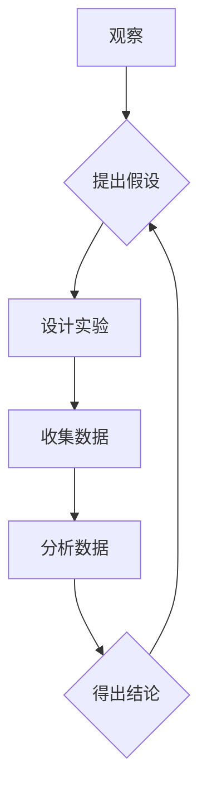

## 科学发现：从假说到理论

> 关键词：科学方法、假设检验、理论构建、人工智能、机器学习、数据驱动

### 1. 背景介绍

科学发现是人类认知世界、理解自然规律和推动社会进步的基石。从古希腊哲学家对宇宙的探索到现代人工智能的飞速发展，科学发现始终伴随着人类文明的进步。然而，科学发现并非偶然的，它遵循着严谨的科学方法，从最初的观察和假设，逐步演化成可靠的理论。

在计算机科学领域，科学发现同样至关重要。从最初的算法设计到如今复杂的机器学习模型，每一次突破都源于对问题的深入思考、假设的提出和验证。人工智能作为计算机科学的热门领域，更是依赖于大量的科学发现来推动其发展。

### 2. 核心概念与联系

科学发现的核心在于从观察和经验出发，通过逻辑推理和实验验证，逐步建立起能够解释现象和预测未来趋势的理论模型。

**科学方法**

科学方法是一个系统化的知识发现过程，其主要步骤包括：

1. **观察**: 对自然现象进行观察和记录。
2. **提出假设**: 基于观察结果，提出一个能够解释现象的假设。
3. **设计实验**: 设计实验来检验假设的正确性。
4. **收集数据**: 进行实验并收集相关数据。
5. **分析数据**: 对收集到的数据进行分析，判断假设是否得到支持。
6. **得出结论**: 根据数据分析结果，得出结论并提出新的假设或完善现有理论。

**理论构建**

理论是科学发现的最终目标，它是一个能够解释大量现象、预测未来趋势的综合性模型。理论的构建需要经过多次假设检验和验证，最终形成一个能够被广泛接受的解释框架。

**数据驱动**

在现代科学发现中，数据扮演着越来越重要的角色。人工智能技术的快速发展使得我们可以收集和处理海量数据，这为科学发现提供了前所未有的机遇。通过对数据的分析和挖掘，我们可以发现隐藏的规律和模式，从而推动科学理论的构建和完善。

**Mermaid 流程图**



### 3. 核心算法原理 & 具体操作步骤

在人工智能领域，许多科学发现都源于算法的创新。例如，深度学习算法的出现，使得机器学习在图像识别、自然语言处理等领域取得了突破性的进展。

**3.1 算法原理概述**

深度学习算法是一种基于人工神经网络的机器学习算法。它通过多层神经网络来学习数据中的特征，并最终完成预测或分类任务。

**3.2 算法步骤详解**

1. **数据预处理**: 将原始数据进行清洗、转换和特征工程，使其能够被深度学习算法所接受。
2. **网络结构设计**: 根据具体任务需求，设计深度神经网络的结构，包括神经元的数量、连接方式和激活函数等。
3. **参数初始化**: 为神经网络中的参数进行随机初始化。
4. **前向传播**: 将输入数据通过神经网络进行前向传播，计算输出结果。
5. **损失函数计算**: 计算输出结果与真实值的差异，即损失函数的值。
6. **反向传播**: 根据损失函数的梯度，反向传播误差信息，更新神经网络的参数。
7. **迭代训练**: 重复前向传播、损失函数计算和反向传播的过程，直到损失函数达到预设的阈值。

**3.3 算法优缺点**

**优点**:

* 表现力强: 深度学习算法能够学习到数据中的复杂特征，从而实现高精度预测。
* 自动特征提取: 不需要人工进行特征工程，算法能够自动学习特征。
* 可扩展性强: 深度学习算法能够处理海量数据，并可以轻松扩展到更大的模型规模。

**缺点**:

* 计算资源需求高: 深度学习算法训练需要大量的计算资源和时间。
* 数据依赖性强: 深度学习算法的性能依赖于训练数据的质量和数量。
* 可解释性差: 深度学习模型的内部机制难以理解，难以解释其决策过程。

**3.4 算法应用领域**

深度学习算法在各个领域都有广泛的应用，例如:

* **图像识别**: 人脸识别、物体检测、图像分类等。
* **自然语言处理**: 文本分类、机器翻译、语音识别等。
* **推荐系统**: 商品推荐、内容推荐等。
* **医疗诊断**: 疾病诊断、影像分析等。

### 4. 数学模型和公式 & 详细讲解 & 举例说明

深度学习算法的原理可以基于数学模型和公式进行描述。

**4.1 数学模型构建**

深度学习算法的核心是多层神经网络，每个神经元接收多个输入信号，并通过加权求和和激活函数进行处理，最终输出一个信号。

**4.2 公式推导过程**

神经网络的输出可以表示为：

$$
y = f(W x + b)
$$

其中：

* $y$ 是神经网络的输出
* $x$ 是输入数据
* $W$ 是权重矩阵
* $b$ 是偏置向量
* $f$ 是激活函数

**4.3 案例分析与讲解**

例如，在图像识别任务中，输入数据为图像像素值，权重矩阵和偏置向量通过训练学习得到，激活函数通常为ReLU函数。通过多层神经网络的处理，最终输出图像的类别概率。

### 5. 项目实践：代码实例和详细解释说明

**5.1 开发环境搭建**

深度学习算法的开发通常需要使用Python语言和相关的深度学习框架，例如TensorFlow、PyTorch等。

**5.2 源代码详细实现**

```python
import tensorflow as tf

# 定义神经网络模型
model = tf.keras.models.Sequential([
    tf.keras.layers.Conv2D(32, (3, 3), activation='relu', input_shape=(28, 28, 1)),
    tf.keras.layers.MaxPooling2D((2, 2)),
    tf.keras.layers.Conv2D(64, (3, 3), activation='relu'),
    tf.keras.layers.MaxPooling2D((2, 2)),
    tf.keras.layers.Flatten(),
    tf.keras.layers.Dense(10, activation='softmax')
])

# 编译模型
model.compile(optimizer='adam',
              loss='sparse_categorical_crossentropy',
              metrics=['accuracy'])

# 训练模型
model.fit(x_train, y_train, epochs=5)

# 评估模型
loss, accuracy = model.evaluate(x_test, y_test)
print('Test loss:', loss)
print('Test accuracy:', accuracy)
```

**5.3 代码解读与分析**

这段代码定义了一个简单的卷积神经网络模型，用于手写数字识别任务。

* `tf.keras.models.Sequential` 创建了一个顺序模型，神经网络层按顺序连接。
* `tf.keras.layers.Conv2D` 定义了一个卷积层，用于提取图像特征。
* `tf.keras.layers.MaxPooling2D` 定义了一个最大池化层，用于降维和提高模型鲁棒性。
* `tf.keras.layers.Flatten` 将多维数据转换为一维数据，以便输入全连接层。
* `tf.keras.layers.Dense` 定义了一个全连接层，用于分类。
* `model.compile` 编译模型，指定优化器、损失函数和评价指标。
* `model.fit` 训练模型，使用训练数据进行训练。
* `model.evaluate` 评估模型，使用测试数据计算损失和准确率。

**5.4 运行结果展示**

训练完成后，模型可以用于预测新的手写数字图像的类别。

### 6. 实际应用场景

深度学习算法在各个领域都有广泛的应用，例如:

* **医疗诊断**: 深度学习算法可以用于分析医学影像，辅助医生诊断疾病。
* **金融风险控制**: 深度学习算法可以用于识别金融欺诈和评估风险。
* **智能交通**: 深度学习算法可以用于自动驾驶、交通流量预测等。

**6.4 未来应用展望**

随着人工智能技术的不断发展，深度学习算法的应用场景将会更加广泛，例如:

* **个性化教育**: 深度学习算法可以根据学生的学习情况提供个性化的学习方案。
* **精准农业**: 深度学习算法可以用于分析农业数据，提高农业生产效率。
* **科学发现**: 深度学习算法可以用于分析大数据，加速科学发现。

### 7. 工具和资源推荐

**7.1 学习资源推荐**

* **书籍**:
    * 深度学习 (Deep Learning) - Ian Goodfellow, Yoshua Bengio, Aaron Courville
    * 深度学习实践 (Deep Learning with Python) - Francois Chollet
* **在线课程**:
    * Coursera - Deep Learning Specialization
    * Udacity - Deep Learning Nanodegree
    * fast.ai - Practical Deep Learning for Coders

**7.2 开发工具推荐**

* **TensorFlow**: Google开发的开源深度学习框架。
* **PyTorch**: Facebook开发的开源深度学习框架。
* **Keras**: TensorFlow的高级API，易于使用。

**7.3 相关论文推荐**

* **ImageNet Classification with Deep Convolutional Neural Networks** - Alex Krizhevsky, Ilya Sutskever, Geoffrey E. Hinton
* **Attention Is All You Need** - Ashish Vaswani, Noam Shazeer, Niki Parmar, Jakob Uszkoreit, Llion Jones, Aidan N. Gomez, Łukasz Kaiser, Illia Polosukhin

### 8. 总结：未来发展趋势与挑战

**8.1 研究成果总结**

近年来，深度学习算法取得了令人瞩目的成就，在图像识别、自然语言处理、语音识别等领域取得了突破性的进展。

**8.2 未来发展趋势**

* **模型规模和效率**: 研究更大型、更高效的深度学习模型，以提高模型性能和降低训练成本。
* **数据增强和泛化能力**: 研究新的数据增强技术和模型架构，提高模型的泛化能力，使其能够更好地应对未知数据。
* **可解释性**: 研究深度学习模型的可解释性，使其决策过程更加透明和可理解。
* **安全性和鲁棒性**: 研究深度学习模型的安全性和鲁棒性，使其能够抵抗攻击和噪声。

**8.3 面临的挑战**

* **数据获取和标注**: 深度学习算法依赖于大量高质量的数据，数据获取和标注仍然是一个挑战。
* **计算资源**: 训练大型深度学习模型需要大量的计算资源，这对于资源有限的机构和个人来说是一个障碍。
* **伦理问题**: 深度学习算法的应用可能会带来一些伦理问题，例如数据隐私、算法偏见等，需要引起重视和解决。

**8.4 研究展望**

未来，深度学习算法将会继续发展，并在更多领域发挥重要作用。我们需要不断探索新的算法、模型和应用场景，并积极应对挑战，推动深度学习技术朝着更加安全、可靠、可解释的方向发展。

### 9. 附录：常见问题与解答

**常见问题**:

* **深度学习算法的训练过程需要多长时间？**

训练时间取决于模型规模、数据量和硬件资源等因素，通常需要数小时到数天甚至更长时间。

* **如何选择合适的深度学习框架？**

TensorFlow和PyTorch是目前最流行的深度学习框架，选择哪个框架取决于个人喜好、项目需求和团队经验。

* **如何评估深度学习模型的性能？**

常用的评价指标包括准确率、召回率、F1-score等，选择合适的评价指标取决于具体的任务需求。


作者：禅与计算机程序设计艺术 / Zen and the Art of Computer Programming 
