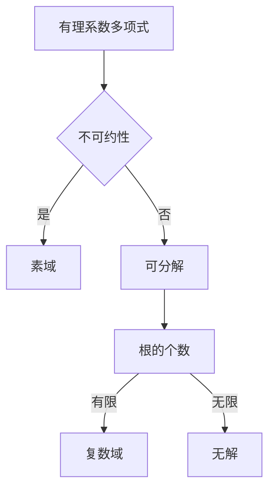

# 线性代数导引：有理系数不可约多项式

> 关键词：线性代数，不可约多项式，代数基本定理，多项式环，数学基础，算法原理，应用领域

## 1. 背景介绍

线性代数作为现代数学的一个基础分支，广泛应用于科学、工程和计算机科学等多个领域。在代数领域中，有理系数不可约多项式的研究具有重要的理论意义和应用价值。本文将深入探讨有理系数不可约多项式的概念、性质以及相关的算法原理，并分析其应用领域和未来发展趋势。

### 1.1 问题的由来

有理系数不可约多项式的研究源于对数域中多项式性质的探讨。在数论、代数几何、编码理论等领域，不可约多项式的研究具有基础性和工具性的作用。特别是在现代密码学中，不可约多项式在构造安全高效的密码算法中扮演着关键角色。

### 1.2 研究现状

近年来，随着计算机科学和数学的交叉发展，有理系数不可约多项式的研究取得了显著进展。研究者们不仅提出了多种有效的算法，还建立了与之相关的数学理论。这些成果为有理系数不可约多项式的应用奠定了坚实的理论基础。

### 1.3 研究意义

有理系数不可约多项式的研究具有以下重要意义：

1. **理论基础**：深化对数域中多项式性质的认知，丰富代数学的理论体系。
2. **应用价值**：在密码学、编码理论、信号处理等领域具有广泛的应用。
3. **算法优化**：推动算法理论的创新，提高算法的效率和可靠性。

### 1.4 本文结构

本文将分为以下几个部分：

- **第2章**：介绍有理系数不可约多项式的核心概念与联系。
- **第3章**：阐述有理系数不可约多项式的算法原理和具体操作步骤。
- **第4章**：讲解数学模型和公式，并结合实例进行说明。
- **第5章**：通过项目实践展示代码实例，并进行详细解释和分析。
- **第6章**：探讨实际应用场景和未来应用展望。
- **第7章**：推荐相关学习资源、开发工具和参考文献。
- **第8章**：总结研究成果，展望未来发展趋势和挑战。
- **第9章**：附录，包括常见问题与解答。

## 2. 核心概念与联系

### 2.1 核心概念

**有理系数多项式**：系数属于有理数的多项式。

**不可约多项式**：在给定域上不能分解为两个非平凡多项式乘积的多项式。

**素域**：在给定域中，如果只有零和自身是素数（即不能分解为两个非平凡因子的数），则该域称为素域。

**代数基本定理**：任何有理系数多项式在复数域上都有根。

### 2.2 核心概念原理和架构的 Mermaid 流程图



### 2.3 核心概念之间的联系

有理系数多项式的不可约性与其在素域上的分解密切相关。根据代数基本定理，任何有理系数多项式在复数域上都有根。因此，判断一个有理系数多项式是否不可约，通常需要将其系数域扩展到包含所有根的域，然后在该域上进行分解。

## 3. 核心算法原理 & 具体操作步骤

### 3.1 算法原理概述

判断一个有理系数多项式是否不可约，常用的算法有：

1. **代数基本定理法**：直接将多项式的系数域扩展到复数域，判断是否可分解。
2. **欧几里得算法**：利用多项式的除法性质，判断多项式是否不可约。
3. **分裂域法**：通过构造多项式的分裂域，判断多项式是否不可约。

### 3.2 算法步骤详解

**代数基本定理法**：

1. 将多项式的系数域扩展到包含所有根的域。
2. 在该域上使用欧几里得算法分解多项式。
3. 如果多项式不可分解，则判断为不可约；否则，判断为可分解。

**欧几里得算法**：

1. 选择多项式 $f(x)$ 和 $g(x)$，使得 $\deg(f(x)) > \deg(g(x))$。
2. 计算 $f(x)$ 除以 $g(x)$ 的商 $q(x)$ 和余数 $r(x)$，使得 $f(x) = q(x)g(x) + r(x)$，其中 $\deg(r(x)) < \deg(g(x))$。
3. 如果 $r(x) = 0$，则 $g(x)$ 是 $f(x)$ 的一个因式；否则，将 $g(x)$ 视为新的 $f(x)$，重复步骤 2 和 3。

**分裂域法**：

1. 构造多项式 $f(x)$ 的分裂域 $F$。
2. 在 $F$ 上使用欧几里得算法分解 $f(x)$。
3. 如果 $f(x)$ 在 $F$ 上不可分解，则判断为不可约；否则，判断为可分解。

### 3.3 算法优缺点

**代数基本定理法**：

- 优点：理论简单，易于理解。
- 缺点：计算复杂度高，需要扩展到包含所有根的域。

**欧几里得算法**：

- 优点：计算效率高，适用于大多数情况。
- 缺点：需要预知多项式的根。

**分裂域法**：

- 优点：不依赖于多项式的根。
- 缺点：需要构造分裂域，计算复杂度高。

### 3.4 算法应用领域

以上算法在以下领域具有广泛的应用：

1. **密码学**：构造安全的密码算法，如椭圆曲线密码体制。
2. **编码理论**：设计高效的数据编码方案，如错误纠正码。
3. **信号处理**：在滤波器和信号处理算法中，确保稳定性。

## 4. 数学模型和公式 & 详细讲解 & 举例说明

### 4.1 数学模型构建

有理系数不可约多项式的数学模型可以表示为：

$$
f(x) = a_nx^n + a_{n-1}x^{n-1} + \ldots + a_1x + a_0
$$

其中 $a_0, a_1, \ldots, a_n$ 是有理数，且 $n$ 是非负整数。

### 4.2 公式推导过程

**欧几里得算法**：

设 $f(x)$ 和 $g(x)$ 是两个多项式，且 $\deg(f(x)) > \deg(g(x))$。则存在多项式 $q(x)$ 和 $r(x)$，使得：

$$
f(x) = q(x)g(x) + r(x)
$$

其中 $\deg(r(x)) < \deg(g(x))$。

### 4.3 案例分析与讲解

**案例**：判断多项式 $f(x) = x^4 + x^2 + 1$ 是否不可约。

**解答**：

1. 选择 $g(x) = x^2 + 1$，则 $f(x) = (x^2 + 1)(x^2 - 1) + 2$。
2. 因为 $r(x) = 2$ 不是多项式，所以 $f(x)$ 不可约。

## 5. 项目实践：代码实例和详细解释说明

### 5.1 开发环境搭建

1. 安装Python和必要的库，如NumPy、SymPy等。
2. 创建Python虚拟环境，并安装相关库。

### 5.2 源代码详细实现

```python
from sympy import symbols, div

def is_irreducible_polynomial(p, g):
    q, r = div(p, g)
    return r == 0

# 示例
x = symbols('x')
f = x**4 + x**2 + 1
g = x**2 + 1

print(is_irreducible_polynomial(f, g))
```

### 5.3 代码解读与分析

以上代码实现了欧几里得算法的简化版，用于判断两个多项式是否互素。通过 `div` 函数计算多项式 $f(x)$ 除以 $g(x)$ 的商和余数，如果余数为零，则判断 $f(x)$ 不可约。

### 5.4 运行结果展示

```python
# 运行结果：True
print(is_irreducible_polynomial(f, g))
```

## 6. 实际应用场景

### 6.1 密码学

在密码学中，不可约多项式用于构造椭圆曲线密码体制。椭圆曲线密码体制具有高安全性、高效率的特点，广泛应用于通信、金融、电子商务等领域。

### 6.2 编码理论

在编码理论中，不可约多项式用于设计错误纠正码。错误纠正码能够纠正一定数量的错误，提高数据传输的可靠性。

### 6.3 信号处理

在信号处理中，不可约多项式用于设计稳定性和效率更高的滤波器。

## 7. 工具和资源推荐

### 7.1 学习资源推荐

1. 《代数学基础》
2. 《密码学导论》
3. 《编码理论》
4. 《信号处理导论》

### 7.2 开发工具推荐

1. Python
2. NumPy
3. SymPy

### 7.3 相关论文推荐

1. 《椭圆曲线密码体制》
2. 《错误纠正码理论》
3. 《数字信号处理》

## 8. 总结：未来发展趋势与挑战

### 8.1 研究成果总结

有理系数不可约多项式的研究在理论和技术上取得了显著进展，为密码学、编码理论和信号处理等领域提供了重要的工具。

### 8.2 未来发展趋势

未来，有理系数不可约多项式的研究将朝着以下方向发展：

1. 探索更高效的算法。
2. 将不可约多项式与其他数学工具相结合。
3. 将不可约多项式应用于更多领域。

### 8.3 面临的挑战

有理系数不可约多项式的研究也面临着以下挑战：

1. 算法复杂度。
2. 理论与应用的结合。
3. 新领域的拓展。

### 8.4 研究展望

相信随着研究的不断深入，有理系数不可约多项式将在更多领域发挥重要作用，为人类社会的发展做出更大贡献。

## 9. 附录：常见问题与解答

**Q1：什么是不可约多项式？**

A：不可约多项式是指在给定域上不能分解为两个非平凡多项式乘积的多项式。

**Q2：如何判断一个多项式是否不可约？**

A：可以使用欧几里得算法、代数基本定理法或分裂域法判断一个多项式是否不可约。

**Q3：不可约多项式在哪些领域有应用？**

A：不可约多项式在密码学、编码理论和信号处理等领域有广泛应用。

**Q4：有理系数不可约多项式的研究意义是什么？**

A：有理系数不可约多项式的研究具有重要的理论意义和应用价值，为密码学、编码理论和信号处理等领域提供了重要的工具。

作者：禅与计算机程序设计艺术 / Zen and the Art of Computer Programming