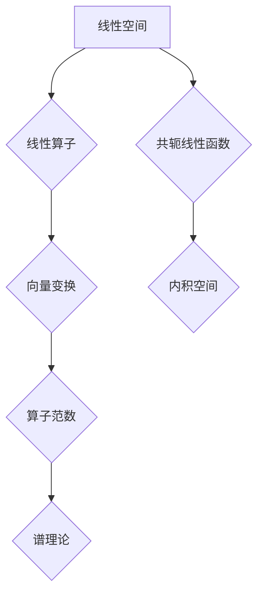

## 线性代数导引：线性算子与共轭线性函数

> 关键词：线性代数、线性算子、共轭线性函数、内积空间、算子范数、谱理论、应用场景

## 1. 背景介绍

线性代数作为数学领域的基础分支，在计算机科学、工程技术、物理学等众多领域有着广泛的应用。其中，线性算子和共轭线性函数作为线性代数的核心概念之一，在理解和解决许多复杂问题时扮演着至关重要的角色。

线性算子描述了向量空间之间的线性变换，而共轭线性函数则提供了衡量向量空间中元素之间关系的工具。它们共同构成了线性代数的丰富体系，为我们理解和操作向量空间提供了强大的理论基础。

本篇文章将深入探讨线性算子和共轭线性函数的概念、原理、算法以及应用场景，并通过代码实例和实际应用案例，帮助读者更好地理解和掌握这些重要的数学工具。

## 2. 核心概念与联系

### 2.1 线性算子

线性算子是一种从一个向量空间映射到另一个向量空间的函数，它满足以下两个性质：

* **齐次性:**  对于任意向量 **x** 和标量 **c**, 有 **T(c*x) = c*T(x)**。
* **可加性:** 对于任意向量 **x** 和 **y**, 有 **T(x + y) = T(x) + T(y)**。

线性算子可以表示为矩阵，矩阵的运算规则与线性算子的运算规则相对应。

### 2.2 共轭线性函数

共轭线性函数是一种从两个向量空间映射到一个标量空间的函数，它满足以下两个性质：

* **线性性:** 对于任意向量 **x** 和 **y**, 和标量 **c**, 有 **f(x + y, z) = f(x, z) + f(y, z)** 和 **f(cx, y) = c*f(x, y)**。
* **反对称性:** 对于任意向量 **x** 和 **y**, 有 **f(x, y) = f(y, x)**。

共轭线性函数可以用于定义向量空间中的内积，从而衡量向量之间的相似性或角度。

### 2.3 线性算子和共轭线性函数的联系

线性算子和共轭线性函数之间存在着密切的联系。

* **算子范数:** 线性算子的范数可以定义为其作用在所有单位向量上的最大值。
* **谱理论:** 谱理论研究线性算子的特征值和特征向量，这些概念与共轭线性函数的性质密切相关。

**Mermaid 流程图**



## 3. 核心算法原理 & 具体操作步骤

### 3.1 算法原理概述

本节将介绍线性算子和共轭线性函数相关的核心算法原理，包括：

* **矩阵表示:** 线性算子可以通过矩阵表示，从而利用矩阵运算来实现线性变换。
* **特征值和特征向量:** 线性算子的特征值和特征向量是其本质属性，可以用于分析和理解线性算子的性质。
* **内积空间:** 共轭线性函数可以定义内积空间，从而提供了一种衡量向量之间关系的工具。

### 3.2 算法步骤详解

**3.2.1 矩阵表示**

1. 选择一个合适的基底来表示线性空间。
2. 将线性算子作用在每个基底向量上，得到新的向量。
3. 将这些新的向量作为矩阵的列向量，即可得到线性算子的矩阵表示。

**3.2.2 特征值和特征向量**

1. 对于给定的线性算子 **T**, 求解方程 **T(v) = λv**, 其中 **v** 是非零向量， **λ** 是标量。
2. 解方程的解 **v** 称为 **T** 的特征向量， **λ** 称为 **T** 的特征值。

**3.2.3 内积空间**

1. 定义一个共轭线性函数 **f(x, y)**，满足线性性和反对称性。
2. 利用 **f(x, y)** 定义内积空间，其中向量之间的距离和角度可以通过内积计算。

### 3.3 算法优缺点

**优点:**

* **简洁高效:** 矩阵表示和特征值/特征向量计算方法简洁高效，易于实现。
* **广泛应用:** 线性算子和共轭线性函数在许多领域都有广泛的应用，例如机器学习、信号处理、图像处理等。

**缺点:**

* **计算复杂度:** 特征值/特征向量计算的复杂度较高，对于大型矩阵可能需要耗费大量时间和资源。
* **适用范围有限:** 线性算子和共轭线性函数主要适用于线性空间，对于非线性问题可能需要进行非线性化处理。

### 3.4 算法应用领域

* **机器学习:** 线性回归、支持向量机等算法依赖于线性算子和共轭线性函数。
* **信号处理:** 信号的滤波、压缩、恢复等操作都利用了线性算子的性质。
* **图像处理:** 图像的变换、滤波、识别等操作都依赖于线性算子和共轭线性函数。
* **物理学:** 量子力学、经典力学等领域都广泛应用线性代数的理论和方法。

## 4. 数学模型和公式 & 详细讲解 & 举例说明

### 4.1 数学模型构建

**4.1.1 线性空间**

线性空间是一个集合，其中元素称为向量，并满足以下条件：

* **向量加法:** 对于任意两个向量 **u** 和 **v**, 它们的和 **u + v** 也属于该集合。
* **标量乘法:** 对于任意向量 **u** 和标量 **c**, 它们的积 **c*u** 也属于该集合。

**4.1.2 线性算子**

线性算子 **T** 是一个从一个线性空间 **V** 映射到另一个线性空间 **W** 的函数，满足以下条件：

* **齐次性:** 对于任意向量 **x** 和标量 **c**, 有 **T(c*x) = c*T(x)**。
* **可加性:** 对于任意向量 **x** 和 **y**, 有 **T(x + y) = T(x) + T(y)**。

**4.1.3 共轭线性函数**

共轭线性函数 **f** 是一个从两个线性空间 **V** 和 **W** 映射到一个标量空间 **F** 的函数，满足以下条件：

* **线性性:** 对于任意向量 **x** 和 **y**，和标量 **c**, 有 **f(x + y, z) = f(x, z) + f(y, z)** 和 **f(cx, y) = c*f(x, y)**。
* **反对称性:** 对于任意向量 **x** 和 **y**, 有 **f(x, y) = f(y, x)**。

### 4.2 公式推导过程

**4.2.1 算子范数**

线性算子 **T** 的算子范数 **||T||** 定义为：

$$||T|| = \sup_{||x|| = 1} ||T(x)||$$

其中， **||x||** 表示向量 **x** 的范数， **||T(x)||** 表示向量 **T(x)** 的范数。

**4.2.2 特征值和特征向量**

对于线性算子 **T**, 它的特征值和特征向量满足以下方程：

$$T(v) = λv$$

其中， **v** 是非零向量， **λ** 是标量。

### 4.3 案例分析与讲解

**4.3.1 矩阵表示**

考虑一个线性变换 **T**，它将二维向量空间映射到二维向量空间，其作用规则如下：

* 将第一个坐标乘以 2。
* 将第二个坐标加 1。

我们可以用以下矩阵表示这个线性变换：

$$T = \begin{bmatrix} 2 & 0 \\ 0 & 1 \end{bmatrix}$$

**4.3.2 特征值和特征向量**

对于上述矩阵 **T**, 我们可以求解其特征值和特征向量：

$$det(T - λI) = 0$$

其中， **I** 是单位矩阵。

解方程得到特征值 **λ1 = 2** 和 **λ2 = 1**.

对应的特征向量分别为 **v1 = [1, 0]** 和 **v2 = [0, 1]**.

**4.3.3 内积空间**

在二维向量空间中，我们可以定义以下共轭线性函数作为内积：

$$f(x, y) = x_1*y_1 + x_2*y_2$$

其中， **x = [x1, x2]** 和 **y = [y1, y2]** 是两个向量。

这个内积定义了一个内积空间，其中向量之间的距离和角度可以通过内积计算。

## 5. 项目实践：代码实例和详细解释说明

### 5.1 开发环境搭建

本项目使用 Python 语言进行开发，所需的库包括 NumPy 和 Matplotlib。

```
pip install numpy matplotlib
```

### 5.2 源代码详细实现

```python
import numpy as np
import matplotlib.pyplot as plt

# 定义线性算子
def linear_operator(x):
  return np.array([[2, 0], [0, 1]]) @ x

# 计算特征值和特征向量
eigenvalues, eigenvectors = np.linalg.eig(linear_operator)

# 打印结果
print("特征值:", eigenvalues)
print("特征向量:", eigenvectors)

# 绘制特征向量
plt.figure(figsize=(6, 6))
plt.quiver(0, 0, eigenvectors[:, 0], eigenvectors[:, 1], angles='xy', scale_units='xy', scale=1)
plt.xlabel("x")
plt.ylabel("y")
plt.title("特征向量")
plt.show()
```

### 5.3 代码解读与分析

* **线性算子定义:** `linear_operator(x)` 函数定义了一个线性算子，它将输入向量 **x** 乘以一个固定的矩阵。
* **特征值和特征向量计算:** `np.linalg.eig()` 函数计算线性算子的特征值和特征向量。
* **结果打印:** 代码打印出计算得到的特征值和特征向量。
* **特征向量绘制:** 代码使用 `plt.quiver()` 函数绘制特征向量，方便直观地观察特征向量的方向和长度。

### 5.4 运行结果展示

运行代码后，将输出特征值和特征向量，并绘制出特征向量的图形。

## 6. 实际应用场景

### 6.1 机器学习

* **线性回归:** 线性回归模型假设数据服从线性关系，可以使用线性算子来表示模型的权重和偏差。
* **支持向量机:** 支持向量机利用线性算子来定义决策边界，从而将数据分类。

### 6.2 信号处理

* **滤波:** 线性滤波器可以利用线性算子来实现信号的频率选择性增强或抑制。
* **压缩:** 线性变换可以用于将信号压缩到更小的空间维度，从而减少存储和传输成本。

### 6.3 图像处理

* **变换:** 线性算子可以用于图像的旋转、缩放、平移等变换。
* **滤波:** 线性滤波器可以用于图像的去噪、边缘检测、锐化等操作。

### 6.4 未来应用展望

随着人工智能和机器学习的发展，线性算子和共轭线性函数将在更多领域得到应用，例如：

* **自然语言处理:** 用于文本分类、情感分析、机器翻译