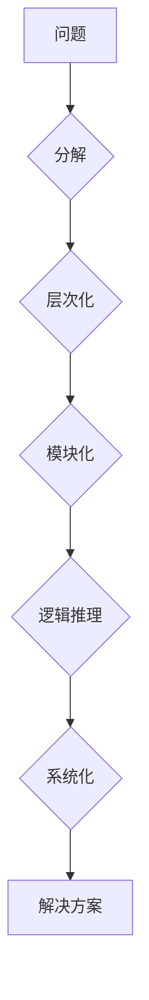

## 结构化思维：从混沌到秩序

> 关键词：结构化思维、算法设计、数据结构、编程逻辑、复杂系统、软件架构、问题解决

### 1. 背景介绍

在当今科技日新月异的时代，我们所面临的挑战日益复杂，信息爆炸式的增长让人难以捉摸。如何有效地处理海量数据，解决复杂问题，成为了摆在我们面前的首要任务。而结构化思维，作为一种高效的认知模式，为我们提供了应对这些挑战的宝贵工具。

结构化思维的核心在于将复杂问题分解成更小的、可管理的子问题，并通过逻辑推理和系统化的方法找到解决方案。它强调清晰的逻辑框架、明确的步骤和可重复的操作，帮助我们从混沌中找到秩序，将复杂问题转化为可解决的步骤。

对于软件开发领域而言，结构化思维尤为重要。从需求分析到代码设计，再到系统测试和维护，每一个环节都需要遵循清晰的逻辑结构，才能构建出稳定、可靠、可扩展的软件系统。

### 2. 核心概念与联系

结构化思维的核心概念包括：

* **分解：** 将复杂问题分解成更小的、可管理的子问题。
* **层次化：** 将子问题按照逻辑关系进行层次化组织，形成清晰的结构。
* **模块化：** 将子问题封装成独立的模块，提高代码的可读性和可维护性。
* **逻辑推理：** 使用逻辑规则和推理方法，从已知条件推导出结论。
* **系统化：** 将各个模块和子问题按照预定的流程进行连接和组合，形成完整的系统。

**Mermaid 流程图**



### 3. 核心算法原理 & 具体操作步骤

#### 3.1 算法原理概述

算法是一种解决特定问题的步骤序列，是结构化思维的核心工具之一。一个好的算法应该具有以下特点：

* **确定性：** 对于给定的输入，算法应该始终产生相同的输出。
* **有限性：** 算法应该在有限的时间内完成执行。
* **有效性：** 算法应该能够实际执行，并且能够产生正确的输出。

#### 3.2 算法步骤详解

算法设计通常遵循以下步骤：

1. **问题分析：** 首先要明确问题的具体描述，包括输入、输出和约束条件。
2. **算法设计：** 根据问题分析的结果，设计出解决问题的算法步骤。
3. **算法实现：** 将算法步骤转化为具体的代码实现。
4. **算法测试：** 对算法进行测试，验证其正确性和效率。
5. **算法优化：** 根据测试结果，对算法进行优化，提高其性能。

#### 3.3 算法优缺点

不同的算法具有不同的优缺点，选择合适的算法取决于具体问题的特点和需求。

* **时间复杂度：** 指算法执行所需的时间与输入规模的关系。
* **空间复杂度：** 指算法执行所需内存空间与输入规模的关系。

#### 3.4 算法应用领域

算法广泛应用于各个领域，例如：

* **计算机科学：** 搜索算法、排序算法、数据结构等。
* **人工智能：** 机器学习算法、深度学习算法等。
* **生物信息学：** 基因序列比对算法、蛋白质结构预测算法等。
* **金融领域：** 风险管理算法、投资策略算法等。

### 4. 数学模型和公式 & 详细讲解 & 举例说明

#### 4.1 数学模型构建

数学模型是抽象化问题并进行分析的工具，它可以帮助我们理解问题的本质，并找到解决问题的规律。

#### 4.2 公式推导过程

公式是数学模型的具体表达形式，它可以用来计算、预测和分析问题。

#### 4.3 案例分析与讲解

例如，在排序算法中，我们可以使用数学模型来分析不同算法的时间复杂度。

**冒泡排序算法**

$$T(n) = 2n - 2$$

其中，n 是待排序数据的数量。

**插入排序算法**

$$T(n) = \frac{n(n-1)}{2}$$

通过比较这两个公式，我们可以发现冒泡排序算法的时间复杂度更低，因此在处理大量数据时，冒泡排序算法更有效率。

### 5. 项目实践：代码实例和详细解释说明

#### 5.1 开发环境搭建

选择合适的编程语言和开发环境，例如：

* **Python:** 语言简洁易学，拥有丰富的第三方库。
* **Java:** 性能稳定，适合构建大型应用程序。
* **C++:** 性能优异，适合底层开发和高性能计算。

#### 5.2 源代码详细实现

以Python为例，实现一个简单的冒泡排序算法：

```python
def bubble_sort(arr):
  n = len(arr)
  for i in range(n):
    for j in range(0, n-i-1):
      if arr[j] > arr[j+1]:
        arr[j], arr[j+1] = arr[j+1], arr[j]
  return arr

# 测试代码
arr = [64, 34, 25, 12, 22, 11, 90]
sorted_arr = bubble_sort(arr)
print("排序后的数组:", sorted_arr)
```

#### 5.3 代码解读与分析

* `bubble_sort(arr)` 函数接收一个数组 `arr` 作为输入。
* 外层循环 `for i in range(n)` 控制排序的轮数，每次循环将最大的元素“冒泡”到数组末尾。
* 内层循环 `for j in range(0, n-i-1)` 比较相邻元素，如果顺序错误则交换位置。
* `arr[j], arr[j+1] = arr[j+1], arr[j]` 使用 Python 的元组解包语法进行元素交换。
* 最后返回排序后的数组 `sorted_arr`。

#### 5.4 运行结果展示

```
排序后的数组: [11, 12, 22, 25, 34, 64, 90]
```

### 6. 实际应用场景

结构化思维和算法设计在软件开发中有着广泛的应用场景：

* **数据结构设计：** 构建高效的数据结构，例如链表、树、图等，提高数据存储和访问效率。
* **算法优化：** 对现有算法进行优化，降低时间复杂度和空间复杂度，提高程序性能。
* **复杂系统设计：** 将复杂系统分解成多个模块，提高系统的可维护性和扩展性。
* **问题解决：** 使用逻辑推理和算法设计解决软件开发中的各种问题。

### 6.4 未来应用展望

随着人工智能、大数据等技术的快速发展，结构化思维和算法设计将发挥更加重要的作用。

* **自动代码生成：** 基于结构化思维和算法设计，开发自动代码生成工具，提高开发效率。
* **智能软件架构：** 利用人工智能技术，自动设计和优化软件架构，构建更加智能、高效的软件系统。
* **复杂系统管理：** 使用结构化思维和算法设计，管理和控制更加复杂的系统，例如智能城市、工业互联网等。

### 7. 工具和资源推荐

#### 7.1 学习资源推荐

* **书籍：**
    * 《算法导论》
    * 《数据结构与算法分析》
    * 《设计模式》
* **在线课程：**
    * Coursera 上的算法课程
    * edX 上的计算机科学课程
* **网站：**
    * GeeksforGeeks
    * LeetCode

#### 7.2 开发工具推荐

* **IDE:**
    * Visual Studio Code
    * IntelliJ IDEA
    * Eclipse
* **版本控制系统:**
    * Git
    * GitHub

#### 7.3 相关论文推荐

* **论文数据库:**
    * ACM Digital Library
    * IEEE Xplore

### 8. 总结：未来发展趋势与挑战

#### 8.1 研究成果总结

结构化思维和算法设计已经取得了显著的成果，为软件开发领域带来了巨大的进步。

#### 8.2 未来发展趋势

未来，结构化思维和算法设计将继续朝着以下方向发展：

* **更加智能化：** 利用人工智能技术，自动生成算法和优化代码。
* **更加自动化：** 使用自动化工具，提高开发效率和代码质量。
* **更加可视化：** 使用图形化工具，帮助人们更好地理解和设计算法。

#### 8.3 面临的挑战

结构化思维和算法设计也面临着一些挑战：

* **复杂系统设计：** 如何设计和管理更加复杂的系统，例如人工智能系统、分布式系统等。
* **算法可解释性：** 如何提高算法的可解释性，使其更容易被理解和信任。
* **人才培养：** 如何培养更多具备结构化思维和算法设计能力的人才。

#### 8.4 研究展望

未来，我们将继续深入研究结构化思维和算法设计，探索其在软件开发领域以及其他领域的应用，并努力解决面临的挑战，推动技术进步。

### 9. 附录：常见问题与解答

* **什么是结构化思维？**

结构化思维是一种将复杂问题分解成更小的、可管理的子问题，并通过逻辑推理和系统化的方法找到解决方案的认知模式。

* **算法设计有哪些步骤？**

算法设计通常遵循以下步骤：问题分析、算法设计、算法实现、算法测试、算法优化。

* **如何选择合适的算法？**

选择合适的算法取决于具体问题的特点和需求，需要考虑算法的时间复杂度、空间复杂度、易用性等因素。


作者：禅与计算机程序设计艺术 / Zen and the Art of Computer Programming 
