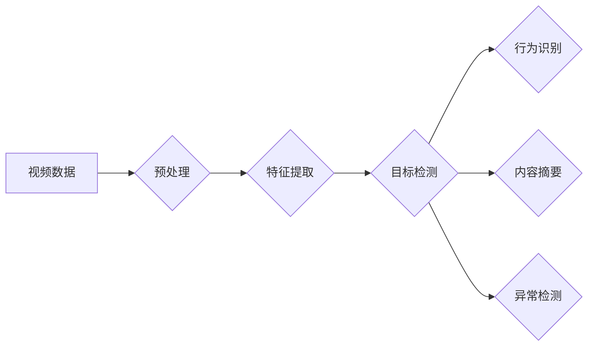

> 关键词：视频分析，关键信息提取，计算机视觉，自然语言处理，深度学习，行为识别，内容摘要

# 视频数据的关键信息捕捉

在信息爆炸的时代，视频数据已成为信息传递和交流的重要载体。从新闻播报到社交媒体，从家庭监控到工业监控，视频数据无处不在。然而，视频数据的高维性和复杂性给信息提取和挖掘带来了巨大的挑战。本文将探讨视频数据的关键信息捕捉技术，分析其核心概念、算法原理、实践应用以及未来发展趋势。

## 1. 背景介绍

### 1.1 视频数据的特点

视频数据具有以下特点：

- **高维性**：视频数据包含时间、空间、颜色等多个维度，数据量大，处理复杂。
- **动态性**：视频内容不断变化，需要实时或近实时分析。
- **时空关联性**：视频中的人物、物体等对象具有时空关联性，需要同时考虑时间和空间信息。

### 1.2 视频数据的关键信息捕捉需求

随着视频数据的快速增长，对视频数据的关键信息捕捉需求日益迫切，主要包括：

- **目标检测**：识别视频中的人、车、物等目标。
- **行为识别**：识别人物的行为动作，如行走、奔跑、打架等。
- **内容摘要**：提取视频的关键内容，如新闻摘要、视频摘要等。
- **异常检测**：检测视频中的异常事件，如火灾、盗窃等。

## 2. 核心概念与联系

### 2.1 核心概念

- **计算机视觉**：研究如何让计算机像人类一样理解和处理视觉信息。
- **自然语言处理**：研究如何让计算机理解和生成人类语言。
- **深度学习**：一种基于人工神经网络的学习方法，在图像识别、语音识别等领域取得了突破性进展。

### 2.2 架构流程图



## 3. 核心算法原理 & 具体操作步骤

### 3.1 算法原理概述

视频数据的关键信息捕捉主要依赖于以下技术：

- **目标检测**：利用深度学习技术，如卷积神经网络(CNN)，识别视频中的目标。
- **行为识别**：结合目标检测和序列建模技术，识别视频中的人物行为。
- **内容摘要**：利用视频编解码技术提取关键帧，结合文本生成技术生成摘要。
- **异常检测**：结合目标检测和异常检测算法，识别视频中的异常事件。

### 3.2 算法步骤详解

#### 3.2.1 目标检测

1. 预处理：对视频进行去噪、缩放等操作。
2. 特征提取：利用CNN提取视频帧的特征。
3. 目标检测：利用R-CNN、Faster R-CNN等算法进行目标检测。

#### 3.2.2 行为识别

1. 目标检测：利用目标检测算法识别视频中的人物。
2. 序列建模：利用循环神经网络(RNN)或长短期记忆网络(LSTM)对人物动作进行建模。
3. 行为识别：根据模型预测动作序列，识别人物行为。

#### 3.2.3 内容摘要

1. 视频编解码：利用视频编解码技术提取关键帧。
2. 文本生成：利用自然语言处理技术，根据关键帧生成视频摘要。

#### 3.2.4 异常检测

1. 目标检测：利用目标检测算法识别视频中的人物和物体。
2. 异常检测：利用异常检测算法，如Isolation Forest，识别异常事件。

### 3.3 算法优缺点

#### 3.3.1 目标检测

优点：

- 准确率高。
- 通用性强。

缺点：

- 计算量大。
- 对光照、遮挡等因素敏感。

#### 3.3.2 行为识别

优点：

- 可解释性强。
- 可扩展性强。

缺点：

- 训练数据需求量大。
- 难以处理复杂场景。

#### 3.3.3 内容摘要

优点：

- 信息丰富。
- 可读性强。

缺点：

- 难度大。
- 对关键帧的选择有一定主观性。

#### 3.3.4 异常检测

优点：

- 可解释性强。
- 可扩展性强。

缺点：

- 模型复杂。
- 难以处理多类异常事件。

### 3.4 算法应用领域

视频数据的关键信息捕捉技术可应用于以下领域：

- 智能监控：安全监控、交通监控等。
- 娱乐产业：电影推荐、广告投放等。
- 医疗健康：疾病诊断、康复训练等。
- 工业制造：生产监控、故障诊断等。

## 4. 数学模型和公式 & 详细讲解 & 举例说明

### 4.1 数学模型构建

#### 4.1.1 卷积神经网络(CNN)

CNN是一种用于图像识别的深度学习模型，其核心思想是卷积层和池化层。

$$
\text{CNN}(\text{input}) = \text{ReLU}(\text{Conv}(\text{Pooling}(\text{input})))
$$

其中，$\text{Conv}$ 表示卷积操作，$\text{Pooling}$ 表示池化操作，$\text{ReLU}$ 表示ReLU激活函数。

#### 4.1.2 循环神经网络(RNN)

RNN是一种用于序列建模的深度学习模型，其核心思想是隐藏状态。

$$
\text{h}_t = \text{f}(\text{h}_{t-1}, \text{x}_t, \text{W}_h, \text{U})
$$

其中，$\text{h}_t$ 表示第t个时间步的隐藏状态，$\text{x}_t$ 表示第t个时间步的输入，$\text{W}_h$ 和 $\text{U}$ 分别表示权重矩阵。

### 4.2 公式推导过程

#### 4.2.1 CNN

CNN的公式推导过程主要涉及卷积操作、池化操作和激活函数。

#### 4.2.2 RNN

RNN的公式推导过程主要涉及隐状态的计算和梯度下降算法。

### 4.3 案例分析与讲解

#### 4.3.1 目标检测

以Faster R-CNN为例，介绍目标检测的原理和实现过程。

#### 4.3.2 行为识别

以RNN为例，介绍行为识别的原理和实现过程。

## 5. 项目实践：代码实例和详细解释说明

### 5.1 开发环境搭建

1. 安装Python环境。
2. 安装深度学习框架，如TensorFlow、PyTorch等。
3. 安装数据预处理和可视化工具，如OpenCV、Matplotlib等。

### 5.2 源代码详细实现

以下是一个使用TensorFlow实现目标检测的简单示例：

```python
import tensorflow as tf

# 加载预训练的Faster R-CNN模型
model = tf.keras.models.load_model('faster_rcnn_model.h5')

# 加载测试视频
cap = cv2.VideoCapture('test_video.mp4')

while True:
    ret, frame = cap.read()
    if not ret:
        break
    
    # 对视频帧进行预处理
    input_tensor = preprocess_image(frame)
    
    # 使用模型进行目标检测
    detections = model.predict(input_tensor)
    
    # 绘制检测框和标签
    draw_detections(frame, detections)
    
    # 显示结果
    cv2.imshow('frame', frame)
    
    if cv2.waitKey(1) & 0xFF == ord('q'):
        break

cap.release()
cv2.destroyAllWindows()
```

### 5.3 代码解读与分析

以上代码首先加载了一个预训练的Faster R-CNN模型，然后读取测试视频并逐帧进行目标检测。检测完成后，在视频帧上绘制检测框和标签，并显示结果。

### 5.4 运行结果展示

运行上述代码后，可以看到测试视频中的目标检测结果，包括检测框和标签。

## 6. 实际应用场景

### 6.1 智能监控

利用视频数据的关键信息捕捉技术，可以构建智能监控系统，实现以下功能：

- **安全监控**：识别可疑人物、物体和行为，防止犯罪行为发生。
- **交通监控**：识别交通违规行为，如闯红灯、逆行等。
- **人员管理**：识别人员进出、位置变化等，实现人员管理。

### 6.2 娱乐产业

利用视频数据的关键信息捕捉技术，可以构建智能娱乐系统，实现以下功能：

- **电影推荐**：根据用户的观影偏好，推荐合适的电影。
- **广告投放**：根据用户的观看行为，精准投放广告。
- **内容审核**：识别视频中的违规内容，进行审核和管理。

### 6.3 医疗健康

利用视频数据的关键信息捕捉技术，可以构建智能医疗系统，实现以下功能：

- **疾病诊断**：根据患者的病情表现，辅助诊断疾病。
- **康复训练**：根据患者的康复需求，制定个性化的康复训练方案。
- **健康监测**：监测患者的健康状况，及时发现异常情况。

## 7. 工具和资源推荐

### 7.1 学习资源推荐

- 《深度学习》
- 《计算机视觉：算法与应用》
- 《自然语言处理综论》

### 7.2 开发工具推荐

- TensorFlow
- PyTorch
- OpenCV
- Matplotlib

### 7.3 相关论文推荐

- "Faster R-CNN: Towards Real-Time Object Detection with Region Proposal Networks"
- "Recurrent Neural Networks for Video Classification"
- "Temporal Segment Networks: Towards Good Practices for Deep Action Recognition"

## 8. 总结：未来发展趋势与挑战

### 8.1 研究成果总结

本文介绍了视频数据的关键信息捕捉技术，分析了其核心概念、算法原理、实践应用以及未来发展趋势。随着深度学习、计算机视觉和自然语言处理等技术的不断发展，视频数据的关键信息捕捉技术将在更多领域得到应用，为人类社会带来更多便利。

### 8.2 未来发展趋势

- **多模态融合**：将视频数据与其他模态数据（如音频、文本等）进行融合，实现更全面的信息提取。
- **跨领域迁移**：利用迁移学习技术，将预训练模型应用于更多领域。
- **可解释性**：提高模型的可解释性，增强用户对模型的信任。
- **轻量化**：减小模型尺寸，降低计算和存储资源消耗。

### 8.3 面临的挑战

- **数据标注**：高质量的视频数据标注成本高、难度大。
- **模型可解释性**：提高模型的可解释性，增强用户对模型的信任。
- **隐私保护**：在保证隐私的前提下，进行视频数据的关键信息捕捉。

### 8.4 研究展望

未来，视频数据的关键信息捕捉技术将在以下方面取得突破：

- **更高效的模型结构**：设计更高效的模型结构，提高模型性能和效率。
- **更丰富的应用场景**：将视频数据的关键信息捕捉技术应用于更多领域。
- **更完善的工具链**：提供更完善的工具链，降低视频数据关键信息捕捉技术的应用门槛。

作者：禅与计算机程序设计艺术 / Zen and the Art of Computer Programming