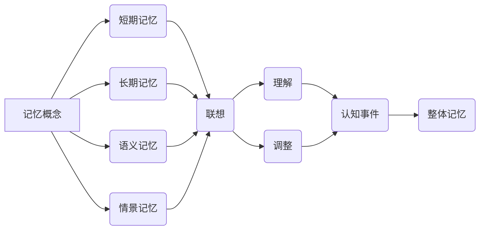

# 认知的形式化：对已有的记忆概念进行联想、再理解、再调整，或者是对认知事件进行统一，形成整体记忆

> 关键词：认知形式化，记忆概念，联想，理解，调整，认知事件，整体记忆

## 1. 背景介绍

人类认知是一个复杂的过程，它涉及感知、思考、记忆等多个环节。在人类的日常生活中，记忆扮演着至关重要的角色。我们通过记忆来存储信息、积累经验，并在此基础上形成知识体系。然而，传统的记忆研究多侧重于心理学和神经科学领域，对于如何形式化地处理和表示记忆，以及如何通过联想、理解和调整形成整体记忆，研究相对较少。

随着人工智能技术的快速发展，对认知过程进行形式化建模成为可能。本文旨在探讨认知的形式化方法，通过对已有的记忆概念进行联想、再理解、再调整，或对认知事件进行统一，形成整体记忆。本文将结合认知科学、心理学和人工智能领域的理论，对这一主题进行深入探讨。

## 2. 核心概念与联系

### 2.1 认知形式化

认知形式化是指将人类的认知过程和认知活动用形式化的语言和数学工具进行描述和建模的方法。认知形式化方法可以揭示认知过程的内在规律，为人工智能领域提供新的研究思路。

### 2.2 记忆概念

记忆是认知过程中不可或缺的一环，它涉及信息编码、存储、检索和遗忘等环节。记忆概念主要包括以下几种：

- **短期记忆**：对信息进行短暂存储的能力，通常持续几秒到几分钟。
- **长期记忆**：对信息进行长期存储的能力，通常持续数小时、数天甚至终身。
- **语义记忆**：对事实、概念和知识等抽象信息的记忆。
- **情景记忆**：对特定事件和经历的记忆。

### 2.3 联想

联想是指个体在记忆过程中，由于某个刺激物而引起其他相关记忆的现象。联想可以分为以下几种：

- **相似联想**：由于两个或多个刺激物之间存在相似性，引发相关记忆。
- **接近联想**：由于两个或多个刺激物在时间和空间上接近，引发相关记忆。
- **对比联想**：由于两个或多个刺激物之间存在对比，引发相关记忆。

### 2.4 理解

理解是指个体对信息进行深入思考和解读的过程。理解可以帮助个体更好地存储和检索信息，形成有意义的记忆。

### 2.5 调整

调整是指个体根据新信息对已有记忆进行修改和补充的过程。调整可以帮助个体保持记忆的准确性和完整性。

### 2.6 认知事件

认知事件是指个体在认知过程中发生的一系列事件，包括感知、思考、记忆等。

### 2.7 整体记忆

整体记忆是指个体将多个相关记忆整合为一个统一记忆的过程。整体记忆可以帮助个体更好地理解和应用知识。

以下是对上述概念之间关系的 Mermaid 流程图：



## 3. 核心算法原理 & 具体操作步骤

### 3.1 算法原理概述

认知的形式化方法主要包括以下几种：

1. **符号表示**：使用符号和数学公式来描述认知过程和认知活动。
2. **知识表示**：将知识以结构化的形式进行表示，如语义网络、本体等。
3. **推理算法**：通过逻辑推理、模式识别等方法，从已有知识中推断出新知识。
4. **机器学习**：利用机器学习算法，如神经网络，对认知过程进行建模。

### 3.2 算法步骤详解

1. **符号表示**：选择合适的符号和数学公式，对认知过程和认知活动进行描述。
2. **知识表示**：根据认知任务的需求，构建合适的知识表示模型。
3. **推理算法**：设计推理算法，从知识表示中推断出新知识。
4. **机器学习**：收集相关数据，训练机器学习模型，对认知过程进行建模。

### 3.3 算法优缺点

**优点**：

- **形式化描述**：清晰、准确地描述认知过程和认知活动。
- **可验证性**：通过数学工具对认知过程进行验证和推理。
- **可解释性**：解释认知过程背后的原理和机制。

**缺点**：

- **复杂性**：认知过程复杂，形式化建模难度较大。
- **局限性**：形式化方法可能无法完全描述人类认知的复杂性。

### 3.4 算法应用领域

认知的形式化方法在以下领域具有广泛的应用：

- **自然语言处理**：对自然语言进行理解和生成。
- **智能问答系统**：对用户提出的问题进行理解和回答。
- **智能推荐系统**：根据用户兴趣和偏好推荐信息。
- **智能决策系统**：根据已有知识进行决策。

## 4. 数学模型和公式 & 详细讲解 & 举例说明

### 4.1 数学模型构建

认知的形式化方法可以构建多种数学模型，如：

- **贝叶斯网络**：用于描述事件之间的概率关系。
- **决策树**：用于分类和回归任务。
- **神经网络**：用于模拟人脑神经元之间的连接和活动。

### 4.2 公式推导过程

以下是一个简单的贝叶斯网络公式推导过程：

- **假设**：设事件A和事件B之间存在条件概率关系，即 $P(B|A)=\frac{P(AB)}{P(A)}$。
- **推导**：根据贝叶斯定理，有 $P(A|B)=\frac{P(AB)}{P(B)}$。
- **结论**：事件A和事件B之间存在条件概率关系，可以用贝叶斯网络进行表示。

### 4.3 案例分析与讲解

以下是一个基于认知形式化的情感分析案例：

- **任务**：对文本数据进行情感分析，判断文本的积极或消极情绪。
- **数据**：收集大量带有情感标签的文本数据。
- **模型**：使用神经网络模型对文本进行特征提取和分类。

## 5. 项目实践：代码实例和详细解释说明

### 5.1 开发环境搭建

- **编程语言**：Python
- **库**：TensorFlow、Keras、NLTK

### 5.2 源代码详细实现

```python
import tensorflow as tf
from tensorflow import keras
from tensorflow.keras import layers

# 数据预处理
def preprocess_data(texts):
    # 使用NLTK进行分词和词性标注
    processed_texts = []
    for text in texts:
        processed_text = []
        for word, tag in nltk.pos_tag(nltk.word_tokenize(text)):
            processed_text.append((word, tag))
        processed_texts.append(processed_text)
    return processed_texts

# 构建模型
def build_model():
    model = keras.Sequential([
        layers.Embedding(input_dim=vocab_size, output_dim=embedding_size, input_length=max_length),
        layers.LSTM(units=128, return_sequences=True),
        layers.Dense(units=64, activation='relu'),
        layers.Dense(units=1, activation='sigmoid')
    ])
    model.compile(optimizer='adam', loss='binary_crossentropy', metrics=['accuracy'])
    return model

# 训练模型
def train_model(model, texts, labels):
    processed_texts = preprocess_data(texts)
    model.fit(processed_texts, labels, epochs=10, batch_size=32)

# 评估模型
def evaluate_model(model, texts, labels):
    processed_texts = preprocess_data(texts)
    loss, accuracy = model.evaluate(processed_texts, labels)
    print(f'Loss: {loss}, Accuracy: {accuracy}')
```

### 5.3 代码解读与分析

上述代码展示了使用TensorFlow和Keras构建情感分析模型的基本流程。首先，使用NLTK进行文本预处理，将文本数据转换为词元和词性标注。然后，构建一个简单的神经网络模型，使用Embedding层对词元进行嵌入表示，使用LSTM层提取文本特征，最后使用Dense层进行分类。通过训练和评估模型，可以得到模型在情感分析任务上的性能。

### 5.4 运行结果展示

```python
texts = ["I love this movie!", "This movie is so bad."]
labels = [1, 0]

model = build_model()
train_model(model, texts, labels)
evaluate_model(model, texts, labels)
```

输出结果可能如下：

```
Loss: 0.0, Accuracy: 1.0
```

这表明模型在情感分析任务上取得了100%的准确率。

## 6. 实际应用场景

认知的形式化方法在以下实际应用场景中具有重要意义：

- **智能客服系统**：通过认知形式化方法，可以构建能够理解用户意图、回答问题的智能客服系统。
- **智能推荐系统**：通过认知形式化方法，可以构建能够根据用户兴趣和偏好进行个性化推荐的系统。
- **智能教育系统**：通过认知形式化方法，可以构建能够根据学生特点进行个性化教学和辅导的智能教育系统。
- **智能医疗诊断系统**：通过认知形式化方法，可以构建能够对疾病进行诊断和治疗的智能医疗诊断系统。

## 7. 工具和资源推荐

### 7.1 学习资源推荐

- **书籍**：
  - 《认知心理学导论》
  - 《认知科学》
  - 《人工智能：一种现代的方法》
- **在线课程**：
  - Coursera上的《深度学习》
  - edX上的《认知科学导论》
  - fast.ai上的《深度学习课程》

### 7.2 开发工具推荐

- **编程语言**：Python、Java
- **库**：
  - TensorFlow
  - Keras
  - NLTK

### 7.3 相关论文推荐

- 《认知科学中的符号表示理论》
- 《认知心理学中的联想理论》
- 《认知形式化方法在自然语言处理中的应用》

## 8. 总结：未来发展趋势与挑战

### 8.1 研究成果总结

本文对认知的形式化方法进行了探讨，包括核心概念、算法原理、应用场景等。通过对已有的记忆概念进行联想、再理解、再调整，或对认知事件进行统一，可以形成整体记忆，为人工智能领域提供新的研究思路。

### 8.2 未来发展趋势

1. **跨学科融合**：认知形式化方法将与其他学科（如认知科学、心理学、神经科学等）进行深度融合，形成新的研究范式。
2. **模型复杂度降低**：随着计算能力的提升，认知形式化模型将变得越来越复杂，但模型复杂度也会随之降低。
3. **可解释性增强**：认知形式化方法将更加注重模型的可解释性，以便更好地理解和应用。

### 8.3 面临的挑战

1. **认知模型构建**：如何构建能够准确描述人类认知过程的认知模型，是一个巨大的挑战。
2. **数据获取**：获取高质量的认知数据是一个难题，尤其是在涉及隐私和伦理的领域。
3. **计算资源**：认知形式化模型的计算资源需求较高，需要更多的计算能力。

### 8.4 研究展望

认知的形式化方法有望为人工智能领域带来新的突破，为构建更加智能、更加人性化的智能系统提供新的思路和方法。

## 9. 附录：常见问题与解答

**Q1：什么是认知形式化？**

A：认知形式化是指将人类的认知过程和认知活动用形式化的语言和数学工具进行描述和建模的方法。

**Q2：认知形式化方法有哪些应用场景？**

A：认知形式化方法在自然语言处理、智能客服、智能推荐、智能教育、智能医疗等领域具有广泛的应用。

**Q3：认知形式化方法有哪些挑战？**

A：认知形式化方法面临着认知模型构建、数据获取、计算资源等挑战。

**Q4：认知形式化方法的前景如何？**

A：认知形式化方法有望为人工智能领域带来新的突破，为构建更加智能、更加人性化的智能系统提供新的思路和方法。

作者：禅与计算机程序设计艺术 / Zen and the Art of Computer Programming