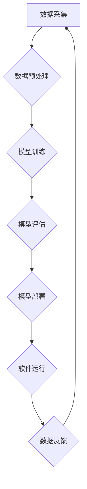

## 软件 2.0 的时代：数据驱动一切

> 关键词：数据驱动、软件架构、机器学习、深度学习、人工智能、数据可视化、云计算

### 1. 背景介绍

软件行业正经历一场深刻的变革，从传统的以代码为中心的开发模式向以数据为中心的开发模式转变。这一转变被我们称为“软件 2.0 的时代”。

过去几十年，软件开发主要依赖于人类的逻辑思维和编程能力。程序员们需要根据需求仔细设计算法，编写代码，并进行反复测试和调试。然而，随着数据量的爆炸式增长，传统的开发模式面临着越来越大的挑战。

数据驱动软件的时代，软件不再仅仅是执行预先定义的指令，而是能够从海量数据中学习和进化。软件能够根据用户行为、市场趋势和环境变化，自动调整自身功能和性能，从而提供更加个性化、智能化和高效的服务。

### 2. 核心概念与联系

**2.1 数据驱动**

数据驱动是指利用数据来指导软件的开发、设计和运营。在数据驱动软件中，数据是软件的核心资产，它不仅用于训练机器学习模型，也用于分析用户行为、优化系统性能和预测未来趋势。

**2.2 软件架构**

软件架构是指软件系统的高层结构设计，它定义了软件系统的组成部分、它们的相互关系以及它们如何协同工作。在数据驱动软件中，软件架构需要能够高效地处理和利用数据，并支持机器学习模型的部署和管理。

**2.3 机器学习**

机器学习是人工智能的一个分支，它使软件能够从数据中学习，并根据学习到的知识进行预测或决策。机器学习算法可以分为监督学习、无监督学习和强化学习三大类。

**2.4 深度学习**

深度学习是机器学习的一个子领域，它使用多层神经网络来模拟人类大脑的学习过程。深度学习算法能够处理更复杂的数据，并取得更高的准确率。

**2.5 人工智能**

人工智能是指使软件能够模拟人类智能的行为，例如学习、推理、决策和解决问题。人工智能技术正在被广泛应用于各种领域，例如医疗保健、金融、交通和娱乐。

**Mermaid 流程图**



### 3. 核心算法原理 & 具体操作步骤

**3.1 算法原理概述**

在数据驱动软件中，机器学习算法是核心技术。这些算法能够从数据中学习模式和规律，并根据学习到的知识进行预测或决策。常见的机器学习算法包括线性回归、逻辑回归、决策树、支持向量机和神经网络等。

**3.2 算法步骤详解**

机器学习算法的训练过程通常包括以下步骤：

1. **数据采集:** 收集与目标任务相关的原始数据。
2. **数据预处理:** 对数据进行清洗、转换和特征工程，使其适合机器学习算法的训练。
3. **模型选择:** 根据任务需求选择合适的机器学习算法。
4. **模型训练:** 使用训练数据训练机器学习模型，并调整模型参数以获得最佳性能。
5. **模型评估:** 使用测试数据评估模型的性能，并进行必要的调整。
6. **模型部署:** 将训练好的模型部署到生产环境中，用于进行预测或决策。

**3.3 算法优缺点**

不同的机器学习算法具有不同的优缺点，需要根据具体任务选择合适的算法。例如，线性回归算法简单易实现，但对于复杂的数据关系难以建模；决策树算法能够处理非线性数据，但容易过拟合；神经网络算法能够处理非常复杂的非线性数据，但训练时间长，参数众多。

**3.4 算法应用领域**

机器学习算法已广泛应用于各个领域，例如：

* **推荐系统:** 根据用户的历史行为推荐商品或内容。
* **图像识别:** 自动识别图像中的物体或场景。
* **自然语言处理:** 处理和理解人类语言，例如机器翻译、文本摘要和聊天机器人。
* **预测分析:** 根据历史数据预测未来趋势，例如销售预测和风险评估。

### 4. 数学模型和公式 & 详细讲解 & 举例说明

**4.1 数学模型构建**

机器学习算法通常基于数学模型，这些模型描述了数据之间的关系。例如，线性回归模型假设数据之间存在线性关系，可以用以下公式表示：

$$y = mx + c$$

其中，$y$ 是预测值，$x$ 是输入特征，$m$ 是斜率，$c$ 是截距。

**4.2 公式推导过程**

机器学习算法的训练过程本质上是参数优化过程。通过使用梯度下降等优化算法，不断调整模型参数，使得模型的预测结果与真实值之间的误差最小化。

**4.3 案例分析与讲解**

例如，在训练线性回归模型时，可以使用均方误差作为损失函数，并使用梯度下降算法优化模型参数。

$$Loss = \frac{1}{n} \sum_{i=1}^{n} (y_i - \hat{y}_i)^2$$

其中，$n$ 是样本数量，$y_i$ 是真实值，$\hat{y}_i$ 是模型预测值。

通过计算损失函数的梯度，可以更新模型参数，使得损失函数不断减小，最终得到一个能够准确预测目标变量的模型。

### 5. 项目实践：代码实例和详细解释说明

**5.1 开发环境搭建**

为了实现数据驱动软件，需要搭建一个合适的开发环境。常用的开发环境包括：

* **Python:** Python 是机器学习和数据科学领域最流行的编程语言，拥有丰富的库和框架，例如 scikit-learn、TensorFlow 和 PyTorch。
* **云计算平台:** 云计算平台，例如 AWS、Azure 和 GCP，提供强大的计算资源和数据存储服务，可以帮助开发者快速构建和部署数据驱动软件。

**5.2 源代码详细实现**

以下是一个使用 Python 和 scikit-learn 库实现线性回归模型的简单代码示例：

```python
from sklearn.linear_model import LinearRegression
from sklearn.model_selection import train_test_split
import numpy as np

# 生成示例数据
X = np.array([[1], [2], [3], [4], [5]])
y = np.array([2, 4, 5, 4, 5])

# 将数据分成训练集和测试集
X_train, X_test, y_train, y_test = train_test_split(X, y, test_size=0.2)

# 创建线性回归模型
model = LinearRegression()

# 训练模型
model.fit(X_train, y_train)

# 使用模型进行预测
y_pred = model.predict(X_test)

# 打印预测结果
print(y_pred)
```

**5.3 代码解读与分析**

这段代码首先使用 NumPy 库生成示例数据，然后使用 scikit-learn 库将数据分成训练集和测试集。接着，创建了一个线性回归模型，并使用训练数据训练模型。最后，使用训练好的模型对测试数据进行预测，并打印预测结果。

**5.4 运行结果展示**

运行这段代码后，会输出测试数据的预测结果。

### 6. 实际应用场景

数据驱动软件已在各个领域得到广泛应用，例如：

**6.1 个性化推荐系统:**

电商平台、音乐平台和视频平台都使用数据驱动软件来推荐个性化的商品、音乐和视频内容。

**6.2 智能客服系统:**

一些企业使用数据驱动软件来构建智能客服系统，能够自动回答用户常见问题，提高客户服务效率。

**6.3 医疗诊断辅助系统:**

一些医疗机构使用数据驱动软件来辅助医生进行诊断，例如根据患者的症状和检查结果预测疾病风险。

**6.4 金融风险管理系统:**

金融机构使用数据驱动软件来识别和管理金融风险，例如预测贷款违约风险。

**6.5 交通流量预测系统:**

交通管理部门使用数据驱动软件来预测交通流量，优化交通信号灯控制和道路规划。

**6.6 未来应用展望**

随着数据量的继续增长和人工智能技术的不断发展，数据驱动软件将在未来发挥更加重要的作用。例如，数据驱动软件将被用于开发更加智能的机器人、自动驾驶汽车和虚拟助手。

### 7. 工具和资源推荐

**7.1 学习资源推荐**

* **书籍:**
    * 《Python机器学习》
    * 《深度学习》
    * 《人工智能：一种现代方法》
* **在线课程:**
    * Coursera 上的机器学习课程
    * edX 上的深度学习课程
    * fast.ai 的深度学习课程

**7.2 开发工具推荐**

* **Python:** Python 是数据科学和机器学习领域最流行的编程语言。
* **scikit-learn:** scikit-learn 是一个用于机器学习的 Python 库，提供了各种算法和工具。
* **TensorFlow:** TensorFlow 是一个用于深度学习的开源库，由 Google 开发。
* **PyTorch:** PyTorch 是一个用于深度学习的开源库，由 Facebook 开发。
* **Jupyter Notebook:** Jupyter Notebook 是一个交互式笔记本环境，用于编写和执行 Python 代码。

**7.3 相关论文推荐**

* 《ImageNet Classification with Deep Convolutional Neural Networks》
* 《Attention Is All You Need》
* 《BERT: Pre-training of Deep Bidirectional Transformers for Language Understanding》

### 8. 总结：未来发展趋势与挑战

**8.1 研究成果总结**

数据驱动软件的时代已经到来，机器学习和深度学习算法取得了令人瞩目的成果，在各个领域都得到了广泛应用。

**8.2 未来发展趋势**

未来，数据驱动软件将朝着以下几个方向发展：

* **更加智能化:** 软件将能够更加智能地理解用户需求，并提供更加个性化和定制化的服务。
* **更加自动化:** 软件将能够自动学习和进化，无需人工干预。
* **更加安全可靠:** 软件将更加注重数据安全和隐私保护。

**8.3 面临的挑战**

数据驱动软件的发展也面临着一些挑战：

* **数据质量问题:** 数据质量问题会影响模型的性能，需要开发更加有效的算法和方法来处理脏数据和缺失数据。
* **算法解释性问题:** 许多机器学习算法是黑箱模型，难以解释其决策过程，这可能会导致用户对软件的信任度降低。
* **伦理问题:** 数据驱动软件的应用可能会带来一些伦理问题，例如算法偏见和数据隐私问题，需要制定相应的伦理规范和法律法规。

**8.4 研究展望**

未来，我们需要继续研究和探索新的算法、模型和技术，以解决数据驱动软件面临的挑战，并推动其更加健康和可持续的发展。

### 9. 附录：常见问题与解答

**9.1 如何选择合适的机器学习算法？**

选择合适的机器学习算法需要根据具体任务需求和数据特点进行考虑。例如，对于分类任务，可以考虑使用逻辑回归、决策树或支持向量机；对于回归任务，可以考虑使用线性回归或支持向量回归。

**9.2 如何处理数据中的缺失值？**

数据中的缺失值会影响模型的性能，可以使用以下方法处理缺失值：

* **删除缺失值:** 如果缺失值较少，可以删除包含缺失值的样本。
* **用均值或中位数填充缺失值:** 如果缺失值较多，可以将缺失值填充为该特征的均值或中位数。
* **使用其他填充方法:** 还可以使用其他填充方法，例如 KNN 填充或插值法。

**9.3 如何评估机器学习模型的性能？**

可以使用以下指标来评估机器学习模型的性能：

* **准确率:** 分类任务中，准确率是指模型正确分类的样本数量占总样本数量的比例。
* **召回率:** 分类任务中，召回率是指模型正确分类的正样本数量占所有正样本数量的比例。
* **F