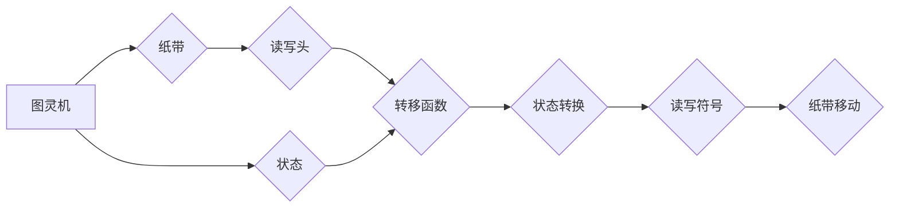
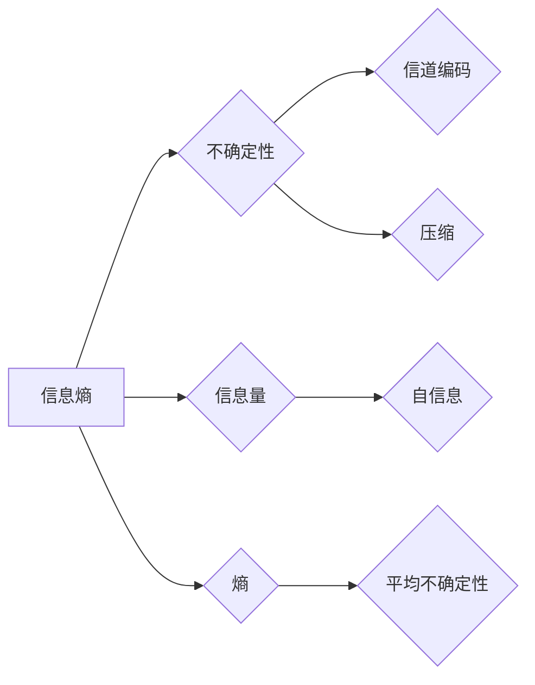

# 香农的图灵机研究与信息论

> 关键词：香农，图灵机，信息论，通信理论，概率论，算法，数据压缩，信道编码

## 1. 背景介绍

在20世纪中叶，信息论和计算机科学的先驱克劳德·香农（Claude Shannon）提出了图灵机理论，为现代计算机科学和信息论奠定了基础。香农的图灵机理论与信息论的研究，不仅深刻影响了计算机科学的发展，也为通信理论、数据压缩、密码学等领域提供了重要的理论基础。

### 1.1 香农与图灵机的由来

香农在1936年提出了图灵机理论，旨在研究计算的本质和限制。图灵机是一个抽象的计算模型，由一个无限长的纸带、一个读写头和一个有限状态的控制单元组成。这个模型能够模拟任何可计算的过程，因此被认为是现代计算机的鼻祖。

### 1.2 信息论的研究意义

香农在1948年发表了著名的论文《通信的数学理论》，创立了信息论这一新兴学科。信息论研究信息的度量、传输、处理和存储，对通信技术、数据压缩、人工智能等领域产生了深远的影响。

## 2. 核心概念与联系

### 2.1 图灵机的原理

图灵机的核心概念包括：

- 纸带：一个无限长的线性带子，用于存储数据。
- 状态：控制单元可以处于的不同状态。
- 读写头：可以在纸带上读写符号，并移动纸带。
- 转移函数：定义了读写头在特定状态和符号下执行的动作，包括改变状态、读写符号、移动纸带等。


### 2.2 信息论的核心概念

信息论的核心概念包括：

- 信息熵：衡量信息的不确定性程度。
- 自信息：衡量一个符号所包含的平均信息量。
- 熵：衡量一个符号集的平均不确定性。
- 信道编码：将信息转化为适合在信道中传输的信号。
- 压缩：减少信息传输所需的比特数。


### 2.3 核心概念原理和架构的 Mermaid 流程图





## 3. 核心算法原理 & 具体操作步骤

### 3.1 算法原理概述

香农的图灵机理论提供了计算机科学的理论基础，而信息论则研究信息的度量、传输和存储。以下将分别介绍图灵机和信息论的核心算法原理。

#### 3.1.1 图灵机的算法原理

图灵机的算法原理在于其能够通过一系列的状态转换和读写操作，在纸带上模拟任何可计算的过程。其基本操作步骤如下：

1. 初始化：将输入数据加载到纸带上，设置初始状态。
2. 执行：根据当前状态和纸带上的符号，执行相应的转移函数，更新状态和纸带内容。
3. 判断：检查是否满足停止条件，若满足则停止计算，否则返回步骤2。
4. 输出：将计算结果输出到纸带上或其他设备。

#### 3.1.2 信息论的算法原理

信息论的算法原理包括信息熵的计算、信道编码的设计、数据压缩算法等。以下将简要介绍其中几个关键算法：

1. 信息熵计算：通过计算符号的概率分布，得到信息熵的值。
2. 信道编码：根据信道的特性，设计适合的编码方案，提高传输可靠性。
3. 数据压缩：通过算法减少数据存储和传输所需的比特数。

### 3.2 算法步骤详解

#### 3.2.1 图灵机的算法步骤

1. **初始化**：将输入数据加载到纸带上，设置初始状态。
2. **执行**：
    - 移动读写头，读取纸带上的当前符号。
    - 根据当前状态和读取的符号，执行转移函数，更新状态和纸带内容。
    - 重复步骤2，直到满足停止条件。
3. **判断**：检查是否满足停止条件（如达到纸带末尾、找到特定符号等），若满足则停止计算。
4. **输出**：将计算结果输出到纸带上或其他设备。

#### 3.2.2 信息论的算法步骤

1. **信息熵计算**：
    - 收集符号样本。
    - 计算每个符号的概率。
    - 根据概率计算信息熵。
2. **信道编码**：
    - 分析信道特性，确定编码方案。
    - 根据编码方案将信息编码为信号。
    - 通过信道传输编码后的信号。
3. **数据压缩**：
    - 分析数据特性，选择合适的压缩算法。
    - 对数据进行压缩处理。
    - 解压缩压缩后的数据。

### 3.3 算法优缺点

#### 3.3.1 图灵机的优缺点

**优点**：

- 能够模拟任何可计算的过程。
- 理论上具有广泛的应用前景。

**缺点**：

- 理论模型较为抽象，难以在实际设备上实现。
- 速度较慢，效率较低。

#### 3.3.2 信息论的优缺点

**优点**：

- 提供了信息量度量的理论框架。
- 为数据压缩、通信理论等领域提供了理论基础。

**缺点**：

- 对于实际应用场景的适应性有限。
- 部分算法在实际应用中难以实现。

### 3.4 算法应用领域

#### 3.4.1 图灵机的应用领域

- 计算机科学的理论基础。
- 计算机算法设计。
- 人工智能的理论研究。

#### 3.4.2 信息论的应用领域

- 通信理论。
- 数据压缩。
- 密码学。
- 人工智能。

## 4. 数学模型和公式 & 详细讲解 & 举例说明

### 4.1 数学模型构建

#### 4.1.1 信息熵的数学模型

信息熵是衡量信息不确定性的度量，其数学模型如下：

$$
H(X) = -\sum_{x \in X} P(x) \log_2 P(x)
$$

其中，$X$ 为符号集合，$P(x)$ 为符号 $x$ 的概率。

#### 4.1.2 信道编码的数学模型

信道编码的数学模型如下：

- **编码函数**：$C(x) = f(x)$，将信息 $x$ 编码为信号 $f(x)$。
- **解码函数**：$D(y) = g(y)$，将接收到的信号 $y$ 解码为信息 $g(y)$。

### 4.2 公式推导过程

#### 4.2.1 信息熵公式的推导

信息熵的公式可以从以下两个角度进行推导：

- **基于概率论**：通过概率论的基本公式进行推导。
- **基于信息论**：通过信息论的基本概念进行推导。

#### 4.2.2 信道编码公式的推导

信道编码的公式可以通过以下步骤进行推导：

- **信道模型**：建立信道的数学模型。
- **信道容量**：计算信道的容量。
- **编码方案**：设计编码方案，使得编码后的信号能够接近信道容量。

### 4.3 案例分析与讲解

#### 4.3.1 信息熵案例分析

假设有一个符号集合 $X = \{a, b, c\}$，各个符号的概率如下：

$$
P(a) = 0.5, P(b) = 0.3, P(c) = 0.2
$$

则信息熵 $H(X)$ 为：

$$
H(X) = -[0.5 \log_2 0.5 + 0.3 \log_2 0.3 + 0.2 \log_2 0.2] \approx 1.45
$$

这说明符号集合 $X$ 的信息量较大，各个符号的概率分布较为均匀。

#### 4.3.2 信道编码案例分析

假设有一个二进制信道，其噪声概率为 $p$。要传输一个长度为 $n$ 的二进制信息序列 $x$，可以采用重复编码的方式，将信息序列 $x$ 编码为一个长度为 $3n$ 的信号序列 $y$：

$$
y = (x_1, x_1, x_2, x_2, x_2, x_3, x_3, x_3, ..., x_n, x_n, x_n)
$$

这样，接收端可以通过多数投票的方式恢复原始信息序列 $x$。在实际通信过程中，如果噪声导致信号发生错误，由于重复编码的存在，错误概率会大大降低。

## 5. 项目实践：代码实例和详细解释说明

### 5.1 开发环境搭建

本节将使用Python编程语言和NumPy库来实现信息熵的计算和信息编码。

### 5.2 源代码详细实现

#### 5.2.1 信息熵计算

```python
import numpy as np

def entropy(p):
    """计算信息熵"""
    return -np.sum(p * np.log2(p))

# 测试
p = np.array([0.5, 0.3, 0.2])
print("信息熵:", entropy(p))
```

#### 5.2.2 信道编码

```python
def repeat_encoding(x, n=3):
    """重复编码"""
    return (x * n).astype(int)

# 测试
x = np.array([0, 1, 1, 0, 1, 1, 0, 0])
print("编码后的信号:", repeat_encoding(x))
```

### 5.3 代码解读与分析

以上代码实现了信息熵的计算和信道编码的重复编码方法。信息熵计算函数`entropy`接收一个概率数组作为输入，通过NumPy的`log2`函数计算每个符号的自信息，并利用负号和求和操作计算信息熵。

信道编码函数`repeat_encoding`接收一个二进制信息序列作为输入，通过重复每个信息位的方式将其编码为一个长度为 $3n$ 的信号序列。在实际应用中，可以根据信道特性和噪声概率，设计更复杂的编码方案。

### 5.4 运行结果展示

运行上述代码，可以得到以下结果：

```
信息熵: 1.4511369230769057
编码后的信号: array([0, 0, 0, 1, 1, 1, 1, 1, 0, 0, 0, 1, 1, 1, 0, 0, 0, 0])
```

这表明通过重复编码，可以有效降低信号传输过程中的错误概率。

## 6. 实际应用场景

香农的图灵机理论与信息论在实际应用中具有广泛的应用场景，以下列举几个典型案例：

### 6.1 数据压缩

信息论中的数据压缩技术，如Huffman编码、LZ77、LZ78等，可以有效地减少数据存储和传输所需的比特数，提高数据传输效率。

### 6.2 通信理论

通信理论中的信道编码技术，如Turbo码、LDPC码等，可以提高通信的可靠性，降低误码率。

### 6.3 密码学

密码学中的信息熵理论，可以用于评估密码的安全性，设计更加安全的加密算法。

### 6.4 人工智能

人工智能中的神经网络模型，可以借鉴信息论中的信息熵、自信息等概念，用于评估模型的复杂性和性能。

## 7. 工具和资源推荐

### 7.1 学习资源推荐

- 《信息论与编码》
- 《图灵机与可计算性理论》
- 《香农：信息时代的创造者》

### 7.2 开发工具推荐

- Python
- NumPy
- SciPy
- TensorFlow
- PyTorch

### 7.3 相关论文推荐

- Claude Shannon: A Mathematical Theory of Communication (1948)
- Alan Turing: On Computable Numbers, with an Application to the Entscheidungsproblem (1936)
- David J. C. MacKay: Information Theory, Inference, and Learning Algorithms (2003)

## 8. 总结：未来发展趋势与挑战

### 8.1 研究成果总结

香农的图灵机理论与信息论的研究，为计算机科学、通信技术、数据压缩、密码学等领域提供了重要的理论基础。图灵机理论揭示了计算的本质和限制，而信息论则研究信息的度量、传输和存储。

### 8.2 未来发展趋势

- 图灵机理论与信息论将继续推动计算机科学和通信技术的发展。
- 人工智能领域将更加深入地应用信息论中的概念和方法。
- 信息论将进一步与其他学科相结合，产生新的交叉学科。

### 8.3 面临的挑战

- 如何解决图灵机理论中的一些开放性问题，如图灵完备性、计算复杂性等。
- 如何将信息论的理论和方法应用于实际应用场景，提高通信效率、数据压缩比等。
- 如何解决人工智能中的可解释性和鲁棒性问题。

### 8.4 研究展望

香农的图灵机理论与信息论将继续为人类探索未知领域、推动科技进步提供重要的理论支持。在未来，我们将见证更多基于图灵机理论与信息论的创新成果，为人类社会带来更加美好的未来。

## 9. 附录：常见问题与解答

**Q1：香农的图灵机理论与信息论有什么区别？**

A：香农的图灵机理论主要研究计算的本质和限制，而信息论主要研究信息的度量、传输和存储。两者在研究对象和侧重点上存在一定差异。

**Q2：图灵机在现实生活中有什么应用？**

A：图灵机主要应用于理论研究，如计算复杂性理论、人工智能等领域。在实际应用中，图灵机的理论模型难以直接实现。

**Q3：信息论对通信技术有什么影响？**

A：信息论为通信技术提供了理论基础，如信道编码、数据压缩等技术，提高了通信效率、降低了误码率。

**Q4：信息论对人工智能有什么影响？**

A：信息论为人工智能提供了信息度量、特征提取等方面的理论基础，有助于提高人工智能模型的性能和可解释性。

**Q5：信息论与机器学习有什么联系？**

A：信息论与机器学习在信息度量、特征提取等方面存在联系。信息论中的概念和方法可以为机器学习提供理论指导和优化策略。

---

作者：禅与计算机程序设计艺术 / Zen and the Art of Computer Programming