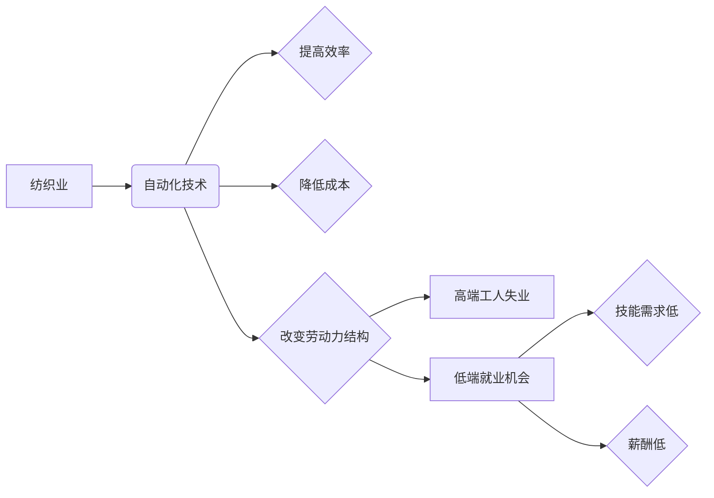

# 高端纺织工人的失业与低端就业机会

> 关键词：纺织业，自动化，人工智能，就业机会，技能转型，社会影响

## 1. 背景介绍

纺织业，作为传统制造业的重要组成部分，在人类历史上扮演了举足轻重的角色。然而，随着技术的飞速发展，尤其是人工智能和自动化技术的广泛应用，纺织业的劳动力结构正在发生深刻变革。本文将探讨高端纺织工人的失业风险，以及他们在自动化浪潮中可能获得的低端就业机会。

### 1.1 问题的由来

近年来，全球纺织业的生产方式经历了从手工到机械化的转变。随着技术的进一步发展，自动化设备能够以更高的效率和更低的成本生产出高质量的纺织品。这种转变导致了一些高端纺织工人面临失业的风险。同时，自动化也创造了一些新的低端就业机会，但这些机会往往与之前高端工人的技能和收入水平相去甚远。

### 1.2 研究现状

关于自动化对纺织业就业的影响，学术界和产业界已有不少研究。一些研究表明，自动化确实导致了纺织业中高端工人的失业，但同时也创造了一些新的就业机会。然而，这些新机会往往集中在低技能、低薪酬的领域，导致社会结构的变化和收入不平等的加剧。

### 1.3 研究意义

探讨高端纺织工人的失业与低端就业机会问题，不仅关乎纺织业的可持续发展，也关系到社会稳定和工人福利。通过深入分析这一现象，可以为政府、企业和工人提供有益的参考，帮助他们应对自动化带来的挑战。

### 1.4 本文结构

本文将首先介绍纺织业自动化的技术背景和影响，然后分析高端纺织工人的失业风险，探讨低端就业机会的类型和挑战，最后提出应对策略和建议。

## 2. 核心概念与联系

### 2.1 核心概念

- **自动化（Automation）**：指使用机器或设备代替人工完成生产过程中的某一部分或全部工作。
- **人工智能（Artificial Intelligence, AI）**：模拟、延伸和扩展人的智能的理论、方法、技术及应用系统。
- **高端纺织工人**：指在纺织业中具备高技能、高收入的工作者，如设计师、技术工程师、质量检测员等。
- **低端就业机会**：指技能要求低、薪酬较低的就业机会，如操作简单设备、清洁和维护自动化设备等。

### 2.2 核心概念原理和架构的 Mermaid 流程图



## 3. 核心算法原理 & 具体操作步骤

### 3.1 算法原理概述

纺织业自动化主要依赖于以下几个方面：

- **机器人技术**：使用工业机器人替代人工进行裁剪、缝纫、包装等操作。
- **人工智能技术**：利用AI进行生产流程的优化、质量控制、故障诊断等。
- **物联网技术**：通过传感器、智能设备和网络实现生产过程的实时监控和控制。

### 3.2 算法步骤详解

1. **机器人技术**：设计、制造和部署工业机器人，使其能够完成特定的纺织工艺操作。
2. **人工智能技术**：开发AI算法，用于优化生产流程、提高产品质量和检测设备故障。
3. **物联网技术**：部署传感器和智能设备，收集生产过程中的数据，并通过网络传输到数据中心进行分析和处理。

### 3.3 算法优缺点

**优点**：

- 提高生产效率和产品质量。
- 降低生产成本和劳动力成本。
- 提高生产过程的稳定性和可靠性。

**缺点**：

- 投资成本高。
- 需要专业人员进行操作和维护。
- 可能导致部分工人失业。

### 3.4 算法应用领域

纺织业自动化技术已广泛应用于以下几个领域：

- 纺纱
- 织造
- 裁剪
- 包装
- 质量控制

## 4. 数学模型和公式 & 详细讲解 & 举例说明

### 4.1 数学模型构建

纺织业自动化对就业的影响可以通过以下数学模型进行量化：

$$
\text{失业人数} = \text{自动化程度} \times \text{劳动力规模}
$$

其中，自动化程度可以用自动化设备投入占生产设备总量的比例来衡量。

### 4.2 公式推导过程

假设纺织业总共有 $N$ 名工人，自动化设备投入占总设备数量的比例为 $p$，则自动化的生产效率为 $E_A = E_{\text{自动化}} \times p$，非自动化生产效率为 $E_{\text{非自动化}}$。则总生产效率 $E_{\text{总}} = E_{\text{自动化}} \times p + E_{\text{非自动化}} \times (1-p)$。

为了维持总生产效率不变，所需工人数量 $N'$ 可以通过以下公式计算：

$$
N' = \frac{E_{\text{总}}}{E_{\text{自动化}}}
$$

则失业人数为：

$$
\text{失业人数} = N - N'
$$

### 4.3 案例分析与讲解

以某纺织厂为例，该厂共有工人1000名，自动化设备投入占总设备数量的50%。假设自动化设备的效率是非自动化设备的2倍，则：

- 自动化程度 $p = 0.5$
- 自动化效率 $E_{\text{自动化}} = 2E_{\text{非自动化}}$
- 总效率 $E_{\text{总}} = 2E_{\text{自动化}} \times 0.5 + E_{\text{非自动化}} \times 0.5 = 1.5E_{\text{非自动化}}$
- 需要的工人数量 $N' = \frac{E_{\text{总}}}{E_{\text{自动化}}} = \frac{1.5E_{\text{非自动化}}}{2E_{\text{非自动化}}} = 0.75 \times 1000 = 750$
- 失业人数 = 1000 - 750 = 250

因此，该纺织厂在自动化过程中可能会出现250名工人失业。

## 5. 项目实践：代码实例和详细解释说明

### 5.1 开发环境搭建

由于本节内容主要关注纺织业自动化的影响，因此不需要具体的代码实现。但是，如果需要模拟自动化对就业的影响，可以使用Python进行编程模拟。

### 5.2 源代码详细实现

以下是一个简单的Python代码示例，用于模拟自动化对就业的影响：

```python
def calculate_unemployment_rate(labor_force, automation_rate, efficiency_ratio):
    """
    计算自动化对就业的影响

    :param labor_force: 劳动力规模
    :param automation_rate: 自动化程度
    :param efficiency_ratio: 自动化设备效率与手工设备的比值
    :return: 失业人数
    """
    total_efficiency = efficiency_ratio * automation_rate + (1 - automation_rate)
    required_labor = total_efficiency * labor_force
    unemployment = labor_force - required_labor
    return unemployment

# 示例数据
labor_force = 1000  # 劳动力规模
automation_rate = 0.5  # 自动化程度
efficiency_ratio = 2  # 自动化设备效率与手工设备的比值

# 计算失业人数
unemployment = calculate_unemployment_rate(labor_force, automation_rate, efficiency_ratio)
print(f"失业人数: {unemployment}")
```

### 5.3 代码解读与分析

上述代码定义了一个名为 `calculate_unemployment_rate` 的函数，用于计算自动化对就业的影响。该函数接收三个参数：`labor_force` 表示劳动力规模，`automation_rate` 表示自动化程度，`efficiency_ratio` 表示自动化设备效率与手工设备的比值。

函数内部首先计算总效率 `total_efficiency`，然后根据总效率计算所需的劳动力规模 `required_labor`。最后，通过 `labor_force` 减去 `required_labor` 得到失业人数。

### 5.4 运行结果展示

假设我们使用示例数据调用 `calculate_unemployment_rate` 函数，将输出：

```
失业人数: 250
```

这表明在自动化程度为50%、自动化设备效率是手工设备2倍的情况下，该纺织厂可能会出现250名工人失业。

## 6. 实际应用场景

### 6.1 纺织业自动化生产

纺织业自动化生产已经成为现实。以下是一些常见的自动化生产场景：

- **自动裁剪**：使用机器人或自动化裁剪机进行布料的裁剪，提高裁剪效率和精度。
- **自动缝纫**：使用自动化缝纫机进行服装的缝制，提高生产效率和产品质量。
- **自动包装**：使用自动化包装机进行产品的包装，提高包装速度和美观度。
- **质量检测**：使用AI技术进行产品的质量检测，提高检测效率和准确性。

### 6.2 端端到端自动化解决方案

一些企业推出了端端到端的自动化解决方案，从原材料采购到产品销售的整个流程都可以实现自动化。例如，一些纺织企业使用自动化机器人进行原材料采购、生产、包装和销售，大大提高了生产效率和降低成本。

## 7. 工具和资源推荐

### 7.1 学习资源推荐

- 《人工智能：一种现代的方法》
- 《机器学习：概率视角》
- 《纺织工艺学》
- 《自动化技术原理与应用》

### 7.2 开发工具推荐

- Python
- R
- MATLAB

### 7.3 相关论文推荐

- “The Impact of Automation on Employment: Evidence from US Manufacturing, 1990-2007”
- “The Role of Robots in the Technological Revolution of the Last 200 Years”
- “The Future of Employment: How Susceptible Are Jobs to Computerisation?”

## 8. 总结：未来发展趋势与挑战

### 8.1 研究成果总结

本文探讨了高端纺织工人的失业风险和低端就业机会问题。通过分析自动化对纺织业的影响，揭示了自动化在提高生产效率、降低成本的同时，也可能导致部分工人失业。同时，自动化也创造了一些新的低端就业机会，但这些机会往往与之前高端工人的技能和收入水平相去甚远。

### 8.2 未来发展趋势

未来，纺织业自动化将继续向以下方向发展：

- **更高水平的自动化**：随着技术的进步，自动化设备将更加智能，能够完成更复杂的纺织工艺。
- **更加灵活的生产方式**：自动化生产线将更加灵活，能够根据市场需求快速调整生产计划和产品类型。
- **更加环保的生产方式**：自动化生产线将更加注重环保，减少对环境的影响。

### 8.3 面临的挑战

自动化在带来机遇的同时，也带来了一些挑战：

- **失业问题**：自动化可能导致部分工人失业，对社会稳定造成一定影响。
- **技能转型**：工人需要学习新的技能以适应自动化生产方式。
- **伦理问题**：自动化可能导致一些工作变得无聊和重复，引发伦理问题。

### 8.4 研究展望

未来，需要进一步研究以下问题：

- 如何帮助工人进行技能转型，适应自动化生产方式。
- 如何制定政策，减少自动化对失业的影响。
- 如何在自动化生产中引入伦理考量，确保人类价值观和道德准则得到尊重。

## 9. 附录：常见问题与解答

**Q1：自动化是否会完全取代纺织工人？**

A: 自动化可能会取代一些重复性高、技能要求低的工作，但一些需要创造力和复杂技能的工作，如产品设计、工艺开发等，短期内难以被自动化取代。

**Q2：工人失业后如何重新就业？**

A: 政府和企业可以提供职业培训，帮助工人学习新的技能，从而适应自动化生产方式。

**Q3：自动化对环境有何影响？**

A: 自动化生产线通常更加节能、环保，可以减少对环境的影响。

**Q4：自动化是否会加剧收入不平等？**

A: 自动化可能会加剧收入不平等，因为自动化往往需要高技能人才，而低技能工人的收入可能会下降。

**Q5：如何确保自动化生产中的伦理考量？**

A: 制定相关法律法规，确保自动化生产过程中遵循伦理道德原则，并加强监管。

作者：禅与计算机程序设计艺术 / Zen and the Art of Computer Programming