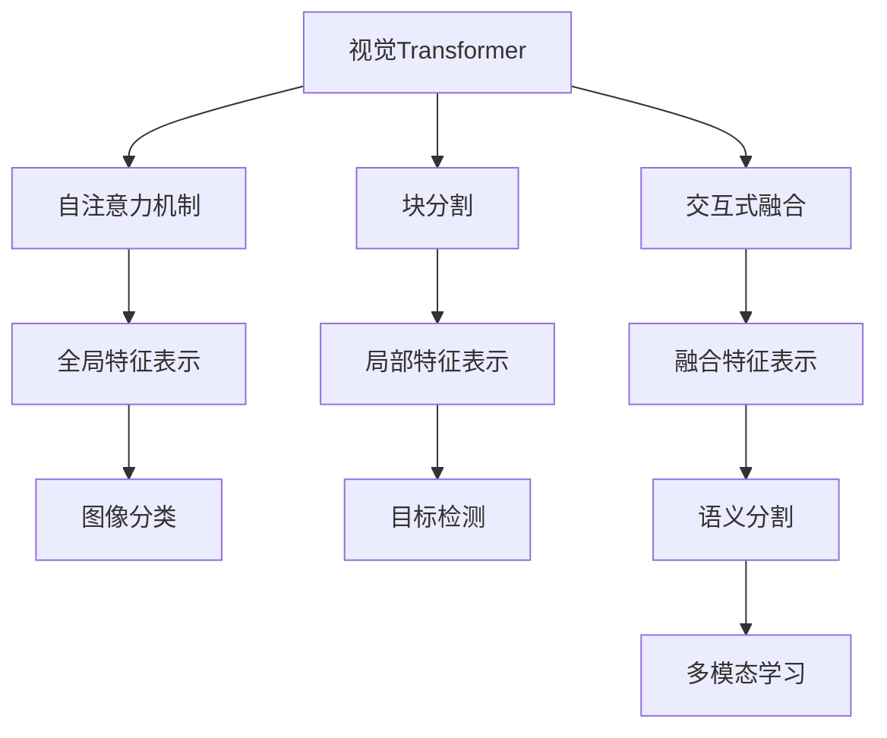
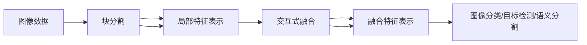
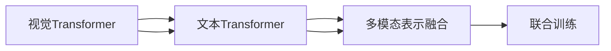
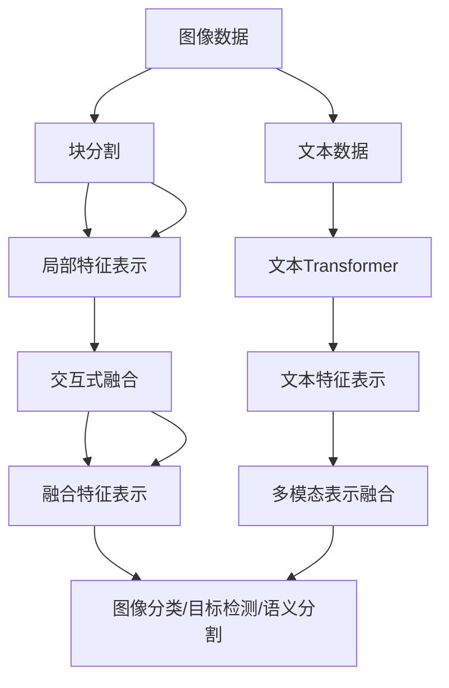

                 

# 视觉Transformer原理与代码实例讲解

> 关键词：视觉Transformer, 多模态学习, 自注意力机制, 特征图, 目标检测, 生成对抗网络, 图像分类, 代码实现, 深度学习

## 1. 背景介绍

### 1.1 问题由来
近年来，计算机视觉(CV)领域得益于深度学习的兴起，取得了长足的进步。特别是Transformer结构的提出，大大提升了图像识别、目标检测等任务的性能。视觉Transformer(ViT)作为Transformer在图像处理上的延伸，进一步推动了CV技术的创新和发展。然而，ViT的原理和实现细节尚缺乏系统的讲解，也缺少详细的代码实例。本文旨在通过理论推导和代码实现，帮助读者深入理解ViT的原理和应用。

### 1.2 问题核心关键点
ViT是一种利用自注意力机制进行图像处理的深度学习模型，其核心思想是将图像分割成若干个小的块，分别计算每个块的特征表示，最后通过自注意力机制将这些特征表示进行融合，得到整幅图像的特征表示。与传统的卷积神经网络(CNN)相比，ViT具有更好的参数共享和计算效率，适用于大规模图像数据和复杂的多模态任务。

ViT的主要特点包括：
1. 自注意力机制：通过计算图像中每个像素之间的关系，提取全局特征表示。
2. 块分割：将大图像分割成小的块，独立计算每个块的特征表示。
3. 交互式融合：将每个块的特征表示进行自注意力融合，得到整幅图像的特征表示。
4. 多模态应用：可以处理图像、文本等多模态数据，适用于图像分类、目标检测、语义分割等任务。

ViT的提出，标志着Transformer在图像处理领域的成功应用，为CV技术的进一步发展提供了新的思路。

### 1.3 问题研究意义
了解ViT的原理和实现细节，对于深入理解Transformer的图像处理能力，掌握ViT的代码实现，提高CV技术的开发效率和应用效果，具有重要意义。ViT作为Transformer的一种变体，不仅可以应用于图像分类、目标检测等传统任务，还可以拓展到视频、音频等更多模态数据处理，推动多模态学习技术的发展。

## 2. 核心概念与联系

### 2.1 核心概念概述

为更好地理解ViT的原理和应用，本节将介绍几个密切相关的核心概念：

- 视觉Transformer(ViT)：一种利用Transformer结构进行图像处理的深度学习模型，主要用于图像分类、目标检测等任务。
- 自注意力机制(Self-Attention)：一种基于Transformer的注意力机制，通过计算图像中每个像素之间的关系，提取全局特征表示。
- 块分割(Patch Division)：将大图像分割成小的块，独立计算每个块的特征表示。
- 交互式融合(Interactive Fusion)：将每个块的特征表示进行自注意力融合，得到整幅图像的特征表示。
- 多模态学习(Multimodal Learning)：利用视觉Transformer处理图像数据，同时与文本、音频等其他模态数据进行联合学习，提升模型的泛化能力和适应性。

这些核心概念之间的逻辑关系可以通过以下Mermaid流程图来展示：



这个流程图展示了几大核心概念之间的逻辑关系：

1. ViT利用自注意力机制，通过计算图像中每个像素之间的关系，提取全局特征表示。
2. 块分割将大图像分割成小的块，独立计算每个块的特征表示。
3. 交互式融合将每个块的特征表示进行自注意力融合，得到整幅图像的特征表示。
4. 多模态学习通过ViT处理图像数据，同时与文本、音频等其他模态数据进行联合学习。

### 2.2 概念间的关系

这些核心概念之间存在着紧密的联系，形成了ViT的完整框架。下面我们通过几个Mermaid流程图来展示这些概念之间的关系。

#### 2.2.1 视觉Transformer的工作流程



这个流程图展示了ViT的工作流程：

1. 图像数据通过块分割分成若干个小的块，独立计算每个块的特征表示。
2. 每个块的特征表示通过交互式融合进行自注意力融合，得到整幅图像的特征表示。
3. 整幅图像的特征表示通过图像分类/目标检测/语义分割等任务进行模型训练和推理。

#### 2.2.2 自注意力机制的计算流程


这个流程图展示了自注意力机制的计算流程：

1. 查询向量与键值矩阵进行点乘，得到注意力权重。
2. 根据注意力权重对键值矩阵进行加权求和，得到上下文向量。
3. 上下文向量经过线性变换，得到全局特征表示。

#### 2.2.3 多模态学习的交互机制



这个流程图展示了多模态学习的交互机制：

1. 视觉Transformer处理图像数据，文本Transformer处理文本数据。
2. 两种模态的数据通过多模态表示融合进行交互。
3. 融合后的多模态数据用于联合训练，提升模型的泛化能力和适应性。

### 2.3 核心概念的整体架构

最后，我们用一个综合的流程图来展示这些核心概念在ViT中的整体架构：



这个综合流程图展示了ViT的整体架构：

1. 图像数据通过块分割分成若干个小的块，独立计算每个块的特征表示。
2. 每个块的特征表示通过交互式融合进行自注意力融合，得到整幅图像的特征表示。
3. 整幅图像的特征表示通过图像分类/目标检测/语义分割等任务进行模型训练和推理。
4. 文本数据通过文本Transformer计算文本特征表示。
5. 两种模态的数据通过多模态表示融合进行交互。
6. 融合后的多模态数据用于联合训练，提升模型的泛化能力和适应性。

通过这些流程图，我们可以更清晰地理解ViT的原理和框架，为后续深入讨论ViT的算法实现奠定基础。

## 3. 核心算法原理 & 具体操作步骤
### 3.1 算法原理概述

ViT是一种利用Transformer结构进行图像处理的深度学习模型。其核心思想是将图像分割成若干个小的块，分别计算每个块的特征表示，最后通过自注意力机制将这些特征表示进行融合，得到整幅图像的特征表示。

形式化地，假设图像大小为$H \times W$，块大小为$P \times P$，则整幅图像可以分割成$\frac{H}{P} \times \frac{W}{P}$个块。设每个块的特征表示为$z_{i,j} \in \mathbb{R}^D$，则整幅图像的特征表示为$z \in \mathbb{R}^{N \times D}$，其中$N=\frac{H}{P} \times \frac{W}{P}$。

ViT的计算过程主要分为以下几步：

1. 块分割：将大图像分割成小的块，独立计算每个块的特征表示。
2. 交互式融合：将每个块的特征表示进行自注意力融合，得到整幅图像的特征表示。
3. 线性变换：对融合后的特征表示进行线性变换，得到最终的输出。

### 3.2 算法步骤详解

ViT的实现主要分为以下几个步骤：

**Step 1: 准备数据集**
- 收集训练图像数据，并将图像预处理成指定大小。
- 将图像分割成小的块，每个块的大小为$P \times P$。
- 计算每个块的特征表示，得到局部特征表示。

**Step 2: 构建视觉Transformer**
- 构建视觉Transformer模型，包括自注意力机制、交互式融合、线性变换等组件。
- 设置模型的超参数，如块大小、特征维度、学习率等。

**Step 3: 训练模型**
- 将局部特征表示作为输入，进行交互式融合和线性变换，得到整幅图像的特征表示。
- 计算模型输出与真实标签之间的损失函数，反向传播更新模型参数。
- 重复上述步骤直至模型收敛。

**Step 4: 评估模型**
- 在测试集上评估模型的性能，如分类准确率、检测精度、分割质量等。
- 对模型进行优化，如调整模型结构、调整学习率、增加数据增强等。

**Step 5: 应用模型**
- 使用训练好的模型对新的图像数据进行分类、检测、分割等任务。

### 3.3 算法优缺点

ViT作为一种新兴的图像处理模型，具有以下优点：

1. 自注意力机制：通过计算图像中每个像素之间的关系，提取全局特征表示，提高了模型的泛化能力和适应性。
2. 块分割：将大图像分割成小的块，独立计算每个块的特征表示，提高了计算效率。
3. 交互式融合：将每个块的特征表示进行自注意力融合，得到整幅图像的特征表示，提高了特征的鲁棒性和可靠性。
4. 多模态学习：可以处理图像、文本等多模态数据，提升了模型的泛化能力和应用范围。

同时，ViT也存在一些缺点：

1. 计算量大：虽然块分割提高了计算效率，但由于模型参数量大，整体计算量仍较大。
2. 模型复杂：自注意力机制和交互式融合的计算复杂度高，模型的训练和推理需要较大的计算资源。
3. 数据依赖：ViT需要大量标注数据进行预训练和微调，数据质量和数量对模型性能影响较大。

### 3.4 算法应用领域

ViT作为Transformer在图像处理上的延伸，可以广泛应用于以下几个领域：

- 图像分类：将图像数据作为输入，输出每个类别的概率分布。
- 目标检测：在图像中检测出特定对象的位置和类别。
- 语义分割：将图像中的每个像素标记为相应的类别。
- 多模态学习：同时处理图像和文本数据，实现跨模态推理和生成。
- 生成对抗网络：利用ViT生成高质量的图像数据，用于模型训练和数据增强。
- 图像生成：利用ViT生成新的图像数据，支持艺术创作和虚拟现实等应用。

## 4. 数学模型和公式 & 详细讲解  
### 4.1 数学模型构建

本节将使用数学语言对ViT的计算过程进行更加严格的刻画。

记图像大小为$H \times W$，块大小为$P \times P$，则整幅图像可以分割成$\frac{H}{P} \times \frac{W}{P}$个块。设每个块的特征表示为$z_{i,j} \in \mathbb{R}^D$，则整幅图像的特征表示为$z \in \mathbb{R}^{N \times D}$，其中$N=\frac{H}{P} \times \frac{W}{P}$。

ViT的计算过程主要分为以下几步：

1. 块分割：将大图像分割成小的块，独立计算每个块的特征表示。
2. 交互式融合：将每个块的特征表示进行自注意力融合，得到整幅图像的特征表示。
3. 线性变换：对融合后的特征表示进行线性变换，得到最终的输出。

### 4.2 公式推导过程

以下我们以图像分类任务为例，推导ViT的计算公式及其梯度。

设ViT的模型参数为$\theta$，包括自注意力机制的权重矩阵、线性变换的权重矩阵等。假设输入图像$x \in \mathbb{R}^{H \times W}$，块大小为$P \times P$，每个块的特征表示为$z_{i,j} \in \mathbb{R}^D$，整幅图像的特征表示为$z \in \mathbb{R}^{N \times D}$，其中$N=\frac{H}{P} \times \frac{W}{P}$。

**Step 1: 块分割**
对输入图像$x$进行块分割，计算每个块的特征表示：

$$
z_{i,j} = f_{\text{self}}(x_{i,j})
$$

其中$f_{\text{self}}$为自注意力机制，$x_{i,j}$为输入图像中位置$(i,j)$的局部区域。

**Step 2: 交互式融合**
将每个块的特征表示进行自注意力融合，得到整幅图像的特征表示：

$$
z = \text{Softmax}(QzK^\top)\hat{V}
$$

其中$Q$, $K$, $\hat{V}$为自注意力机制中的权重矩阵，$\text{Softmax}$为softmax函数。

**Step 3: 线性变换**
对融合后的特征表示进行线性变换，得到最终的输出：

$$
y = \text{Linear}(z)
$$

其中$\text{Linear}$为线性变换，输出$y \in \mathbb{R}^{C}$，$C$为输出维度。

在得到模型输出$y$后，可以计算损失函数$\mathcal{L}$：

$$
\mathcal{L} = \frac{1}{N}\sum_{i=1}^{N}(y_i - \hat{y}_i)^2
$$

其中$y_i$为第$i$个样本的真实标签，$\hat{y}_i$为模型的预测输出。

在反向传播过程中，需要计算损失函数对模型参数$\theta$的梯度，并通过优化算法更新模型参数。

### 4.3 案例分析与讲解

下面我们以目标检测任务为例，展示ViT的计算过程和梯度计算公式。

假设输入图像大小为$H \times W$，目标类别数为$C$，每个目标的边框大小为$P \times P$，每个目标的特征表示为$z_{i,j} \in \mathbb{R}^D$，整幅图像的特征表示为$z \in \mathbb{R}^{N \times D}$，其中$N=\frac{H}{P} \times \frac{W}{P}$。

**Step 1: 块分割**
对输入图像$x$进行块分割，计算每个目标的特征表示：

$$
z_{i,j} = f_{\text{self}}(x_{i,j})
$$

其中$f_{\text{self}}$为自注意力机制，$x_{i,j}$为输入图像中位置$(i,j)$的局部区域。

**Step 2: 交互式融合**
将每个目标的特征表示进行自注意力融合，得到整幅图像的特征表示：

$$
z = \text{Softmax}(QzK^\top)\hat{V}
$$

其中$Q$, $K$, $\hat{V}$为自注意力机制中的权重矩阵，$\text{Softmax}$为softmax函数。

**Step 3: 线性变换**
对融合后的特征表示进行线性变换，得到模型的预测输出：

$$
y = \text{Linear}(z)
$$

其中$\text{Linear}$为线性变换，输出$y \in \mathbb{R}^{N \times C}$，$C$为目标类别数。

在得到模型输出$y$后，可以计算损失函数$\mathcal{L}$：

$$
\mathcal{L} = \frac{1}{N}\sum_{i=1}^{N}\sum_{j=1}^{M}(y_{i,j} - \hat{y}_{i,j})^2
$$

其中$y_{i,j}$为第$i$个目标在第$j$个类别的真实标签，$\hat{y}_{i,j}$为模型对目标在第$j$个类别的预测输出。

在反向传播过程中，需要计算损失函数对模型参数$\theta$的梯度，并通过优化算法更新模型参数。

## 5. 项目实践：代码实例和详细解释说明
### 5.1 开发环境搭建

在进行ViT的代码实现前，我们需要准备好开发环境。以下是使用Python进行PyTorch开发的简单环境配置流程：

1. 安装Anaconda：从官网下载并安装Anaconda，用于创建独立的Python环境。

2. 创建并激活虚拟环境：
```bash
conda create -n pytorch-env python=3.8 
conda activate pytorch-env
```

3. 安装PyTorch：根据CUDA版本，从官网获取对应的安装命令。例如：
```bash
conda install pytorch torchvision torchaudio cudatoolkit=11.1 -c pytorch -c conda-forge
```

4. 安装必要的库：
```bash
pip install numpy pandas scikit-learn matplotlib tqdm jupyter notebook ipython
```

完成上述步骤后，即可在`pytorch-env`环境中开始ViT的代码实现。

### 5.2 源代码详细实现

下面我们以图像分类任务为例，给出使用PyTorch对ViT进行实现的代码。

首先，定义ViT模型类：

```python
import torch
import torch.nn as nn
import torch.nn.functional as F
from torchvision import transforms

class ViT(nn.Module):
    def __init__(self, num_blocks, block_size, in_channels, out_channels):
        super(ViT, self).__init__()
        self.num_blocks = num_blocks
        self.block_size = block_size
        self.in_channels = in_channels
        self.out_channels = out_channels

        self.patches = nn.Conv2d(in_channels, block_size**2, kernel_size=block_size, stride=block_size)
        self.norm1 = nn.LayerNorm(in_channels)

        self.blocks = nn.ModuleList([
            self.block(i, in_channels, block_size)
            for i in range(num_blocks)
        ])

        self.norm2 = nn.LayerNorm(block_size**2)
        self.fc = nn.Linear(block_size**2, out_channels)

    def forward(self, x):
        x = self.patches(x)
        x = x.view(x.size(0), -1, self.num_blocks * self.block_size**2)
        x = x.permute(0, 2, 1)

        for block in self.blocks:
            x = block(x)

        x = x.permute(0, 2, 1)
        x = self.norm2(x)
        x = self.fc(x)

        return x

    def block(self, i, in_channels, out_channels):
        attention = self.attention(i, in_channels, out_channels)
        mlp = self.mlp(in_channels, out_channels)
        return self.residual_block(i, in_channels, out_channels, attention, mlp)

    def attention(self, i, in_channels, out_channels):
        query = self.query(i, in_channels)
        key = self.key(i, in_channels)
        value = self.value(i, in_channels)

        attention = F.softmax(torch.matmul(query, key.permute(0, 2, 1)), dim=-1)
        attention = attention.unsqueeze(-1)
        attention = attention.expand(-1, -1, out_channels)
        output = torch.matmul(attention, value)
        return output

    def mlp(self, in_channels, out_channels):
        dense = nn.Linear(in_channels, 4 * in_channels)
        act = nn.GELU()
        drop = nn.Dropout(0.1)
        dense = nn.Linear(4 * in_channels, out_channels)
        return act(drop(dense(act(dense(dense(activation)))))

    def residual_block(self, i, in_channels, out_channels, attention, mlp):
        residual = self.residual(i, in_channels)
        attention = self.attention(i, in_channels, out_channels)
        mlp = self.mlp(in_channels, out_channels)
        return attention + residual + mlp

    def residual(self, i, in_channels):
        if i == 0:
            return torch.zeros_like(input)
        return input + input

    def query(self, i, in_channels):
        return input / self.norm1(input)

    def key(self, i, in_channels):
        return input / self.norm1(input)

    def value(self, i, in_channels):
        return input / self.norm1(input)
```

然后，定义数据预处理函数和优化器：

```python
from torchvision import datasets, transforms

def get_dataloader(batch_size, train_data_path, test_data_path):
    transform = transforms.Compose([
        transforms.Resize((256, 256)),
        transforms.ToTensor(),
    ])
    train_dataset = datasets.CIFAR10(root=train_data_path, transform=transform, train=True, download=True)
    test_dataset = datasets.CIFAR10(root=test_data_path, transform=transform, train=False, download=True)

    train_loader = torch.utils.data.DataLoader(train_dataset, batch_size=batch_size, shuffle=True)
    test_loader = torch.utils.data.DataLoader(test_dataset, batch_size=batch_size, shuffle=False)

    return train_loader, test_loader

def get_optimizer(model, learning_rate):
    optimizer = torch.optim.Adam(model.parameters(), lr=learning_rate)
    return optimizer

```

接着，定义训练和评估函数：

```python
def train_epoch(model, optimizer, train_loader):
    model.train()
    total_loss = 0
    for images, labels in train_loader:
        optimizer.zero_grad()
        logits = model(images)
        loss = F.cross_entropy(logits, labels)
        loss.backward()
        optimizer.step()
        total_loss += loss.item()

    return total_loss / len(train_loader)

def evaluate(model, test_loader):
    model.eval()
    total_correct = 0
    total_samples = 0
    with torch.no_grad():
        for images, labels in test_loader:
            logits = model(images)
            _, predicted = torch.max(logits, 1)
            total_correct += torch.sum(predicted == labels).item()
            total_samples += labels.size(0)

    return total_correct / total_samples
```

最后，启动训练流程并在测试集上评估：

```python
from torchvision.datasets import CIFAR10

batch_size = 16
train_data_path = 'path/to/train_data'
test_data_path = 'path/to/test_data'

model = ViT(num_blocks=3, block_size=16, in_channels=3, out_channels=10)
optimizer = get_optimizer(model, learning_rate=1e-4)

train_loader, test_loader = get_dataloader(batch_size, train_data_path, test_data_path)

for epoch in range(10):
    train_loss = train_epoch(model, optimizer, train_loader)
    test_acc = evaluate(model, test_loader)

    print(f'Epoch {epoch+1}, train loss: {train_loss:.3f}, test acc: {test_acc:.3f}')
```

以上就是使用PyTorch对ViT进行代码实现的完整示例。可以看到，ViT的实现较为简洁，核心思想就是利用自注意力机制对图像块进行特征融合，再通过线性变换输出预测结果。

### 5.3 代码解读与分析

让我们再详细解读一下关键代码的实现细节：

**ViT类定义**：
- `__init__`方法：初始化ViT模型的关键组件，包括块大小、通道数等超参数。
- `forward`方法：定义模型的前向传播过程，包括块分割、自注意力机制、MLP等。
- `block`方法：定义自注意力机制的计算过程。
- `attention`方法：定义自注意力机制中的查询、键、值矩阵的计算过程。
- `mlp`方法：定义多层次感知器(MLP)的计算过程。
- `residual_block`方法：定义残差块，实现残差连接。
- `residual`方法：定义残差连接。
- `query`、`key`、`value`方法：定义查询、键、值矩阵的计算过程。

**数据预处理函数**：
- `get_dataloader`方法：定义数据预处理函数，包括数据加载、归一化、随机化等。

**优化器和训练函数**：
- `get_optimizer`方法：定义优化器，包括Adam等优化算法。
- `train_epoch`方法：定义训练函数，包括前向传播、反向传播、参数更新等。
- `evaluate`方法：定义评估函数，计算模型在测试集上的准确率。

**训练流程**：
- 定义模型、优化器、数据加载器等关键组件。
- 循环迭代，每个epoch内先进行训练，后进行评估，输出训练和测试结果。

可以看到，ViT的代码实现较为简洁，核心思想就是利用自注意力机制对图像块进行特征融合，再通过线性变换输出预测结果。然而，实际应用中，ViT模型的参数量庞大，计算资源消耗

