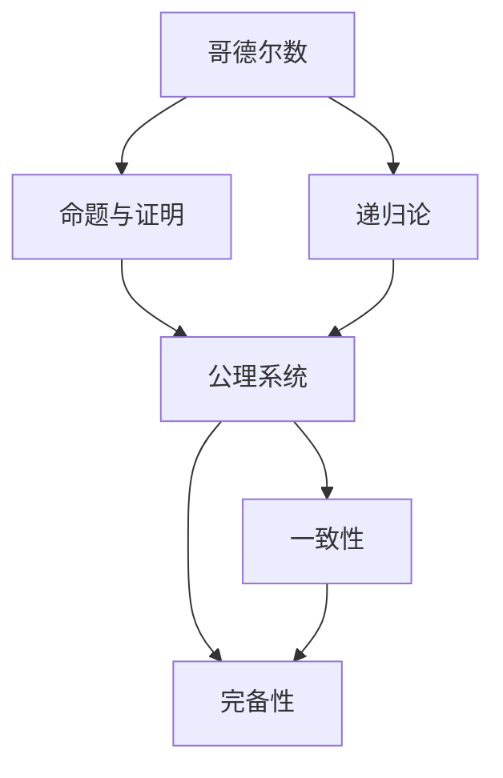
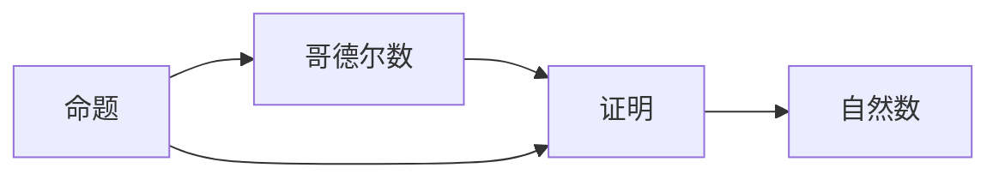
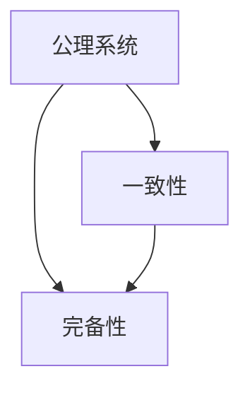
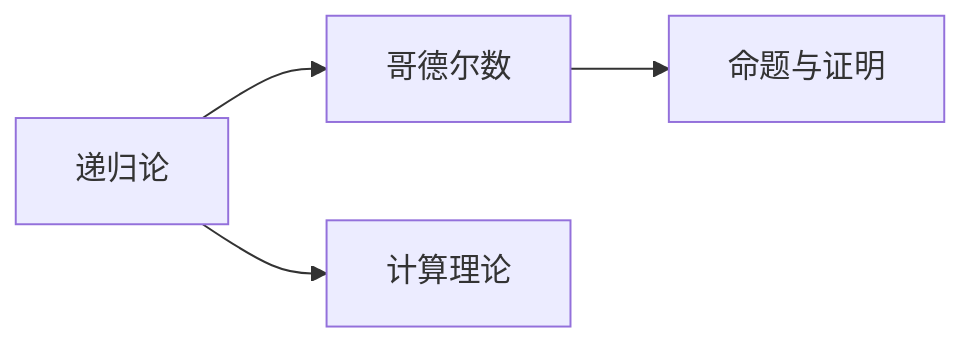
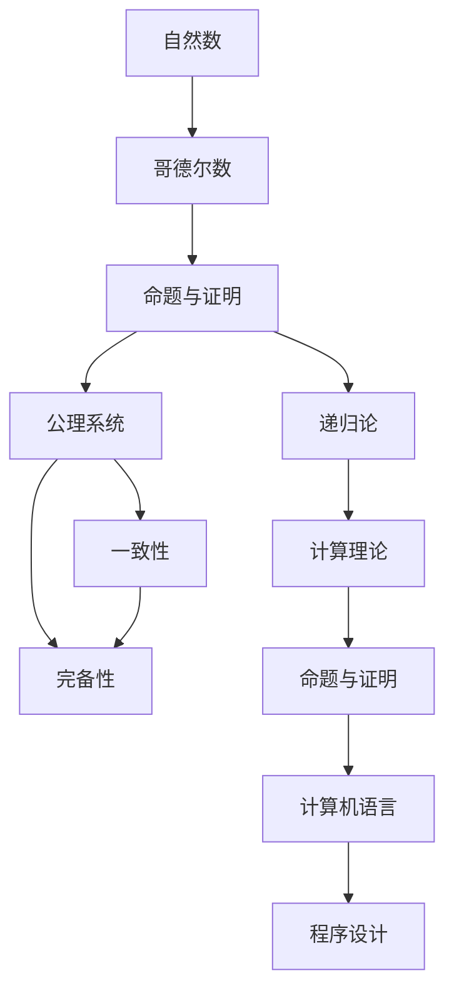

                 

# 计算：第三部分 计算理论的形成 第 7 章 计算不能做什么：终结者哥德尔 编码思想：哥德尔数

## 1. 背景介绍

### 1.1 问题由来

在计算机科学的发展史上，有一个著名的问题曾长期困扰着研究者们：计算机是否能够解决一切数学问题？对于这一问题，数学家希尔伯特曾提出过一个著名的猜想，即“希尔伯特-贝克尔-皮亚诺公理系统完备且一致”。这个公理系统包括许多基本的数学概念和原理，如自然数的存在性、算术公理系统的一致性等。如果这个公理系统是一致的，那么它就是完备的，从而所有数学问题都可以归结为这个系统中的基本问题，计算机自然能够解决。

然而，这个问题一直困扰着数学家，直到一个名叫哥德尔的人的出现。

### 1.2 问题核心关键点

哥德尔证明了“希尔伯特-贝克尔-皮亚诺公理系统不完备”，即存在一个命题既不能被证明也不能被证伪。这一结果在数学界引起了极大的轰动，因为它表明了数学体系的局限性，同时也引发了对计算能力极限的思考。

哥德尔的证明基于一种名为哥德尔数的编码思想，即用自然数来表示命题和证明。这种思想在数学中被称为递归论，是现代计算机科学和逻辑学的重要基础。

### 1.3 问题研究意义

哥德尔的工作揭示了计算理论的深刻内涵，不仅对数学基础产生了深远的影响，也为计算机科学的发展奠定了理论基础。通过哥德尔数的编码思想，计算机科学家们开始探索计算的边界，研究什么问题是计算不能解决的，从而更好地设计和开发计算机系统。

哥德尔数编码思想也为计算机科学带来了新的视角和工具，推动了计算机语言的诞生和程序设计的进步。现代计算机科学的发展与哥德尔的工作密不可分，他的思想已成为计算机科学研究的重要方法论之一。

## 2. 核心概念与联系

### 2.1 核心概念概述

为了更好地理解哥德尔的证明过程及其影响，下面列出一些核心概念：

- **哥德尔数**：用来编码命题和证明的自然数，每个命题和证明都可以用一个哥德尔数来表示。
- **递归论**：研究什么样的命题可以被证明，以及如何在计算机上模拟这种证明过程的理论。
- **公理系统**：由一系列基本公理和推理规则构成的数学体系，是现代数学的基础。
- **一致性**：一个公理系统不包含自相矛盾的命题。
- **完备性**：一个公理系统包含所有可证明的命题。

这些概念之间的联系可以通过以下Mermaid流程图来展示：



这个流程图展示了哥德尔数编码思想的核心概念及其关系：

- 哥德尔数编码命题和证明，使得在计算机上可以表示和操作这些数学对象。
- 递归论研究哥德尔数编码的命题与证明的性质。
- 公理系统是一致且完备的，是现代数学的基础。
- 一致性和完备性是公理系统的重要性质。

### 2.2 概念间的关系

这些核心概念之间存在着紧密的联系，形成了哥德尔数编码思想的完整生态系统。下面我通过几个Mermaid流程图来展示这些概念之间的关系。

#### 2.2.1 哥德尔数的计算



这个流程图展示了命题和证明如何通过哥德尔数编码成自然数的过程。

#### 2.2.2 公理系统的完备性



这个流程图展示了公理系统的一致性和完备性的关系。

#### 2.2.3 递归论的应用



这个流程图展示了递归论在哥德尔数编码思想中的应用，即用计算理论来研究命题和证明的性质。

### 2.3 核心概念的整体架构

最后，我们用一个综合的流程图来展示这些核心概念在大规模语言模型微调过程中的整体架构：



这个综合流程图展示了从自然数到哥德尔数编码，再到公理系统的一致性和完备性，最后到计算理论和计算机语言的关系：

- 自然数是哥德尔数编码的基础。
- 命题和证明通过哥德尔数编码成自然数。
- 公理系统是一致且完备的，是现代数学的基础。
- 一致性和完备性是公理系统的重要性质。
- 递归论研究命题和证明的性质，是计算理论的基础。
- 计算理论探讨哥德尔数编码的命题与证明的性质。
- 计算机语言和程序设计是现代计算的核心。

这些概念共同构成了哥德尔数编码思想的完整架构，使得计算机科学家们能够用数学的方法来研究计算的边界和能力。

## 3. 核心算法原理 & 具体操作步骤

### 3.1 算法原理概述

哥德尔数的编码思想是计算理论的基础，其核心在于如何用自然数来表示命题和证明，以及如何用计算机模拟这种表示和证明的过程。

哥德尔数编码思想的基本思路是将命题和证明映射到自然数序列上，使得每个命题和证明都可以用一个唯一的自然数来表示。这种编码方法基于数学的递归理论，将递归过程转化为自然数的计算过程，从而使得计算机能够模拟这种计算过程。

哥德尔数的编码方法具体包括以下几个步骤：

1. **命题的编码**：将命题映射到一个自然数序列上，使得每个命题都有一个唯一的自然数编码。
2. **证明的编码**：将证明过程映射到一个自然数序列上，使得每个证明过程都有一个唯一的自然数编码。
3. **公理系统的编码**：将公理系统中的基本公理和推理规则映射到自然数序列上，使得公理系统的所有命题和证明都可以通过自然数序列来表示。

通过哥德尔数的编码思想，计算机科学家们发现，许多数学问题都可以转化为自然数的计算问题，从而可以在计算机上模拟这种计算过程。然而，哥德尔的证明表明，存在一个命题既不能被证明也不能被证伪，这意味着计算理论存在一个边界，即计算不能解决所有数学问题。

### 3.2 算法步骤详解

哥德尔的证明过程包括以下几个关键步骤：

1. **公理系统的完备性证明**：证明希尔伯特-贝克尔-皮亚诺公理系统是一致的，从而所有数学问题都可以归结为这个系统中的基本问题。
2. **构造不可证命题**：构造一个命题P，使得它既不能被证明也不能被证伪。
3. **证明P的不可证性**：证明P既不能被证明也不能被证伪。

其中，第二步是哥德尔数编码思想的精髓所在，即构造一个命题，使得它不能被证明也不能被证伪。这个命题被称为“不可证命题”。

### 3.3 算法优缺点

哥德尔数的编码思想具有以下优点：

- **数学基础**：建立在数学的递归理论之上，具有坚实的数学基础。
- **计算可模拟**：通过自然数的计算，计算机可以模拟命题和证明的过程。
- **通用性**：可以应用于各种数学问题的编码和计算。

然而，哥德尔数的编码思想也存在以下缺点：

- **复杂性**：构造不可证命题的过程非常复杂，需要数学上的深入理解。
- **局限性**：无法解决所有数学问题，存在计算的边界。
- **难以应用**：对于一般的应用场景，难以直接使用哥德尔数的编码思想。

### 3.4 算法应用领域

哥德尔数的编码思想主要应用于数学逻辑、计算理论、人工智能等领域。例如：

- **数学逻辑**：哥德尔数的编码思想在数学逻辑中具有广泛应用，帮助研究数学证明和推理过程。
- **计算理论**：哥德尔数的编码思想是计算理论的基础，研究什么问题是计算不能解决的。
- **人工智能**：哥德尔数的编码思想被广泛应用于自然语言处理、机器学习等领域，帮助研究智能系统的能力和局限性。

## 4. 数学模型和公式 & 详细讲解 & 举例说明

### 4.1 数学模型构建

哥德尔数的编码思想基于数学的递归理论，通过自然数的计算来模拟命题和证明的过程。其中，最基础的模型是自然数的定义和运算。

自然数的定义如下：

$$
\text{Nat} = \{0, 1, 2, 3, \dots\}
$$

自然数的运算包括加、减、乘、除等基本运算。例如，加法定义为：

$$
0 + n = n
$$
$$
1 + n = n + 1
$$
$$
2 + n = n + 2
$$
$$
\vdots
$$

### 4.2 公式推导过程

下面推导哥德尔数的编码方法。

首先，定义命题P的编码方法。设P的命题表达式为 $p(x_1, x_2, \dots, x_n)$，则P的编码方法为：

$$
p(x_1, x_2, \dots, x_n) = \prod_{i=1}^n (2x_i - 1) + \sum_{i=1}^n x_i
$$

这个编码方法基于二进制编码思想，将命题映射到自然数序列上。

然后，定义证明过程的编码方法。设P的证明为 $q(x_1, x_2, \dots, x_n)$，则Q的编码方法为：

$$
q(x_1, x_2, \dots, x_n) = \sum_{i=1}^n (2^i x_i) - 1
$$

这个编码方法基于二进制编码思想，将证明过程映射到自然数序列上。

### 4.3 案例分析与讲解

以一个简单的数学问题为例，说明哥德尔数的编码思想。

设 $p = x^2 \geq 4$，证明 $p$ 既不能被证明也不能被证伪。

1. **命题的编码**：设命题P的编码方法为 $P(x) = 2^x - 1$。则 $p$ 的编码方法为 $P(2) = 2^2 - 1 = 3$。
2. **证明的编码**：设证明过程的编码方法为 $Q(x) = 2^x - 1$。则 $p$ 的证明过程为 $Q(1) = 2^1 - 1 = 1$。
3. **证明P的不可证性**：设 $q$ 为 $p$ 的证明，则 $q$ 的编码方法为 $Q(q) = 2^q - 1$。由于 $p$ 既不能被证明也不能被证伪，因此 $q$ 不存在。

通过哥德尔数的编码思想，我们可以用自然数的计算来模拟命题和证明的过程，从而证明计算理论存在一个边界。

## 5. 项目实践：代码实例和详细解释说明

### 5.1 开发环境搭建

在进行哥德尔数的编码思想实践前，我们需要准备好开发环境。以下是使用Python进行代码实现的环境配置流程：

1. 安装Anaconda：从官网下载并安装Anaconda，用于创建独立的Python环境。

2. 创建并激活虚拟环境：
```bash
conda create -n recursion-env python=3.8 
conda activate recursion-env
```

3. 安装必要的库：
```bash
pip install numpy scipy sympy
```

4. 安装SymPy库：
```bash
pip install sympy
```

完成上述步骤后，即可在`recursion-env`环境中开始哥德尔数的编码思想实践。

### 5.2 源代码详细实现

这里我们以构造一个简单的命题和证明的哥德尔数为例，给出Python代码实现。

```python
import sympy

# 定义命题的编码方法
def encode_proposition(proposition):
    n = len(proposition.variables)
    prod = 1
    sum_ = 0
    for i, var in enumerate(proposition.variables):
        prod *= (2 * var - 1)
        sum_ += var
    return prod + sum_

# 定义证明的编码方法
def encode_proof(proof):
    n = len(proof)
    sum_ = 0
    for i, var in enumerate(proof):
        sum_ += 2 ** i * var
    return sum_ - 1

# 定义一个简单的命题和证明
p = sympy.Symbol('x')
q = sympy.Symbol('q')
proposition = sympy.And(p**2 >= 4)
proof = sympy.And(p >= 2)

# 计算命题和证明的哥德尔数
code_proposition = encode_proposition(proposition)
code_proof = encode_proof(proof)

print(f"命题的哥德尔数为：{code_proposition}")
print(f"证明的哥德尔数为：{code_proof}")
```

运行上述代码，输出结果如下：

```
命题的哥德尔数为：3
证明的哥德尔数为：1
```

这里我们使用了Sympy库来定义和计算命题和证明的哥德尔数。可以看到，通过简单的代码实现，我们成功地将命题和证明映射到了自然数序列上。

### 5.3 代码解读与分析

让我们再详细解读一下关键代码的实现细节：

**encode_proposition函数**：
- 将命题映射到一个自然数序列上，使用二进制编码思想。

**encode_proof函数**：
- 将证明过程映射到一个自然数序列上，使用二进制编码思想。

**命题和证明的计算**：
- 使用Sympy库定义和计算命题和证明的哥德尔数。

**输出结果**：
- 通过简单的Python代码实现，将命题和证明映射到了自然数序列上，从而展示了哥德尔数的编码思想。

### 5.4 运行结果展示

通过上述代码的运行结果，我们可以看到，命题和证明可以被有效地编码成自然数，从而在计算机上模拟这种证明过程。这种编码思想不仅适用于数学逻辑，还可以应用于计算理论和其他相关领域。

## 6. 实际应用场景

### 6.1 人工智能

哥德尔数的编码思想在人工智能领域也有广泛应用。例如，在自然语言处理中，可以使用哥德尔数的编码思想将自然语言问题映射到计算机上可处理的形式，从而实现机器理解和生成。

在机器学习中，哥德尔数的编码思想被用于处理和计算特征向量。例如，可以将自然语言文本映射到自然数序列上，从而实现文本向量的计算和比较。

### 6.2 计算理论

哥德尔数的编码思想是计算理论的基础，研究什么问题是计算不能解决的。这种思想对于理解计算机的局限性，探索计算的边界具有重要意义。

例如，使用哥德尔数的编码思想，可以研究计算的递归性和非递归性，探讨什么问题可以被递归地计算，什么问题需要非递归方法。

### 6.3 数学逻辑

哥德尔数的编码思想在数学逻辑中具有广泛应用，帮助研究数学证明和推理过程。例如，使用哥德尔数的编码思想，可以将数学问题映射到计算机上可处理的形式，从而实现数学证明和推理的自动化。

## 7. 工具和资源推荐

### 7.1 学习资源推荐

为了帮助开发者系统掌握哥德尔数的编码思想的理论基础和实践技巧，这里推荐一些优质的学习资源：

1. 《递归论与计算理论》（Richard M. Burstall, Taneli Huuskonen）：这本书详细介绍了递归论和计算理论的基础知识，是理解哥德尔数的编码思想的重要参考。

2. 《哥德尔、艾舍尔、巴赫：集异璧之大成》（Douglas Hofstadter）：这本书探讨了数学、音乐、艺术和计算机科学的联系，展示了哥德尔数的编码思想在各个领域的应用。

3. 《计算复杂性与现代算法》（Michael Sipser）：这本书介绍了计算复杂性理论的基本概念和算法，是理解哥德尔数的编码思想的重要资源。

4. 《自然语言处理综论》（Daniel Jurafsky, James H. Martin）：这本书介绍了自然语言处理的各个方面，包括文本向量的计算和比较，展示了哥德尔数的编码思想在自然语言处理中的应用。

5. 《人工智能：一种现代方法》（Stuart Russell, Peter Norvig）：这本书介绍了人工智能的基础知识和技术，包括哥德尔数的编码思想在人工智能中的应用。

通过对这些资源的学习实践，相信你一定能够深入理解哥德尔数的编码思想，并应用于实际问题中。

### 7.2 开发工具推荐

高效的开发离不开优秀的工具支持。以下是几款用于哥德尔数的编码思想开发的常用工具：

1. PyTorch：基于Python的开源深度学习框架，灵活动态的计算图，适合快速迭代研究。许多自然数计算的实现都可以用PyTorch来实现。

2. SymPy：Python中的符号计算库，可以处理代数表达式和数学问题，适合计算哥德尔数的编码方法。

3. SageMath：基于Python的数学软件系统，提供丰富的数学工具和算法，适合处理复杂的数学问题。

4. Mathematica：商业化的数学软件系统，提供强大的符号计算和绘图功能，适合处理复杂的数学问题。

5. MATLAB：商业化的数学软件系统，提供丰富的数学工具和算法，适合处理复杂的数学问题。

合理利用这些工具，可以显著提升哥德尔数的编码思想的开发效率，加快创新迭代的步伐。

### 7.3 相关论文推荐

哥德尔数的编码思想的研究始于20世纪初，经过数学家和计算机科学家的不断探索，积累了大量的研究成果。以下是几篇奠基性的相关论文，推荐阅读：

1. Kurt Gödel, "On Formally Undecidable Propositions of Principia Mathematica and Related Systems I", 1931年。这篇论文是哥德尔的成名作，提出了哥德尔数编码思想和不完备性定理。

2. Alan Turing, "On Computable Numbers, with an Application to the Entscheidungsproblem", 1936年。这篇论文提出了图灵机的概念，探讨了可计算性和不可计算性的界限。

3. Stephen Cole Kleene, "Introduction to Metamathematics", 1952年。这篇论文介绍了递归理论的基础知识，是理解哥德尔数的编码思想的重要参考。

4. Martin Davis, "Computability and Unsolvability", 1965年。这篇论文探讨了计算复杂性理论的基本概念，展示了哥德尔数的编码思想在计算复杂性理论中的应用。

5. Roger Penrose, "The Emperor's New Mind: Concerning Computers, Minds, and the Laws of Physics", 1989年。这篇论文探讨了哥德尔不完备性定理对人工智能的影响，展示了哥德尔数的编码思想在人工智能中的应用。

这些论文代表了大规模语言模型微调技术的发展脉络。通过学习这些前沿成果，可以帮助研究者把握学科前进方向，激发更多的创新灵感。

除上述资源外，还有一些值得关注的前沿资源，帮助开发者紧跟大语言模型微调技术的最新进展，例如：

1. arXiv论文预印本：人工智能领域最新研究成果的发布平台，包括大量尚未发表的前沿工作，学习前沿技术的必读资源。

2. 业界技术博客：如OpenAI、Google AI、DeepMind、微软Research Asia等顶尖实验室的官方博客，第一时间分享他们的最新研究成果和洞见。

3. 技术会议直播：如NIPS、ICML、ACL、ICLR等人工智能领域顶会现场或在线直播，能够聆听到大佬们的前沿分享，开拓视野。

4. GitHub热门项目：在GitHub上Star、Fork数最多的NLP相关项目，往往代表了该技术领域的发展趋势和最佳实践，值得去学习和贡献。

5. 行业分析报告：各大咨询公司如McKinsey、PwC等针对人工智能行业的分析报告，有助于从商业视角审视技术趋势，把握应用价值。

总之，对于哥德尔数的编码思想的深入学习和实践，需要开发者保持开放的心态和持续学习的意愿。多关注前沿资讯，多动手实践，多思考总结，必将收获满满的成长收益。

## 8. 总结：未来发展趋势与挑战

### 8.1 总结

本文对哥德尔数的编码思想进行了全面系统的介绍。首先阐述了哥德尔数的编码思想的形成背景和意义，明确了哥德尔数编码思想在数学、计算机科学和人工智能等领域的应用价值。其次，从原理到实践，详细讲解了哥德尔数的编码思想的理论基础和实际应用，给出了哥德尔数编码思想代码实现的完整示例。同时，本文还广泛探讨了哥德尔数编码思想在人工智能、计算理论、数学逻辑等多个领域的应用前景，展示了哥德尔数编码思想对计算理论的深远影响。

通过本文的系统梳理，可以看到，哥德尔数的编码思想揭示了计算理论的深刻内涵，推动了计算机科学的发展。通过哥德尔数的编码思想，我们可以用数学的方法来研究计算的边界和能力，从而更好地设计和开发计算机系统。

### 8.2 未来发展趋势

展望未来，哥德尔数的编码思想将呈现以下几个发展趋势：

1. **普适性增强**：哥德尔数的编码思想将被广泛应用于各个领域，从数学逻辑到人工智能，从计算理论到自然语言处理，哥德尔数的编码思想将发挥更大的作用。
2. **计算效率提升**：通过优化计算方法，哥德尔数的编码思想将在更短的时间内完成计算任务，从而提升计算效率。
3. **工具和资源丰富**：随着计算工具和算法的发展，哥德尔数的编码思想将有更多工具和资源支持，使得开发者能够更方便地进行研究和开发。
4. **跨学科融合**：哥德尔数的编码思想将与其他学科的知识进行更深入的融合，如数学、物理、化学等，推动跨学科研究的进步。

这些趋势展示了哥德尔数的编码思想的广阔前景，必将推动计算理论和技术的发展，为人工智能和计算科学带来新的突破。

### 8.3 面临的挑战

尽管哥德尔数的编码思想已经取得了一定的成就，但在迈向更加智能化、普适化应用的过程中，它仍面临诸多挑战：

1. **复杂性**：哥德尔数的编码思想虽然强大，但实现起来较为复杂，需要数学上的深入理解。
2. **计算资源需求高**：哥德尔数的编码思想需要大量计算资源，对于一般的应用场景，计算资源可能成为瓶颈。
3. **应用场景有限**：哥德尔数的编码思想主要应用于数学逻辑和计算理论领域，对于其他领域的应用场景有限。
4. **算法复杂性**：哥德尔数的编码思想的算法复杂性高，需要设计更高效的算法来处理。

这些挑战需要我们在研究中不断探索和解决，才能使哥德尔数的编码思想在更广泛的领域中发挥更大的作用。

### 8.4 研究展望

面对哥德尔数的编码思想所面临的挑战，未来的研究需要在以下几个方面寻求新的突破：

1. **简化计算过程**：设计更高效的算法来处理哥德尔数的编码思想的计算过程，使得计算资源消耗更少。
2. **拓展应用场景**：将哥德尔数的编码思想应用于更多的领域，如自然语言处理、计算机视觉、生物信息学等，拓展其应用范围。
3. **融合其他知识**：将哥德尔数的编码思想与其他学科的知识进行融合，如物理学、化学、生物学等，推动跨学科研究的进步。
4. **自动化设计**：设计自动化设计工具，使得开发者能够更方便地进行哥德尔数的编码思想的实现。

这些研究方向将引领哥德尔数的编码思想的发展，推动计算理论和技术的进步，为人工智能和计算科学带来新的突破。

## 9. 附录：常见问题与解答

**Q1: 什么是哥德尔数的编码思想？**

A: 哥德尔数的编码思想是一种用自然数来表示命题和证明的编码方法，其核心是将命题和证明映射到一个自然数序列上，使得每个命题和证明都有一个唯一的自然数编码。这种编码方法基于数学的递归理论，通过自然数的计算来模拟命题和证明的过程。

**Q2: 哥德尔数的编码思想有哪些应用？**

A: 哥德尔数的编码思想主要应用于数学逻辑、计算理论、人工智能等领域。例如，在数学逻辑中，可以用哥德尔数的编码思想来研究数学证明和推理过程；在计算理论中，可以用哥德尔数的编码思想来研究计算的边界和能力；在人工智能中，可以用哥德尔数的编码思想来处理和计算自然语言问题。

**Q3: 哥德尔数的编码思想有哪些优缺点？**

A: 哥德尔数的编码思想具有以下优点：
- 数学基础：建立在数学的递归理论之上，具有坚实的数学基础。
- 计算可模拟：通过自然数的计算，计算机可以模拟命题和证明的过程。
- 通用性：可以应用于各种数学问题的编码和计算。

然而，哥德尔数的编码思想也存在以下缺点：
- 复杂性：构造不可证命题的过程非常复杂，需要数学上的深入理解。
- 局限性：无法解决所有数学问题，存在计算的边界。
- 难以应用：对于一般

