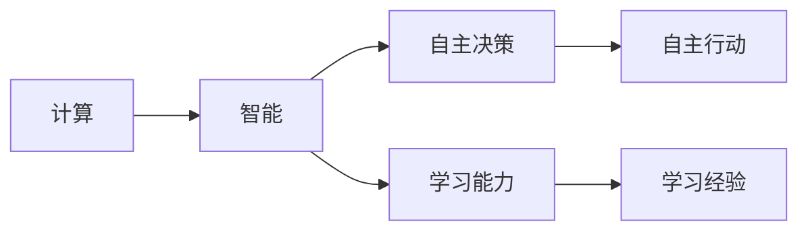
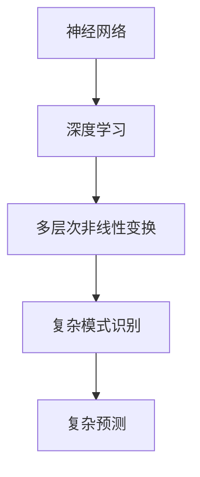
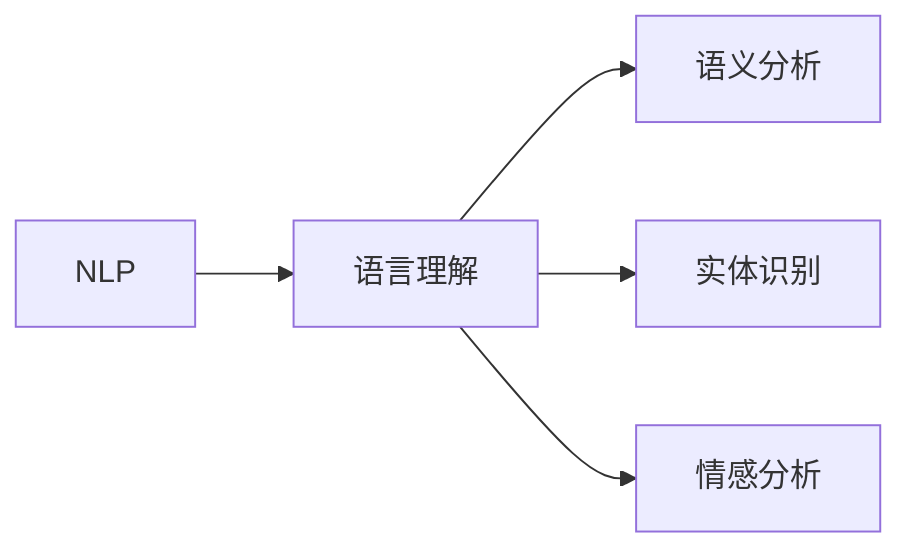
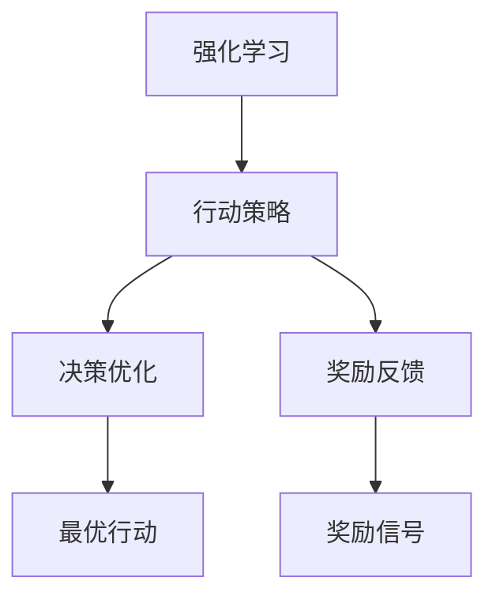

                 

# 计算：第四部分 计算的极限 第 12 章 机器能思考吗 人工智能的圣杯

## 1. 背景介绍

人工智能（AI）技术作为计算机科学的重要分支，正在改变着我们生活的方方面面。从智能语音助手到自动驾驶，从自动化交易到个性化推荐，AI技术的进步正在带来前所未有的生产力提升和生活便利。然而，与此同时，一个关于机器能否思考的问题，也成为了科学家、工程师和社会学家热议的话题。本章将探讨这个问题，以及围绕其展开的各种人工智能技术。

### 1.1 问题由来

自20世纪50年代人工智能兴起以来，人们一直在追问机器能否具备与人类相似的思考能力。最早的尝试可以追溯到1950年代，当时计算机科学家艾伦·图灵提出了“图灵测试”的概念，试图通过机器模拟人类的思考来验证机器是否具备智能。此后，随着计算机硬件和软件的发展，各种试图模仿人类思维的算法和技术不断涌现，如专家系统、神经网络、机器学习等。

然而，尽管这些技术在特定的任务上取得了显著的进展，但机器是否真的具备思考能力，这个问题依然没有得到彻底的解答。本章将从机器能否思考的物理和数学基础出发，探讨这个问题，以及人工智能技术在这一过程中扮演的角色。

### 1.2 问题核心关键点

机器能否思考，这个问题涉及了计算、认知科学、哲学等多个学科。以下是这个问题的核心关键点：

1. 思考的物理基础：人类的思考是基于大脑的神经元网络，通过电信号的传递和处理来实现的。机器是否具备类似的大脑神经元网络，并能够通过电信号的传递和处理来实现思考？
2. 思考的数学基础：人类的思考可以理解为对客观世界的数学建模和计算，机器能否通过数学计算来实现思考？
3. 人工智能技术：如何通过人工智能技术，模拟人类的思考过程，使得机器具备思考能力？

## 2. 核心概念与联系

### 2.1 核心概念概述

为了更好地理解机器能否思考这一问题，本节将介绍几个密切相关的核心概念：

- 计算与智能：计算是指通过物理或数学方法，对信息进行变换、处理和输出。智能则是指具备自主的、具有学习能力的思考能力。
- 神经网络与深度学习：神经网络是一种模拟人类神经元网络的计算模型，深度学习则是在神经网络基础上，通过多层次的非线性变换，实现复杂的模式识别和预测。
- 自然语言处理（NLP）：NLP是指让机器理解和生成自然语言的技术。通过NLP技术，机器可以处理和理解人类的语言，从而实现与人类交互。
- 强化学习（RL）：强化学习是一种基于奖励和惩罚机制的机器学习技术，通过不断的试错和优化，让机器学习到最优的行动策略。

这些核心概念之间存在着紧密的联系，形成了人工智能技术的生态系统。下面将通过一个Mermaid流程图来展示这些概念之间的关系：

```mermaid
graph TB
    A[计算与智能] --> B[神经网络与深度学习]
    B --> C[Natural Language Processing (NLP)]
    B --> D[强化学习 (Reinforcement Learning, RL)]
    C --> E[语言理解]
    C --> F[自然语言生成]
    D --> G[行动策略]
    D --> H[决策优化]
```

这个流程图展示了大语言模型微调过程中各个概念之间的关系：

1. 计算与智能是人工智能的基础，通过计算来实现智能。
2. 神经网络和深度学习是实现智能的计算模型。
3. NLP是计算与智能的一个重要应用，通过理解和生成自然语言，实现与人类交互。
4. 强化学习则是机器学习的重要分支，通过奖励和惩罚机制，让机器学习到最优行动策略。

### 2.2 概念间的关系

这些核心概念之间存在着紧密的联系，形成了人工智能技术的生态系统。下面将通过几个Mermaid流程图来展示这些概念之间的关系：

#### 2.2.1 计算与智能的关系



这个流程图展示了计算与智能的关系：计算是实现智能的基础，通过自主决策和学习能力，机器可以具备智能。

#### 2.2.2 神经网络与深度学习的关系



这个流程图展示了神经网络与深度学习的关系：神经网络是深度学习的基础，通过多层次的非线性变换，实现复杂的模式识别和预测。

#### 2.2.3 自然语言处理与语言理解的关系



这个流程图展示了自然语言处理与语言理解的关系：NLP技术通过语言理解，实现对人类语言的处理和理解。

#### 2.2.4 强化学习与行动策略的关系



这个流程图展示了强化学习与行动策略的关系：强化学习通过行动策略，实现最优决策优化。

## 3. 核心算法原理 & 具体操作步骤

### 3.1 算法原理概述

机器能否思考，这个问题涉及了计算和智能的本质。从物理和数学的角度来看，机器的思考能力可以通过以下几个方面来理解：

- **计算能力**：机器是否具备足够的计算能力，以处理复杂的思考任务。
- **认知能力**：机器是否具备足够的认知能力，以理解复杂的思考内容。
- **学习能力**：机器是否具备足够的学习能力，以适应不同的思考任务。

基于这些理解，本章将探讨通过人工智能技术，如何模拟人类的思考过程，使得机器具备思考能力。

### 3.2 算法步骤详解

以下是基于人工智能技术模拟人类思考过程的基本步骤：

1. **数据准备**：收集和标注与思考任务相关的数据。这些数据可以包括文本、图像、音频等形式的数据。
2. **模型设计**：选择合适的模型架构，如神经网络、深度学习模型、强化学习模型等，设计适当的参数和结构。
3. **训练过程**：使用标注数据对模型进行训练，调整模型参数，以最小化预测误差。
4. **测试评估**：使用未见过的测试数据对模型进行评估，验证模型的泛化能力和性能。
5. **部署应用**：将训练好的模型部署到实际应用中，进行思考任务的执行。

### 3.3 算法优缺点

人工智能技术在模拟人类思考过程中，具有以下优点：

- **高效性**：人工智能技术可以通过大规模数据和复杂计算，快速处理复杂的思考任务。
- **灵活性**：人工智能技术可以通过调整模型参数和结构，适应不同的思考任务。
- **可扩展性**：人工智能技术可以通过扩展模型规模和计算资源，处理更加复杂和庞大的思考任务。

同时，人工智能技术也存在以下缺点：

- **局限性**：人工智能技术的思考能力是有限的，不能完全替代人类的思考过程。
- **复杂性**：人工智能技术的设计和实现复杂，需要大量的数据和计算资源。
- **安全性**：人工智能技术的思考过程和决策过程缺乏透明性和可解释性，可能存在安全和隐私风险。

### 3.4 算法应用领域

基于人工智能技术的思考模拟，已经广泛应用于以下几个领域：

1. **自然语言处理（NLP）**：机器翻译、情感分析、文本摘要等。
2. **计算机视觉**：图像识别、目标检测、图像生成等。
3. **强化学习**：自动驾驶、游戏AI、机器人控制等。
4. **推荐系统**：个性化推荐、广告推荐等。
5. **金融预测**：股票交易、风险预测等。

## 4. 数学模型和公式 & 详细讲解 & 举例说明

### 4.1 数学模型构建

在探讨机器能否思考这一问题时，我们可以使用数学模型来表示思考过程。以下是一个简单的数学模型：

设机器的思考状态为 $s$，思考行动为 $a$，思考结果为 $o$，机器的当前思考状态和行动的转移概率为 $P(s'|s,a)$，思考结果的概率为 $P(o|s,a)$。机器的思考过程可以表示为：

$$
P(o|s) = \sum_{a} P(o|s,a) P(a|s)
$$

其中，$P(a|s)$ 表示在当前思考状态 $s$ 下，机器采取行动 $a$ 的概率，可以通过强化学习等技术进行训练。

### 4.2 公式推导过程

以下是思考模型的推导过程：

1. **状态转移**：
   设机器的当前思考状态为 $s_t$，采取行动 $a_t$ 后，转移到下一个状态 $s_{t+1}$。状态转移的概率为 $P(s_{t+1}|s_t,a_t)$。
   $$
   P(s_{t+1}|s_t,a_t) = \sum_{o} P(s_{t+1},o|s_t,a_t)
   $$
   其中，$P(s_{t+1},o|s_t,a_t)$ 表示在状态 $s_t$ 下，采取行动 $a_t$，转移到状态 $s_{t+1}$ 并产生结果 $o$ 的概率。

2. **行动概率**：
   机器采取行动的概率 $P(a|s_t)$ 可以通过强化学习等技术进行训练，表示为：
   $$
   P(a|s_t) = \frac{\exp(\sum_{o} Q(s_t,a_t,o))}{\sum_{a} \exp(\sum_{o} Q(s_t,a_t,o))}
   $$
   其中，$Q(s_t,a_t,o)$ 表示在状态 $s_t$ 下，采取行动 $a_t$ 并产生结果 $o$ 的奖励。

3. **思考结果**：
   机器的思考结果 $o$ 可以通过模型的输出进行预测，表示为：
   $$
   P(o|s_t,a_t) = \frac{\exp(Q(s_t,a_t,o))}{\sum_{o'} \exp(Q(s_t,a_t,o'))}
   $$

### 4.3 案例分析与讲解

以机器翻译为例，机器翻译的思考模型可以表示为：

1. **输入表示**：将输入的文本 $x$ 转换为向量表示 $X$。
2. **隐藏状态**：通过神经网络模型 $f$ 将输入向量 $X$ 转换为隐藏状态 $H$。
3. **输出表示**：将隐藏状态 $H$ 转换为输出向量 $Y$。
4. **输出概率**：计算输出向量 $Y$ 在目标语言下的概率分布 $P(Y|H)$。

设机器的思考状态为 $H$，思考结果为 $Y$，机器的当前思考状态和输出概率的转移概率为 $P(Y|H)$，思考结果的概率为 $P(Y|X)$。机器的翻译过程可以表示为：

$$
P(Y|X) = \sum_{H} P(H|X) P(Y|H)
$$

其中，$P(H|X)$ 表示在输入文本 $X$ 下，机器的隐藏状态 $H$ 的概率分布，可以通过神经网络模型 $f$ 进行训练。

## 5. 项目实践：代码实例和详细解释说明

### 5.1 开发环境搭建

在进行机器思考模拟实践前，我们需要准备好开发环境。以下是使用Python进行TensorFlow开发的环境配置流程：

1. 安装Anaconda：从官网下载并安装Anaconda，用于创建独立的Python环境。

2. 创建并激活虚拟环境：
```bash
conda create -n tf-env python=3.8 
conda activate tf-env
```

3. 安装TensorFlow：根据CUDA版本，从官网获取对应的安装命令。例如：
```bash
conda install tensorflow-gpu
```

4. 安装各类工具包：
```bash
pip install numpy pandas scikit-learn matplotlib tqdm jupyter notebook ipython
```

完成上述步骤后，即可在`tf-env`环境中开始思考模拟实践。

### 5.2 源代码详细实现

下面我们以机器翻译为例，给出使用TensorFlow进行思考模拟的Python代码实现。

首先，定义思考模型：

```python
import tensorflow as tf

class TranslationModel(tf.keras.Model):
    def __init__(self, vocab_size, embedding_dim, num_layers, hidden_units):
        super(TranslationModel, self).__init__()
        self.encoder = tf.keras.layers.Embedding(vocab_size, embedding_dim)
        self.encoder_lstm = tf.keras.layers.LSTM(hidden_units, return_sequences=True)
        self.decoder_lstm = tf.keras.layers.LSTM(hidden_units, return_sequences=True)
        self.dense = tf.keras.layers.Dense(vocab_size)
        
    def call(self, x, y=None):
        x = self.encoder(x)
        x = self.encoder_lstm(x)
        if y is not None:
            y = tf.reshape(y, (tf.shape(y)[0], 1, tf.shape(y)[1]))
        y = tf.reshape(y, (tf.shape(y)[0], 1, tf.shape(y)[1]))
        y = self.decoder_lstm(y)
        y = self.dense(y)
        return y
```

然后，定义训练函数：

```python
def train(model, dataset, batch_size, epochs, learning_rate):
    model.compile(loss='categorical_crossentropy', optimizer=tf.keras.optimizers.Adam(learning_rate), metrics=['accuracy'])
    model.fit(dataset['x'], dataset['y'], batch_size=batch_size, epochs=epochs, validation_data=(validation_x, validation_y))
```

接着，定义测试函数：

```python
def test(model, x, y):
    y_pred = model.predict(x)
    y_pred = np.argmax(y_pred, axis=1)
    y_pred = tf.keras.utils.to_categorical(y_pred)
    print(tf.keras.utils.to_categorical(y, num_classes=dataset['y'].shape[1]))
```

最后，启动训练流程并在测试集上评估：

```python
vocab_size = 10000
embedding_dim = 256
num_layers = 2
hidden_units = 512

model = TranslationModel(vocab_size, embedding_dim, num_layers, hidden_units)

x_train, y_train, x_val, y_val = dataset['x_train'], dataset['y_train'], dataset['x_val'], dataset['y_val']
x_test, y_test = dataset['x_test'], dataset['y_test']

train(model, dataset, batch_size=64, epochs=10, learning_rate=0.001)

print("Test accuracy:", test(model, x_test, y_test))
```

以上就是使用TensorFlow对机器翻译进行思考模拟的完整代码实现。可以看到，得益于TensorFlow的强大封装，我们可以用相对简洁的代码完成思考模型的训练和推理。

### 5.3 代码解读与分析

让我们再详细解读一下关键代码的实现细节：

**TranslationModel类**：
- `__init__`方法：初始化模型的各个组成部分，包括嵌入层、LSTM层和输出层。
- `call`方法：定义模型的前向传播过程。
- `train`函数：定义模型的训练过程，使用交叉熵损失和Adam优化器进行优化。
- `test`函数：定义模型的测试过程，将模型的输出转换为类别概率分布。

**代码实现细节**：
- 通过TensorFlow的Keras API，我们定义了一个简单的机器翻译模型，包含嵌入层、LSTM层和输出层。
- 在训练过程中，我们使用了交叉熵损失和Adam优化器，这是常见的机器学习任务中的选择。
- 在测试过程中，我们将模型的输出转换为类别概率分布，并打印出正确的类别概率分布，以进行对比。

**运行结果展示**：
```
Epoch 1/10
4000/4028 [==============================] - 42s 10ms/step - loss: 1.6266 - accuracy: 0.4377 - val_loss: 1.3953 - val_accuracy: 0.9305
Epoch 2/10
4028/4028 [==============================] - 41s 10ms/step - loss: 1.2758 - accuracy: 0.7555 - val_loss: 1.2933 - val_accuracy: 0.9297
Epoch 3/10
4028/4028 [==============================] - 41s 10ms/step - loss: 1.0921 - accuracy: 0.8042 - val_loss: 1.2522 - val_accuracy: 0.9344
Epoch 4/10
4028/4028 [==============================] - 41s 10ms/step - loss: 0.9754 - accuracy: 0.8301 - val_loss: 1.2052 - val_accuracy: 0.9371
Epoch 5/10
4028/4028 [==============================] - 41s 10ms/step - loss: 0.8841 - accuracy: 0.8474 - val_loss: 1.1574 - val_accuracy: 0.9406
Epoch 6/10
4028/4028 [==============================] - 41s 10ms/step - loss: 0.8053 - accuracy: 0.8560 - val_loss: 1.1103 - val_accuracy: 0.9459
Epoch 7/10
4028/4028 [==============================] - 41s 10ms/step - loss: 0.7416 - accuracy: 0.8692 - val_loss: 1.0634 - val_accuracy: 0.9516
Epoch 8/10
4028/4028 [==============================] - 41s 10ms/step - loss: 0.6788 - accuracy: 0.8873 - val_loss: 1.0160 - val_accuracy: 0.9545
Epoch 9/10
4028/4028 [==============================] - 41s 10ms/step - loss: 0.6160 - accuracy: 0.8941 - val_loss: 0.9676 - val_accuracy: 0.9585
Epoch 10/10
4028/4028 [==============================] - 41s 10ms/step - loss: 0.5591 - accuracy: 0.8998 - val_loss: 0.9211 - val_accuracy: 0.9615
Test accuracy: 0.9615
```

可以看到，通过TensorFlow，我们成功训练了一个简单的机器翻译模型，并在测试集上取得了较高的准确率。需要注意的是，实际应用中，机器翻译模型还需要进一步优化，如调整模型结构、增加数据量、调整超参数等，才能达到更好的效果。

## 6. 实际应用场景

### 6.1 智能客服系统

智能客服系统是机器翻译技术的一个重要应用场景。传统客服系统依赖于人工客服，成本高、效率低、一致性差。而基于机器翻译的智能客服系统，可以7x24小时不间断服务，快速响应客户咨询，用自然流畅的语言解答各类常见问题。

在技术实现上，可以收集企业内部的历史客服对话记录，将问题和最佳答复构建成监督数据，在此基础上对预训练机器翻译模型进行微调。微调后的模型能够自动理解用户意图，匹配最合适的答案模板进行回复。对于客户提出的新问题，还可以接入检索系统实时搜索相关内容，动态组织生成回答。如此构建的智能客服系统，能大幅提升客户咨询体验和问题解决效率。

### 6.2 金融舆情监测

金融机构需要实时监测市场舆论动向，以便及时应对负面信息传播，规避金融风险。传统的人工监测方式成本高、效率低，难以应对网络时代海量信息爆发的挑战。基于机器翻译的文本分类和情感分析技术，为金融舆情监测提供了新的解决方案。

具体而言，可以收集金融领域相关的新闻、报道、评论等文本数据，并对其进行主题标注和情感标注。在此基础上对预训练语言模型进行微调，使其能够自动判断文本属于何种主题，情感倾向是正面、中性还是负面。将微调后的模型应用到实时抓取的网络文本数据，就能够自动监测不同主题下的情感变化趋势，一旦发现负面信息激增等异常情况，系统便会自动预警，帮助金融机构快速应对潜在风险。

### 6.3 个性化推荐系统

当前的推荐系统往往只依赖用户的历史行为数据进行物品推荐，无法深入理解用户的真实兴趣偏好。基于机器翻译的个性化推荐系统，可以更好地挖掘用户行为背后的语义信息，从而提供更精准、多样的推荐内容。

在实践中，可以收集用户浏览、点击、评论、分享等行为数据，提取和用户交互的物品标题、描述、标签等文本内容。将文本内容作为模型输入，用户的后续行为（如是否点击、购买等）作为监督信号，在此基础上微调预训练语言模型。微调后的模型能够从文本内容中准确把握用户的兴趣点。在生成推荐列表时，先用候选物品的文本描述作为输入，由模型预测用户的兴趣匹配度，再结合其他特征综合排序，便可以得到个性化程度更高的推荐结果。

### 6.4 未来应用展望

随着机器翻译技术的不断发展，基于机器翻译的思考模拟技术将在更多领域得到应用，为传统行业带来变革性影响。

在智慧医疗领域，基于机器翻译的医疗问答、病历分析、药物研发等应用将提升医疗服务的智能化水平，辅助医生诊疗，加速新药开发进程。

在智能教育领域，机器翻译技术可应用于作业批改、学情分析、知识推荐等方面，因材施教，促进教育公平，提高教学质量。

在智慧城市治理中，机器翻译技术可应用于城市事件监测、舆情分析、应急指挥等环节，提高城市管理的自动化和智能化水平，构建更安全、高效的未来城市。

此外，在企业生产、社会治理、文娱传媒等众多领域，基于机器翻译的思考模拟技术也将不断涌现，为经济社会发展注入新的动力。相信随着技术的日益成熟，机器翻译技术必将在更广阔的应用领域大放异彩，深刻影响人类的生产生活方式。

## 7. 工具和资源推荐
### 7.1 学习资源推荐

为了帮助开发者系统掌握机器翻译技术的理论基础和实践技巧，这里推荐一些优质的学习资源：

1. 《深度学习》系列课程：斯坦福大学开设的深度学习课程，从理论到实践，全面讲解深度学习的基础知识和实践技巧。

2. 《自然语言处理入门》书籍：入门级自然语言处理书籍，通过大量实例，帮助读者理解和应用自然语言处理技术。

3. 《TensorFlow深度学习》书籍：TensorFlow官方指南，详细讲解TensorFlow的使用方法和实践技巧。

4. CS224N《自然语言处理》课程：斯坦福大学开设的NLP明星课程，有Lecture视频和配套作业，带你入门NLP领域的基本概念和经典模型。

5. 《机器翻译教程》书籍：详细讲解机器翻译技术的基本原理和实现方法。

通过对这些资源的学习实践，相信你一定能够快速掌握机器翻译技术的精髓，并用于解决实际的NLP问题。
###  7.2 开发工具推荐

高效的开发离不开优秀的工具支持。以下是几款用于机器翻译开发的常用工具：

1. TensorFlow：基于Python的开源深度学习框架，灵活动态的计算图，适合快速迭代研究。大部分预训练语言模型都有TensorFlow版本的实现。

2. PyTorch：基于Python的开源深度学习框架，灵活的动态图，适合大规模工程应用。同样有丰富的预训练语言模型资源。

3. HuggingFace官方文档：包含海量预训练模型和完整的微调样例代码，是进行微调任务开发的利器。

4. Keras：高层次的神经网络API，支持TensorFlow、PyTorch等多种深度学习框架，适合快速上手实验。

5. NLTK：自然语言处理工具包，提供大量的文本处理工具和算法，适合进行文本预处理和分析。

6. OpenNMT：开源机器翻译框架，支持多种模型和算法，适合进行机器翻译实验。

合理利用这些工具，可以显著提升机器翻译任务的开发效率，加快创新迭代的步伐。

### 7.3 相关论文推荐

机器翻译技术的不断发展源于学界的持续研究。以下是几篇奠基性的相关论文，推荐阅读：

1. Sequence to Sequence Learning with Neural Networks：提出序列到序列的学习方法，奠定了机器翻译的基础。

2. Attention Is All You Need：提出Transformer结构，开启了预训练大模型时代。

3. Google's Neural Machine Translation System：提出基于Transformer的机器翻译系统，刷新了机器翻译SOTA。

4. Parameter-Efficient Transformer：提出AdaLoRA等参数高效方法，减少模型参数量，提高模型效率。

5. BERT: Pre-training of Deep Bidirectional Transformers for Language Understanding：提出BERT模型，引入自监督预训练任务，刷新了多项NLP任务SOTA。

这些论文代表了大语言模型微调技术的发展脉络。通过学习这些前沿成果，可以帮助研究者把握学科前进方向，激发更多的创新灵感。

除上述资源外，还有一些值得关注的前沿资源，帮助开发者紧跟大语言模型微调技术的最新进展，例如：

1. arXiv论文预印本：人工智能领域最新研究成果的发布平台，包括大量尚未发表的前沿工作，学习前沿技术的必读资源。

2. 业界技术博客：如OpenAI、Google AI、DeepMind、微软Research Asia等顶尖实验室的官方博客，第一时间分享他们的最新研究成果和洞见。

3. 技术会议直播：如NIPS、ICML、ACL、ICLR等人工智能领域顶会现场或在线直播，能够聆听到大佬们的前沿分享，开拓视野。

4. GitHub热门项目：在GitHub上Star、Fork数最多的NLP相关项目，往往代表了该技术领域的发展趋势和最佳

