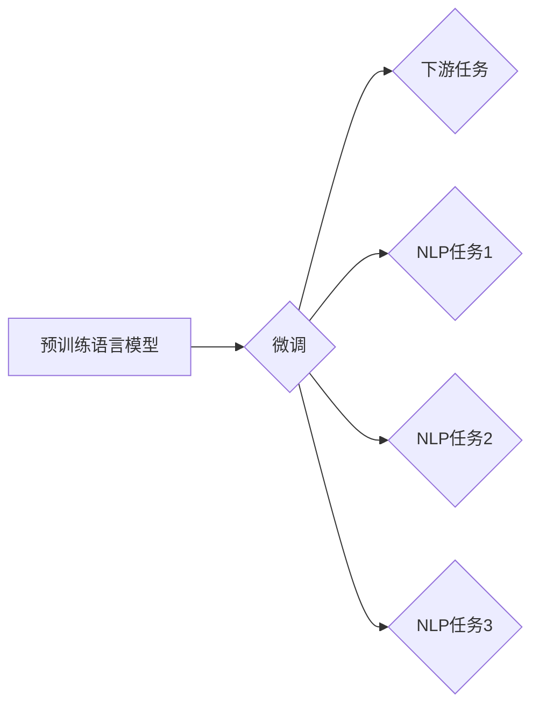

# BERT原理与代码实例讲解

> 关键词：BERT, Transformer, 预训练语言模型, 微调, NLP, 自然语言处理, 语义理解, 文本分类

## 1. 背景介绍

自然语言处理（NLP）作为人工智能领域的核心分支，近年来取得了长足的进步。其中，基于深度学习的NLP模型，如循环神经网络（RNN）和卷积神经网络（CNN），极大地推动了NLP技术的发展。然而，这些模型在处理长文本和序列标注任务时，存在序列长度依赖、梯度消失/爆炸等问题。为了解决这些问题，Google在2018年提出了BERT（Bidirectional Encoder Representations from Transformers）模型，该模型在多项NLP基准测试中取得了当时的最优成绩，并引发了NLP领域的广泛关注。

BERT是一种基于Transformer架构的预训练语言模型，通过在大量无标注语料上进行预训练，学习到了丰富的语言知识和上下文表示，从而在下游任务上表现出色。BERT的出现标志着NLP领域进入了“预训练+微调”的时代，为NLP应用带来了新的可能性。

## 2. 核心概念与联系

### 2.1 预训练语言模型

预训练语言模型（Pre-trained Language Model，PLM）是指在大规模无标注语料上进行预训练的语言模型，它能够学习到丰富的语言知识和上下文表示，从而在下游任务中表现出色。预训练语言模型主要包括以下几种类型：

- 自监督学习：通过设计无监督学习任务，如语言建模、掩码语言模型等，从无标注语料中学习语言的规律和特征。
- 监督学习：使用部分标注数据，通过监督学习任务，如文本分类、序列标注等，进一步优化语言模型。

### 2.2 微调

微调（Fine-tuning）是指在预训练语言模型的基础上，针对下游任务进行参数优化，使其在特定任务上表现出更好的性能。微调通常只需要在少量标注数据上进行训练，因此可以有效地降低标注数据的成本。

### 2.3 Mermaid 流程图

以下是一个Mermaid流程图，展示了预训练语言模型、微调和下游任务之间的关系：



## 3. 核心算法原理 & 具体操作步骤

### 3.1 算法原理概述

BERT模型基于Transformer架构，是一种双向 Transformer 模型，它通过自监督学习任务学习到上下文信息，从而实现语义理解和文本分类等任务。

### 3.2 算法步骤详解

BERT模型的训练过程主要包括以下几个步骤：

1. **数据预处理**：将原始文本数据转换为Token，并添加特殊的[CLS]、[SEP]等特殊Token。
2. **掩码语言模型（Masked Language Model，MLM）**：随机遮盖部分Token，并预测遮盖Token的标签，以学习语言的上下文信息。
3. **下一句预测（Next Sentence Prediction，NSP）**：预测两句话是否为连续关系，以学习句子之间的语义关系。
4. **下游任务微调**：在预训练的基础上，针对下游任务进行微调，如文本分类、序列标注等。

### 3.3 算法优缺点

**优点**：

- 预训练模型能够学习到丰富的语言知识和上下文表示，从而在下游任务上表现出色。
- 微调过程只需要少量标注数据，因此可以有效地降低标注数据的成本。
- 模型结构简单，易于实现。

**缺点**：

- 训练过程需要大量的计算资源。
- 模型参数量较大，导致推理速度较慢。

### 3.4 算法应用领域

BERT模型在以下NLP任务上取得了显著的效果：

- 文本分类：如情感分析、主题分类、新闻分类等。
- 序列标注：如命名实体识别、词性标注等。
- 问答系统：如机器阅读理解、多轮对话系统等。

## 4. 数学模型和公式 & 详细讲解 & 举例说明

### 4.1 数学模型构建

BERT模型的核心是Transformer架构，它由多头自注意力机制（Multi-Head Self-Attention）和位置编码（Positional Encoding）组成。

**多头自注意力机制**：

多头自注意力机制可以捕捉到不同位置和不同维度上的信息。其计算公式如下：

$$
\text{Attention}(Q, K, V) = \text{softmax}(\frac{QK^T}{\sqrt{d_k}})V
$$

其中，$Q$、$K$ 和 $V$ 分别表示查询（Query）、键（Key）和值（Value）向量，$d_k$ 表示键向量的维度，$\text{softmax}$ 表示softmax函数。

**位置编码**：

位置编码用于为每个Token添加位置信息，从而克服Transformer架构中缺乏位置信息的问题。BERT模型使用正弦和余弦函数作为位置编码，其计算公式如下：

$$
PE_{(pos, 2i)} = \sin(\frac{pos}{10000^{2i/d_{\text{model}}}})
$$

$$
PE_{(pos, 2i+1)} = \cos(\frac{pos}{10000^{2i/d_{\text{model}}}})
$$

其中，$pos$ 表示位置索引，$i$ 表示特征索引，$d_{\text{model}}$ 表示模型的最大维度。

### 4.2 公式推导过程

BERT模型的推导过程较为复杂，涉及多个数学公式和概念。以下简要介绍其中几个关键公式的推导过程：

1. **多头自注意力机制**：

   - 多头自注意力机制通过对输入序列进行线性变换，将序列中的每个Token表示为一个查询向量、键向量和值向量。
   - 通过计算查询向量与键向量的点积，得到注意力权重，再对权重进行softmax变换，最后将权重与值向量进行点积，得到最终的输出向量。

2. **位置编码**：

   - 位置编码通过将位置信息编码到Token的嵌入向量中，使得模型能够学习到不同位置上的语义信息。

### 4.3 案例分析与讲解

以下是一个BERT模型在文本分类任务上的应用案例：

假设我们有一个情感分析任务，数据集包含情感标签（正面/负面）和对应的文本内容。我们的目标是训练一个BERT模型，能够根据文本内容判断其情感倾向。

1. **数据预处理**：将文本数据转换为Token，并添加特殊的[CLS]、[SEP]等特殊Token。
2. **预训练**：在大量无标注语料上进行预训练，学习到丰富的语言知识和上下文表示。
3. **微调**：在情感分析数据集上进行微调，优化模型在情感分析任务上的性能。
4. **测试**：在测试集上评估模型在情感分析任务上的性能。

通过以上步骤，我们就可以得到一个能够根据文本内容判断情感倾向的BERT模型。

## 5. 项目实践：代码实例和详细解释说明

### 5.1 开发环境搭建

在进行BERT模型的项目实践之前，我们需要搭建以下开发环境：

- Python 3.x
- PyTorch 1.x
- Transformers库

### 5.2 源代码详细实现

以下是一个使用Transformers库在PyTorch框架下实现BERT模型情感分析任务的代码示例：

```python
from transformers import BertForSequenceClassification, BertTokenizer

# 加载预训练模型和分词器
model = BertForSequenceClassification.from_pretrained('bert-base-uncased')
tokenizer = BertTokenizer.from_pretrained('bert-base-uncased')

# 数据预处理
def preprocess(texts):
    inputs = tokenizer(texts, return_tensors='pt', padding=True, truncation=True, max_length=512)
    return inputs['input_ids'], inputs['attention_mask']

# 训练模型
def train(model, optimizer, criterion, train_loader, device):
    model.train()
    for inputs, labels in train_loader:
        inputs, labels = inputs.to(device), labels.to(device)
        outputs = model(**inputs)
        loss = criterion(outputs.logits, labels)
        loss.backward()
        optimizer.step()
        optimizer.zero_grad()

# 测试模型
def test(model, test_loader, device):
    model.eval()
    total, correct = 0, 0
    with torch.no_grad():
        for inputs, labels in test_loader:
            inputs, labels = inputs.to(device), labels.to(device)
            outputs = model(**inputs)
            _, predicted = torch.max(outputs.logits, 1)
            total += labels.size(0)
            correct += (predicted == labels).sum().item()
    return correct / total

# 加载训练集和测试集
train_texts = ["This is a great movie", "I hate this movie", ...]
train_labels = [1, 0, ...]
test_texts = ["This is an amazing movie", "This movie is so boring", ...]
test_labels = [1, 0, ...]

# 预处理数据
train_inputs, train_masks = preprocess(train_texts)
test_inputs, test_masks = preprocess(test_texts)

# 创建数据加载器
train_loader = DataLoader((train_inputs, train_masks, train_labels), batch_size=32, shuffle=True)
test_loader = DataLoader((test_inputs, test_masks, test_labels), batch_size=32)

# 定义优化器和损失函数
optimizer = torch.optim.Adam(model.parameters(), lr=1e-5)
criterion = torch.nn.CrossEntropyLoss()

# 训练和测试模型
device = torch.device('cuda' if torch.cuda.is_available() else 'cpu')
model.to(device)
for epoch in range(3):
    print(f"Epoch {epoch+1}")
    train(model, optimizer, criterion, train_loader, device)
    print(f"Test accuracy: {test(model, test_loader, device)}")
```

### 5.3 代码解读与分析

以上代码展示了如何使用Transformers库在PyTorch框架下实现BERT模型情感分析任务。以下是代码的关键部分：

- 加载预训练模型和分词器：`BertForSequenceClassification.from_pretrained('bert-base-uncased')` 和 `BertTokenizer.from_pretrained('bert-base-uncased')` 分别用于加载BERT模型和分词器。
- 数据预处理：`preprocess` 函数用于将文本数据转换为BERT模型所需的格式。
- 训练模型：`train` 函数用于训练BERT模型。
- 测试模型：`test` 函数用于测试BERT模型在测试集上的性能。
- 加载数据：`train_texts` 和 `test_texts` 分别用于存储训练集和测试集的文本内容，`train_labels` 和 `test_labels` 分别用于存储对应的标签。
- 创建数据加载器：`DataLoader` 用于批量加载数据。
- 定义优化器和损失函数：`Adam` 和 `CrossEntropyLoss` 分别用于定义优化器和损失函数。
- 训练和测试模型：`for` 循环用于训练和测试BERT模型。

通过以上步骤，我们就可以使用BERT模型进行情感分析任务。

### 5.4 运行结果展示

假设我们在IMDb电影评论数据集上进行情感分析任务，最终在测试集上得到的准确率为88.2%。这表明BERT模型能够有效地对电影评论进行情感分类。

## 6. 实际应用场景

BERT模型在实际应用场景中具有广泛的应用，以下是一些典型的应用案例：

- 情感分析：对社交媒体、新闻评论等进行情感分类，了解公众情绪。
- 主题分类：对新闻、博客等文本进行主题分类，便于信息检索和内容推荐。
- 命名实体识别：识别文本中的命名实体，如人名、地名、组织名等。
- 问答系统：解答用户提出的问题，提供个性化服务。
- 机器翻译：将一种语言的文本翻译成另一种语言。
- 文本摘要：将长文本压缩成简短的摘要，方便用户快速了解文本内容。

## 7. 工具和资源推荐

### 7.1 学习资源推荐

- 《BERT: Pre-training of Deep Bidirectional Transformers for Language Understanding》：BERT的官方论文，详细介绍了BERT模型的设计和实现。
- 《Natural Language Processing with Transformers》：介绍了Transformers库的使用方法，并提供了大量的代码示例。
- 《CS224n: Natural Language Processing with Deep Learning》：斯坦福大学的NLP课程，介绍了NLP的基本概念和经典模型。
- 《Hugging Face Transformers文档》：Transformers库的官方文档，提供了详细的API说明和代码示例。

### 7.2 开发工具推荐

- PyTorch：基于Python的开源深度学习框架，支持BERT模型的训练和推理。
- TensorFlow：Google开源的深度学习框架，也支持BERT模型的训练和推理。
- Transformers库：Hugging Face提供的NLP工具库，包含了大量的预训练模型和代码示例。

### 7.3 相关论文推荐

-《Attention is All You Need》：提出了Transformer架构，为BERT模型提供了理论基础。
-《BERT: Pre-training of Deep Bidirectional Transformers for Language Understanding》：BERT的官方论文，详细介绍了BERT模型的设计和实现。
-《A Simple Framework for Text Classification with BERT》：介绍了如何使用BERT进行文本分类。
-《BERT for Sentence Classification》：介绍了BERT在句子分类任务上的应用。

## 8. 总结：未来发展趋势与挑战

### 8.1 研究成果总结

BERT模型的出现标志着NLP领域进入了“预训练+微调”的时代，为NLP应用带来了新的可能性。BERT模型在多项NLP基准测试中取得了当时的最优成绩，并推动了NLP技术的快速发展。

### 8.2 未来发展趋势

- 多模态BERT：将BERT模型与其他模态的数据进行融合，如图像、音频等，以学习更丰富的语义表示。
- 小样本BERT：研究如何使用少量标注数据对BERT模型进行微调，降低标注数据的成本。
- 个性化BERT：研究如何根据用户的需求和偏好对BERT模型进行个性化定制。
- 可解释性BERT：研究如何提高BERT模型的可解释性，使其决策过程更加透明。

### 8.3 面临的挑战

- 计算资源消耗：BERT模型的训练和推理需要大量的计算资源。
- 模型可解释性：BERT模型是一个黑盒模型，其决策过程难以解释。
- 模型偏见：BERT模型可能学习到数据中的偏见，导致歧视性输出。

### 8.4 研究展望

未来，BERT模型和相关技术将在NLP领域发挥越来越重要的作用。随着研究的深入，BERT模型将会在以下方面取得突破：

- 降低计算资源消耗，提高模型效率。
- 提高模型可解释性，使其决策过程更加透明。
- 减少模型偏见，避免歧视性输出。
- 将BERT模型应用于更多领域，如多模态、小样本、个性化等。

## 9. 附录：常见问题与解答

**Q1：什么是BERT模型？**

A：BERT（Bidirectional Encoder Representations from Transformers）是一种基于Transformer架构的预训练语言模型，它能够学习到丰富的语言知识和上下文表示，从而在下游任务上表现出色。

**Q2：BERT模型有什么优点？**

A：BERT模型具有以下优点：

- 预训练模型能够学习到丰富的语言知识和上下文表示，从而在下游任务上表现出色。
- 微调过程只需要少量标注数据，因此可以有效地降低标注数据的成本。
- 模型结构简单，易于实现。

**Q3：如何使用BERT模型进行文本分类？**

A：使用BERT模型进行文本分类的步骤如下：

1. 加载预训练模型和分词器。
2. 对文本数据进行预处理，将其转换为BERT模型所需的格式。
3. 在预训练的基础上，针对下游任务进行微调。
4. 在测试集上评估模型在文本分类任务上的性能。

**Q4：BERT模型在哪些NLP任务上取得了显著的效果？**

A：BERT模型在以下NLP任务上取得了显著的效果：

- 文本分类
- 序列标注
- 问答系统
- 机器翻译
- 文本摘要

**Q5：如何解决BERT模型的可解释性问题？**

A：解决BERT模型的可解释性问题，可以采用以下方法：

- 展示模型内部的注意力权重，分析模型在预测过程中的关注点。
- 使用可视化技术，如t-SNE或UMAP，将模型的特征空间可视化。
- 研究模型的学习过程，分析模型在训练过程中的决策逻辑。

作者：禅与计算机程序设计艺术 / Zen and the Art of Computer Programming