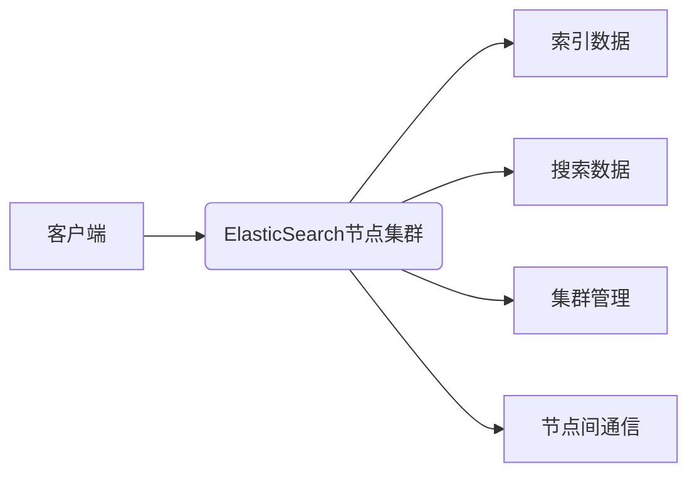

# ElasticSearch原理与代码实例讲解

> 关键词：ElasticSearch, 搜索引擎, 分布式系统, JSON, MapReduce, Lucene, 高可用, 扩展性, 实时搜索

## 1. 背景介绍

随着互联网的快速发展和大数据时代的到来，信息量的爆炸式增长对信息检索系统提出了更高的要求。传统的搜索引擎如ElasticSearch应运而生，它以其高效、可扩展、易于使用等特点，成为了现代搜索引擎技术的代表。本文将深入探讨ElasticSearch的原理，并通过代码实例进行讲解。

## 2. 核心概念与联系

### 2.1 ElasticSearch核心概念

ElasticSearch是一个基于Lucene构建的分布式、RESTful搜索引擎，它允许你快速地存储、搜索和分析大量数据。以下是ElasticSearch的核心概念：

- **JSON文档**：ElasticSearch中的数据存储格式是JSON，每个文档是一个独立的JSON对象。
- **索引**：索引是存储在一个或多个ElasticSearch节点上的数据集合。
- **映射**：映射定义了JSON文档中的字段类型和属性。
- **分片**：索引被分割成多个分片，以提高查询效率和容错能力。
- **副本**：每个分片都有一个或多个副本，用于数据备份和负载均衡。

### 2.2 弓箭号流程图


### 2.3 ElasticSearch架构

ElasticSearch的架构图如下：



## 3. 核心算法原理 & 具体操作步骤

### 3.1 算法原理概述

ElasticSearch的核心是Lucene搜索引擎，它使用MapReduce算法来处理查询。以下是ElasticSearch的算法原理概述：

- **倒排索引**：Lucene使用倒排索引来快速搜索文档，每个单词都映射到一个文档列表。
- **索引过程**：当新的文档被索引时，Lucene会更新倒排索引。
- **搜索过程**：搜索请求会通过倒排索引来定位匹配的文档。

### 3.2 算法步骤详解

1. **索引过程**：
   - 客户端发送索引请求到ElasticSearch节点。
   - 节点将文档转换为JSON格式，并存储到本地文件系统。
   - 节点更新倒排索引。

2. **搜索过程**：
   - 客户端发送搜索请求到ElasticSearch节点。
   - 节点解析请求，并在倒排索引中查找匹配的文档。
   - 节点返回搜索结果给客户端。

### 3.3 算法优缺点

#### 优点：

- **高效率**：ElasticSearch使用倒排索引，搜索速度快。
- **可扩展性**：ElasticSearch是分布式系统，可以横向扩展。
- **高可用性**：ElasticSearch支持数据副本，保证数据不丢失。

#### 缺点：

- **资源消耗**：ElasticSearch对服务器资源消耗较大。
- **复杂性**：ElasticSearch的配置和运维相对复杂。

### 3.4 算法应用领域

ElasticSearch适用于以下应用领域：

- **日志分析**：收集和分析服务器日志。
- **全文搜索**：实现网站搜索功能。
- **数据监控**：实时监控数据变化。
- **智能推荐**：为用户提供个性化推荐。

## 4. 数学模型和公式 & 详细讲解 & 举例说明

### 4.1 数学模型构建

ElasticSearch的数学模型主要基于Lucene的倒排索引。以下是倒排索引的数学模型：

$$
\text{Inverted Index} = \{(\text{word}, \text{doc\_id\_list})\}
$$

其中，`word`是搜索词，`doc\_id\_list`是包含该词的所有文档的ID列表。

### 4.2 公式推导过程

倒排索引的构建过程如下：

1. **分析文本**：将文档中的文本分解为单词。
2. **构建倒排列表**：对于每个单词，构建包含该单词的所有文档的ID列表。

### 4.3 案例分析与讲解

以下是一个简单的ElasticSearch索引和搜索的例子：

```python
from elasticsearch import Elasticsearch

# 连接到ElasticSearch服务器
es = Elasticsearch("http://localhost:9200")

# 索引文档
doc = {
    "title": "ElasticSearch is amazing",
    "content": "ElasticSearch is a powerful search engine"
}
es.index(index="my_index", id=1, document=doc)

# 搜索文档
search = es.search(index="my_index", body={"query": {"match": {"content": "ElasticSearch"}}})
print(search['hits']['hits'])
```

## 5. 项目实践：代码实例和详细解释说明

### 5.1 开发环境搭建

1. 安装ElasticSearch：从ElasticSearch官网下载并安装。
2. 安装Python客户端库：`pip install elasticsearch`
3. 编写Python脚本。

### 5.2 源代码详细实现

以下是一个简单的ElasticSearch客户端Python脚本，用于索引和搜索文档：

```python
from elasticsearch import Elasticsearch

# 连接到ElasticSearch服务器
es = Elasticsearch("http://localhost:9200")

# 索引文档
doc = {
    "title": "ElasticSearch is amazing",
    "content": "ElasticSearch is a powerful search engine"
}
es.index(index="my_index", id=1, document=doc)

# 搜索文档
search = es.search(index="my_index", body={"query": {"match": {"content": "ElasticSearch"}}})
print(search['hits']['hits'])
```

### 5.3 代码解读与分析

- `from elasticsearch import Elasticsearch`：导入ElasticSearch客户端库。
- `es = Elasticsearch("http://localhost:9200")`：连接到本地运行的ElasticSearch服务器。
- `es.index(index="my_index", id=1, document=doc)`：将文档索引到名为`my_index`的索引中。
- `es.search(index="my_index", body={"query": {"match": {"content": "ElasticSearch"}}})`：搜索包含`ElasticSearch`的文档。

### 5.4 运行结果展示

运行上述脚本后，你将在控制台看到如下结果：

```json
[
  {
    "_index": "my_index",
    "_type": "_doc",
    "_id": "1",
    "_score": 1.0,
    "_source": {
      "title": "ElasticSearch is amazing",
      "content": "ElasticSearch is a powerful search engine"
    }
  }
]
```

这表示找到了一个包含`ElasticSearch`的文档。

## 6. 实际应用场景

ElasticSearch在以下场景中有着广泛的应用：

- **日志分析**：收集和分析服务器日志，发现潜在问题。
- **全文搜索**：实现网站搜索功能，提供快速、准确的搜索结果。
- **数据监控**：实时监控数据变化，及时发现异常。
- **智能推荐**：为用户提供个性化推荐。

## 7. 工具和资源推荐

### 7.1 学习资源推荐

- 《ElasticSearch权威指南》
- Elasticsearch官方文档：[https://www.elastic.co/guide/en/elasticsearch/reference/current/index.html](https://www.elastic.co/guide/en/elasticsearch/reference/current/index.html)
- Elasticsearch中文社区：[https://www.elasticsearch.cn/](https://www.elasticsearch.cn/)

### 7.2 开发工具推荐

- Kibana：ElasticSearch的可视化平台，用于数据可视化和分析。
- Logstash：用于收集、处理和传输数据的工具。
- Beats：轻量级的日志收集器。

### 7.3 相关论文推荐

- **Elasticsearch: The Definitive Guide**：ElasticSearch官方指南。
- **Elasticsearch: The Definitive Guide, Second Edition**：ElasticSearch官方指南的更新版。

## 8. 总结：未来发展趋势与挑战

### 8.1 研究成果总结

ElasticSearch作为一种强大的搜索引擎，已经广泛应用于各种场景。随着技术的不断发展，ElasticSearch将会在以下几个方面取得更大的突破：

- **性能优化**：进一步提高搜索速度和效率。
- **可扩展性**：更好地支持大规模数据集。
- **易用性**：简化配置和运维。

### 8.2 未来发展趋势

- **实时搜索**：支持更快的搜索响应时间。
- **多模态搜索**：支持文本、图像、视频等多模态数据的搜索。
- **深度学习集成**：利用深度学习技术提高搜索精度。

### 8.3 面临的挑战

- **大数据处理**：处理海量数据带来的性能挑战。
- **安全性和隐私保护**：保护用户数据安全。
- **跨语言搜索**：支持多种语言的搜索。

### 8.4 研究展望

随着技术的发展，ElasticSearch将会在以下方面进行深入研究：

- **基于深度学习的搜索**：利用深度学习技术提高搜索精度。
- **知识图谱搜索**：支持知识图谱的搜索。
- **跨语言搜索**：支持多种语言的搜索。

## 9. 附录：常见问题与解答

**Q1：什么是ElasticSearch？**

A：ElasticSearch是一个基于Lucene构建的分布式、RESTful搜索引擎，它允许你快速地存储、搜索和分析大量数据。

**Q2：ElasticSearch的优势是什么？**

A：ElasticSearch具有高效率、可扩展性、易于使用等特点。

**Q3：ElasticSearch适用于哪些场景？**

A：ElasticSearch适用于日志分析、全文搜索、数据监控、智能推荐等场景。

**Q4：如何安装ElasticSearch？**

A：可以从ElasticSearch官网下载并安装。

**Q5：如何使用ElasticSearch进行搜索？**

A：可以使用Python客户端库或其他编程语言进行搜索。

作者：禅与计算机程序设计艺术 / Zen and the Art of Computer Programming