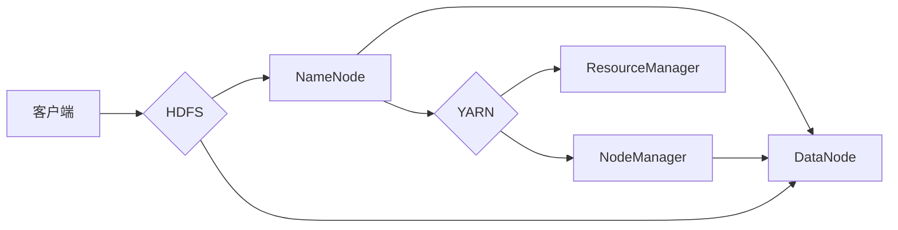

# Hadoop原理与代码实例讲解

> 关键词：Hadoop, 分布式存储，MapReduce，HDFS，YARN，HBase，大数据，Hive，Spark

## 1. 背景介绍

随着互联网和物联网的快速发展，数据量呈爆炸式增长，对数据处理和分析能力提出了更高的要求。Hadoop作为一款开源的大数据处理框架，以其高可靠性、高扩展性、高吞吐量和低成本的特点，成为了大数据领域的事实标准。本文将深入讲解Hadoop的原理，并通过代码实例展示其应用。

### 1.1 问题的由来

在传统的关系型数据库和单机处理系统中，随着数据量的不断增长，面临着以下挑战：

- **存储限制**：单机存储容量有限，难以满足海量数据的存储需求。
- **计算能力不足**：单机计算能力有限，无法处理大规模数据处理任务。
- **可扩展性差**：系统扩展困难，难以适应数据量的快速增长。

为了解决这些问题，分布式计算和存储技术应运而生。Hadoop正是基于这些技术构建的大数据处理框架。

### 1.2 研究现状

Hadoop自2006年由Apache软件基金会发布以来，已经发展成为全球范围内最受欢迎的大数据处理平台之一。其核心组件包括：

- HDFS（Hadoop Distributed File System）：分布式文件系统，用于存储海量数据。
- MapReduce：分布式计算框架，用于处理大规模数据集。
- YARN（Yet Another Resource Negotiator）：资源管理系统，用于管理集群资源。
- HBase：分布式NoSQL数据库，用于存储结构化数据。
- Hive：数据仓库工具，用于数据分析和报告。
- Spark：快速通用的分布式计算系统，用于大规模数据处理。

### 1.3 研究意义

研究Hadoop原理，掌握其应用，对于以下方面具有重要意义：

- **降低大数据处理成本**：Hadoop的开源特性和分布式架构，使得大数据处理成本大幅降低。
- **提升数据处理能力**：分布式计算和存储技术，使得Hadoop能够处理海量数据。
- **提高数据分析和挖掘效率**：Hadoop生态中的各类工具，能够快速进行数据分析和挖掘。
- **促进大数据产业发展**：Hadoop作为大数据领域的核心技术，推动了大数据产业的发展。

### 1.4 本文结构

本文将按照以下结构进行讲解：

- 第2部分，介绍Hadoop的核心概念和架构。
- 第3部分，深入讲解Hadoop的组件和工作原理。
- 第4部分，通过代码实例展示Hadoop在实际应用中的使用。
- 第5部分，探讨Hadoop在各个行业中的应用场景。
- 第6部分，展望Hadoop的未来发展趋势。
- 第7部分，推荐Hadoop相关的学习资源和开发工具。
- 第8部分，总结Hadoop的研究成果和挑战。
- 第9部分，提供常见问题与解答。

## 2. 核心概念与联系

### 2.1 核心概念

Hadoop的核心概念包括：

- **分布式存储**：将数据存储在多个节点上，实现海量数据的存储和管理。
- **分布式计算**：将计算任务分配到多个节点上并行执行，提高计算效率。
- **HDFS**：Hadoop分布式文件系统，是Hadoop的核心组件，用于存储海量数据。
- **MapReduce**：分布式计算框架，用于处理大规模数据集。
- **YARN**：资源管理系统，用于管理集群资源。
- **HBase**：分布式NoSQL数据库，用于存储结构化数据。
- **Hive**：数据仓库工具，用于数据分析和报告。
- **Spark**：快速通用的分布式计算系统，用于大规模数据处理。

### 2.2 架构

Hadoop的架构图如下：



其中：

- 客户端负责提交任务和访问数据。
- HDFS负责存储海量数据，由NameNode和DataNode组成。
- YARN负责管理集群资源，由ResourceManager和NodeManager组成。

## 3. 核心算法原理 & 具体操作步骤

### 3.1 算法原理概述

Hadoop的核心算法包括：

- **HDFS**：采用副本机制，保证数据的高可靠性和高可用性。
- **MapReduce**：将计算任务分解为Map和Reduce两个阶段，实现并行计算。
- **YARN**：采用资源隔离和资源共享机制，提高资源利用率。

### 3.2 算法步骤详解

#### 3.2.1 HDFS

HDFS的工作原理如下：

1. 客户端向NameNode请求文件块分配。
2. NameNode返回文件块在DataNode上的存储位置。
3. 客户端将文件块数据写入DataNode。
4. DataNode将数据同步到其他DataNode，形成副本。
5. 客户端读取数据时，NameNode返回文件块在DataNode上的存储位置。
6. 客户端从DataNode读取数据。

#### 3.2.2 MapReduce

MapReduce的工作原理如下：

1. 客户端将数据拆分成多个数据块。
2. 每个数据块由Mapper处理，输出中间键值对。
3. 中间键值对经过Shuffle过程，按照键排序。
4. Reduce处理排序后的键值对，输出最终结果。

#### 3.2.3 YARN

YARN的工作原理如下：

1. ResourceManager监控集群资源，分配任务给NodeManager。
2. NodeManager管理本地资源，运行任务。
3. ResourceManager监控任务执行情况，进行资源调整。

### 3.3 算法优缺点

#### 3.3.1 HDFS

**优点**：

- 高可靠性：采用副本机制，保证数据不丢失。
- 高可用性：NameNode故障时，可以从备份中恢复。
- 高吞吐量：支持并发读写操作。

**缺点**：

- 存储效率低：存储大量小文件时，存储效率较低。
- 读写性能差：不适合小文件读写。

#### 3.3.2 MapReduce

**优点**：

- 高可靠性：采用分布式计算，提高任务容错性。
- 高吞吐量：支持大规模数据处理。
- 易于编程：使用Java编写MapReduce程序。

**缺点**：

- 编程复杂：MapReduce编程相对复杂。
- 性能开销大：数据传输、任务调度等开销较大。

#### 3.3.3 YARN

**优点**：

- 资源利用率高：支持多种计算框架，提高资源利用率。
- 扩展性好：支持水平扩展。
- 调度灵活：支持多种调度策略。

**缺点**：

- 性能开销大：调度机制相对复杂，性能开销较大。

### 3.4 算法应用领域

Hadoop的算法广泛应用于以下领域：

- 大数据分析
- 数据仓库
- 机器学习
- 文本处理
- 图处理

## 4. 数学模型和公式 & 详细讲解 & 举例说明

### 4.1 数学模型构建

Hadoop的数学模型主要包括：

- **HDFS**：数据冗余模型
- **MapReduce**：并行计算模型
- **YARN**：资源调度模型

### 4.2 公式推导过程

#### 4.2.1 HDFS数据冗余模型

HDFS采用副本机制，保证数据可靠性。数据冗余模型如下：

$$
R = (N - 1) \times R_0
$$

其中，$R$ 为总冗余份数，$N$ 为副本数量，$R_0$ 为原始数据份数。

#### 4.2.2 MapReduce并行计算模型

MapReduce并行计算模型如下：

$$
T = T_M + T_S
$$

其中，$T$ 为总计算时间，$T_M$ 为Map阶段计算时间，$T_S$ 为Shuffle阶段计算时间。

#### 4.2.3 YARN资源调度模型

YARN资源调度模型如下：

$$
R_{alloc} = R_{request} - R_{used}
$$

其中，$R_{alloc}$ 为分配的资源，$R_{request}$ 为请求的资源，$R_{used}$ 为使用的资源。

### 4.3 案例分析与讲解

#### 4.3.1 HDFS案例

假设某数据块有3个副本，原始数据份数为1，则总冗余份数为2。

#### 4.3.2 MapReduce案例

假设Map阶段计算时间为10秒，Shuffle阶段计算时间为5秒，则总计算时间为15秒。

#### 4.3.3 YARN案例

假设请求的资源为100个核心，使用的资源为50个核心，则分配的资源为50个核心。

## 5. 项目实践：代码实例和详细解释说明

### 5.1 开发环境搭建

以下是使用Hadoop的步骤：

1. 安装Java
2. 下载Hadoop源码
3. 解压源码
4. 配置环境变量
5. 编译源码
6. 启动Hadoop集群

### 5.2 源代码详细实现

以下是一个简单的HDFS程序，用于创建和删除文件：

```java
import org.apache.hadoop.conf.Configuration;
import org.apache.hadoop.fs.FileSystem;
import org.apache.hadoop.fs.Path;

public class HdfsExample {
    public static void main(String[] args) throws Exception {
        Configuration conf = new Configuration();
        conf.set("fs.defaultFS", "hdfs://localhost:9000");
        FileSystem fs = FileSystem.get(conf);
        
        // 创建文件
        Path path = new Path("/test.txt");
        fs.create(path);
        
        // 删除文件
        fs.delete(path, true);
        
        fs.close();
    }
}
```

### 5.3 代码解读与分析

以上代码演示了如何使用Java操作HDFS。首先，创建Configuration对象，设置HDFS的访问地址。然后，创建FileSystem对象，用于访问HDFS。接着，创建Path对象，指定文件路径。最后，使用FileSystem对象创建和删除文件。

### 5.4 运行结果展示

运行以上代码，将在HDFS上创建和删除/test.txt文件。

## 6. 实际应用场景

Hadoop在以下场景中有着广泛的应用：

### 6.1 大数据分析

Hadoop可以用于大规模数据分析，如：

- 数据挖掘
- 数据可视化
- 数据挖掘

### 6.2 数据仓库

Hadoop可以与数据仓库技术结合，实现海量数据存储和分析，如：

- 数据集成
- 数据治理
- 数据质量管理

### 6.3 机器学习

Hadoop可以与机器学习技术结合，实现大规模机器学习，如：

- 机器学习模型训练
- 机器学习模型预测
- 机器学习模型评估

### 6.4 文本处理

Hadoop可以用于大规模文本处理，如：

- 文本挖掘
- 文本分类
- 文本聚类

### 6.5 图处理

Hadoop可以用于大规模图处理，如：

- 图挖掘
- 社交网络分析
- 网络分析

## 7. 工具和资源推荐

### 7.1 学习资源推荐

- 《Hadoop权威指南》
- 《Hadoop实战》
- 《Hadoop入门到精通》

### 7.2 开发工具推荐

- Hadoop官方文档
- Apache Hadoop GitHub仓库
- Hadoop社区论坛

### 7.3 相关论文推荐

- 《The Google File System》
- 《MapReduce: Simplified Data Processing on Large Clusters》
- 《Hadoop: The Definitive Guide》

## 8. 总结：未来发展趋势与挑战

### 8.1 研究成果总结

Hadoop作为一款开源的大数据处理框架，已经取得了显著的研究成果，为大数据技术的发展做出了重要贡献。

### 8.2 未来发展趋势

Hadoop未来发展趋势包括：

- 向云原生架构演进
- 与其他大数据技术深度融合
- 持续优化性能和可靠性

### 8.3 面临的挑战

Hadoop面临的挑战包括：

- 与其他大数据技术的竞争
- 云原生架构的挑战
- 安全性和隐私保护

### 8.4 研究展望

未来，Hadoop将与其他大数据技术深度融合，为构建更加高效、可靠、安全的大数据生态系统做出贡献。

## 9. 附录：常见问题与解答

**Q1：Hadoop的适用场景有哪些？**

A：Hadoop适用于以下场景：

- 大数据分析
- 数据仓库
- 机器学习
- 文本处理
- 图处理

**Q2：Hadoop与Spark有什么区别？**

A：Hadoop和Spark都是分布式计算框架，但它们存在以下区别：

- Hadoop采用MapReduce模型，Spark采用弹性分布式数据集(RDD)模型。
- Hadoop主要用于离线批处理，Spark支持离线和在线处理。
- Spark比Hadoop运行速度更快，更适合实时数据处理。

**Q3：Hadoop的安全性问题如何解决？**

A：Hadoop的安全性问题可以通过以下方式解决：

- 使用Kerberos认证
- 使用HDFS权限控制
- 使用Hadoop权限控制

**Q4：Hadoop如何进行性能优化？**

A：Hadoop的性能优化可以通过以下方式实现：

- 优化HDFS存储策略
- 优化MapReduce作业
- 使用YARN资源调度策略

**Q5：Hadoop的局限性有哪些？**

A：Hadoop的局限性包括：

- 不适合实时处理
- 不适合小规模数据
- 不适合复杂计算任务

---

作者：禅与计算机程序设计艺术 / Zen and the Art of Computer Programming