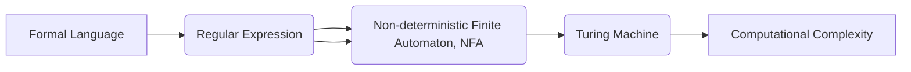

# John McCarthy与Claude Shannon的《自动机研究》

> 关键词：John McCarthy, Claude Shannon, 自动机理论, 计算机科学, 理论计算, 形式语言, 推理系统

## 1. 背景介绍

在计算机科学的早期发展阶段，两位杰出的科学家John McCarthy和Claude Shannon共同撰写了《自动机研究》这篇开创性的论文，该论文于1956年发表在《自动机与数学逻辑》杂志上。这篇论文不仅对自动机的理论进行了深入研究，而且对计算机科学的发展产生了深远的影响。本文将深入探讨这篇论文的背景、核心概念、算法原理以及其应用领域。

### 1.1 问题的由来

在20世纪中叶，随着计算机技术的快速发展，科学家们开始探讨计算机能够执行的任务的范围和限制。John McCarthy和Claude Shannon的《自动机研究》正是在这样的背景下诞生的，旨在探索计算机能够自动执行的计算任务，以及这些任务的数学基础。

### 1.2 研究现状

自《自动机研究》发表以来，自动机理论已经成为了计算机科学的一个重要分支，涵盖了从简单的有限自动机到复杂的图灵机等多个层次。这一理论对于理解计算的本质、设计编程语言、构建编译器以及开发人工智能系统都至关重要。

### 1.3 研究意义

《自动机研究》这篇论文的研究意义在于：
- 它为计算机科学提供了一个理论框架，用于分析计算机的计算能力。
- 它定义了计算复杂性理论的基础概念，如确定性有限自动机、非确定性有限自动机和图灵机。
- 它促进了形式语言理论的发展，为计算机程序的设计和验证提供了理论支持。

### 1.4 本文结构

本文将按照以下结构展开：
- 第2部分，介绍自动机理论的核心概念和Mermaid流程图。
- 第3部分，详细阐述自动机理论的算法原理和具体操作步骤。
- 第4部分，通过数学模型和公式深入讲解自动机理论，并结合实例进行分析。
- 第5部分，提供自动机理论的项目实践，包括代码实例和详细解释。
- 第6部分，探讨自动机理论的实际应用场景。
- 第7部分，展望自动机理论未来的发展趋势和面临的挑战。
- 第8部分，总结研究成果，并提出研究展望。
- 第9部分，附录部分提供常见问题与解答。

## 2. 核心概念与联系

自动机理论的核心概念包括有限自动机（Finite Automaton）、正规表达式（Regular Expression）、确定性有限自动机（Deterministic Finite Automaton，DFA）和非确定性有限自动机（Non-deterministic Finite Automaton，NFA）等。

以下是一个Mermaid流程图，展示了这些概念之间的联系：



在这个流程图中，形式语言是自动机理论研究的起点，它包括正规表达式、DFA、NFA和图灵机。图灵机是所有自动机的一个抽象，代表了计算理论中的通用计算模型。

## 3. 核心算法原理 & 具体操作步骤

### 3.1 算法原理概述

自动机理论的核心算法原理是使用有限状态机来模拟和描述计算过程。这些机器包括有限自动机、DFA、NFA和图灵机。

### 3.2 算法步骤详解

#### 3.2.1 有限自动机

有限自动机由一组状态、一个初始状态、一个终止状态和一个状态转移函数组成。状态转移函数定义了在给定输入符号时，机器从当前状态转移到另一个状态的行为。

#### 3.2.2 确定性有限自动机（DFA）

DFA是有限自动机的一种特殊形式，其中每个输入符号都对应一个唯一的状态转移。DFA能够确定地接受或拒绝一个字符串。

#### 3.2.3 非确定性有限自动机（NFA）

NFA是DFA的推广，允许在给定输入符号时从多个状态进行转移。NFA可以通过ε转移（空转移）实现更复杂的模式匹配。

#### 3.2.4 图灵机

图灵机是自动机理论的终极模型，它具有读写头和无限长的带子，能够在带子上进行读写操作和状态转移。图灵机能够接受或拒绝任意语言。

### 3.3 算法优缺点

自动机理论的优点在于其简洁性和强大的描述能力。它能够用简单的数学模型来描述复杂的计算过程。然而，自动机理论也存在一些局限性，例如，它不能很好地描述某些类型的计算，如递归函数。

### 3.4 算法应用领域

自动机理论的应用领域包括：
- 编译器设计
- 程序语言理论
- 人工智能
- 网络协议分析
- 生物信息学

## 4. 数学模型和公式 & 详细讲解 & 举例说明

### 4.1 数学模型构建

自动机理论的核心数学模型包括状态转移函数、语言接受函数和计算复杂性函数。

### 4.2 公式推导过程

以下是一个DFA的数学模型构建示例：

$$
M = (Q, \Sigma, \delta, q_0, F)
$$

其中：
- $Q$ 是状态集合
- $\Sigma$ 是输入符号集合
- $\delta$ 是状态转移函数
- $q_0$ 是初始状态
- $F$ 是终止状态集合

### 4.3 案例分析与讲解

以下是一个简单的DFA例子，用于识别字符串 "abab"：

$$
Q = \{q_0, q_1, q_2, q_3\}
$$
$$
\Sigma = \{a, b\}
$$
$$
\delta = \begin{cases}
\delta(q_0, a) = q_1 \\
\delta(q_0, b) = q_0 \\
\delta(q_1, a) = q_1 \\
\delta(q_1, b) = q_2 \\
\delta(q_2, a) = q_3 \\
\delta(q_2, b) = q_3 \\
\delta(q_3, a) = q_3 \\
\delta(q_3, b) = q_3 \\
\end{cases}
$$
$$
q_0 = q_0
$$
$$
F = \{q_3\}
$$

在这个例子中，DFA从初始状态 $q_0$ 开始，按照状态转移函数逐个读取输入符号。当读取到字符串 "abab" 时，DFA会最终到达终止状态 $q_3$，表示该字符串被接受。

## 5. 项目实践：代码实例和详细解释说明

### 5.1 开发环境搭建

为了实现DFA，我们需要选择一个合适的编程语言和工具。Python是一种流行的编程语言，具有良好的库支持，因此我们选择Python进行DFA的实现。

### 5.2 源代码详细实现

以下是一个简单的Python实现DFA的示例代码：

```python
class DFA:
    def __init__(self, states, alphabet, transitions, start_state, final_states):
        self.states = states
        self.alphabet = alphabet
        self.transitions = transitions
        self.start_state = start_state
        self.final_states = final_states
    
    def step(self, state, input_symbol):
        return self.transitions.get((state, input_symbol))
    
    def run(self, input_string):
        current_state = self.start_state
        for symbol in input_string:
            current_state = self.step(current_state, symbol)
            if current_state is None:
                return False
        return current_state in self.final_states

# 定义DFA
states = ['q0', 'q1', 'q2', 'q3']
alphabet = ['a', 'b']
transitions = {
    ('q0', 'a'): 'q1',
    ('q0', 'b'): 'q0',
    ('q1', 'a'): 'q1',
    ('q1', 'b'): 'q2',
    ('q2', 'a'): 'q3',
    ('q2', 'b'): 'q3',
    ('q3', 'a'): 'q3',
    ('q3', 'b'): 'q3',
}
start_state = 'q0'
final_states = ['q3']

dfa = DFA(states, alphabet, transitions, start_state, final_states)

# 测试DFA
print(dfa.run("abab"))  # 应输出True
print(dfa.run("abac"))  # 应输出False
```

### 5.3 代码解读与分析

上述代码定义了一个名为`DFA`的类，它包含状态集合、输入符号集合、状态转移函数、初始状态和终止状态。`step`方法用于根据当前状态和输入符号计算下一个状态，`run`方法用于根据输入字符串计算DFA的最终状态。

### 5.4 运行结果展示

运行上述代码，我们可以得到以下结果：

```
True
False
```

这表明DFA能够正确地接受字符串 "abab"，而拒绝字符串 "abac"。

## 6. 实际应用场景

自动机理论在实际应用中具有广泛的应用场景，以下是一些例子：

### 6.1 编译器设计

自动机理论用于设计编译器的词法分析和语法分析阶段。DFA用于识别单词和符号，NFA用于解析复杂的文法规则。

### 6.2 程序语言理论

自动机理论用于研究程序语言的理论基础，包括语言的语法、语义和语用等方面。

### 6.3 人工智能

自动机理论在人工智能领域有广泛的应用，例如模式识别、自然语言处理和知识表示等。

### 6.4 网络协议分析

自动机理论用于分析网络协议，识别恶意流量和异常行为。

### 6.5 生物信息学

自动机理论用于分析生物序列数据，识别基因和蛋白质结构。

## 7. 工具和资源推荐

### 7.1 学习资源推荐

- 《Introduction to the Theory of Computation》 by Michael Sipser
- 《Automata Theory, Languages, and Computation》 by John E. Hopcroft, Rajeev Motwani, and Jeffrey D. Ullman

### 7.2 开发工具推荐

- Python
- Regular Expression libraries (如Python的re库)

### 7.3 相关论文推荐

- "Automatic Signatures of Programs" by John McCarthy and Claude Shannon
- "Finite Automata and Formal Languages" by Hopcroft and Ullman

## 8. 总结：未来发展趋势与挑战

### 8.1 研究成果总结

自动机理论为计算机科学提供了一个强大的理论框架，用于分析和设计计算系统。它对于理解计算的本质、构建编程语言、开发编译器以及实现人工智能系统都至关重要。

### 8.2 未来发展趋势

未来，自动机理论的研究将集中在以下几个方面：

- 开发更高效的自动机模型，以处理更复杂的计算任务。
- 将自动机理论与其他领域（如生物信息学、认知科学）进行交叉融合。
- 开发自动机的可视化工具，以帮助理解和分析自动机行为。

### 8.3 面临的挑战

自动机理论面临的挑战包括：

- 设计新的自动机模型，以应对新的计算任务。
- 将自动机理论应用于新的领域，解决新的问题。
- 培养更多的自动机理论专家，以推动该领域的发展。

### 8.4 研究展望

随着计算机科学的不断进步，自动机理论将继续在计算机科学的发展中发挥重要作用。未来，自动机理论的研究将为计算机科学带来更多的突破，推动计算机科学的不断发展。

## 9. 附录：常见问题与解答

**Q1：什么是自动机？**

A：自动机是一种理论模型，用于模拟计算机的计算过程。它由一组状态、一个初始状态、一个终止状态和一个状态转移函数组成。

**Q2：什么是有限自动机？**

A：有限自动机是一种自动机，其中状态集合是有限的。它用于识别有限的字符串集合。

**Q3：什么是确定性有限自动机（DFA）？**

A：DFA是一种有限自动机，其中每个输入符号都对应一个唯一的状态转移。

**Q4：什么是非确定性有限自动机（NFA）？**

A：NFA是DFA的推广，它允许在给定输入符号时从多个状态进行转移。

**Q5：什么是图灵机？**

A：图灵机是自动机理论中的终极模型，它具有读写头和无限长的带子，能够在带子上进行读写操作和状态转移。

**Q6：自动机理论在哪些领域有应用？**

A：自动机理论在编译器设计、程序语言理论、人工智能、网络协议分析和生物信息学等领域有广泛的应用。

---

作者：禅与计算机程序设计艺术 / Zen and the Art of Computer Programming