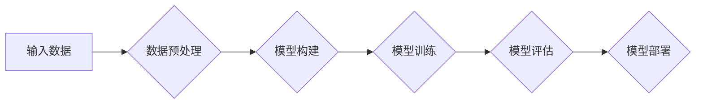

# Keras 原理与代码实战案例讲解

> 关键词：Keras, 深度学习, 模型构建, 代码实战, TensorFlow, 神经网络, 人工智能

## 1. 背景介绍

深度学习作为人工智能领域的一项重要技术，已经取得了显著的成就。Keras 作为 TensorFlow 的官方高级神经网络 API，以其简洁、易用、模块化等特点，受到了广大开发者和研究者的喜爱。本文将深入讲解 Keras 的原理，并结合实际案例进行代码实战，帮助读者全面理解并掌握 Keras 的使用方法。

## 2. 核心概念与联系

### 2.1 核心概念

- **深度学习**：一种通过模拟人脑神经网络结构和功能的人工智能技术，能够通过学习数据中的特征，实现图像识别、语音识别、自然语言处理等复杂任务。
- **神经网络**：深度学习的基本单元，由多个神经元组成，通过层次化结构对数据进行处理和特征提取。
- **Keras**：一个高级神经网络 API，能够简化神经网络模型的设计和训练过程。
- **TensorFlow**：Google 开发的一款开源深度学习框架，支持多种编程语言，是 Keras 的底层引擎。

### 2.2 架构流程图



该流程图展示了使用 Keras 进行深度学习项目的一般步骤：从数据预处理开始，构建模型，训练模型，评估模型，最后将模型部署到实际应用中。

## 3. 核心算法原理 & 具体操作步骤

### 3.1 算法原理概述

Keras 的工作原理是基于 TensorFlow 框架的。它通过定义和编译模型，然后训练模型，最后评估和部署模型。以下是 Keras 的核心步骤：

- **定义模型**：使用 Keras 的Sequential或Functional API定义神经网络结构。
- **编译模型**：指定损失函数、优化器、评估指标等。
- **训练模型**：使用训练数据对模型进行训练。
- **评估模型**：使用验证数据评估模型的性能。
- **部署模型**：将训练好的模型部署到实际应用中。

### 3.2 算法步骤详解

#### 3.2.1 定义模型

使用 Sequential API：

```python
from keras.models import Sequential
from keras.layers import Dense

model = Sequential()
model.add(Dense(64, activation='relu', input_dim=784))
model.add(Dense(10, activation='softmax'))
```

使用 Functional API：

```python
from keras.models import Model
from keras.layers import Input, Dense

input = Input(shape=(784,))
x = Dense(64, activation='relu')(input)
output = Dense(10, activation='softmax')(x)

model = Model(input, output)
```

#### 3.2.2 编译模型

```python
model.compile(optimizer='adam', loss='categorical_crossentropy', metrics=['accuracy'])
```

#### 3.2.3 训练模型

```python
model.fit(x_train, y_train, epochs=10, batch_size=32, validation_data=(x_test, y_test))
```

#### 3.2.4 评估模型

```python
loss, accuracy = model.evaluate(x_test, y_test)
```

#### 3.2.5 部署模型

```python
model.save('my_model.h5')
```

### 3.3 算法优缺点

**优点**：

- **简洁易用**：Keras 的 API 设计简洁，易于上手。
- **模块化**：Keras 支持多种神经网络层和损失函数，可以灵活构建复杂的模型。
- **集成TensorFlow**：Keras 能够利用 TensorFlow 的强大功能，如分布式训练、GPU 加速等。

**缺点**：

- **底层依赖**：Keras 是基于 TensorFlow 的，需要 TensorFlow 的支持。
- **性能**：相比底层 TensorFlow 框架，Keras 的性能略逊一筹。

### 3.4 算法应用领域

Keras 可以应用于各种深度学习任务，包括：

- 图像识别
- 语音识别
- 自然语言处理
- 推荐系统
- 生成模型

## 4. 数学模型和公式 & 详细讲解 & 举例说明

### 4.1 数学模型构建

神经网络的基本单元是神经元，每个神经元由输入层、激活函数和输出层组成。

#### 4.1.1 神经元

$$
z = w_1 \cdot x_1 + w_2 \cdot x_2 + \cdots + w_n \cdot x_n + b
$$

其中，$w_i$ 是权重，$x_i$ 是输入，$b$ 是偏置。

#### 4.1.2 激活函数

常见的激活函数有 Sigmoid、ReLU、Tanh 等。

- Sigmoid 函数：

$$
h(z) = \frac{1}{1 + e^{-z}}
$$

- ReLU 函数：

$$
h(z) = \max(0, z)
$$

- Tanh 函数：

$$
h(z) = \frac{e^z - e^{-z}}{e^z + e^{-z}}
$$

### 4.2 公式推导过程

以 Sigmoid 激活函数为例，推导其导数：

$$
h'(z) = \frac{e^z}{(1 + e^z)^2}
$$

### 4.3 案例分析与讲解

以下是一个使用 Keras 实现的简单神经网络模型，用于二分类任务：

```python
from keras.models import Sequential
from keras.layers import Dense

model = Sequential()
model.add(Dense(10, input_dim=784, activation='relu'))
model.add(Dense(1, activation='sigmoid'))

model.compile(optimizer='adam', loss='binary_crossentropy', metrics=['accuracy'])

model.fit(x_train, y_train, epochs=10, batch_size=32, validation_data=(x_test, y_test))

loss, accuracy = model.evaluate(x_test, y_test)
```

在这个例子中，我们使用 ReLU 激活函数和 Sigmoid 激活函数构建了一个简单的神经网络模型。模型包含一个输入层、一个隐藏层和一个输出层。输入层包含 784 个神经元，对应于输入数据的特征数量。隐藏层包含 10 个神经元，输出层包含 1 个神经元，对应于二分类任务。使用 Adam 优化器和二元交叉熵损失函数进行模型训练。

## 5. 项目实践：代码实例和详细解释说明

### 5.1 开发环境搭建

为了使用 Keras 进行深度学习，需要安装以下软件和库：

- Python 3.x
- TensorFlow 2.x
- Keras

安装方法：

```bash
pip install tensorflow==2.x
```

### 5.2 源代码详细实现

以下是一个使用 Keras 进行图像分类的代码实例：

```python
from keras.models import Sequential
from keras.layers import Conv2D, MaxPooling2D, Flatten, Dense

model = Sequential()
model.add(Conv2D(32, (3, 3), activation='relu', input_shape=(64, 64, 3)))
model.add(MaxPooling2D((2, 2)))
model.add(Conv2D(64, (3, 3), activation='relu'))
model.add(MaxPooling2D((2, 2)))
model.add(Flatten())
model.add(Dense(128, activation='relu'))
model.add(Dense(10, activation='softmax'))

model.compile(optimizer='adam', loss='categorical_crossentropy', metrics=['accuracy'])

model.fit(x_train, y_train, epochs=10, batch_size=32, validation_data=(x_val, y_val))

loss, accuracy = model.evaluate(x_test, y_test)
```

在这个例子中，我们使用卷积神经网络（CNN）对图像进行分类。模型包含两个卷积层、两个最大池化层、一个平坦化层、两个全连接层和一个输出层。使用 Adam 优化器和交叉熵损失函数进行模型训练。

### 5.3 代码解读与分析

- **Conv2D 层**：卷积层，用于提取图像特征。
- **MaxPooling2D 层**：最大池化层，用于降低特征维度和减少计算量。
- **Flatten 层**：平坦化层，将多维特征转换为向量。
- **Dense 层**：全连接层，用于分类。

### 5.4 运行结果展示

运行上述代码后，模型将在训练集和测试集上进行训练和评估。最终输出模型在测试集上的准确率。

## 6. 实际应用场景

Keras 在实际应用场景中非常广泛，以下是一些常见的应用场景：

- **图像识别**：例如，使用 Keras 进行图像分类、目标检测、图像分割等任务。
- **语音识别**：例如，使用 Keras 进行语音识别、语音合成、说话人识别等任务。
- **自然语言处理**：例如，使用 Keras 进行文本分类、情感分析、机器翻译等任务。
- **推荐系统**：例如，使用 Keras 进行商品推荐、电影推荐、音乐推荐等任务。
- **生成模型**：例如，使用 Keras 进行图像生成、文本生成等任务。

## 7. 工具和资源推荐

### 7.1 学习资源推荐

- Keras 官方文档：https://keras.io/
- TensorFlow 官方文档：https://www.tensorflow.org/
- 《深度学习》书籍：http://www.deeplearningbook.org/

### 7.2 开发工具推荐

- Jupyter Notebook：https://jupyter.org/
- Google Colab：https://colab.research.google.com/

### 7.3 相关论文推荐

- "ImageNet Classification with Deep Convolutional Neural Networks" by Krizhevsky et al., 2012
- "A Neural Algorithm of Artistic Style" by Gatys et al., 2015
- "Sequence to Sequence Learning with Neural Networks" by Sutskever et al., 2014

## 8. 总结：未来发展趋势与挑战

### 8.1 研究成果总结

本文深入讲解了 Keras 的原理，并结合实际案例进行了代码实战。通过本文的学习，读者可以全面理解并掌握 Keras 的使用方法，为后续的深度学习项目开发奠定基础。

### 8.2 未来发展趋势

Keras 作为 TensorFlow 的官方高级神经网络 API，将继续保持简洁、易用、模块化的特点，并不断完善和更新。以下是 Keras 的未来发展趋势：

- 更多的神经网络层和损失函数
- 更多的预训练模型
- 更好的集成开发工具
- 更多的开源社区支持

### 8.3 面临的挑战

- 模型复杂度的控制
- 计算资源的优化
- 模型可解释性
- 模型安全性

### 8.4 研究展望

随着深度学习技术的不断发展，Keras 将在更多领域得到应用，为人工智能的发展贡献力量。未来，我们将看到更多基于 Keras 的创新应用和研究成果。

## 9. 附录：常见问题与解答

**Q1：什么是 Keras？**

A：Keras 是一个高级神经网络 API，基于 TensorFlow 构建，用于简化神经网络模型的设计和训练过程。

**Q2：Keras 和 TensorFlow 的关系是什么？**

A：Keras 是 TensorFlow 的官方高级神经网络 API，可以看作是 TensorFlow 的简化版。

**Q3：为什么选择 Keras？**

A：Keras 以其简洁、易用、模块化等特点，非常适合初学者和开发者。

**Q4：Keras 有哪些优势？**

A：Keras 的优势包括简洁易用、模块化、集成 TensorFlow 等。

**Q5：Keras 可以应用于哪些领域？**

A：Keras 可以应用于各种深度学习任务，包括图像识别、语音识别、自然语言处理、推荐系统、生成模型等。

作者：禅与计算机程序设计艺术 / Zen and the Art of Computer Programming