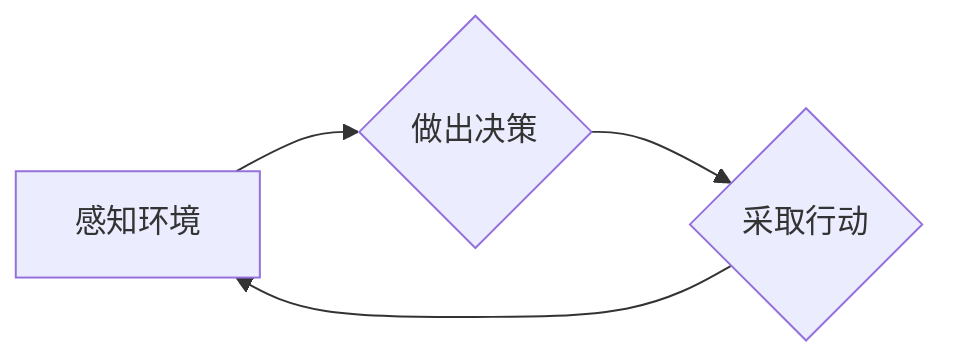
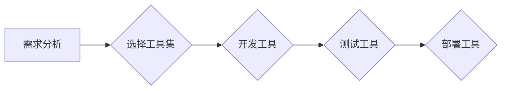

# Module：Agent, Tools, Toolkits

> 关键词：模块化，智能体，工具集，软件开发，软件架构，人工智能

## 1. 背景介绍

在软件开发和人工智能领域，模块化是一个核心概念。它强调将复杂的系统分解成可复用、可维护的独立部分，以提高开发效率、降低风险和增强系统的可扩展性。本文将探讨模块化的核心概念，深入分析智能体（Agent）和工具集（Toolkits）在模块化开发中的作用，并探讨它们如何促进软件架构的演进。

### 1.1 模块化的起源与重要性

模块化的概念起源于20世纪中叶的软件工程领域。随着软件系统的复杂性不断增加，模块化成为了一种有效的管理复杂性的手段。它允许开发人员将系统分解成多个模块，每个模块负责特定的功能，从而提高了代码的可读性、可维护性和可复用性。

### 1.2 智能体与工具集的兴起

随着人工智能技术的快速发展，智能体（Agent）和工具集（Toolkits）成为了软件开发的重要组件。智能体是指能够感知环境、做出决策并采取行动的实体，而工具集则是一套预定义的工具和库，用于简化开发工作。

## 2. 核心概念与联系

### 2.1 智能体（Agent）

智能体是模块化架构中的一个关键概念。以下是智能体的核心特征：

- **自主性（Autonomy）**：智能体可以独立运行，不受外部控制。
- **社会性（Sociability）**：智能体可以与其他智能体或系统进行交互。
- **反应性（Reactivity）**：智能体能够对环境中的变化做出响应。
- **预谋性（Pro-activeness）**：智能体能够根据目标进行规划并采取行动。

以下是一个使用Mermaid流程图表示的智能体原理：



### 2.2 工具集（Toolkits）

工具集是一组预定义的工具和库，旨在简化软件开发过程。以下是工具集的关键特征：

- **可复用性（Reusability）**：工具集中的工具可以被多个项目复用。
- **易用性（Usability）**：工具集易于使用，降低了开发门槛。
- **扩展性（Extensibility）**：工具集可以轻松扩展以满足特定需求。

以下是一个使用Mermaid流程图表示的工具集架构：



### 2.3 智能体与工具集的联系

智能体和工具集在模块化架构中相互依存。智能体使用工具集提供的工具和库来实现特定的功能，而工具集则通过支持智能体的开发来增强其功能。

## 3. 核心算法原理 & 具体操作步骤

### 3.1 算法原理概述

智能体的算法原理通常包括以下步骤：

1. **感知**：智能体收集环境中的信息。
2. **理解**：智能体解析感知到的信息，提取有用的特征。
3. **决策**：智能体根据解析后的信息做出决策。
4. **行动**：智能体执行决策，产生行动。

### 3.2 算法步骤详解

1. **感知**：智能体通过传感器（如摄像头、麦克风等）收集环境信息。
2. **理解**：智能体使用自然语言处理、图像识别等技术解析信息。
3. **决策**：智能体根据解析后的信息，通过机器学习算法做出决策。
4. **行动**：智能体通过执行器（如电机、灯光等）执行决策。

### 3.3 算法优缺点

智能体的优点包括：

- **灵活性**：智能体可以根据环境变化快速适应。
- **可扩展性**：智能体可以轻松扩展以支持新功能。

然而，智能体也存在一些缺点：

- **复杂性**：智能体的开发和管理相对复杂。
- **成本**：智能体的开发成本较高。

### 3.4 算法应用领域

智能体在以下领域得到广泛应用：

- **智能制造**：智能体可以监控生产过程，优化生产流程。
- **智能家居**：智能体可以控制家庭设备，提供便捷的生活体验。
- **自动驾驶**：智能体可以控制车辆，实现自动驾驶。

## 4. 数学模型和公式 & 详细讲解 & 举例说明

### 4.1 数学模型构建

智能体的数学模型通常基于以下公式：

$$
P(A|O) = \frac{P(O|A)P(A)}{P(O)}
$$

其中，$P(A)$ 是智能体采取行动 $A$ 的概率，$P(O)$ 是观察到的结果 $O$ 的概率，$P(O|A)$ 是在采取行动 $A$ 后观察到的结果 $O$ 的概率。

### 4.2 公式推导过程

假设我们有以下概率：

- $P(A)$：智能体采取行动 $A$ 的先验概率。
- $P(O|A)$：在采取行动 $A$ 后观察到的结果 $O$ 的概率。
- $P(O|\neg A)$：在未采取行动 $A$ 后观察到的结果 $O$ 的概率。

根据贝叶斯定理，我们可以得到：

$$
P(A|O) = \frac{P(O|A)P(A)}{P(O|A)P(A) + P(O|\neg A)P(\neg A)}
$$

由于 $P(\neg A) = 1 - P(A)$，我们可以进一步简化公式：

$$
P(A|O) = \frac{P(O|A)P(A)}{P(O|A)P(A) + P(O|\neg A)(1 - P(A))}
$$

### 4.3 案例分析与讲解

假设我们有一个智能体，它的任务是控制一个无人机的飞行路径。智能体可以通过以下步骤来做出决策：

1. **感知**：智能体通过摄像头收集周围环境的信息。
2. **理解**：智能体使用图像识别技术识别地面、障碍物等信息。
3. **决策**：智能体根据收集到的信息，使用上述公式计算采取不同行动的概率。
4. **行动**：智能体选择概率最高的行动，控制无人机飞向目标地点。

## 5. 项目实践：代码实例和详细解释说明

### 5.1 开发环境搭建

为了实现上述智能体，我们需要以下开发环境：

- Python编程语言
- TensorFlow或PyTorch深度学习框架
- OpenCV计算机视觉库

### 5.2 源代码详细实现

以下是一个简单的Python代码示例，展示了如何使用TensorFlow实现上述智能体：

```python
import tensorflow as tf
import cv2

# 加载预训练的图像识别模型
model = tf.keras.applications.resnet50.ResNet50(weights='imagenet')

# 摄像头捕获
cap = cv2.VideoCapture(0)

while True:
    # 读取下一帧图像
    ret, frame = cap.read()
    
    # 预处理图像
    preprocessed_image = tf.keras.preprocessing.image.img_to_array(frame)
    preprocessed_image = tf.expand_dims(preprocessed_image, axis=0)
    
    # 使用模型进行预测
    predictions = model.predict(preprocessed_image)
    
    # 根据预测结果控制无人机飞行
    # ...
    
    # 释放摄像头资源
    cap.release()
    break
```

### 5.3 代码解读与分析

上述代码示例使用TensorFlow和OpenCV库实现了一个简单的智能体。它首先加载了一个预训练的ResNet50模型，用于识别图像中的对象。然后，它通过摄像头捕获实时视频流，并对每帧图像进行预处理和预测。根据预测结果，智能体可以控制无人机飞向目标地点。

### 5.4 运行结果展示

运行上述代码后，智能体将自动控制无人机进行飞行。在实际应用中，可以根据具体需求调整模型和算法，以实现更复杂的任务。

## 6. 实际应用场景

智能体和工具集在以下实际应用场景中发挥着重要作用：

- **自动驾驶**：智能体可以控制自动驾驶汽车，实现自动行驶、避障等功能。
- **智能制造**：智能体可以监控生产线，优化生产流程，提高生产效率。
- **智能家居**：智能体可以控制家庭设备，提供便捷的生活体验。

## 7. 工具和资源推荐

### 7.1 学习资源推荐

- 《深度学习》
- 《Python机器学习》
- 《计算机视觉：算法与应用》

### 7.2 开发工具推荐

- TensorFlow
- PyTorch
- OpenCV

### 7.3 相关论文推荐

- "Artificial Intelligence: A Modern Approach"
- "Deep Learning"
- "Computer Vision: Algorithms and Applications"

## 8. 总结：未来发展趋势与挑战

### 8.1 研究成果总结

本文探讨了模块化、智能体和工具集在软件开发和人工智能领域的应用。通过分析智能体的原理和工具集的架构，我们深入了解了它们在模块化开发中的作用。

### 8.2 未来发展趋势

未来，智能体和工具集将在以下方面取得进一步的发展：

- **更强大的智能体**：智能体将具备更强的感知、理解和决策能力。
- **更丰富的工具集**：工具集将提供更多功能丰富的工具和库，简化开发工作。
- **跨领域应用**：智能体和工具集将在更多领域得到应用，如医疗、教育、金融等。

### 8.3 面临的挑战

智能体和工具集在发展过程中也面临着以下挑战：

- **数据隐私和安全**：智能体需要处理大量敏感数据，确保数据安全和隐私保护。
- **算法偏见**：智能体的算法可能存在偏见，需要采取措施消除偏见。
- **复杂性和可扩展性**：智能体和工具集的复杂性和可扩展性需要进一步优化。

### 8.4 研究展望

未来，研究人员需要关注以下研究方向：

- **数据隐私保护**：研究新的数据隐私保护技术，确保智能体处理数据的透明性和安全性。
- **算法公平性和可解释性**：研究可解释的机器学习算法，提高智能体的透明度和可信度。
- **跨领域知识融合**：研究跨领域知识融合技术，提高智能体的泛化能力和适应性。

## 9. 附录：常见问题与解答

**Q1：什么是模块化？**

A：模块化是将复杂的系统分解成可复用、可维护的独立部分，以提高开发效率、降低风险和增强系统的可扩展性。

**Q2：智能体有哪些特点？**

A：智能体具有自主性、社会性、反应性和预谋性等特点。

**Q3：工具集有哪些作用？**

A：工具集是一组预定义的工具和库，用于简化软件开发过程，提高开发效率。

**Q4：智能体和工具集如何协同工作？**

A：智能体使用工具集中的工具和库来实现特定的功能，而工具集则通过支持智能体的开发来增强其功能。

**Q5：智能体和工具集在哪些领域得到应用？**

A：智能体和工具集在自动驾驶、智能制造、智能家居等领域得到广泛应用。

---

作者：禅与计算机程序设计艺术 / Zen and the Art of Computer Programming