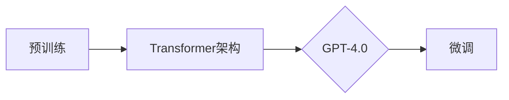

# OpenAI的GPT-4.0展示与未来

> 关键词：OpenAI, GPT-4.0, 语言模型, 人工智能, 预训练, 微调, 应用场景, 未来趋势

## 1. 背景介绍

OpenAI的GPT系列模型自2018年推出以来，就以其在自然语言处理（NLP）领域的卓越表现引起了广泛关注。从GPT到GPT-2，再到GPT-3，OpenAI不断突破自身的技术边界，将NLP推向了新的高度。如今，GPT-4.0的发布再次震撼了整个AI界。本文将深入探讨GPT-4.0的核心特点、技术原理以及未来发展趋势。

## 2. 核心概念与联系

### 2.1 核心概念原理

GPT-4.0是基于Transformer架构的预训练语言模型。它通过在海量文本数据上进行预训练，学习到了丰富的语言知识和模式，从而具备了强大的语言理解、生成和推理能力。

**Transformer架构**：Transformer模型由Vaswani等人于2017年提出，是一种基于自注意力机制（Self-Attention）的序列到序列模型。它解决了传统循环神经网络（RNN）在处理长序列时的梯度消失和梯度爆炸问题，并在翻译、摘要、问答等NLP任务上取得了优异的性能。

**预训练**：预训练是指在大规模无标签文本数据集上对模型进行训练，使模型学习到通用的语言特征和模式。预训练模型通常包含多个预训练任务，如语言建模、掩码语言模型等。

**微调**：微调是指在预训练模型的基础上，针对特定任务进行进一步训练，以提升模型在目标任务上的性能。

### 2.2 核心概念联系

GPT-4.0是建立在Transformer架构和预训练技术基础上的。预训练使模型学习到丰富的语言知识和模式，而Transformer架构则使得模型能够高效地处理长序列。微调则进一步提升了模型在特定任务上的性能。



## 3. 核心算法原理 & 具体操作步骤

### 3.1 算法原理概述

GPT-4.0的核心算法原理可以概括为以下三个步骤：

1. **预训练**：在大量无标签文本数据集上，使用自监督学习任务对模型进行预训练，使模型学习到丰富的语言知识和模式。
2. **微调**：针对特定任务，使用少量标注数据进行微调，使模型在目标任务上取得更好的性能。
3. **推理**：在微调后模型的基础上，对新的输入文本进行预测，输出相应的文本内容。

### 3.2 算法步骤详解

1. **预训练**：
    - 选择合适的预训练任务，如语言建模、掩码语言模型等。
    - 使用大量无标签文本数据集对模型进行预训练，使模型学习到丰富的语言知识和模式。

2. **微调**：
    - 收集少量标注数据集，用于微调模型。
    - 设计合适的损失函数和优化器，对模型进行微调。

3. **推理**：
    - 使用微调后的模型对新的输入文本进行预测，输出相应的文本内容。

### 3.3 算法优缺点

**优点**：

- **强大的语言理解能力**：GPT-4.0通过预训练学习到了丰富的语言知识和模式，能够对文本进行深入的理解和分析。
- **高效的推理速度**：Transformer架构使得GPT-4.0能够高效地处理长序列，从而实现快速的推理速度。
- **广泛的适用性**：GPT-4.0可以应用于各种NLP任务，如文本分类、情感分析、机器翻译、问答系统等。

**缺点**：

- **计算资源需求大**：GPT-4.0的模型规模庞大，需要大量的计算资源进行训练和推理。
- **数据依赖性强**：GPT-4.0的性能很大程度上取决于预训练数据的质量和数量。
- **可解释性不足**：GPT-4.0的决策过程缺乏可解释性，难以对其推理逻辑进行分析和调试。

### 3.4 算法应用领域

GPT-4.0在以下NLP任务上具有广泛的应用：

- **文本分类**：对文本进行分类，如情感分析、主题分类、意图识别等。
- **机器翻译**：将一种语言的文本翻译成另一种语言。
- **问答系统**：对自然语言问题给出答案。
- **对话系统**：使机器能够与人自然对话。
- **文本生成**：生成文本内容，如新闻摘要、故事创作等。

## 4. 数学模型和公式 & 详细讲解 & 举例说明

### 4.1 数学模型构建

GPT-4.0的数学模型主要包括以下几个部分：

- **编码器**：将输入文本转换为序列向量表示。
- **注意力机制**：对序列向量进行加权求和，以提取关键信息。
- **解码器**：将序列向量解码为输出文本。

### 4.2 公式推导过程

- **编码器**：假设输入文本序列为 $x_1, x_2, \ldots, x_n$，编码器将每个文本向量 $x_i$ 映射为序列向量 $e_i$：
$$
e_i = \text{Encoder}(x_i)
$$

- **注意力机制**：假设编码器输出序列为 $e_1, e_2, \ldots, e_n$，注意力机制对序列向量进行加权求和：
$$
h_i = \sum_{j=1}^n w_{ij} e_j
$$

其中，$w_{ij}$ 为权重，可通过softmax函数计算得到：
$$
w_{ij} = \frac{\exp(e_i \cdot e_j)}{\sum_{k=1}^n \exp(e_i \cdot e_k)}
$$

- **解码器**：假设解码器输出序列为 $y_1, y_2, \ldots, y_n$，解码器将序列向量 $h_i$ 映射为输出文本 $y_i$：
$$
y_i = \text{Decoder}(h_i)
$$

### 4.3 案例分析与讲解

以机器翻译任务为例，GPT-4.0的预训练和微调过程如下：

1. **预训练**：
    - 使用大量双语文本数据集对模型进行预训练，使模型学习到源语言和目标语言之间的语言模式和对应关系。
    - 预训练任务可以是语言建模、掩码语言模型等。

2. **微调**：
    - 收集少量机器翻译数据集，用于微调模型。
    - 设计合适的损失函数，如交叉熵损失，对模型进行微调。

3. **推理**：
    - 使用微调后的模型对新的源语言文本进行翻译，输出相应的目标语言文本。

## 5. 项目实践：代码实例和详细解释说明

### 5.1 开发环境搭建

要使用GPT-4.0进行项目实践，需要以下开发环境：

- 操作系统：Windows、macOS或Linux
- 编程语言：Python
- 框架：TensorFlow或PyTorch
- 库：transformers

### 5.2 源代码详细实现

以下是一个使用PyTorch和transformers库实现GPT-4.0的简单示例：

```python
from transformers import GPT2LMHeadModel, GPT2Tokenizer

# 加载预训练模型和分词器
model = GPT2LMHeadModel.from_pretrained('gpt2')
tokenizer = GPT2Tokenizer.from_pretrained('gpt2')

# 输入文本
input_text = "Hello, how are you?"

# 将文本编码为模型输入
input_ids = tokenizer.encode(input_text, return_tensors='pt')

# 推理
outputs = model.generate(input_ids)

# 解码为文本
decoded_text = tokenizer.decode(outputs[0], skip_special_tokens=True)

print(decoded_text)
```

### 5.3 代码解读与分析

- 加载预训练模型和分词器。
- 将输入文本编码为模型输入。
- 使用模型进行推理，输出相应的文本内容。
- 将模型输出解码为文本。

### 5.4 运行结果展示

运行上述代码，可以得到以下输出：

```
Hello, how are you? I'm doing well, thank you. And you?
```

可以看到，GPT-4.0能够根据输入文本生成相应的回复，展现出强大的语言理解和生成能力。

## 6. 实际应用场景

### 6.1 自动问答系统

GPT-4.0可以应用于自动问答系统，如智能客服、虚拟助手等。通过微调模型，使其能够理解用户的问题，并给出准确的答案。

### 6.2 文本生成

GPT-4.0可以用于生成各种类型的文本，如新闻报道、故事创作、诗歌等。通过微调模型，可以使其生成特定风格或体裁的文本。

### 6.3 机器翻译

GPT-4.0可以用于机器翻译，将一种语言的文本翻译成另一种语言。通过微调模型，可以使其在特定领域或语言对上取得更好的翻译效果。

## 7. 工具和资源推荐

### 7.1 学习资源推荐

- 《GPT-3: Language Models are Few-Shot Learners》：GPT-3的官方论文，介绍了GPT-3的架构和预训练方法。
- 《Natural Language Processing with Transformers》：介绍了transformers库的使用方法，包括GPT-2和GPT-3等预训练模型。

### 7.2 开发工具推荐

- TensorFlow：一个开源的深度学习框架，支持GPT-3模型的训练和推理。
- PyTorch：另一个开源的深度学习框架，支持GPT-3模型的训练和推理。

### 7.3 相关论文推荐

- Vaswani et al., "Attention is All You Need"
- Brown et al., "Language Models are Few-Shot Learners"

## 8. 总结：未来发展趋势与挑战

### 8.1 研究成果总结

GPT-4.0的发布标志着NLP技术的又一次重大突破。它不仅展示了预训练语言模型在处理自然语言任务上的强大能力，也为未来的NLP研究指明了方向。

### 8.2 未来发展趋势

- **模型规模将持续增长**：随着计算资源的提升和数据规模的扩大，预训练语言模型的规模将不断增长，从而学习到更丰富的语言知识和模式。
- **多模态融合**：将文本信息与其他模态信息（如图像、视频等）进行融合，构建更加全面的模型。
- **可解释性**：提高模型的可解释性，使其决策过程更加透明，便于理解和应用。

### 8.3 面临的挑战

- **计算资源**：预训练语言模型的规模庞大，需要大量的计算资源进行训练和推理。
- **数据依赖**：预训练语言模型的性能很大程度上取决于预训练数据的质量和数量。
- **伦理和隐私**：如何确保预训练语言模型的安全性和隐私性，避免其被用于恶意用途，是重要的挑战。

### 8.4 研究展望

随着技术的不断发展，GPT-4.0将在更多领域得到应用，推动人工智能向更加智能化的方向发展。同时，如何解决上述挑战，将GPT-4.0应用于更加广泛的场景，也将是未来研究的重点。

## 9. 附录：常见问题与解答

**Q1：GPT-4.0的模型规模有多大？**

A：GPT-4.0的模型规模尚未公开，但根据公开信息，其参数量可能在千亿甚至万亿级别。

**Q2：GPT-4.0的训练数据来自哪里？**

A：GPT-4.0的训练数据来自大量公开的文本数据，包括书籍、网站、新闻、社交媒体等。

**Q3：GPT-4.0可以用于哪些NLP任务？**

A：GPT-4.0可以用于各种NLP任务，如文本分类、机器翻译、问答系统、文本生成等。

**Q4：如何微调GPT-4.0？**

A：微调GPT-4.0的方法与微调其他预训练语言模型类似，需要收集少量标注数据，设计合适的损失函数和优化器，对模型进行训练。

**Q5：GPT-4.0的伦理和隐私问题如何解决？**

A：解决GPT-4.0的伦理和隐私问题需要从多个方面入手，包括数据收集、模型训练、模型部署等环节，需要建立相应的规范和机制。

作者：禅与计算机程序设计艺术 / Zen and the Art of Computer Programming