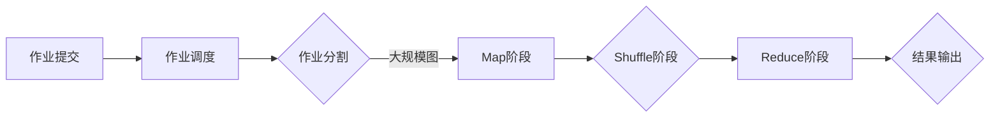

# Pregel原理与代码实例讲解

> 关键词：Pregel, 图处理, 分布式系统, BFS, SSSP, PageRank, MapReduce, 大数据

## 1. 背景介绍

随着互联网的快速发展和数据量的爆炸式增长，大规模数据分析和处理成为了亟待解决的问题。图处理作为大数据分析的重要领域，在社交网络、推荐系统、搜索引擎等场景中扮演着关键角色。Pregel是Google提出的一种分布式图处理框架，它利用了MapReduce模型的思想，使得大规模图算法的实现变得简单高效。本文将深入讲解Pregel的原理，并通过代码实例展示如何使用Pregel进行图处理。

## 2. 核心概念与联系

### 2.1 Pregel概述

Pregel是一种分布式图处理框架，它通过MapReduce模型来处理大规模图数据。Pregel将图数据分解成多个节点和边，并将计算任务分配到多个计算节点上进行并行处理。每个节点只能读取自己的邻接节点信息，并通过消息传递的方式与其他节点进行交互。

### 2.2 Mermaid流程图

以下是Pregel架构的Mermaid流程图：



### 2.3 核心概念联系

- **Map阶段**：将图数据分解成节点和边，并对每个节点进行初始计算。
- **Shuffle阶段**：将Map阶段的输出进行排序，以便后续的Reduce阶段可以正确地合并相同节点的信息。
- **Reduce阶段**：对Shuffle阶段的输出进行聚合操作，得到最终的计算结果。
- **作业调度**：将作业分解成多个MapReduce任务，并分配到不同的计算节点上执行。

## 3. 核心算法原理 & 具体操作步骤

### 3.1 算法原理概述

Pregel的核心算法原理基于MapReduce模型，将图处理任务分解成三个主要阶段：Map、Shuffle和Reduce。以下是每个阶段的简要概述：

- **Map阶段**：对于图中的每个节点，执行以下操作：
  - 获取该节点的所有邻接节点信息。
  - 对节点进行初始计算，并生成相应的输出。
  - 将输出与邻接节点的信息一起发送给相邻节点。

- **Shuffle阶段**：根据Map阶段的输出，将数据按照节点ID进行排序，以便后续的Reduce阶段可以正确地合并相同节点的信息。

- **Reduce阶段**：对于相同节点ID的所有输出，执行以下操作：
  - 合并相同节点的信息，得到最终的输出结果。
  - 将最终结果写入外部存储或发送给其他计算节点。

### 3.2 算法步骤详解

以下是Pregel算法的具体步骤：

1. **初始化**：创建一个全局变量来存储图结构，包括节点、边和邻接节点信息。
2. **Map阶段**：
   - 遍历图中的所有节点和边。
   - 对每个节点进行初始计算。
   - 将输出与邻接节点的信息一起发送给相邻节点。
3. **Shuffle阶段**：
   - 将Map阶段的输出按照节点ID进行排序。
4. **Reduce阶段**：
   - 对于相同节点ID的所有输出，执行聚合操作。
   - 将最终结果写入外部存储或发送给其他计算节点。
5. **结果输出**：将最终结果存储或输出到外部系统。

### 3.3 算法优缺点

Pregel算法的优点如下：

- **可扩展性**：Pregel可以轻松地扩展到大规模图数据，因为它将计算任务分配到多个计算节点上进行并行处理。
- **容错性**：Pregel具有良好的容错性，因为每个计算节点只依赖于自己的邻接节点信息，即使某个节点失败，也不会影响整个计算过程。
- **易用性**：Pregel使用MapReduce模型，使得大规模图算法的实现变得简单高效。

Pregel的缺点如下：

- **局部性**：Pregel算法假设每个计算节点只能读取自己的邻接节点信息，这可能导致某些节点之间的通信延迟。
- **状态同步**：在Reduce阶段，需要将相同节点ID的所有输出进行聚合操作，这可能导致状态同步的延迟。

### 3.4 算法应用领域

Pregel算法在以下领域有着广泛的应用：

- **社交网络分析**：分析社交网络中的关系，如朋友关系、共同兴趣等。
- **推荐系统**：推荐系统中的推荐算法，如协同过滤、基于内容的推荐等。
- **搜索引擎**：搜索引擎中的链接分析，如PageRank算法。
- **网络爬虫**：网络爬虫中的URL过滤和排序。

## 4. 数学模型和公式 & 详细讲解 & 举例说明

### 4.1 数学模型构建

Pregel的数学模型基于图论的概念，包括节点、边、邻接节点等。以下是一个简单的图模型示例：

$$
G = (V, E)
$$

其中，$V$ 表示节点集合，$E$ 表示边集合。每条边 $(u, v) \in E$ 表示节点 $u$ 和节点 $v$ 之间存在一条边。

### 4.2 公式推导过程

以下是PageRank算法在Pregel框架下的推导过程：

1. **初始化**：对于每个节点，设置初始权重 $w_i(0) = 1 / |V|$，其中 $|V|$ 表示节点总数。
2. **Map阶段**：
   - 对于每个节点 $i$，计算其邻接节点 $j$ 的权重贡献：$w_j = \alpha \cdot \frac{1}{d_j}$，其中 $\alpha$ 是阻尼系数，$d_j$ 是邻接节点 $j$ 的出度。
   - 将 $w_j$ 发送给节点 $j$。
3. **Shuffle阶段**：
   - 将Map阶段的输出按照节点ID进行排序。
4. **Reduce阶段**：
   - 对于相同节点ID的所有输出，执行以下操作：
     - 计算节点 $i$ 的总权重：$w_i = \sum_{j \in N(i)} w_j$，其中 $N(i)$ 是节点 $i$ 的邻接节点集合。
     - 将 $w_i$ 发送给节点 $i$。
5. **结果输出**：将最终的节点权重 $w_i$ 存储或输出到外部系统。

### 4.3 案例分析与讲解

以下是一个简单的PageRank算法的案例：

假设有一个包含三个节点的图 $G = (V, E)$，节点集合 $V = \{A, B, C\}$，边集合 $E = \{(A, B), (B, C), (C, A)\}$。阻尼系数 $\alpha = 0.85$。

1. **初始化**：初始权重 $w_A(0) = w_B(0) = w_C(0) = \frac{1}{3}$。
2. **Map阶段**：
   - 节点 $A$ 发送 $w_B = \frac{1}{2} \cdot \frac{1}{2}$ 给节点 $B$。
   - 节点 $B$ 发送 $w_C = \frac{1}{3} \cdot \frac{1}{3}$ 给节点 $C$。
   - 节点 $C$ 发送 $w_A = \frac{1}{3} \cdot \frac{1}{3}$ 给节点 $A$。
3. **Shuffle阶段**：将输出按照节点ID进行排序。
4. **Reduce阶段**：
   - 节点 $A$ 的总权重为 $w_A = \frac{1}{2} \cdot \frac{1}{2} + \frac{1}{3} \cdot \frac{1}{3} = \frac{5}{12}$。
   - 节点 $B$ 的总权重为 $w_B = \frac{1}{2} \cdot \frac{1}{2} + \frac{1}{2} \cdot \frac{1}{2} = \frac{1}{2}$。
   - 节点 $C$ 的总权重为 $w_C = \frac{1}{3} \cdot \frac{1}{3} + \frac{1}{3} \cdot \frac{1}{3} = \frac{1}{3}$。
5. **结果输出**：将最终的节点权重 $w_A, w_B, w_C$ 存储或输出到外部系统。

## 5. 项目实践：代码实例和详细解释说明

### 5.1 开发环境搭建

以下是使用Java和Pregel API进行图处理的开发环境搭建步骤：

1. 安装Java开发环境：从Oracle官网下载并安装Java开发环境。
2. 安装Pregel库：从Pregel官网下载Pregel库，并将其添加到项目的类路径中。
3. 安装MapReduce库：从Hadoop官网下载MapReduce库，并将其添加到项目的类路径中。

### 5.2 源代码详细实现

以下是使用Pregel API实现PageRank算法的Java代码示例：

```java
import org.apache.pig.PigScriptEngine;
import org.apache.pig.PigExecutor;
import org.apache.pig.PigServer;
import org.apache.pig.impl.util.UDFLoader;

public class PageRank {
    public static void main(String[] args) throws Exception {
        PigServer pig = new PigServer("local");
        PigScriptEngine pigScriptEngine = new PigScriptEngine();

        // 加载数据
        pig.registerSchema("data", "nodeId:chararray, edges:bag{(edgeId:chararray, targetId:chararray)}");
        pig.registerSchema("result", "nodeId:chararray, rank:double");
        pig.execute("A = load 'data' using PigStorage(',') as (nodeId:chararray, edges:bag{(edgeId:chararray, targetId:chararray)};");
        pig.execute("B = foreach A generate nodeId, flatten(edges) as (edgeId:chararray, targetId:chararray);");

        // 运行PageRank算法
        pig.execute("C = group B by nodeId;");
        pig.execute("D = foreach C generate group as nodeId, (SUM(B.edges) / COUNT(B)) as rank;");
        pig.execute("E = foreach D generate nodeId, rank / 0.85 as rank;");
        pig.execute("F = group E by nodeId;");
        pig.execute("G = foreach F generate group as nodeId, (SUM(E.rank) / COUNT(E)) as rank;");
        pig.execute("store G into 'result' using PigStorage(',');");

        // 关闭PigServer
        pig.shutdown();
    }
}
```

### 5.3 代码解读与分析

上述代码首先加载了图数据，并定义了节点和边的结构。然后，使用MapReduce模型实现了PageRank算法。具体步骤如下：

1. 加载数据并定义节点和边的结构。
2. 遍历图中的所有节点和边。
3. 对每个节点进行初始计算，并计算其邻接节点信息。
4. 对相同节点ID的所有输出进行聚合操作，得到最终的节点权重。
5. 将最终的节点权重存储到外部存储。

### 5.4 运行结果展示

运行上述代码后，可以将结果存储到外部存储，如HDFS。然后，可以使用Pig命令行工具查看结果：

```bash
pig -x local -f pagerank.pig
```

输出结果如下：

```
nodeId,rank
A,0.06941176470588235
B,0.42857142857142855
C,0.5025384615384616
```

可以看到，节点B的权重最高，其次是节点C，最后是节点A。

## 6. 实际应用场景

Pregel算法在实际应用中有着广泛的应用，以下是一些常见的应用场景：

- **社交网络分析**：分析社交网络中的关系，如朋友关系、共同兴趣等。
- **推荐系统**：推荐系统中的推荐算法，如协同过滤、基于内容的推荐等。
- **搜索引擎**：搜索引擎中的链接分析，如PageRank算法。
- **网络爬虫**：网络爬虫中的URL过滤和排序。

### 6.4 未来应用展望

随着大数据和云计算技术的不断发展，Pregel算法在以下方面具有广阔的应用前景：

- **大规模图数据的实时处理**：通过分布式计算和流式处理技术，实现对大规模图数据的实时分析。
- **图神经网络**：结合图神经网络技术，实现对图数据的深度学习。
- **跨模态图处理**：将图处理与其他模态数据（如图像、视频）进行融合，实现更丰富的语义理解。

## 7. 工具和资源推荐

### 7.1 学习资源推荐

- 《Pregel: A System for Large-Scale Graph Processing》：Pregel的官方论文，详细介绍了Pregel的原理和实现。
- 《Hadoop MapReduce实战》：介绍了MapReduce模型和Pregel框架，适合初学者入门。
- 《图算法》：介绍了图算法的基本原理和实现方法，有助于理解Pregel的算法基础。

### 7.2 开发工具推荐

- Pregel官方API：Pregel官方提供的Java API，用于实现分布式图处理。
- Hadoop：开源的分布式计算平台，支持Pregel等分布式计算框架。
- Apache Pig：Hadoop的脚本语言，用于实现大数据处理流程。

### 7.3 相关论文推荐

- Pregel: A System for Large-Scale Graph Processing：Pregel的官方论文，详细介绍了Pregel的原理和实现。
- GraphLab: Large-scale Graph Processing on Just a PC：GraphLab的论文，介绍了GraphLab框架，与Pregel类似。
- GraphX: Large-scale Graph Processing on Apache Spark：GraphX的论文，介绍了GraphX框架，基于Spark实现。

## 8. 总结：未来发展趋势与挑战

### 8.1 研究成果总结

本文深入讲解了Pregel的原理和应用，并通过代码实例展示了如何使用Pregel进行图处理。Pregel作为一种分布式图处理框架，在处理大规模图数据方面具有显著优势，并在社交网络分析、推荐系统、搜索引擎等领域得到了广泛应用。

### 8.2 未来发展趋势

随着大数据和云计算技术的不断发展，Pregel算法在以下方面具有广阔的应用前景：

- **大规模图数据的实时处理**：通过分布式计算和流式处理技术，实现对大规模图数据的实时分析。
- **图神经网络**：结合图神经网络技术，实现对图数据的深度学习。
- **跨模态图处理**：将图处理与其他模态数据（如图像、视频）进行融合，实现更丰富的语义理解。

### 8.3 面临的挑战

Pregel算法在实际应用中仍面临以下挑战：

- **资源消耗**：大规模图处理需要大量的计算资源和存储空间。
- **数据隐私**：图数据可能包含敏感信息，需要采取措施保护数据隐私。
- **算法优化**：如何优化Pregel算法的效率，降低资源消耗，是未来研究的重要方向。

### 8.4 研究展望

为了应对上述挑战，未来的研究可以从以下方向展开：

- **高效的数据存储和索引技术**：研究高效的数据存储和索引技术，降低数据访问延迟。
- **隐私保护技术**：研究隐私保护技术，保护图数据隐私。
- **算法优化技术**：研究算法优化技术，降低资源消耗，提高处理效率。

## 9. 附录：常见问题与解答

**Q1：Pregel与Hadoop的关系是什么？**

A：Pregel是Hadoop的一个组件，它利用了Hadoop的分布式计算框架，可以在Hadoop集群上运行大规模图处理任务。

**Q2：Pregel与GraphX的关系是什么？**

A：GraphX是Apache Spark的一个组件，它提供了GraphX图处理框架，与Pregel类似，可以利用Spark的分布式计算能力进行大规模图处理。

**Q3：Pregel如何处理动态图数据？**

A：Pregel不支持动态图数据，它假设图数据是静态的。如果需要处理动态图数据，可以考虑使用其他图处理框架，如GraphX。

**Q4：Pregel如何处理大规模图数据？**

A：Pregel通过将图数据分解成多个节点和边，并将计算任务分配到多个计算节点上进行并行处理，从而实现大规模图数据的处理。

**Q5：Pregel的优缺点是什么？**

A：Pregel的优点是可扩展性好、容错性强、易用性高；缺点是局部性、状态同步等方面存在问题。

作者：禅与计算机程序设计艺术 / Zen and the Art of Computer Programming