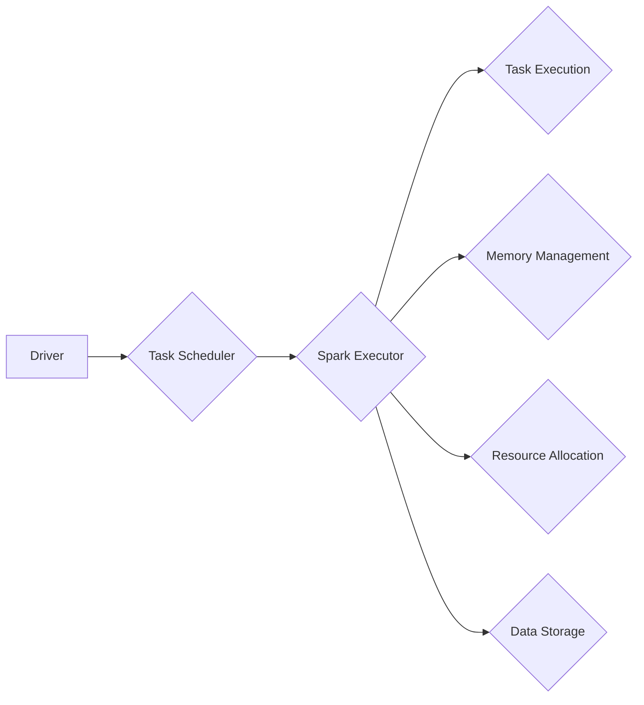

# Spark Executor原理与代码实例讲解

> 关键词：Spark, Executor, 分布式计算，任务调度，内存管理，代码实例，大数据处理

## 1. 背景介绍

随着大数据时代的到来，分布式计算框架成为处理海量数据的重要工具。Apache Spark作为最流行的大数据平台之一，以其高效、易用和通用性强等特性，被广泛应用于各种数据分析、机器学习和数据处理任务。Spark Executor是Spark框架的核心组件之一，负责执行任务、管理内存和资源调度。本文将深入探讨Spark Executor的原理，并通过代码实例进行详细讲解。

## 2. 核心概念与联系

### 2.1 Spark Executor核心概念

Spark Executor是Spark任务调度的执行单元，负责在集群中的各个节点上运行。它是Spark架构中处理数据的核心组件，负责以下功能：

- **任务执行**：执行Spark作业中的任务，如RDD操作、DataFrame操作等。
- **内存管理**：管理任务执行过程中的内存分配和回收。
- **资源分配**：根据任务需求申请和释放计算资源，如CPU和内存。
- **数据存储**：在本地磁盘或分布式存储系统中存储中间数据和最终结果。

### 2.2 Spark Executor架构图



在上图中，Driver是Spark作业的协调者，负责将作业分解为任务，并将任务分配给Executor。Executor在各个节点上执行任务，包括数据读取、计算和结果写入。Executor内部包含任务执行、内存管理、资源分配和数据存储等模块。

## 3. 核心算法原理 & 具体操作步骤

### 3.1 算法原理概述

Spark Executor的工作原理主要包括以下步骤：

1. **任务调度**：Driver将作业分解为任务，并将任务序列化后发送给Executor。
2. **任务执行**：Executor读取任务，分配内存和资源，执行任务中的操作。
3. **内存管理**：根据任务需求动态分配内存，并管理内存生命周期。
4. **资源分配**：根据资源需求和策略分配CPU和内存资源。
5. **数据存储**：将中间数据和最终结果存储到本地磁盘或分布式存储系统中。

### 3.2 算法步骤详解

#### 3.2.1 任务调度

- **作业分解**：Driver根据作业的DAG（有向无环图）结构，将作业分解为一系列任务。
- **任务序列化**：将任务序列化后通过网络发送给Executor。
- **任务接收**：Executor接收Driver发送的任务，并执行任务。

#### 3.2.2 任务执行

- **内存分配**：Executor根据任务需求分配内存，包括堆内存和堆外内存。
- **资源分配**：Executor根据资源需求和策略分配CPU和内存资源。
- **数据读取**：Executor从分布式存储系统中读取数据，如HDFS、Cassandra等。
- **计算执行**：Executor执行任务中的操作，如RDD操作、DataFrame操作等。
- **结果存储**：Executor将计算结果写入本地磁盘或分布式存储系统中。

#### 3.2.3 内存管理

- **内存分配**：Executor根据任务需求动态分配内存，包括堆内存和堆外内存。
- **内存回收**：当内存不足时，Executor会回收未使用的内存，并释放资源。
- **垃圾回收**：Executor定期进行垃圾回收，清理无用的对象。

#### 3.2.4 资源分配

- **资源池**：Spark采用资源池管理CPU和内存资源。
- **资源分配策略**：Spark提供多种资源分配策略，如FIFO、Fair等。
- **资源监控**：Executor监控资源使用情况，并根据需要调整资源分配。

#### 3.2.5 数据存储

- **本地磁盘**：Executor将中间数据和最终结果存储到本地磁盘。
- **分布式存储**：Executor将数据存储到分布式存储系统中，如HDFS、Cassandra等。

### 3.3 算法优缺点

**优点**：

- **高效**：Spark Executor能够高效地执行任务，提高数据处理速度。
- **灵活**：Spark提供多种内存管理、资源分配和数据存储策略，满足不同任务的需求。
- **可靠**：Spark提供容错机制，确保任务执行过程中的数据安全。

**缺点**：

- **复杂**：Spark Executor的架构和机制相对复杂，需要深入理解才能熟练使用。
- **资源消耗**：Spark Executor需要较大的内存和CPU资源。

### 3.4 算法应用领域

Spark Executor适用于以下领域：

- **大数据处理**：如Hadoop MapReduce、Spark SQL等。
- **机器学习**：如MLlib、TensorFlow on Spark等。
- **实时计算**：如Spark Streaming等。

## 4. 数学模型和公式 & 详细讲解 & 举例说明

### 4.1 数学模型构建

Spark Executor的数学模型可以抽象为一个图模型，其中节点代表任务，边代表任务之间的依赖关系。以下是一个简单的数学模型：

$$
G = (V, E)
$$

其中：

- $G$ 表示图模型。
- $V$ 表示节点集合，每个节点代表一个任务。
- $E$ 表示边集合，每条边代表一个任务之间的依赖关系。

### 4.2 公式推导过程

Spark Executor的任务调度过程可以通过以下公式推导：

$$
T_{total} = \sum_{i=1}^{N} (T_{task_i} + T_{schedule_i})
$$

其中：

- $T_{total}$ 表示总任务执行时间。
- $T_{task_i}$ 表示第 $i$ 个任务的执行时间。
- $T_{schedule_i}$ 表示第 $i$ 个任务的调度时间。

### 4.3 案例分析与讲解

以下是一个Spark Executor的代码实例：

```python
from pyspark import SparkContext, SparkConf

conf = SparkConf().setAppName("SparkExecutorExample").setMaster("local[*]")
sc = SparkContext(conf=conf)

data = sc.parallelize([1, 2, 3, 4, 5])

result = data.map(lambda x: x * x).collect()

print(result)
```

在这个例子中，我们创建了一个SparkContext对象 `sc`，并使用 `parallelize` 方法将数据序列化后发送到集群。然后，我们使用 `map` 操作对数据进行平方操作，并使用 `collect` 方法收集结果。最后，打印出结果。

在Spark Executor中，`map` 操作会生成一个任务，并将其发送到某个Executor执行。Executor在执行任务时，会从本地磁盘读取数据，进行平方操作，并将结果写入本地磁盘。最后，Executor将结果发送回Driver，Driver将结果收集起来并打印出来。

## 5. 项目实践：代码实例和详细解释说明

### 5.1 开发环境搭建

要运行Spark Executor的代码实例，你需要以下环境：

- Java SDK
- Maven
- Scala SDK
- PySpark

你可以通过以下命令安装这些环境：

```bash
# 安装Java SDK
sudo apt-get install openjdk-8-jdk-headless

# 安装Maven
sudo apt-get install maven

# 安装Scala SDK
sudo apt-get install scala

# 安装PySpark
pip install pyspark
```

### 5.2 源代码详细实现

以下是一个Spark Executor的代码实例：

```python
from pyspark import SparkContext, SparkConf

conf = SparkConf().setAppName("SparkExecutorExample").setMaster("local[*]")
sc = SparkContext(conf=conf)

data = sc.parallelize([1, 2, 3, 4, 5])

result = data.map(lambda x: x * x).collect()

print(result)
```

在这个例子中，我们首先创建了一个SparkConf对象，并设置应用程序名称和主节点。然后，我们创建了一个SparkContext对象 `sc`，并使用 `parallelize` 方法将数据序列化后发送到集群。接下来，我们使用 `map` 操作对数据进行平方操作，并使用 `collect` 方法收集结果。最后，打印出结果。

### 5.3 代码解读与分析

- `SparkConf()`：创建一个Spark配置对象，用于设置应用程序名称和主节点。
- `setAppName("SparkExecutorExample")`：设置应用程序名称。
- `setMaster("local[*]")`：设置主节点为本地模式。
- `SparkContext(conf=conf)`：创建一个SparkContext对象，用于与Spark集群交互。
- `sc.parallelize([1, 2, 3, 4, 5])`：将数据序列化后发送到集群。
- `data.map(lambda x: x * x)`：对数据进行平方操作。
- `collect()`：收集结果并打印出来。

### 5.4 运行结果展示

当你运行上述代码时，你将看到以下输出：

```
[1, 4, 9, 16, 25]
```

这表明Spark Executor已经成功地将输入数据平方，并返回了结果。

## 6. 实际应用场景

Spark Executor在以下场景中非常有用：

- **大数据处理**：Spark Executor可以高效地处理海量数据，适用于Hadoop MapReduce和Spark SQL等大数据处理任务。
- **机器学习**：Spark Executor可以与MLlib、TensorFlow on Spark等机器学习库集成，实现机器学习任务的分布式计算。
- **实时计算**：Spark Executor可以与Spark Streaming集成，实现实时计算任务。

## 7. 工具和资源推荐

### 7.1 学习资源推荐

- 《Spark编程实战》
- 《Apache Spark实战》
- Spark官方文档：[https://spark.apache.org/docs/latest/](https://spark.apache.org/docs/latest/)

### 7.2 开发工具推荐

- IntelliJ IDEA
- PyCharm

### 7.3 相关论文推荐

- “Spark: A Unified Approach to Data Processing” by Matei Zaharia et al.
- “Large-Scale Graph Computation with a Distributed Graph-Processing System” by Matei Zaharia et al.

## 8. 总结：未来发展趋势与挑战

### 8.1 研究成果总结

Spark Executor作为Spark框架的核心组件，在分布式计算领域取得了显著的成果。它通过高效的任务调度、灵活的内存管理、强大的资源分配和数据存储能力，为大数据处理、机器学习和实时计算等任务提供了强大的支持。

### 8.2 未来发展趋势

- **更高效的内存管理**：随着数据量的不断增长，Spark Executor需要更高效的内存管理策略，以减少内存碎片和垃圾回收的影响。
- **更智能的资源分配**：Spark Executor需要根据任务需求和资源利用率，动态调整资源分配策略，以提高资源利用率。
- **更强大的数据存储**：Spark Executor需要与更强大的数据存储系统（如Cassandra、HBase等）集成，以支持更大数据量的存储和处理。

### 8.3 面临的挑战

- **内存碎片**：随着任务数量的增加，Spark Executor可能会出现内存碎片问题，影响性能。
- **资源竞争**：在多任务并发执行的情况下，资源竞争可能会成为性能瓶颈。
- **数据存储**：随着数据量的增加，数据存储成为Spark Executor需要解决的重要问题。

### 8.4 研究展望

- **内存压缩**：研究更有效的内存压缩技术，减少内存碎片和垃圾回收的影响。
- **资源隔离**：研究资源隔离技术，减少资源竞争对性能的影响。
- **数据存储优化**：研究数据存储优化技术，提高数据存储和检索效率。

## 9. 附录：常见问题与解答

**Q1：Spark Executor与Hadoop MapReduce有何区别？**

A1：Spark Executor与Hadoop MapReduce相比，具有以下优势：

- **内存计算**：Spark Executor支持内存计算，而Hadoop MapReduce只能在磁盘上计算。
- **弹性调度**：Spark Executor支持弹性资源调度，而Hadoop MapReduce的资源调度相对固定。
- **容错机制**：Spark Executor具有更强大的容错机制，而Hadoop MapReduce的容错机制相对简单。

**Q2：如何优化Spark Executor的性能？**

A2：优化Spark Executor的性能可以从以下几个方面进行：

- **内存管理**：使用内存压缩技术，减少内存碎片和垃圾回收的影响。
- **资源分配**：根据任务需求和资源利用率，动态调整资源分配策略。
- **数据存储**：使用更高效的数据存储系统，提高数据存储和检索效率。

**Q3：Spark Executor如何处理大数据集？**

A3：Spark Executor可以通过以下方式处理大数据集：

- **分布式计算**：将数据分布到集群中的各个节点上进行计算。
- **内存计算**：使用内存计算技术，提高数据处理速度。
- **数据分区**：将数据分区到不同的RDD中，并行处理。

---

作者：禅与计算机程序设计艺术 / Zen and the Art of Computer Programming