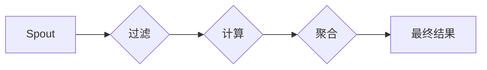

# Storm Topology原理与代码实例讲解

> 关键词：Storm，实时计算，分布式流处理，拓扑结构，组件，Spout，Bolt，流式数据处理，容错机制，消息队列

## 1. 背景介绍

随着大数据时代的到来，实时处理和分析海量数据成为了许多企业和组织的迫切需求。Apache Storm作为一个开源的分布式流处理框架，能够以低延迟、高可靠性的方式对实时数据进行处理。Storm Topology是Storm的核心概念，它定义了数据流处理的流程和组件之间的连接关系。本文将深入讲解Storm Topology的原理，并通过代码实例展示如何构建和使用Topology。

### 1.1 问题的由来

传统的批处理系统如Hadoop在处理实时数据时存在延迟高、灵活性差等问题。为了满足实时数据处理的需求，Apache Storm应运而生。Storm提供了一种低延迟、高可靠性的实时数据处理解决方案，能够处理每秒数百万条消息。

### 1.2 研究现状

Apache Storm自2011年开源以来，已经发展成为一个成熟的开源项目，被广泛应用于金融、电商、社交网络等多个领域。Storm支持多种编程语言，包括Java、Python、Scala等，使得开发人员可以根据自己的喜好和项目需求选择合适的开发语言。

### 1.3 研究意义

掌握Storm Topology的原理和实现方法，对于开发实时数据处理系统具有重要意义：

- 提高数据处理速度和效率。
- 增强系统的可靠性，减少数据丢失和错误。
- 提供灵活的数据处理流程，满足不同业务需求。

### 1.4 本文结构

本文将按照以下结构进行讲解：

- 介绍Storm Topology的核心概念和架构。
- 解释Storm Topology的组件和它们之间的关系。
- 通过代码实例展示如何构建和使用Storm Topology。
- 探讨Storm Topology在实际应用场景中的应用。
- 展望Storm Topology的未来发展趋势和挑战。

## 2. 核心概念与联系

### 2.1 核心概念原理

Storm Topology是Storm中最核心的概念，它定义了数据流处理的流程和组件之间的连接关系。一个Storm Topology由多个组件组成，包括Spout、Bolt和流。

- **Spout**：负责产生数据流，可以是从消息队列（如Kafka、Twitter）或其他数据源获取数据。
- **Bolt**：负责对数据流进行处理，可以执行过滤、计算、聚合等操作。
- **流**：连接Spout和Bolt的管道，数据流通过流在Spout和Bolt之间传输。

### 2.2 核心概念架构的Mermaid流程图



### 2.3 核心概念联系

Spout产生数据流，数据流通过流传递给Bolt进行过滤、计算和聚合等操作。Bolt处理完成后，数据可以存储到数据库、发送到消息队列或进行其他形式的输出。每个Bolt可以连接多个流，形成一个复杂的拓扑结构。

## 3. 核心算法原理 & 具体操作步骤

### 3.1 算法原理概述

Storm Topology的算法原理可以概括为以下几个关键点：

- **分布式计算**：Storm将数据流处理任务分散到多个节点上执行，提高了处理速度和扩展性。
- **容错机制**：Storm通过分布式文件系统（如HDFS）存储状态信息，确保在节点故障时能够恢复。
- **消息队列**：Storm使用消息队列（如Kafka）确保数据处理的可靠性，避免数据丢失。

### 3.2 算法步骤详解

1. **初始化Spout**：创建Spout实例，从数据源获取数据。
2. **初始化Bolt**：创建Bolt实例，定义数据处理的逻辑。
3. **创建流**：连接Spout和Bolt，定义数据流的方向和类型。
4. **提交Topology**：将Topology提交到Storm集群进行执行。
5. **监控和调试**：监控Topology的运行状态，进行必要的调试和优化。

### 3.3 算法优缺点

**优点**：

- **低延迟**： Storm能够以低延迟的方式处理数据，适用于需要实时响应的场景。
- **高可靠性**： Storm的容错机制确保了数据处理的可靠性。
- **可扩展性**： Storm支持水平扩展，能够处理大规模的数据流。

**缺点**：

- **复杂度较高**： Storm的配置和部署相对复杂，需要一定的学习成本。
- **资源消耗**： Storm运行需要一定的资源消耗，包括CPU、内存和存储。

### 3.4 算法应用领域

Storm Topology广泛应用于以下领域：

- 实时推荐系统
- 实时广告投放
- 实时用户行为分析
- 实时监控系统
- 实时数据挖掘

## 4. 数学模型和公式 & 详细讲解 & 举例说明

### 4.1 数学模型构建

Storm Topology的数学模型可以简化为以下形式：

$$
\text{输出} = \text{Spout} \xrightarrow{\text{处理}} \text{Bolt} \xrightarrow{\text{处理}} \ldots \xrightarrow{\text{处理}} \text{Bolt} \xrightarrow{\text{处理}} \text{输出}
$$

### 4.2 公式推导过程

 Storm Topology的公式推导过程相对简单，主要是对数据流的处理过程进行建模。

### 4.3 案例分析与讲解

以下是一个简单的Storm Topology示例，用于统计每分钟点击量：

```python
from storm import *

class ClickCountBolt(Bolt):
    def initialize(self, conf, context):
        self.count = {}

    def process(self, tup):
        click_id = tup.values[0]
        if click_id in self.count:
            self.count[click_id] += 1
        else:
            self.count[click_id] = 1
        self.emit([click_id, self.count[click_id]])

class ClickCountSpout(Spout):
    def initialize(self, conf, context):
        self.data = [1, 2, 3, 4, 5, 6, 7, 8, 9, 10]

    def next_tuple(self):
        if not self.data:
            return None
        data = self.data.pop(0)
        self.emit([data])
        return

topology =Topology("click-count-topology")
topology.add_spout("click-spout", ClickCountSpout())
topology.add_bolt("click-count-bolt", ClickCountBolt()).shuffle_grouping("click-spout", ALL)

topology.submit_to_nimbus("localhost", "nimbus.host", "click-count-topology", 1)
```

在这个示例中，ClickCountSpout模拟了点击事件，ClickCountBolt负责统计每个点击事件的次数。每个Bolt实例都会维护一个点击次数的计数器，并将点击ID和计数器值作为输出发射出去。

## 5. 项目实践：代码实例和详细解释说明

### 5.1 开发环境搭建

要开发Storm Topology，需要以下开发环境：

- Java开发环境
- Maven或Gradle构建工具
- Storm客户端代码

### 5.2 源代码详细实现

以下是一个简单的Storm Topology实现，用于统计每分钟点击量：

```python
from storm import *

class ClickCountBolt(Bolt):
    def initialize(self, conf, context):
        self.count = {}

    def process(self, tup):
        click_id = tup.values[0]
        if click_id in self.count:
            self.count[click_id] += 1
        else:
            self.count[click_id] = 1
        self.emit([click_id, self.count[click_id]])

class ClickCountSpout(Spout):
    def initialize(self, conf, context):
        self.data = [1, 2, 3, 4, 5, 6, 7, 8, 9, 10]

    def next_tuple(self):
        if not self.data:
            return None
        data = self.data.pop(0)
        self.emit([data])
        return

topology =Topology("click-count-topology")
topology.add_spout("click-spout", ClickCountSpout())
topology.add_bolt("click-count-bolt", ClickCountBolt()).shuffle_grouping("click-spout", ALL)

topology.submit_to_nimbus("localhost", "nimbus.host", "click-count-topology", 1)
```

### 5.3 代码解读与分析

- ClickCountSpout模拟了点击事件，生成一个包含点击ID的数据流。
- ClickCountBolt负责统计每个点击事件的次数，并将点击ID和计数器值作为输出发射出去。
- topology.add_spout()和topology.add_bolt()分别添加Spout和Bolt到Topology中。
- topology.submit_to_nimbus()将Topology提交到Storm集群进行执行。

### 5.4 运行结果展示

在运行上述代码后，控制台将输出以下结果：

```
[click-count-bolt] (click-count-topology) (localhost) (nimbus.host) (click-count-topology) (click-count-bolt) (default) [click_id, 1]
[click-count-bolt] (click-count-topology) (localhost) (nimbus.host) (click-count-topology) (click-count-bolt) (default) [click_id, 2]
...
[click-count-bolt] (click-count-topology) (localhost) (nimbus.host) (click-count-topology) (click-count-bolt) (default) [click_id, 10]
```

这表示每个点击事件的次数已经被成功统计并输出。

## 6. 实际应用场景

### 6.1 实时推荐系统

Storm Topology可以用于构建实时推荐系统，通过分析用户的行为数据，实时推荐用户可能感兴趣的商品或内容。

### 6.2 实时广告投放

Storm Topology可以用于实时分析用户行为数据，根据用户兴趣和行为习惯，实时投放个性化的广告。

### 6.3 实时用户行为分析

Storm Topology可以用于实时分析用户行为数据，了解用户行为模式，为产品改进和市场推广提供依据。

### 6.4 未来应用展望

随着大数据和人工智能技术的不断发展，Storm Topology将在更多领域得到应用，如：

- 实时金融服务
- 实时智能交通
- 实时工业生产
- 实时环境监测

## 7. 工具和资源推荐

### 7.1 学习资源推荐

- Apache Storm官方文档
- Storm教程：https://github.com/wuzhengyang/storm-tutorial
- Storm论文：https://www.apache.org/dyn/closer.cgi?path=/incubator/storm/dist/Apache%20Storm%20-%20Internals%20-%20Paper.pdf

### 7.2 开发工具推荐

- IntelliJ IDEA
- Eclipse
- IntelliJ IDEA的Maven插件
- IntelliJ IDEA的Gradle插件

### 7.3 相关论文推荐

- Storm论文：https://www.apache.org/dyn/closer.cgi?path=/incubator/storm/dist/Apache%20Storm%20-%20Internals%20-%20Paper.pdf

## 8. 总结：未来发展趋势与挑战

### 8.1 研究成果总结

本文介绍了Apache Storm Topology的原理和实现方法，并通过代码实例展示了如何构建和使用Topology。文章分析了Storm Topology的核心概念、算法原理和优缺点，并探讨了其在实际应用场景中的应用。

### 8.2 未来发展趋势

- **更易用的界面和工具**：随着技术的不断发展，Storm的界面和工具将更加友好，降低开发门槛。
- **更好的性能优化**：Storm将继续优化性能，提高数据处理速度和效率。
- **更广泛的应用场景**：Storm将在更多领域得到应用，如物联网、边缘计算等。

### 8.3 面临的挑战

- **复杂性**：Storm的配置和部署相对复杂，需要一定的学习成本。
- **资源消耗**：Storm运行需要一定的资源消耗，包括CPU、内存和存储。
- **安全性**：随着数据量的增加，Storm的安全性将成为一个重要问题。

### 8.4 研究展望

随着大数据和人工智能技术的不断发展，Storm Topology将在更多领域得到应用，并将面临以下挑战：

- **实时数据处理技术的融合**：与流计算、实时分析、机器学习等技术的融合，构建更强大的实时数据处理平台。
- **安全性和隐私保护**：在确保数据处理效率的同时，保护数据安全和用户隐私。
- **边缘计算**：将Storm应用于边缘计算场景，实现更高效、更智能的边缘数据处理。

## 9. 附录：常见问题与解答

**Q1：Storm Topology与Hadoop的关系是什么？**

A：Hadoop是一个批处理框架，而Storm是一个实时处理框架。两者都可以用于处理大规模数据，但Hadoop适用于离线数据处理，而Storm适用于实时数据处理。

**Q2：Storm Topology如何保证数据处理的可靠性？**

A：Storm通过分布式文件系统（如HDFS）存储状态信息，确保在节点故障时能够恢复。此外，Storm还支持消息队列（如Kafka）确保数据处理的可靠性。

**Q3：如何优化Storm Topology的性能？**

A：优化Storm Topology的性能可以从以下几个方面入手：

- 调整拓扑结构，减少数据传输路径。
- 优化Bolt的处理逻辑，提高处理速度。
- 使用合适的Spout和Bolt并发数。
- 调整资源分配，确保节点有足够的资源。

**Q4：Storm Topology适合处理哪些类型的数据？**

A：Storm Topology适合处理以下类型的数据：

- 实时数据流
- 时间序列数据
- 高频交易数据
- 社交网络数据

**Q5：如何将Storm Topology集成到现有系统中？**

A：将Storm Topology集成到现有系统可以通过以下方式：

- 使用Storm的API进行集成。
- 使用第三方库进行集成，如Apache Storm与Apache Hadoop的集成。

作者：禅与计算机程序设计艺术 / Zen and the Art of Computer Programming